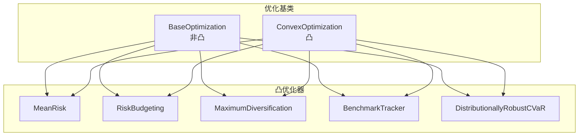
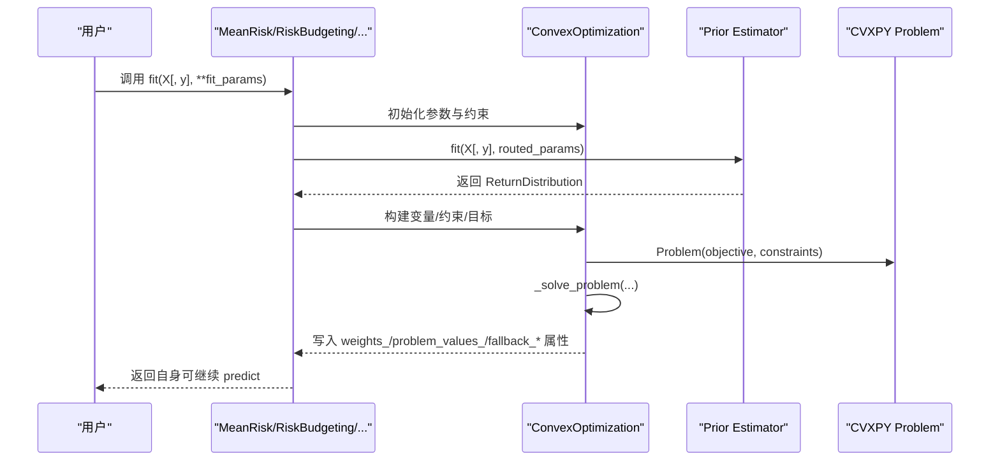
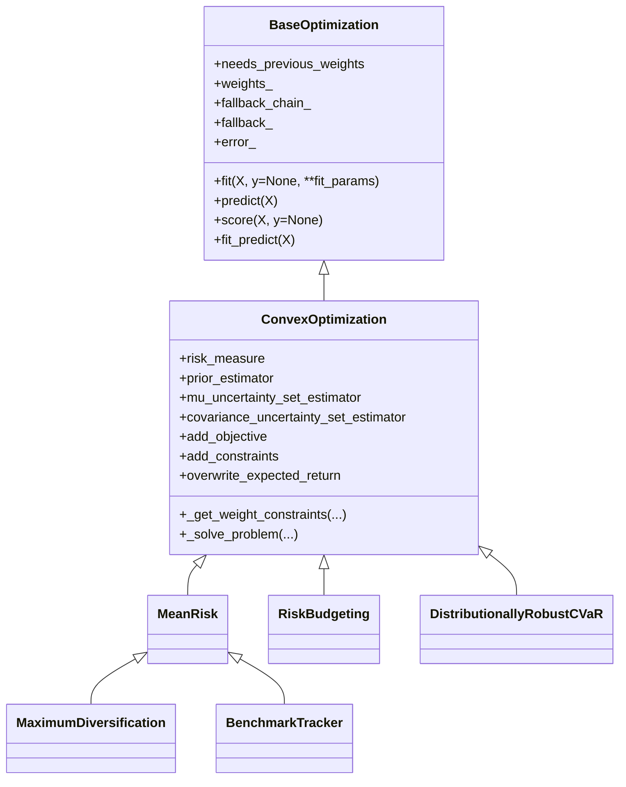
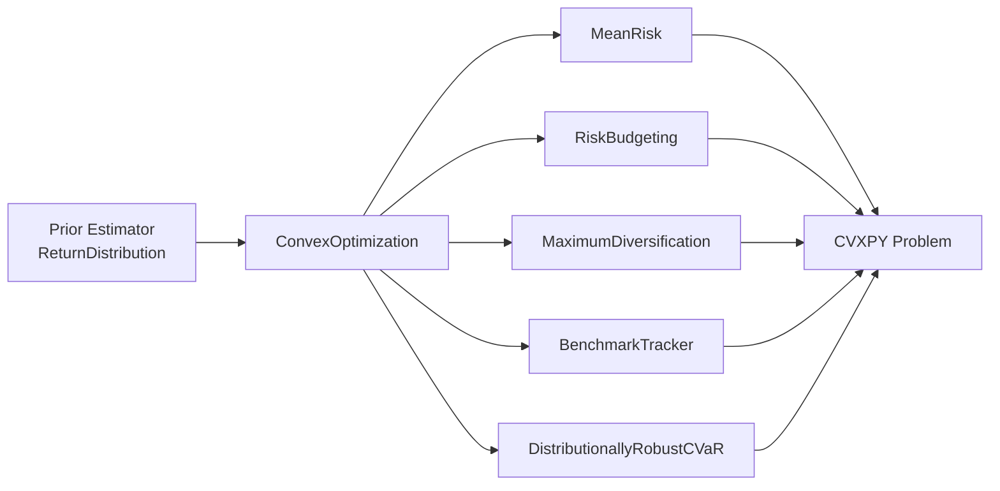

# 凸优化API

<cite>
**本文引用的文件**
- [src/skfolio/optimization/_base.py](file://src/skfolio/optimization/_base.py)
- [src/skfolio/optimization/convex/_base.py](file://src/skfolio/optimization/convex/_base.py)
- [src/skfolio/optimization/convex/_mean_risk.py](file://src/skfolio/optimization/convex/_mean_risk.py)
- [src/skfolio/optimization/convex/_risk_budgeting.py](file://src/skfolio/optimization/convex/_risk_budgeting.py)
- [src/skfolio/optimization/convex/_maximum_diversification.py](file://src/skfolio/optimization/convex/_maximum_diversification.py)
- [src/skfolio/optimization/convex/_benchmark_tracker.py](file://src/skfolio/optimization/convex/_benchmark_tracker.py)
- [src/skfolio/optimization/convex/_distributionally_robust.py](file://src/skfolio/optimization/convex/_distributionally_robust.py)
- [examples/mean_risk/plot_1_maximum_sharpe_ratio.py](file://examples/mean_risk/plot_1_maximum_sharpe_ratio.py)
- [examples/risk_budgeting/plot_1_risk_parity_variance.py](file://examples/risk_budgeting/plot_1_risk_parity_variance.py)
- [examples/distributionally_robust_cvar/plot_1_distributionally_robust_cvar.py](file://examples/distributionally_robust_cvar/plot_1_distributionally_robust_cvar.py)
- [examples/maximum_diversification/plot_1_maximum_diversification.py](file://examples/maximum_diversification/plot_1_maximum_diversification.py)
- [examples/mean_risk/plot_17_failure_and_fallbacks.py](file://examples/mean_risk/plot_17_failure_and_fallbacks.py)
- [examples/mean_risk/plot_9_uncertainty_set.py](file://examples/mean_risk/plot_9_uncertainty_set.py)
- [tests/test_optimization/test_convex/test_mean_risk.py](file://tests/test_optimization/test_convex/test_mean_risk.py)
- [tests/test_optimization/test_convex/test_risk_budgeting.py](file://tests/test_optimization/test_convex/test_risk_budgeting.py)
- [tests/test_optimization/test_convex/test_distributionally_robust_cvar.py](file://tests/test_optimization/test_convex/test_distributionally_robust_cvar.py)
</cite>

## 目录
1. [简介](#简介)
2. [项目结构](#项目结构)
3. [核心组件](#核心组件)
4. [架构总览](#架构总览)
5. [详细组件分析](#详细组件分析)
6. [依赖关系分析](#依赖关系分析)
7. [性能考量](#性能考量)
8. [故障排查指南](#故障排查指南)
9. [结论](#结论)
10. [附录](#附录)

## 简介
本文件为 skfolio 的凸优化模块提供系统化 API 文档，覆盖以下优化器类：
- MeanRisk
- RiskBudgeting
- MaximumDiversification
- BenchmarkTracker
- DistributionallyRobustCVaR

文档重点说明：
- 每个类的参数、属性与方法（fit、predict）
- 如何继承 BaseConvexOptimization 并实现标准凸优化问题建模
- 风险度量配置（如 CVaR、VaR、方差等）与约束条件（权重上下限、交易成本、管理费等）
- 与 scikit-learn Pipeline 和 GridSearchCV 的集成方式
- fallback 机制在求解失败时的行为

## 项目结构
凸优化模块位于 optimization/convex 子目录，基类定义于 optimization/convex/_base.py，各具体优化器分别实现于独立文件中；通用优化基类（非凸）位于 optimization/_base.py。

图表来源
- [src/skfolio/optimization/_base.py](file://src/skfolio/optimization/_base.py#L1-L200)
- [src/skfolio/optimization/convex/_base.py](file://src/skfolio/optimization/convex/_base.py#L1-L120)
- [src/skfolio/optimization/convex/_mean_risk.py](file://src/skfolio/optimization/convex/_mean_risk.py#L1-L120)
- [src/skfolio/optimization/convex/_risk_budgeting.py](file://src/skfolio/optimization/convex/_risk_budgeting.py#L1-L120)
- [src/skfolio/optimization/convex/_maximum_diversification.py](file://src/skfolio/optimization/convex/_maximum_diversification.py#L1-L120)
- [src/skfolio/optimization/convex/_benchmark_tracker.py](file://src/skfolio/optimization/convex/_benchmark_tracker.py#L1-L120)
- [src/skfolio/optimization/convex/_distributionally_robust.py](file://src/skfolio/optimization/convex/_distributionally_robust.py#L1-L120)

章节来源
- [src/skfolio/optimization/_base.py](file://src/skfolio/optimization/_base.py#L1-L200)
- [src/skfolio/optimization/convex/_base.py](file://src/skfolio/optimization/convex/_base.py#L1-L120)

## 核心组件
- BaseOptimization（非凸）：提供统一的 fit/predict/score 接口、回测与诊断能力、fallback 机制、错误处理策略（raise_on_failure）。
- ConvexOptimization（凸）：在 BaseOptimization 基础上，封装 CVXPY 表达式缓存、权重约束生成、风险度量动态分派、自定义目标/约束注入、求解与结果提取。

关键属性与行为（来自基类）：
- weights_：拟合后的资产权重（支持单组合或批量组合）
- predict：返回 Portfolio 或 Population，支持样本权重与回测链传播
- score：基于夏普比率的评分
- fallback_chain_ / fallback_ / error_：记录 fallback 尝试序列与最终成功者
- needs_previous_weights：是否需要在交叉验证/滚动重平衡中传递 previous_weights

章节来源
- [src/skfolio/optimization/_base.py](file://src/skfolio/optimization/_base.py#L1-L200)
- [src/skfolio/optimization/_base.py](file://src/skfolio/optimization/_base.py#L200-L450)
- [src/skfolio/optimization/_base.py](file://src/skfolio/optimization/_base.py#L450-L583)

## 架构总览
凸优化器通过 ConvexOptimization 统一构建 CVXPY 问题，按需注入预期收益、交易成本、管理费、线性约束、混合整数约束、自定义目标/约束等，然后调用求解器并提取结果。

图表来源
- [src/skfolio/optimization/convex/_base.py](file://src/skfolio/optimization/convex/_base.py#L1-L200)
- [src/skfolio/optimization/convex/_mean_risk.py](file://src/skfolio/optimization/convex/_mean_risk.py#L600-L760)
- [src/skfolio/optimization/convex/_risk_budgeting.py](file://src/skfolio/optimization/convex/_risk_budgeting.py#L480-L616)
- [src/skfolio/optimization/convex/_distributionally_robust.py](file://src/skfolio/optimization/convex/_distributionally_robust.py#L350-L476)

## 详细组件分析

### MeanRisk
- 角色：通用均值-风险优化器，支持多种目标函数（最小化风险、最大化收益、最大化效用、最大化比率）与多种风险度量。
- 关键参数（节选）：
  - objective_function：目标函数枚举
  - risk_measure：风险度量枚举（VARIANCE、CVAR、CDAR、MAX_DRAWDOWN 等）
  - risk_aversion：效用函数风险厌恶系数
  - efficient_frontier_size：有效前沿点数量（仅在最小化风险目标下可用）
  - target_weights / max_tracking_error / max_turnover：跟踪误差相关约束
  - 各类权重约束、预算约束、长/短仓上限、L1/L2 正则化、交易成本/管理费、线性约束、组约束、不确定性集等
- 关键属性：
  - weights_、problem_values_、prior_estimator_、problem_、fallback_、fallback_chain_、error_
- 方法：
  - fit：构建并求解 CVXPY 问题，支持自定义目标/约束与预期收益覆盖
  - predict：返回 Portfolio 或 Population
- 实现要点：
  - 使用动态命名约定按 risk_measure 分派风险函数（如 _risk_measure_risk）
  - 支持多目标/多约束组合，内部进行参数校验与约束拼装
  - 支持高效前沿（efficient_frontier_size）

章节来源
- [src/skfolio/optimization/convex/_mean_risk.py](file://src/skfolio/optimization/convex/_mean_risk.py#L1-L200)
- [src/skfolio/optimization/convex/_mean_risk.py](file://src/skfolio/optimization/convex/_mean_risk.py#L600-L760)
- [src/skfolio/optimization/convex/_mean_risk.py](file://src/skfolio/optimization/convex/_mean_risk.py#L760-L800)

### RiskBudgeting
- 角色：基于风险预算的凸优化，目标是最小化给定风险度量，同时满足预算对数约束与最小期望收益约束。
- 关键参数（节选）：
  - risk_measure：支持多种风险度量
  - risk_budget：每只资产的风险预算向量（默认等权）
  - min_return：最小期望收益约束
  - 权重约束、交易成本、管理费、线性约束、组约束、不确定性集等
- 关键属性：
  - weights_、problem_values_、prior_estimator_、problem_、fallback_、fallback_chain_、error_
- 方法：
  - fit：构建风险预算约束（预算向量的对数和≥0），拼装权重约束与风险度量，求解并写入结果
- 实现要点：
  - 强制长仓（不允许负权重），以保证凸性
  - 风险预算约束为 log 形式，确保预算与权重正相关

章节来源
- [src/skfolio/optimization/convex/_risk_budgeting.py](file://src/skfolio/optimization/convex/_risk_budgeting.py#L1-L120)
- [src/skfolio/optimization/convex/_risk_budgeting.py](file://src/skfolio/optimization/convex/_risk_budgeting.py#L480-L616)

### MaximumDiversification
- 角色：最大化多样化比率（加权波动率/总波动率）的特殊 MeanRisk 实现。
- 关键参数（节选）：
  - 与 MeanRisk 相同的约束与正则化项
- 关键属性：
  - weights_、problem_values_、prior_estimator_、problem_、fallback_、fallback_chain_、error_
- 方法：
  - fit：通过覆盖预期收益为“加权波动率”，委托 MeanRisk 完成求解
- 实现要点：
  - 本质是将目标函数中的期望收益替换为加权波动率

章节来源
- [src/skfolio/optimization/convex/_maximum_diversification.py](file://src/skfolio/optimization/convex/_maximum_diversification.py#L1-L120)
- [src/skfolio/optimization/convex/_maximum_diversification.py](file://src/skfolio/optimization/convex/_maximum_diversification.py#L470-L514)

### BenchmarkTracker
- 角色：基准跟踪器，直接在超额收益（资产收益 - 基准收益）上最小化指定风险度量。
- 关键参数（节选）：
  - risk_measure：用于超额收益的风险度量（默认标准差）
  - 其他约束与正则化项与 MeanRisk 类似
- 关键属性：
  - weights_、problem_values_、prior_estimator_、problem_、fallback_、fallback_chain_、error_
- 方法：
  - fit：校验 y（基准收益）非空，强制全仓（预算=1.0），将 X 转换为超额收益后委托 MeanRisk 求解
- 实现要点：
  - 超额收益定义确保预算约束下等价于跟踪误差最小化

章节来源
- [src/skfolio/optimization/convex/_benchmark_tracker.py](file://src/skfolio/optimization/convex/_benchmark_tracker.py#L1-L120)
- [src/skfolio/optimization/convex/_benchmark_tracker.py](file://src/skfolio/optimization/convex/_benchmark_tracker.py#L280-L320)

### DistributionallyRobustCVaR
- 角色：基于 Wasserstein 伞形的分布鲁棒 CVaR 最小化，适用于样本分布不确定性下的稳健优化。
- 关键参数（节选）：
  - cvar_beta：CVaR 置信水平
  - risk_aversion：效用函数风险厌恶系数
  - wasserstein_ball_radius：Wasserstein 球半径
  - 其他约束与不确定性集等
- 关键属性：
  - weights_、problem_values_、prior_estimator_、problem_、fallback_、fallback_chain_、error_
- 方法：
  - fit：构建 Wasserstein 伞形下的有限凸规划（包含辅助变量 u/v/s/lb/tau），求解并写入结果
- 实现要点：
  - 仅支持分段线性目标（CVaR），不支持交易成本与正则化
  - 建议使用能处理大量约束的求解器（如 Mosek）

章节来源
- [src/skfolio/optimization/convex/_distributionally_robust.py](file://src/skfolio/optimization/convex/_distributionally_robust.py#L1-L120)
- [src/skfolio/optimization/convex/_distributionally_robust.py](file://src/skfolio/optimization/convex/_distributionally_robust.py#L350-L476)

### 类关系图（代码级）

图表来源
- [src/skfolio/optimization/_base.py](file://src/skfolio/optimization/_base.py#L1-L200)
- [src/skfolio/optimization/convex/_base.py](file://src/skfolio/optimization/convex/_base.py#L1-L200)
- [src/skfolio/optimization/convex/_mean_risk.py](file://src/skfolio/optimization/convex/_mean_risk.py#L1-L120)
- [src/skfolio/optimization/convex/_risk_budgeting.py](file://src/skfolio/optimization/convex/_risk_budgeting.py#L1-L120)
- [src/skfolio/optimization/convex/_maximum_diversification.py](file://src/skfolio/optimization/convex/_maximum_diversification.py#L1-L120)
- [src/skfolio/optimization/convex/_benchmark_tracker.py](file://src/skfolio/optimization/convex/_benchmark_tracker.py#L1-L120)
- [src/skfolio/optimization/convex/_distributionally_robust.py](file://src/skfolio/optimization/convex/_distributionally_robust.py#L1-L120)

## 依赖关系分析
- 参数与约束依赖 Prior Estimator 提供的 ReturnDistribution（期望收益、协方差、收益矩阵等）
- 风险度量通过 ConvexOptimization 的动态分派机制选择对应 _risk_measure_risk
- 线性约束与组约束通过 equations_to_matrix 等工具转换为矩阵形式
- 混合整数约束（cardinality/group_cardinalities/threshold_*）要求特定求解器（如 SCIP/MOSEK/GUROBI/CPLEX）

图表来源
- [src/skfolio/optimization/convex/_base.py](file://src/skfolio/optimization/convex/_base.py#L1-L200)
- [src/skfolio/optimization/convex/_mean_risk.py](file://src/skfolio/optimization/convex/_mean_risk.py#L600-L760)
- [src/skfolio/optimization/convex/_risk_budgeting.py](file://src/skfolio/optimization/convex/_risk_budgeting.py#L480-L616)
- [src/skfolio/optimization/convex/_distributionally_robust.py](file://src/skfolio/optimization/convex/_distributionally_robust.py#L350-L476)

章节来源
- [src/skfolio/optimization/convex/_base.py](file://src/skfolio/optimization/convex/_base.py#L1-L200)
- [src/skfolio/optimization/convex/_mean_risk.py](file://src/skfolio/optimization/convex/_mean_risk.py#L600-L760)
- [src/skfolio/optimization/convex/_risk_budgeting.py](file://src/skfolio/optimization/convex/_risk_budgeting.py#L480-L616)
- [src/skfolio/optimization/convex/_distributionally_robust.py](file://src/skfolio/optimization/convex/_distributionally_robust.py#L350-L476)

## 性能考量
- 求解稳定性：优先使用 CLARABEL 求解器；对于高维/复杂约束问题，建议使用 Mosek 等商业求解器
- 缓存与缩放：ConvexOptimization 内置 CVXPY 表达式缓存与目标/约束缩放，有助于提升数值稳定性和收敛速度
- 混合整数约束：cardinality/group_cardinalities/threshold_* 需要 MIP 求解器，计算开销较大
- 不确定性集：Wasserstein 伞形引入额外变量与约束，注意求解时间与内存占用

[本节为通用指导，无需列出具体文件来源]

## 故障排查指南
- fallback 机制
  - fallback 可为单一估计器、估计器列表或字符串 "previous_weights"
  - 失败后依次尝试 fallback 列表，记录每一步结果到 fallback_chain_，成功后将权重回填至主估计器
  - 若所有 fallback 均失败且 raise_on_failure=True，则抛出异常；否则设置 weights_=None，并在 predict 返回 FailedPortfolio
- raise_on_failure
  - True：快速失败，适合生产环境
  - False：继续运行，适合研究/回测，predict 返回 FailedPortfolio 并保留诊断信息
- previous_weights
  - 当 fallback="previous_weights" 时，若提供有效权重则回退到该权重；否则报错
- 示例参考
  - 失败与回退示例展示了 fallback_chain_、fallback_、error_ 的使用
  - 不确定性集示例展示了与 GridSearchCV 的嵌套参数配置

章节来源
- [src/skfolio/optimization/_base.py](file://src/skfolio/optimization/_base.py#L120-L260)
- [examples/mean_risk/plot_17_failure_and_fallbacks.py](file://examples/mean_risk/plot_17_failure_and_fallbacks.py#L1-L200)
- [examples/mean_risk/plot_9_uncertainty_set.py](file://examples/mean_risk/plot_9_uncertainty_set.py#L100-L170)

## 结论
skfolio 的凸优化模块通过 ConvexOptimization 抽象出统一的 CVXPY 建模流程，MeanRisk、RiskBudgeting、MaximumDiversification、BenchmarkTracker、DistributionallyRobustCVaR 在此基础上分别实现不同的目标函数与约束组合。借助 BaseOptimization 的 fallback 与错误处理机制，可在生产与研究场景中灵活应对求解失败；结合 scikit-learn 的 Pipeline 与 GridSearchCV，可实现稳健的超参数搜索与回测评估。

[本节为总结性内容，无需列出具体文件来源]

## 附录

### API 一览（参数与属性）
- 共同参数（来自 ConvexOptimization）
  - risk_measure：风险度量枚举
  - prior_estimator：先验估计器
  - min_weights/max_weights：权重上下限
  - budget/min_budget/max_budget：投资预算约束
  - max_short/max_long：短仓/长仓上限
  - cardinality/group_cardinalities/threshold_*：混合整数约束
  - transaction_costs/management_fees：交易成本/管理费
  - previous_weights/target_weights：历史权重/目标权重
  - groups/linear_constraints/left_inequality/right_inequality：组与线性约束
  - l1_coef/l2_coef：L1/L2 正则化
  - mu_uncertainty_set_estimator/covariance_uncertainty_set_estimator：不确定性集
  - risk_free_rate/min_acceptable_return：无风险利率/可接受收益
  - cvar_beta/evar_beta/cdar_beta/edar_beta：各类风险度量置信水平
  - add_objective/add_constraints/overwrite_expected_return：自定义目标/约束/预期收益
  - solver/solver_params/scale_objective/scale_constraints/save_problem：求解器与缩放
  - portfolio_params/fallback/raise_on_failure：预测参数与回退策略
- 共同属性（来自 BaseOptimization）
  - weights_、n_features_in_、feature_names_in_、fallback_、fallback_chain_、error_

章节来源
- [src/skfolio/optimization/convex/_base.py](file://src/skfolio/optimization/convex/_base.py#L1-L200)
- [src/skfolio/optimization/_base.py](file://src/skfolio/optimization/_base.py#L1-L120)

### 风险度量与约束配置示例路径
- 配置不同风险度量（CVaR/VaR/方差等）
  - MeanRisk 示例：最大夏普比率
    - [examples/mean_risk/plot_1_maximum_sharpe_ratio.py](file://examples/mean_risk/plot_1_maximum_sharpe_ratio.py#L35-L60)
  - RiskBudgeting 示例：风险平价（方差）
    - [examples/risk_budgeting/plot_1_risk_parity_variance.py](file://examples/risk_budgeting/plot_1_risk_parity_variance.py#L25-L40)
  - 分布鲁棒 CVaR
    - [examples/distributionally_robust_cvar/plot_1_distributionally_robust_cvar.py](file://examples/distributionally_robust_cvar/plot_1_distributionally_robust_cvar.py#L40-L80)
  - 多样化比率
    - [examples/maximum_diversification/plot_1_maximum_diversification.py](file://examples/maximum_diversification/plot_1_maximum_diversification.py#L25-L40)
- 约束条件（权重上下限、交易成本、管理费等）
  - MeanRisk 测试用例展示了多种约束组合与精度控制
    - [tests/test_optimization/test_convex/test_mean_risk.py](file://tests/test_optimization/test_convex/test_mean_risk.py#L100-L170)
  - RiskBudgeting 测试用例展示了组约束与交易成本/管理费的影响
    - [tests/test_optimization/test_convex/test_risk_budgeting.py](file://tests/test_optimization/test_convex/test_risk_budgeting.py#L130-L170)
  - DistributionallyRobustCVaR 测试用例展示了与 MeanRisk 的一致性与样本权重影响
    - [tests/test_optimization/test_convex/test_distributionally_robust_cvar.py](file://tests/test_optimization/test_convex/test_distributionally_robust_cvar.py#L1-L127)

### 与 scikit-learn 集成
- Pipeline：优化器作为步骤，配合预处理与评估指标
- GridSearchCV/RandomizedSearchCV：对模型参数（含不确定性集嵌套参数）进行网格/随机搜索
- 回测：结合 WalkForward/cross_val_predict 进行滚动预测与诊断

章节来源
- [examples/mean_risk/plot_9_uncertainty_set.py](file://examples/mean_risk/plot_9_uncertainty_set.py#L120-L170)
- [examples/mean_risk/plot_17_failure_and_fallbacks.py](file://examples/mean_risk/plot_17_failure_and_fallbacks.py#L130-L170)