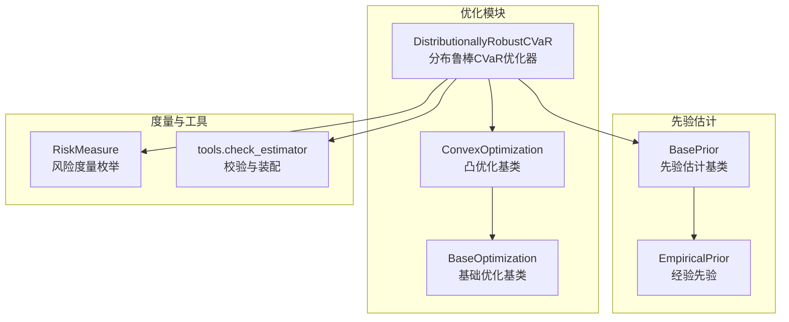
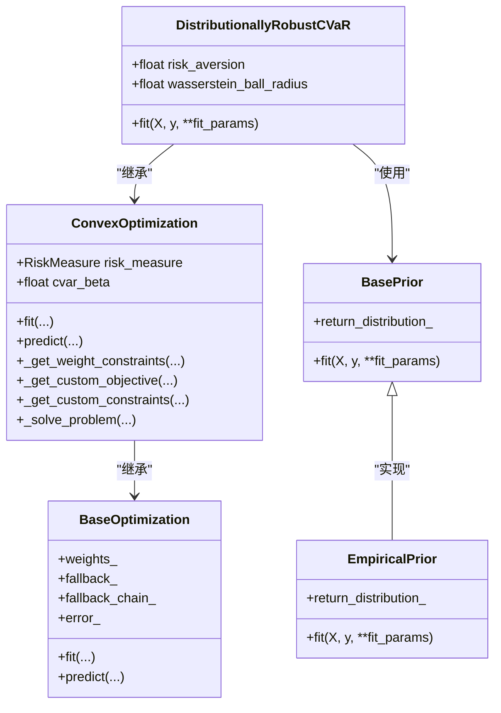
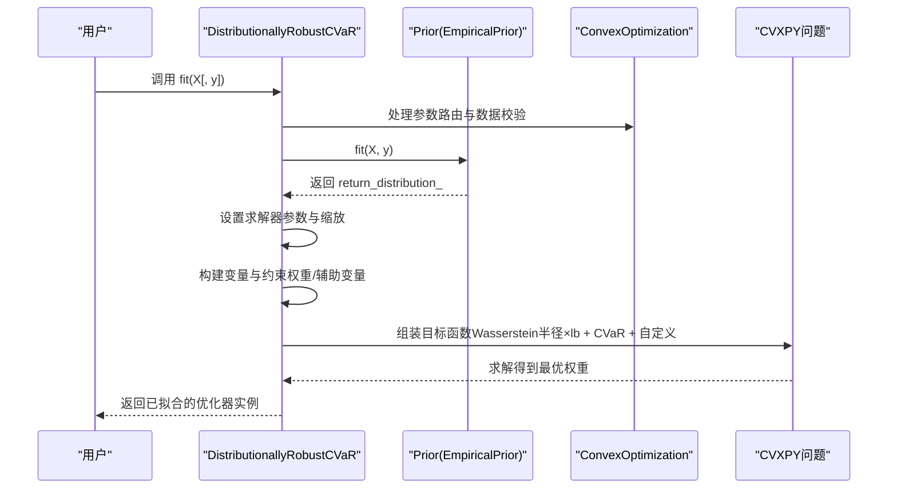
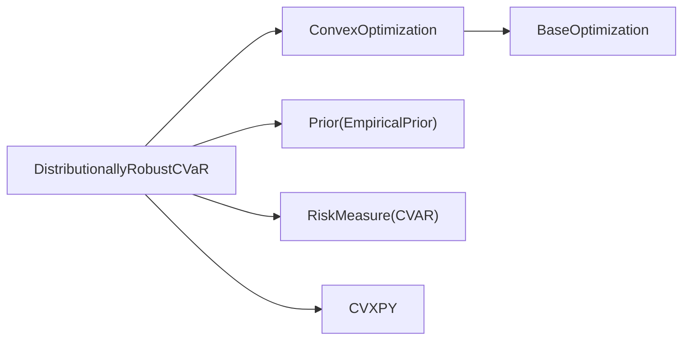

# 分布鲁棒CVaR优化

<cite>
**本文引用的文件**
- [src/skfolio/optimization/convex/_distributionally_robust.py](file://src/skfolio/optimization/convex/_distributionally_robust.py)
- [examples/distributionally_robust_cvar/plot_1_distributionally_robust_cvar.py](file://examples/distributionally_robust_cvar/plot_1_distributionally_robust_cvar.py)
- [tests/test_optimization/test_convex/test_distributionally_robust_cvar.py](file://tests/test_optimization/test_convex/test_distributionally_robust_cvar.py)
- [src/skfolio/optimization/convex/_base.py](file://src/skfolio/optimization/convex/_base.py)
- [src/skfolio/optimization/_base.py](file://src/skfolio/optimization/_base.py)
- [src/skfolio/measures/_measures.py](file://src/skfolio/measures/_measures.py)
- [src/skfolio/prior/_base.py](file://src/skfolio/prior/_base.py)
- [src/skfolio/prior/_empirical.py](file://src/skfolio/prior/_empirical.py)
- [src/skfolio/utils/tools.py](file://src/skfolio/utils/tools.py)
</cite>

## 目录
1. [简介](#简介)
2. [项目结构](#项目结构)
3. [核心组件](#核心组件)
4. [架构总览](#架构总览)
5. [详细组件分析](#详细组件分析)
6. [依赖关系分析](#依赖关系分析)
7. [性能考量](#性能考量)
8. [故障排查指南](#故障排查指南)
9. [结论](#结论)
10. [附录](#附录)

## 简介
本文件为 skfolio 的分布鲁棒 CVaR 优化器（DistributionallyRobustCVaR）提供完整的 API 文档与使用说明。该优化器的核心思想是在 Wasserstein 距离度量下构造一个“最坏情况分布”的不确定性集合（Wasserstein 球），并在该集合中寻找使 CVaR 最小化的投资组合权重，从而提升模型对训练样本所代表的数据不确定性与潜在分布偏移的鲁棒性。文档重点解释以下内容：
- 关键参数 wasserstein_ball_radius（Wasserstein 球半径）对鲁棒性与权重分布的影响；
- 风险厌恶系数 risk_aversion 在效用最大化目标中的作用；
- 当前实现的限制：仅支持分段线性函数，因此不支持交易成本与正则化；
- 提供代码示例，展示如何配置该优化器；
- 讨论其在压力测试与稳健投资组合构建中的应用。

## 项目结构
DistributionallyRobustCVaR 属于凸优化模块的一部分，位于优化子包的凸优化目录中；同时它继承自通用的凸优化基类，复用大量通用约束、求解与回测能力。示例与测试分别位于 examples 与 tests 目录中，便于快速上手与验证。

图表来源
- [src/skfolio/optimization/convex/_distributionally_robust.py](file://src/skfolio/optimization/convex/_distributionally_robust.py#L22-L349)
- [src/skfolio/optimization/convex/_base.py](file://src/skfolio/optimization/convex/_base.py#L64-L200)
- [src/skfolio/optimization/_base.py](file://src/skfolio/optimization/_base.py#L39-L120)
- [src/skfolio/prior/_base.py](file://src/skfolio/prior/_base.py#L1-L200)
- [src/skfolio/prior/_empirical.py](file://src/skfolio/prior/_empirical.py#L1-L200)
- [src/skfolio/measures/_measures.py](file://src/skfolio/measures/_measures.py#L1-L200)
- [src/skfolio/utils/tools.py](file://src/skfolio/utils/tools.py#L1-L200)

章节来源
- [src/skfolio/optimization/convex/_distributionally_robust.py](file://src/skfolio/optimization/convex/_distributionally_robust.py#L22-L349)
- [src/skfolio/optimization/convex/_base.py](file://src/skfolio/optimization/convex/_base.py#L64-L200)
- [src/skfolio/optimization/_base.py](file://src/skfolio/optimization/_base.py#L39-L120)

## 核心组件
- DistributionallyRobustCVaR：在 Wasserstein 球内寻找最坏情况分布下的 CVaR 最小化投资组合。通过引入额外变量与约束，将分布鲁棒问题转化为有限维凸规划问题。
- ConvexOptimization：所有凸优化器的基类，提供统一的约束、先验估计、求解流程与回退机制。
- BaseOptimization：提供 fit 的包装与回退链、错误处理等通用能力。
- 先验估计器 Prior Estimator：默认使用经验先验 EmpiricalPrior，也可替换为其他先验估计器（如熵池化）以引入样本权重或观点。
- 风险度量 RiskMeasure：CVaR 枚举值用于统一风险度量接口。

章节来源
- [src/skfolio/optimization/convex/_distributionally_robust.py](file://src/skfolio/optimization/convex/_distributionally_robust.py#L22-L349)
- [src/skfolio/optimization/convex/_base.py](file://src/skfolio/optimization/convex/_base.py#L64-L200)
- [src/skfolio/optimization/_base.py](file://src/skfolio/optimization/_base.py#L39-L120)
- [src/skfolio/prior/_base.py](file://src/skfolio/prior/_base.py#L1-L200)
- [src/skfolio/prior/_empirical.py](file://src/skfolio/prior/_empirical.py#L1-L200)
- [src/skfolio/measures/_measures.py](file://src/skfolio/measures/_measures.py#L1-L200)

## 架构总览
下面的类图展示了 DistributionallyRobustCVaR 与其父类、先验估计器及工具之间的关系。

图表来源
- [src/skfolio/optimization/convex/_distributionally_robust.py](file://src/skfolio/optimization/convex/_distributionally_robust.py#L22-L349)
- [src/skfolio/optimization/convex/_base.py](file://src/skfolio/optimization/convex/_base.py#L64-L200)
- [src/skfolio/optimization/_base.py](file://src/skfolio/optimization/_base.py#L39-L120)
- [src/skfolio/prior/_base.py](file://src/skfolio/prior/_base.py#L1-L200)
- [src/skfolio/prior/_empirical.py](file://src/skfolio/prior/_empirical.py#L1-L200)

## 详细组件分析

### DistributionallyRobustCVaR 类与参数
- 核心思想与数学形式
  - 在 Wasserstein 球内寻找最坏情况分布，使 CVaR 最小化。该问题可被重写为有限维凸规划（当目标函数为分段线性时，例如 CVaR）。
  - 通过引入辅助变量与无穷范数约束，将分布鲁棒约束转化为有限个约束，从而可用标准凸优化求解器求解。
- 关键参数
  - risk_aversion：风险厌恶系数，用于效用最大化目标（期望收益减去风险厌恶系数乘以 CVaR）。增大 risk_aversion 会更偏向保守策略，降低 CVaR，但可能牺牲一定收益。
  - wasserstein_ball_radius：Wasserstein 球半径，控制不确定性集的大小。半径越大，不确定性越高，优化结果越接近等权配置，鲁棒性增强但可能牺牲收益。
  - cvar_beta：CVaR 置信水平，默认 0.95，决定 CVaR 的分位点。
  - prior_estimator：先验估计器，默认经验先验（EmpiricalPrior），可替换为其他先验估计器（如熵池化）以引入样本权重或观点。
  - 权重与预算约束：min_weights、max_weights、budget、min_budget、max_budget、max_short、max_long 等，支持字典与数组形式的资产级约束。
  - 线性约束：linear_constraints 支持字符串表达式与 groups；left_inequality/right_inequality 支持矩阵不等式。
  - 自定义项：add_objective、add_constraints、overwrite_expected_return 可扩展目标与约束。
  - 求解器：solver 默认 CLARABEL，支持设置 solver_params、scale_objective、scale_constraints、save_problem。
  - 回退与错误处理：fallback、previous_weights、raise_on_failure。
- 限制
  - 仅支持分段线性函数，因此不支持交易成本与正则化项。若需要交易成本或正则化，请改用 MeanRisk 等其他优化器。

章节来源
- [src/skfolio/optimization/convex/_distributionally_robust.py](file://src/skfolio/optimization/convex/_distributionally_robust.py#L22-L349)
- [src/skfolio/optimization/convex/_base.py](file://src/skfolio/optimization/convex/_base.py#L64-L200)
- [src/skfolio/optimization/_base.py](file://src/skfolio/optimization/_base.py#L39-L120)

### fit 流程与数学建模
fit 方法的主要步骤如下：
1. 参数路由与数据校验：使用元数据路由与 sklearn 校验，确保输入格式正确。
2. 先验估计：默认使用经验先验估计资产回报分布（包含样本权重、协方差等），也可替换为其他先验估计器。
3. 求解器与缩放：根据求解器类型设置默认参数与目标/约束缩放。
4. 变量与约束构建：
   - 定义权重变量 w，辅助变量 u、v、lb、tau、s。
   - 添加权重约束（来自父类）。
   - 添加 CVaR 相关的非线性约束（通过无穷范数与辅助变量）。
   - 添加自定义目标与约束。
5. 目标函数：
   - 由三部分组成：Wasserstein 球半径 × 下界变量 + CVaR 风险项 + 自定义目标项。
6. 求解并保存结果：调用通用求解流程，得到最优权重与问题值。

图表来源
- [src/skfolio/optimization/convex/_distributionally_robust.py](file://src/skfolio/optimization/convex/_distributionally_robust.py#L352-L476)
- [src/skfolio/optimization/convex/_base.py](file://src/skfolio/optimization/convex/_base.py#L1863-L1913)
- [src/skfolio/prior/_empirical.py](file://src/skfolio/prior/_empirical.py#L1-L200)

章节来源
- [src/skfolio/optimization/convex/_distributionally_robust.py](file://src/skfolio/optimization/convex/_distributionally_robust.py#L352-L476)

### 参数影响与行为解读
- wasserstein_ball_radius 对鲁棒性的影响
  - 半径越大，不确定性集越大，优化器越保守，权重越接近等权配置，鲁棒性增强但可能牺牲收益与 CVaR。
  - 示例脚本展示了不同半径下权重分布的变化趋势。
- risk_aversion 对效用函数的作用
  - 在效用最大化目标中，risk_aversion 控制“收益-风险”权衡。增大 risk_aversion 会使优化更偏向低风险策略，降低 CVaR，但平均收益也可能下降。
  - 测试用例对比了在 wasserstein_ball_radius=0 时，DistributionallyRobustCVaR 与 MeanRisk 的效用最大化目标得到相同权重，验证了等价性。

章节来源
- [examples/distributionally_robust_cvar/plot_1_distributionally_robust_cvar.py](file://examples/distributionally_robust_cvar/plot_1_distributionally_robust_cvar.py#L1-L111)
- [tests/test_optimization/test_convex/test_distributionally_robust_cvar.py](file://tests/test_optimization/test_convex/test_distributionally_robust_cvar.py#L18-L42)

### 代码示例与最佳实践
- 基本配置
  - 使用默认经验先验与 CVaR 置信水平，设置 risk_aversion 与 wasserstein_ball_radius。
  - 可选地指定预算、权重上下限、线性约束、求解器与回退策略。
- 压力测试与稳健投资组合构建
  - 通过逐步增大 wasserstein_ball_radius，观察权重向等权收敛的趋势，评估不同不确定性假设下的稳健性。
  - 将 DistributionallyRobustCVaR 与 EqualWeighted 进行比较，评估在测试集上的累计收益与组合构成差异。

章节来源
- [examples/distributionally_robust_cvar/plot_1_distributionally_robust_cvar.py](file://examples/distributionally_robust_cvar/plot_1_distributionally_robust_cvar.py#L52-L111)
- [tests/test_optimization/test_convex/test_distributionally_robust_cvar.py](file://tests/test_optimization/test_convex/test_distributionally_robust_cvar.py#L18-L42)

## 依赖关系分析
- 组件耦合与职责分离
  - DistributionallyRobustCVaR 专注于分布鲁棒 CVaR 的建模与求解，将通用逻辑委托给 ConvexOptimization 与 BaseOptimization。
  - 先验估计器与风险度量通过统一接口注入，便于替换与扩展。
- 外部依赖
  - CVXPY 用于构建与求解凸优化问题。
  - 可选的商业求解器（如 Mosek）在高约束规模场景下表现更佳。
- 循环依赖
  - 未发现循环依赖；模块间通过接口与继承保持清晰边界。

图表来源
- [src/skfolio/optimization/convex/_distributionally_robust.py](file://src/skfolio/optimization/convex/_distributionally_robust.py#L22-L349)
- [src/skfolio/optimization/convex/_base.py](file://src/skfolio/optimization/convex/_base.py#L64-L200)
- [src/skfolio/optimization/_base.py](file://src/skfolio/optimization/_base.py#L39-L120)
- [src/skfolio/prior/_empirical.py](file://src/skfolio/prior/_empirical.py#L1-L200)
- [src/skfolio/measures/_measures.py](file://src/skfolio/measures/_measures.py#L1-L200)

## 性能考量
- 求解器选择
  - 默认 CLARABEL 具备较好的数值稳定性与性能；对于大规模约束问题，建议使用 Mosek 等商业求解器。
- 缩放与容差
  - 可通过 scale_objective 与 scale_constraints 调整目标与约束的缩放，提高数值精度与收敛速度。
  - solver_params 中的容差参数（如 tol_gap_abs、tol_gap_rel）可按需调整。
- 数据规模
  - Wasserstein 球内的约束数量随样本数线性增长，样本过多时建议降采样或使用更快的求解器。

[本节为一般性指导，无需列出具体文件来源]

## 故障排查指南
- 常见问题
  - 求解失败：检查 solver 是否可用、参数是否合理、样本权重是否为空、预算与约束是否冲突。
  - 结果不稳定：尝试增大 scale_objective/scale_constraints，或切换到更稳健的求解器。
  - 回退链：启用 fallback 并设置 previous_weights，以便在主优化失败时自动回退到历史权重。
- 错误处理
  - raise_on_failure 控制异常抛出策略；关闭时会记录 error_ 与 fallback_chain_，便于诊断。
- 测试参考
  - 测试覆盖了不同半径下的权重一致性、样本权重与观点引入后的权重变化，以及元数据路由场景。

章节来源
- [src/skfolio/optimization/_base.py](file://src/skfolio/optimization/_base.py#L128-L200)
- [tests/test_optimization/test_convex/test_distributionally_robust_cvar.py](file://tests/test_optimization/test_convex/test_distributionally_robust_cvar.py#L18-L127)

## 结论
DistributionallyRobustCVaR 通过在 Wasserstein 球内寻找最坏分布下的 CVaR 最小化，有效提升了模型对数据不确定性与分布偏移的鲁棒性。其中：
- wasserstein_ball_radius 控制不确定性集大小，半径越大越保守；
- risk_aversion 控制效用函数中的风险偏好；
- 当前实现限制为分段线性函数，不支持交易成本与正则化；
- 建议结合压力测试与回退策略，构建稳健的投资组合。

[本节为总结性内容，无需列出具体文件来源]

## 附录

### API 参考（摘要）
- 主要参数
  - risk_aversion：风险厌恶系数（默认 1.0）
  - wasserstein_ball_radius：Wasserstein 球半径（默认 0.02）
  - cvar_beta：CVaR 置信水平（默认 0.95）
  - prior_estimator：先验估计器（默认 EmpiricalPrior）
  - 权重与预算约束：min_weights、max_weights、budget、min_budget、max_budget、max_short、max_long
  - 线性约束：linear_constraints、groups、left_inequality、right_inequality
  - 自定义项：add_objective、add_constraints、overwrite_expected_return
  - 求解器：solver、solver_params、scale_objective、scale_constraints、save_problem
  - 回退与错误处理：fallback、previous_weights、raise_on_failure
- 方法
  - fit(X, y=None, **fit_params)：拟合并返回优化器实例
  - predict(X)：基于拟合权重生成投资组合对象
- 属性
  - weights_：资产权重
  - problem_values_：问题表达式的取值
  - prior_estimator_：已拟合的先验估计器
  - problem_：保存的问题对象（当 save_problem=True）

章节来源
- [src/skfolio/optimization/convex/_distributionally_robust.py](file://src/skfolio/optimization/convex/_distributionally_robust.py#L22-L349)
- [src/skfolio/optimization/convex/_base.py](file://src/skfolio/optimization/convex/_base.py#L64-L200)
- [src/skfolio/optimization/_base.py](file://src/skfolio/optimization/_base.py#L39-L120)