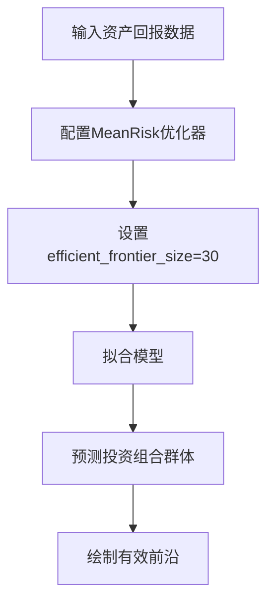

# 均值-风险优化

<cite>
**本文档中引用的文件**   
- [mean_risk.py](file://src/skfolio/optimization/convex/_mean_risk.py)
- [convex/_base.py](file://src/skfolio/optimization/convex/_base.py)
- [plot_3_efficient_frontier.py](file://examples/mean_risk/plot_3_efficient_frontier.py)
- [test_mean_risk.py](file://tests/test_optimization/test_convex/test_mean_risk.py)
</cite>

## 目录
1. [简介](#简介)
2. [参数详解](#参数详解)
3. [属性说明](#属性说明)
4. [方法说明](#方法说明)
5. [目标函数与优化问题](#目标函数与优化问题)
6. [有效前沿计算](#有效前沿计算)
7. [风险约束](#风险约束)
8. [代码示例](#代码示例)
9. [与scikit-learn的集成](#与scikit-learn的集成)
10. [结论](#结论)

## 简介
`MeanRisk` 是 skfolio 库中的一个均值-风险优化器，用于解决投资组合优化问题。它支持四种不同的目标函数：最小化风险、最大化收益、最大化效用和最大化比率。该优化器可以使用多种风险度量（如方差、CVaR等）并施加各种约束条件（如权重上下限、预算约束、交易成本等）。通过配置不同的参数，用户可以构建出符合特定需求的投资组合。

**Section sources**
- [mean_risk.py](file://src/skfolio/optimization/convex/_mean_risk.py#L30-L1215)

## 参数详解
`MeanRisk` 类提供了丰富的参数来定制优化过程。以下是主要参数的详细说明：

- **objective_function**: 目标函数类型，可选值包括 `MINIMIZE_RISK`、`MAXIMIZE_RETURN`、`MAXIMIZE_UTILITY` 和 `MAXIMIZE_RATIO`。
- **risk_measure**: 风险度量方式，支持多种风险指标，如方差、半方差、标准差、CVaR等。
- **risk_aversion**: 风险厌恶系数，仅在 `objective_function=MAXIMIZE_UTILITY` 时使用。
- **efficient_frontier_size**: 当设置此参数时，表示要计算的有效前沿上帕累托最优投资组合的数量。此参数只能与 `objective_function = MINIMIZE_RISK` 一起使用。
- **min_weights** 和 **max_weights**: 分别定义资产权重的下限和上限。
- **budget**: 投资预算，即所有权重之和。默认值为1.0，表示完全投资。
- **transaction_costs** 和 **management_fees**: 分别表示交易成本和管理费用，会影响投资组合的预期收益。
- **previous_weights**: 之前的权重，用于计算交易成本和周转率。
- **target_weights**: 目标权重，当提供时，风险度量将基于与这些目标权重的偏差进行计算。
- **l1_coef** 和 **l2_coef**: L1和L2正则化系数，用于增加模型的稳健性。
- **mu_uncertainty_set_estimator** 和 **covariance_uncertainty_set_estimator**: 分别用于建模预期收益和协方差矩阵的不确定性集。
- **linear_constraints**: 线性约束条件。
- **groups**: 资产组别，用于线性约束中的组别引用。
- **risk_free_rate**: 无风险利率。
- **max_tracking_error**: 跟踪误差的上限约束。
- **max_turnover**: 周转率的上限约束。
- **solver**: 求解器名称，默认为 "CLARABEL"。

**Section sources**
- [mean_risk.py](file://src/skfolio/optimization/convex/_mean_risk.py#L106-L592)

## 属性说明
`MeanRisk` 类在拟合后会生成以下属性：

- **weights_**: 资产的权重。
- **problem_values_**: 从CVXPY问题中检索到的表达式值。
- **prior_estimator_**: 拟合后的先验估计器。
- **mu_uncertainty_set_estimator_**: 拟合后的预期收益不确定性集估计器（如果提供）。
- **covariance_uncertainty_set_estimator_**: 拟合后的协方差不确定性集估计器（如果提供）。
- **problem_**: 用于优化的CVXPY问题（仅当 `save_problem` 设置为 `True` 时）。
- **n_features_in_**: 在 `fit` 过程中看到的资产数量。
- **feature_names_in_**: 在 `fit` 过程中看到的资产名称（仅当 `X` 具有字符串类型的资产名称时定义）。
- **fallback_**: 产生最终结果的回退估计器实例或字符串 `"previous_weights"`。如果没有使用回退，则为 `None`。
- **fallback_chain_**: 描述优化回退尝试的序列。每个元素是一个 `(estimator_repr, outcome)` 对，其中 `estimator_repr` 是主估计器或回退的字符串表示形式，`outcome` 是 `"success"` 如果该步骤产生了有效解，否则是字符串化的错误消息。对于没有回退的成功拟合，此值为 `None`。
- **error_**: 当 `fit` 失败时捕获的错误消息（对于多投资组合输出（`weights_` 是二维的），这是一个与投资组合对齐的列表）。

**Section sources**
- [mean_risk.py](file://src/skfolio/optimization/convex/_mean_risk.py#L595-L637)

## 方法说明
`MeanRisk` 类提供了以下方法：

- **fit(X, y=None, **fit_params)**: 拟合模型。`X` 是资产回报数据，`y` 是可选的目标数据。
- **predict(X)**: 根据拟合的权重预测投资组合。如果 `name` 未在投资组合参数中提供，则使用估计器类名。
- **score(X, y=None)**: 使用夏普比率计算预测得分。如果预测是单个投资组合，则得分为其夏普比率；如果是投资组合群体，则得分为所有投资组合夏普比率的平均值。
- **fit_predict(X)**: 在 `X` 上执行 `fit` 并返回基于拟合权重的预测投资组合或投资组合群体。

**Section sources**
- [mean_risk.py](file://src/skfolio/optimization/convex/_mean_risk.py#L284-L423)

## 目标函数与优化问题
`MeanRisk` 支持四种目标函数，每种都对应一个特定的数学优化问题：

### 最小化风险
最小化风险的目标函数如下：
$$
\begin{cases}
\begin{aligned}
&\min_{w} & & risk_{i}(w) \\
&\text{s.t.} & & w^T \cdot \mu \ge min\_return \\
& & & A \cdot w \ge b \\
& & & risk_{j}(w) \le max\_risk_{j} \quad \forall \; j \ne i
\end{aligned}
\end{cases}
$$

### 最大化预期收益
最大化预期收益的目标函数如下：
$$
\begin{cases}
\begin{aligned}
&\max_{w} & & w^T \cdot \mu \\
&\text{s.t.} & & risk_{i}(w) \le max\_risk_{i} \\
& & & A \cdot w \ge b \\
& & & risk_{j}(w) \le max\_risk_{j} \quad \forall \; j \ne i
\end{aligned}
\end{cases}
$$

### 最大化效用
最大化效用的目标函数如下：
$$
\begin{cases}
\begin{aligned}
&\max_{w} & & w^T \cdot \mu - \lambda \times risk_{i}(w)\\
&\text{s.t.} & & risk_{i}(w) \le max\_risk_{i} \\
& & & w^T \cdot \mu \ge min\_return \\
& & & A \cdot w \ge b \\
& & & risk_{j}(w) \le max\_risk_{j} \quad \forall \; j \ne i
\end{aligned}
\end{cases}
$$

### 最大化比率
最大化比率的目标函数如下：
$$
\begin{cases}
\begin{aligned}
&\max_{w} & & \frac{w^T \cdot \mu - r_{f}}{risk_{i}(w)}\\
&\text{s.t.} & & risk_{i}(w) \le max\_risk_{i} \\
& & & w^T \cdot \mu \ge min\_return \\
& & & A \cdot w \ge b \\
& & & risk_{j}(w) \le max\_risk_{j} \quad \forall \; j \ne i
\end{aligned}
\end{cases}
$$

其中 $risk_{i}$ 可以是以下风险度量之一：平均绝对偏差、第一下偏矩、方差、半方差、CVaR（条件风险价值）、EVaR（熵风险价值）、最差实现（最差回报）、CDaR（条件回撤风险）、最大回撤、平均回撤、EDaR（熵回撤风险）、溃疡指数、基尼均值差。

**Section sources**
- [mean_risk.py](file://src/skfolio/optimization/convex/_mean_risk.py#L34-L96)

## 有效前沿计算
`efficient_frontier_size` 参数用于计算有效前沿上的帕累托最优投资组合数量。当此参数被设置时，优化器会在给定的风险水平下找到多个投资组合，从而形成一条有效前沿曲线。这有助于投资者在不同风险水平下选择最合适的投资组合。

例如，在 `plot_3_efficient_frontier.py` 示例中，通过设置 `efficient_frontier_size=30`，可以找到30个位于有效前沿上的投资组合，并绘制它们的风险-收益散点图。



**Diagram sources**
- [plot_3_efficient_frontier.py](file://examples/mean_risk/plot_3_efficient_frontier.py#L36-L41)

**Section sources**
- [plot_3_efficient_frontier.py](file://examples/mean_risk/plot_3_efficient_frontier.py#L36-L41)

## 风险约束
`MeanRisk` 允许通过多种参数施加额外的风险约束。例如，`max_tracking_error` 参数可以用来限制跟踪误差，`max_turnover` 参数可以用来限制周转率。此外，还可以通过 `max_mean_absolute_deviation`、`max_variance` 等参数对特定风险度量设置上限约束。

这些约束条件可以帮助投资者更好地控制投资组合的风险暴露，确保其符合特定的投资策略或监管要求。

**Section sources**
- [mean_risk.py](file://src/skfolio/optimization/convex/_mean_risk.py#L434-L495)

## 代码示例
以下是一个使用 `MeanRisk` 进行均值-方差优化的代码示例：

```python
import numpy as np
from skfolio import RiskMeasure
from skfolio.datasets import load_sp500_dataset
from skfolio.optimization import MeanRisk
from skfolio.preprocessing import prices_to_returns

# 加载S&P 500数据集
prices = load_sp500_dataset()
X = prices_to_returns(prices)

# 创建MeanRisk模型并拟合
model = MeanRisk(
    risk_measure=RiskMeasure.VARIANCE,
    efficient_frontier_size=30,
    portfolio_params=dict(name="Variance"),
)
model.fit(X)

# 预测投资组合群体
population = model.predict(X)

# 绘制风险-收益图
population.plot_measures(
    x=RiskMeasure.ANNUALIZED_STANDARD_DEVIATION,
    y=PerfMeasure.ANNUALIZED_MEAN,
    color_scale=RatioMeasure.ANNUALIZED_SHARPE_RATIO,
)
```

**Section sources**
- [plot_3_efficient_frontier.py](file://examples/mean_risk/plot_3_efficient_frontier.py#L36-L95)

## 与scikit-learn的集成
`MeanRisk` 优化器可以无缝集成到 scikit-learn 的 Pipeline 和 GridSearchCV 中。这意味着用户可以利用 scikit-learn 提供的强大工具来进行超参数调优和交叉验证。

例如，可以通过 `GridSearchCV` 来寻找最佳的正则化系数 `l2_coef`，以优化投资组合的表现。

```python
from sklearn.model_selection import GridSearchCV
from skfolio.metrics import make_scorer
from skfolio.optimization import MeanRisk

# 定义参数网格
param_grid = {"l2_coef": [0.001, 0.01]}

# 创建GridSearchCV对象
grid_search = GridSearchCV(
    estimator=MeanRisk(),
    cv=5,
    n_jobs=-1,
    param_grid=param_grid,
    scoring=make_scorer(RatioMeasure.CDAR_RATIO),
)

# 拟合并获取最佳参数
grid_search.fit(X)
best_params = grid_search.best_params_
```

**Section sources**
- [test_mean_risk.py](file://tests/test_optimization/test_convex/test_mean_risk.py#L47-L86)

## 结论
`MeanRisk` 是一个功能强大的均值-风险优化器，支持多种目标函数和风险度量。通过灵活的参数配置，用户可以构建出满足特定需求的投资组合。此外，它还能够与 scikit-learn 的工具链无缝集成，便于进行超参数调优和模型评估。无论是学术研究还是实际应用，`MeanRisk` 都是一个非常有价值的工具。

**Section sources**
- [mean_risk.py](file://src/skfolio/optimization/convex/_mean_risk.py#L30-L1215)
- [plot_3_efficient_frontier.py](file://examples/mean_risk/plot_3_efficient_frontier.py#L1-L104)
- [test_mean_risk.py](file://tests/test_optimization/test_convex/test_mean_risk.py#L221-L1632)