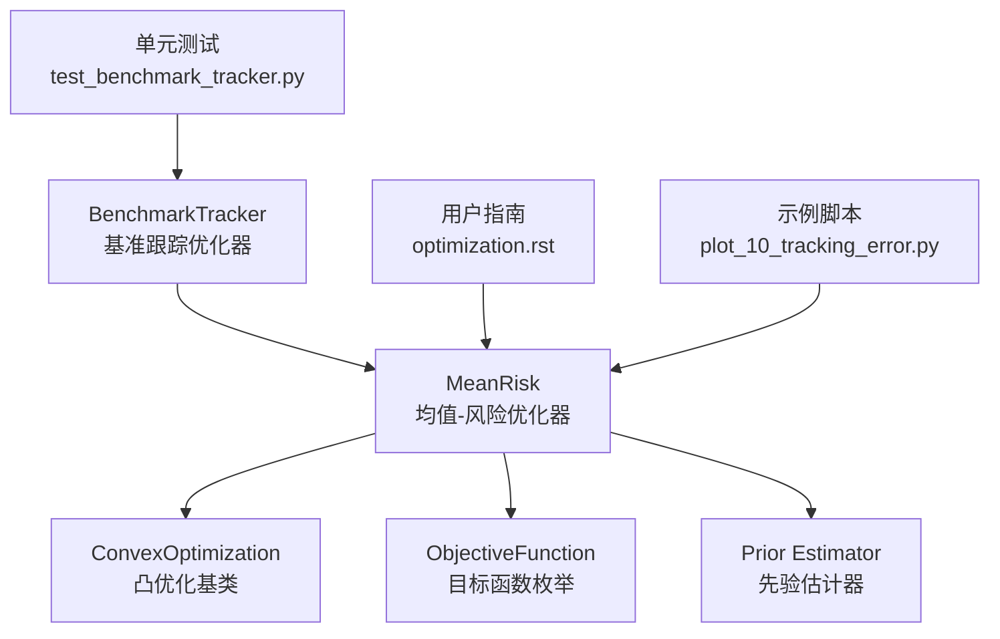
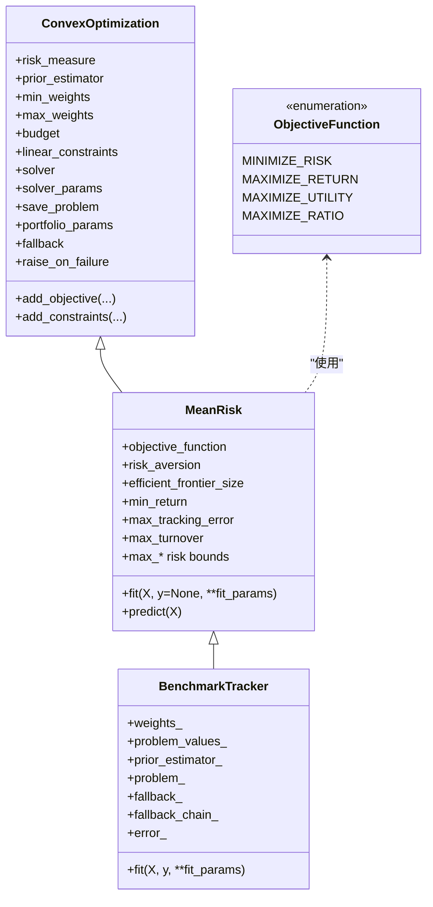
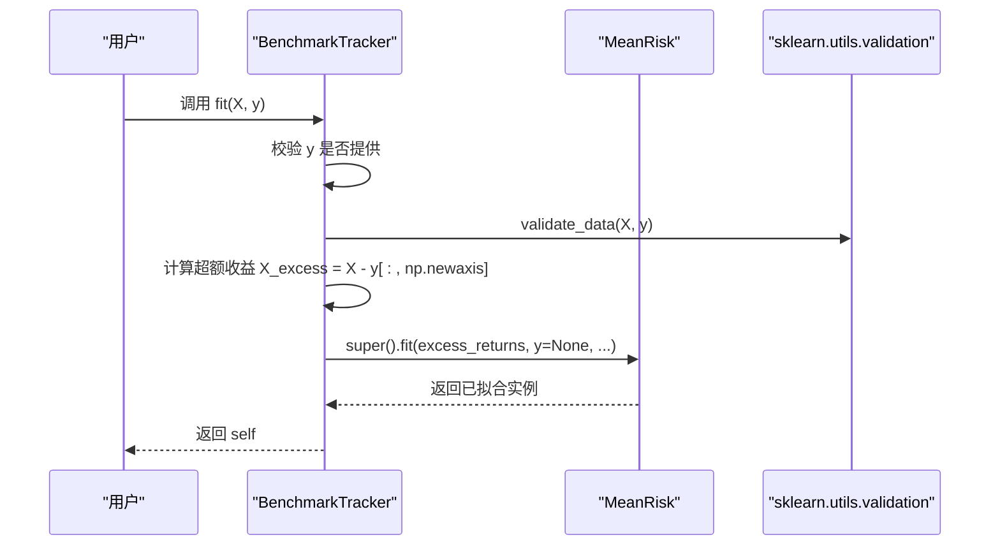
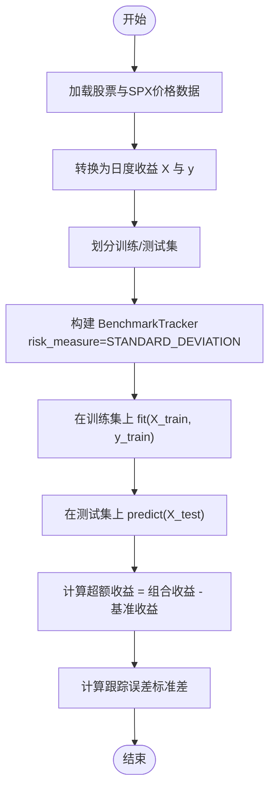
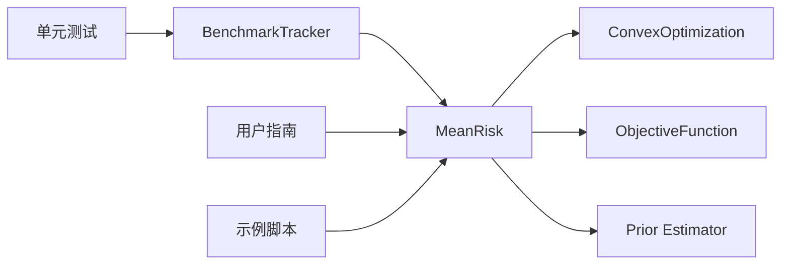

# 基准跟踪优化

<cite>
**本文引用的文件**
- [src/skfolio/optimization/convex/_benchmark_tracker.py](file://src/skfolio/optimization/convex/_benchmark_tracker.py)
- [src/skfolio/optimization/convex/_mean_risk.py](file://src/skfolio/optimization/convex/_mean_risk.py)
- [src/skfolio/optimization/convex/_base.py](file://src/skfolio/optimization/convex/_base.py)
- [tests/test_optimization/test_convex/test_benchmark_tracker.py](file://tests/test_optimization/test_convex/test_benchmark_tracker.py)
- [examples/mean_risk/plot_10_tracking_error.py](file://examples/mean_risk/plot_10_tracking_error.py)
- [docs/user_guide/optimization.rst](file://docs/user_guide/optimization.rst)
</cite>

## 目录
1. [简介](#简介)
2. [项目结构](#项目结构)
3. [核心组件](#核心组件)
4. [架构总览](#架构总览)
5. [详细组件分析](#详细组件分析)
6. [依赖关系分析](#依赖关系分析)
7. [性能考量](#性能考量)
8. [故障排查指南](#故障排查指南)
9. [结论](#结论)
10. [附录](#附录)

## 简介
本文件面向 skfolio 的基准跟踪优化器（BenchmarkTracker），系统化地阐述其工作原理与使用方法。其核心思想是：将资产收益 X 与基准收益 y 相减得到超额收益 X_excess，随后在超额收益上进行优化，从而最小化相对于基准的跟踪误差（如标准差、半偏差等）。为保证超额收益定义的正确性，该优化器始终强制执行全投资约束（budget=1.0）。它复用 MeanRisk 优化器的框架，但优化目标聚焦于超额收益的风险度量，而非资产组合的绝对风险或收益。

## 项目结构
与基准跟踪优化相关的关键文件位于优化模块的凸优化子包中：
- 基准跟踪优化器：src/skfolio/optimization/convex/_benchmark_tracker.py
- MeanRisk 优化器框架：src/skfolio/optimization/convex/_mean_risk.py
- 凸优化基类与枚举：src/skfolio/optimization/convex/_base.py
- 单元测试：tests/test_optimization/test_convex/test_benchmark_tracker.py
- 用户指南与示例：docs/user_guide/optimization.rst、examples/mean_risk/plot_10_tracking_error.py

图表来源
- [src/skfolio/optimization/convex/_benchmark_tracker.py](file://src/skfolio/optimization/convex/_benchmark_tracker.py#L1-L320)
- [src/skfolio/optimization/convex/_mean_risk.py](file://src/skfolio/optimization/convex/_mean_risk.py#L1-L800)
- [src/skfolio/optimization/convex/_base.py](file://src/skfolio/optimization/convex/_base.py#L1-L200)
- [tests/test_optimization/test_convex/test_benchmark_tracker.py](file://tests/test_optimization/test_convex/test_benchmark_tracker.py#L1-L100)
- [docs/user_guide/optimization.rst](file://docs/user_guide/optimization.rst#L777-L993)
- [examples/mean_risk/plot_10_tracking_error.py](file://examples/mean_risk/plot_10_tracking_error.py#L1-L128)

章节来源
- [src/skfolio/optimization/convex/_benchmark_tracker.py](file://src/skfolio/optimization/convex/_benchmark_tracker.py#L1-L320)
- [src/skfolio/optimization/convex/_mean_risk.py](file://src/skfolio/optimization/convex/_mean_risk.py#L1-L800)
- [src/skfolio/optimization/convex/_base.py](file://src/skfolio/optimization/convex/_base.py#L1-L200)
- [tests/test_optimization/test_convex/test_benchmark_tracker.py](file://tests/test_optimization/test_convex/test_benchmark_tracker.py#L1-L100)
- [docs/user_guide/optimization.rst](file://docs/user_guide/optimization.rst#L777-L993)
- [examples/mean_risk/plot_10_tracking_error.py](file://examples/mean_risk/plot_10_tracking_error.py#L1-L128)

## 核心组件
- BenchmarkTracker：继承自 MeanRisk，专门用于最小化超额收益（资产收益减去基准收益）的风险，从而跟踪基准。其 fit 过程会校验基准收益 y 的存在与形状，并将 X 转换为超额收益后调用父类 MeanRisk.fit 完成优化。
- MeanRisk：提供完整的均值-风险优化框架，支持多种目标函数（最小化风险、最大化收益、最大化效用、最大化比率）、风险度量（方差、半方差、标准差、半标准差、平均绝对偏差、首下部分矩、CVaR、EVaR、最坏实现、CDaR、最大回撤、平均回撤、EDaR、溃疡指数、Gini 差异比等）、预算约束、权重上下界、交易成本、管理费、L1/L2 正则化、不确定性集、线性约束、目标权重、跟踪误差上限、周转率上限等。
- ConvexOptimization：凸优化基类，封装了通用的参数与约束体系，包括风险度量枚举、预算约束、组约束、混合整数求解器支持等。
- ObjectiveFunction：目标函数枚举（最小化风险、最大化收益、最大化效用、最大化比率）。

章节来源
- [src/skfolio/optimization/convex/_benchmark_tracker.py](file://src/skfolio/optimization/convex/_benchmark_tracker.py#L16-L320)
- [src/skfolio/optimization/convex/_mean_risk.py](file://src/skfolio/optimization/convex/_mean_risk.py#L1-L800)
- [src/skfolio/optimization/convex/_base.py](file://src/skfolio/optimization/convex/_base.py#L1-L200)

## 架构总览
下面的类图展示了 BenchmarkTracker 与 MeanRisk、ConvexOptimization 的继承与组合关系，以及目标函数枚举的作用。

图表来源
- [src/skfolio/optimization/convex/_mean_risk.py](file://src/skfolio/optimization/convex/_mean_risk.py#L1-L800)
- [src/skfolio/optimization/convex/_benchmark_tracker.py](file://src/skfolio/optimization/convex/_benchmark_tracker.py#L16-L320)
- [src/skfolio/optimization/convex/_base.py](file://src/skfolio/optimization/convex/_base.py#L1-L200)

## 详细组件分析

### BenchmarkTracker 类与 fit 流程
- 继承关系：BenchmarkTracker 继承自 MeanRisk，并在构造时固定 objective_function 为 MINIMIZE_RISK，同时强制 budget=1.0，确保超额收益定义的正确性。
- fit(X, y)：校验 y 非空且样本数量一致；将 X 转换为超额收益矩阵 X_excess = X - y[:, np.newaxis]；随后调用父类 MeanRisk.fit(excess_returns, y=None, ...) 完成优化。
- 属性：weights_、problem_values_、prior_estimator_、problem_（当 save_problem=True）、fallback_、fallback_chain_、error_ 等，均由 MeanRisk 提供。

图表来源
- [src/skfolio/optimization/convex/_benchmark_tracker.py](file://src/skfolio/optimization/convex/_benchmark_tracker.py#L282-L320)
- [src/skfolio/optimization/convex/_mean_risk.py](file://src/skfolio/optimization/convex/_mean_risk.py#L1-L800)

章节来源
- [src/skfolio/optimization/convex/_benchmark_tracker.py](file://src/skfolio/optimization/convex/_benchmark_tracker.py#L16-L320)
- [tests/test_optimization/test_convex/test_benchmark_tracker.py](file://tests/test_optimization/test_convex/test_benchmark_tracker.py#L1-L100)

### MeanRisk 框架与参数要点
- 目标函数：MINIMIZE_RISK（默认）、MAXIMIZE_RETURN、MAXIMIZE_UTILITY、MAXIMIZE_RATIO。
- 风险度量：支持多种风险测度（方差、半方差、标准差、半标准差、平均绝对偏差、首下部分矩、CVaR、EVaR、最坏实现、CDaR、最大回撤、平均回撤、EDaR、溃疡指数、Gini 差异比等）。
- 预算与权重约束：budget 默认 1.0（全投资），min_weights/max_weights 控制权重上下界；可设置 min_budget/max_budget 替代 budget。
- 成本与费用：transaction_costs、management_fees 可加入到期望收益的调整项中。
- 其他约束：线性约束、组约束、L1/L2 正则化、目标权重 target_weights（用于围绕目标权重的跟踪误差最小化）、跟踪误差上限 max_tracking_error（用于返回基准的跟踪误差约束）、周转率上限 max_turnover 等。
- 不确定性集：mu_uncertainty_set_estimator、covariance_uncertainty_set_estimator 支持椭球不确定性集的最坏情况优化。
- 求解器：solver 默认 CLARABEL，可配置 solver_params；混合整数问题需使用支持 MI 的求解器（如 SCIP、MOSEK、GUROBI、CPLEX）。

章节来源
- [src/skfolio/optimization/convex/_mean_risk.py](file://src/skfolio/optimization/convex/_mean_risk.py#L1-L800)
- [src/skfolio/optimization/convex/_base.py](file://src/skfolio/optimization/convex/_base.py#L1-L200)

### 跟踪误差的数学基础与全投资约束
- 超额收益定义：r_t^excess(w) = Σ_i w_i(r_{t,i} - r_{b,t}) = r_{p,t} - (Σ_i w_i)r_{b,t}，其中 r_{p,t} 为组合收益，r_{b,t} 为基准收益。
- 当 Σ_i w_i = 1 时，超额收益等于组合收益减去基准收益，此时跟踪误差（如标准差）才严格对应超额收益的风险。
- 因此，BenchmarkTracker 强制 budget=1.0，确保超额收益定义的正确性。

章节来源
- [src/skfolio/optimization/convex/_benchmark_tracker.py](file://src/skfolio/optimization/convex/_benchmark_tracker.py#L34-L51)

### 使用示例：最小化相对于 SPX 指数的跟踪误差
以下示例展示了如何配置 BenchmarkTracker 以最小化相对于 SPX 指数的跟踪误差（超额收益的标准差）：
- 数据准备：加载 S&P 500 股票价格与 SPX 指数价格，转换为日度收益序列 X 与 y。
- 模型构建：创建 BenchmarkTracker，risk_measure 设置为标准差（STANDARD_DEVIATION），其他约束按需设置（如 min_weights、max_weights 等）。
- 拟合与预测：在训练集上 fit，在测试集上 predict 并计算超额收益的标准差作为跟踪误差。

图表来源
- [examples/mean_risk/plot_10_tracking_error.py](file://examples/mean_risk/plot_10_tracking_error.py#L1-L128)
- [docs/user_guide/optimization.rst](file://docs/user_guide/optimization.rst#L860-L892)

章节来源
- [examples/mean_risk/plot_10_tracking_error.py](file://examples/mean_risk/plot_10_tracking_error.py#L1-L128)
- [docs/user_guide/optimization.rst](file://docs/user_guide/optimization.rst#L860-L892)

### 与 MeanRisk 的对比与一致性验证
- BenchmarkTracker 在内部将 X 转换为超额收益后，再调用 MeanRisk.fit(excess_returns)，因此两者在相同风险度量与约束条件下应得到相同的最优权重。
- 单元测试验证了：
  - 对于给定基准收益 y，计算组合收益与基准收益的超额收益，其标准差应等于问题中“风险”的表达式值；
  - BenchmarkTracker 与手动对超额收益进行 MeanRisk 优化的结果一致；
  - 支持多种 y 输入格式（数组、Series、DataFrame、二维数组）；
  - 若未提供 y 或 y 形状不合法，或 budget 非 1.0，将抛出相应错误。

章节来源
- [tests/test_optimization/test_convex/test_benchmark_tracker.py](file://tests/test_optimization/test_convex/test_benchmark_tracker.py#L1-L100)

## 依赖关系分析
- BenchmarkTracker 依赖 MeanRisk 实现优化框架与风险度量，依赖 ConvexOptimization 的通用约束与求解器接口。
- MeanRisk 依赖 ObjectiveFunction 枚举、Prior Estimator（用于估计收益分布）、风险度量实现、线性约束工具等。
- 用户指南与示例脚本共同说明了三种跟踪误差优化路径：返回基准的跟踪误差约束（通过 MeanRisk 的 max_tracking_error）、围绕目标权重的跟踪误差最小化（通过 target_weights）、以及基于超额收益的跟踪误差最小化（通过 BenchmarkTracker）。

图表来源
- [src/skfolio/optimization/convex/_benchmark_tracker.py](file://src/skfolio/optimization/convex/_benchmark_tracker.py#L16-L320)
- [src/skfolio/optimization/convex/_mean_risk.py](file://src/skfolio/optimization/convex/_mean_risk.py#L1-L800)
- [src/skfolio/optimization/convex/_base.py](file://src/skfolio/optimization/convex/_base.py#L1-L200)
- [docs/user_guide/optimization.rst](file://docs/user_guide/optimization.rst#L777-L993)
- [examples/mean_risk/plot_10_tracking_error.py](file://examples/mean_risk/plot_10_tracking_error.py#L1-L128)
- [tests/test_optimization/test_convex/test_benchmark_tracker.py](file://tests/test_optimization/test_convex/test_benchmark_tracker.py#L1-L100)

## 性能考量
- 求解器选择：默认使用 CLARABEL，具备更好的数值稳定性与性能；若涉及混合整数约束（如 cardinality、group_cardinalities、threshold_long/short 等），需使用支持 MI 的求解器（如 SCIP、MOSEK、GUROBI、CPLEX）。
- 规模与稀疏性：大规模问题建议使用稀疏协方差估计与合理的正则化（L1/L2）以提升稳定性与收敛速度。
- 预算与约束：全投资约束（budget=1.0）有助于保持超额收益定义的正确性，避免因非全投资导致的跟踪误差偏误。
- 复杂度：MeanRisk 的风险度量与约束组合决定了优化问题的规模与复杂度，合理选择风险度量与约束可平衡精度与效率。

## 故障排查指南
常见错误与处理建议：
- 未提供基准收益 y：fit 时必须提供 y，否则抛出错误。
- y 形状不合法：y 必须是一维数组或单列 DataFrame/Series；多列 y 将触发形状错误。
- 预算约束不合规：BenchmarkTracker 强制 budget=1.0；若显式修改为其他值，将触发错误。
- 样本数量不一致：X 与 y 的样本数量必须一致，否则触发输入验证错误。
- 优化失败：可通过 raise_on_failure 控制是否抛出异常；或配置 fallback 列表逐步放宽约束，记录 fallback_chain_ 以便审计。

章节来源
- [tests/test_optimization/test_convex/test_benchmark_tracker.py](file://tests/test_optimization/test_convex/test_benchmark_tracker.py#L74-L100)
- [docs/user_guide/optimization.rst](file://docs/user_guide/optimization.rst#L893-L993)

## 结论
BenchmarkTracker 通过在超额收益上进行优化，将跟踪误差最小化问题转化为 MeanRisk 框架下的一个特例。其关键优势在于：
- 明确的超额收益定义：强制全投资约束（budget=1.0），确保超额收益与跟踪误差的数学一致性；
- 灵活的风险度量：可使用标准差、半偏差、平均绝对偏差等多种风险度量；
- 与 MeanRisk 的无缝集成：沿用其丰富的约束、成本、不确定性集与求解器能力；
- 易于配置与验证：示例与测试覆盖了典型场景与边界条件，便于快速落地。

## 附录
- 相关用户指南与示例：
  - 用户指南中的“跟踪误差优化”章节提供了三种路径的说明与示例。
  - 示例脚本展示了如何最小化相对于 SPX 指数的跟踪误差，并比较不同模型的跟踪误差与风险指标。

章节来源
- [docs/user_guide/optimization.rst](file://docs/user_guide/optimization.rst#L777-L993)
- [examples/mean_risk/plot_10_tracking_error.py](file://examples/mean_risk/plot_10_tracking_error.py#L1-L128)