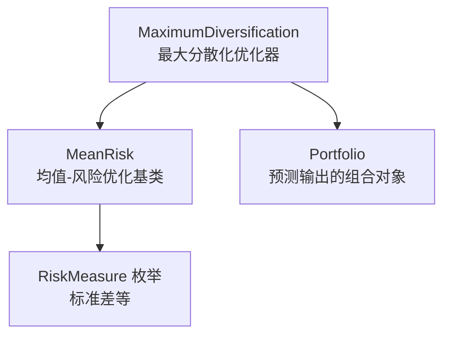
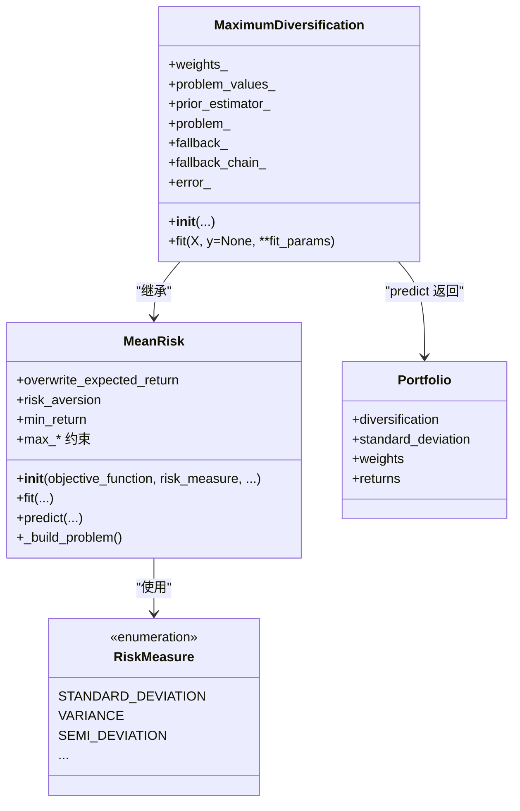
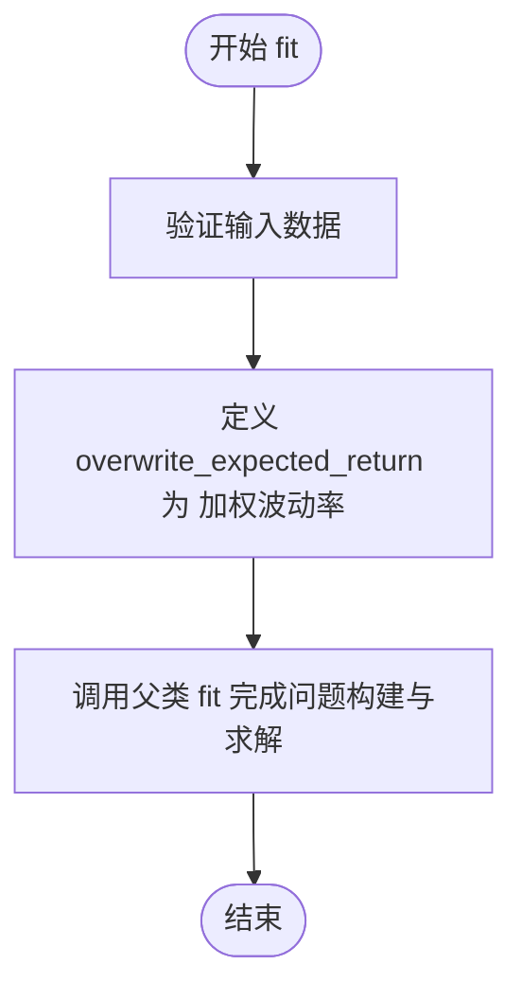
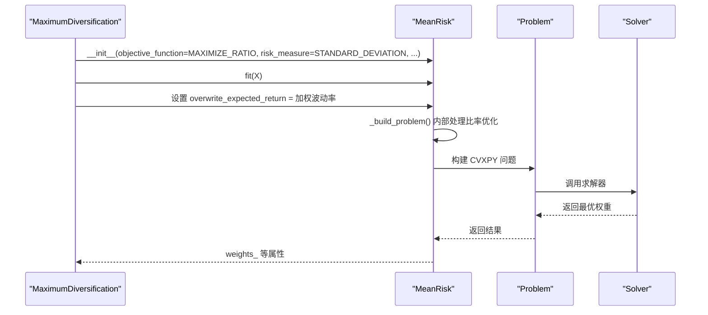
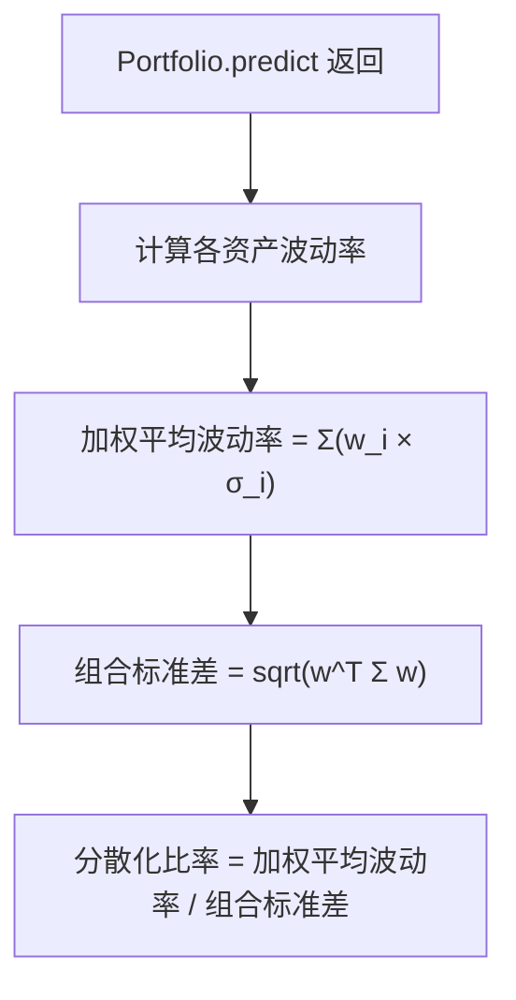
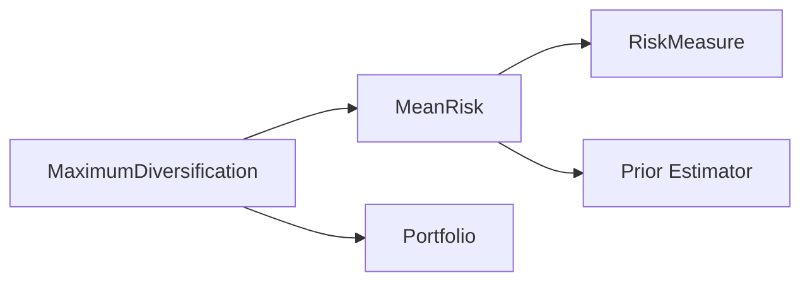

# 最大分散化优化

<cite>
**本文引用的文件**
- [src/skfolio/optimization/convex/_maximum_diversification.py](file://src/skfolio/optimization/convex/_maximum_diversification.py)
- [src/skfolio/optimization/convex/_mean_risk.py](file://src/skfolio/optimization/convex/_mean_risk.py)
- [src/skfolio/portfolio/_portfolio.py](file://src/skfolio/portfolio/_portfolio.py)
- [examples/maximum_diversification/plot_1_maximum_diversification.py](file://examples/maximum_diversification/plot_1_maximum_diversification.py)
- [tests/test_optimization/test_convex/test_maximum_diversification.py](file://tests/test_optimization/test_convex/test_maximum_diversification.py)
- [src/skfolio/measures/_enums.py](file://src/skfolio/measures/_enums.py)
</cite>

## 目录
1. [简介](#简介)
2. [项目结构](#项目结构)
3. [核心组件](#核心组件)
4. [架构总览](#架构总览)
5. [详细组件分析](#详细组件分析)
6. [依赖关系分析](#依赖关系分析)
7. [性能考量](#性能考量)
8. [故障排查指南](#故障排查指南)
9. [结论](#结论)
10. [附录](#附录)

## 简介
本文件为 skfolio 的最大分散化优化器（MaximumDiversification）提供详细的 API 文档与使用说明。最大分散化优化是均值-风险（MeanRisk）优化的一个特例：它通过将目标函数中的预期收益替换为“加权波动率”，从而最大化分散化比率（weighted average volatility / portfolio volatility）。该优化器继承自 MeanRisk，内部固定目标函数为最大化比率（MAXIMIZE_RATIO），并使用标准差作为风险度量（STANDARD_DEVIATION）。同时，它通过 overwrite_expected_return 机制允许用户以自定义表达式覆盖期望收益项，从而实现灵活的目标函数定制。

此外，文档还包含：
- __init__ 方法如何固定 objective_function 为 MAXIMIZE_RATIO、risk_measure 为 STANDARD_DEVIATION；
- 使用示例（如何构建高度分散的投资组合）；
- 在降低组合整体风险方面的优势与注意事项。

## 项目结构
与最大分散化优化相关的核心文件位于以下路径：
- 优化器实现：src/skfolio/optimization/convex/_maximum_diversification.py
- 均值-风险基类：src/skfolio/optimization/convex/_mean_risk.py
- 组合对象与分散化指标：src/skfolio/portfolio/_portfolio.py
- 示例脚本：examples/maximum_diversification/plot_1_maximum_diversification.py
- 单元测试：tests/test_optimization/test_convex/test_maximum_diversification.py
- 风险度量枚举：src/skfolio/measures/_enums.py

图表来源
- [src/skfolio/optimization/convex/_maximum_diversification.py](file://src/skfolio/optimization/convex/_maximum_diversification.py#L1-L120)
- [src/skfolio/optimization/convex/_mean_risk.py](file://src/skfolio/optimization/convex/_mean_risk.py#L1-L120)
- [src/skfolio/portfolio/_portfolio.py](file://src/skfolio/portfolio/_portfolio.py#L760-L775)
- [src/skfolio/measures/_enums.py](file://src/skfolio/measures/_enums.py#L105-L170)

章节来源
- [src/skfolio/optimization/convex/_maximum_diversification.py](file://src/skfolio/optimization/convex/_maximum_diversification.py#L1-L120)
- [src/skfolio/optimization/convex/_mean_risk.py](file://src/skfolio/optimization/convex/_mean_risk.py#L1-L120)

## 核心组件
- MaximumDiversification：最大分散化优化器，继承自 MeanRisk，固定目标函数为最大化比率，风险度量为标准差；通过 overwrite_expected_return 将“期望收益”替换为“加权波动率”。
- MeanRisk：通用均值-风险优化器，支持多种目标函数与风险度量，提供比率优化的通用框架（包括 Charnes-Cooper/Schaible 变换）。
- Portfolio：优化器 predict 返回的对象，提供分散化比率等指标计算。
- RiskMeasure：风险度量枚举，包含 STANDARD_DEVIATION 等。

章节来源
- [src/skfolio/optimization/convex/_maximum_diversification.py](file://src/skfolio/optimization/convex/_maximum_diversification.py#L1-L120)
- [src/skfolio/optimization/convex/_mean_risk.py](file://src/skfolio/optimization/convex/_mean_risk.py#L1-L120)
- [src/skfolio/portfolio/_portfolio.py](file://src/skfolio/portfolio/_portfolio.py#L760-L775)
- [src/skfolio/measures/_enums.py](file://src/skfolio/measures/_enums.py#L105-L170)

## 架构总览
下图展示了 MaximumDiversification 与 MeanRisk、Portfolio 以及风险度量之间的关系。

图表来源
- [src/skfolio/optimization/convex/_maximum_diversification.py](file://src/skfolio/optimization/convex/_maximum_diversification.py#L399-L514)
- [src/skfolio/optimization/convex/_mean_risk.py](file://src/skfolio/optimization/convex/_mean_risk.py#L649-L760)
- [src/skfolio/portfolio/_portfolio.py](file://src/skfolio/portfolio/_portfolio.py#L760-L775)
- [src/skfolio/measures/_enums.py](file://src/skfolio/measures/_enums.py#L105-L170)

## 详细组件分析

### MaximumDiversification 类
- 角色定位：最大分散化优化器，是 MeanRisk 的一个特例，目标函数固定为最大化比率，风险度量固定为标准差。
- 关键点：
  - __init__ 中显式传入 objective_function=MAXIMIZE_RATIO、risk_measure=STANDARD_DEVIATION，并调用父类构造。
  - fit 中定义 overwrite_expected_return 为“加权波动率”（权重乘以各资产波动率之和），从而将目标函数从“期望收益”替换为“加权波动率”，实现最大化分散化比率。
  - 支持所有 MeanRisk 的约束与参数（预算、权重上下界、交易成本、管理费、线性约束、不确定性集等）。

图表来源
- [src/skfolio/optimization/convex/_maximum_diversification.py](file://src/skfolio/optimization/convex/_maximum_diversification.py#L477-L514)

章节来源
- [src/skfolio/optimization/convex/_maximum_diversification.py](file://src/skfolio/optimization/convex/_maximum_diversification.py#L399-L514)

### MeanRisk 基类（比率优化）
- 角色定位：通用均值-风险优化器，支持 MINIMIZE_RISK、MAXIMIZE_RETURN、MAXIMIZE_UTILITY、MAXIMIZE_RATIO 四种目标函数。
- 关键点：
  - MAXIMIZE_RATIO 情况下，会根据期望收益是否线性采用 Charnes-Cooper 或 Schaible 变换，将分数规划转化为可求解的凸优化问题。
  - 提供 overwrite_expected_return 参数，允许用户自定义期望收益项，MaximumDiversification 即通过此机制将“期望收益”替换为“加权波动率”。

图表来源
- [src/skfolio/optimization/convex/_mean_risk.py](file://src/skfolio/optimization/convex/_mean_risk.py#L1096-L1171)
- [src/skfolio/optimization/convex/_maximum_diversification.py](file://src/skfolio/optimization/convex/_maximum_diversification.py#L477-L514)

章节来源
- [src/skfolio/optimization/convex/_mean_risk.py](file://src/skfolio/optimization/convex/_mean_risk.py#L1096-L1171)

### Portfolio 分散化比率
- 角色定位：MaximumDiversification.fit 后，predict 返回的 Portfolio 对象提供 diversification 属性，用于衡量分散化程度。
- 计算方式：加权平均波动率 / 组合标准差，直观反映“每单位总风险所获得的加权波动贡献”。

图表来源
- [src/skfolio/portfolio/_portfolio.py](file://src/skfolio/portfolio/_portfolio.py#L760-L775)

章节来源
- [src/skfolio/portfolio/_portfolio.py](file://src/skfolio/portfolio/_portfolio.py#L760-L775)

### 使用示例
- 示例脚本展示了如何使用 MaximumDiversification 构建最大化分散化比率的投资组合，并与等权组合进行对比分析。
- 示例要点：
  - 加载数据并转换为日度收益率；
  - 创建 MaximumDiversification 与 EqualWeighted 模型；
  - 在训练集上拟合并比较两者的分散化比率；
  - 在测试集上预测并汇总分析。

章节来源
- [examples/maximum_diversification/plot_1_maximum_diversification.py](file://examples/maximum_diversification/plot_1_maximum_diversification.py#L1-L85)

### 测试验证
- 单元测试验证了：
  - MaximumDiversification 的分散化比率等于问题中 expected_return 与 risk 的比值；
  - 当使用因子模型等不同先验估计时，该等式不再严格成立（体现估计偏差的影响）；
  - 元数据路由场景下的错误处理行为。

章节来源
- [tests/test_optimization/test_convex/test_maximum_diversification.py](file://tests/test_optimization/test_convex/test_maximum_diversification.py#L1-L51)

## 依赖关系分析
- MaximumDiversification 依赖于：
  - MeanRisk（继承）：复用比率优化框架与约束系统；
  - RiskMeasure（枚举）：固定使用 STANDARD_DEVIATION；
  - Portfolio（返回对象）：提供分散化比率等指标；
  - Prior（先验估计器）：由 MeanRisk 管理，用于估计协方差与期望收益等。

图表来源
- [src/skfolio/optimization/convex/_maximum_diversification.py](file://src/skfolio/optimization/convex/_maximum_diversification.py#L1-L120)
- [src/skfolio/optimization/convex/_mean_risk.py](file://src/skfolio/optimization/convex/_mean_risk.py#L1-L120)
- [src/skfolio/measures/_enums.py](file://src/skfolio/measures/_enums.py#L105-L170)

章节来源
- [src/skfolio/optimization/convex/_maximum_diversification.py](file://src/skfolio/optimization/convex/_maximum_diversification.py#L1-L120)
- [src/skfolio/optimization/convex/_mean_risk.py](file://src/skfolio/optimization/convex/_mean_risk.py#L1-L120)

## 性能考量
- 求解稳定性：MaximumDiversification 通过固定 risk_measure 为 STANDARD_DEVIATION 并使用比率优化框架，通常具有良好的数值稳定性。
- 自定义目标：overwrite_expected_return 可用于替换期望收益项，但需确保新表达式与原问题保持凸性与可求解性。
- 正则化与稀疏性：MeanRisk 支持 L1/L2 正则化，适度增加 L1 可减少非零权重数量，但可能降低分散化程度。
- 大规模问题：当资产数量较多时，建议合理设置 solver 与 scale_objective/scale_constraints，以提升收敛精度与速度。

## 故障排查指南
- 比率优化失败（MAXIMIZE_RATIO）：
  - 若最小权重非负且所有资产的期望收益均不高于无风险利率，比率优化可能不可行。此时应检查约束或考虑使用其他目标函数。
- 先验估计器不匹配：
  - 使用某些先验估计器（如因子模型）时，expected_return 与 risk 的直接比值可能不再严格等于分散化比率，需结合实际问题调整。
- 元数据路由错误：
  - 在启用元数据路由时，若未正确传递先验估计所需的元数据，可能导致 fit 失败。请确认 prior_estimator 的元数据请求已正确配置。

章节来源
- [src/skfolio/optimization/convex/_mean_risk.py](file://src/skfolio/optimization/convex/_mean_risk.py#L1120-L1171)
- [tests/test_optimization/test_convex/test_maximum_diversification.py](file://tests/test_optimization/test_convex/test_maximum_diversification.py#L34-L51)

## 结论
MaximumDiversification 是一种以最大化分散化比率为目标的优化策略，通过将 MeanRisk 的期望收益项替换为“加权波动率”，在固定风险度量为标准差的前提下，实现对组合分散化程度的直接优化。配合 Portfolio 的分散化比率指标，用户可以直观评估与比较不同优化策略的效果。实践中，建议结合先验估计器选择、正则化设置与求解器参数，以获得更稳健的优化结果。

## 附录

### API 概览（MaximumDiversification）
- 主要参数（来自 MeanRisk，部分关键项）
  - objective_function：固定为 MAXIMIZE_RATIO
  - risk_measure：固定为 STANDARD_DEVIATION
  - min_weights / max_weights：权重上下界
  - budget / min_budget / max_budget：预算约束
  - max_short / max_long：多空头寸上限
  - transaction_costs / management_fees：交易成本与管理费
  - groups / linear_constraints：分组与线性约束
  - l1_coef / l2_coef：L1/L2 正则化
  - risk_free_rate：无风险利率
  - add_objective / add_constraints：自定义目标与约束
  - solver / solver_params / scale_objective / scale_constraints：求解器与缩放
  - save_problem / portfolio_params / fallback / raise_on_failure：问题保存与回退策略
- 关键属性
  - weights_：最优权重
  - problem_values_：问题中各表达式的值
  - prior_estimator_：已拟合的先验估计器
  - problem_：CVXPY 问题（当 save_problem=True）
  - fallback_ / fallback_chain_ / error_：回退链与错误信息

章节来源
- [src/skfolio/optimization/convex/_maximum_diversification.py](file://src/skfolio/optimization/convex/_maximum_diversification.py#L1-L398)
- [src/skfolio/optimization/convex/_mean_risk.py](file://src/skfolio/optimization/convex/_mean_risk.py#L649-L760)

### 使用步骤（示例路径）
- 数据准备与模型创建：参考示例脚本中的数据加载与模型初始化。
- 拟合与预测：fit 在训练集上运行，predict 返回 Portfolio。
- 分析与对比：比较 MaximumDiversification 与 EqualWeighted 的分散化比率。

章节来源
- [examples/maximum_diversification/plot_1_maximum_diversification.py](file://examples/maximum_diversification/plot_1_maximum_diversification.py#L29-L85)