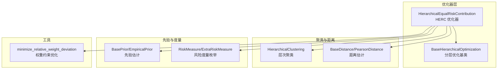
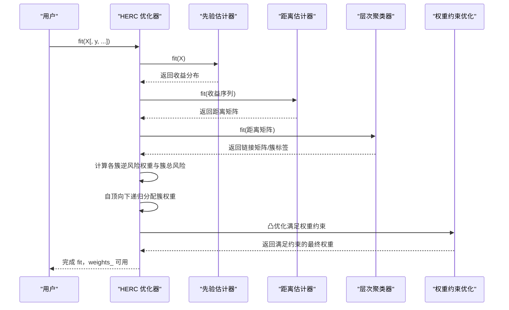
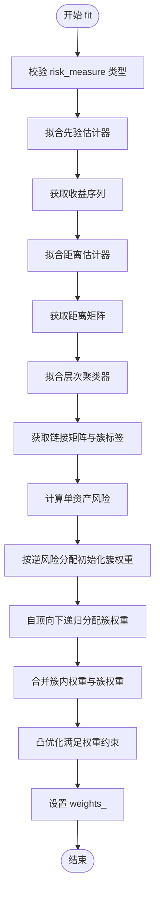
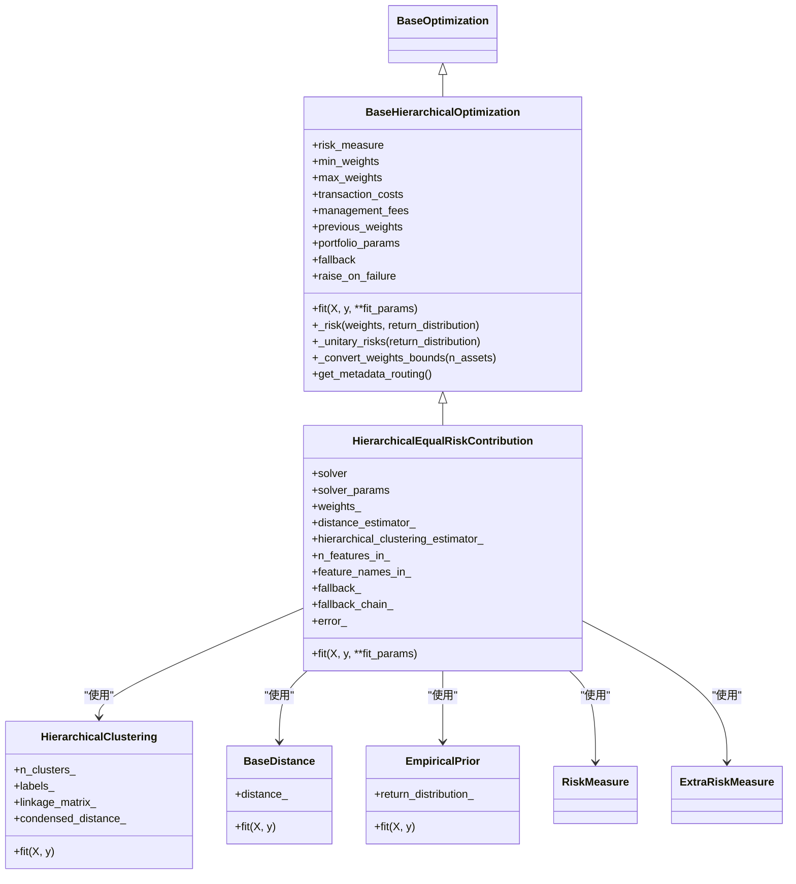

# HierarchicalEqualRiskContribution API

<cite>
**本文引用的文件**
- [src/skfolio/optimization/cluster/hierarchical/_herc.py](file://src/skfolio/optimization/cluster/hierarchical/_herc.py)
- [src/skfolio/optimization/cluster/hierarchical/_base.py](file://src/skfolio/optimization/cluster/hierarchical/_base.py)
- [src/skfolio/optimization/cluster/hierarchical/__init__.py](file://src/skfolio/optimization/cluster/hierarchical/__init__.py)
- [src/skfolio/cluster/_hierarchical.py](file://src/skfolio/cluster/_hierarchical.py)
- [src/skfolio/utils/stats.py](file://src/skfolio/utils/stats.py)
- [examples/clustering/plot_3_hrp_vs_herc.py](file://examples/clustering/plot_3_hrp_vs_herc.py)
- [examples/clustering/plot_2_herc_cdar.py](file://examples/clustering/plot_2_herc_cdar.py)
- [tests/test_optimization/test_cluster/test_hierarchical/test_herc.py](file://tests/test_optimization/test_cluster/test_hierarchical/test_herc.py)
</cite>

## 目录
1. [简介](#简介)
2. [项目结构](#项目结构)
3. [核心组件](#核心组件)
4. [架构总览](#架构总览)
5. [详细组件分析](#详细组件分析)
6. [依赖关系分析](#依赖关系分析)
7. [性能考量](#性能考量)
8. [故障排查指南](#故障排查指南)
9. [结论](#结论)
10. [附录](#附录)

## 简介
本文件为 skfolio 的 HierarchicalEqualRiskContribution 类提供详细的 API 文档。该类是“分层等风险贡献”（Hierarchical Equal Risk Contribution, HERC）优化器，基于分层聚类结构，在组内与组间实现等风险贡献的权重分配。HERC 通过距离矩阵构建层次树，先对每个簇进行逆风险分配以估算簇总风险，再自顶向下递归根据左右子树的风险占比对簇权重进行分配，最后在每个簇内部采用“朴素风险平价”（组内等风险贡献）策略，形成最终资产权重。HERC 的显著特点是利用了完整的树形结构进行递归分割，区别于 HRP 的二分法递归；同时，HERC 在中间步骤无法直接施加权重约束，需在顶层分配完成后通过凸优化最小化相对偏差的方式进行约束满足。

HERC 支持多种风险度量（如方差、标准差、CVaR、CDaR 等），并允许通过 prior_estimator、distance_estimator 和 hierarchical_clustering_estimator 进行灵活配置。其核心输出为 weights_，即最终资产权重向量；同时保留聚类相关属性，便于后续可视化与分析。

## 项目结构
与 HERC 相关的核心模块位于 optimization/cluster/hierarchical 子包中，HERC 继承自 BaseHierarchicalOptimization，后者封装了通用的分层优化流程与权重约束处理逻辑。聚类与距离估计分别由 cluster 和 distance 子系统提供，权重约束满足通过 utils/stats 中的凸优化函数实现。

图表来源
- [src/skfolio/optimization/cluster/hierarchical/_herc.py](file://src/skfolio/optimization/cluster/hierarchical/_herc.py#L1-L120)
- [src/skfolio/optimization/cluster/hierarchical/_base.py](file://src/skfolio/optimization/cluster/hierarchical/_base.py#L1-L120)
- [src/skfolio/cluster/_hierarchical.py](file://src/skfolio/cluster/_hierarchical.py#L127-L173)
- [src/skfolio/utils/stats.py](file://src/skfolio/utils/stats.py#L509-L581)

章节来源
- [src/skfolio/optimization/cluster/hierarchical/__init__.py](file://src/skfolio/optimization/cluster/hierarchical/__init__.py#L1-L20)

## 核心组件
- HierarchicalEqualRiskContribution：HERC 优化器，负责从收益率数据出发，计算距离矩阵，构建层次树，递归分配簇权重并在簇内实施等风险贡献分配，最终通过凸优化满足权重约束。
- BaseHierarchicalOptimization：分层优化基类，提供统一的参数接口、权重边界转换、单资产风险计算、元数据路由等通用能力。
- HierarchicalClustering：层次聚类器，基于距离矩阵生成链接矩阵与簇标签，供 HERC 使用。
- BaseDistance/PearsonDistance：距离估计器，提供资产间距离矩阵，HERC 默认使用皮尔逊距离。
- BasePrior/EmpiricalPrior：先验估计器，估计期望收益、协方差与收益序列，用于风险度量与距离估计。
- minimize_relative_weight_deviation：凸优化函数，最小化最终权重与初始权重的相对偏差，满足权重上下界约束。

章节来源
- [src/skfolio/optimization/cluster/hierarchical/_herc.py](file://src/skfolio/optimization/cluster/hierarchical/_herc.py#L1-L120)
- [src/skfolio/optimization/cluster/hierarchical/_base.py](file://src/skfolio/optimization/cluster/hierarchical/_base.py#L1-L120)
- [src/skfolio/cluster/_hierarchical.py](file://src/skfolio/cluster/_hierarchical.py#L127-L173)
- [src/skfolio/utils/stats.py](file://src/skfolio/utils/stats.py#L509-L581)

## 架构总览
HERC 的工作流分为四个阶段：
1) 先验估计：使用 prior_estimator 计算收益分布（包含期望收益、协方差与收益序列）。
2) 距离估计：使用 distance_estimator 基于收益序列计算资产间距离矩阵。
3) 层次聚类：使用 hierarchical_clustering_estimator 基于距离矩阵构建层次树（链接矩阵、簇标签）。
4) 权重分配：自顶向下递归，依据左右子树风险占比分配簇权重；随后在每个簇内按逆风险分配进行组内等风险贡献；最后通过凸优化满足权重约束。

图表来源
- [src/skfolio/optimization/cluster/hierarchical/_herc.py](file://src/skfolio/optimization/cluster/hierarchical/_herc.py#L360-L522)
- [src/skfolio/optimization/cluster/hierarchical/_base.py](file://src/skfolio/optimization/cluster/hierarchical/_base.py#L335-L394)
- [src/skfolio/cluster/_hierarchical.py](file://src/skfolio/cluster/_hierarchical.py#L167-L173)
- [src/skfolio/utils/stats.py](file://src/skfolio/utils/stats.py#L509-L581)

## 详细组件分析

### 类：HierarchicalEqualRiskContribution
- 继承关系：继承自 BaseHierarchicalOptimization，复用其参数与通用逻辑。
- 关键参数
  - risk_measure：风险度量，默认为方差；支持多种风险度量（方差、标准差、CVaR、CDaR 等）。
  - prior_estimator：先验估计器，默认 EmpiricalPrior，用于估计收益分布。
  - distance_estimator：距离估计器，默认 PearsonDistance，用于估计资产间距离矩阵。
  - hierarchical_clustering_estimator：层次聚类器，默认 HierarchicalClustering，用于基于距离矩阵构建层次树。
  - min_weights/max_weights：资产权重下限/上限，支持标量、字典或数组形式；默认长多头（不短卖）且每资产上限为 1。
  - transaction_costs/management_fees：交易成本与管理费用，影响预期收益与优化目标。
  - previous_weights：上期权重，用于计算交易成本。
  - solver/solver_params：凸优化求解器及其参数，默认 CLARABEL。
  - portfolio_params/fallback/raise_on_failure：结果 Portfolio 参数与回退策略控制。
- 关键属性
  - weights_：最终资产权重向量。
  - distance_estimator_、hierarchical_clustering_estimator_：已拟合的距离与聚类估计器。
  - n_features_in_、feature_names_in_：输入资产数量与名称。
  - fallback_、fallback_chain_、error_：回退链路与错误信息。
- fit 流程要点
  - 输入校验与估计器装配：检查 risk_measure 类型，装配 prior/distance/hierarchical 估计器。
  - 先验估计：返回收益分布，提取收益序列。
  - 距离估计：基于收益序列计算距离矩阵，并保持资产名称。
  - 层次聚类：基于距离矩阵拟合层次树，获取链接矩阵与簇标签。
  - 初始权重与簇总风险：对每个簇计算逆风险权重（组内等风险贡献），并据此估算簇总风险。
  - 递归分配：自顶向下遍历层次树，依据左右子树总风险占比分配簇权重。
  - 组内等风险贡献：将簇内权重乘以对应簇权重，得到组内等风险贡献权重。
  - 权重约束：通过 minimize_relative_weight_deviation 最小化相对偏差，满足权重上下界约束。
  - 输出：设置 weights_ 并返回自身。

图表来源
- [src/skfolio/optimization/cluster/hierarchical/_herc.py](file://src/skfolio/optimization/cluster/hierarchical/_herc.py#L360-L522)
- [src/skfolio/optimization/cluster/hierarchical/_base.py](file://src/skfolio/optimization/cluster/hierarchical/_base.py#L335-L394)
- [src/skfolio/utils/stats.py](file://src/skfolio/utils/stats.py#L509-L581)

章节来源
- [src/skfolio/optimization/cluster/hierarchical/_herc.py](file://src/skfolio/optimization/cluster/hierarchical/_herc.py#L77-L214)
- [src/skfolio/optimization/cluster/hierarchical/_herc.py](file://src/skfolio/optimization/cluster/hierarchical/_herc.py#L360-L522)

### 基类：BaseHierarchicalOptimization
- 提供统一的参数接口与权重边界转换逻辑（_convert_weights_bounds），确保权重上下界合法。
- 提供单资产风险计算（_unitary_risks）与任意权重组合的风险度量（_risk），支持多种风险度量。
- 提供元数据路由（get_metadata_routing），将 fit 参数传递给嵌套估计器。
- 提供抽象 fit 接口，具体实现由子类完成。

章节来源
- [src/skfolio/optimization/cluster/hierarchical/_base.py](file://src/skfolio/optimization/cluster/hierarchical/_base.py#L1-L120)
- [src/skfolio/optimization/cluster/hierarchical/_base.py](file://src/skfolio/optimization/cluster/hierarchical/_base.py#L289-L474)

### 聚类与距离估计
- HierarchicalClustering：基于距离矩阵生成链接矩阵与簇标签，提供 n_clusters_、labels_、linkage_matrix_ 等属性。
- BaseDistance/PearsonDistance：提供距离矩阵估计能力，HERC 默认使用 PearsonDistance。

章节来源
- [src/skfolio/cluster/_hierarchical.py](file://src/skfolio/cluster/_hierarchical.py#L127-L173)

### 权重约束优化
- minimize_relative_weight_deviation：以最小化相对偏差为目标，满足权重和为 1 以及上下界约束，使用 CVXPY 求解。

章节来源
- [src/skfolio/utils/stats.py](file://src/skfolio/utils/stats.py#L509-L581)

## 依赖关系分析
HERC 的依赖关系如下图所示，展示了类之间的继承与组合关系，以及与外部估计器、工具函数的交互。

图表来源
- [src/skfolio/optimization/cluster/hierarchical/_herc.py](file://src/skfolio/optimization/cluster/hierarchical/_herc.py#L1-L120)
- [src/skfolio/optimization/cluster/hierarchical/_base.py](file://src/skfolio/optimization/cluster/hierarchical/_base.py#L1-L120)
- [src/skfolio/cluster/_hierarchical.py](file://src/skfolio/cluster/_hierarchical.py#L127-L173)

## 性能考量
- 计算复杂度
  - 距离估计与层次聚类：O(N^2 log N) 或更高，取决于距离估计与链接算法。
  - 风险度量计算：O(N^2)（协方差相关）或 O(N)（方差/标准差）。
  - 递归分配与组内等风险贡献：O(N)。
  - 凸优化权重约束：O(N^2) 左右，取决于 CVXPY 规划规模。
- 实践建议
  - 合理选择距离度量与链接方法，避免过度“链式效应”，提升稳定性。
  - 对大规模资产组合，优先使用稳定链接方法（如 Ward）与高效距离估计。
  - 控制权重上下界，避免不可行约束导致求解失败。
  - 使用合适的求解器（默认 CLARABEL）与参数，平衡精度与速度。

## 故障排查指南
- 常见问题
  - 风险度量不支持：某些风险度量（如偏度、峰度）不被 HERC 支持，会抛出异常。
  - 权重约束不可行：当 min_weights 与 max_weights 设置不当导致无可行解时，凸优化可能报错。
  - 链接矩阵异常：层次聚类生成的树结构异常会导致递归分配失败。
- 处理方式
  - 调整 risk_measure 为支持的度量。
  - 检查 min_weights 与 max_weights 的合法性（非负、上界不超过 1、和为 1 等）。
  - 尝试不同的距离度量与链接方法，观察层次树结构是否合理。
  - 使用回退策略（fallback）与 raise_on_failure 控制错误行为。

章节来源
- [src/skfolio/optimization/cluster/hierarchical/_herc.py](file://src/skfolio/optimization/cluster/hierarchical/_herc.py#L388-L398)
- [src/skfolio/utils/stats.py](file://src/skfolio/utils/stats.py#L552-L581)

## 结论
HierarchicalEqualRiskContribution 通过分层聚类与自顶向下的递归分配，结合组内等风险贡献策略，实现了在复杂资产结构上的稳健权重分配。其灵活性体现在可配置的风险度量、先验估计器、距离估计器与层次聚类器，同时通过凸优化满足权重约束，保证最终权重的可行性与稳定性。与 HRP 相比，HERC 更充分地利用了层次树的形状，因此对链接方法的选择更为敏感，但通常能获得更均衡的风险贡献。

## 附录

### API 参考（参数与属性）
- 参数
  - risk_measure：风险度量枚举，默认方差。
  - prior_estimator：先验估计器，默认 EmpiricalPrior。
  - distance_estimator：距离估计器，默认 PearsonDistance。
  - hierarchical_clustering_estimator：层次聚类器，默认 HierarchicalClustering。
  - min_weights/max_weights：权重上下界，支持标量、字典或数组。
  - transaction_costs/management_fees：线性交易成本与管理费用。
  - previous_weights：上期权重。
  - solver/solver_params：凸优化求解器与参数。
  - portfolio_params/fallback/raise_on_failure：结果参数与回退策略。
- 属性
  - weights_：最终资产权重。
  - distance_estimator_、hierarchical_clustering_estimator_：已拟合估计器。
  - n_features_in_、feature_names_in_：资产数量与名称。
  - fallback_、fallback_chain_、error_：回退链路与错误信息。

章节来源
- [src/skfolio/optimization/cluster/hierarchical/_herc.py](file://src/skfolio/optimization/cluster/hierarchical/_herc.py#L77-L214)
- [src/skfolio/optimization/cluster/hierarchical/_herc.py](file://src/skfolio/optimization/cluster/hierarchical/_herc.py#L270-L303)

### 使用示例与对比
- 示例一：HERC 与 HRP 的对比（CVaR 最小化）
  - 创建 HRP 与 HERC 模型，使用滚动窗口与网格搜索选择最优参数，评估两者在测试集上的表现差异。
  - 参考路径：[examples/clustering/plot_3_hrp_vs_herc.py](file://examples/clustering/plot_3_hrp_vs_herc.py#L1-L120)
- 示例二：HERC 使用 CDaR 风险度量
  - 展示不同链接方法对 HERC 分配的影响，强调 Ward 方法的稳定性。
  - 参考路径：[examples/clustering/plot_2_herc_cdar.py](file://examples/clustering/plot_2_herc_cdar.py#L1-L125)
- 单元测试：HERC 的典型用法与权重边界约束
  - 包括因子模型先验、权重上下界约束、样本权重一致性等测试。
  - 参考路径：[tests/test_optimization/test_cluster/test_hierarchical/test_herc.py](file://tests/test_optimization/test_cluster/test_hierarchical/test_herc.py#L95-L229)

章节来源
- [examples/clustering/plot_3_hrp_vs_herc.py](file://examples/clustering/plot_3_hrp_vs_herc.py#L1-L120)
- [examples/clustering/plot_2_herc_cdar.py](file://examples/clustering/plot_2_herc_cdar.py#L1-L125)
- [tests/test_optimization/test_cluster/test_hierarchical/test_herc.py](file://tests/test_optimization/test_cluster/test_hierarchical/test_herc.py#L95-L229)