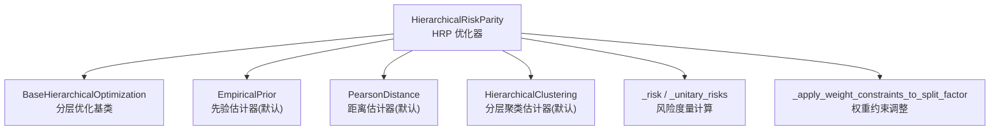
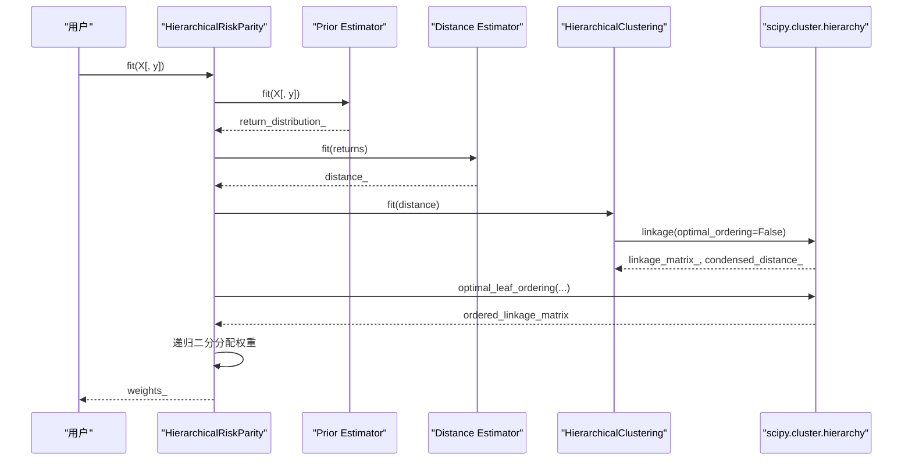
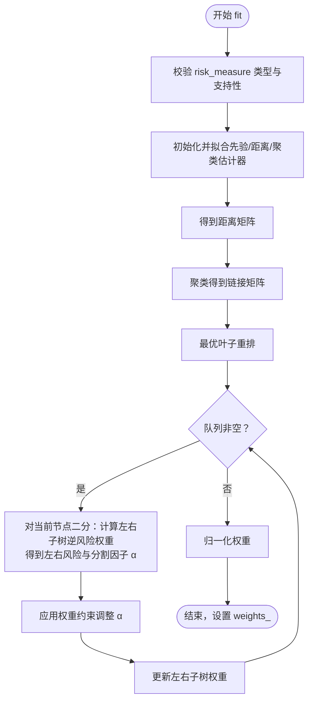
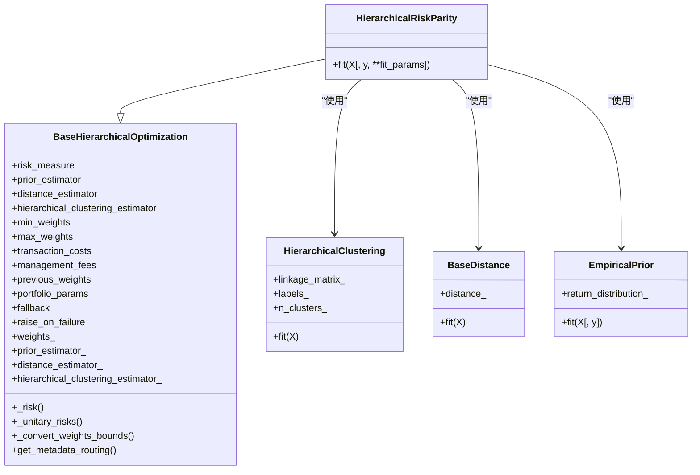

# HierarchicalRiskParity API

<cite>
**本文引用的文件**
- [src/skfolio/optimization/cluster/hierarchical/_hrp.py](file://src/skfolio/optimization/cluster/hierarchical/_hrp.py)
- [src/skfolio/optimization/cluster/hierarchical/_base.py](file://src/skfolio/optimization/cluster/hierarchical/_base.py)
- [src/skfolio/cluster/_hierarchical.py](file://src/skfolio/cluster/_hierarchical.py)
- [src/skfolio/distance/_distance.py](file://src/skfolio/distance/_distance.py)
- [src/skfolio/prior/_empirical.py](file://src/skfolio/prior/_empirical.py)
- [examples/clustering/plot_1_hrp_cvar.py](file://examples/clustering/plot_1_hrp_cvar.py)
- [tests/test_optimization/test_cluster/test_hierarchical/test_hrp.py](file://tests/test_optimization/test_cluster/test_hierarchical/test_hrp.py)
</cite>

## 目录
1. [简介](#简介)
2. [项目结构](#项目结构)
3. [核心组件](#核心组件)
4. [架构总览](#架构总览)
5. [详细组件分析](#详细组件分析)
6. [依赖关系分析](#依赖关系分析)
7. [性能与稳健性考量](#性能与稳健性考量)
8. [故障排查指南](#故障排查指南)
9. [结论](#结论)
10. [附录：使用示例与最佳实践](#附录使用示例与最佳实践)

## 简介
本文件为 skfolio 的 HierarchicalRiskParity 类提供系统化、可操作的 API 文档。该类实现了分层风险平价（Hierarchical Risk Parity, HRP）投资组合优化算法，通过距离矩阵构建分层聚类，采用最优叶子重排与递归二分法进行权重分配，从而在多风险度量下稳健地生成资产权重。文档覆盖参数、属性、fit 流程、递归分配逻辑、约束与回退机制，并给出结合不同风险度量与约束条件的使用示例，解释其在高相关性资产上的优势。

## 项目结构
与 HRP 相关的核心模块位于优化器的分层聚类子包中，主要文件如下：
- 优化器实现：src/skfolio/optimization/cluster/hierarchical/_hrp.py
- 分层优化基类：src/skfolio/optimization/cluster/hierarchical/_base.py
- 聚类估计器：src/skfolio/cluster/_hierarchical.py
- 距离估计器：src/skfolio/distance/_distance.py
- 先验估计器（默认）：src/skfolio/prior/_empirical.py
- 示例与测试：examples/clustering/plot_1_hrp_cvar.py、tests/test_optimization/test_cluster/test_hierarchical/test_hrp.py

图表来源
- [src/skfolio/optimization/cluster/hierarchical/_hrp.py](file://src/skfolio/optimization/cluster/hierarchical/_hrp.py#L292-L490)
- [src/skfolio/optimization/cluster/hierarchical/_base.py](file://src/skfolio/optimization/cluster/hierarchical/_base.py#L289-L474)
- [src/skfolio/cluster/_hierarchical.py](file://src/skfolio/cluster/_hierarchical.py#L109-L208)
- [src/skfolio/distance/_distance.py](file://src/skfolio/distance/_distance.py#L1-L200)
- [src/skfolio/prior/_empirical.py](file://src/skfolio/prior/_empirical.py#L1-L200)

章节来源
- [src/skfolio/optimization/cluster/hierarchical/_hrp.py](file://src/skfolio/optimization/cluster/hierarchical/_hrp.py#L292-L490)
- [src/skfolio/optimization/cluster/hierarchical/_base.py](file://src/skfolio/optimization/cluster/hierarchical/_base.py#L289-L474)

## 核心组件
- HierarchicalRiskParity：HRP 投资组合优化器，支持多种风险度量与约束，内置回退机制。
- BaseHierarchicalOptimization：分层优化基类，统一管理风险度量、先验估计器、距离估计器、聚类估计器、权重约束与元数据路由。
- HierarchicalClustering：基于 scipy 的分层聚类，支持多种链接方法（默认 Ward）。
- 距离估计器（默认 PearsonDistance）：从收益率估计距离矩阵。
- 先验估计器（默认 EmpiricalPrior）：估计期望收益、协方差与收益率样本权重。

章节来源
- [src/skfolio/optimization/cluster/hierarchical/_hrp.py](file://src/skfolio/optimization/cluster/hierarchical/_hrp.py#L292-L490)
- [src/skfolio/optimization/cluster/hierarchical/_base.py](file://src/skfolio/optimization/cluster/hierarchical/_base.py#L289-L474)
- [src/skfolio/cluster/_hierarchical.py](file://src/skfolio/cluster/_hierarchical.py#L109-L208)
- [src/skfolio/distance/_distance.py](file://src/skfolio/distance/_distance.py#L1-L200)
- [src/skfolio/prior/_empirical.py](file://src/skfolio/prior/_empirical.py#L1-L200)

## 架构总览
HRP 的整体流程包括：先验估计 → 距离估计 → 聚类 → 叶子重排 → 递归二分 → 权重约束调整 → 输出权重。

图表来源
- [src/skfolio/optimization/cluster/hierarchical/_hrp.py](file://src/skfolio/optimization/cluster/hierarchical/_hrp.py#L322-L438)
- [src/skfolio/cluster/_hierarchical.py](file://src/skfolio/cluster/_hierarchical.py#L170-L208)

## 详细组件分析

### 参数与属性
- 风险度量 risk_measure：支持多种风险度量（方差、半方差、CVaR、EVAR、最坏情景、CDaR、最大回撤、平均回撤、熵风险度量、四阶矩等），默认为方差。
- 先验估计器 prior_estimator：默认 EmpiricalPrior；可替换为因子模型等估计器以提升稳健性。
- 距离估计器 distance_estimator：默认 PearsonDistance；可替换为 Spearman/Kendall/互信息等。
- 分层聚类估计器 hierarchical_clustering_estimator：默认 HierarchicalClustering，支持多种链接方法（默认 Ward）。
- 权重约束 min_weights/max_weights：支持标量、字典或数组，分别指定每只资产的下限与上限。
- 交易成本 transaction_costs、管理费用 management_fees、上期权重 previous_weights：用于影响预期收益与权重分配。
- 回退机制 fallback：失败时尝试的替代优化器或“previous_weights”，成功后复制权重回主估计器。
- raise_on_failure：控制 fit 失败时的行为（抛错或返回 FailedPortfolio）。

属性
- weights_：最终资产权重向量。
- distance_estimator_：已拟合的距离估计器。
- hierarchical_clustering_estimator_：已拟合的分层聚类估计器。
- n_features_in_、feature_names_in_：训练时观测到的资产数量与名称。
- fallback_、fallback_chain_、error_：回退链路与错误信息。

章节来源
- [src/skfolio/optimization/cluster/hierarchical/_hrp.py](file://src/skfolio/optimization/cluster/hierarchical/_hrp.py#L53-L264)
- [src/skfolio/optimization/cluster/hierarchical/_hrp.py](file://src/skfolio/optimization/cluster/hierarchical/_hrp.py#L231-L264)
- [src/skfolio/optimization/cluster/hierarchical/_base.py](file://src/skfolio/optimization/cluster/hierarchical/_base.py#L29-L111)
- [src/skfolio/optimization/cluster/hierarchical/_base.py](file://src/skfolio/optimization/cluster/hierarchical/_base.py#L210-L246)

### fit 方法与递归分配流程
fit 的关键步骤：
1. 元数据路由与参数校验（风险度量类型与不支持度量检查）。
2. 初始化并拟合先验估计器，获取回报分布与收益率。
3. 拟合距离估计器，得到距离矩阵。
4. 使用分层聚类估计器对距离矩阵进行聚类，得到链接矩阵与标签。
5. 对链接矩阵进行最优叶子重排，获得有序叶子列表。
6. 递归二分：自顶向下遍历每个节点，按“逆风险权重”分配，计算左右子树风险，确定分割因子 α，并应用权重约束调整，更新左右子树权重。
7. 返回归一化的权重向量。

图表来源
- [src/skfolio/optimization/cluster/hierarchical/_hrp.py](file://src/skfolio/optimization/cluster/hierarchical/_hrp.py#L322-L438)
- [src/skfolio/optimization/cluster/hierarchical/_hrp.py](file://src/skfolio/optimization/cluster/hierarchical/_hrp.py#L441-L490)

章节来源
- [src/skfolio/optimization/cluster/hierarchical/_hrp.py](file://src/skfolio/optimization/cluster/hierarchical/_hrp.py#L322-L438)
- [src/skfolio/optimization/cluster/hierarchical/_hrp.py](file://src/skfolio/optimization/cluster/hierarchical/_hrp.py#L441-L490)

### 风险度量与单位风险计算
- 单资产单位风险向量：对单位向量权重调用风险度量函数，得到每只资产的风险值。
- 总体风险：对任意权重向量，构造组合并计算对应风险度量（方差/标准差走快速路径，其他风险度量通过组合对象计算）。

章节来源
- [src/skfolio/optimization/cluster/hierarchical/_base.py](file://src/skfolio/optimization/cluster/hierarchical/_base.py#L335-L394)

### 权重约束与分割因子调整
- 将分割因子 α 应用到左右子树权重时，会根据当前权重、上下界与左右子树索引，限制 α 的取值范围，确保最终权重满足 min/max 约束且保持总和为 1。

章节来源
- [src/skfolio/optimization/cluster/hierarchical/_hrp.py](file://src/skfolio/optimization/cluster/hierarchical/_hrp.py#L441-L490)

### 分层聚类与链接方法
- 默认链接方法为 Ward，相比单链接更稳定，能缓解“链式效应”。
- 示例展示了单链接与 Ward 在聚类结构上的差异，但 HRP 的权重分配对顺序更稳健。

章节来源
- [src/skfolio/cluster/_hierarchical.py](file://src/skfolio/cluster/_hierarchical.py#L109-L208)
- [examples/clustering/plot_1_hrp_cvar.py](file://examples/clustering/plot_1_hrp_cvar.py#L96-L125)

### 先验估计器与距离估计器
- EmpiricalPrior：默认先验估计器，估计均值、协方差与样本权重。
- PearsonDistance：默认距离估计器，基于皮尔逊相关系数导出距离矩阵。

章节来源
- [src/skfolio/prior/_empirical.py](file://src/skfolio/prior/_empirical.py#L1-L200)
- [src/skfolio/distance/_distance.py](file://src/skfolio/distance/_distance.py#L1-L200)

## 依赖关系分析
- HRP 继承自 BaseHierarchicalOptimization，复用风险度量、权重转换、元数据路由等通用能力。
- 依赖 scipy.cluster.hierarchy 进行链接与最优叶子重排。
- 依赖 sklearn 的元数据路由机制，将 fit 参数转发给嵌套估计器。

图表来源
- [src/skfolio/optimization/cluster/hierarchical/_hrp.py](file://src/skfolio/optimization/cluster/hierarchical/_hrp.py#L292-L490)
- [src/skfolio/optimization/cluster/hierarchical/_base.py](file://src/skfolio/optimization/cluster/hierarchical/_base.py#L289-L474)
- [src/skfolio/cluster/_hierarchical.py](file://src/skfolio/cluster/_hierarchical.py#L109-L208)
- [src/skfolio/distance/_distance.py](file://src/skfolio/distance/_distance.py#L1-L200)
- [src/skfolio/prior/_empirical.py](file://src/skfolio/prior/_empirical.py#L1-L200)

## 性能与稳健性考量
- 链接方法选择：默认 Ward 更稳定，适合 HRP 的顺序敏感分配；单链接可能导致链式效应，但 HRP 的权重对顺序相对稳健。
- 距离度量：Pearson 常用于线性相关性；Kendall/Spearman 适用于非线性/尾部相关；互信息可用于非参数相关性。
- 先验估计：EmpiricalPrior 简单直接；因子模型等可降低噪声，提升权重稳定性。
- 权重约束：合理设置 min/max 可避免极端集中，提高回测稳健性。
- 回退机制：在异常情况下自动切换到 previous_weights 或其他估计器，保证可用性。

[本节为一般性指导，无需列出具体文件来源]

## 故障排查指南
- 风险度量不支持：某些度量（如偏度、峰度）在 HRP 中不被支持，需更换为受支持的风险度量。
- 权重边界非法：min_weights 不能为负，max_weights 不能大于 1，且两者需满足 min ≤ max，总和需满足约束。
- 先验/距离/聚类参数：若启用元数据路由，需确保传入的 fit 参数与嵌套估计器兼容。
- 回退链路：可通过 fallback_chain_ 查看尝试顺序与结果，定位失败原因。

章节来源
- [src/skfolio/optimization/cluster/hierarchical/_hrp.py](file://src/skfolio/optimization/cluster/hierarchical/_hrp.py#L342-L353)
- [src/skfolio/optimization/cluster/hierarchical/_base.py](file://src/skfolio/optimization/cluster/hierarchical/_base.py#L395-L451)
- [tests/test_optimization/test_cluster/test_hierarchical/test_hrp.py](file://tests/test_optimization/test_cluster/test_hierarchical/test_hrp.py#L163-L179)

## 结论
HierarchicalRiskParity 提供了在多风险度量与多种估计器下的稳健分层投资组合优化框架。通过先验估计、距离估计、分层聚类与最优叶子重排，再以递归二分与权重约束调整完成最终权重分配。其在高相关性资产场景下表现稳健，且具备灵活的参数配置与回退机制，便于在实际回测与实盘中部署。

[本节为总结性内容，无需列出具体文件来源]

## 附录：使用示例与最佳实践

### 示例一：使用 CVaR 风险度量
- 使用 CVaR 作为风险度量，观察权重与风险贡献。
- 展示不同链接方法（Ward vs Single）对聚类结构的影响，但权重相对稳健。

章节来源
- [examples/clustering/plot_1_hrp_cvar.py](file://examples/clustering/plot_1_hrp_cvar.py#L60-L121)

### 示例二：结合先验估计器（因子模型）
- 使用因子模型先验估计器，提升估计稳健性，观察权重变化。

章节来源
- [examples/clustering/plot_1_hrp_cvar.py](file://examples/clustering/plot_1_hrp_cvar.py#L146-L162)

### 示例三：设置权重约束（min_weights/max_weights）
- 使用字典或数组设置每只资产的最小/最大权重，验证约束生效与总和为 1。

章节来源
- [tests/test_optimization/test_cluster/test_hierarchical/test_hrp.py](file://tests/test_optimization/test_cluster/test_hierarchical/test_hrp.py#L182-L200)
- [tests/test_optimization/test_cluster/test_hierarchical/test_hrp.py](file://tests/test_optimization/test_cluster/test_hierarchical/test_hrp.py#L223-L253)

### 示例四：交易成本与上期权重
- 设置交易成本与上期权重，观察对权重的影响（应产生显著差异）。

章节来源
- [tests/test_optimization/test_cluster/test_hierarchical/test_hrp.py](file://tests/test_optimization/test_cluster/test_hierarchical/test_hrp.py#L144-L155)

### 最佳实践建议
- 风险度量选择：在高尾部风险场景优先考虑 CVaR/CDaR 等风险度量。
- 距离度量选择：对高度相关资产，优先考虑 Spearman/Kendall 或互信息距离。
- 先验估计：在样本较短或噪声较大时，使用因子模型或收缩估计器。
- 链接方法：默认 Ward，必要时对比 Single 以评估聚类结构，但注意 HRP 对顺序更稳健。
- 权重约束：适度设置 min/max，避免过度集中，提升回测稳定性。
- 回退策略：在复杂约束或异常数据时启用回退，保障可用性。

[本节为一般性指导，无需列出具体文件来源]