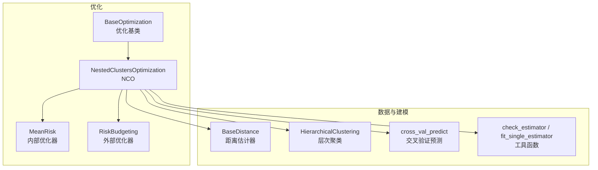
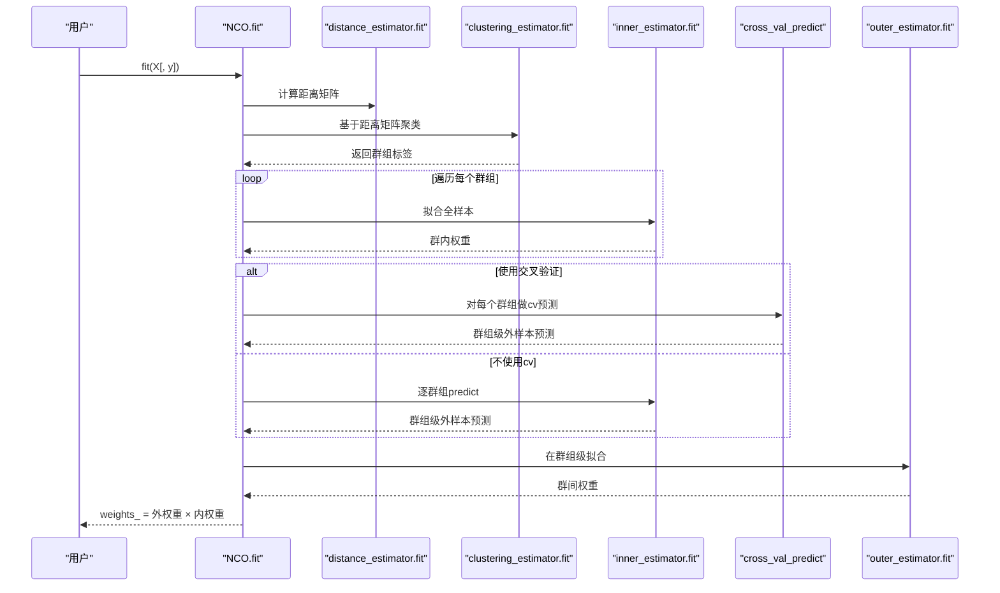
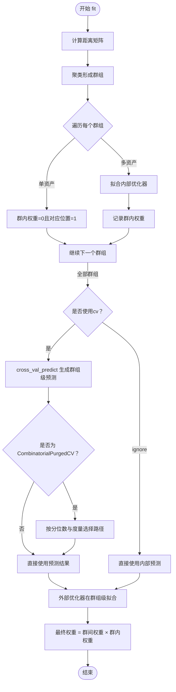
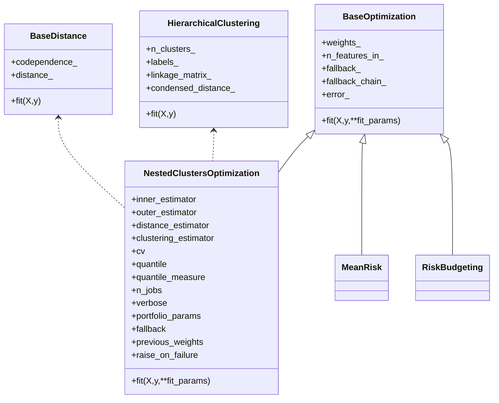

# NestedClustersOptimization API

<cite>
**本文引用的文件**
- [src/skfolio/optimization/cluster/_nco.py](file://src/skfolio/optimization/cluster/_nco.py)
- [src/skfolio/optimization/_base.py](file://src/skfolio/optimization/_base.py)
- [src/skfolio/distance/_base.py](file://src/skfolio/distance/_base.py)
- [src/skfolio/cluster/_hierarchical.py](file://src/skfolio/cluster/_hierarchical.py)
- [src/skfolio/model_selection/_validation.py](file://src/skfolio/model_selection/_validation.py)
- [src/skfolio/utils/tools.py](file://src/skfolio/utils/tools.py)
- [src/skfolio/optimization/convex/_mean_risk.py](file://src/skfolio/optimization/convex/_mean_risk.py)
- [src/skfolio/optimization/convex/_risk_budgeting.py](file://src/skfolio/optimization/convex/_risk_budgeting.py)
- [examples/clustering/plot_4_nco.py](file://examples/clustering/plot_4_nco.py)
- [examples/clustering/plot_5_nco_grid_search.py](file://examples/clustering/plot_5_nco_grid_search.py)
- [tests/test_optimization/test_cluster/test_nco.py](file://tests/test_optimization/test_cluster/test_nco.py)
- [docs/user_guide/optimization.rst](file://docs/user_guide/optimization.rst)
</cite>

## 目录
1. [简介](#简介)
2. [项目结构](#项目结构)
3. [核心组件](#核心组件)
4. [架构总览](#架构总览)
5. [详细组件分析](#详细组件分析)
6. [依赖关系分析](#依赖关系分析)
7. [性能考量](#性能考量)
8. [故障排查指南](#故障排查指南)
9. [结论](#结论)
10. [附录](#附录)

## 简介
NestedClustersOptimization（NCO）是一种分层嵌套优化方法，由 Marcos López de Prado 提出。它通过“先聚类、再优化”的两阶段流程，将高维资产空间分解为若干子群组，在每个群组内使用内部优化器（inner_estimator）进行局部优化，并在群组层面使用外部优化器（outer_estimator）进行权重分配。该方法结合了分层聚类的稳健性与全局优化的精确性，能够有效降低高维优化问题的复杂度与过拟合风险，提升样本外表现。

NCO 的关键思想：
- 使用距离矩阵构建资产间的相似性结构，形成群组；
- 在每个群组内对全部训练数据拟合内部优化器，得到“群内权重”；
- 对内部优化器的输出进行交叉验证，获得群组级的“群间权重”；
- 最终资产权重为“群间权重”与“群内权重”的矩阵乘积。

本篇文档面向使用者与开发者，系统梳理 NCO 的参数、流程、典型用法与注意事项，并提供可视化与性能建议。

## 项目结构
围绕 NCO 的相关模块与示例如下：
- 优化基类与 NCO 实现：src/skfolio/optimization/_base.py、src/skfolio/optimization/cluster/_nco.py
- 距离与聚类：src/skfolio/distance/_base.py、src/skfolio/cluster/_hierarchical.py
- 内部/外部优化器示例：src/skfolio/optimization/convex/_mean_risk.py、src/skfolio/optimization/convex/_risk_budgeting.py
- 交叉验证工具：src/skfolio/model_selection/_validation.py
- 工具函数：src/skfolio/utils/tools.py
- 示例与测试：examples/clustering/plot_4_nco.py、examples/clustering/plot_5_nco_grid_search.py、tests/test_optimization/test_cluster/test_nco.py
- 用户指南：docs/user_guide/optimization.rst

图表来源
- [src/skfolio/optimization/cluster/_nco.py](file://src/skfolio/optimization/cluster/_nco.py#L1-L210)
- [src/skfolio/optimization/_base.py](file://src/skfolio/optimization/_base.py#L1-L120)
- [src/skfolio/distance/_base.py](file://src/skfolio/distance/_base.py#L1-L57)
- [src/skfolio/cluster/_hierarchical.py](file://src/skfolio/cluster/_hierarchical.py#L109-L200)
- [src/skfolio/model_selection/_validation.py](file://src/skfolio/model_selection/_validation.py#L35-L140)
- [src/skfolio/utils/tools.py](file://src/skfolio/utils/tools.py#L328-L357)

章节来源
- [src/skfolio/optimization/cluster/_nco.py](file://src/skfolio/optimization/cluster/_nco.py#L1-L210)
- [src/skfolio/optimization/_base.py](file://src/skfolio/optimization/_base.py#L1-L120)
- [src/skfolio/distance/_base.py](file://src/skfolio/distance/_base.py#L1-L57)
- [src/skfolio/cluster/_hierarchical.py](file://src/skfolio/cluster/_hierarchical.py#L109-L200)
- [src/skfolio/model_selection/_validation.py](file://src/skfolio/model_selection/_validation.py#L35-L140)
- [src/skfolio/utils/tools.py](file://src/skfolio/utils/tools.py#L328-L357)

## 核心组件
- NestedClustersOptimization（NCO）
  - 参数与职责
    - inner_estimator：群内优化器，默认 MeanRisk，用于在每个群组内对全部训练数据拟合，得到群内权重。
    - outer_estimator：群间优化器，默认 MeanRisk，用于在群组层面进行权重分配。
    - distance_estimator：距离估计器，默认 PearsonDistance，用于从收益率计算资产间的“共依存/距离”矩阵。
    - clustering_estimator：聚类估计器，默认 HierarchicalClustering，用于基于距离矩阵生成群组标签。
    - cv：交叉验证策略，用于在群组内生成内部优化器的外样本预测，作为外部优化器的输入特征。支持 KFold、CombinatorialPurgedCV 等。
    - quantile、quantile_measure：当 cv 为 CombinatorialPurgedCV 时，用于从多路径预测中选择特定分位数路径。
    - n_jobs、verbose、portfolio_params、fallback、previous_weights、raise_on_failure：通用优化器参数，控制并行、回退策略与错误处理。
  - 关键属性
    - weights_：最终资产权重向量。
    - distance_estimator_、inner_estimators_、outer_estimator_、clustering_estimator_：已拟合的子估计器。
    - n_features_in_、feature_names_in_：训练资产数量与名称。
    - fallback_、fallback_chain_、error_：回退链路与错误信息。

章节来源
- [src/skfolio/optimization/cluster/_nco.py](file://src/skfolio/optimization/cluster/_nco.py#L35-L212)
- [src/skfolio/optimization/_base.py](file://src/skfolio/optimization/_base.py#L39-L120)

## 架构总览
NCO 的两阶段流程如下：
- 第一阶段（群内优化）：对每个群组独立拟合 inner_estimator，得到群内权重；单资产群组直接赋予单位权重。
- 第二阶段（群间优化）：使用 cv 对内部优化器进行交叉验证预测，得到群组级的外样本输出；随后用 outer_estimator 在群组层面进行权重分配；最终资产权重为“群间权重 × 群内权重”。

图表来源
- [src/skfolio/optimization/cluster/_nco.py](file://src/skfolio/optimization/cluster/_nco.py#L270-L447)
- [src/skfolio/model_selection/_validation.py](file://src/skfolio/model_selection/_validation.py#L35-L140)
- [src/skfolio/utils/tools.py](file://src/skfolio/utils/tools.py#L577-L620)

章节来源
- [src/skfolio/optimization/cluster/_nco.py](file://src/skfolio/optimization/cluster/_nco.py#L270-L447)
- [src/skfolio/model_selection/_validation.py](file://src/skfolio/model_selection/_validation.py#L35-L140)
- [src/skfolio/utils/tools.py](file://src/skfolio/utils/tools.py#L577-L620)

## 详细组件分析

### NCO 类与参数详解
- 参数
  - inner_estimator：内部优化器，默认 MeanRisk。可替换为其他优化器（如 MeanRisk、RiskBudgeting 等），用于在群组内进行权重优化。
  - outer_estimator：外部优化器，默认 MeanRisk。用于在群组层面进行权重分配。
  - distance_estimator：距离估计器，默认 PearsonDistance。可替换为其他距离估计器（如 KendallDistance 等）。
  - clustering_estimator：聚类估计器，默认 HierarchicalClustering。可替换为 sklearn 的 KMeans 等。
  - cv：交叉验证策略。默认 KFold；也可使用 CombinatorialPurgedCV 或 "ignore"（不进行交叉验证，但可能带来过拟合风险）。
  - quantile、quantile_measure：当 cv 为 CombinatorialPurgedCV 时，选择特定分位数路径。
  - n_jobs、verbose、portfolio_params、fallback、previous_weights、raise_on_failure：通用优化器参数，控制并行、回退与错误处理。
- 属性
  - weights_：最终资产权重。
  - distance_estimator_、inner_estimators_、outer_estimator_、clustering_estimator_：已拟合的子估计器。
  - n_features_in_、feature_names_in_：训练资产数量与名称。
  - fallback_、fallback_chain_、error_：回退链路与错误信息。

章节来源
- [src/skfolio/optimization/cluster/_nco.py](file://src/skfolio/optimization/cluster/_nco.py#L35-L212)
- [src/skfolio/optimization/_base.py](file://src/skfolio/optimization/_base.py#L39-L120)

### 两阶段优化流程解析
- 第一阶段：群内优化
  - 对每个群组独立拟合 inner_estimator，得到群内权重；单资产群组直接赋权 1。
  - 支持并行 fit_single_estimator，提高大规模场景下的效率。
- 第二阶段：群间优化
  - 若 cv 为 "ignore"，则直接使用内部优化器的预测作为群组级输入；
  - 否则使用 cross_val_predict 生成群组级外样本预测，作为 outer_estimator 的输入；
  - 当 cv 为 CombinatorialPurgedCV 时，从多路径预测中按分位数与度量选择最优路径；
  - 使用 outer_estimator 在群组层面拟合，得到群间权重；
  - 最终资产权重 = 群间权重 × 群内权重。

图表来源
- [src/skfolio/optimization/cluster/_nco.py](file://src/skfolio/optimization/cluster/_nco.py#L337-L446)
- [src/skfolio/model_selection/_validation.py](file://src/skfolio/model_selection/_validation.py#L35-L140)
- [src/skfolio/utils/tools.py](file://src/skfolio/utils/tools.py#L577-L620)

章节来源
- [src/skfolio/optimization/cluster/_nco.py](file://src/skfolio/optimization/cluster/_nco.py#L337-L446)
- [src/skfolio/model_selection/_validation.py](file://src/skfolio/model_selection/_validation.py#L35-L140)
- [src/skfolio/utils/tools.py](file://src/skfolio/utils/tools.py#L577-L620)

### 典型用法与示例
- 基础用法与比较
  - 使用 MeanRisk 作为内部优化器，RiskBudgeting 作为外部优化器，HierarchicalClustering 作为聚类器，Pearson 距离作为距离估计器。
  - 可对比 EqualWeighted 基准模型，观察样本外收益与波动差异。
- 参数搜索与分布分析
  - 使用 GridSearchCV 与 WalkForward 进行超参数搜索；
  - 使用 CombinatorialPurgedCV 生成多测试路径，评估 Sharpe Ratio 分布与稳定性。

章节来源
- [examples/clustering/plot_4_nco.py](file://examples/clustering/plot_4_nco.py#L1-L182)
- [examples/clustering/plot_5_nco_grid_search.py](file://examples/clustering/plot_5_nco_grid_search.py#L1-L195)

### 与内部/外部优化器的关系
- 内部优化器（inner_estimator）
  - 默认 MeanRisk，可配置目标函数与风险度量（如方差、CVaR 等）。
  - 在每个群组内对全部训练数据拟合，确保充分利用样本。
- 外部优化器（outer_estimator）
  - 默认 MeanRisk，也可替换为 RiskBudgeting 等，用于在群组层面进行权重分配。
  - 输入为各群组的外样本预测，避免数据泄露。

章节来源
- [src/skfolio/optimization/convex/_mean_risk.py](file://src/skfolio/optimization/convex/_mean_risk.py#L31-L120)
- [src/skfolio/optimization/convex/_risk_budgeting.py](file://src/skfolio/optimization/convex/_risk_budgeting.py#L25-L120)

### 距离估计器与聚类估计器
- 距离估计器（distance_estimator）
  - 默认 PearsonDistance，也可使用 KendallDistance 等，影响聚类结构与稳定性。
- 聚类估计器（clustering_estimator）
  - 默认 HierarchicalClustering，支持多种链接方法（如 Ward、Single 等）。
  - 也可使用 sklearn.cluster.KMeans 等。

章节来源
- [src/skfolio/distance/_base.py](file://src/skfolio/distance/_base.py#L1-L57)
- [src/skfolio/cluster/_hierarchical.py](file://src/skfolio/cluster/_hierarchical.py#L109-L200)

## 依赖关系分析
- 组件耦合
  - NCO 依赖 BaseOptimization（继承自 sklearn.base.BaseEstimator），具备统一的 fit/predict/fallback 接口。
  - NCO 依赖距离估计器生成距离矩阵，依赖聚类估计器生成群组标签。
  - NCO 依赖 cross_val_predict 生成群组级外样本预测，避免数据泄露。
  - NCO 依赖工具函数 check_estimator、fit_single_estimator 实现类型检查与并行拟合。
- 外部依赖
  - sklearn（BaseEstimator、ClusterMixin、model_selection、utils 等）。
  - pandas（DataFrame 列名保留与可视化）。
  - scipy（层次聚类链接矩阵）。
  - cvxpy（ConvexOptimization 子类，如 MeanRisk、RiskBudgeting）。

图表来源
- [src/skfolio/optimization/_base.py](file://src/skfolio/optimization/_base.py#L39-L120)
- [src/skfolio/optimization/cluster/_nco.py](file://src/skfolio/optimization/cluster/_nco.py#L35-L212)
- [src/skfolio/distance/_base.py](file://src/skfolio/distance/_base.py#L1-L57)
- [src/skfolio/cluster/_hierarchical.py](file://src/skfolio/cluster/_hierarchical.py#L109-L200)
- [src/skfolio/optimization/convex/_mean_risk.py](file://src/skfolio/optimization/convex/_mean_risk.py#L31-L120)
- [src/skfolio/optimization/convex/_risk_budgeting.py](file://src/skfolio/optimization/convex/_risk_budgeting.py#L25-L120)

章节来源
- [src/skfolio/optimization/_base.py](file://src/skfolio/optimization/_base.py#L39-L120)
- [src/skfolio/optimization/cluster/_nco.py](file://src/skfolio/optimization/cluster/_nco.py#L35-L212)
- [src/skfolio/distance/_base.py](file://src/skfolio/distance/_base.py#L1-L57)
- [src/skfolio/cluster/_hierarchical.py](file://src/skfolio/cluster/_hierarchical.py#L109-L200)
- [src/skfolio/optimization/convex/_mean_risk.py](file://src/skfolio/optimization/convex/_mean_risk.py#L31-L120)
- [src/skfolio/optimization/convex/_risk_budgeting.py](file://src/skfolio/optimization/convex/_risk_budgeting.py#L25-L120)

## 性能考量
- 并行化
  - 使用 n_jobs 控制并行度，加速内部优化器与交叉验证预测。
- 交叉验证策略
  - 使用 KFold 或 CombinatorialPurgedCV 时，注意随机种子与路径数量，避免过拟合。
- 数据规模
  - 聚类与内部优化器拟合在每个群组上独立进行，适合高维稀疏场景；但需关注群组数量与大小。
- 回退机制
  - fallback 与 raise_on_failure 可在失败时快速恢复或抛错，便于调试与生产部署。

[本节为通用指导，无需列出具体文件来源]

## 故障排查指南
- 常见问题
  - 聚类不稳定：尝试不同的距离估计器（如 Pearson、Kendall）与链接方法（Ward、Single）。
  - 过拟合风险：避免使用 "ignore" 作为 cv；优先使用 KFold 或 CombinatorialPurgedCV。
  - 单资产群组：NCO 对单资产群组直接赋权 1，不会触发内部优化器，属预期行为。
  - 错误处理：启用 fallback 与 raise_on_failure，查看 error_ 与 fallback_chain_ 定位问题。
- 测试参考
  - 单元测试覆盖了 cv、CombinatorialPurgedCV、数组输入等场景，可对照定位问题。

章节来源
- [tests/test_optimization/test_cluster/test_nco.py](file://tests/test_optimization/test_cluster/test_nco.py#L32-L209)
- [src/skfolio/optimization/_base.py](file://src/skfolio/optimization/_base.py#L127-L200)

## 结论
NCO 将“稳健的聚类结构”与“精确的全局优化”相结合，通过两阶段流程有效降低高维优化复杂度与过拟合风险。合理选择距离估计器、聚类器、内部/外部优化器与交叉验证策略，可在样本外显著提升投资组合表现。建议在实际应用中：
- 优先使用 KFold 或 CombinatorialPurgedCV；
- 尝试不同距离与链接方法，观察聚类稳定性；
- 使用 MeanRisk/RiskBudgeting 等优化器灵活配置目标与风险度量；
- 启用并行与回退机制，兼顾性能与鲁棒性。

[本节为总结性内容，无需列出具体文件来源]

## 附录
- 用户指南参考
  - 用户指南对 NCO 的背景、优势与使用要点有概述性介绍，可作为入门阅读。

章节来源
- [docs/user_guide/optimization.rst](file://docs/user_guide/optimization.rst#L650-L674)