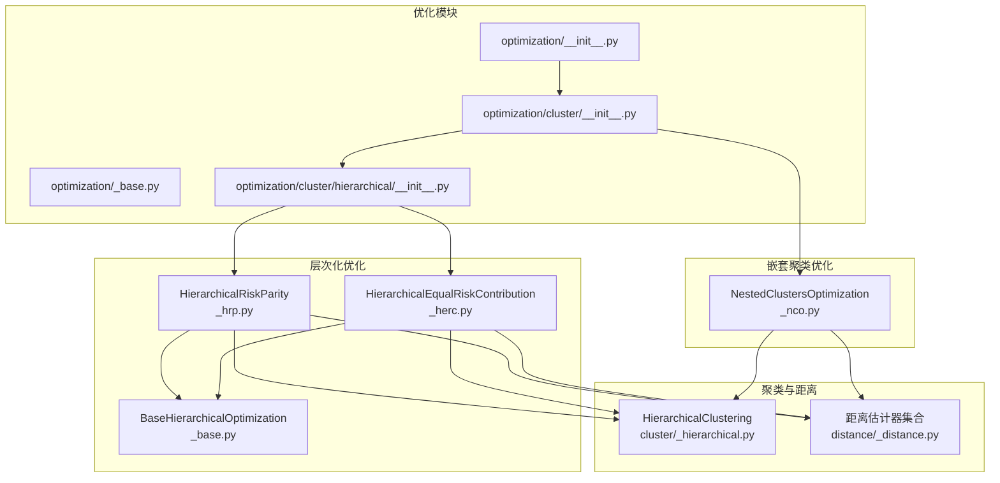
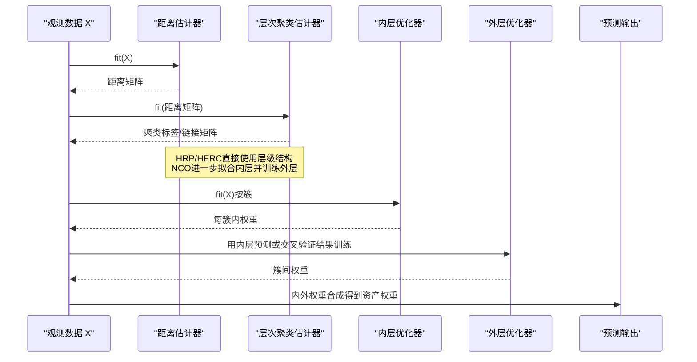
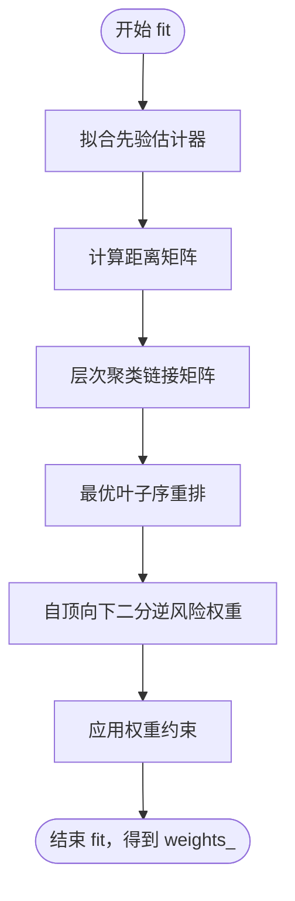
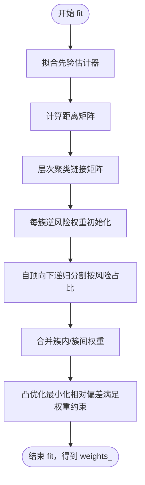
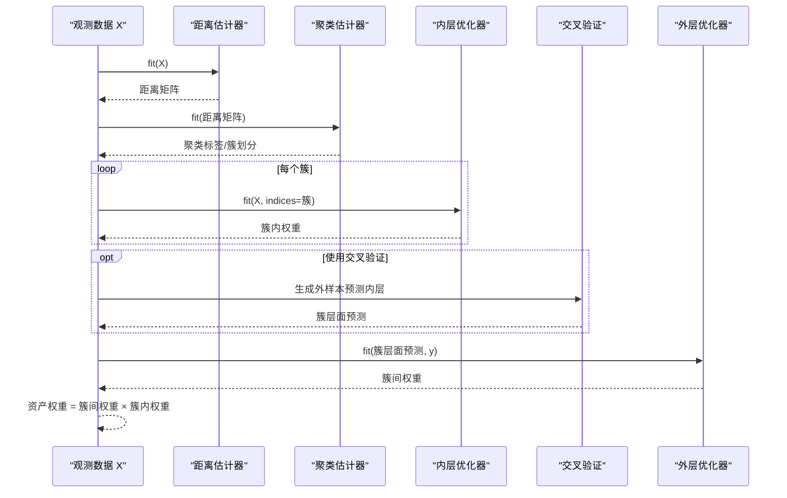
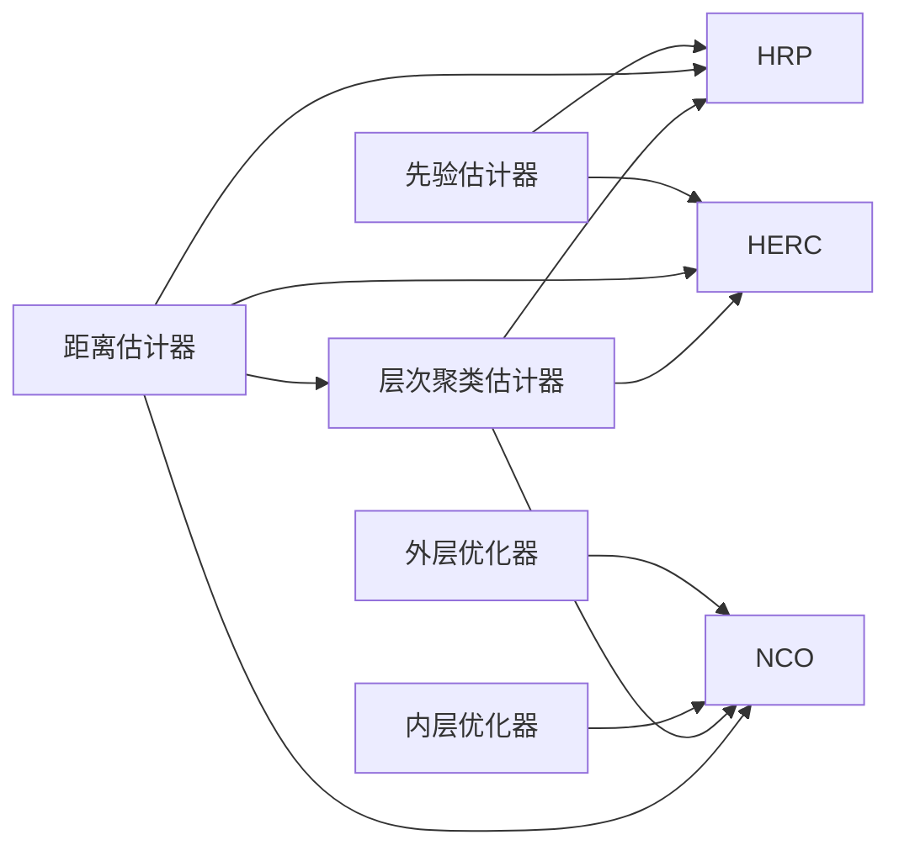

# 分层聚类优化API

<cite>
**本文引用的文件**
- [src/skfolio/optimization/cluster/_nco.py](file://src/skfolio/optimization/cluster/_nco.py)
- [src/skfolio/optimization/cluster/hierarchical/_hrp.py](file://src/skfolio/optimization/cluster/hierarchical/_hrp.py)
- [src/skfolio/optimization/cluster/hierarchical/_herc.py](file://src/skfolio/optimization/cluster/hierarchical/_herc.py)
- [src/skfolio/optimization/cluster/hierarchical/_base.py](file://src/skfolio/optimization/cluster/hierarchical/_base.py)
- [src/skfolio/optimization/cluster/hierarchical/__init__.py](file://src/skfolio/optimization/cluster/hierarchical/__init__.py)
- [src/skfolio/optimization/cluster/__init__.py](file://src/skfolio/optimization/cluster/__init__.py)
- [src/skfolio/optimization/__init__.py](file://src/skfolio/optimization/__init__.py)
- [src/skfolio/optimization/_base.py](file://src/skfolio/optimization/_base.py)
- [src/skfolio/cluster/_hierarchical.py](file://src/skfolio/cluster/_hierarchical.py)
- [src/skfolio/distance/_distance.py](file://src/skfolio/distance/_distance.py)
- [src/skfolio/distance/__init__.py](file://src/skfolio/distance/__init__.py)
- [examples/clustering/plot_4_nco.py](file://examples/clustering/plot_4_nco.py)
- [examples/clustering/plot_3_hrp_vs_herc.py](file://examples/clustering/plot_3_hrp_vs_herc.py)
</cite>

## 目录
1. [简介](#简介)
2. [项目结构](#项目结构)
3. [核心组件](#核心组件)
4. [架构总览](#架构总览)
5. [详细组件分析](#详细组件分析)
6. [依赖关系分析](#依赖关系分析)
7. [性能考量](#性能考量)
8. [故障排查指南](#故障排查指南)
9. [结论](#结论)
10. [附录：示例与最佳实践](#附录示例与最佳实践)

## 简介
本文件为 skfolio 的分层聚类优化模块提供 API 文档，覆盖以下优化器：
- HierarchicalRiskParity（HRP）
- HierarchicalEqualRiskContribution（HERC）
- NestedClustersOptimization（NCO）

文档重点说明三类优化器如何利用资产收益率的相似性进行分组，并在组内与组间分别分配权重；同时解释参数（如 linkage、affinity、max_n_clusters 等）、属性（如 clusterer_、linkage_matrix_）与方法（fit、predict）的作用机制，并给出使用不同距离度量与聚类方法构建稳健投资组合的示例思路。特别说明 NCO 如何结合聚类结构与全局优化以提升性能。

## 项目结构
分层聚类优化模块位于 optimization/cluster 下，包含两类：
- 层次化优化（hierarchical）：HRP、HERC、Schur 补
- 嵌套聚类优化（NCO）：将“组内优化 + 组间优化”的两阶段流程封装为统一估计器

图表来源
- [src/skfolio/optimization/__init__.py](file://src/skfolio/optimization/__init__.py#L1-L43)
- [src/skfolio/optimization/cluster/__init__.py](file://src/skfolio/optimization/cluster/__init__.py#L1-L18)
- [src/skfolio/optimization/cluster/hierarchical/__init__.py](file://src/skfolio/optimization/cluster/hierarchical/__init__.py#L1-L20)
- [src/skfolio/optimization/cluster/hierarchical/_hrp.py](file://src/skfolio/optimization/cluster/hierarchical/_hrp.py#L1-L490)
- [src/skfolio/optimization/cluster/hierarchical/_herc.py](file://src/skfolio/optimization/cluster/hierarchical/_herc.py#L1-L522)
- [src/skfolio/optimization/cluster/hierarchical/_base.py](file://src/skfolio/optimization/cluster/hierarchical/_base.py#L1-L474)
- [src/skfolio/optimization/cluster/_nco.py](file://src/skfolio/optimization/cluster/_nco.py#L1-L447)
- [src/skfolio/cluster/_hierarchical.py](file://src/skfolio/cluster/_hierarchical.py#L1-L208)
- [src/skfolio/distance/_distance.py](file://src/skfolio/distance/_distance.py#L1-L554)

章节来源
- [src/skfolio/optimization/cluster/hierarchical/__init__.py](file://src/skfolio/optimization/cluster/hierarchical/__init__.py#L1-L20)
- [src/skfolio/optimization/cluster/__init__.py](file://src/skfolio/optimization/cluster/__init__.py#L1-L18)
- [src/skfolio/optimization/__init__.py](file://src/skfolio/optimization/__init__.py#L1-L43)

## 核心组件
- BaseOptimization：所有优化器的基类，提供统一的 fit/predict 接口、回退策略（fallback）、错误处理（raise_on_failure）与预测时的 Portfolio 参数转发。
- BaseHierarchicalOptimization：层次化聚类优化的抽象基类，统一了风险度量、先验估计器、距离估计器、层次聚类估计器以及权重约束等通用能力。
- HierarchicalRiskParity（HRP）：基于树状层次聚类与最优叶子序重排，采用自顶向下二分法按逆风险权重分配权重。
- HierarchicalEqualRiskContribution（HERC）：基于树状层次聚类，先按逆风险分配每簇权重，再自顶向下递归分割，最终通过凸优化最小化相对偏差满足权重约束。
- NestedClustersOptimization（NCO）：两阶段嵌套优化，先对每簇拟合“内层”优化器得到簇内权重，再用“外层”优化器在簇层面进行权重分配；支持交叉验证避免数据泄露。

章节来源
- [src/skfolio/optimization/_base.py](file://src/skfolio/optimization/_base.py#L1-L200)
- [src/skfolio/optimization/cluster/hierarchical/_base.py](file://src/skfolio/optimization/cluster/hierarchical/_base.py#L1-L474)
- [src/skfolio/optimization/cluster/hierarchical/_hrp.py](file://src/skfolio/optimization/cluster/hierarchical/_hrp.py#L1-L490)
- [src/skfolio/optimization/cluster/hierarchical/_herc.py](file://src/skfolio/optimization/cluster/hierarchical/_herc.py#L1-L522)
- [src/skfolio/optimization/cluster/_nco.py](file://src/skfolio/optimization/cluster/_nco.py#L1-L447)

## 架构总览
下图展示了三个优化器在“相似性度量 → 聚类 → 权重分配”的通用流程，以及 NCO 的两阶段嵌套结构。

图表来源
- [src/skfolio/optimization/cluster/_nco.py](file://src/skfolio/optimization/cluster/_nco.py#L270-L447)
- [src/skfolio/optimization/cluster/hierarchical/_hrp.py](file://src/skfolio/optimization/cluster/hierarchical/_hrp.py#L322-L438)
- [src/skfolio/optimization/cluster/hierarchical/_herc.py](file://src/skfolio/optimization/cluster/hierarchical/_herc.py#L360-L521)
- [src/skfolio/cluster/_hierarchical.py](file://src/skfolio/cluster/_hierarchical.py#L109-L208)
- [src/skfolio/distance/_distance.py](file://src/skfolio/distance/_distance.py#L1-L554)

## 详细组件分析

### HierarchicalRiskParity（HRP）
- 作用：基于树状层次聚类与最优叶子序重排，采用自顶向下二分法按逆风险权重分配权重。
- 关键参数
  - risk_measure：可选多种风险度量（方差、半方差、CVaR、最大回撤等）
  - prior_estimator：先验估计器（默认经验先验），用于估计期望收益、协方差与回报序列
  - distance_estimator：距离估计器（默认皮尔逊距离）
  - hierarchical_clustering_estimator：层次聚类估计器（默认 HierarchicalClustering）
  - min_weights/max_weights：资产权重上下界
  - transaction_costs/management_fees/previous_weights：交易成本、管理费与上期权重
  - portfolio_params/fallback/raise_on_failure：预测参数与回退策略
- 关键属性
  - weights_：资产权重
  - distance_estimator_、hierarchical_clustering_estimator_：已拟合的距离与层次聚类估计器
  - n_features_in_、feature_names_in_：资产数量与名称
  - fallback_、fallback_chain_、error_：回退链与错误信息
- 关键方法
  - fit(X[, y])：拟合并计算权重
  - predict(...)：返回 Portfolio（含回退与错误处理）
- 处理逻辑要点
  - 使用先验估计器得到回报序列与协方差
  - 计算距离矩阵并生成层次聚类链接矩阵
  - 最优叶子序重排后，自顶向下二分，按逆风险权重比例更新权重
  - 支持权重约束（上下界）的中间调整

图表来源
- [src/skfolio/optimization/cluster/hierarchical/_hrp.py](file://src/skfolio/optimization/cluster/hierarchical/_hrp.py#L322-L438)
- [src/skfolio/optimization/cluster/hierarchical/_base.py](file://src/skfolio/optimization/cluster/hierarchical/_base.py#L335-L451)

章节来源
- [src/skfolio/optimization/cluster/hierarchical/_hrp.py](file://src/skfolio/optimization/cluster/hierarchical/_hrp.py#L1-L490)
- [src/skfolio/optimization/cluster/hierarchical/_base.py](file://src/skfolio/optimization/cluster/hierarchical/_base.py#L1-L474)

### HierarchicalEqualRiskContribution（HERC）
- 作用：基于树状层次聚类，先按逆风险分配每簇权重，再自顶向下递归分割，最终通过凸优化最小化相对偏差满足权重约束。
- 关键参数
  - risk_measure：可选多种风险度量
  - prior_estimator：先验估计器（默认经验先验）
  - distance_estimator：距离估计器（默认皮尔逊距离）
  - hierarchical_clustering_estimator：层次聚类估计器（默认 HierarchicalClustering）
  - min_weights/max_weights：资产权重上下界
  - solver/solver_params：凸优化求解器及其参数
  - transaction_costs/management_fees/previous_weights/portfolio_params/fallback/raise_on_failure
- 关键属性
  - weights_、distance_estimator_、hierarchical_clustering_estimator_、n_features_in_、feature_names_in_、fallback_、fallback_chain_、error_
- 关键方法
  - fit(X[, y])：拟合并计算权重
  - predict(...)：返回 Portfolio
- 处理逻辑要点
  - 先计算每簇的逆风险分配权重作为初始值
  - 自顶向下递归分割，按左右子树风险占比更新簇间权重
  - 完成后对整体权重做最小化相对偏差的凸优化以满足权重约束

图表来源
- [src/skfolio/optimization/cluster/hierarchical/_herc.py](file://src/skfolio/optimization/cluster/hierarchical/_herc.py#L360-L521)
- [src/skfolio/optimization/cluster/hierarchical/_base.py](file://src/skfolio/optimization/cluster/hierarchical/_base.py#L335-L451)

章节来源
- [src/skfolio/optimization/cluster/hierarchical/_herc.py](file://src/skfolio/optimization/cluster/hierarchical/_herc.py#L1-L522)
- [src/skfolio/optimization/cluster/hierarchical/_base.py](file://src/skfolio/optimization/cluster/hierarchical/_base.py#L1-L474)

### NestedClustersOptimization（NCO）
- 作用：两阶段嵌套优化。先对每簇拟合“内层”优化器得到簇内权重；再用“外层”优化器在簇层面进行权重分配；支持交叉验证避免数据泄露。
- 关键参数
  - inner_estimator：内层优化器（默认 MeanRisk）
  - outer_estimator：外层优化器（默认 MeanRisk）
  - distance_estimator：距离估计器（默认 PearsonDistance）
  - clustering_estimator：聚类估计器（默认 HierarchicalClustering）
  - cv：交叉验证策略（默认 KFold；也可使用 CombinatorialPurgedCV；或 "ignore"）
  - quantile/quantile_measure：当使用 CombinatorialPurgedCV 时，选择路径的分位数与度量
  - n_jobs：并行作业数
  - portfolio_params/fallback/raise_on_failure：预测参数与回退策略
- 关键属性
  - weights_、distance_estimator_、inner_estimators_、outer_estimator_、clustering_estimator_、n_features_in_、feature_names_in_、fallback_、fallback_chain_、error_
- 关键方法
  - fit(X[, y])：拟合并计算权重
  - predict(...)：返回 Portfolio
- 处理逻辑要点
  - 计算距离矩阵并拟合聚类估计器，得到聚类标签与簇划分
  - 对每个簇独立拟合内层优化器，得到簇内权重
  - 使用 cv 在簇层面生成内层估计器的外样本预测，作为外层优化器的输入
  - 外层优化器拟合后得到簇间权重，最终资产权重为“簇间权重 × 簇内权重”
  - 支持 CombinatorialPurgedCV 的多路径选择（按分位数与度量）

图表来源
- [src/skfolio/optimization/cluster/_nco.py](file://src/skfolio/optimization/cluster/_nco.py#L270-L447)
- [src/skfolio/cluster/_hierarchical.py](file://src/skfolio/cluster/_hierarchical.py#L109-L208)
- [src/skfolio/distance/_distance.py](file://src/skfolio/distance/_distance.py#L1-L554)

章节来源
- [src/skfolio/optimization/cluster/_nco.py](file://src/skfolio/optimization/cluster/_nco.py#L1-L447)

## 依赖关系分析
- 聚类与链接矩阵
  - HierarchicalClustering 提供链接矩阵与聚类标签，支持多种链接方法（如 Ward、Single、Complete、Average、Weighted、Centroid、Median）。
  - NCO 可替换为任意 sklearn 或 skfolio 聚类估计器（例如 KMeans）。
- 距离度量
  - 距离估计器将资产回报转换为代码相关性/距离矩阵，常用包括 Pearson、Kendall、Spearman、Covariance、Distance Correlation、Mutual Information。
  - HRP/HERC 默认使用 PearsonDistance；NCO 同样默认使用 PearsonDistance，但可自由替换。
- 风险度量与先验
  - HRP/HERC 通过 prior_estimator（默认 EmpiricalPrior）估计期望收益、协方差与回报序列，用于风险度量与距离计算。
- 两阶段优化与回退
  - NCO 的外层优化使用内层估计器的外样本预测，避免数据泄露；支持 CombinatorialPurgedCV 的多路径选择。
  - 所有优化器均继承 BaseOptimization，具备统一的回退策略与错误处理。

图表来源
- [src/skfolio/optimization/cluster/hierarchical/_hrp.py](file://src/skfolio/optimization/cluster/hierarchical/_hrp.py#L1-L490)
- [src/skfolio/optimization/cluster/hierarchical/_herc.py](file://src/skfolio/optimization/cluster/hierarchical/_herc.py#L1-L522)
- [src/skfolio/optimization/cluster/_nco.py](file://src/skfolio/optimization/cluster/_nco.py#L1-L447)
- [src/skfolio/cluster/_hierarchical.py](file://src/skfolio/cluster/_hierarchical.py#L109-L208)
- [src/skfolio/distance/_distance.py](file://src/skfolio/distance/_distance.py#L1-L554)

章节来源
- [src/skfolio/cluster/_hierarchical.py](file://src/skfolio/cluster/_hierarchical.py#L1-L208)
- [src/skfolio/distance/_distance.py](file://src/skfolio/distance/_distance.py#L1-L554)

## 性能考量
- 并行与资源
  - NCO 支持 n_jobs 控制并行度，适合大规模资产组合与多折交叉验证。
- 数据泄露防护
  - NCO 通过交叉验证生成内层估计器的外样本预测，再用于外层优化，有效避免数据泄露。
- 聚类稳定性
  - HierarchicalClustering 默认使用 Ward 链接方法，通常比 Single 更稳定；可通过 linkage_method 调整。
- 距离度量选择
  - 不同距离度量（Pearson、Kendall、Spearman、Covariance 等）对聚类结构影响显著，建议结合业务目标与数据特性进行选择。
- 两阶段优化优势
  - NCO 将“组内优化 + 组间优化”分离，既保留组内局部最优，又能在更高层进行全局权重分配，通常能提升稳定性与外样本表现。

[本节为通用指导，不直接分析具体文件]

## 故障排查指南
- 回退策略
  - 所有优化器均支持 fallback 与 raise_on_failure。若主优化失败，可依次尝试回退估计器或使用 previous_weights。
  - fallback_chain_ 记录每次尝试的结果；error_ 记录最后一次错误信息。
- 常见问题
  - 风险度量不支持：HRP/HERC 对某些风险度量（如偏度、峰度）不支持，会抛出异常。
  - 权重约束非法：min_weights 与 max_weights 必须满足非负、上限与和的约束。
  - 聚类标签异常：HierarchicalClustering 的链接矩阵形状与资产数需一致，否则可能由输入距离矩阵或链接方法导致。
- 定位手段
  - 查看 fallback_chain_ 与 error_，确认是哪一步骤失败。
  - 使用 predict 返回的 Portfolio 检查是否为 FailedPortfolio，以便区分运行时错误与数值不稳定。

章节来源
- [src/skfolio/optimization/_base.py](file://src/skfolio/optimization/_base.py#L1-L200)
- [src/skfolio/optimization/cluster/hierarchical/_hrp.py](file://src/skfolio/optimization/cluster/hierarchical/_hrp.py#L340-L353)
- [src/skfolio/optimization/cluster/hierarchical/_herc.py](file://src/skfolio/optimization/cluster/hierarchical/_herc.py#L388-L397)
- [src/skfolio/optimization/cluster/_nco.py](file://src/skfolio/optimization/cluster/_nco.py#L379-L401)

## 结论
- HRP 与 HERC 均基于层次聚类，前者强调自顶向下二分与逆风险权重，后者强调自顶向下递归分割与凸优化满足权重约束。
- NCO 将“组内 + 组间”两阶段优化统一建模，通过交叉验证避免数据泄露，适合在稳健性与性能之间取得平衡。
- 通过灵活选择距离度量、聚类方法与优化器，可在不同市场环境下构建稳健的投资组合。

[本节为总结，不直接分析具体文件]

## 附录：示例与最佳实践

### 示例一：使用不同距离度量与聚类方法构建稳健投资组合（NCO）
- 目标：比较不同距离度量与链接方法对聚类结构的影响，并评估其对组合表现的影响。
- 步骤
  - 使用 PearsonDistance、KendallDistance（absolute=True）等不同距离估计器
  - 使用 HierarchicalClustering 的不同 linkage_method（如 Ward、Single）
  - 使用 sklearn.cluster.KMeans 替换聚类估计器
  - 使用 EqualWeighted 作为基准模型
  - 在测试集上对比累计收益与组合构成

参考示例路径
- [examples/clustering/plot_4_nco.py](file://examples/clustering/plot_4_nco.py#L1-L182)

章节来源
- [examples/clustering/plot_4_nco.py](file://examples/clustering/plot_4_nco.py#L1-L182)

### 示例二：HRP 与 HERC 的参数调优与稳定性分析（HRP vs HERC）
- 目标：在滚动窗口下对 HRP 与 HERC 进行网格搜索，选择最优参数，并使用 CombinatorialPurgedCV 分析稳定性。
- 步骤
  - 选择风险度量（如 CVaR）
  - 搜索空间：距离估计器（Pearson、Kendall）与链接方法（Ward、Complete）
  - 使用 WalkForward 或 CombinatorialPurgedCV 进行交叉验证
  - 对比平均 Mean-CVaR 比率分布与稳定性

参考示例路径
- [examples/clustering/plot_3_hrp_vs_herc.py](file://examples/clustering/plot_3_hrp_vs_herc.py#L1-L227)

章节来源
- [examples/clustering/plot_3_hrp_vs_herc.py](file://examples/clustering/plot_3_hrp_vs_herc.py#L1-L227)

### 参数与属性速查表（简要）
- HierarchicalRiskParity（HRP）
  - 关键参数：risk_measure、prior_estimator、distance_estimator、hierarchical_clustering_estimator、min_weights、max_weights、transaction_costs、management_fees、previous_weights、portfolio_params、fallback、raise_on_failure
  - 关键属性：weights_、distance_estimator_、hierarchical_clustering_estimator_、n_features_in_、feature_names_in_、fallback_、fallback_chain_、error_
  - 关键方法：fit、predict
- HierarchicalEqualRiskContribution（HERC）
  - 关键参数：risk_measure、prior_estimator、distance_estimator、hierarchical_clustering_estimator、min_weights、max_weights、solver、solver_params、transaction_costs、management_fees、previous_weights、portfolio_params、fallback、raise_on_failure
  - 关键属性：weights_、distance_estimator_、hierarchical_clustering_estimator_、n_features_in_、feature_names_in_、fallback_、fallback_chain_、error_
  - 关键方法：fit、predict
- NestedClustersOptimization（NCO）
  - 关键参数：inner_estimator、outer_estimator、distance_estimator、clustering_estimator、cv、quantile、quantile_measure、n_jobs、portfolio_params、fallback、raise_on_failure、previous_weights
  - 关键属性：weights_、distance_estimator_、inner_estimators_、outer_estimator_、clustering_estimator_、n_features_in_、feature_names_in_、fallback_、fallback_chain_、error_
  - 关键方法：fit、predict

章节来源
- [src/skfolio/optimization/cluster/hierarchical/_hrp.py](file://src/skfolio/optimization/cluster/hierarchical/_hrp.py#L1-L490)
- [src/skfolio/optimization/cluster/hierarchical/_herc.py](file://src/skfolio/optimization/cluster/hierarchical/_herc.py#L1-L522)
- [src/skfolio/optimization/cluster/_nco.py](file://src/skfolio/optimization/cluster/_nco.py#L1-L447)