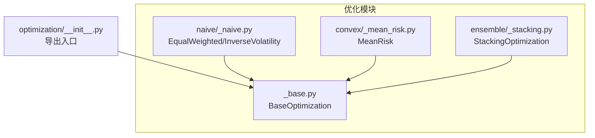
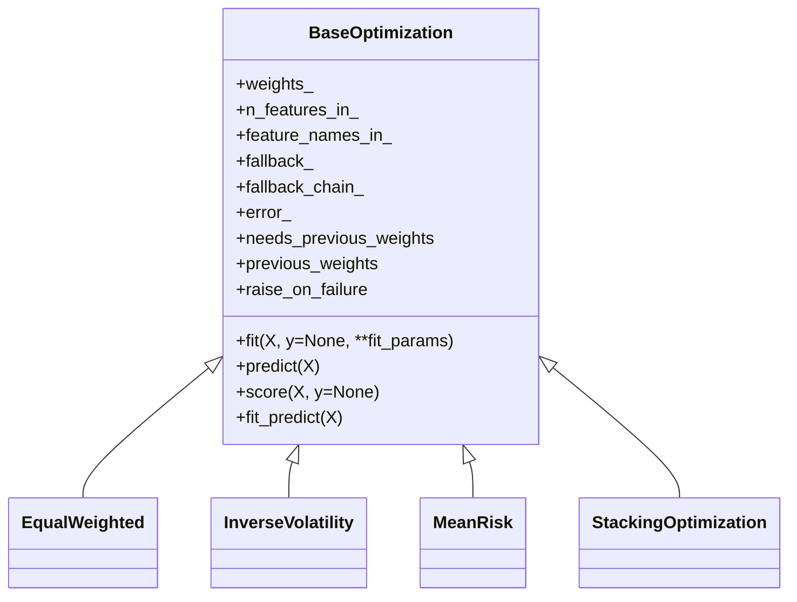
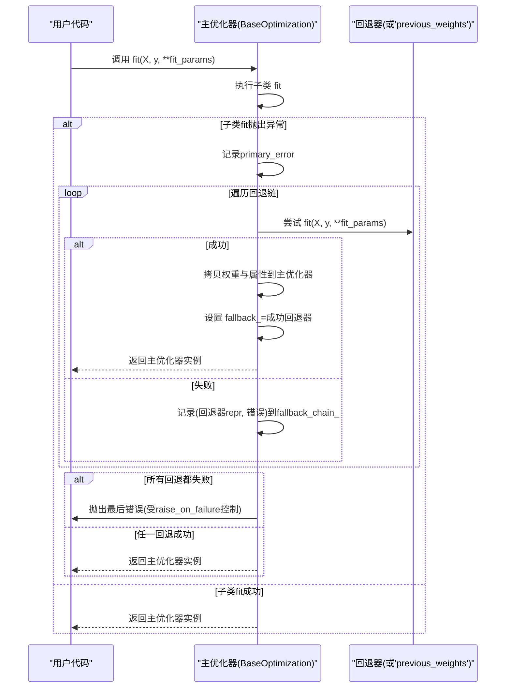
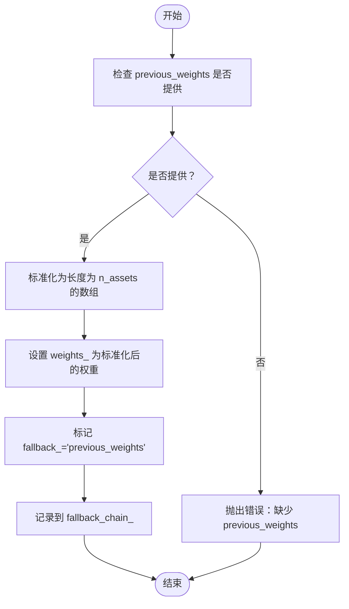
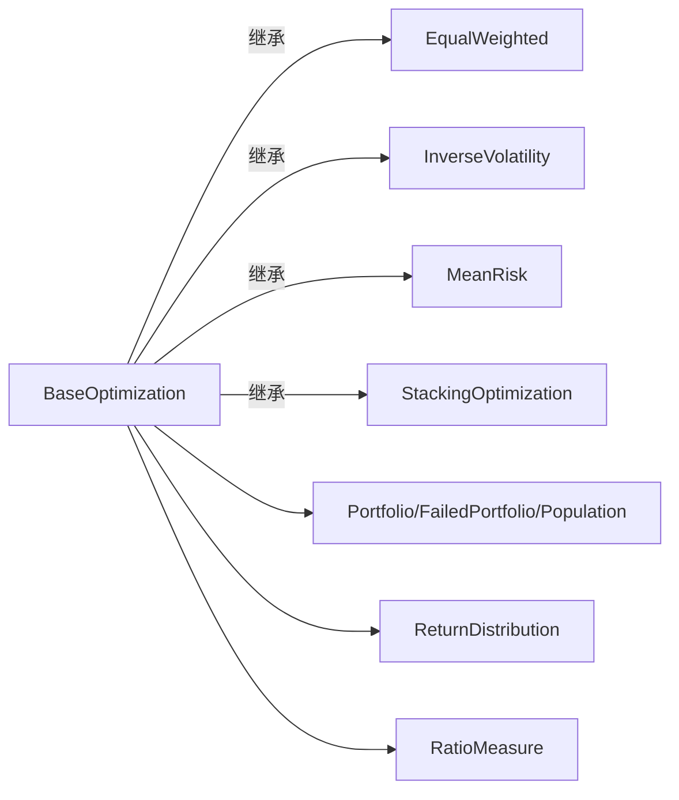

# 基础优化类API

<cite>
**本文引用的文件**
- [src/skfolio/optimization/_base.py](file://src/skfolio/optimization/_base.py)
- [src/skfolio/optimization/__init__.py](file://src/skfolio/optimization/__init__.py)
- [tests/test_optimization/test_fallback.py](file://tests/test_optimization/test_fallback.py)
- [examples/mean_risk/plot_17_failure_and_fallbacks.py](file://examples/mean_risk/plot_17_failure_and_fallbacks.py)
- [src/skfolio/optimization/naive/_naive.py](file://src/skfolio/optimization/naive/_naive.py)
- [src/skfolio/optimization/convex/_mean_risk.py](file://src/skfolio/optimization/convex/_mean_risk.py)
- [src/skfolio/optimization/ensemble/_stacking.py](file://src/skfolio/optimization/ensemble/_stacking.py)
- [src/skfolio/model_selection/_validation.py](file://src/skfolio/model_selection/_validation.py)
</cite>

## 目录
1. [简介](#简介)
2. [项目结构](#项目结构)
3. [核心组件](#核心组件)
4. [架构总览](#架构总览)
5. [详细组件分析](#详细组件分析)
6. [依赖关系分析](#依赖关系分析)
7. [性能考量](#性能考量)
8. [故障排查指南](#故障排查指南)
9. [结论](#结论)
10. [附录：继承与最佳实践](#附录继承与最佳实践)

## 简介
本文件面向skfolio的BaseOptimization基类，系统化梳理其作为所有优化器父类的职责与API，重点覆盖：
- 统一接口：fit、predict、score、fit_predict
- 失败处理与回退机制：fallback_chain_、fallback_、error_、previous_weights
- 与scikit-learn生态的兼容性（元数据路由、并行与流水线）
- 如何通过继承BaseOptimization创建自定义优化器，并给出最佳实践

## 项目结构
BaseOptimization位于优化模块根目录，被多个具体优化器继承；同时在组合与模型选择工具中被广泛使用。

图表来源
- [src/skfolio/optimization/_base.py](file://src/skfolio/optimization/_base.py#L1-L120)
- [src/skfolio/optimization/__init__.py](file://src/skfolio/optimization/__init__.py#L1-L43)
- [src/skfolio/optimization/naive/_naive.py](file://src/skfolio/optimization/naive/_naive.py#L1-L120)
- [src/skfolio/optimization/convex/_mean_risk.py](file://src/skfolio/optimization/convex/_mean_risk.py#L1-L120)
- [src/skfolio/optimization/ensemble/_stacking.py](file://src/skfolio/optimization/ensemble/_stacking.py#L134-L210)

章节来源
- [src/skfolio/optimization/_base.py](file://src/skfolio/optimization/_base.py#L1-L120)
- [src/skfolio/optimization/__init__.py](file://src/skfolio/optimization/__init__.py#L1-L43)

## 核心组件
- BaseOptimization：抽象基类，定义统一的fit/predict/score接口，内置失败回退与审计链路，支持previous_weights传播与回退到历史权重。
- 具体优化器：如EqualWeighted、InverseVolatility、MeanRisk等均继承自BaseOptimization，遵循scikit-learn风格。
- 组合器：StackingOptimization等组合器同样继承BaseOptimization，可复用其回退与审计能力。

章节来源
- [src/skfolio/optimization/_base.py](file://src/skfolio/optimization/_base.py#L39-L120)
- [src/skfolio/optimization/naive/_naive.py](file://src/skfolio/optimization/naive/_naive.py#L161-L200)
- [src/skfolio/optimization/convex/_mean_risk.py](file://src/skfolio/optimization/convex/_mean_risk.py#L1-L120)
- [src/skfolio/optimization/ensemble/_stacking.py](file://src/skfolio/optimization/ensemble/_stacking.py#L134-L210)

## 架构总览
BaseOptimization通过类装饰器机制为子类自动包裹fit方法，实现“主优化失败即按序尝试回退”的统一行为；predict根据weights_返回单个Portfolio或Population；score基于Sharpe比率计算。

图表来源
- [src/skfolio/optimization/_base.py](file://src/skfolio/optimization/_base.py#L114-L167)
- [src/skfolio/optimization/naive/_naive.py](file://src/skfolio/optimization/naive/_naive.py#L161-L200)
- [src/skfolio/optimization/convex/_mean_risk.py](file://src/skfolio/optimization/convex/_mean_risk.py#L1-L120)
- [src/skfolio/optimization/ensemble/_stacking.py](file://src/skfolio/optimization/ensemble/_stacking.py#L134-L210)

## 详细组件分析

### BaseOptimization类与统一接口
- fit：由子类实现；BaseOptimization通过类装饰器包装，捕获异常并触发回退链；成功后保留原实例引用。
- predict：根据weights_返回Portfolio或Population；当weights_为None且raise_on_failure=False时返回FailedPortfolio。
- score：返回单个Portfolio的Sharpe比率或Population的平均Sharpe比率。
- fit_predict：先fit再predict，适合快速评估。
- needs_previous_weights：用于模型选择工具决定是否需要顺序传递previous_weights。

章节来源
- [src/skfolio/optimization/_base.py](file://src/skfolio/optimization/_base.py#L288-L403)
- [src/skfolio/optimization/_base.py](file://src/skfolio/optimization/_base.py#L404-L452)

### 回退机制与审计链
- fallback_chain_：记录每次尝试的结果，元素为(estimator_repr, outcome)元组。
- fallback_：记录最终成功的回退器或字符串“previous_weights”。
- error_：保存fit失败时的错误信息（多输出时为列表）。
- _run_fallback_chain：执行回退链，支持单个或列表，支持“previous_weights”回退。
- _fallback_to_previous_weights_or_raise：校验并生成previous_weights权重向量。
- previous_weights传播：当主优化器设置previous_weights时，会自动传递给每个回退器（若回退器未显式设置则发出警告）。

图表来源
- [src/skfolio/optimization/_base.py](file://src/skfolio/optimization/_base.py#L131-L167)
- [src/skfolio/optimization/_base.py](file://src/skfolio/optimization/_base.py#L168-L256)
- [src/skfolio/optimization/_base.py](file://src/skfolio/optimization/_base.py#L257-L283)

章节来源
- [src/skfolio/optimization/_base.py](file://src/skfolio/optimization/_base.py#L131-L283)
- [tests/test_optimization/test_fallback.py](file://tests/test_optimization/test_fallback.py#L92-L162)
- [tests/test_optimization/test_fallback.py](file://tests/test_optimization/test_fallback.py#L256-L314)
- [tests/test_optimization/test_fallback.py](file://tests/test_optimization/test_fallback.py#L331-L390)
- [tests/test_optimization/test_fallback.py](file://tests/test_optimization/test_fallback.py#L472-L550)

### previous_weights参数与传播
- 支持标量、字典、数组三种输入形式，内部通过_clean_input/_clean_previous_weights标准化为长度为n_assets的数组。
- 当fallback="previous_weights"时，若主优化器提供previous_weights，则直接回退到该权重；否则抛出错误。
- 在回退链中，previous_weights会被自动传递给每个回退器（若回退器未显式设置则发出警告）。

图表来源
- [src/skfolio/optimization/_base.py](file://src/skfolio/optimization/_base.py#L497-L523)
- [src/skfolio/optimization/_base.py](file://src/skfolio/optimization/_base.py#L257-L283)

章节来源
- [src/skfolio/optimization/_base.py](file://src/skfolio/optimization/_base.py#L453-L523)
- [tests/test_optimization/test_fallback.py](file://tests/test_optimization/test_fallback.py#L331-L390)
- [tests/test_optimization/test_fallback.py](file://tests/test_optimization/test_fallback.py#L472-L550)

### predict与返回类型
- 单个weights_：返回Portfolio
- 二维weights_：返回Population（每行一个Portfolio），其中NaN行对应FailedPortfolio
- 若weights_为None且raise_on_failure=False：返回FailedPortfolio
- 默认名称：若未指定name，使用优化器类名前500字符
- portfolio_params：默认从优化器参数中传播transaction_costs、management_fees、previous_weights、risk_free_rate等

章节来源
- [src/skfolio/optimization/_base.py](file://src/skfolio/optimization/_base.py#L288-L374)

### score与Sharpe比率
- 单Portfolio：返回其Sharpe比率
- Population：返回各Portfolio Sharpe比率的均值

章节来源
- [src/skfolio/optimization/_base.py](file://src/skfolio/optimization/_base.py#L376-L403)

### needs_previous_weights与并行/流水线
- 当存在交易成本、最大换手率或回退依赖previous_weights时，needs_previous_weights为True
- 模型选择工具在检测到needs_previous_weights=True时，会强制串行并传递上期权重，避免并行导致的跨期耦合

章节来源
- [src/skfolio/optimization/_base.py](file://src/skfolio/optimization/_base.py#L424-L452)
- [src/skfolio/model_selection/_validation.py](file://src/skfolio/model_selection/_validation.py#L222-L255)

### 与scikit-learn生态的兼容性
- 继承自sklearn.base.BaseEstimator，遵循fit/predict/score等约定
- 支持元数据路由（metadata routing），允许通过Pipeline等工具传递参数
- 支持GridSearchCV、cross_val_predict等scikit-learn工具，失败时可配置raise_on_failure=False以保证流程连续性

章节来源
- [src/skfolio/optimization/naive/_naive.py](file://src/skfolio/optimization/naive/_naive.py#L112-L159)
- [src/skfolio/optimization/ensemble/_stacking.py](file://src/skfolio/optimization/ensemble/_stacking.py#L286-L353)
- [examples/mean_risk/plot_17_failure_and_fallbacks.py](file://examples/mean_risk/plot_17_failure_and_fallbacks.py#L180-L230)

## 依赖关系分析
- BaseOptimization依赖sklearn.base.BaseEstimator、numpy、pandas、skfolio内部模块（Portfolio、FailedPortfolio、Population、ReturnDistribution、RatioMeasure等）
- 具体优化器（如MeanRisk、EqualWeighted、InverseVolatility）继承BaseOptimization并实现各自的fit逻辑
- 组合器（StackingOptimization）同样继承BaseOptimization，内部管理多个子优化器

图表来源
- [src/skfolio/optimization/_base.py](file://src/skfolio/optimization/_base.py#L39-L120)
- [src/skfolio/optimization/naive/_naive.py](file://src/skfolio/optimization/naive/_naive.py#L161-L200)
- [src/skfolio/optimization/convex/_mean_risk.py](file://src/skfolio/optimization/convex/_mean_risk.py#L1-L120)
- [src/skfolio/optimization/ensemble/_stacking.py](file://src/skfolio/optimization/ensemble/_stacking.py#L134-L210)

章节来源
- [src/skfolio/optimization/_base.py](file://src/skfolio/optimization/_base.py#L39-L120)
- [src/skfolio/optimization/naive/_naive.py](file://src/skfolio/optimization/naive/_naive.py#L161-L200)
- [src/skfolio/optimization/convex/_mean_risk.py](file://src/skfolio/optimization/convex/_mean_risk.py#L1-L120)
- [src/skfolio/optimization/ensemble/_stacking.py](file://src/skfolio/optimization/ensemble/_stacking.py#L134-L210)

## 性能考量
- 回退链可能引入额外的求解开销；建议在设计回退策略时优先选择计算量较小的回退器（如EqualWeighted）。
- 使用raise_on_failure=False进行批量验证时，可避免中断，但需注意fallback_chain_与error_的审计成本。
- needs_previous_weights为True时，模型选择工具会串行处理，避免并行导致的跨期耦合，但会增加整体时间。

[本节为通用指导，不直接分析具体文件]

## 故障排查指南
- fit失败但希望继续运行：设置raise_on_failure=False，随后调用predict将返回FailedPortfolio；可通过error_与fallback_chain_定位问题。
- 回退链无效果：确认fallback参数类型正确（BaseOptimization实例、字符串“previous_weights”，或列表）；检查previous_weights格式与资产维度匹配。
- previous_weights未生效：若回退器也设置了previous_weights，BaseOptimization会发出警告提示自动传播；请按需调整。
- 并行与流水线：当存在交易成本、最大换手率或回退依赖previous_weights时，模型选择工具会强制串行；可通过n_jobs=None或关闭相关特性规避。

章节来源
- [src/skfolio/optimization/_base.py](file://src/skfolio/optimization/_base.py#L131-L167)
- [src/skfolio/optimization/_base.py](file://src/skfolio/optimization/_base.py#L220-L247)
- [src/skfolio/model_selection/_validation.py](file://src/skfolio/model_selection/_validation.py#L222-L255)
- [tests/test_optimization/test_fallback.py](file://tests/test_optimization/test_fallback.py#L256-L314)
- [tests/test_optimization/test_fallback.py](file://tests/test_optimization/test_fallback.py#L331-L390)

## 结论
BaseOptimization为skfolio优化器提供了统一、健壮且可审计的生命周期管理：通过自动包装fit实现回退链，通过predict与score提供一致的预测与评分接口，并通过needs_previous_weights与元数据路由与scikit-learn生态无缝衔接。合理使用fallback与previous_weights，可在生产环境中显著提升稳定性与可观测性。

[本节为总结，不直接分析具体文件]

## 附录：继承与最佳实践

### 如何继承BaseOptimization创建自定义优化器
- 必须实现fit方法，设置weights_、n_features_in_、feature_names_in_等属性
- 可选：实现get_metadata_routing以启用元数据路由
- 推荐：在__init__中显式声明fallback、previous_weights、raise_on_failure等参数，保持与scikit-learn一致的签名
- 示例参考：
  - 自定义简单优化器：[tests/test_optimization/test_fallback.py](file://tests/test_optimization/test_fallback.py#L31-L74)
  - Naive优化器（EqualWeighted/InverseVolatility）：[src/skfolio/optimization/naive/_naive.py](file://src/skfolio/optimization/naive/_naive.py#L161-L200)
  - Convex优化器（MeanRisk）：[src/skfolio/optimization/convex/_mean_risk.py](file://src/skfolio/optimization/convex/_mean_risk.py#L1-L120)

章节来源
- [tests/test_optimization/test_fallback.py](file://tests/test_optimization/test_fallback.py#L31-L74)
- [src/skfolio/optimization/naive/_naive.py](file://src/skfolio/optimization/naive/_naive.py#L161-L200)
- [src/skfolio/optimization/convex/_mean_risk.py](file://src/skfolio/optimization/convex/_mean_risk.py#L1-L120)

### 最佳实践清单
- 明确失败策略：在生产中建议设置raise_on_failure=False，结合cross_val_predict与网格搜索，确保流程连续性
- 合理设计回退链：优先使用轻量级回退器（如EqualWeighted），必要时使用“previous_weights”兜底
- 严格校验previous_weights：确保与当前资产集合对齐，缺失资产填充为0
- 与Pipeline集成：启用元数据路由，使prior等前置估计器参数可被正确传递
- 审计与可视化：利用fallback_chain_与error_进行问题追踪；在报告中展示失败统计与回退成功率

章节来源
- [examples/mean_risk/plot_17_failure_and_fallbacks.py](file://examples/mean_risk/plot_17_failure_and_fallbacks.py#L180-L230)
- [src/skfolio/optimization/ensemble/_stacking.py](file://src/skfolio/optimization/ensemble/_stacking.py#L286-L353)
- [src/skfolio/model_selection/_validation.py](file://src/skfolio/model_selection/_validation.py#L222-L255)