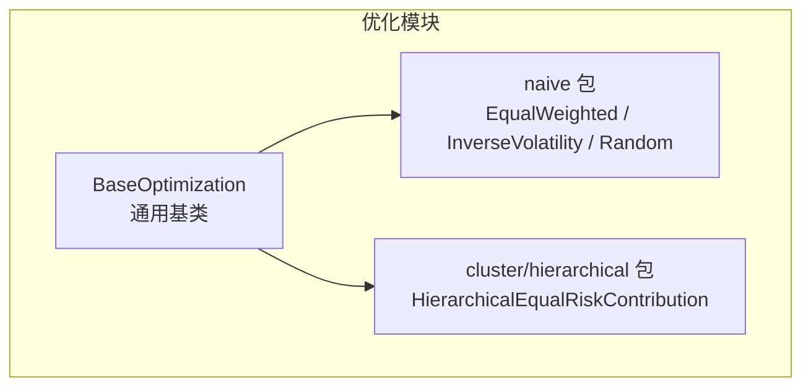
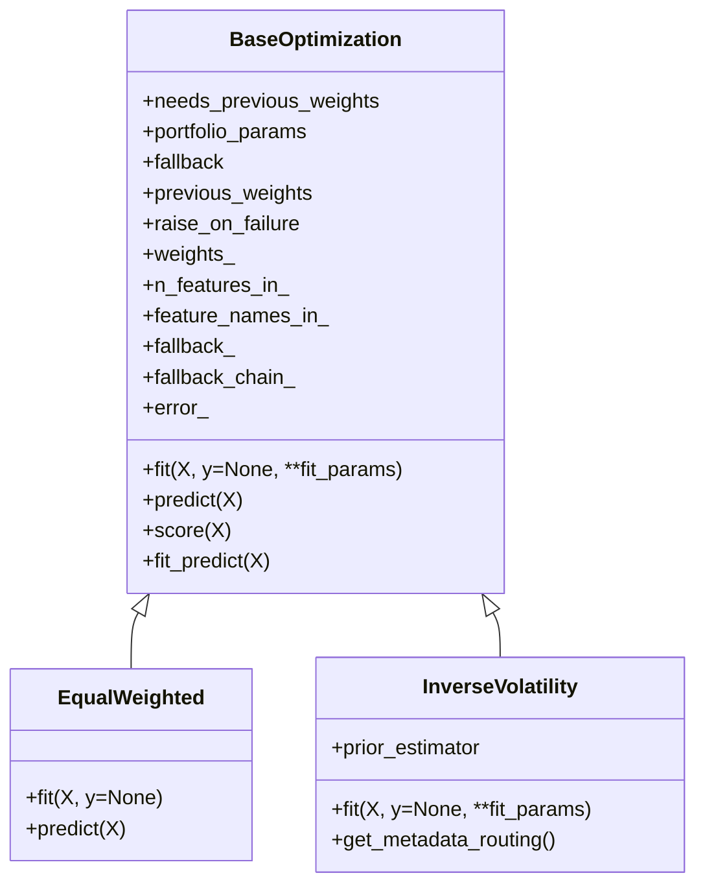
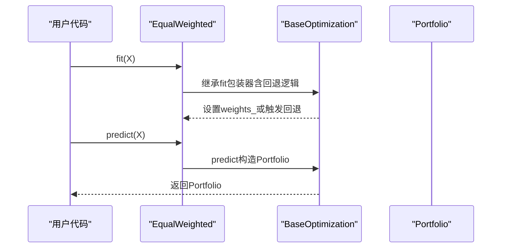
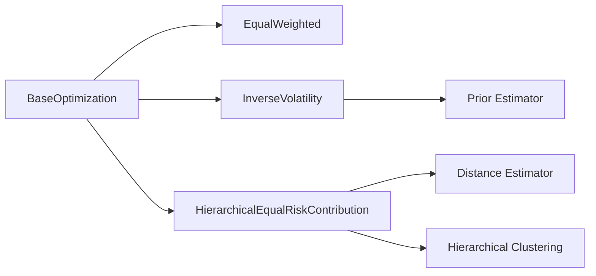

# 朴素优化API

<cite>
**本文引用的文件**
- [src/skfolio/optimization/naive/_naive.py](file://src/skfolio/optimization/naive/_naive.py)
- [src/skfolio/optimization/__init__.py](file://src/skfolio/optimization/__init__.py)
- [src/skfolio/optimization/_base.py](file://src/skfolio/optimization/_base.py)
- [src/skfolio/optimization/cluster/hierarchical/_herc.py](file://src/skfolio/optimization/cluster/hierarchical/_herc.py)
- [tests/test_optimization/test_naive/test_naive.py](file://tests/test_optimization/test_naive/test_naive.py)
- [examples/pre_selection/plot_4_incomplete_dataset.py](file://examples/pre_selection/plot_4_incomplete_dataset.py)
</cite>

## 目录
1. [简介](#简介)
2. [项目结构](#项目结构)
3. [核心组件](#核心组件)
4. [架构总览](#架构总览)
5. [详细组件分析](#详细组件分析)
6. [依赖关系分析](#依赖关系分析)
7. [性能与稳健性](#性能与稳健性)
8. [故障排查指南](#故障排查指南)
9. [结论](#结论)
10. [附录：在Pipeline中使用示例](#附录在pipeline中使用示例)

## 简介
本文件面向skfolio的朴素优化模块，聚焦于两类简单且实用的投资组合策略：
- EqualWeighted（等权）
- InverseVolatility（逆波动率）

同时，文档也阐述了这些策略在性能评估中的基准作用，并给出在Pipeline中进行对比实验的方法。朴素策略具有计算高效、鲁棒性强、易于解释的特点，尤其适合在极端市场条件下作为“安全锚点”。

## 项目结构
朴素优化位于优化子模块的naive包下，核心类均继承自通用基类BaseOptimization，统一支持回测、回退机制、预测输出等能力；同时，HierarchicalEqualRiskContribution（HERC）作为一类“分层等风险贡献”的复杂策略，也常被用作与朴素策略对比的基准之一。

图表来源
- [src/skfolio/optimization/_base.py](file://src/skfolio/optimization/_base.py#L1-L120)
- [src/skfolio/optimization/naive/_naive.py](file://src/skfolio/optimization/naive/_naive.py#L161-L257)
- [src/skfolio/optimization/cluster/hierarchical/_herc.py](file://src/skfolio/optimization/cluster/hierarchical/_herc.py#L29-L120)

章节来源
- [src/skfolio/optimization/__init__.py](file://src/skfolio/optimization/__init__.py#L1-L43)
- [src/skfolio/optimization/_base.py](file://src/skfolio/optimization/_base.py#L1-L120)

## 核心组件
- EqualWeighted：对所有资产等权重分配，无需估计协方差或收益，计算极快，鲁棒性好。
- InverseVolatility：基于先验协方差矩阵的资产逆波动率权重归一化，考虑了资产间波动差异，但不引入复杂的约束求解。
- HierarchicalEqualRiskContribution（HERC）：作为与朴素策略对比的基准策略，体现“分层树形结构+等风险贡献”的稳健性与可解释性。

章节来源
- [src/skfolio/optimization/naive/_naive.py](file://src/skfolio/optimization/naive/_naive.py#L161-L257)
- [src/skfolio/optimization/cluster/hierarchical/_herc.py](file://src/skfolio/optimization/cluster/hierarchical/_herc.py#L29-L120)

## 架构总览
朴素策略与通用基类的关系如下：

图表来源
- [src/skfolio/optimization/_base.py](file://src/skfolio/optimization/_base.py#L114-L206)
- [src/skfolio/optimization/naive/_naive.py](file://src/skfolio/optimization/naive/_naive.py#L161-L257)
- [src/skfolio/optimization/naive/_naive.py](file://src/skfolio/optimization/naive/_naive.py#L20-L120)

## 详细组件分析

### EqualWeighted（等权）
- 功能概述
  - 对所有资产赋予相等权重，sum=1，无任何估计或优化步骤。
- 关键参数
  - portfolio_params：传递给预测Portfolio的参数字典（如名称、交易成本、管理费、前一期权重、无风险利率等）。
  - fallback：主策略失败时的回退策略或“previous_weights”，支持列表顺序尝试。
  - previous_weights：当回退到“previous_weights”时使用的权重。
  - raise_on_failure：失败时是否抛出异常或返回FailedPortfolio。
- 行为特征
  - 计算复杂度低，O(n_assets)，内存占用小。
  - 不依赖协方差或收益估计，对缺失数据和异常值更稳健。
  - 在极端市场条件下不易出现“集中度过高”或“负权重”等问题。
- 预测与评分
  - predict返回单个Portfolio或Portfolio集合（Population），score默认以夏普率为评分指标。
- 测试验证
  - 单元测试验证权重和和为1，且每只资产权重一致。

章节来源
- [src/skfolio/optimization/naive/_naive.py](file://src/skfolio/optimization/naive/_naive.py#L161-L257)
- [tests/test_optimization/test_naive/test_naive.py](file://tests/test_optimization/test_naive/test_naive.py#L43-L58)

### InverseVolatility（逆波动率）
- 功能概述
  - 基于先验估计器提供的协方差矩阵，按资产波动率的倒数分配权重并归一化。
- 关键参数
  - prior_estimator：先验估计器，默认EmpiricalPrior；可替换为因子模型等。
  - 其余参数同通用基类（portfolio_params、fallback、previous_weights、raise_on_failure）。
- 行为特征
  - 权重与波动率成反比，天然降低高波动资产的暴露。
  - 仍属于“无约束、线性变换”策略，计算开销低，数值稳定。
- 先验与元数据路由
  - 支持启用元数据路由，将fit参数转发给prior_estimator.fit。
- 测试验证
  - 单元测试验证权重和为1，且与标准差倒数比例一致；支持不同prior_estimator（含因子模型）。

章节来源
- [src/skfolio/optimization/naive/_naive.py](file://src/skfolio/optimization/naive/_naive.py#L20-L120)
- [tests/test_optimization/test_naive/test_naive.py](file://tests/test_optimization/test_naive/test_naive.py#L12-L41)

### HierarchicalEqualRiskContribution（HERC，作为对比基准）
- 功能概述
  - 基于距离矩阵与层次聚类，先按“逆风险”分配至各簇，再沿树形结构自顶向下递归分割，最终通过凸优化最小化相对偏差以满足权重上下界约束。
- 参数要点（与朴素策略对比）
  - risk_measure：支持多种风险度量（方差、半方差、CVaR等）。
  - distance_estimator、hierarchical_clustering_estimator：用于构建树形结构。
  - min_weights、max_weights：允许设置权重上下限，HERC通过凸优化在最终阶段强制满足。
  - transaction_costs、management_fees、previous_weights：与通用基类一致。
- 行为特征
  - 结合树形结构与等风险贡献思想，兼顾稳健性与可解释性。
  - 由于涉及树构建与凸优化，计算复杂度高于朴素策略，但仍显著低于大规模非凸优化。
- 与朴素策略的对比
  - HERC可作为“稳健型基准”，在常规市场表现稳定；朴素策略则作为“安全锚点”，在极端市场下更稳健。

章节来源
- [src/skfolio/optimization/cluster/hierarchical/_herc.py](file://src/skfolio/optimization/cluster/hierarchical/_herc.py#L29-L120)
- [src/skfolio/optimization/cluster/hierarchical/_herc.py](file://src/skfolio/optimization/cluster/hierarchical/_herc.py#L326-L522)

### API调用流程（以EqualWeighted为例）

图表来源
- [src/skfolio/optimization/naive/_naive.py](file://src/skfolio/optimization/naive/_naive.py#L237-L256)
- [src/skfolio/optimization/_base.py](file://src/skfolio/optimization/_base.py#L288-L375)

## 依赖关系分析
- 组件耦合
  - EqualWeighted与InverseVolatility均直接继承BaseOptimization，共享统一的fit/predict/score接口与回退机制。
  - InverseVolatility依赖prior_estimator（默认EmpiricalPrior），并通过元数据路由将fit参数传递给底层估计器。
  - HERC作为对比策略，依赖距离估计器、层次聚类器与凸优化求解器，参数空间更大，但同样遵循BaseOptimization约定。
- 外部依赖
  - numpy、scipy（树形结构与统计工具）、cvxpy（HERC中的凸优化）。

图表来源
- [src/skfolio/optimization/_base.py](file://src/skfolio/optimization/_base.py#L114-L206)
- [src/skfolio/optimization/naive/_naive.py](file://src/skfolio/optimization/naive/_naive.py#L20-L120)
- [src/skfolio/optimization/cluster/hierarchical/_herc.py](file://src/skfolio/optimization/cluster/hierarchical/_herc.py#L326-L522)

## 性能与稳健性
- 计算效率
  - EqualWeighted：O(n_assets)，无矩阵分解或迭代求解。
  - InverseVolatility：O(n_assets^2)（协方差估计）+ O(n_assets)权重归一化，通常远小于大规模优化。
  - HERC：包含树构建与凸优化，复杂度高于朴素策略，但仍是线性或接近线性的规模增长。
- 极端市场条件下的稳健性
  - 等权策略避免过度集中于少数资产，减少尾部风险。
  - 逆波动率策略天然降低高波动资产权重，对异常波动更稳健。
  - HERC通过树形结构与凸优化约束，进一步提升稳定性与可解释性。
- 实践建议
  - 将朴素策略作为“基线”或“安全锚点”，在回测中与其他策略并行比较。
  - 在数据质量较差或样本期较短时，优先选择朴素策略以避免估计噪声导致的过拟合。

[本节为通用指导，不直接分析具体文件]

## 故障排查指南
- fit失败与回退
  - 若主策略fit抛错，可配置fallback为其他策略或“previous_weights”，系统会按顺序尝试并在成功后复制结果回主策略实例。
  - 当fallback="previous_weights"且未提供有效权重时，会抛出错误提示。
- 错误信息与追踪
  - fallback_chain_记录每次尝试的结果（字符串化错误或success），便于定位问题。
  - error_保存最后一次错误信息，raise_on_failure=False时predict返回FailedPortfolio。
- 常见问题
  - prior_estimator参数不匹配：确保传入的prior_estimator类型正确。
  - 输入X列名与字典映射不一致：在需要资产名的场景下，确保DataFrame列名为资产名。

章节来源
- [src/skfolio/optimization/_base.py](file://src/skfolio/optimization/_base.py#L128-L206)
- [src/skfolio/optimization/_base.py](file://src/skfolio/optimization/_base.py#L168-L283)

## 结论
- EqualWeighted与InverseVolatility是skfolio中极具实用价值的朴素策略：计算高效、实现简洁、鲁棒性强。
- 在性能评估中，它们可作为“安全锚点”与“基线”，帮助识别更复杂策略在极端市场下的脆弱性。
- 与HERC等稳健型策略对比，可从“稳健性/可解释性”维度评估复杂策略的收益与代价。

[本节为总结，不直接分析具体文件]

## 附录：在Pipeline中使用示例
以下示例展示了如何在Pipeline中使用朴素策略进行对比实验（以EqualWeighted为例）：
- 在预处理与数据准备之后，将EqualWeighted作为优化器加入Pipeline，结合交叉验证进行回测与评分。
- 示例路径参考：
  - [examples/pre_selection/plot_4_incomplete_dataset.py](file://examples/pre_selection/plot_4_incomplete_dataset.py#L99-L112)

章节来源
- [examples/pre_selection/plot_4_incomplete_dataset.py](file://examples/pre_selection/plot_4_incomplete_dataset.py#L99-L112)