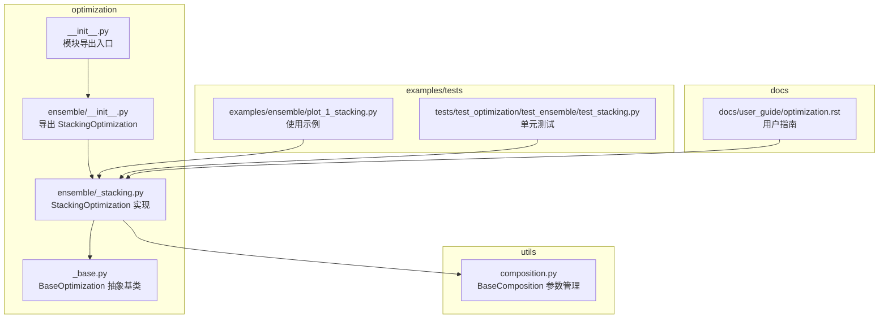
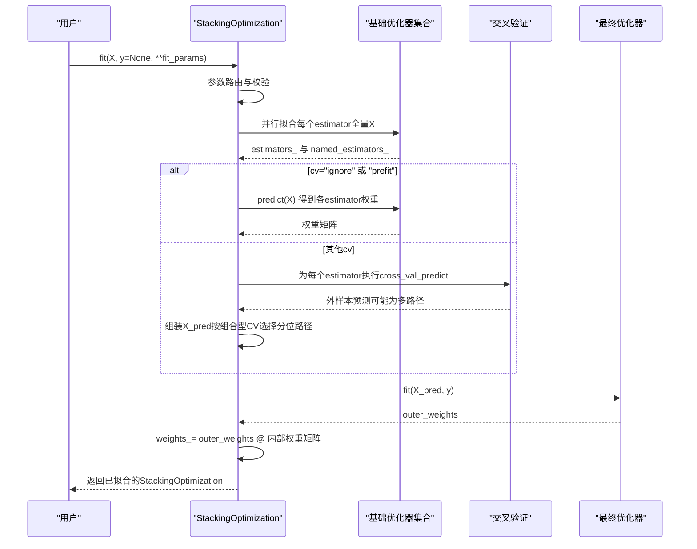
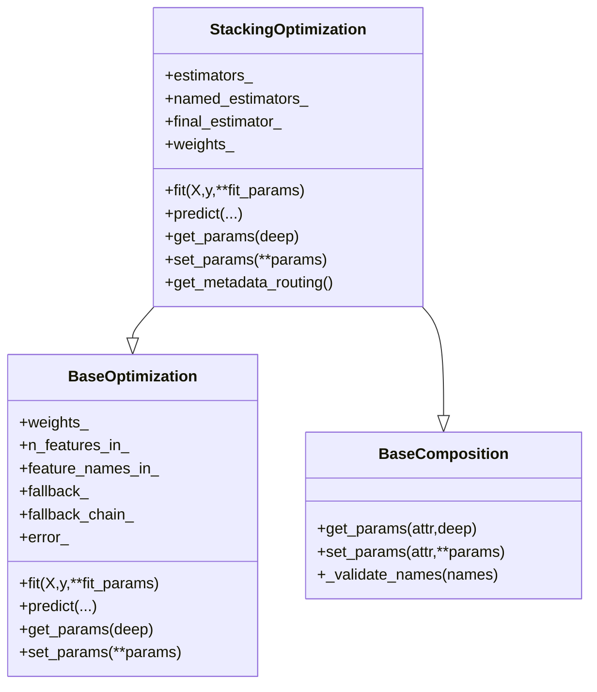
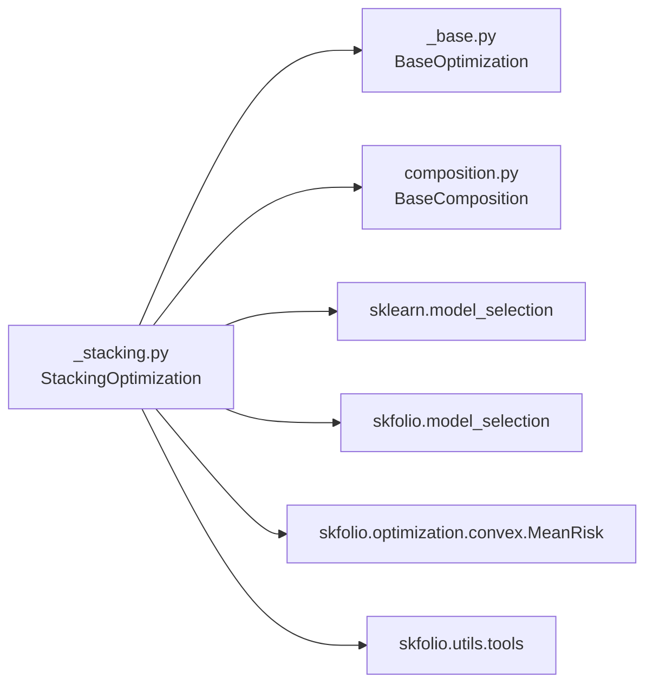

# 集成优化API

<cite>
**本文引用的文件列表**
- [src/skfolio/optimization/ensemble/_stacking.py](file://src/skfolio/optimization/ensemble/_stacking.py)
- [src/skfolio/optimization/ensemble/__init__.py](file://src/skfolio/optimization/ensemble/__init__.py)
- [src/skfolio/optimization/__init__.py](file://src/skfolio/optimization/__init__.py)
- [src/skfolio/optimization/_base.py](file://src/skfolio/optimization/_base.py)
- [src/skfolio/utils/composition.py](file://src/skfolio/utils/composition.py)
- [examples/ensemble/plot_1_stacking.py](file://examples/ensemble/plot_1_stacking.py)
- [tests/test_optimization/test_ensemble/test_stacking.py](file://tests/test_optimization/test_ensemble/test_stacking.py)
- [docs/user_guide/optimization.rst](file://docs/user_guide/optimization.rst)
</cite>

## 目录
1. [简介](#简介)
2. [项目结构](#项目结构)
3. [核心组件](#核心组件)
4. [架构总览](#架构总览)
5. [详细组件分析](#详细组件分析)
6. [依赖关系分析](#依赖关系分析)
7. [性能考量](#性能考量)
8. [故障排查指南](#故障排查指南)
9. [结论](#结论)
10. [附录](#附录)

## 简介
本文件面向skfolio的集成优化模块，聚焦于StackingOptimization类的API设计与使用方法。该类通过“堆叠”多个基础优化器的输出权重，再由一个“元优化器”进行二次加权，形成最终的投资组合权重。其核心思想是利用不同优化策略的优势互补，提升组合在稳定性与收益风险比方面的表现，并通过交叉验证生成外样本预测避免数据泄露。

StackingOptimization同时继承了基础优化器与组合器基类，具备以下关键能力：
- 接受一组(名称, 基础优化器)的列表作为estimators
- 使用final_estimator对基础优化器的输出权重进行二次优化
- 支持多种交叉验证策略（含组合型交叉验证），并可选择“预拟合”模式
- 提供参数路由与回退机制，增强鲁棒性

## 项目结构
与StackingOptimization直接相关的核心文件如下：
- ensemble模块：定义StackingOptimization类
- optimization模块：导出StackingOptimization
- optimization._base：定义BaseOptimization抽象基类及通用回退逻辑
- utils.composition：提供组合器参数管理（get/set_params）
- 示例与测试：演示如何构建包含MeanRisk、RiskBudgeting等优化器的集成模型，并评估其在多市场环境下的适应性

图表来源
- [src/skfolio/optimization/ensemble/_stacking.py](file://src/skfolio/optimization/ensemble/_stacking.py#L1-L120)
- [src/skfolio/optimization/_base.py](file://src/skfolio/optimization/_base.py#L1-L120)
- [src/skfolio/utils/composition.py](file://src/skfolio/utils/composition.py#L1-L90)
- [src/skfolio/optimization/ensemble/__init__.py](file://src/skfolio/optimization/ensemble/__init__.py#L1-L6)
- [src/skfolio/optimization/__init__.py](file://src/skfolio/optimization/__init__.py#L1-L43)
- [examples/ensemble/plot_1_stacking.py](file://examples/ensemble/plot_1_stacking.py#L1-L120)
- [tests/test_optimization/test_ensemble/test_stacking.py](file://tests/test_optimization/test_ensemble/test_stacking.py#L1-L60)
- [docs/user_guide/optimization.rst](file://docs/user_guide/optimization.rst#L708-L741)

章节来源
- [src/skfolio/optimization/ensemble/_stacking.py](file://src/skfolio/optimization/ensemble/_stacking.py#L1-L120)
- [src/skfolio/optimization/ensemble/__init__.py](file://src/skfolio/optimization/ensemble/__init__.py#L1-L6)
- [src/skfolio/optimization/__init__.py](file://src/skfolio/optimization/__init__.py#L1-L43)

## 核心组件
- StackingOptimization
  - 职责：将多个基础优化器的权重作为特征，训练一个“元优化器”得到最终权重；支持交叉验证与组合型交叉验证；支持预拟合模式；提供参数路由与回退机制。
  - 关键参数：
    - estimators：(名称, 基础优化器) 列表
    - final_estimator：用于合并基础优化器输出的最终优化器，默认MeanRisk
    - cv：交叉验证策略，支持整数、交叉验证生成器、"prefit"、"ignore"，以及组合型交叉验证
    - n_jobs：并行度
    - quantile、quantile_measure：当cv为组合型交叉验证时，用于从多路径中选择特定分位的路径
    - portfolio_params：传递给predict返回的Portfolio对象的参数
    - fallback、previous_weights、raise_on_failure：回退策略与错误处理
  - 关键属性：
    - estimators_：已拟合的基础优化器列表
    - named_estimators_：按名称访问的已拟合子估计器字典
    - final_estimator_：已拟合的最终优化器
    - weights_：最终资产权重
    - 其他：n_features_in_、feature_names_in_、fallback_、fallback_chain_、error_等
  - 关键方法：
    - fit(X, y=None, **fit_params)：拟合流程（含参数路由、基础估计器并行拟合、交叉验证生成元特征、训练final_estimator、计算最终权重）
    - predict(...)：基于已拟合的estimators与final_estimator生成组合权重与结果（返回Portfolio/MultiPeriodPortfolio）
    - get_params/deep=True：获取参数树（含嵌套estimators）
    - set_params(**params)：设置参数（含嵌套estimators）
    - get_metadata_routing()：启用元数据路由，将fit参数转发至各基础估计器

章节来源
- [src/skfolio/optimization/ensemble/_stacking.py](file://src/skfolio/optimization/ensemble/_stacking.py#L51-L177)
- [src/skfolio/optimization/ensemble/_stacking.py](file://src/skfolio/optimization/ensemble/_stacking.py#L183-L210)
- [src/skfolio/optimization/ensemble/_stacking.py](file://src/skfolio/optimization/ensemble/_stacking.py#L211-L285)
- [src/skfolio/optimization/ensemble/_stacking.py](file://src/skfolio/optimization/ensemble/_stacking.py#L296-L409)
- [src/skfolio/optimization/_base.py](file://src/skfolio/optimization/_base.py#L39-L120)
- [src/skfolio/utils/composition.py](file://src/skfolio/utils/composition.py#L1-L90)

## 架构总览
StackingOptimization的运行时架构如下：
- 输入：训练期观测矩阵X与可选目标y
- 基础估计器并行拟合：每个estimator在全量X上拟合，保存estimators_与named_estimators_
- 元特征生成：
  - 若cv为"ignore"或"prefit"：直接用estimators_的predict(X)转置为特征矩阵
  - 否则：对每个estimator执行cross_val_predict生成外样本预测，组合为特征矩阵X_pred；若cv为组合型交叉验证，则按quantile_measure与quantile选择特定路径
- 训练final_estimator：将X_pred与y（如有）喂给final_estimator，得到outer_weights
- 最终权重：outer_weights乘以每个estimator的weights_（行向量）得到最终权重weights_

图表来源
- [src/skfolio/optimization/ensemble/_stacking.py](file://src/skfolio/optimization/ensemble/_stacking.py#L296-L409)

## 详细组件分析

### 类关系与继承
StackingOptimization同时继承自BaseOptimization与BaseComposition，前者提供统一的优化器接口、回退机制与Portfolio参数转发，后者提供组合器风格的参数管理（get/set_params）。

图表来源
- [src/skfolio/optimization/_base.py](file://src/skfolio/optimization/_base.py#L39-L120)
- [src/skfolio/utils/composition.py](file://src/skfolio/utils/composition.py#L1-L90)
- [src/skfolio/optimization/ensemble/_stacking.py](file://src/skfolio/optimization/ensemble/_stacking.py#L183-L210)

章节来源
- [src/skfolio/optimization/_base.py](file://src/skfolio/optimization/_base.py#L39-L120)
- [src/skfolio/utils/composition.py](file://src/skfolio/utils/composition.py#L1-L90)
- [src/skfolio/optimization/ensemble/_stacking.py](file://src/skfolio/optimization/ensemble/_stacking.py#L183-L210)

### 参数与属性详解
- 参数
  - estimators：(名称, 基础优化器) 列表，名称需唯一且不含双下划线
  - final_estimator：默认MeanRisk，可替换为其他优化器
  - cv：支持"ignore"（不交叉验证，易过拟合）、整数（K折）、交叉验证生成器、"prefit"（假设estimators已拟合）
  - n_jobs：并行度
  - quantile、quantile_measure：组合型交叉验证时选择特定路径
  - portfolio_params：传递给predict返回的Portfolio/MultiPeriodPortfolio
  - fallback/previous_weights/raise_on_failure：回退策略与错误处理
- 属性
  - estimators_：已拟合的基础优化器列表
  - named_estimators_：按名称访问的已拟合子估计器字典
  - final_estimator_：已拟合的最终优化器
  - weights_：最终资产权重
  - 其他：n_features_in_、feature_names_in_、fallback_、fallback_chain_、error_等

章节来源
- [src/skfolio/optimization/ensemble/_stacking.py](file://src/skfolio/optimization/ensemble/_stacking.py#L51-L177)
- [src/skfolio/optimization/ensemble/_stacking.py](file://src/skfolio/optimization/ensemble/_stacking.py#L134-L173)

### 方法详解
- fit(X, y=None, **fit_params)
  - 参数路由：启用元数据路由后，fit参数会按名称转发给对应estimator
  - 基础估计器拟合：并行拟合所有estimator，保存estimators_与named_estimators_
  - 元特征生成：根据cv策略生成X_pred
  - final_estimator训练：使用X_pred与y训练，得到outer_weights
  - 最终权重：outer_weights乘以内层权重矩阵得到weights_
- predict(...)
  - 基于已拟合的estimators与final_estimator生成组合权重与结果（Portfolio/MultiPeriodPortfolio）
- get_params/deep=True、set_params(**params)
  - 支持获取/设置嵌套estimators的参数，名称格式为"estimator_name__param"
- get_metadata_routing()
  - 将fit方法的元数据路由映射到每个estimator的fit

章节来源
- [src/skfolio/optimization/ensemble/_stacking.py](file://src/skfolio/optimization/ensemble/_stacking.py#L286-L409)
- [src/skfolio/optimization/_base.py](file://src/skfolio/optimization/_base.py#L127-L200)

### 使用示例与最佳实践
- 构建包含MeanRisk、RiskBudgeting等优化器的集成模型
  - 参考示例脚本中的estimators列表与StackingOptimization构造方式
  - 使用GridSearchCV结合WalkForward或CombinatorialPurgedCV进行超参数调优
  - 在测试集上使用cross_val_predict评估模型与基准组合
- 多市场环境适应性
  - 使用组合型交叉验证生成多条测试路径，避免单一历史路径的偶然性
  - 对独立子模型与Stacking模型分别进行分布分析，比较Sharpe比率等指标

章节来源
- [examples/ensemble/plot_1_stacking.py](file://examples/ensemble/plot_1_stacking.py#L60-L124)
- [examples/ensemble/plot_1_stacking.py](file://examples/ensemble/plot_1_stacking.py#L125-L253)
- [docs/user_guide/optimization.rst](file://docs/user_guide/optimization.rst#L708-L741)

## 依赖关系分析
- 模块导出
  - optimization.__init__导出StackingOptimization
  - optimization.ensemble.__init__导出StackingOptimization
- 运行时依赖
  - BaseOptimization：提供fit/predict接口与回退机制
  - BaseComposition：提供组合器风格的参数管理
  - sklearn.model_selection：提供交叉验证与并行工具
  - skfolio.model_selection：提供cross_val_predict与组合型交叉验证
  - skfolio.optimization.convex.MeanRisk：默认final_estimator
  - skfolio.utils.tools：check_estimator、fit_single_estimator等工具

图表来源
- [src/skfolio/optimization/ensemble/_stacking.py](file://src/skfolio/optimization/ensemble/_stacking.py#L1-L40)
- [src/skfolio/optimization/_base.py](file://src/skfolio/optimization/_base.py#L1-L60)
- [src/skfolio/utils/composition.py](file://src/skfolio/utils/composition.py#L1-L40)

章节来源
- [src/skfolio/optimization/ensemble/_stacking.py](file://src/skfolio/optimization/ensemble/_stacking.py#L1-L40)
- [src/skfolio/optimization/__init__.py](file://src/skfolio/optimization/__init__.py#L1-L43)
- [src/skfolio/optimization/ensemble/__init__.py](file://src/skfolio/optimization/ensemble/__init__.py#L1-L6)

## 性能考量
- 并行化：n_jobs控制基础估计器并行拟合；在大规模数据或复杂优化器场景下可显著缩短训练时间
- 交叉验证成本：组合型交叉验证会生成多条测试路径，增加计算开销；可通过合理设置n_folds/n_test_folds平衡稳健性与效率
- 数据泄露防护：通过cross_val_predict生成外样本预测，避免使用训练期内部预测导致的过拟合
- 回退策略：在主优化失败时自动尝试回退策略，减少整体失败率，但需注意回退链的顺序与代价

[本节为通用指导，无需列出具体文件来源]

## 故障排查指南
- 常见问题
  - estimators参数格式错误：需为(名称, 优化器)列表，名称必须唯一且不含双下划线
  - cv="ignore"可能导致过拟合：建议使用KFold或组合型交叉验证
  - 组合型交叉验证路径选择：确保quantile与quantile_measure设置合理
  - 回退链：检查fallback_chain_与error_定位失败原因
- 定位手段
  - 启用元数据路由：通过enable_metadata_routing=True开启fit参数路由
  - 查看属性：fallback_、fallback_chain_、error_、weights_等
  - 单独验证子模型：对每个estimator单独fit/predict，确认其稳定性

章节来源
- [src/skfolio/optimization/ensemble/_stacking.py](file://src/skfolio/optimization/ensemble/_stacking.py#L286-L409)
- [src/skfolio/optimization/_base.py](file://src/skfolio/optimization/_base.py#L127-L200)
- [tests/test_optimization/test_ensemble/test_stacking.py](file://tests/test_optimization/test_ensemble/test_stacking.py#L138-L190)

## 结论
StackingOptimization通过“基础优化器输出 + 元优化器”的两阶段流程，有效整合不同优化策略的优势，提升组合在多市场环境下的稳定性与收益风险比。其参数路由、回退机制与交叉验证设计，使其在工程实践中具备良好的可维护性与鲁棒性。配合示例脚本与测试用例，用户可以快速构建并评估包含MeanRisk、RiskBudgeting等优化器的集成模型。

[本节为总结性内容，无需列出具体文件来源]

## 附录
- API速查
  - 构造：StackingOptimization(estimators, final_estimator=None, cv=None, n_jobs=None, quantile=0.5, quantile_measure=RatioMeasure.SHARPE_RATIO, portfolio_params=None, fallback=None, previous_weights=None, raise_on_failure=True)
  - 拟合：fit(X, y=None, **fit_params)
  - 预测：predict(...)
  - 参数管理：get_params(deep=True)、set_params(**params)
  - 元数据路由：get_metadata_routing()

章节来源
- [src/skfolio/optimization/ensemble/_stacking.py](file://src/skfolio/optimization/ensemble/_stacking.py#L51-L177)
- [src/skfolio/optimization/ensemble/_stacking.py](file://src/skfolio/optimization/ensemble/_stacking.py#L286-L409)
- [src/skfolio/optimization/__init__.py](file://src/skfolio/optimization/__init__.py#L1-L43)