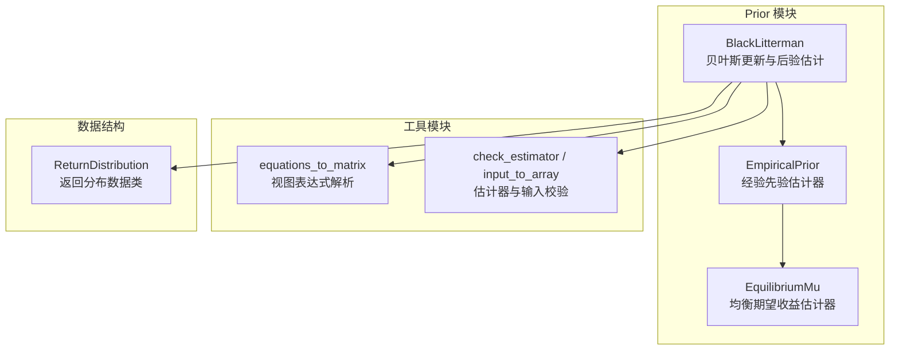
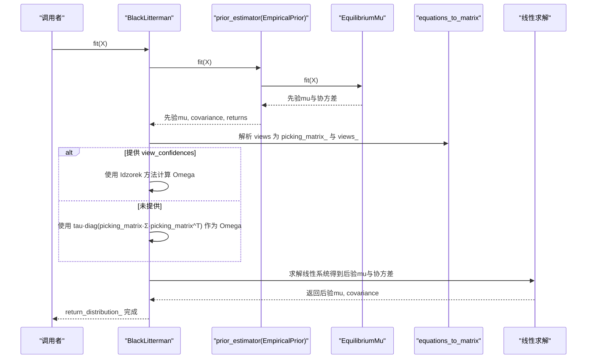
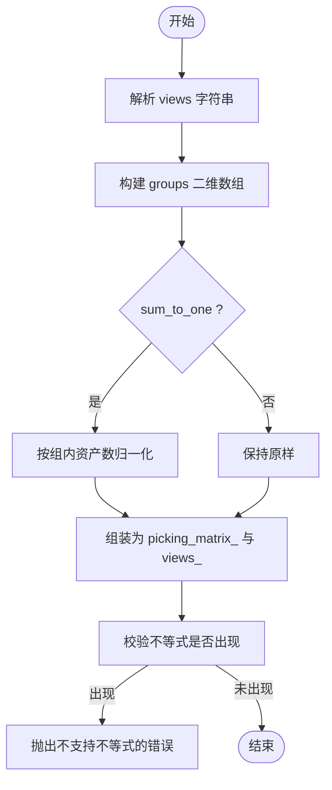
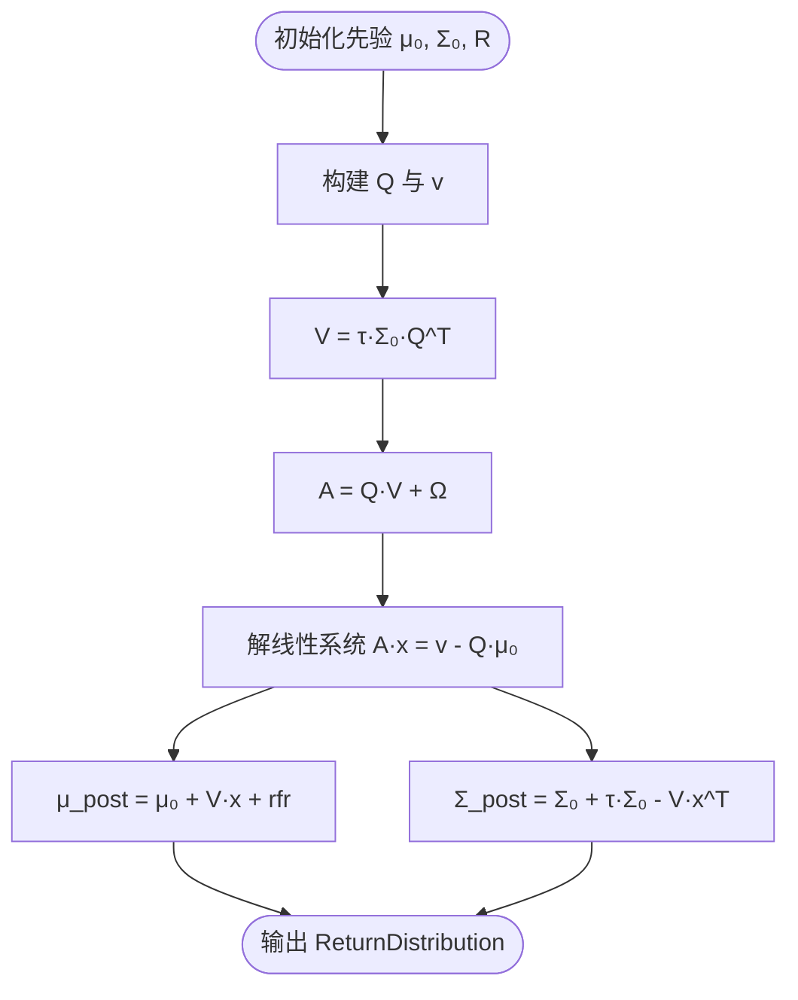
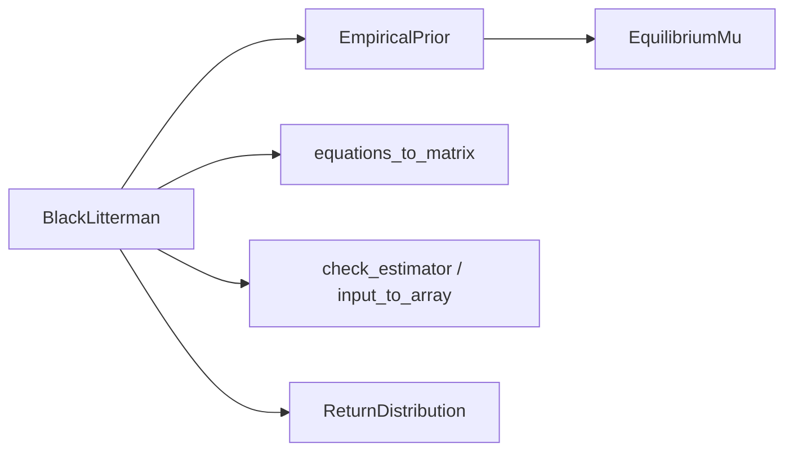

# Black-Litterman 模型

<cite>
**本文引用的文件列表**
- [src/skfolio/prior/_black_litterman.py](file://src/skfolio/prior/_black_litterman.py)
- [src/skfolio/utils/equations.py](file://src/skfolio/utils/equations.py)
- [src/skfolio/prior/_base.py](file://src/skfolio/prior/_base.py)
- [src/skfolio/moments/expected_returns/_equilibrium_mu.py](file://src/skfolio/moments/expected_returns/_equilibrium_mu.py)
- [src/skfolio/prior/_empirical.py](file://src/skfolio/prior/_empirical.py)
- [src/skfolio/utils/tools.py](file://src/skfolio/utils/tools.py)
- [examples/mean_risk/plot_12_black_and_litterman.py](file://examples/mean_risk/plot_12_black_and_litterman.py)
- [tests/test_prior/test_black_litterman.py](file://tests/test_prior/test_black_litterman.py)
- [docs/user_guide/prior.rst](file://docs/user_guide/prior.rst)
</cite>

## 目录
1. [简介](#简介)
2. [项目结构](#项目结构)
3. [核心组件](#核心组件)
4. [架构总览](#架构总览)
5. [详细组件分析](#详细组件分析)
6. [依赖关系分析](#依赖关系分析)
7. [性能考量](#性能考量)
8. [故障排查指南](#故障排查指南)
9. [结论](#结论)
10. [附录](#附录)

## 简介
本文件为 BlackLitterman 类提供详尽的 API 文档，重点围绕以下方面展开：
- 核心参数详解：views（分析师观点，支持“资产 i = a”和“资产 i - 资产 j = b”等表达式）、groups（资产分组映射）、prior_estimator（先验估计器，默认使用 EquilibriumMu 的 EmpiricalPrior）、tau（观点不确定性缩放因子）、view_confidences（观点置信度向量）。
- picking_matrix_ 的构建过程：如何将文本观点解析为数学约束矩阵。
- 贝叶斯更新公式：如何结合先验分布与分析师观点生成后验分布。
- 使用示例：如何定义绝对与相对观点、利用资产分组表达宏观观点、通过 view_confidences 精细控制不同观点权重。

## 项目结构
BlackLitterman 实现位于 prior 子模块中，依赖于：
- 先验估计器接口与返回分布数据结构；
- 解析视图表达式的工具函数；
- 默认先验估计器（EmpiricalPrior + EquilibriumMu）；
- 通用工具函数（如检查与克隆嵌套估计器）。

图表来源
- [src/skfolio/prior/_black_litterman.py](file://src/skfolio/prior/_black_litterman.py#L1-L269)
- [src/skfolio/utils/equations.py](file://src/skfolio/utils/equations.py#L1-L506)
- [src/skfolio/prior/_base.py](file://src/skfolio/prior/_base.py#L1-L70)
- [src/skfolio/moments/expected_returns/_equilibrium_mu.py](file://src/skfolio/moments/expected_returns/_equilibrium_mu.py#L1-L126)
- [src/skfolio/prior/_empirical.py](file://src/skfolio/prior/_empirical.py#L1-L205)
- [src/skfolio/utils/tools.py](file://src/skfolio/utils/tools.py#L1-L796)

章节来源
- [src/skfolio/prior/_black_litterman.py](file://src/skfolio/prior/_black_litterman.py#L1-L269)
- [src/skfolio/utils/equations.py](file://src/skfolio/utils/equations.py#L1-L506)
- [src/skfolio/prior/_base.py](file://src/skfolio/prior/_base.py#L1-L70)
- [src/skfolio/moments/expected_returns/_equilibrium_mu.py](file://src/skfolio/moments/expected_returns/_equilibrium_mu.py#L1-L126)
- [src/skfolio/prior/_empirical.py](file://src/skfolio/prior/_empirical.py#L1-L205)
- [src/skfolio/utils/tools.py](file://src/skfolio/utils/tools.py#L1-L796)

## 核心组件
- BlackLitterman：贝叶斯先验 + 分析师观点更新，输出后验 ReturnDistribution。
- ReturnDistribution：封装后验期望收益、协方差、历史收益等。
- EmpiricalPrior：经验先验估计器，默认使用 EmpiricalMu 和 EmpiricalCovariance。
- EquilibriumMu：基于风险厌恶与市场权重的均衡期望收益估计。
- equations_to_matrix：将字符串形式的视图解析为线性约束矩阵。
- 工具函数：check_estimator、input_to_array 等，用于嵌套估计器与输入校验。

章节来源
- [src/skfolio/prior/_black_litterman.py](file://src/skfolio/prior/_black_litterman.py#L1-L269)
- [src/skfolio/prior/_base.py](file://src/skfolio/prior/_base.py#L1-L70)
- [src/skfolio/prior/_empirical.py](file://src/skfolio/prior/_empirical.py#L1-L205)
- [src/skfolio/moments/expected_returns/_equilibrium_mu.py](file://src/skfolio/moments/expected_returns/_equilibrium_mu.py#L1-L126)
- [src/skfolio/utils/equations.py](file://src/skfolio/utils/equations.py#L1-L506)
- [src/skfolio/utils/tools.py](file://src/skfolio/utils/tools.py#L1-L796)

## 架构总览
BlackLitterman 的工作流如下：
1) fit 阶段：
- 选择并拟合 prior_estimator（默认 EmpiricalPrior + EquilibriumMu），得到先验期望收益、协方差与历史收益。
- 校验输入 X 并解析 views，生成 picking_matrix_ 与 views_。
- 可选地根据 view_confidences 使用 Idzorek 方法构造 Omega。
- 基于贝叶斯公式求解后验期望收益与协方差，封装为 ReturnDistribution。

图表来源
- [src/skfolio/prior/_black_litterman.py](file://src/skfolio/prior/_black_litterman.py#L151-L269)
- [src/skfolio/prior/_empirical.py](file://src/skfolio/prior/_empirical.py#L109-L205)
- [src/skfolio/moments/expected_returns/_equilibrium_mu.py](file://src/skfolio/moments/expected_returns/_equilibrium_mu.py#L82-L126)
- [src/skfolio/utils/equations.py](file://src/skfolio/utils/equations.py#L32-L141)

## 详细组件分析

### BlackLitterman 类 API 与参数详解
- 参数
  - views：长度为 n_views 的数组，元素为形如“资产 = 数值”或“资产 i - 资产 j = 数值”的字符串表达式；数值频率需与输入 X 一致。
  - groups：可为字典或二维数组，用于在 views 中引用分组名称；若为字典，键为资产名，值为该资产所属分组列表；若为二维数组，行表示分组层级，列表示资产归属。
  - prior_estimator：先验估计器，默认 None 表示使用 EmpiricalPrior(mu_estimator=EquilibriumMu())。
  - tau：观点不确定性缩放因子，默认 0.05；越小表示对分析师观点越不确定。
  - view_confidences：长度为 n_views 的置信度向量（0~1），用于 Idzorek 方法；若为 0 将被替换为极小正值。
  - risk_free_rate：无风险利率，默认 0。
- 属性
  - return_distribution_：后验 ReturnDistribution。
  - groups_：标准化后的分组二维数组。
  - views_：解析后的数值视图向量。
  - picking_matrix_：由 views 解析得到的约束矩阵，形状为 (n_views, n_assets)。
  - prior_estimator_：已拟合的先验估计器。
  - n_features_in_、feature_names_in_：资产数量与列名（当 X 为 DataFrame 时）。

章节来源
- [src/skfolio/prior/_black_litterman.py](file://src/skfolio/prior/_black_litterman.py#L22-L118)
- [src/skfolio/prior/_black_litterman.py](file://src/skfolio/prior/_black_litterman.py#L127-L141)
- [src/skfolio/prior/_black_litterman.py](file://src/skfolio/prior/_black_litterman.py#L151-L269)

### picking_matrix_ 的构建过程（从文本到数学约束）
- 输入
  - groups：二维数组，行表示分组层级，列表示资产归属。
  - equations：一维数组，元素为字符串形式的视图表达式。
  - sum_to_one=True：在 BlackLitterman 中用于将分组求和视为概率和为 1 的约束。
- 输出
  - left/right 等式矩阵与向量（用于等式约束）。
  - left/right 不等式矩阵与向量（用于不等式约束）。
- BlackLitterman 在 fit 中调用 equations_to_matrix，得到 picking_matrix_ 与 views_，并抛出不支持不等式（<= 或 >=）的错误。

图表来源
- [src/skfolio/utils/equations.py](file://src/skfolio/utils/equations.py#L32-L141)
- [src/skfolio/utils/equations.py](file://src/skfolio/utils/equations.py#L143-L199)
- [src/skfolio/utils/equations.py](file://src/skfolio/utils/equations.py#L201-L233)
- [src/skfolio/utils/equations.py](file://src/skfolio/utils/equations.py#L235-L257)
- [src/skfolio/utils/equations.py](file://src/skfolio/utils/equations.py#L259-L289)
- [src/skfolio/utils/equations.py](file://src/skfolio/utils/equations.py#L291-L311)
- [src/skfolio/utils/equations.py](file://src/skfolio/utils/equations.py#L313-L332)
- [src/skfolio/utils/equations.py](file://src/skfolio/utils/equations.py#L334-L351)
- [src/skfolio/utils/equations.py](file://src/skfolio/utils/equations.py#L353-L378)
- [src/skfolio/utils/equations.py](file://src/skfolio/utils/equations.py#L380-L506)

章节来源
- [src/skfolio/utils/equations.py](file://src/skfolio/utils/equations.py#L32-L141)
- [src/skfolio/utils/equations.py](file://src/skfolio/utils/equations.py#L380-L506)
- [src/skfolio/prior/_black_litterman.py](file://src/skfolio/prior/_black_litterman.py#L216-L226)

### 贝叶斯更新公式与后验推导
- 先验
  - 先验期望收益：μ₀
  - 先验协方差：Σ₀
  - 历史收益：R（用于 ReturnDistribution）
- 视图
  - 约束矩阵：Q（即 picking_matrix_）
  - 视图向量：v（即 views_）
  - 不确定性矩阵：Ω（由 tau 与 Q·Σ₀·Q^T 或 Idzorek 的置信度向量决定）
- 后验
  - 后验期望收益：μ_post = μ₀ + V·A^{-1}·(v - Q·μ₀) + rfr
  - 后验协方差：Σ_post = Σ₀ + τ·Σ₀ - V·A^{-1}·V^T
  - 其中：V = τ·Σ₀·Q^T，A = Q·V + Ω
- 计算细节
  - 采用线性系统求解代替直接矩阵求逆，提高数值稳定性与效率。

图表来源
- [src/skfolio/prior/_black_litterman.py](file://src/skfolio/prior/_black_litterman.py#L227-L268)

章节来源
- [src/skfolio/prior/_black_litterman.py](file://src/skfolio/prior/_black_litterman.py#L188-L268)

### 使用示例与最佳实践
- 绝对观点与相对观点
  - 绝对观点：形如“资产 = 数值”，例如“AAPL == 0.00098”。
  - 相对观点：形如“资产 i - 资产 j = 数值”，例如“AAPL - GE == 0.00086”。
- 利用分组表达宏观观点
  - 通过 groups 将资产映射到宏观分组（如 Equity、Europe、US 等），在 views 中直接使用分组名进行约束。
- 置信度控制
  - 通过 view_confidences 为每个观点赋予 0~1 的置信度，越接近 0 表示越不确定；内部会做极小值处理。
- 示例参考
  - 用户指南示例展示了如何在 MeanRisk 优化中使用 BlackLitterman 作为 prior_estimator。
  - 测试用例验证了 picking_matrix_ 的构建与后验结果的形状与数值。

章节来源
- [examples/mean_risk/plot_12_black_and_litterman.py](file://examples/mean_risk/plot_12_black_and_litterman.py#L1-L130)
- [tests/test_prior/test_black_litterman.py](file://tests/test_prior/test_black_litterman.py#L1-L635)
- [docs/user_guide/prior.rst](file://docs/user_guide/prior.rst#L81-L113)

## 依赖关系分析
- BlackLitterman 依赖
  - prior_estimator：默认 EmpiricalPrior，内部使用 EquilibriumMu 作为 mu_estimator。
  - equations_to_matrix：解析 views 为 picking_matrix_。
  - 工具函数：check_estimator 用于嵌套估计器类型校验与克隆；input_to_array 用于 groups 输入转换。
- ReturnDistribution 作为统一的数据载体，贯穿先验与后验估计。

图表来源
- [src/skfolio/prior/_black_litterman.py](file://src/skfolio/prior/_black_litterman.py#L151-L269)
- [src/skfolio/prior/_empirical.py](file://src/skfolio/prior/_empirical.py#L109-L205)
- [src/skfolio/moments/expected_returns/_equilibrium_mu.py](file://src/skfolio/moments/expected_returns/_equilibrium_mu.py#L82-L126)
- [src/skfolio/utils/equations.py](file://src/skfolio/utils/equations.py#L32-L141)
- [src/skfolio/utils/tools.py](file://src/skfolio/utils/tools.py#L328-L357)

章节来源
- [src/skfolio/prior/_black_litterman.py](file://src/skfolio/prior/_black_litterman.py#L151-L269)
- [src/skfolio/prior/_empirical.py](file://src/skfolio/prior/_empirical.py#L109-L205)
- [src/skfolio/moments/expected_returns/_equilibrium_mu.py](file://src/skfolio/moments/expected_returns/_equilibrium_mu.py#L82-L126)
- [src/skfolio/utils/equations.py](file://src/skfolio/utils/equations.py#L32-L141)
- [src/skfolio/utils/tools.py](file://src/skfolio/utils/tools.py#L328-L357)

## 性能考量
- 线性系统求解：避免直接矩阵求逆，改用线性系统求解，提升数值稳定性和性能。
- Omega 的构造：当未提供 view_confidences 时，Omega 为对角阵且与先验协方差呈比例关系；提供置信度时，Idzorek 方法通过 alphas 缩放，可能增加额外乘法开销。
- picking_matrix_ 的稀疏性：若 views 较少且分组合理，Q 通常较为稀疏，有利于求解效率。

[本节为通用性能讨论，不直接分析具体文件]

## 故障排查指南
- 不支持不等式
  - 错误信息：在 BlackLitterman.fit 中，若解析到不等式（<= 或 >=），将抛出异常。请仅使用等式形式的 views。
- view_confidences 取值范围
  - 若包含小于 0 或大于 1 的值，将抛出异常；内部会将 0 替换为极小正值以避免除零。
- groups 与 X 的一致性
  - 若未提供 groups 且 X 非 DataFrame（无列名），将无法获取资产名，导致报错。请确保提供 groups 或使用带列名的 DataFrame。
- 嵌套估计器元数据路由
  - 当启用元数据路由时，若 prior_estimator 需要额外参数（如 ImpliedCovariance），需正确传递对应关键字参数，否则可能触发校验错误。

章节来源
- [src/skfolio/prior/_black_litterman.py](file://src/skfolio/prior/_black_litterman.py#L224-L226)
- [src/skfolio/prior/_black_litterman.py](file://src/skfolio/prior/_black_litterman.py#L237-L253)
- [src/skfolio/prior/_black_litterman.py](file://src/skfolio/prior/_black_litterman.py#L196-L215)
- [tests/test_prior/test_black_litterman.py](file://tests/test_prior/test_black_litterman.py#L615-L635)

## 结论
BlackLitterman 将贝叶斯框架与分析师观点有机结合，通过先验估计器（默认 EmpiricalPrior + EquilibriumMu）提供稳健的先验分布，并以线性系统求解的方式高效获得后验期望收益与协方差。其强大的视图表达能力（支持绝对与相对观点、分组约束）与灵活的置信度控制，使其适用于多种投资组合优化场景。建议在实际应用中：
- 明确视图表达式格式，优先使用等式约束；
- 合理设置 tau 与 view_confidences，平衡先验与观点的影响；
- 使用 groups 将宏观视角转化为可操作的约束；
- 在优化前通过 ReturnDistribution 检查后验分布的合理性。

[本节为总结性内容，不直接分析具体文件]

## 附录
- 参考示例与测试
  - 用户指南示例展示了如何在 MeanRisk 中使用 BlackLitterman。
  - 单元测试覆盖了 picking_matrix_ 构建、后验分布形状与数值、以及分组字典与数组两种输入方式的一致性。

章节来源
- [examples/mean_risk/plot_12_black_and_litterman.py](file://examples/mean_risk/plot_12_black_and_litterman.py#L1-L130)
- [tests/test_prior/test_black_litterman.py](file://tests/test_prior/test_black_litterman.py#L1-L635)
- [docs/user_guide/prior.rst](file://docs/user_guide/prior.rst#L81-L113)