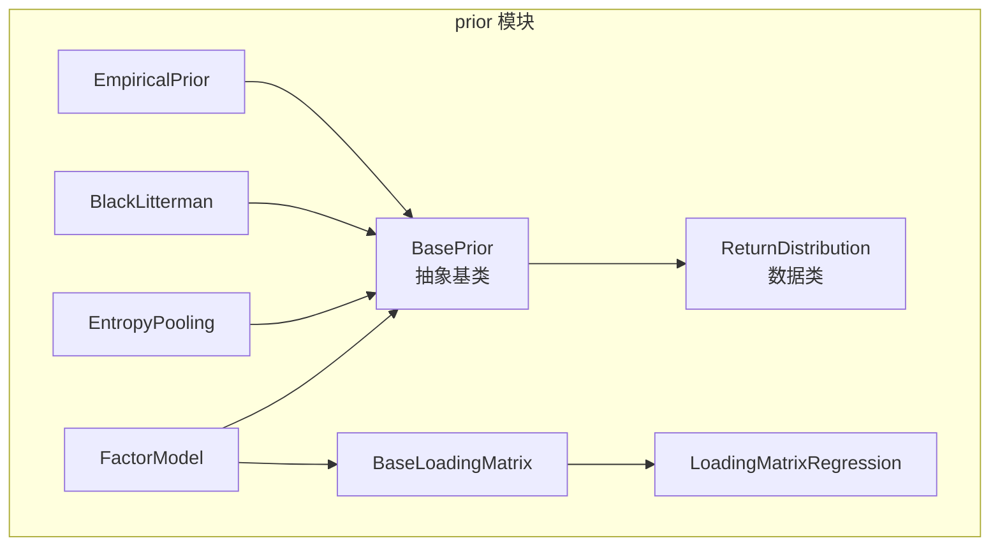
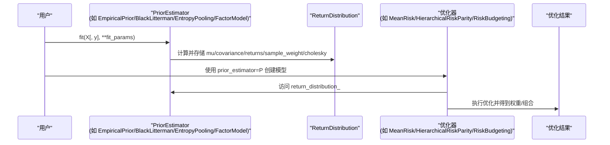
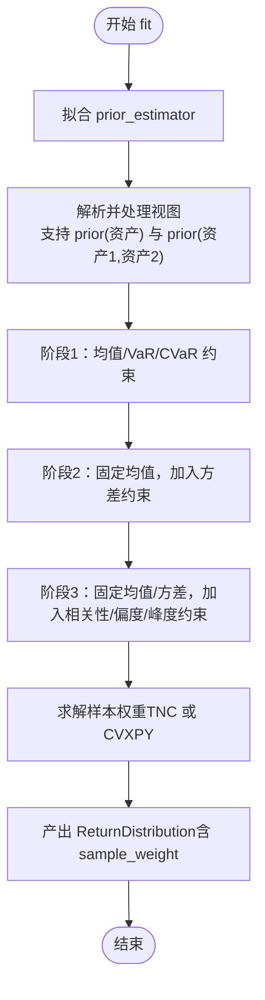
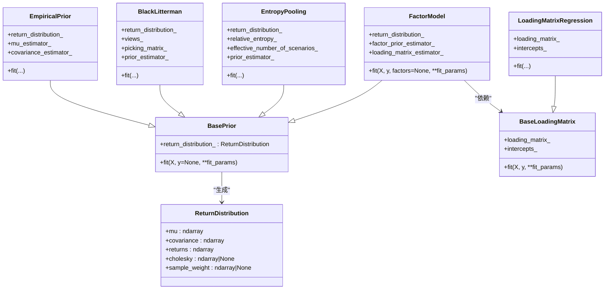
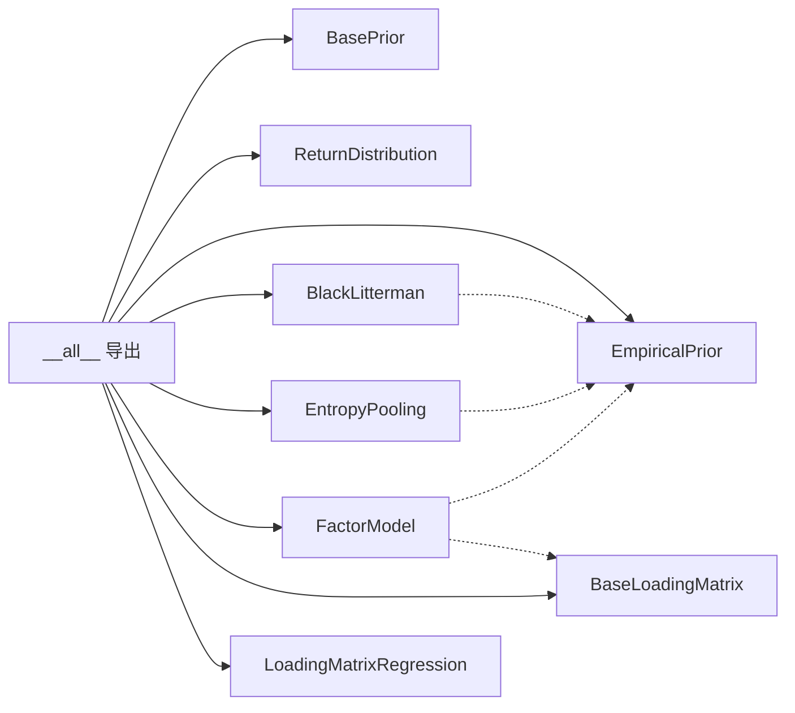

# 先验估计模块API

<cite>
**本文引用的文件**
- [src/skfolio/prior/__init__.py](file://src/skfolio/prior/__init__.py)
- [src/skfolio/prior/_base.py](file://src/skfolio/prior/_base.py)
- [src/skfolio/prior/_empirical.py](file://src/skfolio/prior/_empirical.py)
- [src/skfolio/prior/_black_litterman.py](file://src/skfolio/prior/_black_litterman.py)
- [src/skfolio/prior/_entropy_pooling.py](file://src/skfolio/prior/_entropy_pooling.py)
- [src/skfolio/prior/_factor_model.py](file://src/skfolio/prior/_factor_model.py)
- [examples/mean_risk/plot_11_empirical_prior.py](file://examples/mean_risk/plot_11_empirical_prior.py)
- [examples/mean_risk/plot_12_black_and_litterman.py](file://examples/mean_risk/plot_12_black_and_litterman.py)
- [examples/mean_risk/plot_13_factor_model.py](file://examples/mean_risk/plot_13_factor_model.py)
- [examples/entropy_pooling/plot_1_entropy_pooling.py](file://examples/entropy_pooling/plot_1_entropy_pooling.py)
</cite>

## 目录
1. [简介](#简介)
2. [项目结构](#项目结构)
3. [核心组件](#核心组件)
4. [架构总览](#架构总览)
5. [详细组件分析](#详细组件分析)
6. [依赖关系分析](#依赖关系分析)
7. [性能考量](#性能考量)
8. [故障排查指南](#故障排查指南)
9. [结论](#结论)
10. [附录](#附录)

## 简介
本文件为 skfolio 的 prior 模块提供详尽的 API 参考文档，覆盖以下内容：
- 基类与数据类：BasePrior、ReturnDistribution
- 先验估计器：EmpiricalPrior、BlackLitterman、EntropyPooling、FactorModel
- EntropyPooling 中“prior(资产)”语法在观点表达式中的用法说明
- FactorModel 中因子载荷矩阵的配置与使用
- 如何将先验估计器与优化器结合使用
- solver_params 参数对求解器行为的影响

## 项目结构
prior 模块位于 src/skfolio/prior，对外通过 __init__.py 暴露公共接口，内部以面向对象设计实现各类先验估计器，并统一返回 ReturnDistribution 供优化器消费。

图表来源
- [src/skfolio/prior/_base.py](file://src/skfolio/prior/_base.py#L1-L70)
- [src/skfolio/prior/_empirical.py](file://src/skfolio/prior/_empirical.py#L1-L205)
- [src/skfolio/prior/_black_litterman.py](file://src/skfolio/prior/_black_litterman.py#L1-L269)
- [src/skfolio/prior/_entropy_pooling.py](file://src/skfolio/prior/_entropy_pooling.py#L1-L1513)
- [src/skfolio/prior/_factor_model.py](file://src/skfolio/prior/_factor_model.py#L1-L347)

章节来源
- [src/skfolio/prior/__init__.py](file://src/skfolio/prior/__init__.py#L1-L27)

## 核心组件
- BasePrior：所有先验估计器的抽象基类，定义 fit 接口与 return_distribution_ 属性。
- ReturnDistribution：封装优化所需的均值、协方差、回报矩阵、样本权重与 Cholesky 分解等信息的数据类。

章节来源
- [src/skfolio/prior/_base.py](file://src/skfolio/prior/_base.py#L1-L70)

## 架构总览
先验估计器统一输出 ReturnDistribution，优化器通过 prior_estimator=... 将其注入模型，从而在优化过程中直接使用先验分布。

图表来源
- [src/skfolio/prior/_base.py](file://src/skfolio/prior/_base.py#L1-L70)
- [src/skfolio/prior/_empirical.py](file://src/skfolio/prior/_empirical.py#L1-L205)
- [src/skfolio/prior/_black_litterman.py](file://src/skfolio/prior/_black_litterman.py#L1-L269)
- [src/skfolio/prior/_entropy_pooling.py](file://src/skfolio/prior/_entropy_pooling.py#L1-L1513)
- [src/skfolio/prior/_factor_model.py](file://src/skfolio/prior/_factor_model.py#L1-L347)

## 详细组件分析

### BasePrior 与 ReturnDistribution
- BasePrior
  - 抽象基类，要求实现 fit(X, y=None, **fit_params)，并生成 return_distribution_。
  - 继承 sklearn.base.BaseEstimator，遵循 scikit-learn 接口约定。
- ReturnDistribution
  - 字段：mu、covariance、returns、cholesky（可选）、sample_weight（可选）
  - 用于承载先验估计的分布信息，供优化器直接消费

章节来源
- [src/skfolio/prior/_base.py](file://src/skfolio/prior/_base.py#L1-L70)

### EmpiricalPrior
- 作用：分别拟合 mu_estimator 与 covariance_estimator，组合为 ReturnDistribution。
- 关键参数
  - mu_estimator：期望收益估计器，默认 EmpiricalMu
  - covariance_estimator：协方差估计器，默认 EmpiricalCovariance
  - is_log_normal：是否按对数收益率估计再映射到投资期线性收益
  - investment_horizon：当 is_log_normal=True 时必须提供
- 关键属性
  - return_distribution_：拟合后的 ReturnDistribution
  - mu_estimator_、covariance_estimator_：已拟合的子估计器
  - n_features_in_、feature_names_in_
- fit 行为
  - 支持元数据路由（enable_metadata_routing=True 时）
  - 当 is_log_normal=True 时，将输入转换为对数收益率进行估计，再按时间聚合规则映射回线性收益

章节来源
- [src/skfolio/prior/_empirical.py](file://src/skfolio/prior/_empirical.py#L1-L205)

### BlackLitterman
- 作用：基于先验估计器（默认 EmpiricalPrior(EquilibriumMu)）与分析师观点，计算后验均值与协方差。
- 关键参数
  - views：字符串列表，支持绝对/相对视图、分组视图
  - groups：资产分组，用于 views 中的组名引用
  - prior_estimator：先验估计器，默认 EmpiricalPrior(EquilibriumMu)
  - tau：不确定性系数
  - view_confidences：Idzorek 方法的视信度向量（0~1）
  - risk_free_rate：无风险利率
- 关键属性
  - return_distribution_：后验 ReturnDistribution
  - groups_、views_、picking_matrix_、prior_estimator_
  - n_features_in_、feature_names_in_
- fit 行为
  - 路由 prior_estimator.fit
  - 解析 views，构建挑选矩阵，求解后验均值与协方差

章节来源
- [src/skfolio/prior/_black_litterman.py](file://src/skfolio/prior/_black_litterman.py#L1-L269)

### EntropyPooling
- 作用：以最小相对熵为准则，在满足用户视图约束的前提下，重加权先验概率（样本权重），得到后验分布。
- 视图类型与语法
  - 均值/方差/偏度/峰度/相关性/VaR/CVaR 视图
  - 支持等式、不等式、排序、线性组合、分组视图
  - “prior(资产)”语法：在视图表达式中引用先验均值/方差/其他指标
  - 相关性视图支持 prior(资产1, 资产2) 的形式
- 关键参数
  - prior_estimator：先验估计器，默认 EmpiricalPrior
  - mean_views/variance_views/skew_views/kurtosis_views/correlation_views/value_at_risk_views/cvar_views：视图列表
  - value_at_risk_beta/cvar_beta：VaR/CVaR 置信水平
  - groups：资产分组
  - solver：求解器选择（默认 TNC，也可使用 CVXPY 支持的求解器）
  - solver_params：传递给求解器的额外参数
- 关键属性
  - return_distribution_：包含后验均值、协方差、returns、sample_weight
  - relative_entropy_：KL 散度
  - effective_number_of_scenarios_：有效场景数（熵的指数）
  - prior_estimator_
  - n_features_in_、feature_names_in_
- fit 流程（简化）
  - 路由 prior_estimator.fit
  - 解析并处理各视图，按阶段（均值/VaR/CVaR → 方差 → 相关性/偏度/峰度）线性化非线性约束
  - 使用嵌套熵倾斜策略逐步加入约束
  - 通过 TNC（对偶）或 CVXPY（原始）求解，得到样本权重
- solver_params 说明
  - TNC：支持 gtol、ftol、eps、maxfun、maxCGit、stepmx、disp 等
  - CVXPY：传递给 problem.solve(solver=..., **solver_params)

图表来源
- [src/skfolio/prior/_entropy_pooling.py](file://src/skfolio/prior/_entropy_pooling.py#L1-L1513)

章节来源
- [src/skfolio/prior/_entropy_pooling.py](file://src/skfolio/prior/_entropy_pooling.py#L1-L1513)

### FactorModel
- 作用：在资产回报上拟合因子模型，结合因子先验估计器与载荷矩阵估计器，得到资产层面的均值、协方差与 Cholesky 分解。
- 关键参数
  - loading_matrix_estimator：载荷矩阵估计器，默认 LoadingMatrixRegression（LassoCV 回归）
  - factor_prior_estimator：因子先验估计器，默认 EmpiricalPrior
  - residual_variance：是否将残差方差加入协方差
  - higham：是否使用 Higham 算法保证半正定
  - max_iteration：Higham 最大迭代次数
- 关键属性
  - return_distribution_：包含资产均值、协方差、returns、cholesky、sample_weight
  - factor_prior_estimator_、loading_matrix_estimator_
  - n_features_in_、feature_names_in_
- fit 行为
  - 路由 factor_prior_estimator.fit 与 loading_matrix_estimator.fit
  - 计算 mu、cov、returns、cholesky（可拼接残差项）
  - 协方差通过最近半正定化处理

章节来源
- [src/skfolio/prior/_factor_model.py](file://src/skfolio/prior/_factor_model.py#L1-L347)

### 类关系图

图表来源
- [src/skfolio/prior/_base.py](file://src/skfolio/prior/_base.py#L1-L70)
- [src/skfolio/prior/_empirical.py](file://src/skfolio/prior/_empirical.py#L1-L205)
- [src/skfolio/prior/_black_litterman.py](file://src/skfolio/prior/_black_litterman.py#L1-L269)
- [src/skfolio/prior/_entropy_pooling.py](file://src/skfolio/prior/_entropy_pooling.py#L1-L1513)
- [src/skfolio/prior/_factor_model.py](file://src/skfolio/prior/_factor_model.py#L1-L347)

## 依赖关系分析
- prior 模块通过 __init__.py 显式导出以下公共接口：BasePrior、ReturnDistribution、EmpiricalPrior、BlackLitterman、EntropyPooling、FactorModel、BaseLoadingMatrix、LoadingMatrixRegression、OpinionPooling、SyntheticData。
- 各估计器之间存在组合依赖：
  - BlackLitterman 默认使用 EmpiricalPrior 作为先验
  - FactorModel 默认使用 EmpiricalPrior 作为因子先验
  - EntropyPooling 默认使用 EmpiricalPrior 作为先验（也可使用 SyntheticData）

图表来源
- [src/skfolio/prior/__init__.py](file://src/skfolio/prior/__init__.py#L1-L27)

章节来源
- [src/skfolio/prior/__init__.py](file://src/skfolio/prior/__init__.py#L1-L27)

## 性能考量
- EntropyPooling
  - 默认使用 TNC 对偶求解器，通常比 CVXPY 原始内点法更快；可通过 solver_params 调整收敛精度与迭代上限
  - 多阶段线性化非线性约束，避免一次性大规模非线性问题
- FactorModel
  - 载荷回归可并行（n_jobs），但回归器较轻时并行可能带来开销
  - 协方差半正定化（Higham）更精确但耗时较长，可根据需求开启
- EmpiricalPrior
  - is_log_normal=True 时会进行对数转换与时间聚合，注意输入为线性收益且需提供投资期

[本节为通用指导，无需特定文件来源]

## 故障排查指南
- EntropyPooling
  - 视图冲突或过极端：对偶求解器报错时，尝试降低视图强度、更换 solver（如 CLARABEL）、或改用合成数据增强先验
  - VaR/CVaR 视图极值：确保先验包含足够尾部情景，否则抛出异常提示
  - prior(资产) 未解析：检查资产名是否在 groups 或列名中
- BlackLitterman
  - 视图维度不一致或包含不支持的不等式：确保 views 为一维数组且不含不等式
  - groups 缺失：若 X 非 DataFrame，需显式提供 groups
- FactorModel
  - 载荷矩阵形状不匹配：确保 loading_matrix_estimator 返回 (n_assets, n_factors) 与 (n_assets,) 的截距
  - 半正定性：启用 Higham 并适当增加迭代次数

章节来源
- [src/skfolio/prior/_entropy_pooling.py](file://src/skfolio/prior/_entropy_pooling.py#L842-L1187)
- [src/skfolio/prior/_black_litterman.py](file://src/skfolio/prior/_black_litterman.py#L151-L269)
- [src/skfolio/prior/_factor_model.py](file://src/skfolio/prior/_factor_model.py#L242-L347)

## 结论
prior 模块提供了统一的先验估计框架，支持频率学派、贝叶斯与信息论视角的估计器，并以 ReturnDistribution 为桥梁无缝对接优化器。EntropyPooling 的“prior(资产)”语法使视图表达更灵活；FactorModel 则通过因子载荷矩阵将资产风险分解为系统性与特异性部分。通过合理配置 solver_params 与先验估计器，可在稳健性与灵活性之间取得平衡。

[本节为总结，无需特定文件来源]

## 附录

### 使用示例路径
- EmpiricalPrior 与 MeanRisk 结合
  - 示例路径：[examples/mean_risk/plot_11_empirical_prior.py](file://examples/mean_risk/plot_11_empirical_prior.py#L1-L111)
- BlackLitterman 与 MeanRisk 结合
  - 示例路径：[examples/mean_risk/plot_12_black_and_litterman.py](file://examples/mean_risk/plot_12_black_and_litterman.py#L1-L130)
- FactorModel 与 MeanRisk 结合
  - 示例路径：[examples/mean_risk/plot_13_factor_model.py](file://examples/mean_risk/plot_13_factor_model.py#L1-L190)
- EntropyPooling 与优化器结合（含 solver_params）
  - 示例路径：[examples/entropy_pooling/plot_1_entropy_pooling.py](file://examples/entropy_pooling/plot_1_entropy_pooling.py#L1-L474)

### EntropyPooling 视图语法要点
- “prior(资产)”：在均值/方差/偏度/峰度/相关性等视图中引用先验值
- “prior(资产1, 资产2)”：在相关性视图中引用先验相关性
- 支持等式、不等式、排序、线性组合、分组视图
- VaR/CVaR 视图有额外约束与置信水平参数

章节来源
- [src/skfolio/prior/_entropy_pooling.py](file://src/skfolio/prior/_entropy_pooling.py#L1-L1513)

### FactorModel 中因子载荷矩阵配置
- 默认使用 LoadingMatrixRegression（每资产单独拟合 LassoCV 回归）
- 可替换为自定义 BaseLoadingMatrix 实现（如 Ridge、ElasticNet 等）
- fit(X, y[, factors])：X 为资产回报，y 为因子回报；也可通过 factors 参数覆盖 y

章节来源
- [src/skfolio/prior/_factor_model.py](file://src/skfolio/prior/_factor_model.py#L1-L347)