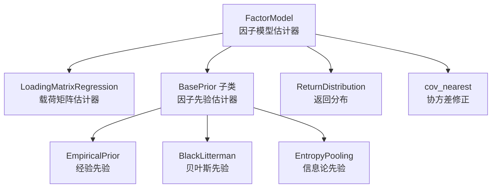
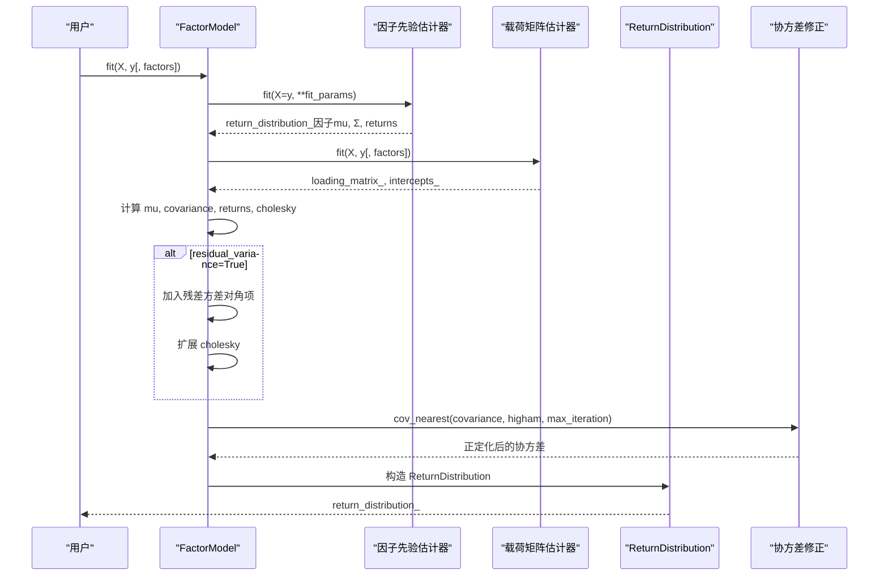
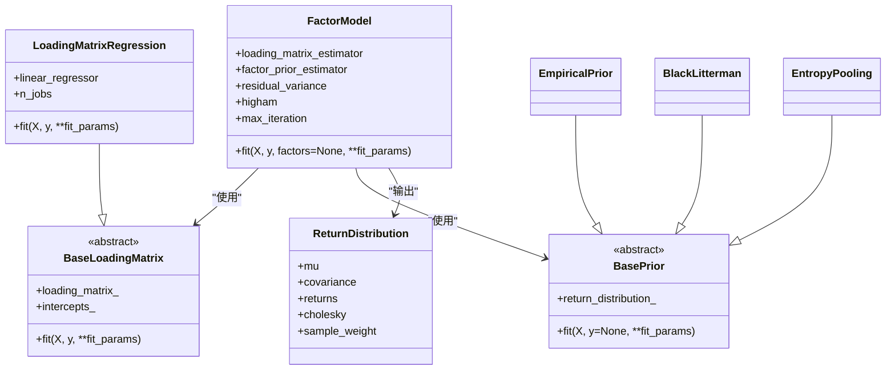

# 因子模型

<cite>
**本文引用的文件**
- [src/skfolio/prior/_factor_model.py](file://src/skfolio/prior/_factor_model.py)
- [src/skfolio/prior/_base.py](file://src/skfolio/prior/_base.py)
- [src/skfolio/prior/_empirical.py](file://src/skfolio/prior/_empirical.py)
- [src/skfolio/utils/stats.py](file://src/skfolio/utils/stats.py)
- [src/skfolio/prior/_black_litterman.py](file://src/skfolio/prior/_black_litterman.py)
- [src/skfolio/prior/_entropy_pooling.py](file://src/skfolio/prior/_entropy_pooling.py)
- [examples/mean_risk/plot_13_factor_model.py](file://examples/mean_risk/plot_13_factor_model.py)
- [examples/mean_risk/plot_14_black_litterman_factor_model.py](file://examples/mean_risk/plot_14_black_litterman_factor_model.py)
- [tests/test_prior/test_factor_model.py](file://tests/test_prior/test_factor_model.py)
- [tests/test_prior/test_black_litterman.py](file://tests/test_prior/test_black_litterman.py)
</cite>

## 目录
1. [简介](#简介)
2. [项目结构](#项目结构)
3. [核心组件](#核心组件)
4. [架构总览](#架构总览)
5. [详细组件分析](#详细组件分析)
6. [依赖关系分析](#依赖关系分析)
7. [性能考量](#性能考量)
8. [故障排查指南](#故障排查指南)
9. [结论](#结论)
10. [附录](#附录)

## 简介
本文件为 FactorModel 类提供全面的 API 文档与使用说明。FactorModel 将资产收益建模为由少数共同因子驱动的结构化模型，并结合因子层面的先验估计器（如经验估计、Black-Litterman 或熵池化）来估计资产预期收益、协方差矩阵与样本权重。其核心能力包括：
- 通过载荷矩阵估计器（默认基于每个资产单独拟合线性回归）估计因子载荷矩阵与截距；
- 使用因子先验估计器估计因子的期望收益与协方差；
- 基于因子模型重构资产预期收益与协方差矩阵；
- 可选地加入残差方差对协方差进行补充；
- 可选地使用 Higham 算法修正协方差矩阵使其正定；
- 生成紧凑的 Cholesky 分解（可小于资产维度），用于优化加速与数值稳定。

此外，FactorModel 的 fit 方法支持额外参数 factors 覆盖 y，便于在训练时使用不同的因子收益序列。

## 项目结构
- 核心实现位于 prior 模块中，FactorModel 与载荷矩阵估计器 LoadingMatrixRegression 均在此文件中定义；
- 先验估计器接口与返回分布数据结构定义在 prior 基类与 ReturnDistribution 中；
- 协方差修正工具（正定化与 Cholesky）在 utils.stats 中；
- BlackLitterman 与 EntropyPooling 提供因子层面的先验估计器；
- 示例与测试展示了如何配置 LassoCV 进行载荷估计、如何将 BlackLitterman 或 EntropyPooling 作为因子先验估计器，以及如何利用生成的 cholesky 因子提升优化性能。

图表来源
- [src/skfolio/prior/_factor_model.py](file://src/skfolio/prior/_factor_model.py#L148-L346)
- [src/skfolio/prior/_base.py](file://src/skfolio/prior/_base.py#L15-L70)
- [src/skfolio/utils/stats.py](file://src/skfolio/utils/stats.py#L322-L414)

章节来源
- [src/skfolio/prior/_factor_model.py](file://src/skfolio/prior/_factor_model.py#L148-L346)
- [src/skfolio/prior/_base.py](file://src/skfolio/prior/_base.py#L15-L70)
- [src/skfolio/utils/stats.py](file://src/skfolio/utils/stats.py#L322-L414)

## 核心组件
- FactorModel
  - 参数
    - loading_matrix_estimator: BaseLoadingMatrix，缺省为 LoadingMatrixRegression；用于估计因子载荷矩阵与截距；
    - factor_prior_estimator: BasePrior，缺省为 EmpiricalPrior；用于估计因子的期望收益与协方差；
    - residual_variance: bool，缺省 True；是否在协方差中加入残差方差对角项；
    - higham: bool，缺省 False；是否使用 Higham 算法修正协方差矩阵；
    - max_iteration: int，缺省 100；当 higham=True 时，Higham 算法的最大迭代次数。
  - 属性
    - return_distribution_: ReturnDistribution；拟合后的资产分布（含 mu、covariance、returns、cholesky、sample_weight）；
    - factor_prior_estimator_：已拟合的因子先验估计器；
    - loading_matrix_estimator_：已拟合的载荷矩阵估计器；
    - n_features_in_、feature_names_in_：输入资产数量与特征名（若存在）。
  - fit(X, y, factors=None, **fit_params)
    - X: 形状 (n_observations, n_assets) 的资产收益；
    - y: 形状 (n_observations, n_factors) 的因子收益；
    - factors: 可选，形状 (n_observations, n_factors) 的因子收益；若提供则覆盖 y；
    - 返回 self。
  - 输出
    - return_distribution_ 包含：
      - mu：资产预期收益；
      - covariance：资产协方差矩阵；
      - returns：资产收益矩阵；
      - cholesky：紧凑 Cholesky 分解（可小于 n_assets 维度）；
      - sample_weight：样本权重（来自因子先验估计器）。

章节来源
- [src/skfolio/prior/_factor_model.py](file://src/skfolio/prior/_factor_model.py#L148-L346)
- [src/skfolio/prior/_base.py](file://src/skfolio/prior/_base.py#L15-L70)

## 架构总览
下图展示了 FactorModel 在估计流程中的关键步骤与组件交互。

图表来源
- [src/skfolio/prior/_factor_model.py](file://src/skfolio/prior/_factor_model.py#L242-L346)
- [src/skfolio/utils/stats.py](file://src/skfolio/utils/stats.py#L322-L414)

## 详细组件分析

### FactorModel 类
- 设计要点
  - 采用“先因子后资产”的建模顺序：先用因子先验估计器拟合因子收益分布，再用载荷矩阵估计器拟合资产收益对因子的线性关系；
  - 通过线性组合与 Cholesky 分解得到资产层面的期望收益、协方差与紧凑 Cholesky 因子；
  - 支持在协方差中加入残差方差对角项以捕捉非系统性风险；
  - 支持使用 Higham 算法确保协方差矩阵正定，提高数值稳定性；
  - 通过 ReturnDistribution 统一输出，便于后续优化器直接使用。

- 关键公式
  - 预期收益：μ_asset = Λ · μ_factor + β_0（其中 Λ 为载荷矩阵，β_0 为截距向量）；
  - 协方差：Σ_asset = Λ · Σ_factor · Λ^T；
  - 若启用残差方差：Σ_asset ← Σ_asset + diag(E[err^2])，其中 err = X - y·Λ^T - β_0；
  - Cholesky：若 Σ_factor = LL^T，则 Σ_asset 的紧凑 Cholesky 为 [L·Λ, sqrt(diag(err_cov))]（当启用残差方差时）。

- fit 流程细节
  - metadata routing：通过 get_metadata_routing 将 fit 参数路由到内部估计器；
  - factors 参数：若提供，会覆盖 y，从而允许在训练时使用不同的因子收益序列；
  - 输入校验：在所有内部估计器拟合后再统一校验 X 与 y 的形状；
  - 输出一致性：保证 cholesky @ cholesky^T 与 covariance 接近相等（数值误差内）。

- 代码片段路径
  - Fit 方法主体与流程：[src/skfolio/prior/_factor_model.py](file://src/skfolio/prior/_factor_model.py#L242-L346)
  - ReturnDistribution 定义：[src/skfolio/prior/_base.py](file://src/skfolio/prior/_base.py#L15-L70)

章节来源
- [src/skfolio/prior/_factor_model.py](file://src/skfolio/prior/_factor_model.py#L148-L346)
- [src/skfolio/prior/_base.py](file://src/skfolio/prior/_base.py#L15-L70)

### 载荷矩阵估计器 LoadingMatrixRegression
- 默认行为
  - 对每个资产分别拟合一个线性回归（默认使用 LassoCV，fit_intercept=False），并行度可通过 n_jobs 控制；
  - 内部使用 sklearn 的 MultiOutputRegressor 将多目标回归问题并行化处理；
  - 输出 loading_matrix_ 与 intercepts_，分别对应载荷矩阵与截距向量。

- 代码片段路径
  - fit 方法与参数处理：[src/skfolio/prior/_factor_model.py](file://src/skfolio/prior/_factor_model.py#L98-L146)

章节来源
- [src/skfolio/prior/_factor_model.py](file://src/skfolio/prior/_factor_model.py#L98-L146)

### 因子先验估计器
- EmpiricalPrior（默认）
  - 通过独立的均值与协方差估计器（如经验均值、经验协方差或收缩估计）拟合因子收益分布；
  - 可配置是否按对数收益率估计并投影至投资期。

- BlackLitterman
  - 采用贝叶斯方法，将先验估计与分析师观点融合，得到因子的后验分布；
  - 支持绝对/相对观点、分组视图、置信度等高级特性。

- EntropyPooling
  - 基于信息论最小熵原理，将先验概率分布调整到满足用户观点的后验分布；
  - 支持均值、方差、偏度、峰度、相关性、VaR、CVaR 等多种度量的约束。

- 代码片段路径
  - EmpiricalPrior：[src/skfolio/prior/_empirical.py](file://src/skfolio/prior/_empirical.py#L1-L205)
  - BlackLitterman：[src/skfolio/prior/_black_litterman.py](file://src/skfolio/prior/_black_litterman.py#L1-L200)
  - EntropyPooling：[src/skfolio/prior/_entropy_pooling.py](file://src/skfolio/prior/_entropy_pooling.py#L1-L200)

章节来源
- [src/skfolio/prior/_empirical.py](file://src/skfolio/prior/_empirical.py#L1-L205)
- [src/skfolio/prior/_black_litterman.py](file://src/skfolio/prior/_black_litterman.py#L1-L200)
- [src/skfolio/prior/_entropy_pooling.py](file://src/skfolio/prior/_entropy_pooling.py#L1-L200)

### 协方差修正与 Cholesky 分解
- cov_nearest
  - 若协方差矩阵正定且可 Cholesky 分解，则直接返回；
  - 否则：
    - higham=False：通过特征值裁剪（阈值约 1e-13）得到最近正定矩阵；
    - higham=True：使用 Higham（2002）算法迭代逼近最近相关矩阵，再转换回协方差；
  - 返回正定协方差矩阵，确保后续优化可用。

- 代码片段路径
  - 协方差修正函数：[src/skfolio/utils/stats.py](file://src/skfolio/utils/stats.py#L322-L414)

章节来源
- [src/skfolio/utils/stats.py](file://src/skfolio/utils/stats.py#L322-L414)

## 依赖关系分析
- 组件耦合
  - FactorModel 依赖于两个子估计器：因子先验估计器与载荷矩阵估计器；
  - ReturnDistribution 作为统一输出容器，被优化器广泛使用；
  - cov_nearest 作为通用工具，贯穿因子模型与其它估计器的正定化需求。

图表来源
- [src/skfolio/prior/_factor_model.py](file://src/skfolio/prior/_factor_model.py#L29-L146)
- [src/skfolio/prior/_base.py](file://src/skfolio/prior/_base.py#L15-L70)

章节来源
- [src/skfolio/prior/_factor_model.py](file://src/skfolio/prior/_factor_model.py#L29-L146)
- [src/skfolio/prior/_base.py](file://src/skfolio/prior/_base.py#L15-L70)

## 性能考量
- 载荷估计并行化：LoadingMatrixRegression 使用 MultiOutputRegressor 并行拟合每个资产的线性回归，n_jobs 可控制并行度；
- 紧凑 Cholesky 分解：通过将因子协方差的 Cholesky 与载荷矩阵相乘，得到更小维度的 Cholesky 因子，有助于提升优化求解速度与数值稳定性；
- 协方差正定化：在高维或观测不足时，协方差可能非正定；启用 higham=True 可获得更稳健的结果，但计算成本更高；
- 残差方差：启用 residual_variance 会增加协方差的对角项与 Cholesky 的列数，提升模型拟合度但也会增加计算复杂度。

[本节为一般性指导，不直接分析具体文件]

## 故障排查指南
- 输入维度不匹配
  - 当载荷矩阵估计器输出的 loading_matrix_ 或 intercepts_ 维度与资产数不一致时，会抛出错误；
  - 检查 y 与 X 的形状，确保 y 为 (n_observations, n_factors)，X 为 (n_observations, n_assets)。
- 协方差非正定
  - 若协方差矩阵不可 Cholesky 分解，建议启用 higham=True 或检查数据质量；
  - 可通过 cov_nearest 的 warn 参数获取警告提示。
- 高维问题
  - 当 n_assets 远大于 n_observations 时，协方差易非正定；考虑使用收缩估计器或降低因子维度。

章节来源
- [src/skfolio/prior/_factor_model.py](file://src/skfolio/prior/_factor_model.py#L309-L333)
- [src/skfolio/utils/stats.py](file://src/skfolio/utils/stats.py#L322-L414)

## 结论
FactorModel 提供了灵活而强大的因子模型估计框架，既可与经验先验配合，也可与 BlackLitterman 或熵池化等信息论先验结合，以纳入专家观点或从历史场景中学习。其紧凑的 Cholesky 分解与可选的残差方差与正定化策略，使得在高维与噪声环境下仍能保持稳健与高效。通过合理的载荷估计器与因子先验估计器配置，可显著提升投资组合优化的稳定性与性能。

[本节为总结性内容，不直接分析具体文件]

## 附录

### API 使用示例与最佳实践
- 配置 LassoCV 进行载荷估计
  - 使用 LoadingMatrixRegression 并设置 linear_regressor 为 LassoCV（fit_intercept=False），可并行化处理（n_jobs=-1）；
  - 示例参考：[examples/mean_risk/plot_13_factor_model.py](file://examples/mean_risk/plot_13_factor_model.py#L100-L119)
- 将 BlackLitterman 作为因子先验估计器
  - 在 FactorModel 中设置 factor_prior_estimator=BlackLitterman(...)，可直接在因子层面融入观点；
  - 示例参考：[examples/mean_risk/plot_14_black_litterman_factor_model.py](file://examples/mean_risk/plot_14_black_litterman_factor_model.py#L60-L71)
- 将 EntropyPooling 作为因子先验估计器
  - 在 FactorModel 中设置 factor_prior_estimator=EntropyPooling(...)，可对因子分布施加均值、方差、VaR/CVaR 等约束；
  - 示例参考：[tests/test_prior/test_factor_model.py](file://tests/test_prior/test_factor_model.py#L14-L37)
- 利用生成的 cholesky 因子提升优化性能
  - FactorModel 返回的 ReturnDistribution 中包含 cholesky，可直接用于优化器（如 MeanRisk）以提升收敛速度与数值稳定性；
  - 示例参考：[tests/test_prior/test_factor_model.py](file://tests/test_prior/test_factor_model.py#L14-L23)

章节来源
- [examples/mean_risk/plot_13_factor_model.py](file://examples/mean_risk/plot_13_factor_model.py#L100-L119)
- [examples/mean_risk/plot_14_black_litterman_factor_model.py](file://examples/mean_risk/plot_14_black_litterman_factor_model.py#L60-L71)
- [tests/test_prior/test_factor_model.py](file://tests/test_prior/test_factor_model.py#L14-L37)
- [tests/test_prior/test_black_litterman.py](file://tests/test_prior/test_black_litterman.py#L599-L611)