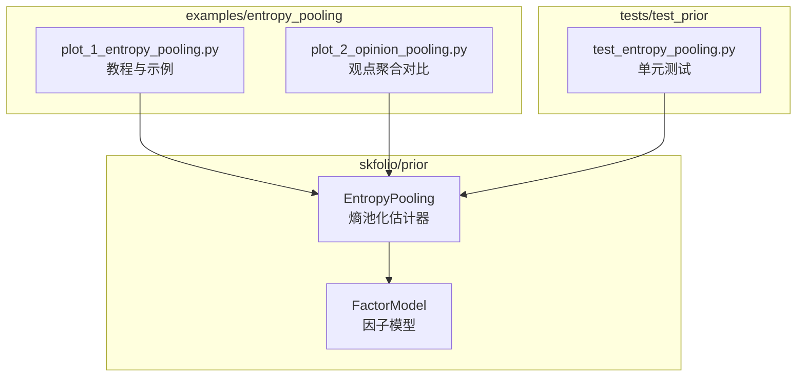
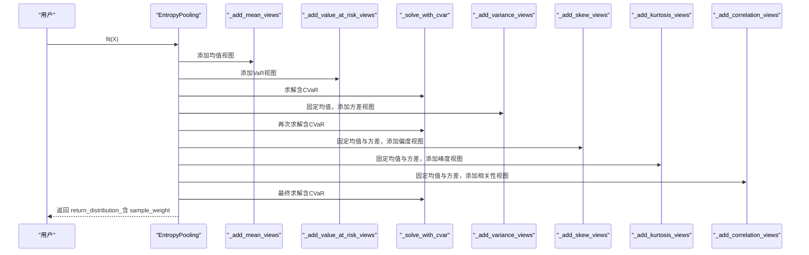
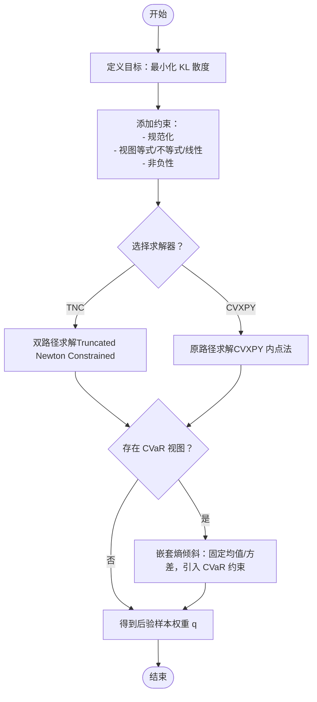
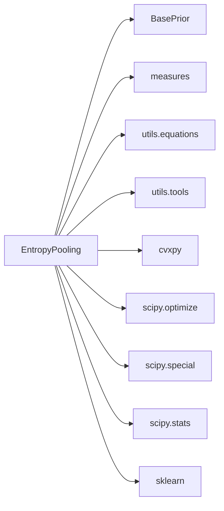

# 熵池化估计器

<cite>
**本文引用的文件**
- [src/skfolio/prior/_entropy_pooling.py](file://src/skfolio/prior/_entropy_pooling.py)
- [src/skfolio/prior/_factor_model.py](file://src/skfolio/prior/_factor_model.py)
- [examples/entropy_pooling/plot_1_entropy_pooling.py](file://examples/entropy_pooling/plot_1_entropy_pooling.py)
- [examples/entropy_pooling/plot_2_opinion_pooling.py](file://examples/entropy_pooling/plot_2_opinion_pooling.py)
- [tests/test_prior/test_entropy_pooling.py](file://tests/test_prior/test_entropy_pooling.py)
</cite>

## 目录
1. [简介](#简介)
2. [项目结构](#项目结构)
3. [核心组件](#核心组件)
4. [架构总览](#架构总览)
5. [详细组件分析](#详细组件分析)
6. [依赖关系分析](#依赖关系分析)
7. [性能考量](#性能考量)
8. [故障排查指南](#故障排查指南)
9. [结论](#结论)
10. [附录](#附录)

## 简介
本文件为 EntropyPooling 类的深度API文档，聚焦于其通过“最小化与先验分布的相对熵（Kullback–Leibler散度）”融合多观点的能力。文档系统阐述以下要点：
- 使用 mean_views、vol_views（即方差视图）、corr_views（相关性视图）、prob_views（概率视图）等参数表达多种观点的语法，尤其是如何在表达式中使用 prior(ASSET) 引用先验值。
- 数学原理：以最小化 KL 散度为目标，在满足用户视图约束的前提下，得到后验分布（样本权重）。
- 对线性、不等式、概率（VaR/CVaR）及组合视图（含分组资产）的处理能力。
- 实战示例：如何设置“x2 == 0.0005”的均值观点；如何表达“x1 >= prior(x1)”的相对观点；以及如何将熵池化结果作为 FactorModel 的 factor_prior_estimator 构建复合模型。

## 项目结构
EntropyPooling 属于 prior 子模块，位于 src/skfolio/prior/_entropy_pooling.py；其典型用法与示例位于 examples/entropy_pooling；单元测试覆盖了多类视图与边界条件。



图表来源
- [src/skfolio/prior/_entropy_pooling.py](file://src/skfolio/prior/_entropy_pooling.py#L1-L120)
- [src/skfolio/prior/_factor_model.py](file://src/skfolio/prior/_factor_model.py#L148-L210)
- [examples/entropy_pooling/plot_1_entropy_pooling.py](file://examples/entropy_pooling/plot_1_entropy_pooling.py#L1-L120)
- [examples/entropy_pooling/plot_2_opinion_pooling.py](file://examples/entropy_pooling/plot_2_opinion_pooling.py#L1-L120)
- [tests/test_prior/test_entropy_pooling.py](file://tests/test_prior/test_entropy_pooling.py#L1-L120)

章节来源
- [src/skfolio/prior/_entropy_pooling.py](file://src/skfolio/prior/_entropy_pooling.py#L1-L120)
- [examples/entropy_pooling/plot_1_entropy_pooling.py](file://examples/entropy_pooling/plot_1_entropy_pooling.py#L1-L120)
- [tests/test_prior/test_entropy_pooling.py](file://tests/test_prior/test_entropy_pooling.py#L1-L120)

## 核心组件
- EntropyPooling：基于信息论的非参数方法，通过最小化 KL 散度将基线先验分布调整为满足用户视图的后验分布。支持均值、方差、偏度、峰度、相关性、VaR、CVaR 等多类视图，并可对资产或分组施加等式/不等式/排名/线性组合视图。
- prior_estimator：用于提供先验分布（默认 EmpiricalPrior）。也可传入合成数据生成器（如 VineCopula）以扩展极端尾部场景。
- solver/solver_params：双路径求解器（TNC 双路径或 CVXPY 原路径），分别针对大规模约束与高精度需求。
- ReturnDistribution：返回池化后的样本权重（posterior probabilities），供优化器使用。

章节来源
- [src/skfolio/prior/_entropy_pooling.py](file://src/skfolio/prior/_entropy_pooling.py#L38-L120)
- [src/skfolio/prior/_entropy_pooling.py](file://src/skfolio/prior/_entropy_pooling.py#L470-L588)

## 架构总览
EntropyPooling 的工作流分为三个阶段（嵌套熵倾斜）：
- 阶段1：均值、VaR、CVaR 视图
- 阶段2：在阶段1基础上固定均值，加入方差视图
- 阶段3：在阶段2基础上固定均值与方差，加入偏度、峰度与成对相关性视图



图表来源
- [src/skfolio/prior/_entropy_pooling.py](file://src/skfolio/prior/_entropy_pooling.py#L539-L568)
- [src/skfolio/prior/_entropy_pooling.py](file://src/skfolio/prior/_entropy_pooling.py#L624-L740)
- [src/skfolio/prior/_entropy_pooling.py](file://src/skfolio/prior/_entropy_pooling.py#L741-L841)
- [src/skfolio/prior/_entropy_pooling.py](file://src/skfolio/prior/_entropy_pooling.py#L842-L991)

## 详细组件分析

### EntropyPooling 类与参数详解
- prior_estimator：先验分布估计器，默认 EmpiricalPrior；可替换为合成数据生成器以增强极端视图可行性。
- mean_views：均值视图，支持等式、不等式、排名、线性组合、分组视图；可使用 prior(ASSET) 引用先验均值。
- variance_views：方差视图，支持与均值视图相同的模式。
- skew_views/kurtosis_views：偏度/峰度视图，支持相同模式。
- correlation_views：相关性视图，格式为“(asset1, asset2) OP value”，支持 prior(ASSET1, ASSET2)。
- value_at_risk_views/cvar_views：VaR/CVaR 视图，前者支持等式/不等式，后者仅支持等式且必须严格正。
- groups：资产分组字典或二维数组，用于分组视图。
- solver：求解器选择（默认 TNC，也可使用 CVXPY 支持的求解器）。
- solver_params：传递给求解器的参数（TNC 或 CVXPY）。

章节来源
- [src/skfolio/prior/_entropy_pooling.py](file://src/skfolio/prior/_entropy_pooling.py#L151-L318)

### 视图语法与 prior(ASSET) 使用
- prior(ASSET)：在视图表达式中引用先验均值/方差/其他指标。例如：
  - “x1 >= prior(x1)” 表达相对视图（x1 相对于其先验均值的提升/下降）。
  - “x1 >= 1.2 * prior(x1)” 表达倍数相对视图。
  - “Group == 0.005” 表达分组均值视图。
- correlation 视图中的 prior(ASSET1, ASSET2)：引用先验协方差/相关系数，支持乘法与常数加法组合。
- 支持混合线性组合，如 “a*x1 + b*x2 + c <= d*x3”。

章节来源
- [src/skfolio/prior/_entropy_pooling.py](file://src/skfolio/prior/_entropy_pooling.py#L160-L240)
- [src/skfolio/prior/_entropy_pooling.py](file://src/skfolio/prior/_entropy_pooling.py#L800-L841)
- [src/skfolio/prior/_entropy_pooling.py](file://src/skfolio/prior/_entropy_pooling.py#L1297-L1391)
- [src/skfolio/prior/_entropy_pooling.py](file://src/skfolio/prior/_entropy_pooling.py#L1394-L1513)

### 数学原理：最小化相对熵（KL 散度）
- 目标函数：最小化 KL 散度 D(q||p)，其中 q 为后验概率，p 为先验概率。
- 约束条件：规范化约束（Σ q_i = 1）、视图约束（等式/不等式/线性组合）、非负性约束（q_i ≥ 0）。
- 两种求解路径：
  - 双路径（TNC）：在对偶空间中求解，规模为约束数量，速度更快。
  - 原路径（CVXPY）：在概率空间中直接求解，精度更高但更慢。
- CVaR 视图采用嵌套求解策略：通过 eta（VaR水平）递归逼近有效 CVaR，再求解 KL 投影。



图表来源
- [src/skfolio/prior/_entropy_pooling.py](file://src/skfolio/prior/_entropy_pooling.py#L539-L568)
- [src/skfolio/prior/_entropy_pooling.py](file://src/skfolio/prior/_entropy_pooling.py#L842-L991)
- [src/skfolio/prior/_entropy_pooling.py](file://src/skfolio/prior/_entropy_pooling.py#L1007-L1187)

### 处理线性、不等式与概率视图
- 线性/等式/不等式/排名/分组视图：统一转换为线性约束矩阵（等式/不等式），并进行尺度归一化以提升数值稳定性。
- VaR 视图：要求严格正，且不能跨多个资产混合；否则抛出异常。
- CVaR 视图：仅支持等式，且必须严格正；当视图过极端时会提示需放宽或更换先验。

章节来源
- [src/skfolio/prior/_entropy_pooling.py](file://src/skfolio/prior/_entropy_pooling.py#L590-L624)
- [src/skfolio/prior/_entropy_pooling.py](file://src/skfolio/prior/_entropy_pooling.py#L741-L781)
- [src/skfolio/prior/_entropy_pooling.py](file://src/skfolio/prior/_entropy_pooling.py#L842-L991)

### 示例：设置“x2 == 0.0005”的均值观点
- 在 mean_views 中添加形如 “x2 == 0.0005” 的字符串视图。
- fit 后，返回分布的样本权重可用于后续优化器（如 RiskBudgeting/HierarchicalRiskParity）。

章节来源
- [tests/test_prior/test_entropy_pooling.py](file://tests/test_prior/test_entropy_pooling.py#L1102-L1109)
- [examples/entropy_pooling/plot_1_entropy_pooling.py](file://examples/entropy_pooling/plot_1_entropy_pooling.py#L194-L217)

### 示例：设置“x1 >= prior(x1)”的相对观点
- 在 mean_views 中添加形如 “x1 >= prior(x1)” 的字符串视图。
- fit 后，后验均值将不低于先验均值（允许数值误差）。

章节来源
- [tests/test_prior/test_entropy_pooling.py](file://tests/test_prior/test_entropy_pooling.py#L104-L126)
- [examples/entropy_pooling/plot_1_entropy_pooling.py](file://examples/entropy_pooling/plot_1_entropy_pooling.py#L194-L217)

### 示例：将熵池化结果作为 FactorModel 的 factor_prior_estimator
- 先用 EntropyPooling 对因子数据施加视图，得到因子先验分布。
- 将该熵池化对象作为 FactorModel 的 factor_prior_estimator，从而在因子层面注入专家观点。
- 再将 FactorModel 作为 prior_estimator 传入优化器（如 RiskBudgeting/HierarchicalRiskParity）。

```mermaid
sequenceDiagram
participant U as "用户"
participant FE as "因子熵池化<br/>EntropyPooling(factor_views)"
participant FM as "因子模型<br/>FactorModel(factor_prior_estimator=FE)"
participant OPT as "优化器<br/>RiskBudgeting/HierarchicalRiskParity"
U->>FE : fit(factors)
FE-->>U : return_distribution_含 sample_weight
U->>FM : fit(X, factors, factor_prior_estimator=FE)
FM-->>U : return_distribution_含 mu, covariance, sample_weight
U->>OPT : fit(X, prior_estimator=FM)
OPT-->>U : weights_
```

图表来源
- [examples/entropy_pooling/plot_1_entropy_pooling.py](file://examples/entropy_pooling/plot_1_entropy_pooling.py#L317-L334)
- [examples/entropy_pooling/plot_1_entropy_pooling.py](file://examples/entropy_pooling/plot_1_entropy_pooling.py#L336-L361)
- [src/skfolio/prior/_factor_model.py](file://src/skfolio/prior/_factor_model.py#L148-L210)
- [src/skfolio/prior/_factor_model.py](file://src/skfolio/prior/_factor_model.py#L242-L347)

## 依赖关系分析
- 内部依赖
  - BasePrior：继承基础先验接口，输出 ReturnDistribution。
  - EmpiricalPrior：默认先验估计器。
  - measures：提供 mean、variance、skew、kurtosis、correlation、value_at_risk、cvar 等统计量。
  - utils.equations：将视图字符串转换为线性约束矩阵。
  - utils.tools：输入校验与默认资产名生成。
- 外部依赖
  - cvxpy：原路径求解（KL 散度最小化）。
  - scipy.optimize/scipy.special/scipy.stats：双路径求解（TNC）、熵与相对熵计算。
  - sklearn：元数据路由与验证工具。



图表来源
- [src/skfolio/prior/_entropy_pooling.py](file://src/skfolio/prior/_entropy_pooling.py#L1-L36)
- [src/skfolio/prior/_entropy_pooling.py](file://src/skfolio/prior/_entropy_pooling.py#L470-L588)

章节来源
- [src/skfolio/prior/_entropy_pooling.py](file://src/skfolio/prior/_entropy_pooling.py#L1-L36)

## 性能考量
- 求解器选择
  - TNC（默认）：在对偶空间求解，约束数量决定规模，速度快，适合大规模视图。
  - CVXPY：原路径求解，精度更高，但速度较慢，适合小规模问题或对精度敏感场景。
- 视图规模与数值稳定性
  - 视图矩阵按列进行尺度归一化，避免不同量级导致的病态问题。
  - 对于过极端视图，建议使用合成数据（如 VineCopula）扩展先验支持范围。
- 嵌套视图
  - 方差、偏度、峰度与相关性视图在固定均值/方差的基础上引入，减少冲突与不可行性。

[本节为通用指导，无需列出具体文件来源]

## 故障排查指南
- 视图格式错误
  - VaR 视图不允许跨资产混合，也不允许非严格正视图；否则抛出异常。
  - CVaR 视图仅支持等式且必须严格正；若超出最坏实现，会提示放宽视图或扩展先验。
- prior(ASSET) 未解析
  - 若视图中出现 prior(ASSET) 但该资产不在先验可用范围内，会提示未解析；请检查资产名与 groups 设置。
- 求解失败
  - TNC/CVXPY 求解器可能因视图冲突或过极端而失败；建议放宽视图、更换 solver 或使用合成数据增强先验。

章节来源
- [src/skfolio/prior/_entropy_pooling.py](file://src/skfolio/prior/_entropy_pooling.py#L741-L781)
- [src/skfolio/prior/_entropy_pooling.py](file://src/skfolio/prior/_entropy_pooling.py#L842-L991)
- [src/skfolio/prior/_entropy_pooling.py](file://src/skfolio/prior/_entropy_pooling.py#L1297-L1391)
- [tests/test_prior/test_entropy_pooling.py](file://tests/test_prior/test_entropy_pooling.py#L1110-L1137)

## 结论
EntropyPooling 提供了灵活、强大的多视图融合框架，通过最小化 KL 散度在保持先验信息最少改变的前提下，将专家观点或量化分析结果整合到分布中。其支持线性、不等式、概率（VaR/CVaR）与分组视图，并可通过合成数据扩展极端场景的可行性。结合 FactorModel，可在因子层面注入观点，构建更稳健的复合模型，适用于从优化到压力测试的全生命周期风险管理。

[本节为总结性内容，无需列出具体文件来源]

## 附录

### API 参数速查
- prior_estimator：先验估计器（默认 EmpiricalPrior）
- mean_views/variance_views/skew_views/kurtosis_views：对应指标的视图列表
- correlation_views：相关性视图，格式“(asset1, asset2) OP value”
- value_at_risk_views/cvar_views：VaR/CVaR 视图（前者支持等式/不等式，后者仅等式）
- groups：资产分组（字典或二维数组）
- solver：求解器（默认 TNC，也可使用 CVXPY 支持的求解器）
- solver_params：求解器参数（TNC 或 CVXPY）

章节来源
- [src/skfolio/prior/_entropy_pooling.py](file://src/skfolio/prior/_entropy_pooling.py#L151-L318)

### 示例路径参考
- 设置“x2 == 0.0005”的均值观点：参见测试用例路径
  - [tests/test_prior/test_entropy_pooling.py](file://tests/test_prior/test_entropy_pooling.py#L1102-L1109)
- 设置“x1 >= prior(x1)”的相对观点：参见测试用例路径
  - [tests/test_prior/test_entropy_pooling.py](file://tests/test_prior/test_entropy_pooling.py#L104-L126)
- 将熵池化结果作为 FactorModel 的 factor_prior_estimator：参见教程路径
  - [examples/entropy_pooling/plot_1_entropy_pooling.py](file://examples/entropy_pooling/plot_1_entropy_pooling.py#L317-L361)