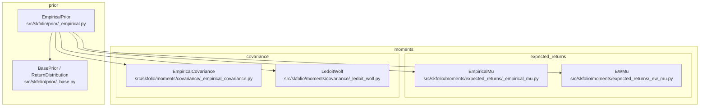
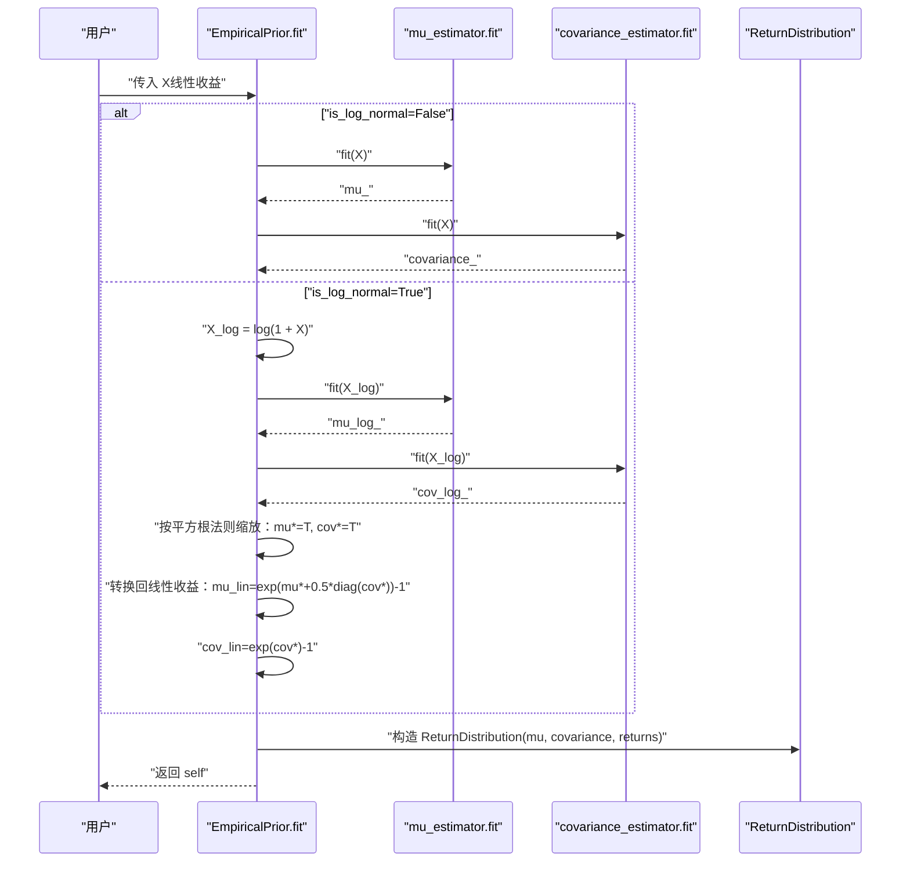
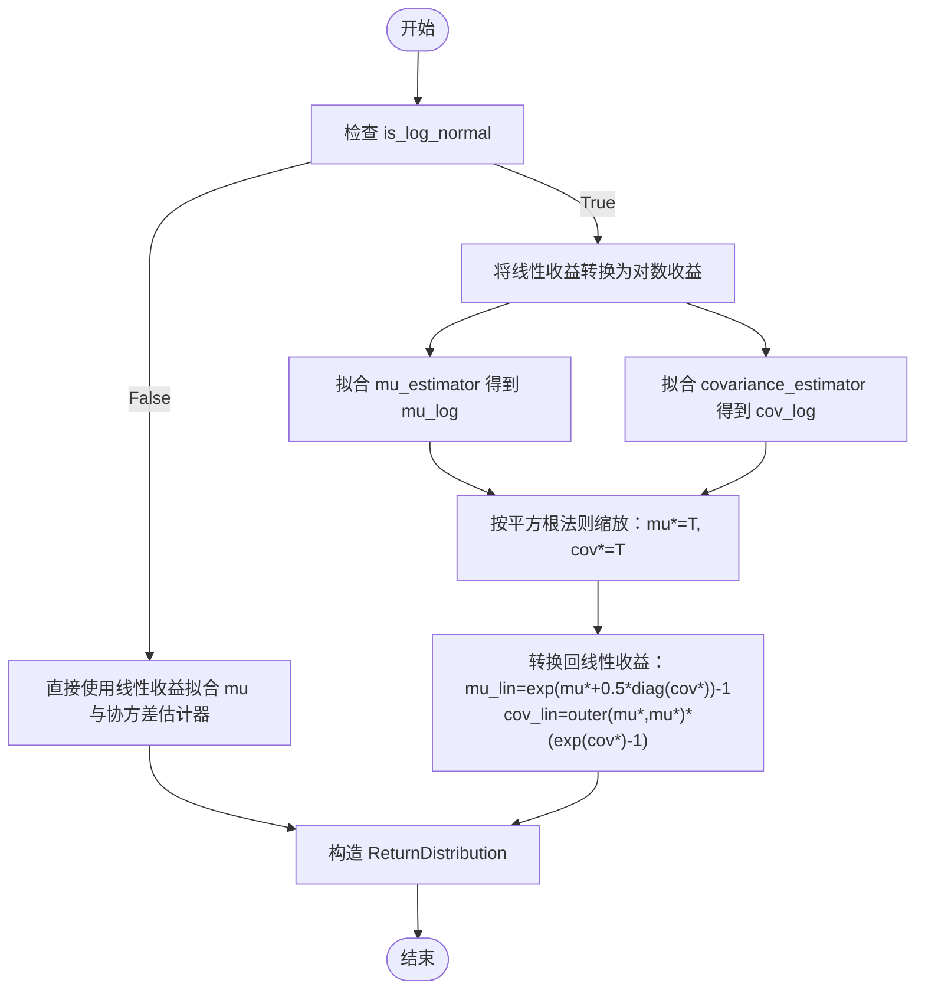
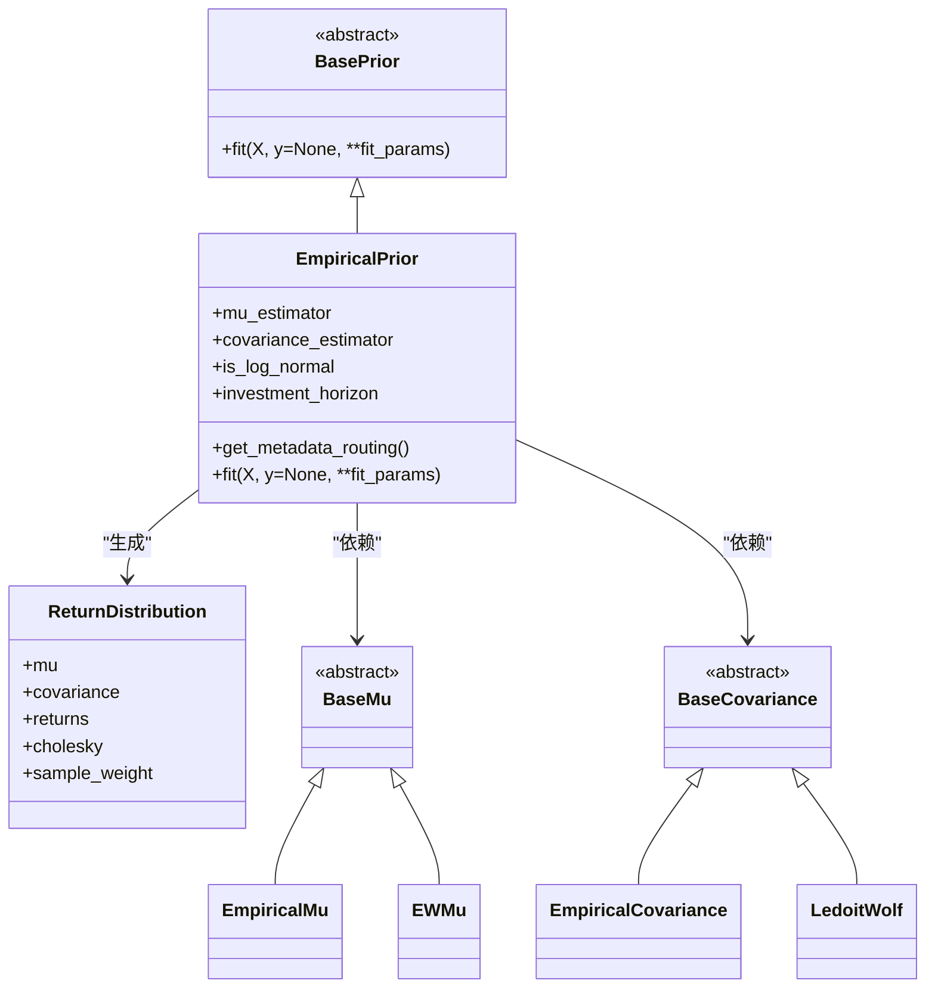

# 经验先验估计器

<cite>
**本文引用的文件**
- [src/skfolio/prior/_empirical.py](file://src/skfolio/prior/_empirical.py)
- [src/skfolio/prior/_base.py](file://src/skfolio/prior/_base.py)
- [src/skfolio/moments/expected_returns/_empirical_mu.py](file://src/skfolio/moments/expected_returns/_empirical_mu.py)
- [src/skfolio/moments/covariance/_empirical_covariance.py](file://src/skfolio/moments/covariance/_empirical_covariance.py)
- [src/skfolio/moments/expected_returns/_ew_mu.py](file://src/skfolio/moments/expected_returns/_ew_mu.py)
- [src/skfolio/moments/covariance/_ledoit_wolf.py](file://src/skfolio/moments/covariance/_ledoit_wolf.py)
- [src/skfolio/utils/tools.py](file://src/skfolio/utils/tools.py)
- [examples/mean_risk/plot_11_empirical_prior.py](file://examples/mean_risk/plot_11_empirical_prior.py)
- [tests/test_prior/test_empirical.py](file://tests/test_prior/test_empirical.py)
- [docs/user_guide/metadata_routing.rst](file://docs/user_guide/metadata_routing.rst)
</cite>

## 目录
1. [简介](#简介)
2. [项目结构](#项目结构)
3. [核心组件](#核心组件)
4. [架构总览](#架构总览)
5. [详细组件分析](#详细组件分析)
6. [依赖关系分析](#依赖关系分析)
7. [性能与数值稳定性考量](#性能与数值稳定性考量)
8. [故障排查指南](#故障排查指南)
9. [结论](#结论)
10. [附录](#附录)

## 简介
本文件为 EmpiricalPrior 类提供详细的 API 文档，覆盖其参数、行为、对数正态假设下的时间聚合流程、以及通过 MetadataRouter 将 fit 参数路由到底层估计器的机制。同时给出配置不同 mu 和协方差估计器（如 EWMu、LedoitWolf）的方法，以及在对数正态假设下进行长期投资组合预测的使用示例路径。

## 项目结构
EmpiricalPrior 位于 prior 模块中，依赖 moments 子模块中的期望收益与协方差估计器；其返回分布由 prior 基类定义的数据类承载。

图表来源
- [src/skfolio/prior/_empirical.py](file://src/skfolio/prior/_empirical.py#L1-L205)
- [src/skfolio/prior/_base.py](file://src/skfolio/prior/_base.py#L1-L70)
- [src/skfolio/moments/expected_returns/_empirical_mu.py](file://src/skfolio/moments/expected_returns/_empirical_mu.py#L1-L65)
- [src/skfolio/moments/expected_returns/_ew_mu.py](file://src/skfolio/moments/expected_returns/_ew_mu.py#L1-L71)
- [src/skfolio/moments/covariance/_empirical_covariance.py](file://src/skfolio/moments/covariance/_empirical_covariance.py#L1-L106)
- [src/skfolio/moments/covariance/_ledoit_wolf.py](file://src/skfolio/moments/covariance/_ledoit_wolf.py#L1-L141)

章节来源
- [src/skfolio/prior/_empirical.py](file://src/skfolio/prior/_empirical.py#L1-L205)
- [src/skfolio/prior/_base.py](file://src/skfolio/prior/_base.py#L1-L70)

## 核心组件
- EmpiricalPrior：经验先验估计器，独立拟合 mu 估计器与协方差估计器，支持对数正态假设与投资期限缩放。
- ReturnDistribution：返回分布数据类，包含均值向量、协方差矩阵、观测收益等。
- BasePrior：所有先验估计器的抽象基类。
- 底层估计器：
  - EmpiricalMu/EWMu：期望收益估计器
  - EmpiricalCovariance/LedoitWolf：协方差估计器

章节来源
- [src/skfolio/prior/_empirical.py](file://src/skfolio/prior/_empirical.py#L1-L205)
- [src/skfolio/prior/_base.py](file://src/skfolio/prior/_base.py#L1-L70)
- [src/skfolio/moments/expected_returns/_empirical_mu.py](file://src/skfolio/moments/expected_returns/_empirical_mu.py#L1-L65)
- [src/skfolio/moments/expected_returns/_ew_mu.py](file://src/skfolio/moments/expected_returns/_ew_mu.py#L1-L71)
- [src/skfolio/moments/covariance/_empirical_covariance.py](file://src/skfolio/moments/covariance/_empirical_covariance.py#L1-L106)
- [src/skfolio/moments/covariance/_ledoit_wolf.py](file://src/skfolio/moments/covariance/_ledoit_wolf.py#L1-L141)

## 架构总览
EmpiricalPrior 的工作流分为两条路径：
- 非对数正态路径：直接使用线性收益拟合 mu 与协方差估计器。
- 对数正态路径：将线性收益转换为对数收益进行估计，按“平方根法则”缩放到投资期限，再转换回线性收益的期望与协方差。

图表来源
- [src/skfolio/prior/_empirical.py](file://src/skfolio/prior/_empirical.py#L109-L205)

## 详细组件分析

### EmpiricalPrior 类 API
- 参数
  - mu_estimator: BaseMu，可选。默认使用 EmpiricalMu。用于估计资产期望收益。
  - covariance_estimator: BaseCovariance，可选。默认使用 EmpiricalCovariance。用于估计资产协方差矩阵。
  - is_log_normal: bool，是否基于对数正态假设估计。默认 False。若为 True，则输入必须是线性收益，内部会转换为对数收益进行估计，并按投资期限缩放后转换回线性收益的期望与协方差。
  - investment_horizon: float，可选。仅在 is_log_normal=True 时有效，表示投资期限（如交易日数量）。
- 属性
  - return_distribution_: ReturnDistribution，拟合后的返回分布。
  - mu_estimator_ / covariance_estimator_: 已拟合的底层估计器实例。
  - n_features_in_ / feature_names_in_: 输入特征数量与名称（来自验证过程）。
- 方法
  - get_metadata_routing(): 返回 MetadataRouter，将 fit 调用路由到 mu_estimator 与 covariance_estimator。
  - fit(X, y=None, **fit_params): 拟合并生成 return_distribution_。
- 异常
  - 当 is_log_normal=False 且 investment_horizon 不为 None 时抛出错误。
  - 当 is_log_normal=True 且未提供 investment_horizon 时抛出错误。
- 返回
  - EmpiricalPrior 实例（支持链式调用）。

章节来源
- [src/skfolio/prior/_empirical.py](file://src/skfolio/prior/_empirical.py#L1-L205)
- [src/skfolio/prior/_base.py](file://src/skfolio/prior/_base.py#L1-L70)

### 对数正态假设与时间聚合流程
当 is_log_normal=True 时，EmpiricalPrior 的处理步骤如下：
1. 输入 X 必须是线性收益。
2. 将线性收益转换为对数收益：X_log = log(1 + X)。
3. 分别对 X_log 拟合 mu_estimator 与 covariance_estimator，得到 mu_log 与 cov_log。
4. 使用“平方根法则”按投资期限 T 缩放：mu *= T，cov *= T。
5. 将对数收益的分布投影到投资期限 T，转换为线性收益的期望与协方差：
   - mu_lin = exp(mu* + 0.5 * diag(cov*)) - 1
   - cov_lin = outer(mu*, mu*) * (exp(cov*) - 1)
6. 构造 ReturnDistribution 并保存。

图表来源
- [src/skfolio/prior/_empirical.py](file://src/skfolio/prior/_empirical.py#L145-L195)

章节来源
- [src/skfolio/prior/_empirical.py](file://src/skfolio/prior/_empirical.py#L145-L195)

### 元数据路由机制（MetadataRouting）
EmpiricalPrior 通过 get_metadata_routing 定义路由规则，将 fit 调用从上层优化器传递到底层估计器。启用方式需在 sklearn 中开启元数据路由配置，并在 prior_estimator 中使用 set_fit_request 指定需要传递的元数据键。

- 路由规则
  - 将 fit 调用映射到 mu_estimator.fit 与 covariance_estimator.fit。
- 启用与使用
  - 在 sklearn 中设置 enable_metadata_routing=True。
  - 在 prior_estimator 中对 covariance_estimator 调用 set_fit_request(...) 指定需要传递的元数据键。
- 示例参考
  - 用户指南中提供了将隐含波动率路由到 ImpliedCovariance 的完整示例。

章节来源
- [src/skfolio/prior/_empirical.py](file://src/skfolio/prior/_empirical.py#L94-L107)
- [docs/user_guide/metadata_routing.rst](file://docs/user_guide/metadata_routing.rst#L1-L61)

### 配置不同的 mu 与协方差估计器
- 期望收益估计器
  - EmpiricalMu：历史均值估计，支持窗口大小参数。
  - EWMu：指数加权均值估计，支持窗口大小与平滑因子。
- 协方差估计器
  - EmpiricalCovariance：经验协方差估计，支持窗口大小、自由度与正定化选项。
  - LedoitWolf：Ledoit-Wolf 收敛估计，支持存储精度、中心化与正定化算法。
- 使用示例路径
  - 教程示例展示了如何在 MeanRisk 优化器中使用 EmpiricalPrior，并配置 ShrunkMu 与 DenoiseCovariance 进行对比。

章节来源
- [src/skfolio/moments/expected_returns/_empirical_mu.py](file://src/skfolio/moments/expected_returns/_empirical_mu.py#L1-L65)
- [src/skfolio/moments/expected_returns/_ew_mu.py](file://src/skfolio/moments/expected_returns/_ew_mu.py#L1-L71)
- [src/skfolio/moments/covariance/_empirical_covariance.py](file://src/skfolio/moments/covariance/_empirical_covariance.py#L1-L106)
- [src/skfolio/moments/covariance/_ledoit_wolf.py](file://src/skfolio/moments/covariance/_ledoit_wolf.py#L1-L141)
- [examples/mean_risk/plot_11_empirical_prior.py](file://examples/mean_risk/plot_11_empirical_prior.py#L1-L111)

### 代码示例（路径）
以下为使用示例的文件路径，便于快速定位：
- 基础用法与对比（EmpiricalPrior + ShrunkMu/DenoiseCovariance）
  - [examples/mean_risk/plot_11_empirical_prior.py](file://examples/mean_risk/plot_11_empirical_prior.py#L1-L111)
- 对数正态假设与投资期限
  - [tests/test_prior/test_empirical.py](file://tests/test_prior/test_empirical.py#L59-L124)

章节来源
- [examples/mean_risk/plot_11_empirical_prior.py](file://examples/mean_risk/plot_11_empirical_prior.py#L1-L111)
- [tests/test_prior/test_empirical.py](file://tests/test_prior/test_empirical.py#L59-L124)

## 依赖关系分析
EmpiricalPrior 与底层估计器之间的依赖关系如下：

图表来源
- [src/skfolio/prior/_empirical.py](file://src/skfolio/prior/_empirical.py#L1-L205)
- [src/skfolio/prior/_base.py](file://src/skfolio/prior/_base.py#L1-L70)
- [src/skfolio/moments/expected_returns/_empirical_mu.py](file://src/skfolio/moments/expected_returns/_empirical_mu.py#L1-L65)
- [src/skfolio/moments/expected_returns/_ew_mu.py](file://src/skfolio/moments/expected_returns/_ew_mu.py#L1-L71)
- [src/skfolio/moments/covariance/_empirical_covariance.py](file://src/skfolio/moments/covariance/_empirical_covariance.py#L1-L106)
- [src/skfolio/moments/covariance/_ledoit_wolf.py](file://src/skfolio/moments/covariance/_ledoit_wolf.py#L1-L141)

章节来源
- [src/skfolio/prior/_empirical.py](file://src/skfolio/prior/_empirical.py#L1-L205)
- [src/skfolio/prior/_base.py](file://src/skfolio/prior/_base.py#L1-L70)

## 性能与数值稳定性考量
- 对数正态路径的计算复杂度主要受底层估计器影响，整体为 O(T·N^2)，其中 T 为观测数，N 为资产数。
- 投资期限缩放与转换涉及矩阵运算与指数函数，注意避免大 T 导致的数值溢出或不稳定。
- EmpiricalCovariance 支持正定化选项，有助于在高维或病态情况下提升稳定性。
- LedoitWolf 通过收缩估计改善协方差估计的稳定性，适合小样本或高维场景。

[本节为通用建议，不直接分析具体文件]

## 故障排查指南
- 参数校验
  - 当 is_log_normal=False 且设置了 investment_horizon 时，将抛出异常。请移除 investment_horizon 或设置 is_log_normal=True。
  - 当 is_log_normal=True 但未提供 investment_horizon 时，将抛出异常。请提供合理的投资期限。
- 元数据路由
  - 若使用 set_fit_request(...) 但未启用元数据路由，底层估计器不会收到额外元数据。请确保在 sklearn 中启用 enable_metadata_routing=True。
- 估计器类型
  - 传入的 mu_estimator 与 covariance_estimator 必须分别继承自 BaseMu 与 BaseCovariance，否则将抛出类型错误。可通过 check_estimator 默认行为或显式克隆保证类型正确。

章节来源
- [src/skfolio/prior/_empirical.py](file://src/skfolio/prior/_empirical.py#L145-L195)
- [src/skfolio/utils/tools.py](file://src/skfolio/utils/tools.py#L328-L358)
- [docs/user_guide/metadata_routing.rst](file://docs/user_guide/metadata_routing.rst#L1-L61)

## 结论
EmpiricalPrior 提供了灵活的经验先验估计能力，既可直接使用线性收益，也可在对数正态假设下进行跨期估计与转换。通过 MetadataRouter，它能够将上层优化器的元数据请求路由到底层估计器，从而实现更丰富的估计策略（如 LedoitWolf、EWMu 等）。结合教程与测试用例，用户可以快速配置不同的估计器并进行长期投资组合预测。

[本节为总结性内容，不直接分析具体文件]

## 附录

### API 参考摘要
- EmpiricalPrior.__init__(mu_estimator=None, covariance_estimator=None, is_log_normal=False, investment_horizon=None)
- EmpiricalPrior.get_metadata_routing()
- EmpiricalPrior.fit(X, y=None, **fit_params)
- ReturnDistribution(mu, covariance, returns, cholesky=None, sample_weight=None)

章节来源
- [src/skfolio/prior/_empirical.py](file://src/skfolio/prior/_empirical.py#L1-L205)
- [src/skfolio/prior/_base.py](file://src/skfolio/prior/_base.py#L1-L70)