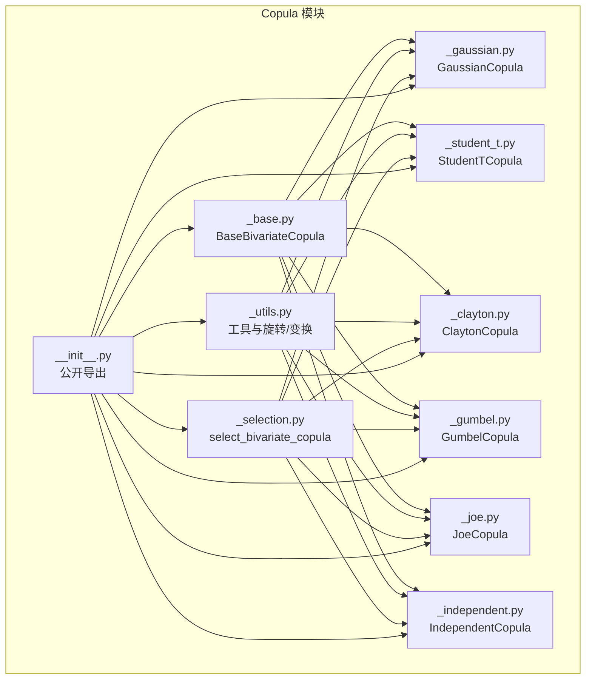
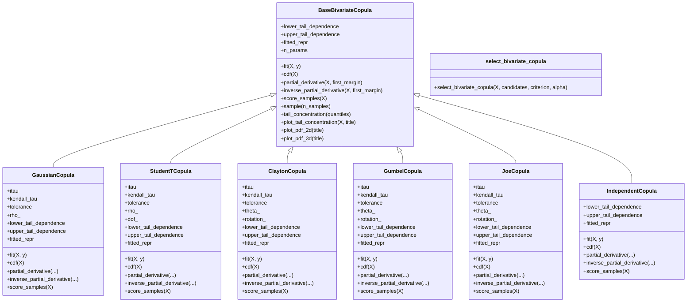
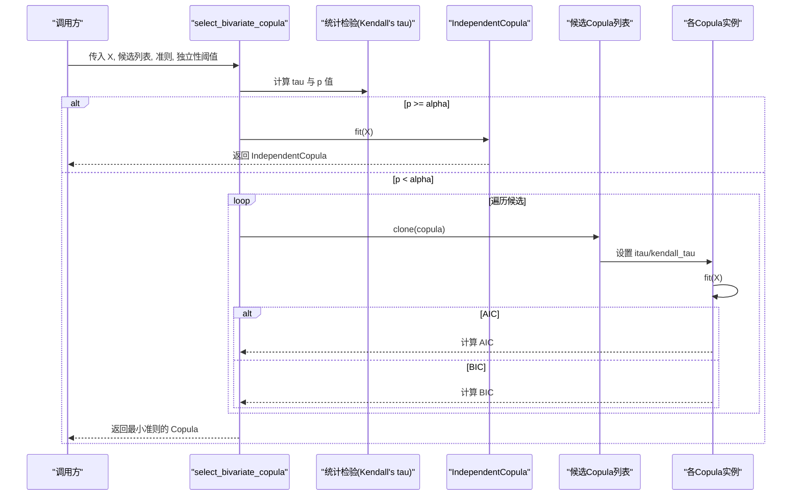
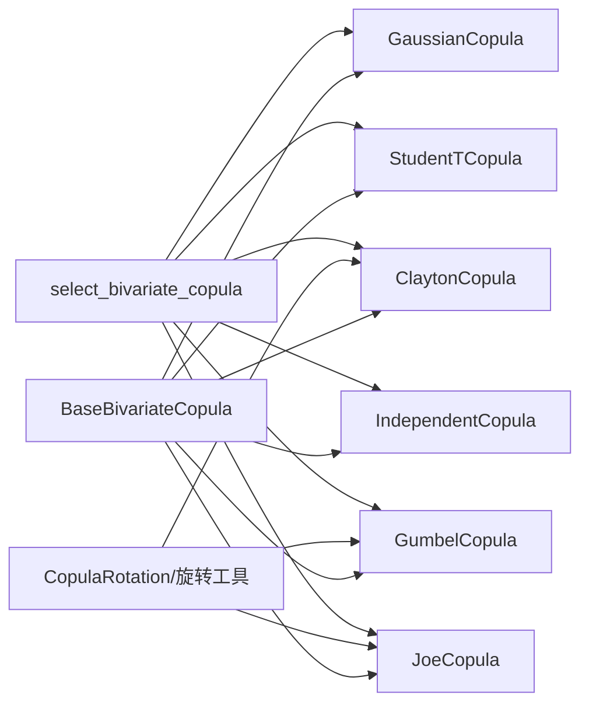

# 二元Copula API

<cite>
**本文引用的文件**
- [src/skfolio/distribution/copula/_base.py](file://src/skfolio/distribution/copula/_base.py)
- [src/skfolio/distribution/copula/_gaussian.py](file://src/skfolio/distribution/copula/_gaussian.py)
- [src/skfolio/distribution/copula/_student_t.py](file://src/skfolio/distribution/copula/_student_t.py)
- [src/skfolio/distribution/copula/_clayton.py](file://src/skfolio/distribution/copula/_clayton.py)
- [src/skfolio/distribution/copula/_gumbel.py](file://src/skfolio/distribution/copula/_gumbel.py)
- [src/skfolio/distribution/copula/_joe.py](file://src/skfolio/distribution/copula/_joe.py)
- [src/skfolio/distribution/copula/_independent.py](file://src/skfolio/distribution/copula/_independent.py)
- [src/skfolio/distribution/copula/_selection.py](file://src/skfolio/distribution/copula/_selection.py)
- [src/skfolio/distribution/copula/_utils.py](file://src/skfolio/distribution/copula/_utils.py)
- [src/skfolio/distribution/copula/__init__.py](file://src/skfolio/distribution/copula/__init__.py)
- [examples/synthetic_data/plot_1_bivariate_copulas.py](file://examples/synthetic_data/plot_1_bivariate_copulas.py)
- [tests/test_distribution/test_copula/test_selection.py](file://tests/test_distribution/test_copula/test_selection.py)
</cite>

## 目录
1. [简介](#简介)
2. [项目结构](#项目结构)
3. [核心组件](#核心组件)
4. [架构总览](#架构总览)
5. [详细组件分析](#详细组件分析)
6. [依赖关系分析](#依赖关系分析)
7. [性能与数值稳定性](#性能与数值稳定性)
8. [故障排查指南](#故障排查指南)
9. [结论](#结论)
10. [附录：常用用法与示例路径](#附录常用用法与示例路径)

## 简介
本文件为 skfolio 的二元 Copula 模块提供详尽的 API 参考文档，覆盖以下内容：
- 基类 BaseBivariateCopula 的设计原则与通用接口
- 五种二元 Copula 类（GaussianCopula、StudentTCopula、ClaytonCopula、GumbelCopula、JoeCopula）的参数、拟合方法与依赖结构建模能力
- IndependentCopula 的独立性建模
- select_bivariate_copula 函数的完整工作流程：Kendall’s tau 独立性检验、候选模型拟合、AIC/BIC 信息准则选择
- 实用工具：compute_pseudo_observations、尾部相关性可视化与尾浓度函数
- 风险分析示例：利用 Copula 密度函数进行联合风险分析，说明不同 Copula 对对称/非对称尾部依赖的刻画

## 项目结构
Copula 模块位于 distribution/copula 子包中，采用“按功能分层”的组织方式：
- 基类与通用工具：_base.py、_utils.py
- 各 Copula 实现：_gaussian.py、_student_t.py、_clayton.py、_gumbel.py、_joe.py、_independent.py
- 模型选择：_selection.py
- 公开导出：__init__.py

图表来源
- [src/skfolio/distribution/copula/_base.py](file://src/skfolio/distribution/copula/_base.py#L1-L457)
- [src/skfolio/distribution/copula/_gaussian.py](file://src/skfolio/distribution/copula/_gaussian.py#L1-L408)
- [src/skfolio/distribution/copula/_student_t.py](file://src/skfolio/distribution/copula/_student_t.py#L1-L487)
- [src/skfolio/distribution/copula/_clayton.py](file://src/skfolio/distribution/copula/_clayton.py#L1-L540)
- [src/skfolio/distribution/copula/_gumbel.py](file://src/skfolio/distribution/copula/_gumbel.py#L1-L561)
- [src/skfolio/distribution/copula/_joe.py](file://src/skfolio/distribution/copula/_joe.py#L1-L610)
- [src/skfolio/distribution/copula/_independent.py](file://src/skfolio/distribution/copula/_independent.py#L1-L197)
- [src/skfolio/distribution/copula/_selection.py](file://src/skfolio/distribution/copula/_selection.py#L1-L112)
- [src/skfolio/distribution/copula/_utils.py](file://src/skfolio/distribution/copula/_utils.py#L1-L510)
- [src/skfolio/distribution/copula/__init__.py](file://src/skfolio/distribution/copula/__init__.py#L1-L36)

章节来源
- [src/skfolio/distribution/copula/__init__.py](file://src/skfolio/distribution/copula/__init__.py#L1-L36)

## 核心组件
- BaseBivariateCopula：定义二元 Copula 的统一接口，包括输入校验、拟合、CDF、h-function 及其逆、对数似然、采样、尾浓度与可视化等。
- 各 Copula 实现类：在基类基础上实现具体参数估计、核函数与数值稳定策略。
- 工具模块：提供 CopulaRotation 枚举、伪观测值转换、尾浓度计算与可视化、旋转/边交换辅助函数、以及模型选择所需的 theta/旋转搜索。
- 模型选择器：select_bivariate_copula，封装独立性检验与 AIC/BIC 选择流程。

章节来源
- [src/skfolio/distribution/copula/_base.py](file://src/skfolio/distribution/copula/_base.py#L1-L457)
- [src/skfolio/distribution/copula/_utils.py](file://src/skfolio/distribution/copula/_utils.py#L1-L510)
- [src/skfolio/distribution/copula/_selection.py](file://src/skfolio/distribution/copula/_selection.py#L1-L112)

## 架构总览
下图展示了 Copula 模块的类层次与依赖关系，以及 select_bivariate_copula 的调用链。

图表来源
- [src/skfolio/distribution/copula/_base.py](file://src/skfolio/distribution/copula/_base.py#L1-L457)
- [src/skfolio/distribution/copula/_gaussian.py](file://src/skfolio/distribution/copula/_gaussian.py#L1-L408)
- [src/skfolio/distribution/copula/_student_t.py](file://src/skfolio/distribution/copula/_student_t.py#L1-L487)
- [src/skfolio/distribution/copula/_clayton.py](file://src/skfolio/distribution/copula/_clayton.py#L1-L540)
- [src/skfolio/distribution/copula/_gumbel.py](file://src/skfolio/distribution/copula/_gumbel.py#L1-L561)
- [src/skfolio/distribution/copula/_joe.py](file://src/skfolio/distribution/copula/_joe.py#L1-L610)
- [src/skfolio/distribution/copula/_independent.py](file://src/skfolio/distribution/copula/_independent.py#L1-L197)
- [src/skfolio/distribution/copula/_selection.py](file://src/skfolio/distribution/copula/_selection.py#L1-L112)

## 详细组件分析

### 基类：BaseBivariateCopula
- 输入校验：要求二维数组且两列，值域在 [0,1]，并进行数值边界处理避免极端值。
- 统一接口：
  - 拟合：fit
  - 分布函数：cdf
  - 条件分布导数（h-function）：partial_derivative(first_margin)
  - h-function 的逆：inverse_partial_derivative(first_margin)
  - 对数似然：score_samples
  - 随机采样：sample
  - 尾浓度函数：tail_concentration、plot_tail_concentration
  - 密度可视化：plot_pdf_2d、plot_pdf_3d
  - 属性：lower_tail_dependence、upper_tail_dependence、fitted_repr、n_params
- 设计要点：
  - 所有 Copula 实现共享同一输入格式（均匀边际伪观测值）
  - 通过抽象属性定义尾依赖系数，便于统一评估
  - 提供可视化工具，便于模型诊断与比较

章节来源
- [src/skfolio/distribution/copula/_base.py](file://src/skfolio/distribution/copula/_base.py#L1-L457)

### GaussianCopula（高斯Copula）
- 参数与估计：
  - itau：是否使用 Kendall’s tau 反演估计相关系数；否则使用最大似然估计
  - kendall_tau：可选的外部输入；tolerance：优化收敛容差
  - 获得参数 rho_ ∈ [-1, 1]
- 特性：
  - 对称依赖，无尾依赖
  - 适合对称正态或近似正态的联合分布
- 关键方法：
  - fit：支持两种估计路径（itau 或 MLE）
  - cdf/partial_derivative/inverse_partial_derivative：基于多变量正态 CDF 与解析表达式
  - score_samples：对数密度（log-pdf）

章节来源
- [src/skfolio/distribution/copula/_gaussian.py](file://src/skfolio/distribution/copula/_gaussian.py#L1-L408)

### StudentTCopula（学生t Copula）
- 参数与估计：
  - itau：是否使用 Kendall’s tau 反演估计 rho，并固定自由度；否则联合估计 rho 与自由度
  - kendall_tau：可选；tolerance：优化容差
  - 获得参数 rho_ ∈ [-1, 1] 与 dof_ > 2（限制在 [2, 50] 区间以提升稳定性）
- 特性：
  - 对称依赖，具有上下尾共同的尾依赖
  - 更能刻画极端事件的联合发生
- 关键方法：
  - fit：itau 路径与 MLE 路径
  - cdf/partial_derivative/inverse_partial_derivative：基于多变量 t 分布 CDF 与解析表达式
  - score_samples：对数密度（log-pdf）

章节来源
- [src/skfolio/distribution/copula/_student_t.py](file://src/skfolio/distribution/copula/_student_t.py#L1-L487)

### ClaytonCopula（Clayton Copula）
- 参数与估计：
  - itau：是否使用 Kendall’s tau 反演估计 theta；否则使用 MLE
  - kendall_tau：可选；tolerance：优化容差
  - 获得参数 theta_ > 0 与最优旋转 rotation_ ∈ {0°, 90°, 180°, 270°}
- 特性：
  - 天然捕获下尾依赖，上尾依赖为零
  - 通过旋转可适配不同尾行为
- 关键方法：
  - fit：itau 路径（含旋转选择）与 MLE 路径（含旋转搜索）
  - cdf/partial_derivative/inverse_partial_derivative：基于旋转后的解析表达式
  - score_samples：对数密度（log-pdf）

章节来源
- [src/skfolio/distribution/copula/_clayton.py](file://src/skfolio/distribution/copula/_clayton.py#L1-L540)
- [src/skfolio/distribution/copula/_utils.py](file://src/skfolio/distribution/copula/_utils.py#L1-L510)

### GumbelCopula（Gumbel Copula）
- 参数与估计：
  - itau：是否使用 Kendall’s tau 反演估计 theta；否则使用 MLE
  - kendall_tau：可选；tolerance：优化容差
  - 获得参数 theta_ ≥ 1 与最优旋转 rotation_
- 特性：
  - 天然捕获上尾依赖，下尾依赖为零
  - 通过旋转可适配不同尾行为
- 关键方法：
  - fit：itau 路径（含旋转选择）与 MLE 路径（含旋转搜索）
  - cdf/partial_derivative/inverse_partial_derivative：基于旋转后的解析表达式
  - score_samples：对数密度（log-pdf）

章节来源
- [src/skfolio/distribution/copula/_gumbel.py](file://src/skfolio/distribution/copula/_gumbel.py#L1-L561)
- [src/skfolio/distribution/copula/_utils.py](file://src/skfolio/distribution/copula/_utils.py#L1-L510)

### JoeCopula（Joe Copula）
- 参数与估计：
  - itau：是否使用 Kendall’s tau 反演估计 theta；否则使用 MLE
  - kendall_tau：可选；tolerance：优化容差
  - 获得参数 theta_ ≥ 1 与最优旋转 rotation_
- 特性：
  - 天然捕获上尾依赖，下尾依赖为零
  - 上尾依赖通常强于 Gumbel
- 关键方法：
  - fit：itau 路径（含旋转选择）与 MLE 路径（含旋转搜索）
  - cdf/partial_derivative/inverse_partial_derivative：基于旋转后的解析表达式
  - score_samples：对数密度（log-pdf）

章节来源
- [src/skfolio/distribution/copula/_joe.py](file://src/skfolio/distribution/copula/_joe.py#L1-L610)
- [src/skfolio/distribution/copula/_utils.py](file://src/skfolio/distribution/copula/_utils.py#L1-L510)

### IndependentCopula（独立Copula）
- 参数与估计：
  - 无参数，fit 仅为兼容性占位
- 特性：
  - 下尾依赖 = 上尾依赖 = 0
  - 作为独立性检验的备选模型
- 关键方法：
  - cdf(X) = u·v
  - partial_derivative/inverse_partial_derivative：直接由边缘变量给出
  - score_samples：恒为 0（log(1)）

章节来源
- [src/skfolio/distribution/copula/_independent.py](file://src/skfolio/distribution/copula/_independent.py#L1-L197)

### select_bivariate_copula 函数
- 功能概述：
  - 使用 Kendall’s tau 独立性检验判断两变量是否独立
  - 若独立，则返回 IndependentCopula
  - 否则对候选 Copula 列表进行拟合并计算 AIC/BIC，返回最小者
- 关键步骤：
  1) 输入校验与形状检查
  2) 计算 Kendall’s tau 与 p 值
  3) 若 p ≥ independence_level，返回 IndependentCopula
  4) 否则克隆候选模型，复用 itau 时的 tau 值，拟合并计算 AIC/BIC
  5) 返回最小准则对应的模型
- 注意事项：
  - 默认候选集包含 GaussianCopula、StudentTCopula、ClaytonCopula、GumbelCopula、JoeCopula
  - 支持 SelectionCriterion.AIC 与 SelectionCriterion.BIC

图表来源
- [src/skfolio/distribution/copula/_selection.py](file://src/skfolio/distribution/copula/_selection.py#L1-L112)
- [src/skfolio/distribution/copula/_independent.py](file://src/skfolio/distribution/copula/_independent.py#L1-L197)

章节来源
- [src/skfolio/distribution/copula/_selection.py](file://src/skfolio/distribution/copula/_selection.py#L1-L112)
- [tests/test_distribution/test_copula/test_selection.py](file://tests/test_distribution/test_copula/test_selection.py#L1-L47)

### 实用工具与可视化
- compute_pseudo_observations：将原始数据转换为均匀边际的伪观测值（(0,1) 区间），用于 Copula 建模
- 尾浓度函数与可视化：
  - tail_concentration：计算给定分位点的尾浓度
  - plot_tail_concentration：绘制模型尾浓度曲线，可叠加经验尾浓度
  - empirical_tail_concentration：从样本计算经验尾浓度
- CopulaRotation 枚举与旋转工具：
  - CopulaRotation：0°、90°、180°、270°
  - 旋转应用与边交换：_apply_copula_rotation、_apply_margin_swap
  - 旋转后的 CDF 与 h-function 计算：_apply_rotation_cdf、_apply_rotation_partial_derivatives
  - 旋转选择辅助：_select_rotation_itau、_select_theta_and_rotation_mle

章节来源
- [src/skfolio/distribution/copula/_utils.py](file://src/skfolio/distribution/copula/_utils.py#L1-L510)
- [src/skfolio/distribution/copula/_base.py](file://src/skfolio/distribution/copula/_base.py#L1-L457)

## 依赖关系分析
- Copula 实现均继承自 BaseBivariateCopula，共享输入校验、评分与可视化接口
- Archimedean Copulas（Clayton/Gumbel/Joe）依赖 _utils 中的 CopulaRotation 与旋转工具
- StudentTCopula 在 fit 过程中对自由度施加区间约束，确保数值稳定
- select_bivariate_copula 依赖 scipy.stats.kendalltau 与 sklearn.base.clone

图表来源
- [src/skfolio/distribution/copula/_base.py](file://src/skfolio/distribution/copula/_base.py#L1-L457)
- [src/skfolio/distribution/copula/_gaussian.py](file://src/skfolio/distribution/copula/_gaussian.py#L1-L408)
- [src/skfolio/distribution/copula/_student_t.py](file://src/skfolio/distribution/copula/_student_t.py#L1-L487)
- [src/skfolio/distribution/copula/_clayton.py](file://src/skfolio/distribution/copula/_clayton.py#L1-L540)
- [src/skfolio/distribution/copula/_gumbel.py](file://src/skfolio/distribution/copula/_gumbel.py#L1-L561)
- [src/skfolio/distribution/copula/_joe.py](file://src/skfolio/distribution/copula/_joe.py#L1-L610)
- [src/skfolio/distribution/copula/_independent.py](file://src/skfolio/distribution/copula/_independent.py#L1-L197)
- [src/skfolio/distribution/copula/_utils.py](file://src/skfolio/distribution/copula/_utils.py#L1-L510)
- [src/skfolio/distribution/copula/_selection.py](file://src/skfolio/distribution/copula/_selection.py#L1-L112)

## 性能与数值稳定性
- 优化与收敛：
  - GaussianCopula：MLE 使用 scipy.optimize.minimize_scalar，设置收敛容差 tolerance
  - StudentTCopula：itau 路径固定自由度，仅优化 rho；MLE 路径使用 L-BFGS-B 并施加参数边界
  - Clayton/Gumbel/Joe：itau 路径使用理论 tau-θ 映射；MLE 路径对 theta 与旋转进行网格搜索并最小化负对数似然
- 数值稳定：
  - 对齐到 (ε, 1-ε) 区间，避免极端值导致的数值问题
  - StudentTCopula 自由度限制在 [2, 50]，避免过度重尾
  - log-space 计算（如 JoeCopula 的对数变换）提升稳定性
- 可视化：
  - 密度图限制到前 97% 分位，避免极端密度稀释图像

章节来源
- [src/skfolio/distribution/copula/_gaussian.py](file://src/skfolio/distribution/copula/_gaussian.py#L1-L408)
- [src/skfolio/distribution/copula/_student_t.py](file://src/skfolio/distribution/copula/_student_t.py#L1-L487)
- [src/skfolio/distribution/copula/_clayton.py](file://src/skfolio/distribution/copula/_clayton.py#L1-L540)
- [src/skfolio/distribution/copula/_gumbel.py](file://src/skfolio/distribution/copula/_gumbel.py#L1-L561)
- [src/skfolio/distribution/copula/_joe.py](file://src/skfolio/distribution/copula/_joe.py#L1-L610)
- [src/skfolio/distribution/copula/_base.py](file://src/skfolio/distribution/copula/_base.py#L1-L457)

## 故障排查指南
- 输入错误：
  - X 不是二维或列数不为 2：抛出 ValueError
  - X 值不在 [0,1]：抛出 ValueError；建议先用 compute_pseudo_observations 转换
- 参数范围：
  - GaussianCopula：rho 必须在 [-1,1]；StudentTCopula：rho ∈ [-1,1]，dof ∈ [2,50]
  - Clayton/Gumbel/Joe：theta 需满足各自下界（Clayton > 0，Gumbel/ Joe > 1）
- 优化失败：
  - StudentTCopula/MLE：若所有旋转优化失败，抛出 RuntimeError
  - Clayton/Gumbel/Joe：itau 路径若理论映射越界，会裁剪到允许范围
- 独立性检验：
  - 若 p ≥ independence_level，默认返回 IndependentCopula；可调整显著性水平

章节来源
- [src/skfolio/distribution/copula/_base.py](file://src/skfolio/distribution/copula/_base.py#L1-L457)
- [src/skfolio/distribution/copula/_gaussian.py](file://src/skfolio/distribution/copula/_gaussian.py#L1-L408)
- [src/skfolio/distribution/copula/_student_t.py](file://src/skfolio/distribution/copula/_student_t.py#L1-L487)
- [src/skfolio/distribution/copula/_clayton.py](file://src/skfolio/distribution/copula/_clayton.py#L1-L540)
- [src/skfolio/distribution/copula/_gumbel.py](file://src/skfolio/distribution/copula/_gumbel.py#L1-L561)
- [src/skfolio/distribution/copula/_joe.py](file://src/skfolio/distribution/copula/_joe.py#L1-L610)
- [src/skfolio/distribution/copula/_selection.py](file://src/skfolio/distribution/copula/_selection.py#L1-L112)

## 结论
skfolio 的二元 Copula 模块提供了统一的建模框架与丰富的 Copula 家族实现，能够有效刻画对称与非对称尾部依赖。通过 select_bivariate_copula，用户可以基于统计检验与信息准则自动选择最优模型；配合伪观测值转换与尾浓度可视化，可完成从数据预处理到模型诊断的完整工作流。

## 附录：常用用法与示例路径
- 计算伪观测值
  - 示例路径：[examples/synthetic_data/plot_1_bivariate_copulas.py](file://examples/synthetic_data/plot_1_bivariate_copulas.py#L140-L160)
  - 工具函数：[src/skfolio/distribution/copula/_utils.py](file://src/skfolio/distribution/copula/_utils.py#L52-L84)
- 可视化尾部相关性
  - 示例路径：[examples/synthetic_data/plot_1_bivariate_copulas.py](file://examples/synthetic_data/plot_1_bivariate_copulas.py#L220-L230)
  - 工具函数：[src/skfolio/distribution/copula/_base.py](file://src/skfolio/distribution/copula/_base.py#L317-L376)
- 利用 Copula 密度函数进行联合风险分析
  - 示例路径：[examples/synthetic_data/plot_1_bivariate_copulas.py](file://examples/synthetic_data/plot_1_bivariate_copulas.py#L160-L188)
  - 方法：使用 score_samples 计算 log-pdf，结合可视化函数观察密度分布
- 模型选择流程
  - 示例路径：[examples/synthetic_data/plot_1_bivariate_copulas.py](file://examples/synthetic_data/plot_1_bivariate_copulas.py#L148-L160)
  - 函数：[src/skfolio/distribution/copula/_selection.py](file://src/skfolio/distribution/copula/_selection.py#L1-L112)
  - 单元测试验证：[tests/test_distribution/test_copula/test_selection.py](file://tests/test_distribution/test_copula/test_selection.py#L1-L47)