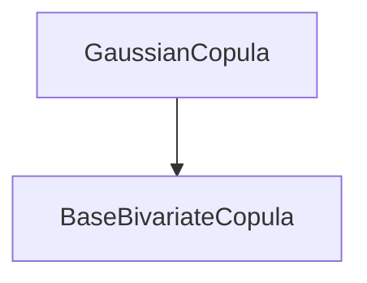
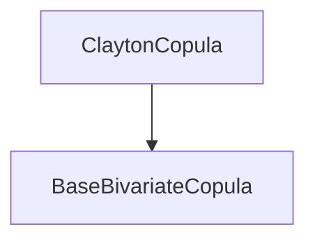
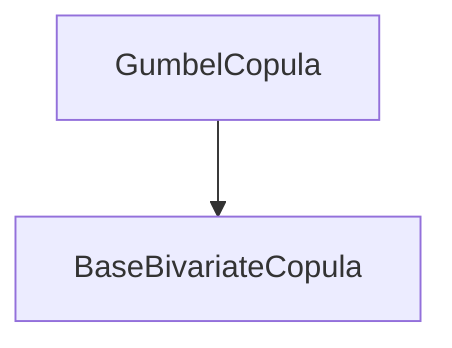
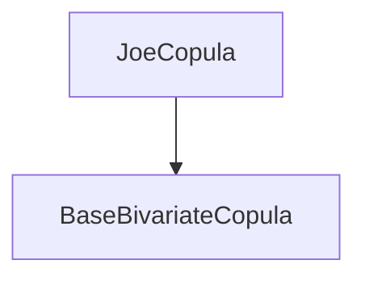
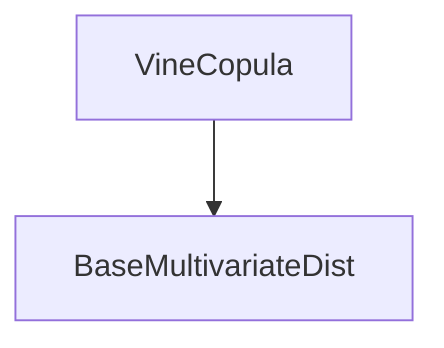

# 分布模块API

<cite>
**本文档中引用的文件**   
- [__init__.py](file://src/skfolio/distribution/__init__.py)
- [_base.py](file://src/skfolio/distribution/_base.py)
- [univariate/__init__.py](file://src/skfolio/distribution/univariate/__init__.py)
- [univariate/_base.py](file://src/skfolio/distribution/univariate/_base.py)
- [univariate/_gaussian.py](file://src/skfolio/distribution/univariate/_gaussian.py)
- [univariate/_johnson_su.py](file://src/skfolio/distribution/univariate/_johnson_su.py)
- [univariate/_student_t.py](file://src/skfolio/distribution/univariate/_student_t.py)
- [univariate/_normal_inverse_gaussian.py](file://src/skfolio/distribution/univariate/_normal_inverse_gaussian.py)
- [copula/__init__.py](file://src/skfolio/distribution/copula/__init__.py)
- [copula/_base.py](file://src/skfolio/distribution/copula/_base.py)
- [copula/_gaussian.py](file://src/skfolio/distribution/copula/_gaussian.py)
- [copula/_clayton.py](file://src/skfolio/distribution/copula/_clayton.py)
- [copula/_gumbel.py](file://src/skfolio/distribution/copula/_gumbel.py)
- [copula/_joe.py](file://src/skfolio/distribution/copula/_joe.py)
- [copula/_student_t.py](file://src/skfolio/distribution/copula/_student_t.py)
- [multivariate/__init__.py](file://src/skfolio/distribution/multivariate/__init__.py)
- [multivariate/_vine_copula.py](file://src/skfolio/distribution/multivariate/_vine_copula.py)
- [copula/_selection.py](file://src/skfolio/distribution/copula/_selection.py)
- [univariate/_selection.py](file://src/skfolio/distribution/univariate/_selection.py)
</cite>

## 目录
1. [简介](#简介)
2. [单变量分布](#单变量分布)
3. [二元Copula](#二元copula)
4. [模型选择函数](#模型选择函数)
5. [Vine Copula](#vine-copula)
6. [代码示例](#代码示例)

## 简介
skfolio的distribution模块提供了用于金融时间序列建模的统计分布和依赖结构工具。该模块包含单变量分布（如高斯、学生t、Johnson SU等）和二元Copula（如高斯Copula、Clayton Copula等）的实现，以及用于选择最佳分布和Copula模型的函数。Vine Copula用于构建高维依赖结构。该模块在生成合成数据和压力测试中具有重要应用。

## 单变量分布
单变量分布类用于拟合和分析单个金融资产的收益率分布。所有单变量分布都继承自`BaseUnivariateDist`类，并实现了scikit-learn的API。

### 高斯分布 (Gaussian)
高斯分布（正态分布）是最常用的分布模型，适用于对称且尾部较薄的金融数据。

**Section sources**
- [univariate/_gaussian.py](file://src/skfolio/distribution/univariate/_gaussian.py)

### Johnson SU分布 (JohnsonSU)
Johnson SU分布是一种灵活的分布，能够捕捉偏度和厚尾特征，适用于金融时间序列建模。

**Section sources**
- [univariate/_johnson_su.py](file://src/skfolio/distribution/univariate/_johnson_su.py)

### 学生t分布 (StudentT)
学生t分布具有较厚的尾部，能够更好地捕捉金融数据中的极端事件。

**Section sources**
- [univariate/_student_t.py](file://src/skfolio/distribution/univariate/_student_t.py)

### 正态逆高斯分布 (NormalInverseGaussian)
正态逆高斯分布是一种灵活的分布，能够捕捉偏度和厚尾特征，适用于金融时间序列建模。

**Section sources**
- [univariate/_normal_inverse_gaussian.py](file://src/skfolio/distribution/univariate/_normal_inverse_gaussian.py)

## 二元Copula
二元Copula类用于建模两个金融资产之间的依赖结构。所有二元Copula都继承自`BaseBivariateCopula`类，并实现了scikit-learn的API。

### 高斯Copula (GaussianCopula)
高斯Copula基于多元正态分布，适用于对称依赖结构，但不具有尾部依赖性。



**Diagram sources**
- [copula/_gaussian.py](file://src/skfolio/distribution/copula/_gaussian.py)

**Section sources**
- [copula/_gaussian.py](file://src/skfolio/distribution/copula/_gaussian.py)

### Clayton Copula
Clayton Copula具有较强的下尾依赖性，适用于建模同时发生极端损失的情况。



**Diagram sources**
- [copula/_clayton.py](file://src/skfolio/distribution/copula/_clayton.py)

**Section sources**
- [copula/_clayton.py](file://src/skfolio/distribution/copula/_clayton.py)

### Gumbel Copula
Gumbel Copula具有较强的上尾依赖性，适用于建模同时发生极端收益的情况。



**Diagram sources**
- [copula/_gumbel.py](file://src/skfolio/distribution/copula/_gumbel.py)

**Section sources**
- [copula/_gumbel.py](file://src/skfolio/distribution/copula/_gumbel.py)

### Joe Copula
Joe Copula具有较强的上尾依赖性，通常比Gumbel Copula表现出更强的上尾依赖性。



**Diagram sources**
- [copula/_joe.py](file://src/skfolio/distribution/copula/_joe.py)

**Section sources**
- [copula/_joe.py](file://src/skfolio/distribution/copula/_joe.py)

## 模型选择函数
该模块提供了用于选择最佳单变量分布和二元Copula模型的函数。

### select_univariate_dist
该函数用于选择最佳的单变量分布模型。它通过比较不同分布模型的AIC或BIC值来选择最优模型。

**Section sources**
- [univariate/_selection.py](file://src/skfolio/distribution/univariate/_selection.py)

### select_bivariate_copula
该函数用于选择最佳的二元Copula模型。它通过比较不同Copula模型的AIC或BIC值来选择最优模型。

**Section sources**
- [copula/_selection.py](file://src/skfolio/distribution/copula/_selection.py)

## Vine Copula
Vine Copula是一种用于构建高维依赖结构的灵活方法。它通过将高维Copula分解为一系列二元Copula来实现。

### VineCopula
VineCopula类实现了R-vine结构，能够灵活地建模高维依赖结构。



**Diagram sources**
- [multivariate/_vine_copula.py](file://src/skfolio/distribution/multivariate/_vine_copula.py)

**Section sources**
- [multivariate/_vine_copula.py](file://src/skfolio/distribution/multivariate/_vine_copula.py)

## 代码示例
以下代码示例展示了如何使用该模块进行分布拟合、生成伪观测值和可视化尾部相关性。

### 拟合单变量分布
```python
from skfolio.distribution.univariate import Gaussian, JohnsonSU, StudentT, select_univariate_dist
from skfolio.datasets import load_sp500_index
from skfolio.preprocessing import prices_to_returns

# 加载历史价格并转换为收益率
prices = load_sp500_index()
X = prices_to_returns(prices)

# 拟合不同的单变量分布
gaussian = Gaussian().fit(X)
johnson_su = JohnsonSU().fit(X)
student_t = StudentT().fit(X)

# 选择最佳分布
best_dist = select_univariate_dist([gaussian, johnson_su, student_t], X, criterion="AIC")
```

### 生成伪观测值和拟合二元Copula
```python
from skfolio.distribution import GaussianCopula, ClaytonCopula, select_bivariate_copula, compute_pseudo_observations
from skfolio.datasets import load_sp500_dataset
from skfolio.preprocessing import prices_to_returns

# 加载历史价格并转换为收益率
prices = load_sp500_dataset()
X = prices_to_returns(prices)
X = X[["AAPL", "JPM"]]

# 转换为伪观测值
X_pseudo = compute_pseudo_observations(X)

# 拟合不同的二元Copula
gaussian_copula = GaussianCopula().fit(X_pseudo)
clayton_copula = ClaytonCopula().fit(X_pseudo)

# 选择最佳Copula
best_copula = select_bivariate_copula([gaussian_copula, clayton_copula], X_pseudo, criterion="AIC")
```

### 可视化尾部相关性
```python
# 绘制尾部集中函数
fig = best_copula.plot_tail_concentration(X_pseudo)
fig.show()

# 绘制PDF的2D轮廓
fig = best_copula.plot_pdf_2d()
fig.show()

# 绘制PDF的3D曲面
fig = best_copula.plot_pdf_3d()
fig.show()
```

### 构建Vine Copula
```python
from skfolio.distribution.multivariate import VineCopula
from skfolio.distribution.copula import GaussianCopula, ClaytonCopula

# 构建Vine Copula
vine_copula = VineCopula(
    copulas=[GaussianCopula(), ClaytonCopula()],
    structure=[[0, 1], [1, 2]]
).fit(X_pseudo)
```

**Section sources**
- [univariate/_gaussian.py](file://src/skfolio/distribution/univariate/_gaussian.py)
- [univariate/_johnson_su.py](file://src/skfolio/distribution/univariate/_johnson_su.py)
- [univariate/_student_t.py](file://src/skfolio/distribution/univariate/_student_t.py)
- [univariate/_selection.py](file://src/skfolio/distribution/univariate/_selection.py)
- [copula/_gaussian.py](file://src/skfolio/distribution/copula/_gaussian.py)
- [copula/_clayton.py](file://src/skfolio/distribution/copula/_clayton.py)
- [copula/_selection.py](file://src/skfolio/distribution/copula/_selection.py)
- [multivariate/_vine_copula.py](file://src/skfolio/distribution/multivariate/_vine_copula.py)