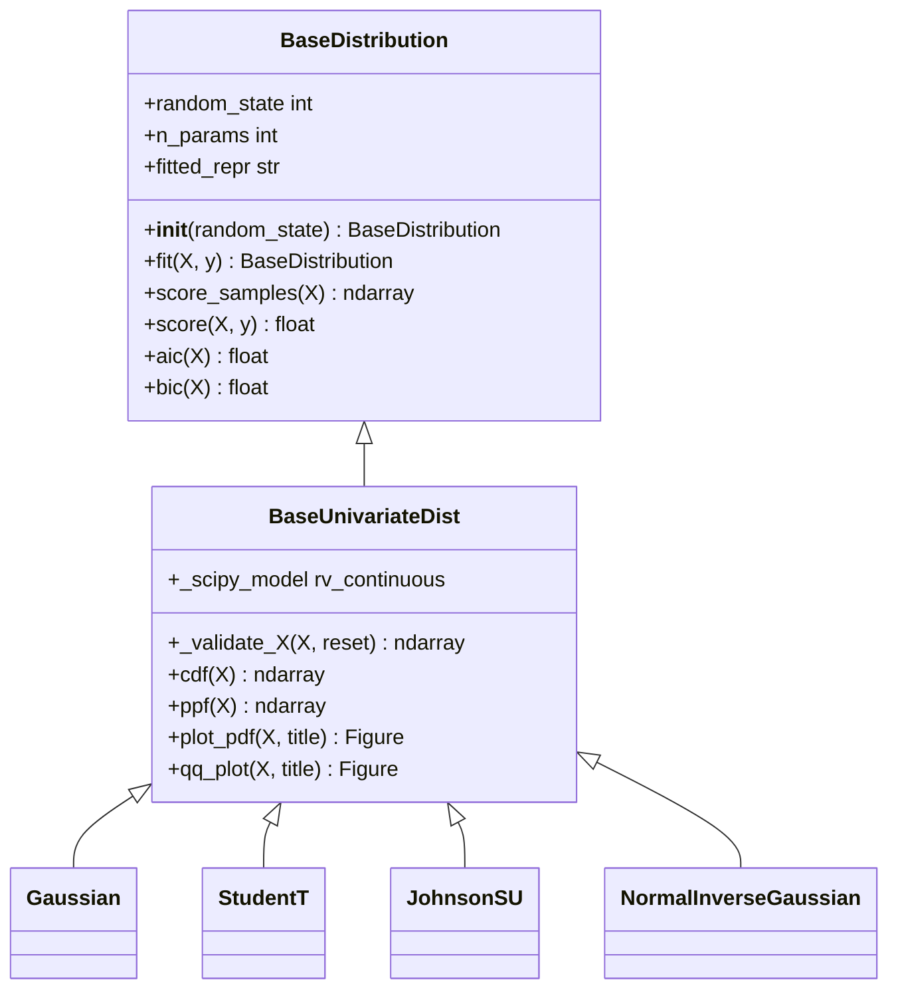
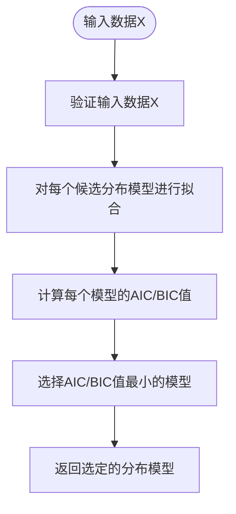

# 单变量分布API

<cite>
**本文档中引用的文件**  
- [src/skfolio/distribution/univariate/_base.py](file://src/skfolio/distribution/univariate/_base.py)
- [src/skfolio/distribution/univariate/_gaussian.py](file://src/skfolio/distribution/univariate/_gaussian.py)
- [src/skfolio/distribution/univariate/_student_t.py](file://src/skfolio/distribution/univariate/_student_t.py)
- [src/skfolio/distribution/univariate/_johnson_su.py](file://src/skfolio/distribution/univariate/_johnson_su.py)
- [src/skfolio/distribution/univariate/_normal_inverse_gaussian.py](file://src/skfolio/distribution/univariate/_normal_inverse_gaussian.py)
- [src/skfolio/distribution/univariate/_selection.py](file://src/skfolio/distribution/univariate/_selection.py)
- [src/skfolio/distribution/_base.py](file://src/skfolio/distribution/_base.py)
- [src/skfolio/distribution/__init__.py](file://src/skfolio/distribution/__init__.py)
</cite>

## 目录
1. [简介](#简介)
2. [核心组件](#核心组件)
3. [基类设计模式](#基类设计模式)
4. [单变量分布类详解](#单变量分布类详解)
5. [模型选择函数](#模型选择函数)
6. [应用场景与代码示例](#应用场景与代码示例)
7. [尾部风险刻画能力比较](#尾部风险刻画能力比较)

## 简介
skfolio的单变量分布模块提供了一套完整的工具，用于对金融资产收益率等一维数据进行概率分布建模。该模块基于scipy统计库，实现了多种适用于金融时间序列的分布模型，并通过scikit-learn兼容的API设计，使得分布拟合、参数估计、对数似然计算和随机抽样等操作变得简单而一致。本API参考文档详细介绍了Gaussian、StudentT、JohnsonSU和NormalInverseGaussian等单变量分布类的核心功能，以及select_univariate_dist模型选择函数的工作机制。

## 核心组件
单变量分布模块的核心组件包括BaseUnivariateDist基类、四种具体的分布实现类（Gaussian、StudentT、JohnsonSU、NormalInverseGaussian）以及select_univariate_dist模型选择函数。这些组件共同构成了一个灵活且强大的分布建模框架，能够适应不同特性的金融数据。

**Section sources**
- [src/skfolio/distribution/univariate/_base.py](file://src/skfolio/distribution/univariate/_base.py)
- [src/skfolio/distribution/univariate/_gaussian.py](file://src/skfolio/distribution/univariate/_gaussian.py)
- [src/skfolio/distribution/univariate/_student_t.py](file://src/skfolio/distribution/univariate/_student_t.py)
- [src/skfolio/distribution/univariate/_johnson_su.py](file://src/skfolio/distribution/univariate/_johnson_su.py)
- [src/skfolio/distribution/univariate/_normal_inverse_gaussian.py](file://src/skfolio/distribution/univariate/_normal_inverse_gaussian.py)
- [src/skfolio/distribution/univariate/_selection.py](file://src/skfolio/distribution/univariate/_selection.py)

## 基类设计模式
BaseUnivariateDist基类继承自scikit-learn的BaseEstimator和ABC（抽象基类），为所有单变量分布模型提供了统一的接口和基础功能。该基类的设计模式确保了与scikit-learn生态系统的无缝集成，使得这些分布模型可以像其他scikit-learn估计器一样被使用。



**Diagram sources**
- [src/skfolio/distribution/_base.py](file://src/skfolio/distribution/_base.py)
- [src/skfolio/distribution/univariate/_base.py](file://src/skfolio/distribution/univariate/_base.py)

**Section sources**
- [src/skfolio/distribution/_base.py](file://src/skfolio/distribution/_base.py)
- [src/skfolio/distribution/univariate/_base.py](file://src/skfolio/distribution/univariate/_base.py)

## 单变量分布类详解
本节详细介绍了四种单变量分布类的参数、拟合方法、对数似然计算和随机抽样功能。

### Gaussian分布
Gaussian类实现了标准正态分布的估计。其概率密度函数为f(x) = exp(-x²/2)/√(2π)。通过loc和scale参数可以对分布进行平移和缩放。

**Section sources**
- [src/skfolio/distribution/univariate/_gaussian.py](file://src/skfolio/distribution/univariate/_gaussian.py)

### StudentT分布
StudentT类实现了学生t分布的估计。该分布具有较厚的尾部，能够更好地捕捉金融数据中的极端事件。其自由度参数dof_控制尾部厚度。

**Section sources**
- [src/skfolio/distribution/univariate/_student_t.py](file://src/skfolio/distribution/univariate/_student_t.py)

### JohnsonSU分布
JohnsonSU类实现了Johnson SU分布的估计。该分布非常灵活，能够同时捕捉偏度和厚尾特性，特别适合金融时间序列建模。

**Section sources**
- [src/skfolio/distribution/univariate/_johnson_su.py](file://src/skfolio/distribution/univariate/_johnson_su.py)

### NormalInverseGaussian分布
NormalInverseGaussian类实现了正态逆高斯分布的估计。该分布由尾部厚度参数a_和不对称参数b_控制，能够灵活地刻画金融数据的分布特征。

**Section sources**
- [src/skfolio/distribution/univariate/_normal_inverse_gaussian.py](file://src/skfolio/distribution/univariate/_normal_inverse_gaussian.py)

## 模型选择函数
select_univariate_dist函数实现了基于信息准则的模型选择机制。该函数通过比较候选分布模型的AIC或BIC值，选择最优的分布模型。



**Diagram sources**
- [src/skfolio/distribution/univariate/_selection.py](file://src/skfolio/distribution/univariate/_selection.py)

**Section sources**
- [src/skfolio/distribution/univariate/_selection.py](file://src/skfolio/distribution/univariate/_selection.py)

## 应用场景与代码示例
以下代码示例展示了如何使用这些分布进行资产收益率建模、分布拟合优度评估以及合成数据生成。

```python
from skfolio.datasets import load_sp500_index
from skfolio.preprocessing import prices_to_returns
from skfolio.distribution.univariate import Gaussian, StudentT, JohnsonSU, select_univariate_dist

# 加载历史价格并转换为收益率
prices = load_sp500_index()
X = prices_to_returns(prices)

# 使用select_univariate_dist选择最优分布模型
selected_dist = select_univariate_dist(X, selection_criterion="AIC")

# 输出选定的分布模型
print(f"选定的分布模型: {selected_dist.fitted_repr}")

# 生成5个新样本
samples = selected_dist.sample(n_samples=5)

# 绘制概率密度函数图
fig = selected_dist.plot_pdf(X)
fig.show()
```

**Section sources**
- [src/skfolio/distribution/univariate/_gaussian.py](file://src/skfolio/distribution/univariate/_gaussian.py)
- [src/skfolio/distribution/univariate/_student_t.py](file://src/skfolio/distribution/univariate/_student_t.py)
- [src/skfolio/distribution/univariate/_johnson_su.py](file://src/skfolio/distribution/univariate/_johnson_su.py)
- [src/skfolio/distribution/univariate/_selection.py](file://src/skfolio/distribution/univariate/_selection.py)

## 尾部风险刻画能力比较
不同的分布模型在刻画尾部风险方面具有不同的能力。Gaussian分布假设尾部较薄，可能低估极端事件的风险；StudentT分布通过自由度参数能够更好地捕捉厚尾特性；JohnsonSU和NormalInverseGaussian分布则提供了更大的灵活性，能够同时刻画偏度和厚尾，更适合复杂的金融数据。

**Section sources**
- [src/skfolio/distribution/univariate/_gaussian.py](file://src/skfolio/distribution/univariate/_gaussian.py)
- [src/skfolio/distribution/univariate/_student_t.py](file://src/skfolio/distribution/univariate/_student_t.py)
- [src/skfolio/distribution/univariate/_johnson_su.py](file://src/skfolio/distribution/univariate/_johnson_su.py)
- [src/skfolio/distribution/univariate/_normal_inverse_gaussian.py](file://src/skfolio/distribution/univariate/_normal_inverse_gaussian.py)