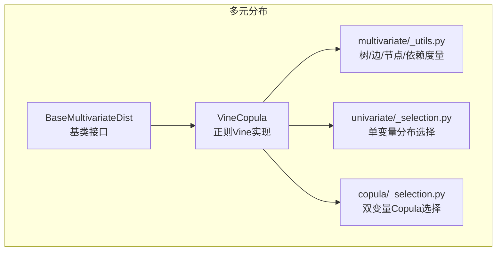
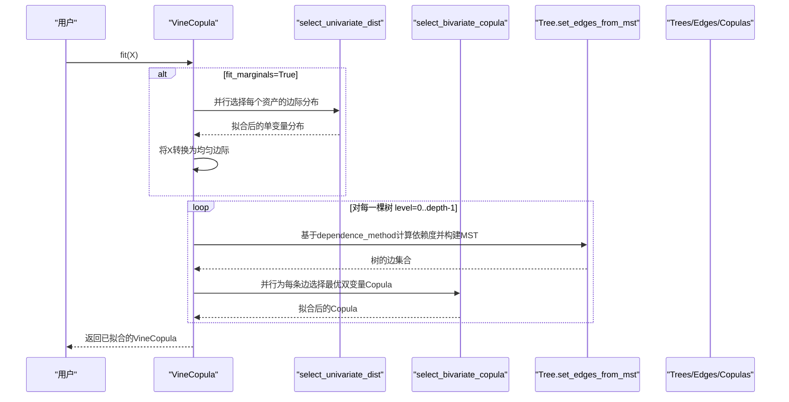
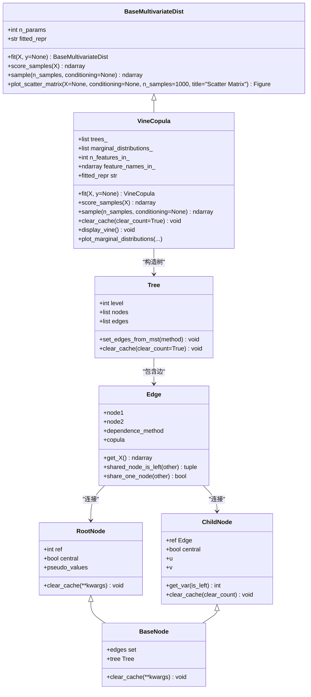
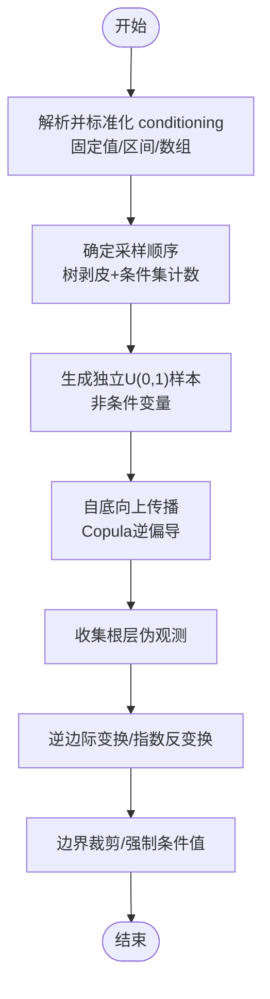
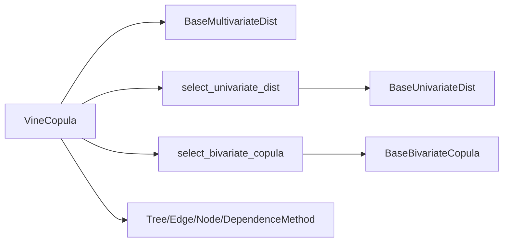

# 多元分布API

<cite>
**本文引用的文件**
- [src/skfolio/distribution/multivariate/_base.py](file://src/skfolio/distribution/multivariate/_base.py)
- [src/skfolio/distribution/multivariate/_vine_copula.py](file://src/skfolio/distribution/multivariate/_vine_copula.py)
- [src/skfolio/distribution/multivariate/_utils.py](file://src/skfolio/distribution/multivariate/_utils.py)
- [src/skfolio/distribution/copula/_selection.py](file://src/skfolio/distribution/copula/_selection.py)
- [src/skfolio/distribution/univariate/_selection.py](file://src/skfolio/distribution/univariate/_selection.py)
- [examples/synthetic_data/plot_2_vine_copula.py](file://examples/synthetic_data/plot_2_vine_copula.py)
- [tests/test_distribution/test_multivariate/test_vine_copula.py](file://tests/test_distribution/test_multivariate/test_vine_copula.py)
</cite>

## 目录
1. [简介](#简介)
2. [项目结构](#项目结构)
3. [核心组件](#核心组件)
4. [架构总览](#架构总览)
5. [详细组件分析](#详细组件分析)
6. [依赖关系分析](#依赖关系分析)
7. [性能考量](#性能考量)
8. [故障排查指南](#故障排查指南)
9. [结论](#结论)
10. [附录](#附录)

## 简介
本文件为 skfolio 的多元分布模块提供详尽的 API 参考与实现解析，重点覆盖：
- VineCopula 类的 Pair-Copula Construction（PCC）实现机制与高维依赖建模流程
- 支持的 dependence_method（Kendall_tau、Mutual_information、Wasserstein_distance）及其对建模灵活性与树构造的影响
- BaseMultivariateDist 基类的通用接口与扩展点
- 使用示例：多资产组合联合分布建模、高维合成数据生成用于压力测试、系统性风险传导路径分析与尾部风险评估

## 项目结构
多元分布模块位于 distribution/multivariate 子目录，包含：
- 基类接口定义：BaseMultivariateDist
- 具体实现：VineCopula
- 树结构与图论工具：_utils（DependenceMethod、Tree、Edge、Node 等）
- 辅助选择器：univariate/_selection.py、copula/_selection.py

图表来源
- [src/skfolio/distribution/multivariate/_base.py](file://src/skfolio/distribution/multivariate/_base.py#L1-L242)
- [src/skfolio/distribution/multivariate/_vine_copula.py](file://src/skfolio/distribution/multivariate/_vine_copula.py#L1-L200)
- [src/skfolio/distribution/multivariate/_utils.py](file://src/skfolio/distribution/multivariate/_utils.py#L1-L120)
- [src/skfolio/distribution/univariate/_selection.py](file://src/skfolio/distribution/univariate/_selection.py#L1-L86)
- [src/skfolio/distribution/copula/_selection.py](file://src/skfolio/distribution/copula/_selection.py#L1-L112)

章节来源
- [src/skfolio/distribution/multivariate/_base.py](file://src/skfolio/distribution/multivariate/_base.py#L1-L242)
- [src/skfolio/distribution/multivariate/_vine_copula.py](file://src/skfolio/distribution/multivariate/_vine_copula.py#L1-L200)
- [src/skfolio/distribution/multivariate/_utils.py](file://src/skfolio/distribution/multivariate/_utils.py#L1-L120)

## 核心组件
- BaseMultivariateDist：定义多变量分布估计器的抽象接口，包括 fit、score_samples、sample、plot_scatter_matrix 等方法，以及 n_params、fitted_repr 属性。
- VineCopula：基于正则Vine（Regular Vine）的多变量Copula估计器，采用 Pair-Copula Construction，支持边际分布与成对Copula的自动选择、条件采样、树截断与并行化。
- DependenceMethod：衡量成对依赖的三种方法（Kendall_tau、Mutual_information、Wasserstein_distance），用于最大生成树（MST）构造。
- 辅助选择器：select_univariate_dist、select_bivariate_copula，分别用于单变量分布与双变量Copula的模型选择。

章节来源
- [src/skfolio/distribution/multivariate/_base.py](file://src/skfolio/distribution/multivariate/_base.py#L18-L242)
- [src/skfolio/distribution/multivariate/_vine_copula.py](file://src/skfolio/distribution/multivariate/_vine_copula.py#L73-L272)
- [src/skfolio/distribution/multivariate/_utils.py](file://src/skfolio/distribution/multivariate/_utils.py#L23-L42)
- [src/skfolio/distribution/univariate/_selection.py](file://src/skfolio/distribution/univariate/_selection.py#L19-L86)
- [src/skfolio/distribution/copula/_selection.py](file://src/skfolio/distribution/copula/_selection.py#L23-L112)

## 架构总览
VineCopula 的整体工作流如下：
- 数据预处理：可选 log-transform；统一到均匀边际（若未禁用边际拟合）
- 边际拟合：并行选择最优单变量分布
- 正则Vine构造：逐层（树级）基于 dependence_method 计算依赖度，构建最大生成树（MST），拟合每条边对应的双变量Copula
- 模型评分：按树与边的对数似然累加
- 条件采样：根据 vine 结构与条件集，自底向上传播样本，支持固定值、区间与数组条件
- 可视化：散点矩阵、边际分布对比、结构打印

图表来源
- [src/skfolio/distribution/multivariate/_vine_copula.py](file://src/skfolio/distribution/multivariate/_vine_copula.py#L384-L462)
- [src/skfolio/distribution/multivariate/_utils.py](file://src/skfolio/distribution/multivariate/_utils.py#L520-L592)
- [src/skfolio/distribution/univariate/_selection.py](file://src/skfolio/distribution/univariate/_selection.py#L19-L86)
- [src/skfolio/distribution/copula/_selection.py](file://src/skfolio/distribution/copula/_selection.py#L23-L112)

## 详细组件分析

### BaseMultivariateDist 基类接口
- 关键属性与方法
  - n_params：模型参数总数（由子类实现）
  - fitted_repr：已拟合模型的字符串表示（由子类实现）
  - fit(X, y=None)：训练模型
  - score_samples(X)：计算每个样本的对数密度（log-likelihood）
  - sample(n_samples, conditioning=None)：从模型中生成样本
  - plot_scatter_matrix(X=None, conditioning=None, n_samples=1000, title="Scatter Matrix")：生成散点矩阵对比历史与生成样本
- 设计要点
  - 统一 scikit-learn 风格 API（y 忽略参数）
  - 提供可视化辅助方法，便于模型诊断与比较

章节来源
- [src/skfolio/distribution/multivariate/_base.py](file://src/skfolio/distribution/multivariate/_base.py#L18-L242)

### VineCopula 类详解
- 主要参数
  - fit_marginals：是否先拟合单变量边际再转均匀边际
  - marginal_candidates：候选单变量分布列表，默认 [Gaussian, StudentT, JohnsonSU]
  - copula_candidates：候选双变量Copula列表，默认 [GaussianCopula, StudentTCopula, ClaytonCopula, GumbelCopula, JoeCopula]
  - max_depth：树深度上限（截断），None 表示不截断
  - log_transform：是否对简单收益做 log(1+R) 转换，支持标量、字典或数组
  - central_assets：中心资产（强制处于树根层），用于捕获簇状/类C结构
  - dependence_method：依赖度量（DependenceMethod），影响 MST 构造
  - selection_criterion：信息准则（AIC/BIC），用于单变量与Copula选择
  - independence_level：Kendall tau 独立性检验显著性水平
  - n_jobs：并行作业数
  - random_state：随机种子
- 关键属性
  - trees_：构造完成的树序列
  - marginal_distributions_：拟合的单变量边际分布
  - n_features_in_、feature_names_in_：输入资产数量与名称
  - central_assets_：内部使用的中心资产集合
- 核心方法
  - fit(X, y=None)：数据校验、log变换、中心资产验证、并行边际拟合、均匀边际转换、逐层MST与Copula拟合、清理缓存
  - score_samples(X)：计算对数密度（含边际与各边Copula贡献）
  - sample(n_samples, conditioning=None)：条件采样主流程（初始化条件、确定采样顺序、自底向上传播、逆变换回原尺度）
  - clear_cache(clear_count=True)：清理树与边缓存
  - display_vine()/fitted_repr：打印树结构与拟合Copula
  - plot_marginal_distributions(X=None, conditioning=None, subset=None, n_samples=500, percentile_cutoff=None, title="Vine Copula Marginal Distributions")：叠加边际分布对比
  - plot_scatter_matrix(...)：散点矩阵对比（继承自基类）
- 采样顺序与条件传播
  - _sampling_order(conditioning_vars)：基于“树剥皮”策略与条件集出现频率，确定最优采样顺序
  - _propagate_samples(...)：自底向上传播样本，使用 Copula 的逆偏导函数
  - _init_conditioning(...)：解析并标准化 conditioning 参数，支持固定值、区间与数组
- 依赖度量与树构造
  - DependenceMethod：Kendall_tau、Mutual_information、Wasserstein_distance
  - Tree.set_edges_from_mst：基于依赖度矩阵与中心资产权重构建 MST
  - _dependence(...)：具体依赖度量计算

图表来源
- [src/skfolio/distribution/multivariate/_base.py](file://src/skfolio/distribution/multivariate/_base.py#L18-L242)
- [src/skfolio/distribution/multivariate/_vine_copula.py](file://src/skfolio/distribution/multivariate/_vine_copula.py#L73-L272)
- [src/skfolio/distribution/multivariate/_utils.py](file://src/skfolio/distribution/multivariate/_utils.py#L87-L592)

章节来源
- [src/skfolio/distribution/multivariate/_vine_copula.py](file://src/skfolio/distribution/multivariate/_vine_copula.py#L73-L272)
- [src/skfolio/distribution/multivariate/_utils.py](file://src/skfolio/distribution/multivariate/_utils.py#L23-L120)

### 依赖度量与建模灵活性
- DependenceMethod 选项
  - Kendall_tau：基于秩相关，稳健且适合非线性依赖
  - Mutual_information：非参数度量，捕捉非线性与非高斯关系
  - Wasserstein_distance：基于距离的度量，强调分布差异
- 影响
  - 不同度量会影响 MST 的边权重排序，从而改变树结构与条件传播路径
  - 在存在强尾部依赖或非线性关系时，互信息与Wasserstein可能更合适
  - 中心资产（central_assets）会提升与中心节点相连的边权重，形成类C或簇状结构，增强条件采样能力

章节来源
- [src/skfolio/distribution/multivariate/_utils.py](file://src/skfolio/distribution/multivariate/_utils.py#L23-L42)
- [src/skfolio/distribution/multivariate/_utils.py](file://src/skfolio/distribution/multivariate/_utils.py#L520-L592)
- [src/skfolio/distribution/multivariate/_vine_copula.py](file://src/skfolio/distribution/multivariate/_vine_copula.py#L146-L165)

### 条件采样与压力测试
- 条件采样流程
  - 解析 conditioning：支持固定值、区间(bounds)、数组(长度=n_samples)
  - 初始化 uniform_cond_samples：必要时将原始值映射到均匀边际
  - 确定采样顺序：优先考虑条件变量与最小条件集出现频率
  - 自底向上传播：使用 Copula 的逆偏导函数，逐步回代得到根层样本
  - 逆变换：若 fit_marginals=True，使用边际分布的PPF；若 log_transform=True，进行指数反变换并施加阈值线性化
- 压力测试建议
  - 将关键风险因子设为中心资产，确保条件变量在树根层，提高条件采样的稳定性
  - 可直接调整边上的 Copula 参数（如增加相关性或降低自由度）以模拟极端情形

图表来源
- [src/skfolio/distribution/multivariate/_vine_copula.py](file://src/skfolio/distribution/multivariate/_vine_copula.py#L514-L645)
- [src/skfolio/distribution/multivariate/_vine_copula.py](file://src/skfolio/distribution/multivariate/_vine_copula.py#L646-L756)
- [src/skfolio/distribution/multivariate/_vine_copula.py](file://src/skfolio/distribution/multivariate/_vine_copula.py#L841-L960)
- [src/skfolio/distribution/multivariate/_vine_copula.py](file://src/skfolio/distribution/multivariate/_vine_copula.py#L1174-L1256)

章节来源
- [src/skfolio/distribution/multivariate/_vine_copula.py](file://src/skfolio/distribution/multivariate/_vine_copula.py#L514-L645)
- [src/skfolio/distribution/multivariate/_vine_copula.py](file://src/skfolio/distribution/multivariate/_vine_copula.py#L646-L756)
- [src/skfolio/distribution/multivariate/_vine_copula.py](file://src/skfolio/distribution/multivariate/_vine_copula.py#L841-L960)

### 使用示例与高级应用
- 多资产联合分布建模
  - 加载数据并转换为简单收益
  - 实例化 VineCopula，设置并行与log变换
  - fit 后打印树结构与拟合Copula
  - 计算总对数似然、AIC/BIC
  - 生成合成样本并绘制散点矩阵与边际分布对比
- 压力测试与系统性风险传导
  - 将关键因子（如市场因子）设为中心资产
  - 条件采样：对关键因子施加极端损失场景
  - 将生成的合成收益用于投资组合优化与风险度量（如 CVaR）
  - 可选：直接修改边 Copula 参数以模拟极端市场状态
- 尾部风险评估
  - 利用 Copula 的尾部依赖系数（lower_tail_dependence、upper_tail_dependence）评估联合极端事件概率
  - 通过条件采样观察尾部共变关系

章节来源
- [examples/synthetic_data/plot_2_vine_copula.py](file://examples/synthetic_data/plot_2_vine_copula.py#L1-L381)
- [src/skfolio/distribution/multivariate/_vine_copula.py](file://src/skfolio/distribution/multivariate/_vine_copula.py#L190-L232)
- [src/skfolio/distribution/multivariate/_vine_copula.py](file://src/skfolio/distribution/multivariate/_vine_copula.py#L992-L1126)

## 依赖关系分析
- 组件耦合
  - VineCopula 依赖 BaseMultivariateDist 接口与可视化方法
  - 依赖单变量与双变量选择器进行模型选择
  - 依赖 _utils 中的树/边/节点与依赖度量
- 外部依赖
  - sklearn 工具（Parallel、delayed、clone、check_random_state、check_is_fitted）
  - scipy.sparse.csgraph（最小生成树）
  - numpy/scipy.stats（统计与数值运算）

图表来源
- [src/skfolio/distribution/multivariate/_vine_copula.py](file://src/skfolio/distribution/multivariate/_vine_copula.py#L1-L120)
- [src/skfolio/distribution/univariate/_selection.py](file://src/skfolio/distribution/univariate/_selection.py#L19-L86)
- [src/skfolio/distribution/copula/_selection.py](file://src/skfolio/distribution/copula/_selection.py#L23-L112)
- [src/skfolio/distribution/multivariate/_utils.py](file://src/skfolio/distribution/multivariate/_utils.py#L87-L120)

章节来源
- [src/skfolio/distribution/multivariate/_vine_copula.py](file://src/skfolio/distribution/multivariate/_vine_copula.py#L1-L120)
- [src/skfolio/distribution/univariate/_selection.py](file://src/skfolio/distribution/univariate/_selection.py#L19-L86)
- [src/skfolio/distribution/copula/_selection.py](file://src/skfolio/distribution/copula/_selection.py#L23-L112)
- [src/skfolio/distribution/multivariate/_utils.py](file://src/skfolio/distribution/multivariate/_utils.py#L87-L120)

## 性能考量
- 并行化
  - 单变量与双变量Copula拟合均使用 Parallel(delayed(...)) 并行执行，n_jobs 控制并发度
- 树截断
  - max_depth 控制 Vine 深度，避免过深树导致计算与内存开销上升
- 缓存管理
  - 清理中间伪观测与边际值缓存，减少内存占用
- log_transform
  - 对简单收益做 log(1+R) 可改善统计性质，但采样后需谨慎反变换，代码内置阈值线性化以避免极端值爆炸
- 依赖度量
  - 不同 dependence_method 的计算复杂度不同，互信息与Wasserstein通常较慢，Kendall_tau较快

章节来源
- [src/skfolio/distribution/multivariate/_vine_copula.py](file://src/skfolio/distribution/multivariate/_vine_copula.py#L384-L462)
- [src/skfolio/distribution/multivariate/_vine_copula.py](file://src/skfolio/distribution/multivariate/_vine_copula.py#L646-L756)
- [src/skfolio/distribution/multivariate/_utils.py](file://src/skfolio/distribution/multivariate/_utils.py#L520-L592)

## 故障排查指南
- 输入校验错误
  - 资产数必须大于2；max_depth 必须大于1
  - 若 fit_marginals=False，X 必须在[0,1]区间（均匀边际）
- 条件采样警告
  - 当条件变量未被标记为中心资产时会发出警告，建议在构造时设置 central_assets
- 数值稳定性
  - 采样过程中对伪观测与均匀样本进行裁剪，避免极端值
  - log_transform 采样后对极高值采用阈值线性化
- 测试与回归
  - 单元测试覆盖了条件采样一致性、截断一致性等关键行为，可作为回归参考

章节来源
- [src/skfolio/distribution/multivariate/_vine_copula.py](file://src/skfolio/distribution/multivariate/_vine_copula.py#L321-L341)
- [src/skfolio/distribution/multivariate/_vine_copula.py](file://src/skfolio/distribution/multivariate/_vine_copula.py#L402-L410)
- [src/skfolio/distribution/multivariate/_vine_copula.py](file://src/skfolio/distribution/multivariate/_vine_copula.py#L762-L771)
- [tests/test_distribution/test_multivariate/test_vine_copula.py](file://tests/test_distribution/test_multivariate/test_vine_copula.py#L960-L1005)
- [tests/test_distribution/test_multivariate/test_vine_copula.py](file://tests/test_distribution/test_multivariate/test_vine_copula.py#L1223-L1244)

## 结论
VineCopula 通过 Pair-Copula Construction 将高维依赖分解为成对Copula，结合单变量边际与树状结构，提供了灵活、可解释且高效的多变量建模方案。通过 dependence_method 与 central_assets 的组合，可在金融数据中有效刻画尾部依赖与系统性风险传导路径，并支持强大的条件采样能力，适用于压力测试与投资组合优化等高级应用场景。

## 附录
- API 参考要点
  - BaseMultivariateDist：统一接口与可视化
  - VineCopula：fit、score_samples、sample、display_vine、plot_marginal_distributions、plot_scatter_matrix
  - DependenceMethod：Kendall_tau、Mutual_information、Wasserstein_distance
  - 选择器：select_univariate_dist、select_bivariate_copula

章节来源
- [src/skfolio/distribution/multivariate/_base.py](file://src/skfolio/distribution/multivariate/_base.py#L18-L242)
- [src/skfolio/distribution/multivariate/_vine_copula.py](file://src/skfolio/distribution/multivariate/_vine_copula.py#L73-L272)
- [src/skfolio/distribution/multivariate/_utils.py](file://src/skfolio/distribution/multivariate/_utils.py#L23-L42)
- [src/skfolio/distribution/univariate/_selection.py](file://src/skfolio/distribution/univariate/_selection.py#L19-L86)
- [src/skfolio/distribution/copula/_selection.py](file://src/skfolio/distribution/copula/_selection.py#L23-L112)