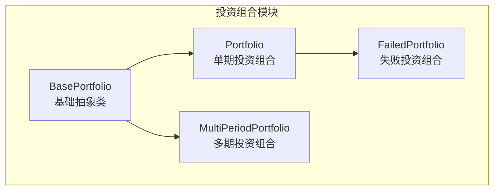
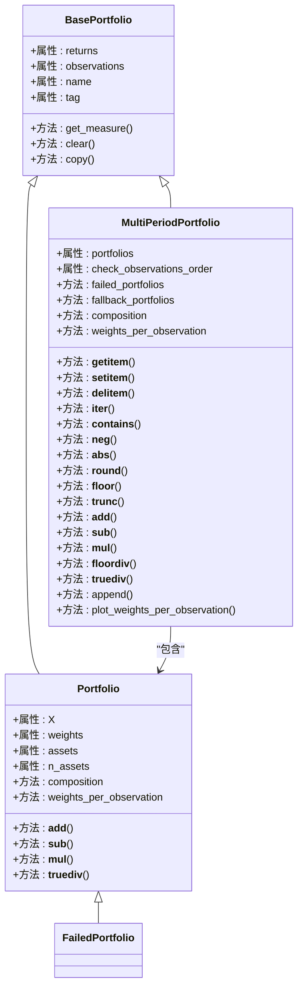

# 多周期投资组合类

<cite>
**本文引用的文件**
- [src/skfolio/portfolio/_multi_period_portfolio.py](file://src/skfolio/portfolio/_multi_period_portfolio.py)
- [src/skfolio/portfolio/_portfolio.py](file://src/skfolio/portfolio/_portfolio.py)
- [src/skfolio/portfolio/_base.py](file://src/skfolio/portfolio/_base.py)
- [src/skfolio/portfolio/_failed_portfolio.py](file://src/skfolio/portfolio/_failed_portfolio.py)
- [tests/test_portfolio/test_multi_period_portfolio.py](file://tests/test_portfolio/test_multi_period_portfolio.py)
- [examples/mean_risk/plot_6_transaction_costs.py](file://examples/mean_risk/plot_6_transaction_costs.py)
</cite>

## 目录
1. [简介](#简介)
2. [项目结构](#项目结构)
3. [核心组件](#核心组件)
4. [架构总览](#架构总览)
5. [详细组件分析](#详细组件分析)
6. [依赖关系分析](#依赖关系分析)
7. [性能考量](#性能考量)
8. [故障排查指南](#故障排查指南)
9. [结论](#结论)
10. [附录：示例与用法](#附录示例与用法)

## 简介
本文件为 skfolio 的 MultiPeriodPortfolio 类提供 API 参考文档。MultiPeriodPortfolio 是由优化估计器的 predict 方法返回的结果，它是一个“投资组合列表”的复合结构，用于支持多期（多时间段）投资组合分析。该类继承自基础 Portfolio 抽象类，具备完整的度量计算能力，并通过序列协议（如索引、切片、迭代、成员判断）与算术运算（加减乘除、取负、取绝对值、取整等）实现对多个子投资组合的批量操作。此外，它还提供了诊断属性（如 failed_portfolios、fallback_portfolios），以及聚合方法（如 composition、weights_per_observation）以汇总各期权重与资产配置信息。

## 项目结构
MultiPeriodPortfolio 位于 portfolio 子模块中，与 Portfolio、BasePortfolio、FailedPortfolio 等共同构成投资组合建模与分析的基础层。测试与示例展示了其在回测、交叉验证、交易成本模拟等场景中的典型用法。

图表来源
- [src/skfolio/portfolio/_base.py](file://src/skfolio/portfolio/_base.py#L75-L120)
- [src/skfolio/portfolio/_portfolio.py](file://src/skfolio/portfolio/_portfolio.py#L30-L60)
- [src/skfolio/portfolio/_multi_period_portfolio.py](file://src/skfolio/portfolio/_multi_period_portfolio.py#L24-L40)
- [src/skfolio/portfolio/_failed_portfolio.py](file://src/skfolio/portfolio/_failed_portfolio.py#L15-L35)

章节来源
- [src/skfolio/portfolio/_multi_period_portfolio.py](file://src/skfolio/portfolio/_multi_period_portfolio.py#L24-L122)
- [src/skfolio/portfolio/_portfolio.py](file://src/skfolio/portfolio/_portfolio.py#L30-L120)
- [src/skfolio/portfolio/_base.py](file://src/skfolio/portfolio/_base.py#L75-L120)
- [src/skfolio/portfolio/_failed_portfolio.py](file://src/skfolio/portfolio/_failed_portfolio.py#L15-L40)

## 核心组件
- MultiPeriodPortfolio：多期投资组合容器，内部维护一个 Portfolio 列表，支持序列协议与算术运算；提供诊断属性与聚合方法。
- Portfolio：单期投资组合，封装资产收益矩阵、权重、前一期权重、交易成本与管理费等，支持加减乘除与取负/取绝对值等运算。
- BasePortfolio：所有投资组合类型的基类，统一度量计算、缓存机制、序列化与比较逻辑。
- FailedPortfolio：失败的投资组合占位对象，兼容 Portfolio API，便于在回测中保留失败期并进行后续诊断。

章节来源
- [src/skfolio/portfolio/_multi_period_portfolio.py](file://src/skfolio/portfolio/_multi_period_portfolio.py#L24-L122)
- [src/skfolio/portfolio/_portfolio.py](file://src/skfolio/portfolio/_portfolio.py#L30-L120)
- [src/skfolio/portfolio/_base.py](file://src/skfolio/portfolio/_base.py#L75-L120)
- [src/skfolio/portfolio/_failed_portfolio.py](file://src/skfolio/portfolio/_failed_portfolio.py#L15-L40)

## 架构总览
MultiPeriodPortfolio 通过组合多个 Portfolio 实现多期分析，同时复用 BasePortfolio 的度量计算与缓存机制。其序列协议与算术运算均委托给内部的 Portfolio 列表，从而实现对每个子期的一致性操作。

图表来源
- [src/skfolio/portfolio/_base.py](file://src/skfolio/portfolio/_base.py#L486-L531)
- [src/skfolio/portfolio/_portfolio.py](file://src/skfolio/portfolio/_portfolio.py#L608-L710)
- [src/skfolio/portfolio/_multi_period_portfolio.py](file://src/skfolio/portfolio/_multi_period_portfolio.py#L377-L498)
- [src/skfolio/portfolio/_failed_portfolio.py](file://src/skfolio/portfolio/_failed_portfolio.py#L149-L205)

## 详细组件分析

### 序列协议与容器行为
- 支持长度查询、索引访问、切片、迭代、成员判断等标准序列协议，便于像访问列表一样操作多期投资组合。
- 支持删除与设置元素，但会触发内部缓存清理，确保后续度量计算正确。
- 提供 append 方法，用于向末尾追加新的 Portfolio；当启用 check_observations_order 时，会校验新期起始日期不得早于上一期结束日期，避免重叠或倒序。

章节来源
- [src/skfolio/portfolio/_multi_period_portfolio.py](file://src/skfolio/portfolio/_multi_period_portfolio.py#L377-L404)
- [src/skfolio/portfolio/_multi_period_portfolio.py](file://src/skfolio/portfolio/_multi_period_portfolio.py#L692-L721)

### 投资组合代数运算
- 支持对两个同长度 MultiPeriodPortfolio 进行逐期加减，结果仍为 MultiPeriodPortfolio。
- 支持标量或按期广播的乘除运算，分别支持真除与整除。
- 支持取负、取绝对值、四舍五入、向下取整、截断等对每个子期的逐期运算，返回新的 MultiPeriodPortfolio 实例。

章节来源
- [src/skfolio/portfolio/_multi_period_portfolio.py](file://src/skfolio/portfolio/_multi_period_portfolio.py#L440-L498)
- [src/skfolio/portfolio/_portfolio.py](file://src/skfolio/portfolio/_portfolio.py#L608-L710)

### 时间序列顺序校验：check_observations_order
- 当该参数为 True 时，构造 MultiPeriodPortfolio 或调用 append 时，会对各期的观测时间边界进行严格校验：
  - 构造时：遍历各期，确保后一期的首个观测时间不早于前一期的最后一个观测时间，避免重叠或倒序。
  - 追加时：若新期起始时间早于当前末期结束时间，则抛出错误。
- 该校验有助于保证多期回测的时间连续性与可解释性。

章节来源
- [src/skfolio/portfolio/_multi_period_portfolio.py](file://src/skfolio/portfolio/_multi_period_portfolio.py#L523-L533)
- [src/skfolio/portfolio/_multi_period_portfolio.py](file://src/skfolio/portfolio/_multi_period_portfolio.py#L700-L708)

### 诊断属性：failed_portfolios 与 fallback_portfolios
- failed_portfolios：返回内部包含的所有 FailedPortfolio 实例，便于统计失败期数量与定位问题。
- fallback_portfolios：返回所有包含 fallback_chain 的投资组合（包括 FailedPortfolio），用于识别曾尝试回退策略的期次。
- 同时提供 n_failed_portfolios 与 n_fallback_portfolios 计数属性，便于快速概览。

章节来源
- [src/skfolio/portfolio/_multi_period_portfolio.py](file://src/skfolio/portfolio/_multi_period_portfolio.py#L553-L577)
- [src/skfolio/portfolio/_failed_portfolio.py](file://src/skfolio/portfolio/_failed_portfolio.py#L149-L205)

### 聚合方法：composition 与 weights_per_observation
- composition：将各期的资产配置（权重）横向拼接为 DataFrame，列名为各期名称，缺失值填充为 0，便于观察跨期资产配置变化。
- weights_per_observation：将各期的权重按观测时间纵向拼接并排序，形成“每期每观测的权重矩阵”，可用于绘制权重随时间变化的堆叠面积图。

章节来源
- [src/skfolio/portfolio/_multi_period_portfolio.py](file://src/skfolio/portfolio/_multi_period_portfolio.py#L583-L619)
- [src/skfolio/portfolio/_portfolio.py](file://src/skfolio/portfolio/_portfolio.py#L752-L764)

### 其他重要属性与方法
- assets：返回每期的资产名列表。
- weights_dict / previous_weights_dict：返回每期到资产权重字典映射，便于逐期对比权重变化。
- contribution：对每个子期的指定度量计算资产贡献，支持返回 DataFrame 或数组列表。
- summary：在基础摘要基础上增加“每期平均资产数”、“期数”、“失败期数”、“回退期数”等统计。
- plot_weights_per_observation：绘制权重随时间变化的堆叠面积图，直观展示资产配置演进。

章节来源
- [src/skfolio/portfolio/_multi_period_portfolio.py](file://src/skfolio/portfolio/_multi_period_portfolio.py#L578-L619)
- [src/skfolio/portfolio/_multi_period_portfolio.py](file://src/skfolio/portfolio/_multi_period_portfolio.py#L620-L657)
- [src/skfolio/portfolio/_multi_period_portfolio.py](file://src/skfolio/portfolio/_multi_period_portfolio.py#L691-L768)

## 依赖关系分析
- MultiPeriodPortfolio 继承自 BasePortfolio，复用度量计算与缓存机制。
- 内部持有 Portfolio 列表，支持 FailedPortfolio 作为占位符参与运算与汇总。
- 与 Portfolio 的运算接口保持一致，确保多期与单期操作的一致性体验。

图表来源
- [src/skfolio/portfolio/_base.py](file://src/skfolio/portfolio/_base.py#L486-L531)
- [src/skfolio/portfolio/_portfolio.py](file://src/skfolio/portfolio/_portfolio.py#L608-L710)
- [src/skfolio/portfolio/_multi_period_portfolio.py](file://src/skfolio/portfolio/_multi_period_portfolio.py#L377-L498)
- [src/skfolio/portfolio/_failed_portfolio.py](file://src/skfolio/portfolio/_failed_portfolio.py#L149-L205)

章节来源
- [src/skfolio/portfolio/_base.py](file://src/skfolio/portfolio/_base.py#L486-L531)
- [src/skfolio/portfolio/_portfolio.py](file://src/skfolio/portfolio/_portfolio.py#L608-L710)
- [src/skfolio/portfolio/_multi_period_portfolio.py](file://src/skfolio/portfolio/_multi_period_portfolio.py#L377-L498)
- [src/skfolio/portfolio/_failed_portfolio.py](file://src/skfolio/portfolio/_failed_portfolio.py#L149-L205)

## 性能考量
- 多期度量计算基于 BasePortfolio 的延迟求值与缓存机制，仅在首次访问时计算并缓存度量值，后续访问直接命中缓存，显著降低重复计算开销。
- 在构造与追加时，MultiPeriodPortfolio 会将各期的 returns 与 observations 拼接为全局序列，便于整体度量计算；但注意避免过长的多期列表导致内存占用上升。
- 对 weights_per_observation 的处理采用排序与填充策略，确保时间索引连续且无 NaN 列被误清空。

章节来源
- [src/skfolio/portfolio/_base.py](file://src/skfolio/portfolio/_base.py#L576-L616)
- [src/skfolio/portfolio/_base.py](file://src/skfolio/portfolio/_base.py#L684-L764)
- [src/skfolio/portfolio/_multi_period_portfolio.py](file://src/skfolio/portfolio/_multi_period_portfolio.py#L583-L619)

## 故障排查指南
- 时间重叠错误：当 check_observations_order 为 True 且出现期初早于上期末的情况，会抛出异常。请检查各期的观测时间边界或关闭校验以继续。
- 非 Portfolio 类型赋值：通过 __setitem__ 设置非 Portfolio 类型会触发类型错误，请确保只放入 Portfolio 或 FailedPortfolio 实例。
- 不同长度相加/相减：MultiPeriodPortfolio 仅支持相同长度的多期对象进行加减，否则会抛出类型错误。
- 读写属性限制：部分属性为只读，尝试修改会触发 AttributeError；请通过重新构造或使用受支持的 setter 修改。

章节来源
- [src/skfolio/portfolio/_multi_period_portfolio.py](file://src/skfolio/portfolio/_multi_period_portfolio.py#L383-L396)
- [src/skfolio/portfolio/_multi_period_portfolio.py](file://src/skfolio/portfolio/_multi_period_portfolio.py#L440-L468)
- [src/skfolio/portfolio/_base.py](file://src/skfolio/portfolio/_base.py#L590-L613)

## 结论
MultiPeriodPortfolio 将多期投资组合建模为 Portfolio 列表的复合结构，既保持了与单期 Portfolio 一致的 API 与度量体系，又通过序列协议与算术运算实现了对多期数据的高效批量处理。其诊断属性与聚合方法为多期回测与风险分析提供了关键支撑；check_observations_order 参数则在保证时间连续性方面发挥重要作用。结合 FailedPortfolio，MultiPeriodPortfolio 能够在失败期与回退期场景下维持完整的时间线，便于后续诊断与可视化。

## 附录：示例与用法

### 示例一：从多个 Portfolio 构建 MultiPeriodPortfolio
- 使用 Portfolio 列表初始化 MultiPeriodPortfolio，并为其命名与打标签。
- 通过 summary 获取包含期数、失败期数、回退期数等的综合摘要。

章节来源
- [tests/test_portfolio/test_multi_period_portfolio.py](file://tests/test_portfolio/test_multi_period_portfolio.py#L140-L161)
- [tests/test_portfolio/test_multi_period_portfolio.py](file://tests/test_portfolio/test_multi_period_portfolio.py#L439-L445)

### 示例二：在回测中追加带交易成本的新期
- 使用 cross_val_predict 得到 MultiPeriodPortfolio 后，逐期创建带交易成本的新 Portfolio 并追加到另一个 MultiPeriodPortfolio 中，以对比“训练不含 TC”与“训练含 TC”的效果。

章节来源
- [examples/mean_risk/plot_6_transaction_costs.py](file://examples/mean_risk/plot_6_transaction_costs.py#L150-L178)

### 示例三：包含失败期与回退期的多期分析
- 构造包含 FailedPortfolio 的 MultiPeriodPortfolio，利用 failed_portfolios 与 fallback_portfolios 统计失败与回退次数，并通过 summary 输出相应指标。

章节来源
- [tests/test_portfolio/test_multi_period_portfolio.py](file://tests/test_portfolio/test_multi_period_portfolio.py#L567-L615)

### 示例四：权重随时间变化的可视化
- 使用 weights_per_observation 生成权重矩阵，并调用 plot_weights_per_observation 绘制堆叠面积图，观察资产配置随时间的演变。

章节来源
- [tests/test_portfolio/test_multi_period_portfolio.py](file://tests/test_portfolio/test_multi_period_portfolio.py#L461-L467)
- [src/skfolio/portfolio/_multi_period_portfolio.py](file://src/skfolio/portfolio/_multi_period_portfolio.py#L722-L768)