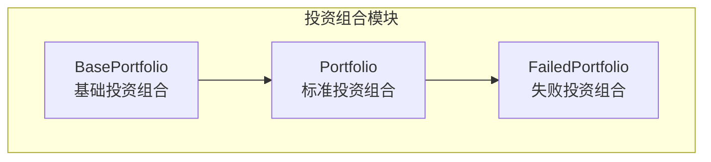
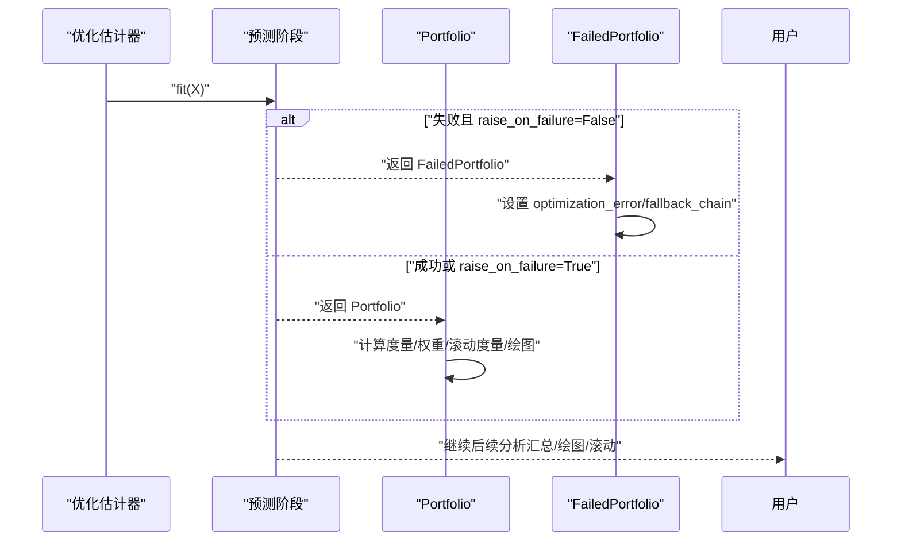
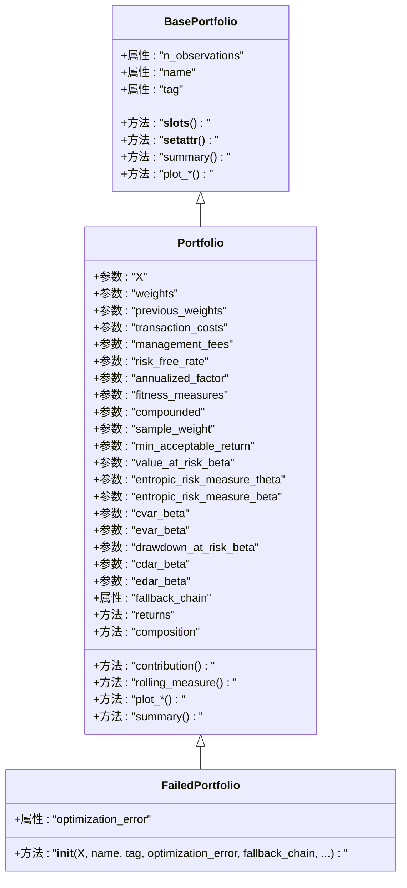
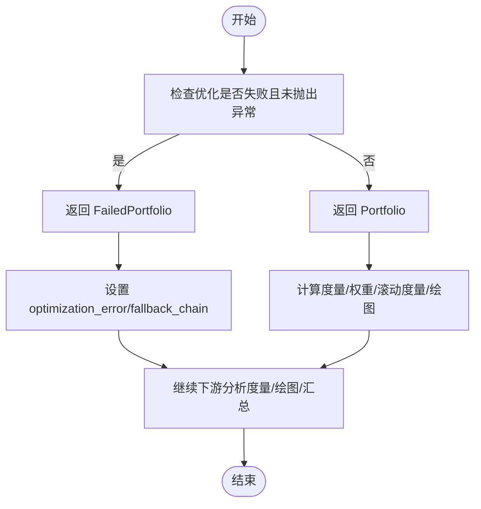

# 失败投资组合类

<cite>
**本文引用的文件列表**
- [src/skfolio/portfolio/_failed_portfolio.py](file://src/skfolio/portfolio/_failed_portfolio.py)
- [src/skfolio/portfolio/_portfolio.py](file://src/skfolio/portfolio/_portfolio.py)
- [src/skfolio/portfolio/_base.py](file://src/skfolio/portfolio/_base.py)
- [tests/test_portfolio/test_failed_portfolio.py](file://tests/test_portfolio/test_failed_portfolio.py)
- [tests/test_optimization/test_fallback.py](file://tests/test_optimization/test_fallback.py)
- [examples/mean_risk/plot_17_failure_and_fallbacks.py](file://examples/mean_risk/plot_17_failure_and_fallbacks.py)
</cite>

## 目录
1. [简介](#简介)
2. [项目结构](#项目结构)
3. [核心组件](#核心组件)
4. [架构总览](#架构总览)
5. [详细组件分析](#详细组件分析)
6. [依赖关系分析](#依赖关系分析)
7. [性能考量](#性能考量)
8. [故障排查指南](#故障排查指南)
9. [结论](#结论)
10. [附录](#附录)

## 简介
本文件为 skfolio 的 FailedPortfolio 类提供 API 参考与使用说明。FailedPortfolio 是优化失败时的“哨兵值”，用于在回测或交叉验证等自动化流程中，当优化估计器配置为不抛出异常（raise_on_failure=False）时，返回一个保持完整 API 兼容性的对象，避免中断流程并保留诊断信息。其所有返回值、权重与派生度量均为 NaN，同时携带 optimization_error 与 fallback_chain 等诊断属性，便于下游分析与可视化。

## 项目结构
FailedPortfolio 位于 portfolio 子模块中，继承自 Portfolio；Portfolio 继承自 BasePortfolio，并由优化估计器在预测阶段返回。测试与示例覆盖了失败与回退行为、API 兼容性、绘图与滚动度量等场景。

图表来源
- [src/skfolio/portfolio/_base.py](file://src/skfolio/portfolio/_base.py#L75-L120)
- [src/skfolio/portfolio/_portfolio.py](file://src/skfolio/portfolio/_portfolio.py#L30-L60)
- [src/skfolio/portfolio/_failed_portfolio.py](file://src/skfolio/portfolio/_failed_portfolio.py#L15-L35)

章节来源
- [src/skfolio/portfolio/_base.py](file://src/skfolio/portfolio/_base.py#L75-L120)
- [src/skfolio/portfolio/_portfolio.py](file://src/skfolio/portfolio/_portfolio.py#L30-L60)
- [src/skfolio/portfolio/_failed_portfolio.py](file://src/skfolio/portfolio/_failed_portfolio.py#L15-L35)

## 核心组件
- FailedPortfolio：当优化失败且未抛出异常时返回的对象，保持与 Portfolio 的 API 完全兼容，内部以 NaN 表示所有度量与权重，同时携带 optimization_error 与 fallback_chain 诊断信息。
- 诊断属性：
  - optimization_error：字符串化错误信息，说明优化失败原因（当 raise_on_failure=False 时由估计器传入）。
  - fallback_chain：回退链路记录，按顺序包含每次尝试的估计器表示与结果（成功或错误字符串），用于审计与统计。
- API 兼容性：FailedPortfolio 在所有度量、贡献、滚动度量、绘图、汇总等接口上均返回 NaN 或空结构，确保下游分析与可视化可无缝进行。

章节来源
- [src/skfolio/portfolio/_failed_portfolio.py](file://src/skfolio/portfolio/_failed_portfolio.py#L15-L35)
- [src/skfolio/portfolio/_failed_portfolio.py](file://src/skfolio/portfolio/_failed_portfolio.py#L149-L205)
- [tests/test_portfolio/test_failed_portfolio.py](file://tests/test_portfolio/test_failed_portfolio.py#L119-L155)
- [tests/test_optimization/test_fallback.py](file://tests/test_optimization/test_fallback.py#L256-L328)

## 架构总览
FailedPortfolio 的作用是在回测工作流中替代失败的 Portfolio，保证数据时间线连续、度量计算稳定、绘图与汇总可用。下图展示了从优化估计器到 Portfolio/FailedPortfolio 的典型调用序列。

图表来源
- [examples/mean_risk/plot_17_failure_and_fallbacks.py](file://examples/mean_risk/plot_17_failure_and_fallbacks.py#L33-L41)
- [tests/test_optimization/test_fallback.py](file://tests/test_optimization/test_fallback.py#L256-L328)
- [tests/test_optimization/test_fallback.py](file://tests/test_optimization/test_fallback.py#L444-L470)

## 详细组件分析

### FailedPortfolio 类定义与继承关系
FailedPortfolio 继承自 Portfolio，通过在构造函数中传入 weights=None，使内部度量与权重以 NaN 形式呈现，从而实现“增强的 NaN”语义：既保持类型与接口一致，又明确标记失败状态。

图表来源
- [src/skfolio/portfolio/_base.py](file://src/skfolio/portfolio/_base.py#L75-L120)
- [src/skfolio/portfolio/_portfolio.py](file://src/skfolio/portfolio/_portfolio.py#L30-L60)
- [src/skfolio/portfolio/_portfolio.py](file://src/skfolio/portfolio/_portfolio.py#L200-L220)
- [src/skfolio/portfolio/_failed_portfolio.py](file://src/skfolio/portfolio/_failed_portfolio.py#L15-L35)
- [src/skfolio/portfolio/_failed_portfolio.py](file://src/skfolio/portfolio/_failed_portfolio.py#L149-L205)

章节来源
- [src/skfolio/portfolio/_failed_portfolio.py](file://src/skfolio/portfolio/_failed_portfolio.py#L15-L35)
- [src/skfolio/portfolio/_portfolio.py](file://src/skfolio/portfolio/_portfolio.py#L30-L60)
- [src/skfolio/portfolio/_portfolio.py](file://src/skfolio/portfolio/_portfolio.py#L200-L220)

### API 兼容性设计与 NaN 行为
- 所有返回值、权重与派生度量均为 NaN：测试覆盖了 returns、fitness、composition、贡献、滚动度量、绘图与汇总等接口，确认它们在 FailedPortfolio 上返回 NaN 或空结构，避免异常传播。
- 读写属性与只读属性：FailedPortfolio 仅公开 optimization_error 作为可读写属性，其余属性遵循 Portfolio 的只读与缓存机制。
- 魔术方法与运算：FailedPortfolio 与 Portfolio 对象之间的加减、标量运算、比较、取反、取绝对值、四舍五入、整除等魔术方法返回值仍为 FailedPortfolio，确保在组合与聚合场景中保持一致性。

章节来源
- [tests/test_portfolio/test_failed_portfolio.py](file://tests/test_portfolio/test_failed_portfolio.py#L119-L155)
- [tests/test_portfolio/test_failed_portfolio.py](file://tests/test_portfolio/test_failed_portfolio.py#L157-L190)
- [tests/test_portfolio/test_failed_portfolio.py](file://tests/test_portfolio/test_failed_portfolio.py#L192-L203)
- [tests/test_portfolio/test_failed_portfolio.py](file://tests/test_portfolio/test_failed_portfolio.py#L285-L301)
- [tests/test_portfolio/test_failed_portfolio.py](file://tests/test_portfolio/test_failed_portfolio.py#L309-L319)

### 诊断属性：optimization_error 与 fallback_chain
- optimization_error：当 raise_on_failure=False 时，由优化估计器在失败后设置，字符串化错误信息，便于溯源与日志记录。
- fallback_chain：记录回退尝试序列，每个元素为 (估计器表示, 结果) 的二元组；若最终成功则结果为 "success"，否则为字符串化错误；当无回退或全部失败时，可能为 None 或包含完整链路。
- 示例与传播：在示例与测试中可以看到，当启用回退链路时，Portfolio/FailedPortfolio 均会携带 fallback_chain；当 raise_on_failure=False 且无回退时，FailedPortfolio 仍携带 optimization_error 并保持 API 兼容。

章节来源
- [src/skfolio/portfolio/_failed_portfolio.py](file://src/skfolio/portfolio/_failed_portfolio.py#L42-L63)
- [tests/test_optimization/test_fallback.py](file://tests/test_optimization/test_fallback.py#L256-L328)
- [tests/test_optimization/test_fallback.py](file://tests/test_optimization/test_fallback.py#L444-L470)
- [examples/mean_risk/plot_17_failure_and_fallbacks.py](file://examples/mean_risk/plot_17_failure_and_fallbacks.py#L33-L41)

### 回测工作流中的无缝传递
- 配置 raise_on_failure=False：在研究与交叉验证场景中，失败不会中断流程，predict 返回 FailedPortfolio，保留时间线与诊断信息。
- 跨期汇总与统计：MultiPeriodPortfolio 提供 failed_portfolios、fallback_portfolios、n_failed_portfolios、n_fallback_portfolios 等统计属性，便于评估失败率与回退效果。
- 滚动度量与绘图：FailedPortfolio 的滚动度量与绘图接口返回 NaN 或空结构，不影响整体分析流程。

章节来源
- [examples/mean_risk/plot_17_failure_and_fallbacks.py](file://examples/mean_risk/plot_17_failure_and_fallbacks.py#L33-L41)
- [tests/test_optimization/test_fallback.py](file://tests/test_optimization/test_fallback.py#L316-L328)
- [tests/test_portfolio/test_failed_portfolio.py](file://tests/test_portfolio/test_failed_portfolio.py#L285-L301)

### 处理逻辑流程（算法视角）
FailedPortfolio 的核心处理逻辑可抽象为以下流程：当优化失败且未抛出异常时，返回 FailedPortfolio 并填充诊断信息；随后在度量计算、绘图与汇总中以 NaN 传播，确保下游分析不受影响。

图表来源
- [examples/mean_risk/plot_17_failure_and_fallbacks.py](file://examples/mean_risk/plot_17_failure_and_fallbacks.py#L33-L41)
- [tests/test_optimization/test_fallback.py](file://tests/test_optimization/test_fallback.py#L256-L328)

## 依赖关系分析
FailedPortfolio 与 Portfolio/BasePortfolio 的依赖关系如下：

图表来源
- [src/skfolio/portfolio/_base.py](file://src/skfolio/portfolio/_base.py#L75-L120)
- [src/skfolio/portfolio/_portfolio.py](file://src/skfolio/portfolio/_portfolio.py#L30-L60)
- [src/skfolio/portfolio/_failed_portfolio.py](file://src/skfolio/portfolio/_failed_portfolio.py#L15-L35)

章节来源
- [src/skfolio/portfolio/_base.py](file://src/skfolio/portfolio/_base.py#L75-L120)
- [src/skfolio/portfolio/_portfolio.py](file://src/skfolio/portfolio/_portfolio.py#L30-L60)
- [src/skfolio/portfolio/_failed_portfolio.py](file://src/skfolio/portfolio/_failed_portfolio.py#L15-L35)

## 性能考量
- 缓存与懒加载：Portfolio 使用 __slots__ 与缓存机制，FailedPortfolio 保持相同策略，首次访问度量时计算，后续访问直接命中缓存，显著降低重复计算成本。
- 内存占用：测试显示 FailedPortfolio 的内存增长与单个实例相近，多次创建与访问不会导致内存爆炸式增长，适合大规模回测与交叉验证场景。
- 计算复杂度：FailedPortfolio 的度量计算以 NaN 传播为主，不涉及矩阵求解等重计算，时间复杂度近似 O(1)（基于缓存命中）。

章节来源
- [tests/test_portfolio/test_failed_portfolio.py](file://tests/test_portfolio/test_failed_portfolio.py#L93-L117)
- [tests/test_portfolio/test_failed_portfolio.py](file://tests/test_portfolio/test_failed_portfolio.py#L222-L234)

## 故障排查指南
- 如何识别失败投资组合：在 MultiPeriodPortfolio 中可通过 failed_portfolios 属性快速定位所有 FailedPortfolio 实例。
- 统计失败与回退：使用 n_failed_portfolios 与 n_fallback_portfolios 获取失败与回退数量，结合 summary() 查看失败统计行。
- 定位失败原因：查看 optimization_error 与 fallback_chain，前者为字符串化错误，后者为回退链路，二者共同构成完整的诊断证据链。
- 绘图与滚动度量：FailedPortfolio 的绘图与滚动度量返回 NaN 或空结构，不影响整体流程，但需注意结果中存在 NaN 的情况。

章节来源
- [tests/test_optimization/test_fallback.py](file://tests/test_optimization/test_fallback.py#L444-L470)
- [src/skfolio/portfolio/_multi_period_portfolio.py](file://src/skfolio/portfolio/_multi_period_portfolio.py#L539-L576)
- [tests/test_portfolio/test_failed_portfolio.py](file://tests/test_portfolio/test_failed_portfolio.py#L285-L301)

## 结论
FailedPortfolio 通过“增强的 NaN”设计，在不中断回测与交叉验证的前提下，提供了完整的诊断信息与 API 兼容性。其 optimization_error 与 fallback_chain 使失败可追踪、可审计；而所有度量与绘图接口返回 NaN，则确保下游分析与可视化稳定运行。在研究与生产环境中，合理配置 raise_on_failure 与 fallback，可有效提升流程鲁棒性与可观测性。

## 附录

### API 参考要点（摘要）
- 继承关系：FailedPortfolio → Portfolio → BasePortfolio
- 关键参数与属性：
  - optimization_error：字符串化错误信息（可选）
  - fallback_chain：回退链路（可选）
  - 其余参数与 Portfolio 一致，用于保持 API 兼容
- 行为特征：
  - 所有度量、权重、滚动度量、绘图与汇总返回 NaN 或空结构
  - 魔术方法与运算返回 FailedPortfolio，保证组合与聚合一致性
  - 在 raise_on_failure=False 时返回，携带诊断信息

章节来源
- [src/skfolio/portfolio/_failed_portfolio.py](file://src/skfolio/portfolio/_failed_portfolio.py#L15-L35)
- [src/skfolio/portfolio/_failed_portfolio.py](file://src/skfolio/portfolio/_failed_portfolio.py#L149-L205)
- [tests/test_portfolio/test_failed_portfolio.py](file://tests/test_portfolio/test_failed_portfolio.py#L119-L155)