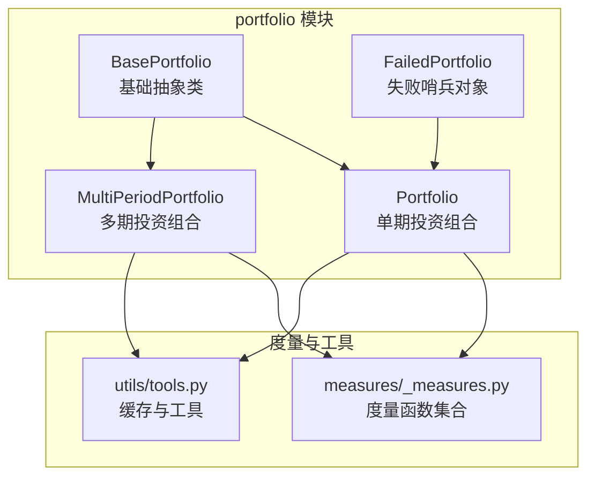
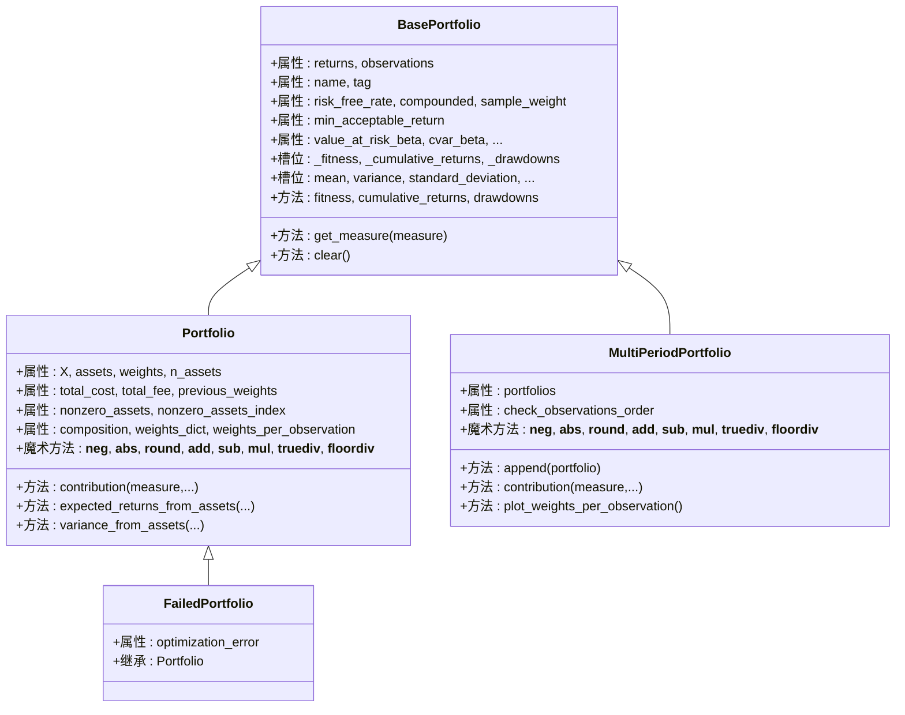
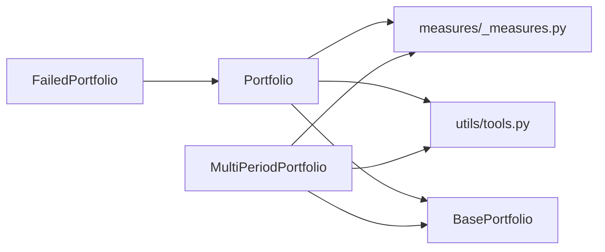

# 投资组合模块API

<cite>
**本文引用的文件**
- [src/skfolio/portfolio/_base.py](file://src/skfolio/portfolio/_base.py)
- [src/skfolio/portfolio/_portfolio.py](file://src/skfolio/portfolio/_portfolio.py)
- [src/skfolio/portfolio/_multi_period_portfolio.py](file://src/skfolio/portfolio/_multi_period_portfolio.py)
- [src/skfolio/portfolio/_failed_portfolio.py](file://src/skfolio/portfolio/_failed_portfolio.py)
- [src/skfolio/measures/_measures.py](file://src/skfolio/measures/_measures.py)
- [src/skfolio/utils/tools.py](file://src/skfolio/utils/tools.py)
- [src/skfolio/portfolio/__init__.py](file://src/skfolio/portfolio/__init__.py)
</cite>

## 目录
1. [简介](#简介)
2. [项目结构](#项目结构)
3. [核心组件](#核心组件)
4. [架构总览](#架构总览)
5. [详细组件分析](#详细组件分析)
6. [依赖关系分析](#依赖关系分析)
7. [性能考量](#性能考量)
8. [故障排查指南](#故障排查指南)
9. [结论](#结论)
10. [附录](#附录)

## 简介
本文件为 skfolio 的 portfolio 模块提供详尽的 API 参考，重点覆盖以下内容：
- Portfolio 类：通过 __slots__ 实现高性能与内存优化；40 多项风险与绩效度量的惰性计算与缓存机制；属性与度量的语义与用法；魔术方法（+、-、*、/ 等）的投资组合代数运算；资产权重、收益、组合结构等常用属性与方法。
- MultiPeriodPortfolio 类：多期投资组合容器，支持序列化、时间顺序校验、权重随观测变化的可视化等。
- FailedPortfolio 类：失败优化的哨兵对象，保持与 Portfolio 完全一致的 API，便于在回测中无缝传递诊断信息。
- 示例：如何访问与使用各类投资组合度量，包括波动率、CVaR、夏普比率等。

## 项目结构
portfolio 模块由四个核心类组成，均继承自 BasePortfolio，并通过工具函数与度量函数实现高效、可扩展的度量体系。

图表来源
- [src/skfolio/portfolio/_base.py](file://src/skfolio/portfolio/_base.py#L75-L120)
- [src/skfolio/portfolio/_portfolio.py](file://src/skfolio/portfolio/_portfolio.py#L30-L120)
- [src/skfolio/portfolio/_multi_period_portfolio.py](file://src/skfolio/portfolio/_multi_period_portfolio.py#L24-L80)
- [src/skfolio/portfolio/_failed_portfolio.py](file://src/skfolio/portfolio/_failed_portfolio.py#L15-L40)
- [src/skfolio/measures/_measures.py](file://src/skfolio/measures/_measures.py#L1-L60)
- [src/skfolio/utils/tools.py](file://src/skfolio/utils/tools.py#L77-L116)

章节来源
- [src/skfolio/portfolio/__init__.py](file://src/skfolio/portfolio/__init__.py#L9-L15)

## 核心组件
- BasePortfolio：定义了所有度量槽位、惰性求值与缓存策略、样本权重、年化因子、累积收益与回撤、以及 fitness 计算等通用能力。
- Portfolio：在 BasePortfolio 基础上，封装了资产价格收益矩阵、交易成本与管理费、权重与组合结构、资产暴露与贡献度量、以及投资组合代数运算的魔术方法。
- MultiPeriodPortfolio：将多个 Portfolio 组合为多期序列，提供时间顺序校验、权重随观测变化的可视化、汇总统计等。
- FailedPortfolio：继承 Portfolio，用于在优化失败时返回，保持 API 兼容并携带失败诊断信息。

章节来源
- [src/skfolio/portfolio/_base.py](file://src/skfolio/portfolio/_base.py#L75-L120)
- [src/skfolio/portfolio/_portfolio.py](file://src/skfolio/portfolio/_portfolio.py#L30-L120)
- [src/skfolio/portfolio/_multi_period_portfolio.py](file://src/skfolio/portfolio/_multi_period_portfolio.py#L24-L80)
- [src/skfolio/portfolio/_failed_portfolio.py](file://src/skfolio/portfolio/_failed_portfolio.py#L15-L40)

## 架构总览
Portfolio 与 MultiPeriodPortfolio 的度量系统基于 BasePortfolio 的“按需计算 + 缓存”的设计，避免重复计算与内存占用。Portfolio 的 __slots__ 将读写属性、只读属性、自定义 getter、度量槽位等统一管理，配合 cached_property_slots 装饰器实现惰性缓存。

图表来源
- [src/skfolio/portfolio/_base.py](file://src/skfolio/portfolio/_base.py#L372-L484)
- [src/skfolio/portfolio/_portfolio.py](file://src/skfolio/portfolio/_portfolio.py#L436-L520)
- [src/skfolio/portfolio/_multi_period_portfolio.py](file://src/skfolio/portfolio/_multi_period_portfolio.py#L327-L360)
- [src/skfolio/portfolio/_failed_portfolio.py](file://src/skfolio/portfolio/_failed_portfolio.py#L149-L153)

## 详细组件分析

### BasePortfolio：度量系统与缓存机制
- 槽位组织
  - 公共读写：name、tag
  - 只读：returns、observations
  - 私有：_loaded
  - 自定义 getter/setter：_fitness_measures、_annualized_factor、_sample_weight
  - 自定义只读缓存：_fitness、_cumulative_returns、_drawdowns
  - 全局参数：min_acceptable_return、compounded、risk_free_rate、sample_weight
  - 局部参数：value_at_risk_beta、cvar_beta、entropic_risk_measure_theta、entropic_risk_measure_beta、evar_beta、drawdown_at_risk_beta、cdar_beta、edar_beta
  - 度量槽位：均方差、半方差、偏态、峰度、VaR、CVaR、熵风险、EVaR、最大回撤、平均回撤、CDaR、EDaR、溃疡指数、GMD、各类比率等
- 惰性求值与缓存
  - __getattribute__ 在首次访问度量槽位时调用 get_measure 动态计算并写入缓存槽位
  - __setattr__ 对全局/局部参数进行变更时触发 clear() 清理所有度量与派生属性，确保一致性
  - cached_property_slots 装饰器为自定义只读属性提供线程安全的缓存
- 关键方法
  - get_measure：根据 Measure 枚举动态选择度量函数与参数，处理年化因子与比率符号
  - fitness：按 fitness_measures 列表计算带符号的向量
  - cumulative_returns、drawdowns：基于 measures 模块函数生成累积收益与回撤序列
  - clear：删除所有度量槽位与派生属性，强制重新计算

章节来源
- [src/skfolio/portfolio/_base.py](file://src/skfolio/portfolio/_base.py#L372-L484)
- [src/skfolio/portfolio/_base.py](file://src/skfolio/portfolio/_base.py#L576-L616)
- [src/skfolio/portfolio/_base.py](file://src/skfolio/portfolio/_base.py#L618-L636)
- [src/skfolio/portfolio/_base.py](file://src/skfolio/portfolio/_base.py#L684-L712)
- [src/skfolio/portfolio/_base.py](file://src/skfolio/portfolio/_base.py#L754-L806)
- [src/skfolio/utils/tools.py](file://src/skfolio/utils/tools.py#L77-L116)

### Portfolio：单期投资组合
- 初始化与输入处理
  - 接收资产价格收益矩阵 X（二维）、权重 weights（可字典映射到列名）、前一期权重 previous_weights、交易成本 transaction_costs、管理费 management_fees
  - 自动推断资产名称与观测索引，若 X 非 DataFrame 则使用默认命名与整数索引
  - 计算总交易成本与总管理费，并据此生成组合收益序列
  - 保存原始输入以节省内存（例如 X 保持原数组引用）
- 关键属性
  - X、assets、n_assets、weights、previous_weights、transaction_costs、management_fees、total_cost、total_fee
  - nonzero_assets、nonzero_assets_index：基于阈值筛选非零权重资产
  - composition：过滤零权重后的资产-权重 DataFrame，按权重降序排列
  - weights_dict、previous_weights_dict：包含零权重的完整映射
  - weights_per_observation：每期权重的 DataFrame，便于可视化
  - diversification、sric、effective_number_assets：组合集中度与 SRIC 指标
- 魔术方法（投资组合代数运算）
  - __neg__、__abs__、__round__：对权重进行变换，返回同类型实例
  - __add__、__sub__：要求两个 Portfolio 的非权重参数完全一致，仅对权重相加/相减
  - __mul__、__rmul__、__truediv__、__floordiv__：对权重进行标量乘除或整除
  - 失败哨兵对象（FailedPortfolio）：当任一操作对象为 FailedPortfolio 时，直接返回副本，避免传播错误
- 贡献度量
  - contribution：使用有限差分计算各资产对指定度量的边际贡献，支持排序与零权重剔除
- 其他实用方法
  - expected_returns_from_assets：从资产期望收益、权重、费用计算组合期望收益
  - variance_from_assets：从资产协方差矩阵与权重计算组合方差
  - summary：汇总所有度量与额外统计（有效资产数、资产数量）

章节来源
- [src/skfolio/portfolio/_portfolio.py](file://src/skfolio/portfolio/_portfolio.py#L436-L603)
- [src/skfolio/portfolio/_portfolio.py](file://src/skfolio/portfolio/_portfolio.py#L604-L710)
- [src/skfolio/portfolio/_portfolio.py](file://src/skfolio/portfolio/_portfolio.py#L711-L764)
- [src/skfolio/portfolio/_portfolio.py](file://src/skfolio/portfolio/_portfolio.py#L765-L809)
- [src/skfolio/portfolio/_portfolio.py](file://src/skfolio/portfolio/_portfolio.py#L811-L846)
- [src/skfolio/portfolio/_portfolio.py](file://src/skfolio/portfolio/_portfolio.py#L847-L906)
- [src/skfolio/portfolio/_portfolio.py](file://src/skfolio/portfolio/_portfolio.py#L907-L949)

### MultiPeriodPortfolio：多期投资组合
- 容器与初始化
  - portfolios：Portfolio 列表，构造时连接 returns 与 observations，并可选检查观测时间顺序
  - check_observations_order：开启后若相邻 Portfolio 观测重叠则抛错
- 魔术方法
  - 支持对整个序列执行负号、绝对值、四舍五入、加减、标量或逐元素乘除
- 关键属性与方法
  - failed_portfolios、fallback_portfolios、n_failed_portfolios、n_fallback_portfolios：失败与回退统计
  - assets、composition、weights_dict、previous_weights_dict：多期维度的汇总
  - weights_per_observation：拼接并排序后的权重随观测变化
  - contribution：对每个 Portfolio 计算资产对度量的贡献并汇总
  - summary：在基础 summary 上追加平均资产数、Portfolio 数、失败与回退数量
  - append：追加新 Portfolio 并更新 returns/observations，支持时间顺序校验
  - plot_weights_per_observation：绘制权重随时间堆叠面积图

章节来源
- [src/skfolio/portfolio/_multi_period_portfolio.py](file://src/skfolio/portfolio/_multi_period_portfolio.py#L327-L376)
- [src/skfolio/portfolio/_multi_period_portfolio.py](file://src/skfolio/portfolio/_multi_period_portfolio.py#L377-L439)
- [src/skfolio/portfolio/_multi_period_portfolio.py](file://src/skfolio/portfolio/_multi_period_portfolio.py#L440-L498)
- [src/skfolio/portfolio/_multi_period_portfolio.py](file://src/skfolio/portfolio/_multi_period_portfolio.py#L500-L538)
- [src/skfolio/portfolio/_multi_period_portfolio.py](file://src/skfolio/portfolio/_multi_period_portfolio.py#L540-L619)
- [src/skfolio/portfolio/_multi_period_portfolio.py](file://src/skfolio/portfolio/_multi_period_portfolio.py#L620-L691)
- [src/skfolio/portfolio/_multi_period_portfolio.py](file://src/skfolio/portfolio/_multi_period_portfolio.py#L692-L768)

### FailedPortfolio：失败哨兵对象
- 设计目标
  - 在优化失败时返回，保持与 Portfolio 完全一致的 API，便于下游流程继续运行
  - 所有度量、组合与绘图均返回 NaN，不改变外部逻辑
- 关键点
  - optimization_error：失败原因字符串，可携带诊断信息
  - 继承 Portfolio，复用 Portfolio 的 __slots__ 与度量系统
  - 作为 MultiPeriodPortfolio 的成员时，可被识别为失败实例

章节来源
- [src/skfolio/portfolio/_failed_portfolio.py](file://src/skfolio/portfolio/_failed_portfolio.py#L149-L205)

### Portfolio 的度量体系与惰性计算
- 度量枚举与槽位
  - 性能度量：mean、annualized_mean
  - 风险度量：variance、standard_deviation、semi_variance、semi_deviation、fourth_central_moment、fourth_lower_partial_moment、worst_realization、value_at_risk、cvar、entropic_risk_measure、evar、drawdown_at_risk、cdar、max_drawdown、average_drawdown、edar、ulcer_index、gini_mean_difference、skew、kurtosis
  - 比率度量：mean_absolute_deviation_ratio、first_lower_partial_moment_ratio、sharpe_ratio、sortino_ratio、value_at_risk_ratio、cvar_ratio、entropic_risk_measure_ratio、evar_ratio、worst_realization_ratio、drawdown_at_risk_ratio、cdar_ratio、calmar_ratio、average_drawdown_ratio、edar_ratio、ulcer_index_ratio、gini_mean_difference_ratio、annualized_sharpe_ratio、annualized_sortino_ratio
- 计算入口
  - BasePortfolio.get_measure：根据 Measure 枚举动态选择 measures 模块中的函数，自动注入全局/局部参数，必要时应用年化因子
  - measures 模块：提供 mean、variance、standard_deviation、cvar、value_at_risk、drawdowns 相关函数等
- 惰性与缓存
  - 首次访问某度量时计算并写入槽位；后续访问直接返回缓存
  - 修改影响度量的参数（如 risk_free_rate、compounded、min_acceptable_return、样本权重、置信水平等）会触发 clear() 清理缓存

章节来源
- [src/skfolio/portfolio/_base.py](file://src/skfolio/portfolio/_base.py#L169-L370)
- [src/skfolio/portfolio/_base.py](file://src/skfolio/portfolio/_base.py#L764-L806)
- [src/skfolio/measures/_measures.py](file://src/skfolio/measures/_measures.py#L1-L120)
- [src/skfolio/measures/_measures.py](file://src/skfolio/measures/_measures.py#L518-L740)
- [src/skfolio/measures/_measures.py](file://src/skfolio/measures/_measures.py#L831-L980)
- [src/skfolio/measures/_measures.py](file://src/skfolio/measures/_measures.py#L1022-L1097)

### Portfolio 的魔术方法与投资组合代数运算
- 适用范围
  - 支持对权重进行标量运算（乘法、除法、整除），以及对权重进行取负、取绝对值、四舍五入
  - 支持两个 Portfolio 的加减（要求除权重外其他参数完全一致）
- 行为要点
  - 当任一操作对象为 FailedPortfolio 时，直接返回副本，避免传播错误
  - 加减法会验证非权重参数一致性，否则抛出异常
  - 乘除法会保留其他参数不变，仅对权重进行缩放

章节来源
- [src/skfolio/portfolio/_portfolio.py](file://src/skfolio/portfolio/_portfolio.py#L608-L710)
- [src/skfolio/portfolio/_portfolio.py](file://src/skfolio/portfolio/_portfolio.py#L629-L671)
- [src/skfolio/portfolio/_portfolio.py](file://src/skfolio/portfolio/_portfolio.py#L673-L710)

### MultiPeriodPortfolio 的魔术方法与序列运算
- 支持对整个序列执行负号、绝对值、四舍五入、加减
- 支持标量或逐元素乘除（列表/数组长度需与序列长度一致）
- 时间顺序校验：append 与构造时可启用 check_observations_order，防止观测重叠

章节来源
- [src/skfolio/portfolio/_multi_period_portfolio.py](file://src/skfolio/portfolio/_multi_period_portfolio.py#L377-L439)
- [src/skfolio/portfolio/_multi_period_portfolio.py](file://src/skfolio/portfolio/_multi_period_portfolio.py#L440-L498)
- [src/skfolio/portfolio/_multi_period_portfolio.py](file://src/skfolio/portfolio/_multi_period_portfolio.py#L692-L719)

### Portfolio 的 __slots__ 与内存优化
- 作用
  - 使用 __slots__ 替代 __dict__，显著降低实例内存占用并提升属性访问速度
  - 明确区分公共读写、只读、私有、自定义 getter/setter、自定义只读缓存、度量槽位等类型
- 与 BasePortfolio 的协作
  - BasePortfolio 的度量槽位在首次访问时才分配，避免不必要的内存开销
  - 修改影响度量的参数会触发 clear()，确保缓存一致性

章节来源
- [src/skfolio/portfolio/_base.py](file://src/skfolio/portfolio/_base.py#L372-L484)
- [src/skfolio/portfolio/_portfolio.py](file://src/skfolio/portfolio/_portfolio.py#L436-L453)

### Portfolio 的贡献度量算法
- finite difference 方法
  - 对每个资产权重微扰 ±h，计算度量变化并估计边际贡献
  - 支持不同度量选择不同的 h（如回撤相关度量采用较大步长）
  - 可输出数组或按权重降序排列的 DataFrame

章节来源
- [src/skfolio/portfolio/_portfolio.py](file://src/skfolio/portfolio/_portfolio.py#L847-L906)
- [src/skfolio/portfolio/_portfolio.py](file://src/skfolio/portfolio/_portfolio.py#L950-L989)

## 依赖关系分析

图表来源
- [src/skfolio/portfolio/_portfolio.py](file://src/skfolio/portfolio/_portfolio.py#L847-L906)
- [src/skfolio/portfolio/_multi_period_portfolio.py](file://src/skfolio/portfolio/_multi_period_portfolio.py#L620-L657)
- [src/skfolio/utils/tools.py](file://src/skfolio/utils/tools.py#L77-L116)
- [src/skfolio/measures/_measures.py](file://src/skfolio/measures/_measures.py#L1-L60)

章节来源
- [src/skfolio/portfolio/_base.py](file://src/skfolio/portfolio/_base.py#L576-L616)
- [src/skfolio/portfolio/_portfolio.py](file://src/skfolio/portfolio/_portfolio.py#L436-L520)
- [src/skfolio/portfolio/_multi_period_portfolio.py](file://src/skfolio/portfolio/_multi_period_portfolio.py#L327-L360)

## 性能考量
- 内存优化
  - __slots__ 减少实例字典存储与属性查找开销
  - BasePortfolio 的惰性求值避免一次性计算全部度量
- 计算效率
  - cached_property_slots 为自定义只读属性提供缓存
  - get_measure 动态选择度量函数，减少重复封装
- 输入处理
  - Portfolio 在初始化阶段尽量延迟数组转换与形状检查，加速实例化
  - MultiPeriodPortfolio 在设置 portfolios 时合并 returns/observations，避免多次拼接

章节来源
- [src/skfolio/portfolio/_base.py](file://src/skfolio/portfolio/_base.py#L75-L110)
- [src/skfolio/portfolio/_portfolio.py](file://src/skfolio/portfolio/_portfolio.py#L486-L520)
- [src/skfolio/portfolio/_multi_period_portfolio.py](file://src/skfolio/portfolio/_multi_period_portfolio.py#L500-L538)

## 故障排查指南
- 无法设置只读属性
  - BasePortfolio 对只读属性（如 returns、observations）在 __setattr__ 中拦截，抛出异常
- 参数不一致导致 Portfolio 加减失败
  - __add__/__sub__ 要求除权重外其他参数完全一致，否则抛出异常
- 观测重叠导致 MultiPeriodPortfolio 报错
  - 启用 check_observations_order 后，相邻 Portfolio 的起止观测重叠会抛错
- 失败哨兵对象传播
  - FailedPortfolio 的魔术方法直接返回副本，避免错误传播；可在 summary 或统计中识别失败数量

章节来源
- [src/skfolio/portfolio/_base.py](file://src/skfolio/portfolio/_base.py#L590-L613)
- [src/skfolio/portfolio/_portfolio.py](file://src/skfolio/portfolio/_portfolio.py#L629-L671)
- [src/skfolio/portfolio/_multi_period_portfolio.py](file://src/skfolio/portfolio/_multi_period_portfolio.py#L523-L533)
- [src/skfolio/portfolio/_multi_period_portfolio.py](file://src/skfolio/portfolio/_multi_period_portfolio.py#L692-L708)

## 结论
skfolio 的 portfolio 模块通过 BasePortfolio 的统一抽象与 Portfolio/MultiPeriodPortfolio 的具体实现，构建了高性能、可扩展且易用的投资组合度量与分析框架。Portfolio 的 __slots__ 与惰性缓存机制显著降低了内存与计算成本；40 多项度量通过 measures 模块函数实现，既保证了灵活性又确保了数值稳定性；FailedPortfolio 提供了优雅的失败处理路径，使回测与评估流程更加鲁棒。

## 附录

### 常用度量与属性速查
- 绩效类
  - mean、annualized_mean、skew、kurtosis、fourth_central_moment、fourth_lower_partial_moment
- 风险类
  - variance、standard_deviation、semi_variance、semi_deviation、worst_realization、value_at_risk、cvar、entropic_risk_measure、evar、drawdown_at_risk、cdar、max_drawdown、average_drawdown、edar、ulcer_index、gini_mean_difference
- 比率类
  - mean_absolute_deviation_ratio、first_lower_partial_moment_ratio、sharpe_ratio、sortino_ratio、value_at_risk_ratio、cvar_ratio、entropic_risk_measure_ratio、evar_ratio、worst_realization_ratio、drawdown_at_risk_ratio、cdar_ratio、calmar_ratio、average_drawdown_ratio、edar_ratio、ulcer_index_ratio、gini_mean_difference_ratio、annualized_sharpe_ratio、annualized_sortino_ratio

章节来源
- [src/skfolio/portfolio/_base.py](file://src/skfolio/portfolio/_base.py#L169-L370)

### 使用示例（步骤说明）
- 计算波动率与夏普比率
  - 步骤：创建 Portfolio 实例 → 访问 standard_deviation 与 sharpe_ratio（首次访问触发计算并缓存）
  - 参考路径：[Portfolio 初始化与度量访问](file://src/skfolio/portfolio/_portfolio.py#L436-L603)，[度量函数](file://src/skfolio/measures/_measures.py#L133-L178)
- 计算 CVaR 与 EVaR
  - 步骤：创建 Portfolio 实例 → 访问 cvar 与 evar（首次访问触发计算并缓存）
  - 参考路径：[度量函数](file://src/skfolio/measures/_measures.py#L596-L740)
- 计算资产对组合波动率的贡献
  - 步骤：调用 contribution(measure=variance) 或 contribution(measure=standard_deviation)
  - 参考路径：[Portfolio.contribution](file://src/skfolio/portfolio/_portfolio.py#L847-L906)
- 多期权重随时间变化可视化
  - 步骤：创建 MultiPeriodPortfolio → 调用 plot_weights_per_observation
  - 参考路径：[MultiPeriodPortfolio.plot_weights_per_observation](file://src/skfolio/portfolio/_multi_period_portfolio.py#L722-L768)
- 失败回测场景
  - 步骤：优化失败时返回 FailedPortfolio → 仍可参与 summary、统计与绘图，但度量为 NaN
  - 参考路径：[FailedPortfolio](file://src/skfolio/portfolio/_failed_portfolio.py#L149-L205)