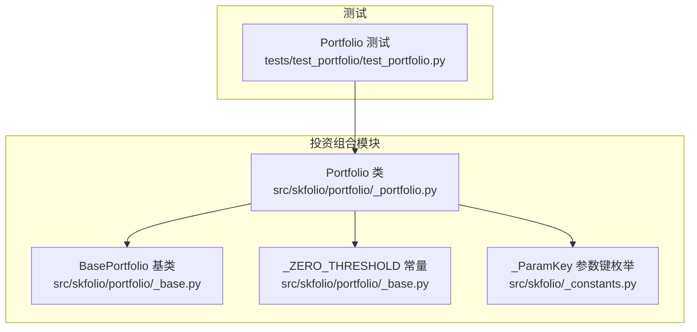
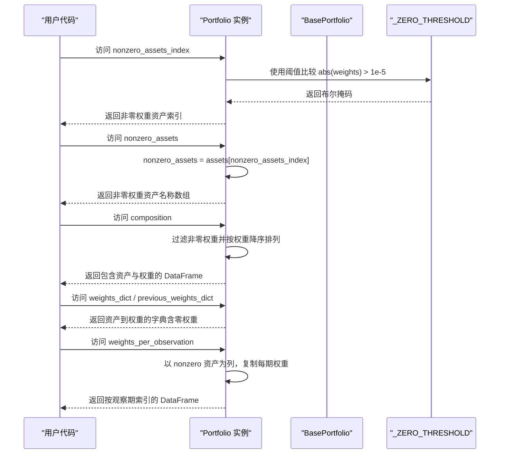
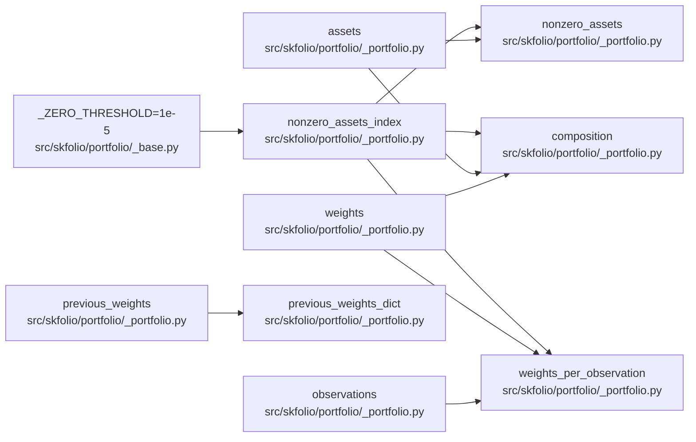

# 投资组合便捷属性

<cite>
**本文引用的文件**
- [src/skfolio/portfolio/_portfolio.py](file://src/skfolio/portfolio/_portfolio.py)
- [src/skfolio/portfolio/_base.py](file://src/skfolio/portfolio/_base.py)
- [src/skfolio/_constants.py](file://src/skfolio/_constants.py)
- [tests/test_portfolio/test_portfolio.py](file://tests/test_portfolio/test_portfolio.py)
</cite>

## 目录
1. [简介](#简介)
2. [项目结构](#项目结构)
3. [核心组件](#核心组件)
4. [架构总览](#架构总览)
5. [详细组件分析](#详细组件分析)
6. [依赖关系分析](#依赖关系分析)
7. [性能考量](#性能考量)
8. [故障排查指南](#故障排查指南)
9. [结论](#结论)
10. [附录：使用示例与最佳实践](#附录使用示例与最佳实践)

## 简介
本文件聚焦于 skfolio 的 Portfolio 类的便捷属性，系统性地解释以下关键属性：
- nonzero_assets（非零权重资产）
- nonzero_assets_index（非零权重资产索引）
- composition（投资组合构成）
- weights_dict（权重字典）
- previous_weights_dict（前一权重字典）
- weights_per_observation（各期权重）

并深入说明 _ZERO_THRESHOLD 常量（1e-5）在判断非零权重时的作用；最后给出基于这些属性的投资组合分析与报告生成的实用示例路径。

## 项目结构
Portfolio 类位于 portfolio 模块中，其便捷属性由 Portfolio 类直接实现，底层基础能力由 BasePortfolio 提供。常量 _ZERO_THRESHOLD 定义在基础模块中，参数键名常量定义在 _constants 中。

图表来源
- [src/skfolio/portfolio/_portfolio.py](file://src/skfolio/portfolio/_portfolio.py#L711-L764)
- [src/skfolio/portfolio/_base.py](file://src/skfolio/portfolio/_base.py#L68-L72)
- [src/skfolio/_constants.py](file://src/skfolio/_constants.py#L12-L26)
- [tests/test_portfolio/test_portfolio.py](file://tests/test_portfolio/test_portfolio.py#L227-L255)

章节来源
- [src/skfolio/portfolio/_portfolio.py](file://src/skfolio/portfolio/_portfolio.py#L711-L764)
- [src/skfolio/portfolio/_base.py](file://src/skfolio/portfolio/_base.py#L68-L72)
- [src/skfolio/_constants.py](file://src/skfolio/_constants.py#L12-L26)
- [tests/test_portfolio/test_portfolio.py](file://tests/test_portfolio/test_portfolio.py#L227-L255)

## 核心组件
- Portfolio 类：提供便捷属性与计算方法，用于投资组合分析、报告与可视化。
- BasePortfolio 基类：提供通用度量缓存机制、序列化支持、读写属性管理等。
- _ZERO_THRESHOLD 常量：用于判断“非零权重”的阈值，当前值为 1e-5（即 0.001%）。
- _ParamKey 枚举：统一参数键名，便于跨模块一致传递交易成本、管理费、前一权重等参数。

章节来源
- [src/skfolio/portfolio/_portfolio.py](file://src/skfolio/portfolio/_portfolio.py#L711-L764)
- [src/skfolio/portfolio/_base.py](file://src/skfolio/portfolio/_base.py#L68-L72)
- [src/skfolio/_constants.py](file://src/skfolio/_constants.py#L12-L26)

## 架构总览
Portfolio 在构造时接收资产收益矩阵与权重向量，并据此计算组合收益。便捷属性通过惰性求值与缓存策略提升性能，同时保持接口简洁易用。

图表来源
- [src/skfolio/portfolio/_portfolio.py](file://src/skfolio/portfolio/_portfolio.py#L711-L764)
- [src/skfolio/portfolio/_base.py](file://src/skfolio/portfolio/_base.py#L68-L72)

## 详细组件分析

### nonzero_assets（非零权重资产）
- 作用：返回非零权重资产的名称数组。该判断使用 _ZERO_THRESHOLD 阈值，过滤掉绝对值小于阈值的权重。
- 实现要点：
  - nonzero_assets_index 先筛选出非零权重索引；
  - nonzero_assets 再从资产名称数组中提取对应名称。
- 性能与缓存：通过惰性求值与缓存避免重复计算。

章节来源
- [src/skfolio/portfolio/_portfolio.py](file://src/skfolio/portfolio/_portfolio.py#L711-L723)
- [src/skfolio/portfolio/_base.py](file://src/skfolio/portfolio/_base.py#L68-L72)

### nonzero_assets_index（非零权重资产索引）
- 作用：返回非零权重资产的整数索引集合。
- 判断逻辑：对权重向量执行 abs(weights) > _ZERO_THRESHOLD，并合并 NaN 条件（NaN 视为非零权重参与筛选）。
- 复杂度：O(n)，n 为资产数量；一次计算后缓存结果。

章节来源
- [src/skfolio/portfolio/_portfolio.py](file://src/skfolio/portfolio/_portfolio.py#L717-L723)
- [src/skfolio/portfolio/_base.py](file://src/skfolio/portfolio/_base.py#L68-L72)

### composition（投资组合构成）
- 作用：返回一个按权重降序排列的 DataFrame，行过滤掉零权重资产，便于直观查看投资组合构成。
- 输出特征：
  - 行索引为资产名称；
  - 列名为组合名称（Portfolio.name），数值为权重；
  - 已按权重降序排序。
- 适用场景：生成报告、可视化饼图或条形图、快速识别主要持仓。

章节来源
- [src/skfolio/portfolio/_portfolio.py](file://src/skfolio/portfolio/_portfolio.py#L724-L734)

### weights_dict（权重字典）
- 作用：返回包含所有资产（包括零权重）的资产到权重映射。
- 适用场景：需要完整资产清单与权重的场景，如导出到外部系统或进一步加工。

章节来源
- [src/skfolio/portfolio/_portfolio.py](file://src/skfolio/portfolio/_portfolio.py#L736-L743)

### previous_weights_dict（前一权重字典）
- 作用：返回包含所有资产（包括零权重）的“前一权重”映射，通常用于交易成本计算。
- 适用场景：对比当前权重与历史权重，评估调仓幅度与交易成本。

章节来源
- [src/skfolio/portfolio/_portfolio.py](file://src/skfolio/portfolio/_portfolio.py#L744-L751)
- [src/skfolio/_constants.py](file://src/skfolio/_constants.py#L12-L26)

### weights_per_observation（各期权重）
- 作用：返回一个 DataFrame，行索引为观察期（时间），列名为 nonzero 资产，每个单元格为该资产在该期的权重。
- 适用场景：绘制权重随时间变化的折线图、分析权重稳定性、回测期间的持仓变化。

章节来源
- [src/skfolio/portfolio/_portfolio.py](file://src/skfolio/portfolio/_portfolio.py#L752-L764)

### _ZERO_THRESHOLD 常量（1e-5）
- 作用：作为“非零权重”的判断阈值，当前值为 1e-5（即 0.001%）。用于 nonzero_assets_index 的筛选逻辑。
- 影响：
  - 小于阈值的权重被视为零，不计入 nonzero 资产；
  - 有助于去除数值噪声导致的微小非零权重，简化分析。
- 可配置性：该常量定义在基础模块中，便于统一管理与潜在扩展。

章节来源
- [src/skfolio/portfolio/_base.py](file://src/skfolio/portfolio/_base.py#L68-L72)

## 依赖关系分析
- Portfolio 依赖 BasePortfolio 提供的通用度量缓存、序列化与属性管理；
- nonzero_assets_index 依赖 _ZERO_THRESHOLD 常量；
- weights_dict/previous_weights_dict 依赖 assets 与 weights/previous_weights；
- weights_per_observation 依赖 nonzero_assets_index 与 assets/weights/observations。

图表来源
- [src/skfolio/portfolio/_portfolio.py](file://src/skfolio/portfolio/_portfolio.py#L711-L764)
- [src/skfolio/portfolio/_base.py](file://src/skfolio/portfolio/_base.py#L68-L72)

章节来源
- [src/skfolio/portfolio/_portfolio.py](file://src/skfolio/portfolio/_portfolio.py#L711-L764)
- [src/skfolio/portfolio/_base.py](file://src/skfolio/portfolio/_base.py#L68-L72)

## 性能考量
- 惰性求值与缓存：nonzero_assets_index、nonzero_assets、composition、weights_per_observation 等属性采用惰性求值与缓存，首次访问后复用结果，显著降低重复计算开销。
- 向量化操作：使用 numpy 的布尔索引与 flatnonzero 快速定位非零权重资产，时间复杂度 O(n)。
- 数据结构选择：返回 pandas DataFrame 便于后续分析与可视化，但注意在高频访问时应避免不必要的重复构建。

章节来源
- [src/skfolio/portfolio/_portfolio.py](file://src/skfolio/portfolio/_portfolio.py#L711-L764)

## 故障排查指南
- 非零权重误判：
  - 现象：某些极小权重未被纳入 nonzero 资产。
  - 排查：检查 _ZERO_THRESHOLD 是否过小或过大；必要时调整阈值（若可配置）。
- 组合构成为空：
  - 现象：composition 返回空 DataFrame。
  - 排查：确认 nonzero_assets_index 是否存在非零权重；检查权重向量是否全为零或全部为 NaN。
- 前一权重不一致：
  - 现象：previous_weights_dict 与 weights_dict 不一致。
  - 排查：确认传入的 previous_weights 是否正确；检查 _ParamKey.PREVIOUS_WEIGHTS 键名一致性。
- 权重随期表异常：
  - 现象：weights_per_observation 列数与 nonzero 资产不符。
  - 排查：确认 nonzero_assets_index 与 assets/weights 的长度匹配；检查 observations 索引是否正确。

章节来源
- [src/skfolio/portfolio/_portfolio.py](file://src/skfolio/portfolio/_portfolio.py#L711-L764)
- [src/skfolio/_constants.py](file://src/skfolio/_constants.py#L12-L26)

## 结论
Portfolio 的便捷属性围绕“非零权重”这一核心概念展开，通过 _ZERO_THRESHOLD 统一阈值判断，结合惰性求值与缓存，提供了高效、直观的投资组合分析工具。composition 适合快速概览，weights_dict/previous_weights_dict 适合完整数据处理，weights_per_observation 适合动态分析与可视化。

## 附录：使用示例与最佳实践
以下示例均来自仓库测试文件，展示如何利用这些属性进行分析与报告生成。请根据实际数据替换输入与参数。

- 非零权重资产与组合构成
  - 示例路径：[tests/test_portfolio/test_portfolio.py](file://tests/test_portfolio/test_portfolio.py#L227-L238)
  - 说明：验证 nonzero_assets_index、nonzero_assets 与 composition 的长度与内容一致性，展示 composition 的降序排列与索引命名。

- 权重字典与前一权重字典
  - 示例路径：[tests/test_portfolio/test_portfolio.py](file://tests/test_portfolio/test_portfolio.py#L253-L255)
  - 说明：验证 weights_dict 与 previous_weights_dict 的类型与完整性。

- 各期权重随时间变化
  - 示例路径：[tests/test_portfolio/test_portfolio.py](file://tests/test_portfolio/test_portfolio.py#L246-L247)
  - 说明：验证 weights_per_observation 的形状与索引，可用于绘制权重时间序列图。

- 报告生成建议
  - 使用 composition 生成简要报告，列出主要持仓与占比；
  - 使用 weights_dict 导出完整权重清单，便于外部系统消费；
  - 使用 weights_per_observation 分析权重稳定性与换仓频率；
  - 使用 previous_weights_dict 对比调仓幅度，估算交易成本影响。

章节来源
- [tests/test_portfolio/test_portfolio.py](file://tests/test_portfolio/test_portfolio.py#L227-L255)