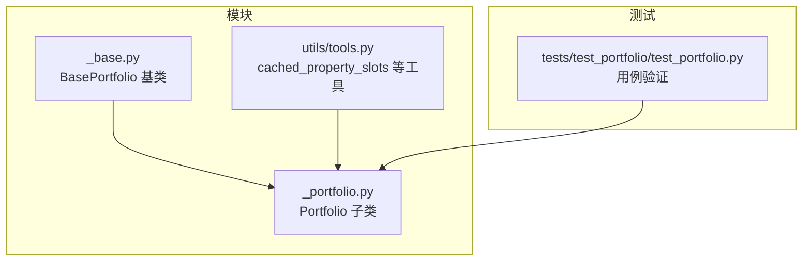
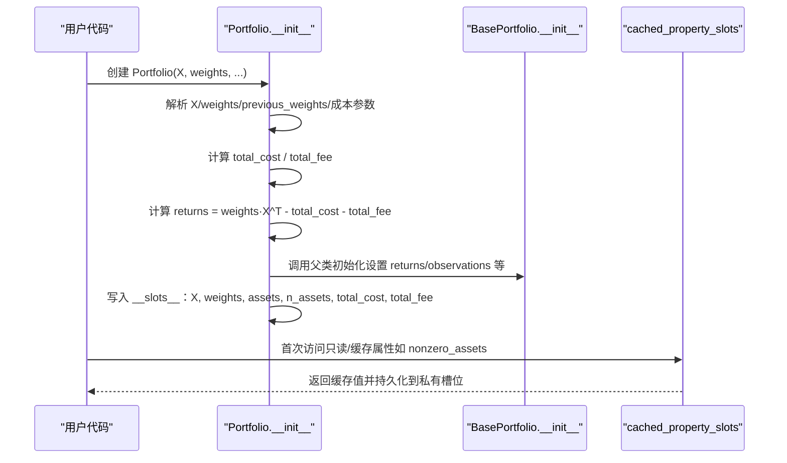
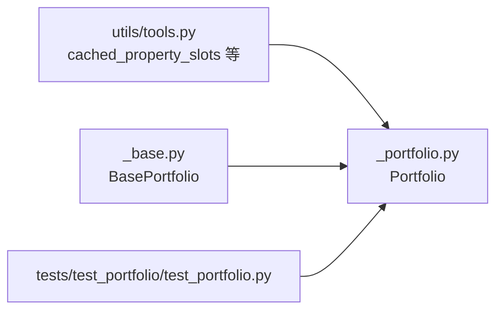

# 投资组合属性

<cite>
**本文引用的文件**
- [src/skfolio/portfolio/_portfolio.py](file://src/skfolio/portfolio/_portfolio.py)
- [src/skfolio/portfolio/_base.py](file://src/skfolio/portfolio/_base.py)
- [src/skfolio/utils/tools.py](file://src/skfolio/utils/tools.py)
- [tests/test_portfolio/test_portfolio.py](file://tests/test_portfolio/test_portfolio.py)
</cite>

## 目录
1. [简介](#简介)
2. [项目结构](#项目结构)
3. [核心组件](#核心组件)
4. [架构概览](#架构概览)
5. [详细组件分析](#详细组件分析)
6. [依赖分析](#依赖分析)
7. [性能考量](#性能考量)
8. [故障排查指南](#故障排查指南)
9. [结论](#结论)
10. [附录](#附录)

## 简介
本文件面向 skfolio 的 Portfolio 类，提供详尽的 API 参考与使用说明，重点聚焦于以下核心属性：
- X：资产收益率矩阵（形状为 n_observations × n_assets）
- weights：资产权重向量（长度为 n_assets）
- assets：资产名称数组（长度为 n_assets）
- n_assets：资产数量
- n_observations：观测数量
- total_cost：总交易成本
- total_fee：总管理费用

同时，本文将解释这些属性如何通过 __slots__ 实现内存优化与高性能访问，并给出从 Portfolio 对象中提取这些基本属性的示例路径与最佳实践。

## 项目结构
Portfolio 类位于 portfolio 模块中，继承自 BasePortfolio，后者在 __slots__ 中集中管理大量度量与缓存属性，以提升实例化速度、按需计算与缓存命中效率。

图表来源
- [src/skfolio/portfolio/_base.py](file://src/skfolio/portfolio/_base.py#L75-L120)
- [src/skfolio/portfolio/_portfolio.py](file://src/skfolio/portfolio/_portfolio.py#L30-L120)
- [src/skfolio/utils/tools.py](file://src/skfolio/utils/tools.py#L77-L116)
- [tests/test_portfolio/test_portfolio.py](file://tests/test_portfolio/test_portfolio.py#L190-L250)

章节来源
- [src/skfolio/portfolio/_base.py](file://src/skfolio/portfolio/_base.py#L75-L120)
- [src/skfolio/portfolio/_portfolio.py](file://src/skfolio/portfolio/_portfolio.py#L30-L120)

## 核心组件
- Portfolio：返回优化器 predict 的结果，是资产收益与权重的点积，满足凸优化问题的齐次性。
- BasePortfolio：提供统一的度量体系、缓存机制与 __slots__ 管理，确保高性能与内存友好。
- cached_property_slots：为 __slots__ 提供只读且带缓存的属性装饰器，避免重复计算。

章节来源
- [src/skfolio/portfolio/_portfolio.py](file://src/skfolio/portfolio/_portfolio.py#L30-L120)
- [src/skfolio/portfolio/_base.py](file://src/skfolio/portfolio/_base.py#L75-L120)
- [src/skfolio/utils/tools.py](file://src/skfolio/utils/tools.py#L77-L116)

## 架构概览
Portfolio 的核心数据流如下：构造函数接收 X（资产收益率）、weights（权重）、previous_weights（上期权重）、transaction_costs（交易成本）、management_fees（管理费），随后计算 total_cost 与 total_fee，并基于 weights 与 X 计算组合收益 returns。这些基础属性被保存在 __slots__ 中，作为只读或可读写属性，供后续度量与分析使用。

图表来源
- [src/skfolio/portfolio/_portfolio.py](file://src/skfolio/portfolio/_portfolio.py#L454-L603)
- [src/skfolio/portfolio/_base.py](file://src/skfolio/portfolio/_base.py#L486-L531)
- [src/skfolio/utils/tools.py](file://src/skfolio/utils/tools.py#L77-L116)

## 详细组件分析

### Portfolio.__slots__ 与只读属性清单
Portfolio 在 __slots__ 中显式声明了以下关键属性：
- 只读属性：X、weights、assets、n_assets、total_cost、total_fee、previous_weights、transaction_costs、management_fees
- 自定义只读缓存属性：_nonzero_assets、_nonzero_assets_index
- 可读写属性：fallback_chain

这些属性均通过只读策略保护，防止误修改；同时，部分属性（如 nonzero_assets）采用 cached_property_slots 进行首次访问后缓存，显著降低重复计算开销。

章节来源
- [src/skfolio/portfolio/_portfolio.py](file://src/skfolio/portfolio/_portfolio.py#L421-L452)

### Portfolio.__init__ 参数与属性赋值流程
- 输入解析
  - X：支持 DataFrame 或任意二维数组容器；若为 DataFrame，则列名作为资产名，索引作为观测标签；否则生成默认资产名与观测序列。
  - weights：支持数组、字典或 None；当为字典时要求 X 为 DataFrame 且列名一致。
  - previous_weights、transaction_costs、management_fees：支持标量或数组/字典，内部统一转换为长度为 n_assets 的数组。
- 计算与赋值
  - 计算 total_cost = Σ c_i × |w_i − w_prev_i|（仅当非零时生效）
  - 计算 total_fee = Σ f_i × w_i（仅当非零时生效）
  - 若提供 weights：returns = weights·X^T − total_cost − total_fee；否则返回全 NaN 的 returns
  - 将 X、assets、n_assets、weights、previous_weights、transaction_costs、management_fees、total_cost、total_fee、fallback_chain 写入 __slots__

章节来源
- [src/skfolio/portfolio/_portfolio.py](file://src/skfolio/portfolio/_portfolio.py#L454-L603)

### 核心属性详解与使用示例路径

- X（资产收益率）
  - 定义：形状为 (n_observations, n_assets) 的资产价格收益矩阵；若输入为 DataFrame，则列名为资产名，索引为观测标签。
  - 使用场景：用于计算组合收益 returns = weights·X^T − total_cost − total_fee；也可用于协方差、期望收益等衍生计算。
  - 示例路径
    - [构造 Portfolio 并传入 X](file://tests/test_portfolio/test_portfolio.py#L64-L67)
    - [从 X 推导 n_observations 与 n_assets](file://tests/test_portfolio/test_portfolio.py#L190-L209)
    - [从 X 计算协方差与期望收益](file://tests/test_portfolio/test_portfolio.py#L432-L451)

- weights（资产权重）
  - 定义：长度为 n_assets 的权重向量；支持字典映射到资产名（需 X 为 DataFrame）。
  - 使用场景：组合收益计算、权重字典映射、权重 per observation 展示、权重贡献分析等。
  - 示例路径
    - [构造时传入 weights](file://tests/test_portfolio/test_portfolio.py#L64-L67)
    - [权重字典映射 weights_dict](file://tests/test_portfolio/test_portfolio.py#L520-L528)
    - [权重 per observation 展示](file://tests/test_portfolio/test_portfolio.py#L485-L493)

- assets（资产名称）
  - 定义：长度为 n_assets 的资产名数组；若 X 非 DataFrame 则使用默认命名。
  - 使用场景：组合构成展示、权重字典映射、非零资产筛选等。
  - 示例路径
    - [默认资产名生成](file://src/skfolio/utils/tools.py#L696-L710)
    - [组合构成 composition（过滤零权重）](file://src/skfolio/portfolio/_portfolio.py#L724-L735)

- n_assets（资产数量）
  - 定义：资产总数；由 X 的列数决定。
  - 使用场景：度量汇总、有效资产数计算、约束校验等。
  - 示例路径
    - [断言 n_assets 与 X 形状一致](file://tests/test_portfolio/test_portfolio.py#L190-L209)
    - [有效资产数 effective_number_assets](file://src/skfolio/portfolio/_portfolio.py#L790-L809)

- n_observations（观测数量）
  - 定义：观测总数；由 X 的行数决定。
  - 使用场景：滚动窗口度量、时间序列可视化、样本权重校验等。
  - 示例路径
    - [断言 n_observations 与 X 形状一致](file://tests/test_portfolio/test_portfolio.py#L190-L209)
    - [滚动度量 rolling_measure](file://tests/test_portfolio/test_portfolio.py#L422-L431)

- total_cost（总交易成本）
  - 定义：Σ c_i × |w_i − w_prev_i|；仅当交易成本非零时计算。
  - 使用场景：调整组合收益、成本敏感的优化与回测。
  - 示例路径
    - [构造时计算 total_cost](file://src/skfolio/portfolio/_portfolio.py#L550-L559)
    - [组合收益中扣除 total_cost](file://src/skfolio/portfolio/_portfolio.py#L560-L564)

- total_fee（总管理费用）
  - 定义：Σ f_i × w_i；仅当管理费非零时计算。
  - 使用场景：调整组合收益、费用敏感的绩效归因。
  - 示例路径
    - [构造时计算 total_fee](file://src/skfolio/portfolio/_portfolio.py#L555-L559)
    - [组合收益中扣除 total_fee](file://src/skfolio/portfolio/_portfolio.py#L560-L564)

- nonzero_assets / nonzero_assets_index（非零资产）
  - 定义：绝对权重大于阈值的资产集合及其索引；阈值常量来自 BasePortfolio。
  - 使用场景：组合构成展示、贡献分析、稀疏权重处理。
  - 示例路径
    - [nonzero_assets 属性](file://src/skfolio/portfolio/_portfolio.py#L712-L723)
    - [nonzero_assets_index 属性](file://src/skfolio/portfolio/_portfolio.py#L712-L723)
    - [组合构成 composition（基于 nonzero_assets）](file://src/skfolio/portfolio/_portfolio.py#L724-L735)

- 组合收益 returns
  - 定义：由 weights 与 X 计算得到；若未提供 weights，则为全 NaN。
  - 使用场景：所有度量（均值、方差、夏普比率等）的基础。
  - 示例路径
    - [returns 计算与断言](file://tests/test_portfolio/test_portfolio.py#L190-L209)

章节来源
- [src/skfolio/portfolio/_portfolio.py](file://src/skfolio/portfolio/_portfolio.py#L454-L603)
- [src/skfolio/portfolio/_portfolio.py](file://src/skfolio/portfolio/_portfolio.py#L712-L735)
- [src/skfolio/utils/tools.py](file://src/skfolio/utils/tools.py#L696-L710)
- [tests/test_portfolio/test_portfolio.py](file://tests/test_portfolio/test_portfolio.py#L190-L250)

### __slots__ 与 cached_property_slots 的内存优化与高性能访问
- __slots__ 的作用
  - 显式声明属性槽位，避免使用字典存储，减少内存占用与实例化开销。
  - 限制可访问属性集合，增强只读保护与类型安全。
- cached_property_slots 的作用
  - 为只读属性提供“首次计算、后续缓存”的能力，私有槽位存储计算结果，避免重复计算。
  - 与 BasePortfolio 的动态度量加载机制配合，仅在访问时计算度量，进一步提升性能。
- 性能验证
  - 测试覆盖了多次访问同一度量的缓存命中与性能对比，证明缓存显著优于重复计算。

章节来源
- [src/skfolio/portfolio/_base.py](file://src/skfolio/portfolio/_base.py#L75-L120)
- [src/skfolio/utils/tools.py](file://src/skfolio/utils/tools.py#L77-L116)
- [tests/test_portfolio/test_portfolio.py](file://tests/test_portfolio/test_portfolio.py#L359-L405)

### 从 Portfolio 对象中提取基本属性的示例路径
- 获取 X 与 shape
  - [示例：构造 Portfolio 并断言 n_observations/n_assets](file://tests/test_portfolio/test_portfolio.py#L190-L209)
- 获取 weights 与权重字典
  - [示例：weights_dict 映射](file://tests/test_portfolio/test_portfolio.py#L520-L528)
- 获取 assets 与 nonzero 资产
  - [示例：nonzero_assets 与 composition](file://tests/test_portfolio/test_portfolio.py#L227-L239)
- 获取 n_observations 与 n_assets
  - [示例：n_observations 断言](file://tests/test_portfolio/test_portfolio.py#L190-L195)
- 获取 total_cost 与 total_fee
  - [示例：构造时计算与使用](file://src/skfolio/portfolio/_portfolio.py#L550-L564)
- 获取组合收益 returns
  - [示例：returns 与均值/标准差一致性](file://tests/test_portfolio/test_portfolio.py#L190-L209)

章节来源
- [tests/test_portfolio/test_portfolio.py](file://tests/test_portfolio/test_portfolio.py#L190-L250)
- [src/skfolio/portfolio/_portfolio.py](file://src/skfolio/portfolio/_portfolio.py#L550-L564)

## 依赖分析
Portfolio 的依赖关系主要体现在：
- 继承关系：Portfolio 继承自 BasePortfolio，复用其 __slots__、度量系统与缓存机制。
- 工具依赖：cached_property_slots 用于只读缓存属性；input_to_array/deduplicate_names/default_asset_names 等工具用于输入标准化与命名生成。
- 测试依赖：大量用例覆盖了属性一致性、缓存命中、只读保护与异常处理。

图表来源
- [src/skfolio/utils/tools.py](file://src/skfolio/utils/tools.py#L77-L116)
- [src/skfolio/portfolio/_portfolio.py](file://src/skfolio/portfolio/_portfolio.py#L30-L120)
- [src/skfolio/portfolio/_base.py](file://src/skfolio/portfolio/_base.py#L75-L120)
- [tests/test_portfolio/test_portfolio.py](file://tests/test_portfolio/test_portfolio.py#L190-L250)

章节来源
- [src/skfolio/utils/tools.py](file://src/skfolio/utils/tools.py#L77-L116)
- [src/skfolio/portfolio/_portfolio.py](file://src/skfolio/portfolio/_portfolio.py#L30-L120)
- [src/skfolio/portfolio/_base.py](file://src/skfolio/portfolio/_base.py#L75-L120)
- [tests/test_portfolio/test_portfolio.py](file://tests/test_portfolio/test_portfolio.py#L190-L250)

## 性能考量
- 内存优化
  - __slots__ 减少每个实例的内存占用，适合批量构建与大规模回测。
  - 只读属性与缓存属性避免重复计算，降低 CPU 开销。
- 计算效率
  - returns 的计算为线性代数操作，复杂度 O(n_observations × n_assets)，在合理规模下高效。
  - 度量按需计算与缓存，避免不必要的重复计算。
- 缓存策略
  - cached_property_slots 保证首次访问后缓存，后续访问直接命中。
  - 当全局或局部度量参数变化时，BasePortfolio 的缓存清理机制会重置相关度量，确保一致性。

章节来源
- [src/skfolio/portfolio/_base.py](file://src/skfolio/portfolio/_base.py#L576-L613)
- [src/skfolio/utils/tools.py](file://src/skfolio/utils/tools.py#L77-L116)
- [tests/test_portfolio/test_portfolio.py](file://tests/test_portfolio/test_portfolio.py#L359-L405)

## 故障排查指南
- 只读属性不可修改
  - 现象：尝试设置只读属性会抛出 AttributeError。
  - 处理：确认属性是否确为只读；如需变更，应在构造时传参或通过受支持的方式更新。
  - 参考路径：[只读属性保护](file://src/skfolio/portfolio/_portfolio.py#L421-L434)
- 删除不存在属性
  - 现象：删除不存在的属性会抛出 AttributeError。
  - 处理：检查属性名是否拼写正确；确认该属性是否在 __slots__ 中。
  - 参考路径：[删除属性异常处理](file://src/skfolio/portfolio/_base.py#L602-L613)
- returns 中出现 NaN
  - 现象：当未提供 weights 时，returns 全为 NaN；若提供 weights 但计算中出现 NaN，会抛出 ValueError。
  - 处理：确保 weights 合法且无 NaN；检查输入 X 与 weights 的维度匹配。
  - 参考路径：[returns 计算与校验](file://src/skfolio/portfolio/_portfolio.py#L560-L567)
- 样本权重错误
  - 现象：sample_weight 必须是一维数组且和为 1，否则抛出 ValueError。
  - 处理：确保长度与 n_observations 一致且和为 1。
  - 参考路径：[sample_weight 设置校验](file://src/skfolio/portfolio/_base.py#L665-L683)

章节来源
- [src/skfolio/portfolio/_portfolio.py](file://src/skfolio/portfolio/_portfolio.py#L421-L434)
- [src/skfolio/portfolio/_base.py](file://src/skfolio/portfolio/_base.py#L602-L613)
- [src/skfolio/portfolio/_portfolio.py](file://src/skfolio/portfolio/_portfolio.py#L560-L567)
- [src/skfolio/portfolio/_base.py](file://src/skfolio/portfolio/_base.py#L665-L683)

## 结论
Portfolio 类通过 __slots__ 与 cached_property_slots 的组合，实现了对核心属性（X、weights、assets、n_assets、n_observations、total_cost、total_fee）的高性能、内存友好的管理。构造阶段完成关键属性的解析与计算，运行阶段按需加载度量并缓存结果，既保证了易用性，又兼顾了性能与可维护性。建议在实际使用中：
- 明确输入格式（DataFrame 列名即资产名），确保资产与权重映射正确
- 合理设置交易成本与管理费，注意与收益周期的一致性
- 利用 nonzero_assets 与 composition 等便捷属性进行组合分析
- 通过只读保护与缓存机制，避免误改与重复计算

## 附录
- 相关 API 与方法
  - [expected_returns_from_assets](file://src/skfolio/portfolio/_portfolio.py#L811-L829)
  - [variance_from_assets](file://src/skfolio/portfolio/_portfolio.py#L831-L845)
  - [weights_dict / previous_weights_dict](file://src/skfolio/portfolio/_portfolio.py#L737-L751)
  - [weights_per_observation](file://src/skfolio/portfolio/_portfolio.py#L753-L763)
  - [effective_number_assets](file://src/skfolio/portfolio/_portfolio.py#L790-L809)