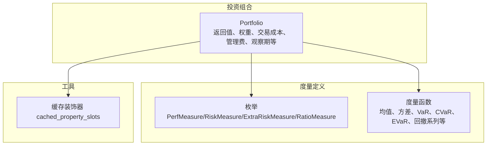
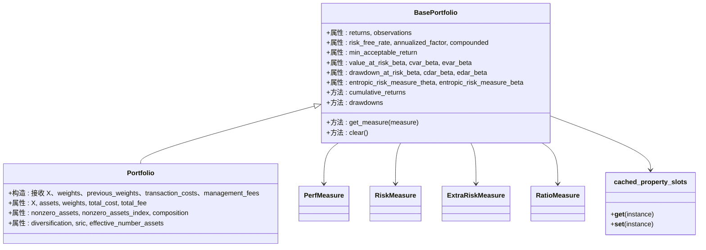
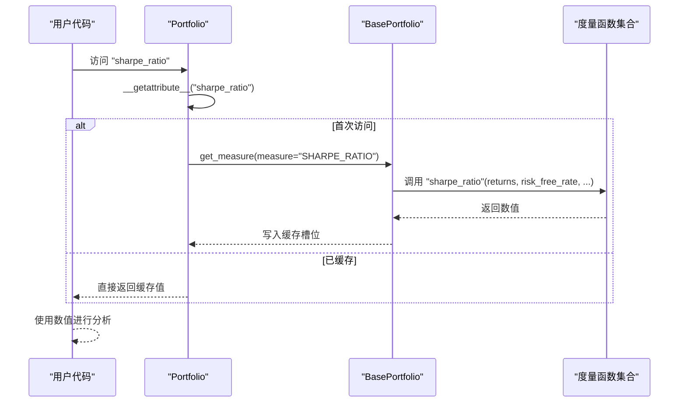
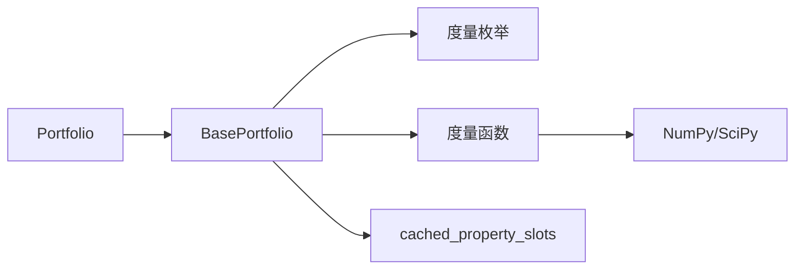

# 投资组合度量

<cite>
**本文引用的文件**
- [src/skfolio/portfolio/_base.py](file://src/skfolio/portfolio/_base.py)
- [src/skfolio/portfolio/_portfolio.py](file://src/skfolio/portfolio/_portfolio.py)
- [src/skfolio/measures/_enums.py](file://src/skfolio/measures/_enums.py)
- [src/skfolio/measures/_measures.py](file://src/skfolio/measures/_measures.py)
- [src/skfolio/utils/tools.py](file://src/skfolio/utils/tools.py)
- [tests/test_portfolio/test_portfolio.py](file://tests/test_portfolio/test_portfolio.py)
</cite>

## 目录
1. [简介](#简介)
2. [项目结构](#项目结构)
3. [核心组件](#核心组件)
4. [架构总览](#架构总览)
5. [详细组件分析](#详细组件分析)
6. [依赖关系分析](#依赖关系分析)
7. [性能考量](#性能考量)
8. [故障排查指南](#故障排查指南)
9. [结论](#结论)

## 简介
本文件为 skfolio 的 Portfolio 类提供详尽的 API 参考文档，聚焦于其 40 多项风险与绩效度量。内容涵盖：
- 收益度量（如均值、年化均值）
- 风险度量（如方差、标准差、半方差、半标准差、VaR、CVaR、EVaR、最大回撤、平均回撤、CDaR、EDaR、波动率等）
- 风险调整后收益比率（如夏普比率、索提诺比率、Calmar 比率等）

并系统解释以下关键参数对度量的影响：
- 全局参数：min_acceptable_return、risk_free_rate、annualized_factor
- 置信水平参数：value_at_risk_beta、cvar_beta、evar_beta、drawdown_at_risk_beta、cdar_beta、edar_beta、entropic_risk_measure_beta、entropic_risk_measure_theta

同时阐述 Portfolio 的惰性计算（lazy evaluation）与缓存机制如何显著提升性能。

## 项目结构
Portfolio 类位于 portfolio 子模块，度量定义在 measures 子模块，枚举类型在 measures/_enums.py 中，工具方法（含缓存装饰器）在 utils/tools.py 中。

图表来源
- [src/skfolio/portfolio/_base.py](file://src/skfolio/portfolio/_base.py#L1-L120)
- [src/skfolio/measures/_enums.py](file://src/skfolio/measures/_enums.py#L1-L120)
- [src/skfolio/measures/_measures.py](file://src/skfolio/measures/_measures.py#L1-L120)
- [src/skfolio/utils/tools.py](file://src/skfolio/utils/tools.py#L77-L116)

章节来源
- [src/skfolio/portfolio/_base.py](file://src/skfolio/portfolio/_base.py#L1-L120)
- [src/skfolio/measures/_enums.py](file://src/skfolio/measures/_enums.py#L1-L120)
- [src/skfolio/measures/_measures.py](file://src/skfolio/measures/_measures.py#L1-L120)
- [src/skfolio/utils/tools.py](file://src/skfolio/utils/tools.py#L77-L116)

## 核心组件
- Portfolio：封装投资组合的回报序列、权重、交易成本、管理费、观察期等，并暴露各类度量属性。
- BasePortfolio：通用基类，负责度量的动态生成、惰性计算与缓存清理。
- 枚举体系：将度量分为收益、风险、额外风险与比率四类，便于统一管理与映射。
- 度量函数：独立的纯函数，支持样本权重、偏估计等可选参数，确保复用与一致性。
- 缓存装饰器：cached_property_slots 实现“按需计算、结果缓存”的惰性求值。

章节来源
- [src/skfolio/portfolio/_portfolio.py](file://src/skfolio/portfolio/_portfolio.py#L1-L220)
- [src/skfolio/portfolio/_base.py](file://src/skfolio/portfolio/_base.py#L1-L120)
- [src/skfolio/measures/_enums.py](file://src/skfolio/measures/_enums.py#L1-L120)
- [src/skfolio/measures/_measures.py](file://src/skfolio/measures/_measures.py#L1-L120)
- [src/skfolio/utils/tools.py](file://src/skfolio/utils/tools.py#L77-L116)

## 架构总览
Portfolio 的度量体系由“基类 + 枚举 + 独立度量函数 + 工具装饰器”构成，遵循“按需计算、统一入口、可配置参数”的设计原则。

图表来源
- [src/skfolio/portfolio/_base.py](file://src/skfolio/portfolio/_base.py#L370-L800)
- [src/skfolio/portfolio/_portfolio.py](file://src/skfolio/portfolio/_portfolio.py#L420-L800)
- [src/skfolio/measures/_enums.py](file://src/skfolio/measures/_enums.py#L75-L359)
- [src/skfolio/utils/tools.py](file://src/skfolio/utils/tools.py#L77-L116)

## 详细组件分析

### 1) 收益度量（Performance Measures）
- 均值 mean：回报序列的算术平均。
- 年化均值 annualized_mean：通过 annualized_factor 进行平方根规则扩展。

章节来源
- [src/skfolio/measures/_enums.py](file://src/skfolio/measures/_enums.py#L75-L104)
- [src/skfolio/measures/_measures.py](file://src/skfolio/measures/_measures.py#L16-L48)
- [src/skfolio/portfolio/_base.py](file://src/skfolio/portfolio/_base.py#L100-L110)

### 2) 风险度量（Risk Measures）
- 方差 variance、半方差 semi_variance、标准差 standard_deviation、半标准差 semi_deviation
- 偏态 skew、峰度 kurtosis、四阶中心矩 fourth_central_moment、四阶下行矩 fourth_lower_partial_moment
- 最坏回报 worst_realization
- VaR（历史分位数）、CVaR（尾部期望）、EVaR（熵上界）
- 回撤系列：Drawdown at Risk（DaR）、CDaR（条件回撤）、最大回撤 max_drawdown、平均回撤 average_drawdown、EDaR（熵回撤）
- 波动率相关：波动率 ulcers_index、Gini 均值差 gini_mean_difference
- 其他：有效资产数 effective_number_assets

章节来源
- [src/skfolio/measures/_enums.py](file://src/skfolio/measures/_enums.py#L105-L247)
- [src/skfolio/measures/_measures.py](file://src/skfolio/measures/_measures.py#L133-L799)
- [src/skfolio/measures/_measures.py](file://src/skfolio/measures/_measures.py#L831-L1118)
- [src/skfolio/portfolio/_base.py](file://src/skfolio/portfolio/_base.py#L168-L370)

### 3) 风险调整后收益比率（Ratio Measures）
- 夏普比率 sharpe_ratio、年化夏普比率 annualized_sharpe_ratio
- 索提诺比率 sortino_ratio、年化索提诺比率 annualized_sortino_ratio
- Calmar 比率 calmar_ratio
- 各种比值：VaR 比率、CVaR 比率、EVaR 比率、最坏回报比率、DaR 比率、CDaR 比率、EDaR 比率、回撤平均比率、溃疡指数比率、GMD 比率、MAD 比率、一阶下行矩比率

章节来源
- [src/skfolio/measures/_enums.py](file://src/skfolio/measures/_enums.py#L249-L359)
- [src/skfolio/portfolio/_base.py](file://src/skfolio/portfolio/_base.py#L288-L370)

### 4) 关键参数与影响
- min_acceptable_return：用于区分“下行”与“上行”回报，影响半方差、半标准差、一阶下行矩、MAD、下行矩等。
- risk_free_rate：用于超额回报与比率计算（如夏普、索提诺、Calmar 等）。
- annualized_factor：平方根规则用于年化均值、方差、半方差、标准差、半标准差、夏普、索提诺等。
- 置信水平参数：
  - value_at_risk_beta、cvar_beta、evar_beta：VaR、CVaR、EVaR 的置信水平
  - drawdown_at_risk_beta、cdar_beta、edar_beta：DaR、CDaR、EDaR 的置信水平
  - entropic_risk_measure_beta、entropic_risk_measure_theta：熵风险度量的置信水平与风险厌恶参数

章节来源
- [src/skfolio/portfolio/_base.py](file://src/skfolio/portfolio/_base.py#L100-L167)
- [src/skfolio/portfolio/_portfolio.py](file://src/skfolio/portfolio/_portfolio.py#L133-L200)
- [src/skfolio/measures/_enums.py](file://src/skfolio/measures/_enums.py#L340-L359)

### 5) 惰性计算与缓存机制
- 按需计算：首次访问某个度量时，BasePortfolio 通过 get_measure 动态调用对应度量函数并写入缓存槽位。
- 统一入口：所有度量都以属性形式暴露，内部通过 __getattribute__ 检测未赋值槽位并触发计算。
- 清理策略：当全局或局部参数变化时，__setattr__ 调用 clear() 清空所有度量槽位，确保后续访问重新计算。
- 缓存装饰器：cached_property_slots 将“只读+带私有槽位”的属性包装为惰性缓存属性，避免重复计算。

图表来源
- [src/skfolio/portfolio/_base.py](file://src/skfolio/portfolio/_base.py#L576-L610)
- [src/skfolio/portfolio/_base.py](file://src/skfolio/portfolio/_base.py#L764-L840)
- [src/skfolio/utils/tools.py](file://src/skfolio/utils/tools.py#L77-L116)

章节来源
- [src/skfolio/portfolio/_base.py](file://src/skfolio/portfolio/_base.py#L576-L610)
- [src/skfolio/portfolio/_base.py](file://src/skfolio/portfolio/_base.py#L758-L763)
- [src/skfolio/utils/tools.py](file://src/skfolio/utils/tools.py#L77-L116)

### 6) 参数变更与缓存失效
- 当修改以下任一参数时，会触发 clear() 清空所有度量槽位：
  - 全局参数：returns、cumulative_returns、drawdowns、min_acceptable_return、compounded、risk_free_rate、sample_weight
  - 局部参数：value_at_risk_beta、cvar_beta、entropic_risk_measure_theta、entropic_risk_measure_beta、evar_beta、drawdown_at_risk_beta、cdar_beta、edar_beta
- 修改 annualized_factor 或 sample_weight 也会触发缓存清理。

章节来源
- [src/skfolio/portfolio/_base.py](file://src/skfolio/portfolio/_base.py#L377-L431)
- [src/skfolio/portfolio/_base.py](file://src/skfolio/portfolio/_base.py#L590-L601)
- [src/skfolio/portfolio/_base.py](file://src/skfolio/portfolio/_base.py#L655-L683)

### 7) 示例与验证（来自测试）
- 年化规则验证：annualized_mean、annualized_variance、annualized_semi_variance、annualized_standard_deviation、annualized_semi_deviation、annualized_sharpe_ratio、annualized_sortino_ratio
- 比率一致性：各比率 = mean / 对应风险度量（或 max_drawdown 等）
- 缓存性能：首次访问远慢于缓存访问，测试断言时间差异显著
- 样本权重：设置 sample_weight 后，CVaR 等度量发生变化
- 绘图与汇总：支持绘制累计回报、回撤、滚动指标等

章节来源
- [tests/test_portfolio/test_portfolio.py](file://tests/test_portfolio/test_portfolio.py#L153-L188)
- [tests/test_portfolio/test_portfolio.py](file://tests/test_portfolio/test_portfolio.py#L190-L226)
- [tests/test_portfolio/test_portfolio.py](file://tests/test_portfolio/test_portfolio.py#L359-L404)
- [tests/test_portfolio/test_portfolio.py](file://tests/test_portfolio/test_portfolio.py#L495-L507)

## 依赖关系分析
Portfolio 的度量计算依赖于 measures 模块中的具体函数，且通过枚举类型进行统一管理。工具层的 cached_property_slots 提供惰性缓存能力。

图表来源
- [src/skfolio/portfolio/_base.py](file://src/skfolio/portfolio/_base.py#L764-L840)
- [src/skfolio/measures/_measures.py](file://src/skfolio/measures/_measures.py#L1-L120)
- [src/skfolio/utils/tools.py](file://src/skfolio/utils/tools.py#L77-L116)

章节来源
- [src/skfolio/portfolio/_base.py](file://src/skfolio/portfolio/_base.py#L764-L840)
- [src/skfolio/measures/_measures.py](file://src/skfolio/measures/_measures.py#L1-L120)
- [src/skfolio/utils/tools.py](file://src/skfolio/utils/tools.py#L77-L116)

## 性能考量
- 惰性计算：仅在首次访问时计算，后续直接从缓存读取，显著降低重复计算开销。
- 缓存装饰器：cached_property_slots 将“只读+带私有槽位”的属性包装为惰性缓存属性，避免重复计算。
- 清理策略：参数变化自动清空缓存，保证结果正确性与一致性。
- 年化规则：通过 annualized_factor 与平方根规则快速转换，避免重复统计计算。
- 样本权重：支持非均匀观测权重，避免额外数据重采样，提高灵活性。

章节来源
- [src/skfolio/portfolio/_base.py](file://src/skfolio/portfolio/_base.py#L576-L610)
- [src/skfolio/portfolio/_base.py](file://src/skfolio/portfolio/_base.py#L655-L683)
- [src/skfolio/utils/tools.py](file://src/skfolio/utils/tools.py#L77-L116)
- [tests/test_portfolio/test_portfolio.py](file://tests/test_portfolio/test_portfolio.py#L359-L404)

## 故障排查指南
- 访问未定义属性：删除不存在的属性会抛出 AttributeError。
- 只读属性：尝试设置只读属性（如 returns、observations）会抛出 AttributeError。
- 样本权重错误：长度不匹配、不求和为 1、维度不为 1D 时会抛出 ValueError。
- NaN 传播：部分度量函数对 NaN 有明确处理策略，若输入全为 NaN，可能返回 NaN；建议检查数据质量。
- 缓存未更新：修改全局或局部参数后，度量值未变化，需确认是否已触发 clear() 或重新访问属性。

章节来源
- [tests/test_portfolio/test_portfolio.py](file://tests/test_portfolio/test_portfolio.py#L406-L420)
- [tests/test_portfolio/test_portfolio.py](file://tests/test_portfolio/test_portfolio.py#L509-L518)
- [src/skfolio/portfolio/_base.py](file://src/skfolio/portfolio/_base.py#L590-L601)

## 结论
Portfolio 类通过“基类 + 枚举 + 独立度量函数 + 缓存装饰器”的架构，实现了对 40+ 项风险与绩效度量的统一管理与高效计算。其惰性计算与缓存机制在保证正确性的同时，显著提升了性能；全局与局部参数的清晰划分使得度量计算具备高度可配置性。配合测试用例与示例，用户可以安全、可靠地进行投资组合分析与优化。