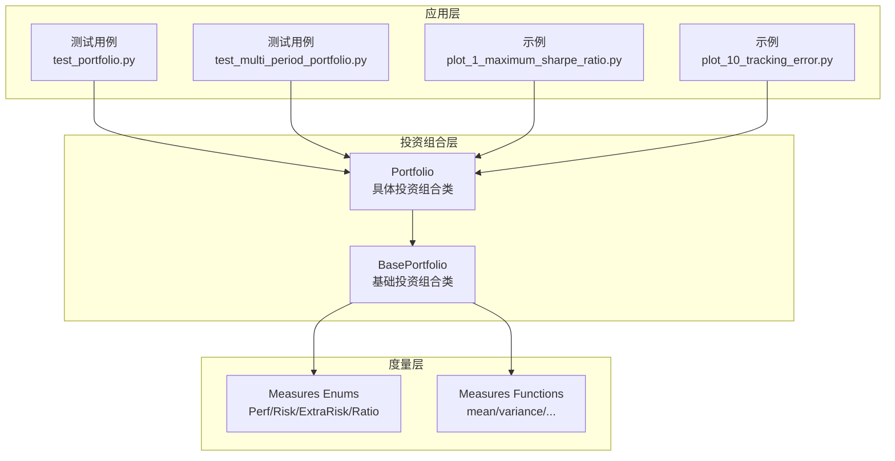
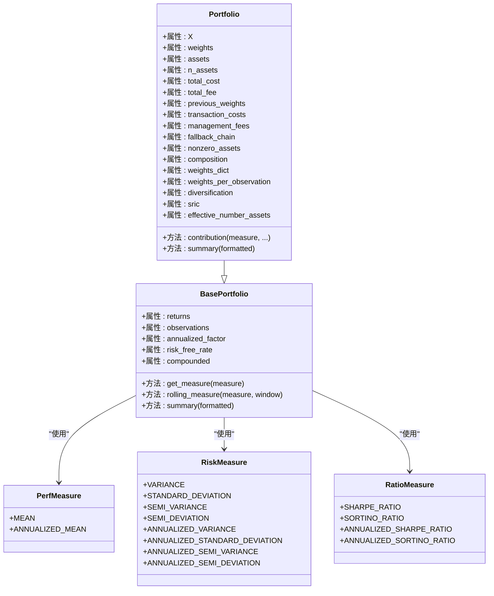
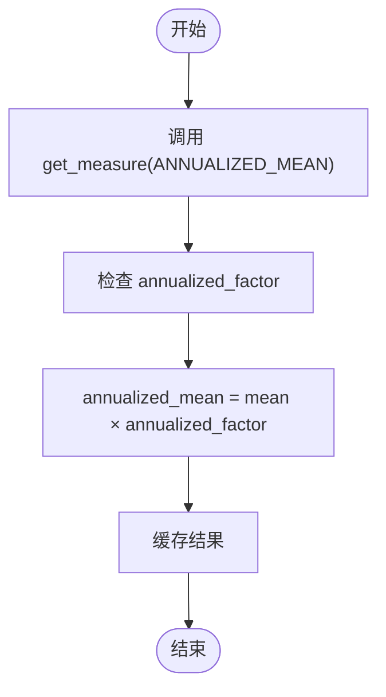
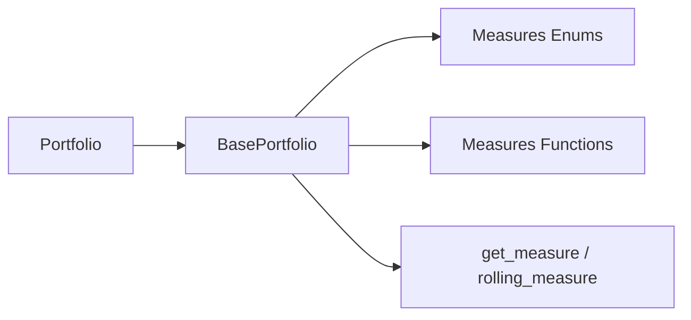

# 收益度量

<cite>
**本文引用的文件**
- [src/skfolio/portfolio/_portfolio.py](file://src/skfolio/portfolio/_portfolio.py)
- [src/skfolio/portfolio/_base.py](file://src/skfolio/portfolio/_base.py)
- [src/skfolio/measures/_enums.py](file://src/skfolio/measures/_enums.py)
- [src/skfolio/measures/_measures.py](file://src/skfolio/measures/_measures.py)
- [tests/test_portfolio/test_portfolio.py](file://tests/test_portfolio/test_portfolio.py)
- [tests/test_portfolio/test_multi_period_portfolio.py](file://tests/test_portfolio/test_multi_period_portfolio.py)
- [examples/mean_risk/plot_1_maximum_sharpe_ratio.py](file://examples/mean_risk/plot_1_maximum_sharpe_ratio.py)
- [examples/mean_risk/plot_10_tracking_error.py](file://examples/mean_risk/plot_10_tracking_error.py)
</cite>

## 目录
1. [引言](#引言)
2. [项目结构](#项目结构)
3. [核心组件](#核心组件)
4. [架构总览](#架构总览)
5. [详细组件分析](#详细组件分析)
6. [依赖关系分析](#依赖关系分析)
7. [性能考量](#性能考量)
8. [故障排查指南](#故障排查指南)
9. [结论](#结论)
10. [附录](#附录)

## 引言
本章节聚焦于 Portfolio 类中实现的各类收益度量，尤其是总收益（total_return）、平均收益（mean）、年化收益（annualized_mean）等。我们将从数学定义、计算方法、属性访问方式、annualized_factor 参数对年化收益的影响，以及与风险和比率指标的关系入手，结合测试与示例，说明这些度量在投资组合评估、回测与绩效分析中的实际应用。

## 项目结构
围绕收益度量的相关模块与文件如下：
- 投资组合类：Portfolio 与 BasePortfolio
- 度量枚举：PerfMeasure、RiskMeasure、ExtraRiskMeasure、RatioMeasure
- 度量函数：均值、方差、半方差、标准差、半标准差、偏度、峰度、VaR、CVaR、最大回撤、夏普比率、索提诺比率等
- 测试用例：验证收益度量与年化规则
- 示例：展示如何访问属性并进行分析

图表来源
- [src/skfolio/portfolio/_portfolio.py](file://src/skfolio/portfolio/_portfolio.py#L1-L120)
- [src/skfolio/portfolio/_base.py](file://src/skfolio/portfolio/_base.py#L1-L120)
- [src/skfolio/measures/_enums.py](file://src/skfolio/measures/_enums.py#L1-L120)
- [src/skfolio/measures/_measures.py](file://src/skfolio/measures/_measures.py#L1-L120)
- [tests/test_portfolio/test_portfolio.py](file://tests/test_portfolio/test_portfolio.py#L150-L225)
- [tests/test_portfolio/test_multi_period_portfolio.py](file://tests/test_portfolio/test_multi_period_portfolio.py#L232-L295)
- [examples/mean_risk/plot_1_maximum_sharpe_ratio.py](file://examples/mean_risk/plot_1_maximum_sharpe_ratio.py#L70-L120)
- [examples/mean_risk/plot_10_tracking_error.py](file://examples/mean_risk/plot_10_tracking_error.py#L88-L128)

章节来源
- [src/skfolio/portfolio/_portfolio.py](file://src/skfolio/portfolio/_portfolio.py#L1-L220)
- [src/skfolio/portfolio/_base.py](file://src/skfolio/portfolio/_base.py#L1-L120)
- [src/skfolio/measures/_enums.py](file://src/skfolio/measures/_enums.py#L1-L120)
- [src/skfolio/measures/_measures.py](file://src/skfolio/measures/_measures.py#L1-L120)

## 核心组件
- Portfolio：由优化器预测返回的投资组合对象，封装了资产价格收益与权重，计算并缓存各类收益与风险度量。
- BasePortfolio：提供度量的动态获取、缓存、滚动窗口计算、汇总与可视化等通用能力。
- PerfMeasure/RiskMeasure/ExtraRiskMeasure/RatioMeasure：统一的度量枚举，支持是否年化、非年化互转、链接风险度量等。
- measures 函数：提供均值、方差、半方差、标准差、半标准差、偏度、峰度、VaR、CVaR、最大回撤等具体计算。

章节来源
- [src/skfolio/portfolio/_portfolio.py](file://src/skfolio/portfolio/_portfolio.py#L1-L220)
- [src/skfolio/portfolio/_base.py](file://src/skfolio/portfolio/_base.py#L1-L200)
- [src/skfolio/measures/_enums.py](file://src/skfolio/measures/_enums.py#L75-L120)
- [src/skfolio/measures/_measures.py](file://src/skfolio/measures/_measures.py#L1-L120)

## 架构总览
Portfolio 通过 BasePortfolio 的“按需计算 + 缓存”的机制，将度量作为类属性动态生成。度量函数来自 measures 模块，度量枚举用于标识度量类型与年化规则。annualized_factor 决定年化收益与波动率的缩放方式。

图表来源
- [src/skfolio/portfolio/_base.py](file://src/skfolio/portfolio/_base.py#L370-L520)
- [src/skfolio/portfolio/_portfolio.py](file://src/skfolio/portfolio/_portfolio.py#L420-L520)
- [src/skfolio/measures/_enums.py](file://src/skfolio/measures/_enums.py#L75-L359)

## 详细组件分析

### 总收益（total_return）
- 数学定义与含义
  - 总收益通常指投资组合在持有期内的累计回报。Portfolio 返回的是每日或每期的组合收益序列（returns），而非单一的总收益数值。若要得到总收益，可基于 returns 计算复合或算术累计收益。
- 计算与访问
  - Portfolio/Population 提供 returns 属性；也可通过累积收益函数得到复合或算术累计收益。
  - 可通过累积收益属性与绘图接口进行可视化分析。
- 在示例中的应用
  - 示例展示了如何打印年化夏普比率、绘制累计收益曲线等，体现对 returns 的直接使用与衍生指标的计算。

章节来源
- [src/skfolio/portfolio/_base.py](file://src/skfolio/portfolio/_base.py#L697-L744)
- [examples/mean_risk/plot_1_maximum_sharpe_ratio.py](file://examples/mean_risk/plot_1_maximum_sharpe_ratio.py#L70-L120)

### 平均收益（mean）
- 数学定义与含义
  - 均值是收益分布的中心趋势度量，反映投资组合的期望回报水平。
- 计算与访问
  - Portfolio/Population 提供 mean 属性，内部调用 measures 中的 mean 函数，支持样本加权与 NaN 处理策略。
- 在示例中的应用
  - 示例与测试用例多次使用 mean 进行比率计算（如夏普比率、索提诺比率）。

章节来源
- [src/skfolio/measures/_measures.py](file://src/skfolio/measures/_measures.py#L16-L48)
- [tests/test_portfolio/test_portfolio.py](file://tests/test_portfolio/test_portfolio.py#L190-L225)
- [tests/test_portfolio/test_multi_period_portfolio.py](file://tests/test_portfolio/test_multi_period_portfolio.py#L263-L295)

### 年化收益（annualized_mean）
- 数学定义与含义
  - 年化收益是将周期平均收益线性外推到一年的度量，常用于跨频率比较。Portfolio 默认采用线性年化因子 annualized_factor（默认 252）。
- 计算与访问
  - BasePortfolio 的 get_measure 对 ANNUALIZED_MEAN 做乘法处理：annualized_mean = mean × annualized_factor。
  - annualized_factor 可在构造时设置，且修改后会清空相关度量缓存以确保一致性。
- annualized_factor 参数的影响
  - 不同市场日历（日、月、年）应选择合适的 annualized_factor，以保证不同频率下的可比性。
  - 测试用例验证了 annualized_factor 的默认值与线性缩放规则。

图表来源
- [src/skfolio/portfolio/_base.py](file://src/skfolio/portfolio/_base.py#L764-L820)

章节来源
- [src/skfolio/portfolio/_base.py](file://src/skfolio/portfolio/_base.py#L655-L664)
- [src/skfolio/portfolio/_base.py](file://src/skfolio/portfolio/_base.py#L764-L820)
- [tests/test_portfolio/test_portfolio.py](file://tests/test_portfolio/test_portfolio.py#L153-L187)
- [tests/test_portfolio/test_multi_period_portfolio.py](file://tests/test_portfolio/test_multi_period_portfolio.py#L232-L260)

### 年化收益与波动率的关系
- 年化收益与波动率的平方根规则
  - 对于波动率（标准差、半标准差）与比率（夏普、索提诺）采用平方根缩放：annualized_value = value × sqrt(annualized_factor)。
  - 对于收益与方差采用线性缩放：annualized_value = value × annualized_factor。
- 实现细节
  - BasePortfolio 在 get_measure 与 rolling_measure 中根据度量类型分别执行线性或平方根缩放。

章节来源
- [src/skfolio/portfolio/_base.py](file://src/skfolio/portfolio/_base.py#L790-L820)
- [src/skfolio/portfolio/_base.py](file://src/skfolio/portfolio/_base.py#L898-L933)
- [tests/test_portfolio/test_portfolio.py](file://tests/test_portfolio/test_portfolio.py#L153-L187)
- [tests/test_portfolio/test_multi_period_portfolio.py](file://tests/test_portfolio/test_multi_period_portfolio.py#L232-L260)

### 收益度量与其他风险和比率指标的关系
- 夏普比率（Sharpe Ratio）
  - 定义：(mean - risk_free_rate) / standard_deviation
  - 年化版本：annualized_sharpe_ratio = sharpe_ratio × sqrt(annualized_factor)
- 索提诺比率（Sortino Ratio）
  - 定义：(mean - risk_free_rate) / semi_deviation
  - 年化版本：annualized_sortino_ratio = sortino_ratio × sqrt(annualized_factor)
- 其他比率指标
  - 包括 VaR 比率、CVaR 比率、最大回撤比率、CDaR 比率、EDaR 比率、溃疡指数比率、Gini 差异比率等，均以“超额收益/风险度量”形式定义。

章节来源
- [src/skfolio/measures/_enums.py](file://src/skfolio/measures/_enums.py#L249-L359)
- [src/skfolio/portfolio/_base.py](file://src/skfolio/portfolio/_base.py#L810-L820)
- [tests/test_portfolio/test_portfolio.py](file://tests/test_portfolio/test_portfolio.py#L190-L225)
- [tests/test_portfolio/test_multi_period_portfolio.py](file://tests/test_portfolio/test_multi_period_portfolio.py#L263-L295)

### 在回测与绩效分析中的实际应用场景
- 回测阶段
  - 使用 Portfolio 返回的 returns 进行累计收益曲线绘制、最大回撤、滚动夏普比率等分析。
- 绩效评估
  - 通过 summary 输出包含年化与非年化指标的完整报告，便于横向对比不同策略。
- 示例实践
  - 最大夏普比率示例：打印年化夏普比率、绘制累计收益曲线、汇总策略表现。
  - 跟踪误差示例：计算跟踪误差（RMSE）并与 CVaR、CVaR 比率联动分析。

章节来源
- [examples/mean_risk/plot_1_maximum_sharpe_ratio.py](file://examples/mean_risk/plot_1_maximum_sharpe_ratio.py#L70-L120)
- [examples/mean_risk/plot_10_tracking_error.py](file://examples/mean_risk/plot_10_tracking_error.py#L88-L128)

## 依赖关系分析
- Portfolio 依赖 BasePortfolio 提供的度量框架与缓存机制。
- BasePortfolio 依赖 measures 枚举与函数，按需调用具体计算。
- 年化规则由 BasePortfolio 的 get_measure/rolling_measure 统一处理，避免重复逻辑。

图表来源
- [src/skfolio/portfolio/_portfolio.py](file://src/skfolio/portfolio/_portfolio.py#L420-L520)
- [src/skfolio/portfolio/_base.py](file://src/skfolio/portfolio/_base.py#L764-L933)
- [src/skfolio/measures/_enums.py](file://src/skfolio/measures/_enums.py#L75-L359)
- [src/skfolio/measures/_measures.py](file://src/skfolio/measures/_measures.py#L1-L120)

章节来源
- [src/skfolio/portfolio/_portfolio.py](file://src/skfolio/portfolio/_portfolio.py#L420-L520)
- [src/skfolio/portfolio/_base.py](file://src/skfolio/portfolio/_base.py#L764-L933)

## 性能考量
- 按需计算与缓存
  - BasePortfolio 仅在首次访问度量时计算，并将其缓存至 __slots__，后续访问直接返回缓存值，显著降低重复计算成本。
- 年化因子变更
  - 修改 annualized_factor 会触发度量缓存清理，确保后续计算使用新的缩放规则。
- 滚动窗口计算
  - rolling_measure 将度量函数应用于滑动窗口，同时根据是否年化对结果进行线性或平方根缩放，适合动态监控。

章节来源
- [src/skfolio/portfolio/_base.py](file://src/skfolio/portfolio/_base.py#L576-L613)
- [src/skfolio/portfolio/_base.py](file://src/skfolio/portfolio/_base.py#L655-L664)
- [src/skfolio/portfolio/_base.py](file://src/skfolio/portfolio/_base.py#L898-L933)

## 故障排查指南
- 年化因子未生效
  - 确认 annualized_factor 是否正确传入构造函数或是否被修改；修改后需等待重新计算。
- 指标为空或异常
  - 检查输入数据是否存在全 NaN 或长度不一致；BasePortfolio 在度量计算失败时会发出警告并返回 NaN。
- 比率指标异常
  - 确保分母风险度量非零；若为零，比率可能为无穷大或 NaN。

章节来源
- [src/skfolio/portfolio/_base.py](file://src/skfolio/portfolio/_base.py#L800-L810)

## 结论
Portfolio 通过统一的度量框架与年化规则，提供了覆盖收益、风险与比率的完整指标体系。annualized_factor 是连接周期收益与年化收益的关键参数，直接影响波动率与比率的年化缩放。配合滚动窗口与汇总输出，Portfolio 能够高效支撑回测与绩效分析场景。

## 附录
- 如何访问收益度量
  - 直接访问属性：mean、annualized_mean、standard_deviation、semi_deviation、sharpe_ratio、sortino_ratio、annualized_sharpe_ratio、annualized_sortino_ratio 等。
  - 使用 summary 获取完整报告；使用 rolling_measure 获取滚动指标序列。
- 示例参考
  - 最大夏普比率与跟踪误差示例展示了属性访问与可视化流程。

章节来源
- [examples/mean_risk/plot_1_maximum_sharpe_ratio.py](file://examples/mean_risk/plot_1_maximum_sharpe_ratio.py#L70-L120)
- [examples/mean_risk/plot_10_tracking_error.py](file://examples/mean_risk/plot_10_tracking_error.py#L88-L128)