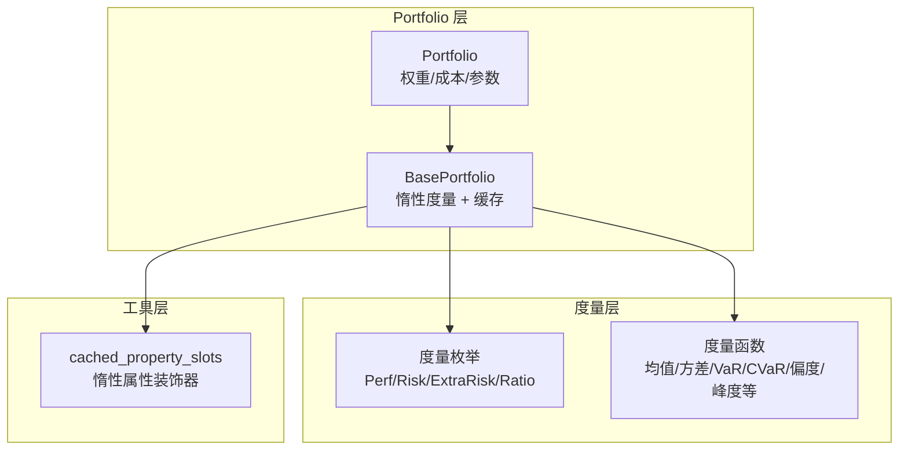
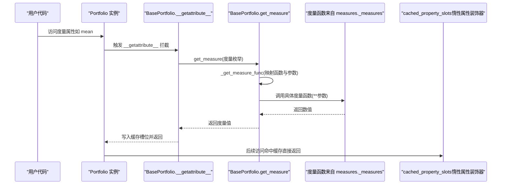
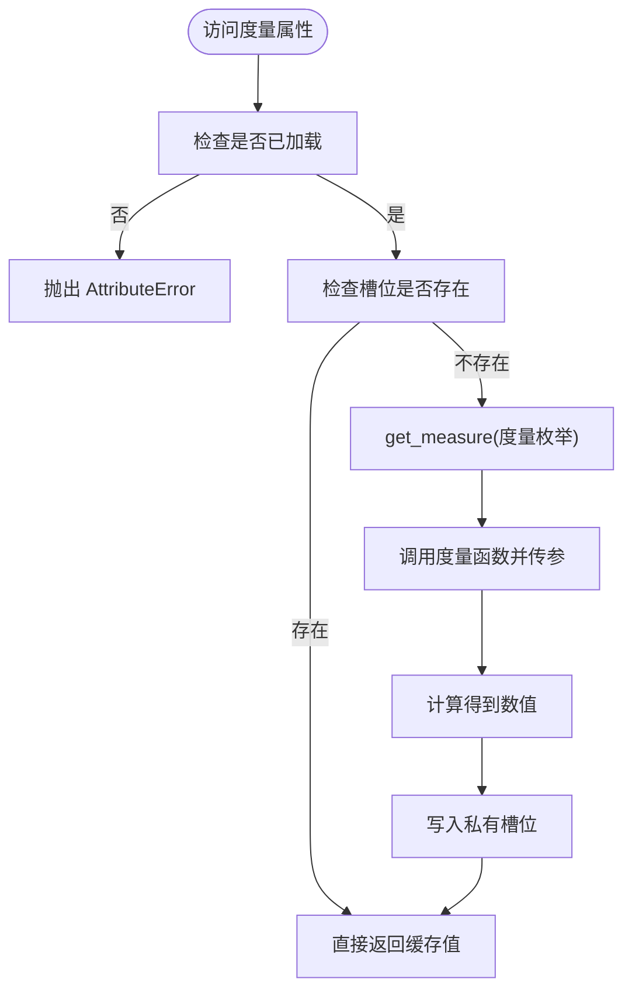
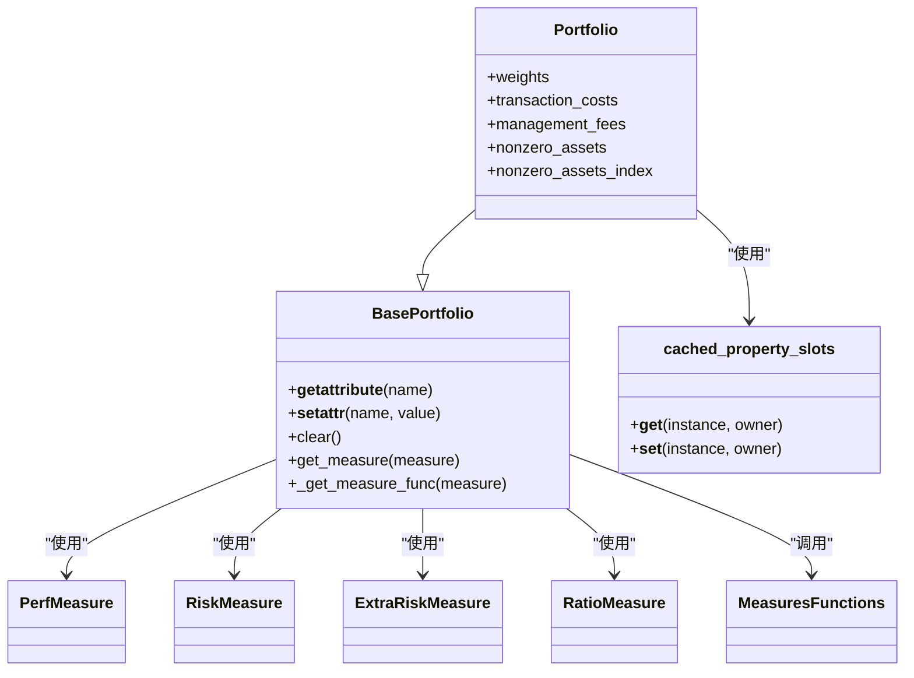

# 计算机制与性能优化

<cite>
**本文引用的文件列表**
- [src/skfolio/portfolio/_base.py](file://src/skfolio/portfolio/_base.py)
- [src/skfolio/portfolio/_portfolio.py](file://src/skfolio/portfolio/_portfolio.py)
- [src/skfolio/utils/tools.py](file://src/skfolio/utils/tools.py)
- [src/skfolio/measures/_enums.py](file://src/skfolio/measures/_enums.py)
- [src/skfolio/measures/_measures.py](file://src/skfolio/measures/_measures.py)
- [tests/test_portfolio/test_portfolio.py](file://tests/test_portfolio/test_portfolio.py)
- [tests/test_portfolio/test_failed_portfolio.py](file://tests/test_portfolio/test_failed_portfolio.py)
</cite>

## 目录
1. [引言](#引言)
2. [项目结构](#项目结构)
3. [核心组件](#核心组件)
4. [架构总览](#架构总览)
5. [详细组件分析](#详细组件分析)
6. [依赖关系分析](#依赖关系分析)
7. [性能考量](#性能考量)
8. [故障排查指南](#故障排查指南)
9. [结论](#结论)
10. [附录](#附录)

## 引言
本文件围绕 Portfolio 度量的“惰性计算（lazy evaluation）+ 缓存（cache）”机制进行系统化解析，重点回答以下问题：
- 为什么 Portfolio 在创建时不立即计算所有度量？而是首次访问时才按需计算并缓存？
- 这种设计如何避免不必要的重复计算，显著提升大规模回测场景下的性能表现？
- 如何通过状态标记与清理机制管理度量的有效性？例如 BasePortfolio 中的“已加载”状态、属性变更时的缓存失效策略，以及与 Portfolio 类中自定义属性 getter 的协作。
- 如何在动态调整投资组合权重或参数后，正确触发度量的重新计算？

通过对源码的逐层剖析，我们将给出可操作的最佳实践建议，并辅以可视化图示帮助读者快速建立整体认知。

## 项目结构
围绕 Portfolio 惰性计算与缓存的关键模块包括：
- portfolio/_base.py：定义 BasePortfolio 基类，负责度量的动态生成、惰性访问、缓存与失效策略。
- portfolio/_portfolio.py：继承 BasePortfolio，扩展投资组合特有的属性（如权重、交易成本、管理费等），并提供汇总与贡献分析等方法。
- utils/tools.py：提供 cached_property_slots 装饰器与通用工具，支撑惰性属性与缓存。
- measures/_enums.py：定义度量枚举（性能、风险、比率、额外风险），用于统一度量标识与映射。
- measures/_measures.py：实现各类度量函数（均值、方差、VaR、CVaR、偏度、峰度等），作为度量计算的底层实现。
- tests/test_portfolio/test_portfolio.py 等：验证惰性计算、缓存有效性、参数变更导致的缓存失效等行为。

图表来源
- [src/skfolio/portfolio/_base.py](file://src/skfolio/portfolio/_base.py#L576-L820)
- [src/skfolio/portfolio/_portfolio.py](file://src/skfolio/portfolio/_portfolio.py#L454-L603)
- [src/skfolio/measures/_enums.py](file://src/skfolio/measures/_enums.py#L75-L359)
- [src/skfolio/measures/_measures.py](file://src/skfolio/measures/_measures.py#L1-L200)
- [src/skfolio/utils/tools.py](file://src/skfolio/utils/tools.py#L77-L116)

章节来源
- [src/skfolio/portfolio/_base.py](file://src/skfolio/portfolio/_base.py#L576-L820)
- [src/skfolio/portfolio/_portfolio.py](file://src/skfolio/portfolio/_portfolio.py#L454-L603)
- [src/skfolio/measures/_enums.py](file://src/skfolio/measures/_enums.py#L75-L359)
- [src/skfolio/measures/_measures.py](file://src/skfolio/measures/_measures.py#L1-L200)
- [src/skfolio/utils/tools.py](file://src/skfolio/utils/tools.py#L77-L116)

## 核心组件
- BasePortfolio
  - 使用 __slots__ 存储度量与参数，避免字典开销，加速实例化与访问。
  - 通过 __getattribute__ 动态拦截未赋值的度量属性，首次访问时调用 get_measure 执行计算并写入缓存槽位。
  - 通过 __setattr__ 拦截全局/局部度量参数的变更，触发 clear 清理所有度量槽位，确保后续访问时重新计算。
  - 提供 clear 方法，显式删除度量槽位，配合 __getattribute__ 的惰性机制实现“失效-重建”的缓存策略。
  - 提供 _get_measure_func 将度量枚举映射到 measures 模块的具体函数，并从类属性中收集参数。
- Portfolio
  - 继承 BasePortfolio，增加权重、交易成本、管理费、前一权重等投资组合特有属性。
  - 重载部分属性为只读，防止误改；同时提供自定义属性 getter（如 nonzero_assets、nonzero_assets_index）并使用 cached_property_slots 缓存。
  - 在构造阶段仅计算必要的组合收益，不预计算全部度量，从而降低初始化成本。
- cached_property_slots
  - 自定义惰性属性装饰器，将计算结果存储在私有槽位中，后续访问直接返回缓存值。
- 度量枚举与函数
  - 枚举定义了所有可用度量及其分类（性能、风险、比率、额外风险），支持年化版本与非年化版本的转换。
  - 度量函数实现具体数学公式，作为 get_measure 的底层执行体。

章节来源
- [src/skfolio/portfolio/_base.py](file://src/skfolio/portfolio/_base.py#L576-L820)
- [src/skfolio/portfolio/_portfolio.py](file://src/skfolio/portfolio/_portfolio.py#L454-L603)
- [src/skfolio/utils/tools.py](file://src/skfolio/utils/tools.py#L77-L116)
- [src/skfolio/measures/_enums.py](file://src/skfolio/measures/_enums.py#L75-L359)
- [src/skfolio/measures/_measures.py](file://src/skfolio/measures/_measures.py#L1-L200)

## 架构总览
下面的序列图展示了 Portfolio 首次访问度量时的完整流程：从属性访问到度量函数计算再到缓存写入。

图表来源
- [src/skfolio/portfolio/_base.py](file://src/skfolio/portfolio/_base.py#L576-L820)
- [src/skfolio/measures/_measures.py](file://src/skfolio/measures/_measures.py#L1-L200)
- [src/skfolio/utils/tools.py](file://src/skfolio/utils/tools.py#L77-L116)

章节来源
- [src/skfolio/portfolio/_base.py](file://src/skfolio/portfolio/_base.py#L576-L820)
- [src/skfolio/measures/_measures.py](file://src/skfolio/measures/_measures.py#L1-L200)
- [src/skfolio/utils/tools.py](file://src/skfolio/utils/tools.py#L77-L116)

## 详细组件分析

### 惰性计算与缓存机制（BasePortfolio）
- 动态属性拦截与惰性求值
  - __getattribute__ 对未赋值的度量属性进行拦截，调用 get_measure 计算并写入缓存槽位，随后返回。
  - 这保证了只有真正需要的度量才会被计算，避免初始化时的大量重复计算。
- 缓存策略
  - cached_property_slots 将计算结果保存在私有槽位中，后续访问直接命中缓存，显著降低重复计算成本。
  - clear 方法删除所有度量槽位，使下一次访问重新触发计算。
- 参数变更与缓存失效
  - __setattr__ 拦截“全局度量参数”和“局部度量参数”的变更，自动调用 clear 清理缓存，确保度量基于最新参数重新计算。
  - 全局参数集合与局部参数集合由类常量维护，确保覆盖所有可能影响度量计算的输入。

图表来源
- [src/skfolio/portfolio/_base.py](file://src/skfolio/portfolio/_base.py#L576-L820)
- [src/skfolio/utils/tools.py](file://src/skfolio/utils/tools.py#L77-L116)

章节来源
- [src/skfolio/portfolio/_base.py](file://src/skfolio/portfolio/_base.py#L576-L820)
- [src/skfolio/utils/tools.py](file://src/skfolio/utils/tools.py#L77-L116)

### Portfolio 特有属性与只读约束
- Portfolio 在构造阶段仅完成必要计算（组合收益、交易成本与管理费合计），不预计算度量，从而降低初始化时间。
- 多个属性被声明为只读，防止误改；同时提供自定义属性 getter（如 nonzero_assets、nonzero_assets_index），并使用 cached_property_slots 缓存中间结果，减少重复计算。

章节来源
- [src/skfolio/portfolio/_portfolio.py](file://src/skfolio/portfolio/_portfolio.py#L454-L603)
- [src/skfolio/portfolio/_portfolio.py](file://src/skfolio/portfolio/_portfolio.py#L711-L723)

### 度量函数与参数映射
- get_measure 会根据度量类型（性能、风险、额外风险、比率）选择不同的计算路径：
  - 性能/风险/额外风险：调用对应度量函数，必要时乘以年化因子。
  - 比率：先获取均值（考虑年化），再获取对应的“链接风险度量”，最后计算比率。
- _get_measure_func 将度量枚举映射到 measures 模块的函数，并从类属性中收集参数：
  - 全局参数：如 returns、cumulative_returns、drawdowns、min_acceptable_return、compounded、risk_free_rate、sample_weight。
  - 局部参数：如 VaR/CVaR/EVaR 的置信水平等，命名规则为“度量名_参数”。

章节来源
- [src/skfolio/portfolio/_base.py](file://src/skfolio/portfolio/_base.py#L764-L820)
- [src/skfolio/portfolio/_base.py](file://src/skfolio/portfolio/_base.py#L1242-L1258)
- [src/skfolio/measures/_measures.py](file://src/skfolio/measures/_measures.py#L1-L200)

### 年化处理与比率计算
- 年化处理：对年化度量（如年化均值、年化方差、年化标准差等）在计算完成后乘以相应的年化因子或平方根年化因子。
- 比率计算：对比率型度量（如夏普比率、索提诺比率等），先获取均值（考虑年化），再获取其“链接风险度量”，最后计算比率。

章节来源
- [src/skfolio/portfolio/_base.py](file://src/skfolio/portfolio/_base.py#L790-L820)
- [src/skfolio/measures/_enums.py](file://src/skfolio/measures/_enums.py#L249-L359)

### 测试验证与性能对比
- 测试验证了惰性计算与缓存的有效性：首次访问远慢于缓存命中访问，且缓存命中速度明显优于普通属性访问。
- 当度量参数发生变化时，缓存被正确失效，再次访问得到新的结果，且比率型度量与分母度量保持一致的更新关系。

章节来源
- [tests/test_portfolio/test_portfolio.py](file://tests/test_portfolio/test_portfolio.py#L370-L412)
- [tests/test_portfolio/test_failed_portfolio.py](file://tests/test_portfolio/test_failed_portfolio.py#L222-L243)

## 依赖关系分析
- BasePortfolio 依赖 measures 枚举与度量函数，通过 get_measure 与 _get_measure_func 完成“枚举 → 函数 + 参数”的映射。
- Portfolio 继承 BasePortfolio，复用惰性计算与缓存机制，并在其上增加投资组合特有属性与只读约束。
- cached_property_slots 作为通用工具，被 BasePortfolio 的惰性属性与 Portfolio 的自定义属性（如 nonzero_assets）广泛使用。

图表来源
- [src/skfolio/portfolio/_base.py](file://src/skfolio/portfolio/_base.py#L576-L820)
- [src/skfolio/portfolio/_portfolio.py](file://src/skfolio/portfolio/_portfolio.py#L711-L723)
- [src/skfolio/measures/_enums.py](file://src/skfolio/measures/_enums.py#L75-L359)
- [src/skfolio/measures/_measures.py](file://src/skfolio/measures/_measures.py#L1-L200)
- [src/skfolio/utils/tools.py](file://src/skfolio/utils/tools.py#L77-L116)

章节来源
- [src/skfolio/portfolio/_base.py](file://src/skfolio/portfolio/_base.py#L576-L820)
- [src/skfolio/portfolio/_portfolio.py](file://src/skfolio/portfolio/_portfolio.py#L711-L723)
- [src/skfolio/measures/_enums.py](file://src/skfolio/measures/_enums.py#L75-L359)
- [src/skfolio/measures/_measures.py](file://src/skfolio/measures/_measures.py#L1-L200)
- [src/skfolio/utils/tools.py](file://src/skfolio/utils/tools.py#L77-L116)

## 性能考量
- 初始化成本低：Portfolio 创建时仅计算组合收益与费用，不预计算度量，避免大规模回测场景下不必要的重复计算。
- 惰性计算 + 缓存：首次访问度量时计算并缓存，后续访问直接命中缓存，显著降低重复计算开销。
- 参数变更即时失效：当度量相关参数（全局/局部）发生变更时，自动清理缓存，确保后续访问重新计算，避免使用过期数据。
- 年化与比率计算的轻量处理：年化因子与比率计算均为标量运算，开销极小，不会成为性能瓶颈。

章节来源
- [src/skfolio/portfolio/_base.py](file://src/skfolio/portfolio/_base.py#L576-L820)
- [tests/test_portfolio/test_portfolio.py](file://tests/test_portfolio/test_portfolio.py#L370-L412)
- [tests/test_portfolio/test_failed_portfolio.py](file://tests/test_portfolio/test_failed_portfolio.py#L222-L243)

## 故障排查指南
- 访问异常
  - 若访问只读属性（如 returns、observations），尝试修改会抛出 AttributeError。请通过合法接口或重新构建实例来更新数据。
- 缓存未更新
  - 当修改了影响度量的参数（如 annualized_factor、compounded、risk_free_rate、min_acceptable_return、各度量的置信水平等），应确保这些参数属于“全局/局部度量参数”集合，以便触发自动清理。
  - 如果手动设置了度量属性，后续访问可能不会触发重新计算。建议通过修改参数或调用 clear 显式清理后再访问。
- 比率型度量与分母不一致
  - 比率型度量依赖其“链接风险度量”。若仅修改了比率型度量的参数而未同步修改其分母度量的参数，可能导致比率与分母不一致。请同时更新相关参数或先清空缓存再访问。

章节来源
- [src/skfolio/portfolio/_base.py](file://src/skfolio/portfolio/_base.py#L590-L613)
- [src/skfolio/portfolio/_base.py](file://src/skfolio/portfolio/_base.py#L758-L763)
- [tests/test_portfolio/test_portfolio.py](file://tests/test_portfolio/test_portfolio.py#L373-L404)

## 结论
Portfolio 的惰性计算与缓存机制通过“按需计算 + 私有槽位缓存 + 参数变更失效”的组合，有效避免了初始化阶段的大量重复计算，显著提升了大规模回测场景下的性能表现。同时，清晰的参数集合与自动清理策略确保了度量结果的准确性与时效性。对于用户而言，遵循“修改参数即触发失效”的原则，并在动态调整投资组合后主动清理缓存或重新访问度量，即可获得稳定且高效的度量体验。

## 附录
- 最佳实践建议
  - 在批量回测中，尽量避免在创建 Portfolio 时访问所有度量，改为按需访问。
  - 当修改年化因子、复合方式、无风险利率、最小可接受回报或各度量置信水平等参数时，无需手动清理缓存，系统会自动失效并重新计算。
  - 对于比率型度量，若仅修改了比率参数，请同时检查其分母度量的参数是否一致，或先清空缓存再访问。
  - 在动态调整权重后，如需重新评估度量，请直接访问相应度量属性，系统会自动清理旧缓存并重新计算。