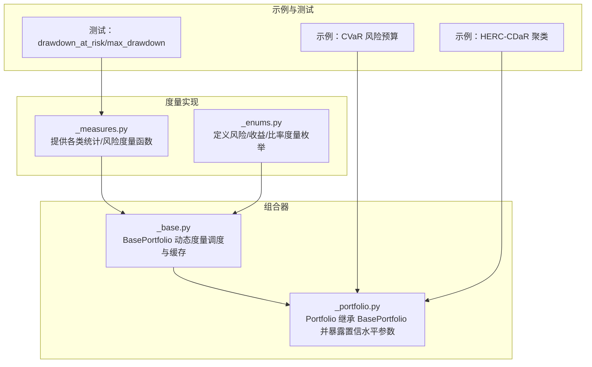
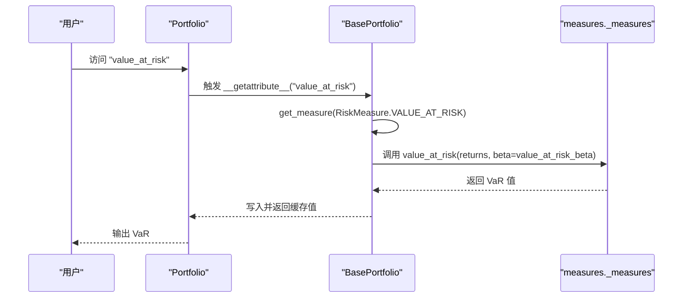
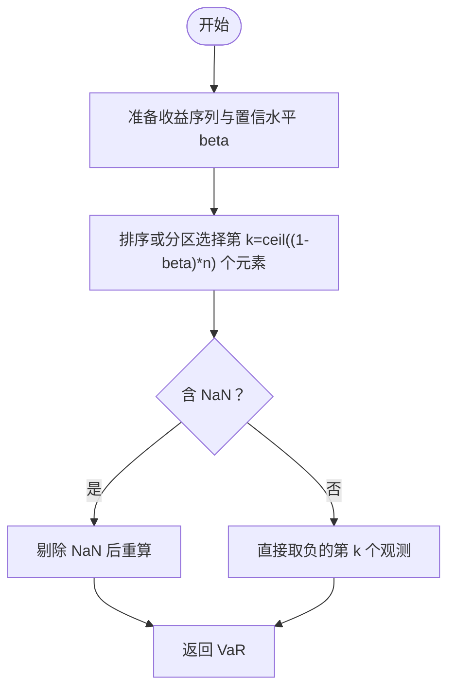
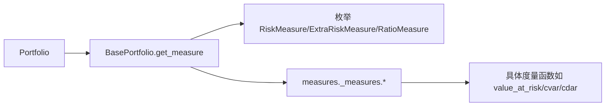

# 风险度量

<cite>
**本文引用的文件**
- [src/skfolio/portfolio/_portfolio.py](file://src/skfolio/portfolio/_portfolio.py)
- [src/skfolio/portfolio/_base.py](file://src/skfolio/portfolio/_base.py)
- [src/skfolio/measures/_measures.py](file://src/skfolio/measures/_measures.py)
- [src/skfolio/measures/_enums.py](file://src/skfolio/measures/_enums.py)
- [examples/risk_budgeting/plot_2_risk_budgeting_CVaR.py](file://examples/risk_budgeting/plot_2_risk_budgeting_CVaR.py)
- [examples/clustering/plot_2_herc_cdar.py](file://examples/clustering/plot_2_herc_cdar.py)
- [tests/test_measures/test_measures.py](file://tests/test_measures/test_measures.py)
</cite>

## 目录
1. [引言](#引言)
2. [项目结构](#项目结构)
3. [核心组件](#核心组件)
4. [架构总览](#架构总览)
5. [详细组件分析](#详细组件分析)
6. [依赖关系分析](#依赖关系分析)
7. [性能考量](#性能考量)
8. [故障排查指南](#故障排查指南)
9. [结论](#结论)
10. [附录](#附录)

## 引言
本文件系统性介绍 Portfolio 类中的核心风险度量，包括方差（variance）、标准差（standard_deviation）、在险价值（value_at_risk）、条件在险价值（cvar）、条件下行在险价值（cdar）以及最大回撤（max_drawdown）。我们将从理论基础、适用场景与局限性出发，解释置信水平参数（如 value_at_risk_beta、cvar_beta 等）对结果的影响，并通过金融实践说明如何综合使用多种风险指标进行压力测试与风险控制。

## 项目结构
skfolio 将“度量函数”集中在 measures 模块中，Portfolio 通过 BasePortfolio 的动态度量机制按需调用这些函数并缓存结果。置信水平参数以属性形式注入到 Portfolio 中，影响相应度量的计算。

图表来源
- [src/skfolio/measures/_measures.py](file://src/skfolio/measures/_measures.py#L1-L120)
- [src/skfolio/measures/_enums.py](file://src/skfolio/measures/_enums.py#L105-L200)
- [src/skfolio/portfolio/_base.py](file://src/skfolio/portfolio/_base.py#L370-L484)
- [src/skfolio/portfolio/_portfolio.py](file://src/skfolio/portfolio/_portfolio.py#L164-L199)

章节来源
- [src/skfolio/portfolio/_base.py](file://src/skfolio/portfolio/_base.py#L370-L484)
- [src/skfolio/portfolio/_portfolio.py](file://src/skfolio/portfolio/_portfolio.py#L164-L199)
- [src/skfolio/measures/_measures.py](file://src/skfolio/measures/_measures.py#L133-L178)

## 核心组件
- Portfolio：继承自 BasePortfolio，提供资产权重、交易成本、管理费、观察期等输入，并暴露多组置信水平参数（如 value_at_risk_beta、cvar_beta、cdar_beta 等），用于控制风险度量的分位点。
- BasePortfolio：集中实现度量的动态调度与缓存逻辑；当访问某个度量属性时，根据枚举类型与本地/全局参数调用 measures 模块中的对应函数。
- measures 模块：提供方差、标准差、VaR、CVaR、CDaR、最大回撤、平均回撤、波动率等度量的具体实现；支持样本加权与 NaN 处理策略。
- 枚举模块：定义 RiskMeasure、ExtraRiskMeasure、RatioMeasure 等，统一度量命名与分类，便于在优化与分析中复用。

章节来源
- [src/skfolio/portfolio/_portfolio.py](file://src/skfolio/portfolio/_portfolio.py#L164-L199)
- [src/skfolio/portfolio/_base.py](file://src/skfolio/portfolio/_base.py#L370-L484)
- [src/skfolio/measures/_enums.py](file://src/skfolio/measures/_enums.py#L105-L200)

## 架构总览
Portfolio 在构造时接收置信水平参数，随后 BasePortfolio 的 get_measure 会根据度量类型与参数选择合适的 measures 函数执行。例如：
- value_at_risk → 调用 measures.value_at_risk(returns, beta=value_at_risk_beta)
- cvar → 调用 measures.cvar(returns, beta=cvar_beta)
- cdar → 调用 measures.cvar(drawdowns, beta=cdar_beta)
- max_drawdown → 调用 measures.drawdown_at_risk(drawdowns, beta=1)

图表来源
- [src/skfolio/portfolio/_base.py](file://src/skfolio/portfolio/_base.py#L764-L820)
- [src/skfolio/measures/_measures.py](file://src/skfolio/measures/_measures.py#L518-L594)

章节来源
- [src/skfolio/portfolio/_base.py](file://src/skfolio/portfolio/_base.py#L764-L820)
- [src/skfolio/measures/_measures.py](file://src/skfolio/measures/_measures.py#L518-L594)

## 详细组件分析

### 方差（variance）与标准差（standard_deviation）
- 理论基础：方差衡量收益围绕均值的离散程度；标准差为方差的平方根，单位与收益一致，更直观。
- 实现要点：支持有偏/无偏估计与样本加权；内部使用均值与偏差平方的加权平均。
- 适用场景：适用于正态或近似正态分布；对极端值敏感。
- 局限性：无法区分上行/下行风险；对异常值敏感。
- 参数影响：无额外置信水平参数；可通过 annualized_variance/annualized_standard_deviation 进行年化。

章节来源
- [src/skfolio/measures/_measures.py](file://src/skfolio/measures/_measures.py#L133-L178)
- [src/skfolio/measures/_measures.py](file://src/skfolio/measures/_measures.py#L236-L268)

### 在险价值（value_at_risk，VaR）
- 理论基础：在给定置信水平 β 下，最坏（1-β）分位的损失。常用于监管资本计量与限额管理。
- 实现要点：基于历史模拟，使用分位数估计；支持样本加权与 NaN 处理。
- 适用场景：短期风险限额、监管合规、压力测试阈值设定。
- 局限性：不满足一致性公理（不可次可加）；对尾部信息不敏感。
- 置信水平参数：value_at_risk_beta（默认 0.95）。β 越高，VaR 越大；对极端负收益越保守。

图表来源
- [src/skfolio/measures/_measures.py](file://src/skfolio/measures/_measures.py#L518-L594)

章节来源
- [src/skfolio/measures/_measures.py](file://src/skfolio/measures/_measures.py#L518-L594)
- [src/skfolio/portfolio/_portfolio.py](file://src/skfolio/portfolio/_portfolio.py#L164-L168)

### 条件在险价值（cvar，即 CVaR/Expected Shortfall）
- 理论基础：在 VaR 截断以下的期望损失，是对尾部风险的更好度量。
- 实现要点：对 VaR 截断区间的均值估计；支持样本加权。
- 适用场景：风险预算、监管 ES 计算、尾部风险控制。
- 局限性：对极小概率事件的估计可能不稳定；对长尾分布敏感。
- 置信水平参数：cvar_beta（默认 0.95）。β 越高，CVaR 对更极端尾部越敏感。

章节来源
- [src/skfolio/measures/_measures.py](file://src/skfolio/measures/_measures.py#L596-L692)
- [src/skfolio/portfolio/_portfolio.py](file://src/skfolio/portfolio/_portfolio.py#L177-L181)

### 条件下行在险价值（cdar，Conditional Drawdown at Risk）
- 理论基础：对回撤序列在置信水平 β 下的期望回撤，衡量最大回撤的平均严重程度。
- 实现要点：先计算回撤序列，再对回撤序列使用 CVaR 的计算逻辑；支持样本加权。
- 适用场景：跟踪误差控制、回撤压力测试、最大回撤缓解策略设计。
- 局限性：对回撤序列长度与 NaN 处理敏感；β=0 时退化为平均回撤。
- 置信水平参数：cdar_beta（默认 0.95）。β 越高，CDaR 对更极端回撤越敏感。

章节来源
- [src/skfolio/measures/_measures.py](file://src/skfolio/measures/_measures.py#L941-L961)
- [src/skfolio/measures/_measures.py](file://src/skfolio/measures/_measures.py#L923-L939)
- [src/skfolio/portfolio/_portfolio.py](file://src/skfolio/portfolio/_portfolio.py#L191-L195)

### 最大回撤（max_drawdown）
- 理论基础：净值序列相对于前高点的最大跌幅，衡量策略的最坏回撤幅度。
- 实现要点：先由 get_drawdowns 计算回撤序列，再对回撤序列使用 VaR 的计算逻辑（β=1）。
- 适用场景：最大回撤限制、回撤容忍度控制、策略稳定性评估。
- 局限性：对时间跨度敏感；可能被短暂修复掩盖真实风险。
- 置信水平参数：通过 drawdown_at_risk 的 β=1 推导而来，无需单独参数。

章节来源
- [src/skfolio/measures/_measures.py](file://src/skfolio/measures/_measures.py#L905-L921)
- [src/skfolio/measures/_measures.py](file://src/skfolio/measures/_measures.py#L831-L879)
- [src/skfolio/portfolio/_portfolio.py](file://src/skfolio/portfolio/_portfolio.py#L308-L318)

### 其他相关风险度量（补充）
- 平均回撤（average_drawdown）：对回撤序列在 β=0 下的期望，衡量回撤的平均水平。
- 回撤风险（drawdown_at_risk）：对回撤序列在置信水平 β 下的最大回撤。
- 条件在险价值（evar，Entropic VaR）与条件下行在险价值（edar，Entropic Drawdown at Risk）：基于熵的上界风险度量，满足一致性公理，适合稳健优化。

章节来源
- [src/skfolio/measures/_measures.py](file://src/skfolio/measures/_measures.py#L923-L961)
- [src/skfolio/measures/_measures.py](file://src/skfolio/measures/_measures.py#L882-L904)
- [src/skfolio/measures/_measures.py](file://src/skfolio/measures/_measures.py#L738-L774)

## 依赖关系分析
Portfolio 与 measures 的耦合通过 BasePortfolio 的 get_measure 完成，避免直接导入具体函数，降低耦合度并提升可扩展性。

图表来源
- [src/skfolio/portfolio/_base.py](file://src/skfolio/portfolio/_base.py#L764-L820)
- [src/skfolio/measures/_enums.py](file://src/skfolio/measures/_enums.py#L105-L200)
- [src/skfolio/measures/_measures.py](file://src/skfolio/measures/_measures.py#L518-L594)

章节来源
- [src/skfolio/portfolio/_base.py](file://src/skfolio/portfolio/_base.py#L764-L820)
- [src/skfolio/measures/_enums.py](file://src/skfolio/measures/_enums.py#L105-L200)

## 性能考量
- 缓存机制：BasePortfolio 使用 __slots__ 与 cached_property_slots 对度量结果进行缓存，避免重复计算。
- 计算复杂度：
  - VaR/CVaR：基于分区或排序，典型复杂度约 O(n) 或 O(n log n)，受数据规模与 NaN 处理影响。
  - 回撤序列：涉及峰值累积与回撤计算，复杂度 O(n)。
- 年化：通过 annualized_factor（默认 252）对均值、方差、标准差等进行平方根规则年化，注意与观测频率匹配。

章节来源
- [src/skfolio/portfolio/_base.py](file://src/skfolio/portfolio/_base.py#L685-L712)
- [src/skfolio/portfolio/_portfolio.py](file://src/skfolio/portfolio/_portfolio.py#L133-L143)

## 故障排查指南
- NaN 处理：当收益序列包含 NaN 时，部分度量函数会跳过 NaN 或在回撤序列中保留 NaN，导致输出为 NaN。建议在预处理阶段补齐或剔除缺失值。
- 样本加权：若提供 sample_weight，需确保其和为 1 且长度等于观测数；否则会触发校验错误。
- 置信水平边界：当 β 接近 0 或 1 时，VaR/CVaR/CDaR 可能退化（如 β=1 退化为最大回撤，β=0 退化为平均回撤），应结合业务目标谨慎选择。

章节来源
- [src/skfolio/measures/_measures.py](file://src/skfolio/measures/_measures.py#L518-L594)
- [src/skfolio/measures/_measures.py](file://src/skfolio/measures/_measures.py#L831-L879)
- [src/skfolio/portfolio/_base.py](file://src/skfolio/portfolio/_base.py#L670-L683)

## 结论
- VaR 与 CVaR 分别从“最坏分位损失”和“尾部期望损失”两个角度刻画风险，CVaR 更具一致性与稳健性。
- CDaR 与最大回撤分别从“平均回撤严重程度”和“最大回撤幅度”衡量下行风险，适合回撤控制策略。
- 置信水平参数（value_at_risk_beta、cvar_beta、cdar_beta）直接影响风险度量的保守程度；实践中应结合监管要求与投资目标进行差异化配置。
- 建议在组合优化与风控中综合使用多种指标，形成“底线（VaR/CVaR）+尾部（CVaR/CDaR）+回撤（最大回撤/平均回撤）”的多维监控体系。

## 附录

### 不同置信水平下的计算差异演示思路
- 选取同一段收益序列，分别设置不同的 β（如 0.90、0.95、0.99），对比 VaR、CVaR、CDaR 的数值变化趋势。
- 对于 CDaR，先计算回撤序列，再在不同 β 下比较其期望回撤。
- 示例参考：
  - 风险预算（CVaR）示例：[示例脚本](file://examples/risk_budgeting/plot_2_risk_budgeting_CVaR.py#L1-L104)
  - HERC-CDaR 聚类示例：[示例脚本](file://examples/clustering/plot_2_herc_cdar.py#L1-L166)

章节来源
- [examples/risk_budgeting/plot_2_risk_budgeting_CVaR.py](file://examples/risk_budgeting/plot_2_risk_budgeting_CVaR.py#L1-L104)
- [examples/clustering/plot_2_herc_cdar.py](file://examples/clustering/plot_2_herc_cdar.py#L1-L166)

### 金融实践：压力测试与风险控制
- 压力测试：以 VaR/CVaR 作为单一压力阈值，结合历史极值或情景模拟，评估极端情境下的潜在损失。
- 风险控制：将 CVaR 作为风险预算约束，结合 CDaR 控制回撤的平均严重程度；以最大回撤作为硬约束上限。
- 年化与频率匹配：确保 annualized_factor 与观测频率一致（日频通常取 252），避免误判风险水平。

章节来源
- [src/skfolio/portfolio/_portfolio.py](file://src/skfolio/portfolio/_portfolio.py#L133-L143)
- [src/skfolio/measures/_measures.py](file://src/skfolio/measures/_measures.py#L518-L594)