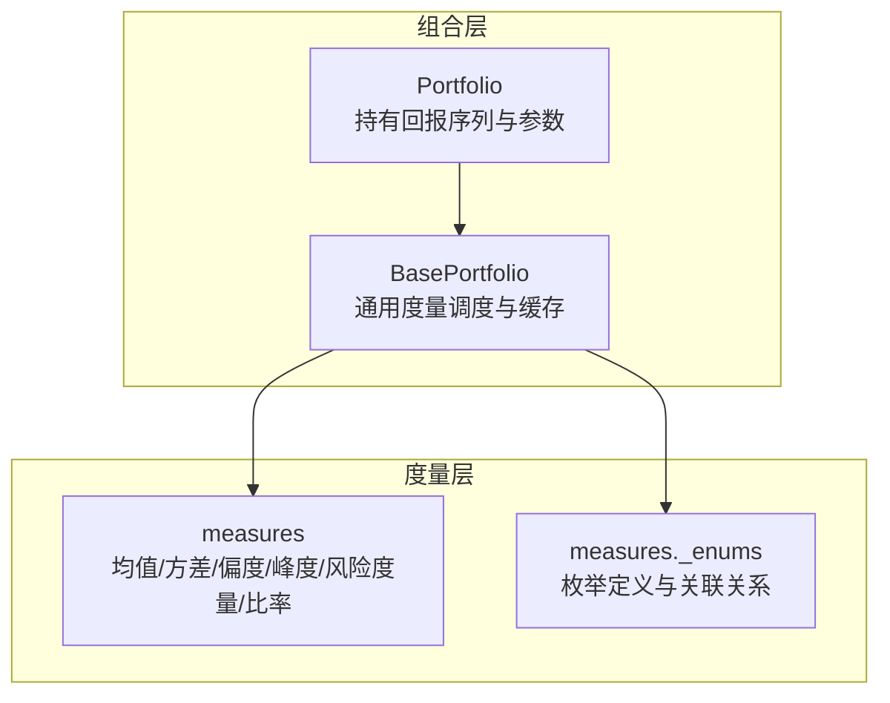
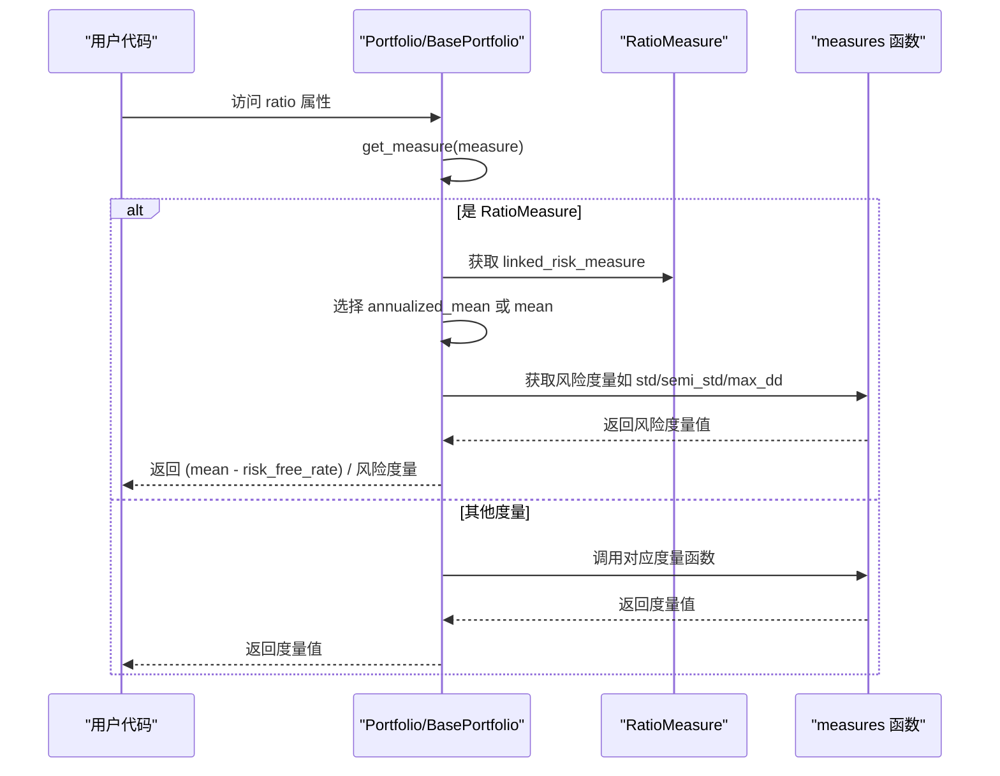
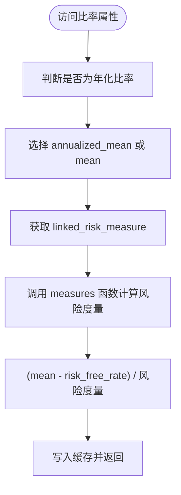
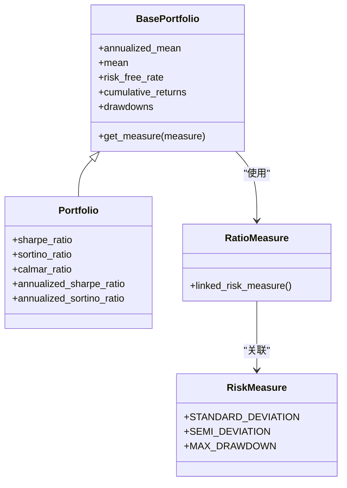

# 风险调整后收益比率

<cite>
**本文引用的文件列表**
- [src/skfolio/portfolio/_portfolio.py](file://src/skfolio/portfolio/_portfolio.py)
- [src/skfolio/portfolio/_base.py](file://src/skfolio/portfolio/_base.py)
- [src/skfolio/measures/_enums.py](file://src/skfolio/measures/_enums.py)
- [src/skfolio/measures/_measures.py](file://src/skfolio/measures/_measures.py)
- [tests/test_population/test_population.py](file://tests/test_population/test_population.py)
</cite>

## 目录
1. [引言](#引言)
2. [项目结构](#项目结构)
3. [核心组件](#核心组件)
4. [架构总览](#架构总览)
5. [详细组件分析](#详细组件分析)
6. [依赖关系分析](#依赖关系分析)
7. [性能考量](#性能考量)
8. [故障排查指南](#故障排查指南)
9. [结论](#结论)
10. [附录](#附录)

## 引言
本文件系统性解析 Portfolio 类提供的各类风险调整后收益比率，重点覆盖夏普比率（sharpe_ratio）、索提诺比率（sortino_ratio）、卡玛比率（calmar_ratio），并阐述其计算公式、经济含义、在组合绩效比较中的作用。同时，详细说明 risk_free_rate 和 min_acceptable_return 等关键参数的配置方式及其对比率结果的影响；通过实际案例对比不同比率在评估高波动资产时的表现差异，帮助用户根据投资目标选择合适的绩效评价指标。

## 项目结构
skfolio 将“度量”与“组合”解耦：Portfolio 类负责持有组合回报序列与参数，度量函数集中在 measures 模块中独立实现，Portfolio 在首次访问某个度量属性时动态调用对应函数完成计算。这种设计使得：
- 组合对象仅保存回报序列与少量参数；
- 大量度量（含比率）按需计算并缓存；
- 比率的分子为“超额收益”，分母为“风险度量”，且可按年化规则进行扩展。

图表来源
- [src/skfolio/portfolio/_portfolio.py](file://src/skfolio/portfolio/_portfolio.py#L346-L419)
- [src/skfolio/portfolio/_base.py](file://src/skfolio/portfolio/_base.py#L764-L963)
- [src/skfolio/measures/_enums.py](file://src/skfolio/measures/_enums.py#L249-L358)
- [src/skfolio/measures/_measures.py](file://src/skfolio/measures/_measures.py#L1-L120)

章节来源
- [src/skfolio/portfolio/_portfolio.py](file://src/skfolio/portfolio/_portfolio.py#L120-L210)
- [src/skfolio/portfolio/_base.py](file://src/skfolio/portfolio/_base.py#L746-L963)
- [src/skfolio/measures/_enums.py](file://src/skfolio/measures/_enums.py#L249-L358)

## 核心组件
- Portfolio 类（单期）与 BasePortfolio 提供统一的度量调度机制，首次访问某度量属性时触发计算并缓存，后续直接返回缓存值。
- RatioMeasure 枚举定义了所有比率类型，并提供 linked_risk_measure 关联到对应的“风险度量”。
- measures 模块提供具体的风险度量与统计函数（如标准差、半标准差、最大回撤、平均回撤等），Portfolio 在计算比率时以“超额收益/风险度量”的形式调用这些函数。

章节来源
- [src/skfolio/portfolio/_portfolio.py](file://src/skfolio/portfolio/_portfolio.py#L346-L419)
- [src/skfolio/portfolio/_base.py](file://src/skfolio/portfolio/_base.py#L764-L963)
- [src/skfolio/measures/_enums.py](file://src/skfolio/measures/_enums.py#L249-L358)

## 架构总览
Portfolio 的比率计算遵循以下流程：
- 访问比率属性（如 sharpe_ratio、sortino_ratio、calmar_ratio）时，BasePortfolio.get_measure 被调用；
- 对于 RatioMeasure，先确定使用“年化均值”还是“非年化均值”，再获取其关联的风险度量（例如标准差、半标准差、最大回撤）；
- 最终以 (均值 - risk_free_rate) / 风险度量 的形式得到比率。

图表来源
- [src/skfolio/portfolio/_base.py](file://src/skfolio/portfolio/_base.py#L764-L963)
- [src/skfolio/measures/_enums.py](file://src/skfolio/measures/_enums.py#L340-L358)

## 详细组件分析

### 夏普比率（sharpe_ratio）
- 定义与公式
  - 夏普比率 = (均值 - 无风险利率) / 标准差
  - 年化夏普比率 = 夏普比率 × √年化因子
- 经济含义
  - 衡量单位超额收益所承担的总体波动风险。适用于评估整体波动（上行/下行）的性价比。
- 在 Portfolio 中的实现要点
  - 分子：使用 annualized_mean 或 mean（取决于是否为年化夏普比率）
  - 分母：RiskMeasure.STANDARD_DEVIATION 或其年化版本
  - 参数：risk_free_rate 默认为 0，可通过构造函数或属性设置
- 实际应用建议
  - 当资产波动较大但方向不确定时，夏普比率可能被上下波动拉平，适合追求稳定收益的投资者。

章节来源
- [src/skfolio/portfolio/_portfolio.py](file://src/skfolio/portfolio/_portfolio.py#L346-L353)
- [src/skfolio/portfolio/_base.py](file://src/skfolio/portfolio/_base.py#L297-L304)
- [src/skfolio/measures/_enums.py](file://src/skfolio/measures/_enums.py#L340-L346)

### 索提诺比率（sortino_ratio）
- 定义与公式
  - 索提诺比率 = (均值 - 无风险利率) / 半标准差（仅惩罚下行偏离）
  - 年化索提诺比率 = 索提诺比率 × √年化因子
- 经济含义
  - 更关注“向下波动”的风险，对正向波动不施加惩罚，更适合厌恶下行风险的投资者。
- 在 Portfolio 中的实现要点
  - 分子：同夏普比率
  - 分母：RiskMeasure.SEMI_DEVIATION 或其年化版本
  - 关键参数：min_acceptable_return 决定“下边界”（默认使用均值），影响半方差/半标准差的计算
- 实际应用建议
  - 当资产存在较高上行波动但下行风险显著时，索提诺比率能更准确反映风险调整后的收益。

章节来源
- [src/skfolio/portfolio/_portfolio.py](file://src/skfolio/portfolio/_portfolio.py#L354-L361)
- [src/skfolio/portfolio/_base.py](file://src/skfolio/portfolio/_base.py#L305-L312)
- [src/skfolio/measures/_enums.py](file://src/skfolio/measures/_enums.py#L347-L350)

### 卡玛比率（calmar_ratio）
- 定义与公式
  - 卡玛比率 = (均值 - 无风险利率) / 最大回撤
- 经济含义
  - 衡量从最高点回落到最低点期间的单位回撤所获得的平均收益，强调“最大回撤”这一绝对风险。
- 在 Portfolio 中的实现要点
  - 分子：同上
  - 分母：RiskMeasure.MAX_DRAWDOWN
  - 回撤序列由累积收益序列推导而来，受 compounded 参数影响
- 实际应用建议
  - 适合对最大回撤敏感的投资者，尤其在趋势跟踪或高波动策略中更具参考价值。

章节来源
- [src/skfolio/portfolio/_portfolio.py](file://src/skfolio/portfolio/_portfolio.py#L398-L401)
- [src/skfolio/portfolio/_base.py](file://src/skfolio/portfolio/_base.py#L349-L352)
- [src/skfolio/measures/_enums.py](file://src/skfolio/measures/_enums.py#L351-L352)

### 其他相关比率与风险度量
- 年化因子与年化比率
  - 年化规则：均值、方差、半方差乘以年化因子；标准差、半标准差乘以√年化因子；比率也按相同规则处理
- 其他比率示例
  - 基于 VaR/CVaR/EVaR 的比率（如 VaR_ratio、CVaR_ratio、EVaR_ratio）
  - 基于回撤风险度量的比率（如 DaR_ratio、CDaR_ratio、EDaR_ratio）
  - 基于其他风险度量的比率（如 MAD_ratio、ULCER_index_ratio、GMD_ratio）

章节来源
- [src/skfolio/portfolio/_base.py](file://src/skfolio/portfolio/_base.py#L100-L110)
- [src/skfolio/measures/_enums.py](file://src/skfolio/measures/_enums.py#L249-L327)

### 关键参数配置与影响
- risk_free_rate
  - 作用：作为超额收益的基准，直接影响分子大小
  - 设置位置：Portfolio 构造函数参数或运行时属性
  - 影响：提高 risk_free_rate 会降低比率；在低无风险环境下，可考虑使用非零值以更贴近现实
- min_acceptable_return
  - 作用：用于半方差/半标准差等下偏矩相关度量的“下界”
  - 默认：若未显式设置，通常使用均值
  - 影响：改变下界会改变半方差/半标准差，从而影响索提诺比率等

章节来源
- [src/skfolio/portfolio/_portfolio.py](file://src/skfolio/portfolio/_portfolio.py#L144-L163)
- [src/skfolio/portfolio/_base.py](file://src/skfolio/portfolio/_base.py#L122-L131)

### 计算流程与缓存机制
- 首次访问比率属性时，BasePortfolio.get_measure 会：
  - 判断是否为年化比率，选择 annualized_mean 或 mean
  - 通过 RatioMeasure.linked_risk_measure 获取对应风险度量
  - 动态调用 measures 模块函数计算风险度量
  - 返回 (mean - risk_free_rate) / 风险度量
- 缓存：属性首次计算后写入 __slots__，后续直接返回

图表来源
- [src/skfolio/portfolio/_base.py](file://src/skfolio/portfolio/_base.py#L764-L821)

## 依赖关系分析
- Portfolio 与 BasePortfolio
  - Portfolio 继承自 BasePortfolio，复用度量调度与缓存逻辑
- BasePortfolio 与 measures
  - BasePortfolio.get_measure 通过反射调用 measures 模块中的函数，并将 Portfolio 的参数映射为函数参数
- RatioMeasure 与 RiskMeasure/ExtraRiskMeasure
  - RatioMeasure.linked_risk_measure 将每个比率与一个风险度量建立一一映射，确保计算的一致性

图表来源
- [src/skfolio/portfolio/_base.py](file://src/skfolio/portfolio/_base.py#L764-L963)
- [src/skfolio/portfolio/_portfolio.py](file://src/skfolio/portfolio/_portfolio.py#L346-L419)
- [src/skfolio/measures/_enums.py](file://src/skfolio/measures/_enums.py#L340-L358)

## 性能考量
- 按需计算与缓存
  - 首次访问比率属性时才计算，避免不必要的开销
- 年化规则
  - 对于比率与风险度量采用统一的年化因子缩放，减少重复转换
- 回撤相关度量
  - 最大回撤、平均回撤等依赖累积收益序列，注意 compounded 参数对结果的影响

章节来源
- [src/skfolio/portfolio/_base.py](file://src/skfolio/portfolio/_base.py#L764-L963)

## 故障排查指南
- 比率结果异常或为 NaN
  - 可能原因：输入回报包含全 NaN、风险度量为 0、分母为 0
  - 排查建议：检查 returns 是否有效、risk_free_rate 设置是否合理、min_acceptable_return 是否导致半方差为 0
- 年化比率与非年化比率混淆
  - 确认使用的比率是否为年化版本，以及 annualized_factor 的设置是否符合预期
- 回撤相关比率不稳定
  - 检查 compounded 参数与样本权重，确认 drawdowns 计算正确

章节来源
- [src/skfolio/portfolio/_base.py](file://src/skfolio/portfolio/_base.py#L790-L810)

## 结论
- 夏普比率适合衡量总体波动下的风险调整收益，索提诺比率更关注下行风险，卡玛比率强调最大回撤的收益补偿能力。
- risk_free_rate 与 min_acceptable_return 是影响比率结果的关键参数，应结合投资目标与市场环境谨慎设定。
- 在高波动资产评估中，索提诺比率常优于夏普比率；对回撤敏感的策略，卡玛比率更具参考价值。
- 通过 Portfolio 的统一度量调度与缓存机制，用户可以高效地比较多种比率并进行滚动分析。

## 附录

### 实战案例：不同比率在高波动资产上的表现差异
- 场景设定
  - 假设某组合在样本期内波动较大，上行与下行波动均显著
  - 使用 Portfolio 计算 Sharpe、Sortino、Calmar 三类比率
- 预期差异
  - 若上行波动远大于下行波动，Sharpe 可能高于 Sortino；若下行回撤显著，Calmar 可能低于 Sharpe
- 建议做法
  - 同时观察三类比率，结合投资目标选择主指标；必要时使用 rolling_measure 进行滚动窗口分析

章节来源
- [tests/test_population/test_population.py](file://tests/test_population/test_population.py#L273-L306)