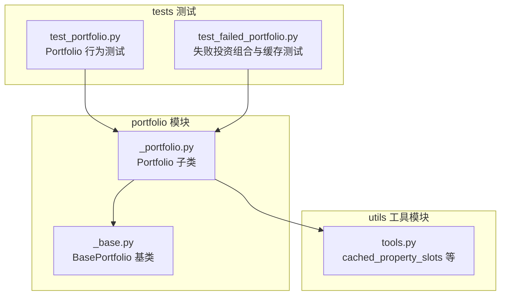
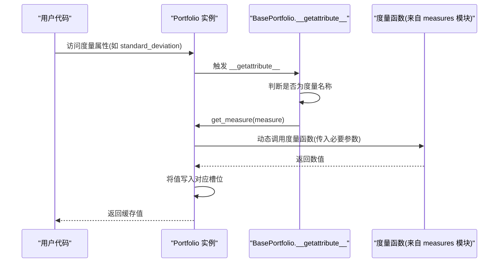
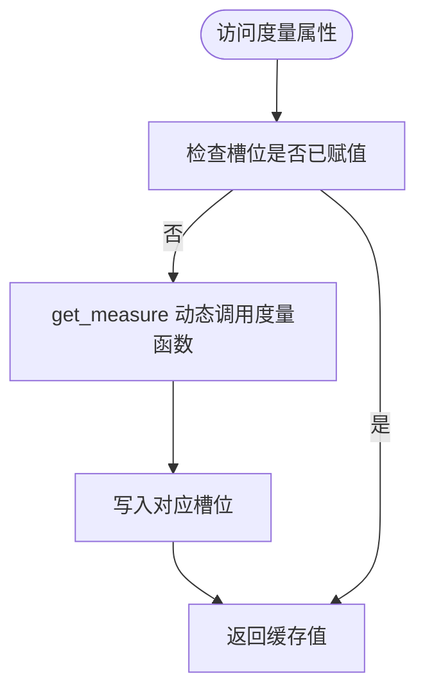
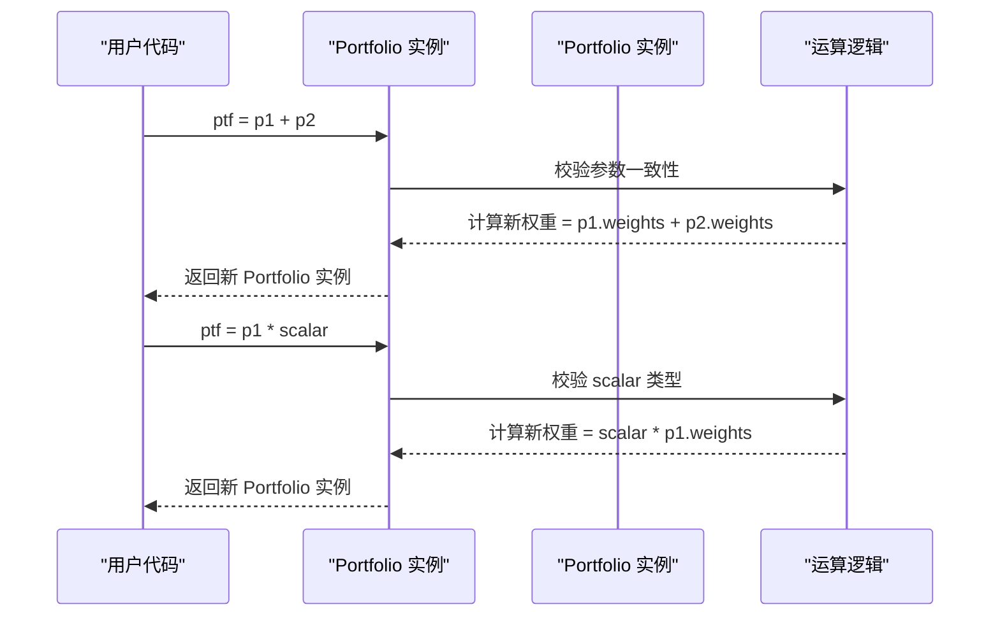
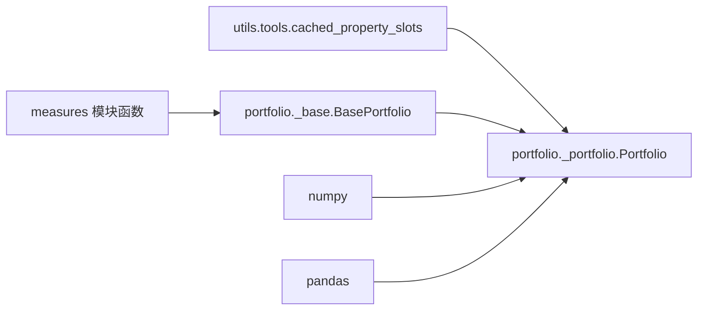

# 投资组合类

<cite>
**本文引用的文件**
- [src/skfolio/portfolio/_portfolio.py](file://src/skfolio/portfolio/_portfolio.py)
- [src/skfolio/portfolio/_base.py](file://src/skfolio/portfolio/_base.py)
- [src/skfolio/utils/tools.py](file://src/skfolio/utils/tools.py)
- [tests/test_portfolio/test_portfolio.py](file://tests/test_portfolio/test_portfolio.py)
- [tests/test_portfolio/test_failed_portfolio.py](file://tests/test_portfolio/test_failed_portfolio.py)
</cite>

## 目录
1. [简介](#简介)
2. [项目结构](#项目结构)
3. [核心组件](#核心组件)
4. [架构总览](#架构总览)
5. [详细组件分析](#详细组件分析)
6. [依赖关系分析](#依赖关系分析)
7. [性能考量](#性能考量)
8. [故障排查指南](#故障排查指南)
9. [结论](#结论)
10. [附录](#附录)

## 简介
本文件为 skfolio 的 Portfolio 类提供详尽的 API 参考文档。重点涵盖：
- 通过 __slots__ 实现高性能与内存优化的设计思路与收益
- 超过 40 种风险与绩效度量的惰性计算与缓存机制
- Portfolio 的关键属性（如 weights、returns、assets）与度量（如 volatility、cvar、sharpe_ratio）
- 魔术方法（+、-、*、/ 等）在投资组合代数运算中的行为
- 便捷属性 nonzero_assets、composition 等的语义与用法
- 示例：如何访问与使用各类投资组合度量

## 项目结构
Portfolio 类位于 portfolio 模块中，继承自 BasePortfolio，并通过工具模块提供的装饰器实现惰性计算与缓存。测试用例覆盖了魔术方法、缓存、序列化、内存占用等关键行为。

图表来源
- [src/skfolio/portfolio/_portfolio.py](file://src/skfolio/portfolio/_portfolio.py#L1-L120)
- [src/skfolio/portfolio/_base.py](file://src/skfolio/portfolio/_base.py#L1-L120)
- [src/skfolio/utils/tools.py](file://src/skfolio/utils/tools.py#L77-L116)
- [tests/test_portfolio/test_portfolio.py](file://tests/test_portfolio/test_portfolio.py#L1-L120)
- [tests/test_portfolio/test_failed_portfolio.py](file://tests/test_portfolio/test_failed_portfolio.py#L1-L120)

章节来源
- [src/skfolio/portfolio/_portfolio.py](file://src/skfolio/portfolio/_portfolio.py#L1-L120)
- [src/skfolio/portfolio/_base.py](file://src/skfolio/portfolio/_base.py#L1-L120)
- [src/skfolio/utils/tools.py](file://src/skfolio/utils/tools.py#L1-L120)
- [tests/test_portfolio/test_portfolio.py](file://tests/test_portfolio/test_portfolio.py#L1-L120)
- [tests/test_portfolio/test_failed_portfolio.py](file://tests/test_portfolio/test_failed_portfolio.py#L1-L120)

## 核心组件
- BasePortfolio：定义了 Portfolio 的通用骨架，包括 __slots__、惰性度量加载、缓存清理、序列化支持、比较与支配关系等。
- Portfolio：在 BasePortfolio 基础上扩展了资产数据、权重、交易成本与管理费、投资组合回报计算、魔术方法、便捷属性与衍生指标（如有效资产数、SRIC、多样化程度等）。
- cached_property_slots：自定义的“槽式缓存属性”装饰器，将计算结果存储在私有槽位中，避免重复计算并提升访问速度。

章节来源
- [src/skfolio/portfolio/_base.py](file://src/skfolio/portfolio/_base.py#L75-L120)
- [src/skfolio/portfolio/_portfolio.py](file://src/skfolio/portfolio/_portfolio.py#L421-L452)
- [src/skfolio/utils/tools.py](file://src/skfolio/utils/tools.py#L77-L116)

## 架构总览
Portfolio 的度量系统采用“惰性计算 + 缓存”的策略：首次访问某个度量时，通过动态函数调用计算并写入对应槽位；后续访问直接从槽位读取，显著降低重复计算开销。同时，当影响度量的参数发生变化时，会触发缓存清理，确保结果一致性。

图表来源
- [src/skfolio/portfolio/_base.py](file://src/skfolio/portfolio/_base.py#L576-L589)
- [src/skfolio/portfolio/_base.py](file://src/skfolio/portfolio/_base.py#L764-L806)

章节来源
- [src/skfolio/portfolio/_base.py](file://src/skfolio/portfolio/_base.py#L576-L589)
- [src/skfolio/portfolio/_base.py](file://src/skfolio/portfolio/_base.py#L764-L806)

## 详细组件分析

### Portfolio 类概览
- 继承关系：Portfolio 继承自 BasePortfolio，复用其惰性度量与缓存机制。
- 关键职责：
  - 接收资产价格收益矩阵与权重，计算投资组合回报
  - 提供交易成本与管理费的处理
  - 提供丰富的风险与绩效度量
  - 支持投资组合代数运算（+、-、*、/ 等）
  - 提供 nonzero_assets、composition 等便捷属性

章节来源
- [src/skfolio/portfolio/_portfolio.py](file://src/skfolio/portfolio/_portfolio.py#L30-L120)
- [src/skfolio/portfolio/_portfolio.py](file://src/skfolio/portfolio/_portfolio.py#L421-L452)

### __slots__ 与内存优化
- BasePortfolio 在其 __slots__ 中声明了所有度量、参数与缓存槽位，避免使用字典存储实例属性，从而减少内存占用并提升访问速度。
- Portfolio 在其 __slots__ 中声明了只读属性（如 X、weights、assets、n_assets、total_cost、total_fee）、带自定义 getter 的只读缓存属性（如 _nonzero_assets、_nonzero_assets_index），以及可读写的 fallback_chain。
- 这种设计使得 Portfolio 实例在创建与访问时更高效，且在大量对象场景下能显著降低内存峰值。

章节来源
- [src/skfolio/portfolio/_base.py](file://src/skfolio/portfolio/_base.py#L400-L484)
- [src/skfolio/portfolio/_portfolio.py](file://src/skfolio/portfolio/_portfolio.py#L421-L452)

### 惰性计算与缓存机制
- 度量惰性加载：当访问某个度量属性时，若该槽位未赋值，则通过 get_measure 动态调用相应函数计算并写回槽位。
- 全局与局部参数变更触发缓存清理：当修改影响度量的全局或局部参数（如 risk_free_rate、annualized_factor、value_at_risk_beta 等）时，会清空相关度量与缓存，保证后续访问得到最新结果。
- 自定义缓存装饰器 cached_property_slots：对某些只读且需要缓存的属性（如 nonzero_assets、nonzero_assets_index、fitness、cumulative_returns、drawdowns 等）进行缓存，避免重复计算。

图表来源
- [src/skfolio/portfolio/_base.py](file://src/skfolio/portfolio/_base.py#L576-L589)
- [src/skfolio/portfolio/_base.py](file://src/skfolio/portfolio/_base.py#L764-L806)
- [src/skfolio/utils/tools.py](file://src/skfolio/utils/tools.py#L77-L116)

章节来源
- [src/skfolio/portfolio/_base.py](file://src/skfolio/portfolio/_base.py#L576-L589)
- [src/skfolio/portfolio/_base.py](file://src/skfolio/portfolio/_base.py#L590-L613)
- [src/skfolio/utils/tools.py](file://src/skfolio/utils/tools.py#L77-L116)

### 关键属性与度量
以下为 Portfolio 的常用属性与度量（按类别分组）。注意：Portfolio 继承自 BasePortfolio，因此还包含更多度量与比率类属性。此处仅列出与 Portfolio 直接相关的属性与度量。

- 基础属性
  - X：资产收益矩阵（原始输入，非副本）
  - assets：资产名称数组
  - n_assets：资产数量
  - weights：当前投资组合权重
  - previous_weights：上期权重（用于交易成本计算）
  - transaction_costs：线性交易成本（标量或每资产向量）
  - management_fees：线性管理费用（标量或每资产向量）
  - total_cost：总交易成本
  - total_fee：总管理费用
  - returns：投资组合回报序列
  - observations：观测索引
  - name/tag：投资组合标识与标签
  - fallback_chain：优化回退链路记录

- 风险与绩效度量（部分）
  - mean、annualized_mean
  - variance、annualized_variance
  - standard_deviation、annualized_standard_deviation
  - semi_variance、annualized_semi_variance
  - semi_deviation、annualized_semi_deviation
  - skew、kurtosis、fourth_central_moment、fourth_lower_partial_moment
  - worst_realization
  - value_at_risk、cvar、entropic_risk_measure、evar
  - drawdown_at_risk、cdar、max_drawdown、average_drawdown、edar、ulcer_index、gini_mean_difference
  - mean_absolute_deviation、first_lower_partial_moment
  - mean_absolute_deviation_ratio、first_lower_partial_moment_ratio
  - sharpe_ratio、annualized_sharpe_ratio、sortino_ratio、annualized_sortino_ratio
  - value_at_risk_ratio、cvar_ratio、entropic_risk_measure_ratio、evar_ratio
  - worst_realization_ratio、drawdown_at_risk_ratio、cdar_ratio、calmar_ratio、average_drawdown_ratio、edar_ratio、ulcer_index_ratio、gini_mean_difference_ratio

- 派生指标
  - nonzero_assets：非零权重资产集合
  - nonzero_assets_index：非零权重资产索引
  - composition：非零权重资产的组合表（按权重降序）
  - weights_dict、previous_weights_dict：资产到权重的映射（含零权重）
  - weights_per_observation：每期权重矩阵
  - diversification：加权平均波动率除以组合波动率
  - sric：Sharpe Ratio 信息准则
  - effective_number_assets：有效资产数（Herfindahl 指数倒数）

章节来源
- [src/skfolio/portfolio/_portfolio.py](file://src/skfolio/portfolio/_portfolio.py#L217-L419)
- [src/skfolio/portfolio/_portfolio.py](file://src/skfolio/portfolio/_portfolio.py#L717-L949)
- [src/skfolio/portfolio/_base.py](file://src/skfolio/portfolio/_base.py#L168-L370)

### 魔术方法与投资组合代数运算
Portfolio 支持以下魔术方法，便于进行投资组合代数运算：
- __neg__：取反（对权重取负）
- __abs__：绝对值（对权重取绝对值）
- __round__：四舍五入（对权重进行舍入）
- __add__：两个投资组合相加（要求除权重、name、tag 外其他参数一致）
- __sub__：两个投资组合相减（要求除权重、name、tag 外其他参数一致）
- __mul__、__rmul__：与标量相乘
- __floordiv__：整除（对权重进行整除）
- __truediv__：真除（对权重进行除法）

这些操作均基于权重向量进行，且在失败投资组合（FailedPortfolio）场景下会返回拷贝以保持不可变性。

图表来源
- [src/skfolio/portfolio/_portfolio.py](file://src/skfolio/portfolio/_portfolio.py#L608-L710)
- [tests/test_portfolio/test_portfolio.py](file://tests/test_portfolio/test_portfolio.py#L257-L282)

章节来源
- [src/skfolio/portfolio/_portfolio.py](file://src/skfolio/portfolio/_portfolio.py#L608-L710)
- [tests/test_portfolio/test_portfolio.py](file://tests/test_portfolio/test_portfolio.py#L257-L282)

### 便捷属性
- nonzero_assets：绝对权重大于阈值的资产集合
- nonzero_assets_index：上述资产的索引
- composition：非零权重资产的组合表（按权重降序，列名为投资组合名）
- weights_dict、previous_weights_dict：资产到权重的完整映射（含零权重）
- weights_per_observation：每期权重矩阵（仅非零权重资产）
- diversification：加权平均波动率除以组合波动率
- sric：Sharpe Ratio 信息准则
- effective_number_assets：有效资产数（Herfindahl 指数倒数）

章节来源
- [src/skfolio/portfolio/_portfolio.py](file://src/skfolio/portfolio/_portfolio.py#L717-L764)
- [src/skfolio/portfolio/_portfolio.py](file://src/skfolio/portfolio/_portfolio.py#L765-L809)
- [src/skfolio/portfolio/_portfolio.py](file://src/skfolio/portfolio/_portfolio.py#L809-L949)

### 度量计算与贡献分析
- contribution(measure, spacing=None, to_df=False)：使用有限差分法计算各资产对指定度量的贡献。默认间距根据度量类型自动选择，也可手动指定。to_df=True 时返回按贡献降序排列的 DataFrame。
- expected_returns_from_assets、variance_from_assets：从资产期望收益与协方差矩阵推导组合期望收益与方差，考虑交易成本与管理费用。

章节来源
- [src/skfolio/portfolio/_portfolio.py](file://src/skfolio/portfolio/_portfolio.py#L811-L846)
- [src/skfolio/portfolio/_portfolio.py](file://src/skfolio/portfolio/_portfolio.py#L847-L906)

### 使用示例（路径指引）
以下为常见用法的“代码片段路径”指引，便于快速定位实现位置与参数说明：
- 创建投资组合并访问回报与波动率
  - [Portfolio.__init__ 参数与回报计算](file://src/skfolio/portfolio/_portfolio.py#L454-L587)
  - [访问 returns 与 standard_deviation（惰性计算）](file://src/skfolio/portfolio/_base.py#L576-L589)
- 访问风险与绩效度量
  - [度量属性列表（Portfolio）](file://src/skfolio/portfolio/_portfolio.py#L217-L419)
  - [度量属性列表（BasePortfolio）](file://src/skfolio/portfolio/_base.py#L168-L370)
- 投资组合代数运算
  - [__add__、__sub__、__mul__、__truediv__](file://src/skfolio/portfolio/_portfolio.py#L629-L710)
  - [测试用例：魔术方法行为](file://tests/test_portfolio/test_portfolio.py#L257-L282)
- 便捷属性
  - [nonzero_assets、nonzero_assets_index、composition](file://src/skfolio/portfolio/_portfolio.py#L717-L764)
  - [weights_dict、previous_weights_dict、weights_per_observation](file://src/skfolio/portfolio/_portfolio.py#L736-L764)
- 派生指标
  - [diversification、sric、effective_number_assets](file://src/skfolio/portfolio/_portfolio.py#L765-L809)
- 贡献分析
  - [contribution 方法](file://src/skfolio/portfolio/_portfolio.py#L847-L906)
- 序列化与缓存
  - [__reduce__ 与缓存清理](file://src/skfolio/portfolio/_base.py#L532-L538)
  - [clear() 清理度量与缓存](file://src/skfolio/portfolio/_base.py#L758-L763)
  - [测试：缓存访问性能](file://tests/test_portfolio/test_failed_portfolio.py#L222-L234)

章节来源
- [src/skfolio/portfolio/_portfolio.py](file://src/skfolio/portfolio/_portfolio.py#L454-L587)
- [src/skfolio/portfolio/_base.py](file://src/skfolio/portfolio/_base.py#L532-L538)
- [tests/test_portfolio/test_portfolio.py](file://tests/test_portfolio/test_portfolio.py#L257-L282)
- [tests/test_portfolio/test_failed_portfolio.py](file://tests/test_portfolio/test_failed_portfolio.py#L222-L234)

## 依赖关系分析
Portfolio 的依赖主要体现在：
- 对 BasePortfolio 的继承：复用惰性度量、缓存与序列化机制
- 对工具模块 cached_property_slots 的使用：实现只读缓存属性
- 对 measures 模块的动态调用：按需计算各类度量
- 对 numpy/pandas 的广泛使用：进行数组与 DataFrame 操作

图表来源
- [src/skfolio/utils/tools.py](file://src/skfolio/utils/tools.py#L77-L116)
- [src/skfolio/portfolio/_base.py](file://src/skfolio/portfolio/_base.py#L764-L806)
- [src/skfolio/portfolio/_portfolio.py](file://src/skfolio/portfolio/_portfolio.py#L421-L452)

章节来源
- [src/skfolio/utils/tools.py](file://src/skfolio/utils/tools.py#L77-L116)
- [src/skfolio/portfolio/_base.py](file://src/skfolio/portfolio/_base.py#L764-L806)
- [src/skfolio/portfolio/_portfolio.py](file://src/skfolio/portfolio/_portfolio.py#L421-L452)

## 性能考量
- __slots__ 优化：通过固定槽位避免字典存储，降低内存占用并提升访问速度。
- 惰性计算与缓存：首次访问度量时计算并缓存，后续访问 O(1)，显著减少重复计算。
- 序列化优化：__reduce__ 仅序列化初始化所需参数，避免序列化通用槽位，提高序列化/反序列化效率。
- 内存占用稳定性：测试显示创建多个 Portfolio 实例后，内存增长稳定，无泄漏迹象。

章节来源
- [src/skfolio/portfolio/_base.py](file://src/skfolio/portfolio/_base.py#L1-L32)
- [src/skfolio/portfolio/_base.py](file://src/skfolio/portfolio/_base.py#L532-L538)
- [tests/test_portfolio/test_failed_portfolio.py](file://tests/test_portfolio/test_failed_portfolio.py#L108-L151)

## 故障排查指南
- 访问未赋值的度量导致 AttributeError：确认是否已正确初始化 Portfolio 或是否被缓存清理。
  - 参考：[__getattribute__ 惰性加载逻辑](file://src/skfolio/portfolio/_base.py#L576-L589)
- 修改参数后度量不更新：应先调用 clear() 或重新设置相关参数，以触发缓存清理。
  - 参考：[__setattr__ 参数变更触发清理](file://src/skfolio/portfolio/_base.py#L590-L613)
- 魔术方法报错：确保两个 Portfolio 的除权重、name、tag 外参数完全一致，否则会抛出错误。
  - 参考：[__add__/__sub__ 参数一致性校验](file://src/skfolio/portfolio/_portfolio.py#L629-L671)
- 交易成本/管理费为标量或向量：输入需与资产数量一致，否则会触发转换或校验错误。
  - 参考：[输入转换与校验](file://src/skfolio/portfolio/_portfolio.py#L497-L540)

章节来源
- [src/skfolio/portfolio/_base.py](file://src/skfolio/portfolio/_base.py#L576-L589)
- [src/skfolio/portfolio/_base.py](file://src/skfolio/portfolio/_base.py#L590-L613)
- [src/skfolio/portfolio/_portfolio.py](file://src/skfolio/portfolio/_portfolio.py#L497-L540)
- [src/skfolio/portfolio/_portfolio.py](file://src/skfolio/portfolio/_portfolio.py#L629-L671)

## 结论
Portfolio 类通过 __slots__、惰性度量与缓存、以及精心设计的魔术方法与便捷属性，实现了高性能、低内存占用的投资组合度量体系。对于超过 40 种风险与绩效度量，系统在首次访问时计算并缓存，后续访问极快；同时，参数变更会自动清理缓存，确保结果一致性。配合丰富的派生指标与贡献分析能力，Portfolio 为投资组合研究与优化提供了坚实基础。

## 附录
- 更多度量与比率类属性请参考 BasePortfolio 的属性列表与 get_measure 的动态调用机制。
- 若需进一步了解度量函数的实现细节，请参考 measures 模块中的具体函数。