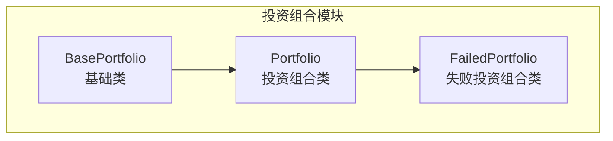
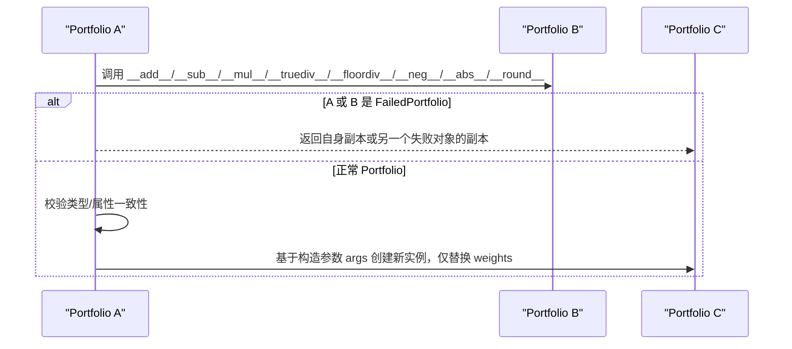
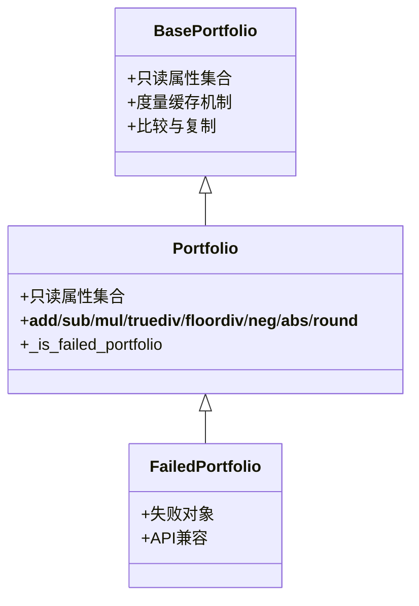

# 投资组合魔术方法

<cite>
**本文引用的文件**
- [src/skfolio/portfolio/_portfolio.py](file://src/skfolio/portfolio/_portfolio.py)
- [src/skfolio/portfolio/_base.py](file://src/skfolio/portfolio/_base.py)
- [src/skfolio/portfolio/_failed_portfolio.py](file://src/skfolio/portfolio/_failed_portfolio.py)
- [tests/test_portfolio/test_portfolio.py](file://tests/test_portfolio/test_portfolio.py)
</cite>

## 目录
1. [简介](#简介)
2. [项目结构](#项目结构)
3. [核心组件](#核心组件)
4. [架构总览](#架构总览)
5. [详细组件分析](#详细组件分析)
6. [依赖关系分析](#依赖关系分析)
7. [性能考量](#性能考量)
8. [故障排查指南](#故障排查指南)
9. [结论](#结论)
10. [附录](#附录)

## 简介
本文件为 skfolio 的 Portfolio 类提供详尽的 API 参考，聚焦于其支持的投资组合代数运算的魔术方法。重点覆盖以下运算符及其语义与行为：
- 加法：__add__（+）
- 减法：__sub__（-）
- 数量乘法：__mul__（*），__rmul__（右乘）
- 整除：__floordiv__（//）
- 除法：__truediv__（/）
- 取负：__neg__（-）
- 绝对值：__abs__
- 四舍五入：__round__

同时，本文解释这些方法如何实现“权重”的加、减、乘、除、取反、取绝对值和四舍五入；说明 _is_failed_portfolio 检查在运算中的作用；并强调运算前后投资组合其他属性（如 X、transaction_costs、management_fees、previous_weights 等）必须保持一致的约束条件。

## 项目结构
Portfolio 类位于 portfolio 子模块中，继承自 BasePortfolio，并通过只读属性集合与构造参数保持一致性。FailedPortfolio 作为 Portfolio 的子类，用于表示优化失败的“哨兵”对象，以确保 API 兼容性。

图表来源
- [src/skfolio/portfolio/_base.py](file://src/skfolio/portfolio/_base.py#L75-L120)
- [src/skfolio/portfolio/_portfolio.py](file://src/skfolio/portfolio/_portfolio.py#L30-L60)
- [src/skfolio/portfolio/_failed_portfolio.py](file://src/skfolio/portfolio/_failed_portfolio.py#L15-L30)

章节来源
- [src/skfolio/portfolio/_portfolio.py](file://src/skfolio/portfolio/_portfolio.py#L30-L120)
- [src/skfolio/portfolio/_base.py](file://src/skfolio/portfolio/_base.py#L75-L120)
- [src/skfolio/portfolio/_failed_portfolio.py](file://src/skfolio/portfolio/_failed_portfolio.py#L15-L40)

## 核心组件
- Portfolio：封装资产价格收益矩阵 X、权重 weights、交易成本 transaction_costs、管理费用 management_fees、前一期权重 previous_weights 等，提供丰富的风险与收益度量。
- BasePortfolio：定义通用的只读属性集合、度量缓存机制、比较与复制行为等。
- FailedPortfolio：继承 Portfolio，当优化失败时返回该对象，保留 API 兼容性，内部返回 NaN。

章节来源
- [src/skfolio/portfolio/_portfolio.py](file://src/skfolio/portfolio/_portfolio.py#L421-L434)
- [src/skfolio/portfolio/_base.py](file://src/skfolio/portfolio/_base.py#L372-L386)
- [src/skfolio/portfolio/_failed_portfolio.py](file://src/skfolio/portfolio/_failed_portfolio.py#L15-L40)

## 架构总览
Portfolio 的魔术方法围绕“权重向量”的运算展开，同时确保非权重相关属性在两个投资组合相加/相减时保持一致。FailedPortfolio 的存在保证了在优化失败时仍可进行运算而不抛出异常。

图表来源
- [src/skfolio/portfolio/_portfolio.py](file://src/skfolio/portfolio/_portfolio.py#L608-L710)
- [src/skfolio/portfolio/_portfolio.py](file://src/skfolio/portfolio/_portfolio.py#L629-L710)
- [src/skfolio/portfolio/_portfolio.py](file://src/skfolio/portfolio/_portfolio.py#L673-L710)
- [src/skfolio/portfolio/_portfolio.py](file://src/skfolio/portfolio/_portfolio.py#L604-L628)
- [src/skfolio/portfolio/_failed_portfolio.py](file://src/skfolio/portfolio/_failed_portfolio.py#L15-L40)

## 详细组件分析

### 魔术方法概览与约束
- 所有运算均以“权重向量”为核心进行算子操作，其他属性（如 X、transaction_costs、management_fees、previous_weights 等）在运算前后保持一致。
- 对于加法与减法，要求两个投资组合的非权重相关属性完全一致，否则抛出错误。
- 对于乘法与除法，仅允许与标量数字相乘/除，否则抛出类型错误。
- 对于取反、取绝对值、四舍五入，直接对 weights 进行相应变换后返回新实例。

章节来源
- [src/skfolio/portfolio/_portfolio.py](file://src/skfolio/portfolio/_portfolio.py#L629-L710)
- [src/skfolio/portfolio/_portfolio.py](file://src/skfolio/portfolio/_portfolio.py#L608-L628)

### 加法：__add__（+）
- 行为要点
  - 仅支持与另一个 Portfolio 相加。
  - 若任一对象为 FailedPortfolio，则返回失败对象的副本。
  - 对两个投资组合的非权重相关属性进行严格一致性校验（除 weights、name、tag 外，其余属性必须完全相等），否则抛出错误。
  - 新实例的 weights 为两者的权重向量之和。
- 使用场景
  - 将两个投资组合的权重向量相加，得到一个新的投资组合，常用于组合策略或对冲策略的权重叠加。
- 示例路径
  - 测试断言展示了加法与减法的行为：[测试用例](file://tests/test_portfolio/test_portfolio.py#L257-L282)

章节来源
- [src/skfolio/portfolio/_portfolio.py](file://src/skfolio/portfolio/_portfolio.py#L629-L648)
- [tests/test_portfolio/test_portfolio.py](file://tests/test_portfolio/test_portfolio.py#L257-L282)

### 减法：__sub__（-）
- 行为要点
  - 仅支持与另一个 Portfolio 相减。
  - 若任一对象为 FailedPortfolio，则返回失败对象的副本。
  - 同样进行非权重相关属性的一致性校验。
  - 新实例的 weights 为两者的权重向量之差。
- 使用场景
  - 计算两个投资组合之间的权重差异，常用于跟踪再平衡误差或对冲头寸变化。
- 示例路径
  - 测试断言展示了加法与减法的行为：[测试用例](file://tests/test_portfolio/test_portfolio.py#L257-L282)

章节来源
- [src/skfolio/portfolio/_portfolio.py](file://src/skfolio/portfolio/_portfolio.py#L650-L671)
- [tests/test_portfolio/test_portfolio.py](file://tests/test_portfolio/test_portfolio.py#L257-L282)

### 数量乘法：__mul__（*）与 __rmul__（右乘）
- 行为要点
  - 仅支持与标量数字相乘；若传入非数字类型，抛出类型错误。
  - 若当前对象为 FailedPortfolio，则返回失败对象的副本。
  - 新实例的 weights 为原权重向量乘以标量。
  - __rmul__ 与 __mul__ 等价，支持右侧乘法。
- 使用场景
  - 缩放投资组合权重（例如放大/缩小头寸规模）。
- 示例路径
  - 测试断言展示了乘法与除法的行为：[测试用例](file://tests/test_portfolio/test_portfolio.py#L257-L282)

章节来源
- [src/skfolio/portfolio/_portfolio.py](file://src/skfolio/portfolio/_portfolio.py#L673-L685)
- [src/skfolio/portfolio/_portfolio.py](file://src/skfolio/portfolio/_portfolio.py#L685-L685)
- [tests/test_portfolio/test_portfolio.py](file://tests/test_portfolio/test_portfolio.py#L257-L282)

### 整除：__floordiv__（//）
- 行为要点
  - 仅支持与标量数字整除；若传入非数字类型，抛出类型错误。
  - 若当前对象为 FailedPortfolio，则返回失败对象的副本。
  - 新实例的 weights 为原权重向量按元素整除标量后的结果。
- 使用场景
  - 在需要离散化权重（如限制最小仓位单位）时使用。
- 示例路径
  - 测试断言展示了整除的行为：[测试用例](file://tests/test_portfolio/test_portfolio.py#L257-L282)

章节来源
- [src/skfolio/portfolio/_portfolio.py](file://src/skfolio/portfolio/_portfolio.py#L687-L698)
- [tests/test_portfolio/test_portfolio.py](file://tests/test_portfolio/test_portfolio.py#L257-L282)

### 除法：__truediv__（/）
- 行为要点
  - 仅支持与标量数字相除；若传入非数字类型，抛出类型错误。
  - 若当前对象为 FailedPortfolio，则返回失败对象的副本。
  - 新实例的 weights 为原权重向量按元素除以标量后的结果。
- 使用场景
  - 归一化权重或将头寸规模按比例缩小。
- 示例路径
  - 测试断言展示了除法的行为：[测试用例](file://tests/test_portfolio/test_portfolio.py#L257-L282)

章节来源
- [src/skfolio/portfolio/_portfolio.py](file://src/skfolio/portfolio/_portfolio.py#L699-L710)
- [tests/test_portfolio/test_portfolio.py](file://tests/test_portfolio/test_portfolio.py#L257-L282)

### 取负：__neg__（-）
- 行为要点
  - 对 weights 取相反数，返回新实例。
  - 若当前对象为 FailedPortfolio，则返回失败对象的副本。
- 使用场景
  - 将多头/空头方向反转，常用于对冲或做空策略。
- 示例路径
  - 测试断言展示了取负的行为：[测试用例](file://tests/test_portfolio/test_portfolio.py#L257-L282)

章节来源
- [src/skfolio/portfolio/_portfolio.py](file://src/skfolio/portfolio/_portfolio.py#L608-L614)
- [tests/test_portfolio/test_portfolio.py](file://tests/test_portfolio/test_portfolio.py#L257-L282)

### 绝对值：__abs__
- 行为要点
  - 对 weights 取绝对值，返回新实例。
  - 若当前对象为 FailedPortfolio，则返回失败对象的副本。
- 使用场景
  - 将权重转换为非负形式，便于统计或可视化。
- 示例路径
  - 测试断言展示了绝对值的行为：[测试用例](file://tests/test_portfolio/test_portfolio.py#L257-L282)

章节来源
- [src/skfolio/portfolio/_portfolio.py](file://src/skfolio/portfolio/_portfolio.py#L615-L621)
- [tests/test_portfolio/test_portfolio.py](file://tests/test_portfolio/test_portfolio.py#L257-L282)

### 四舍五入：__round__
- 行为要点
  - 对 weights 进行四舍五入到指定小数位，返回新实例。
  - 若当前对象为 FailedPortfolio，则返回失败对象的副本。
- 使用场景
  - 控制权重精度，便于报告或存储。
- 示例路径
  - 测试断言展示了四舍五入的行为：[测试用例](file://tests/test_portfolio/test_portfolio.py#L257-L282)

章节来源
- [src/skfolio/portfolio/_portfolio.py](file://src/skfolio/portfolio/_portfolio.py#L622-L628)
- [tests/test_portfolio/test_portfolio.py](file://tests/test_portfolio/test_portfolio.py#L257-L282)

### _is_failed_portfolio 检查的作用
- 当前对象或另一个参与运算的对象是 FailedPortfolio 时，运算会直接返回失败对象的副本，避免抛出异常并保持 API 兼容性。
- 这使得在回测或批量处理中，即使某一步优化失败，也能继续进行后续计算与分析。

章节来源
- [src/skfolio/portfolio/_portfolio.py](file://src/skfolio/portfolio/_portfolio.py#L604-L607)
- [src/skfolio/portfolio/_portfolio.py](file://src/skfolio/portfolio/_portfolio.py#L634-L637)
- [src/skfolio/portfolio/_portfolio.py](file://src/skfolio/portfolio/_portfolio.py#L655-L658)
- [src/skfolio/portfolio/_failed_portfolio.py](file://src/skfolio/portfolio/_failed_portfolio.py#L15-L40)

### 运算前后属性一致性约束
- 加法与减法要求两个投资组合的非权重相关属性（除 weights、name、tag 外）必须完全一致，否则抛出错误。这确保了 X、transaction_costs、management_fees、previous_weights、观测索引、年化因子、风险度量参数等在运算前后保持一致，从而保证度量与分析的正确性。
- 乘法、除法、整除、取负、取绝对值、四舍五入仅改变 weights，不改变其他属性，因此无需额外校验。

章节来源
- [src/skfolio/portfolio/_portfolio.py](file://src/skfolio/portfolio/_portfolio.py#L638-L648)
- [src/skfolio/portfolio/_portfolio.py](file://src/skfolio/portfolio/_portfolio.py#L659-L671)

### 使用示例与组合
- 通过组合上述运算，可以实现复杂的权重变换与策略组合，例如：
  - 将两个投资组合的权重相加得到新组合；
  - 对单个投资组合取负以反转头寸；
  - 对权重进行缩放（乘法）或归一化（除法）；
  - 对权重进行离散化（整除）或精度控制（四舍五入）。
- 更多示例请参考测试文件中的断言与用例路径。

章节来源
- [tests/test_portfolio/test_portfolio.py](file://tests/test_portfolio/test_portfolio.py#L257-L282)

## 依赖关系分析
- Portfolio 继承自 BasePortfolio，复用其只读属性集合与度量缓存机制。
- FailedPortfolio 继承 Portfolio，用于在优化失败时返回，保证 API 兼容性。
- Portfolio 的魔术方法依赖于构造参数的收集与传递，确保新实例的属性与原实例一致（除 weights 外）。

图表来源
- [src/skfolio/portfolio/_base.py](file://src/skfolio/portfolio/_base.py#L372-L386)
- [src/skfolio/portfolio/_portfolio.py](file://src/skfolio/portfolio/_portfolio.py#L421-L434)
- [src/skfolio/portfolio/_portfolio.py](file://src/skfolio/portfolio/_portfolio.py#L604-L628)
- [src/skfolio/portfolio/_failed_portfolio.py](file://src/skfolio/portfolio/_failed_portfolio.py#L15-L40)

章节来源
- [src/skfolio/portfolio/_base.py](file://src/skfolio/portfolio/_base.py#L372-L386)
- [src/skfolio/portfolio/_portfolio.py](file://src/skfolio/portfolio/_portfolio.py#L421-L434)
- [src/skfolio/portfolio/_failed_portfolio.py](file://src/skfolio/portfolio/_failed_portfolio.py#L15-L40)

## 性能考量
- Portfolio 通过 __slots__ 与度量缓存机制减少内存占用并提升访问速度，魔术方法在创建新实例时仅复制必要的参数，避免重复计算。
- 对于大规模投资组合，建议在运算前确保权重向量已规范化，以减少数值误差累积。

## 故障排查指南
- 类型错误
  - 乘法/除法/整除仅支持标量数字，传入非数字类型会抛出类型错误。
  - 加法/减法仅支持与另一个 Portfolio 相运算，传入其他类型会抛出类型错误。
- 属性不一致
  - 加法/减法要求非权重相关属性完全一致（除 weights、name、tag 外），否则抛出错误。
- 失败对象
  - 若任一参与运算的对象为 FailedPortfolio，运算将返回失败对象的副本，不会抛出异常。

章节来源
- [src/skfolio/portfolio/_portfolio.py](file://src/skfolio/portfolio/_portfolio.py#L673-L710)
- [src/skfolio/portfolio/_portfolio.py](file://src/skfolio/portfolio/_portfolio.py#L629-L671)
- [src/skfolio/portfolio/_portfolio.py](file://src/skfolio/portfolio/_portfolio.py#L638-L648)
- [src/skfolio/portfolio/_portfolio.py](file://src/skfolio/portfolio/_portfolio.py#L659-L671)

## 结论
Portfolio 的魔术方法围绕权重向量提供了直观且一致的代数运算能力，同时通过 _is_failed_portfolio 检查与严格的属性一致性约束，确保在失败场景下仍能保持 API 兼容性与分析的正确性。合理使用这些运算符，可以高效地构建与变换投资组合策略。

## 附录
- 更多测试用例与断言可参考：
  - [测试用例：魔术方法](file://tests/test_portfolio/test_portfolio.py#L257-L282)