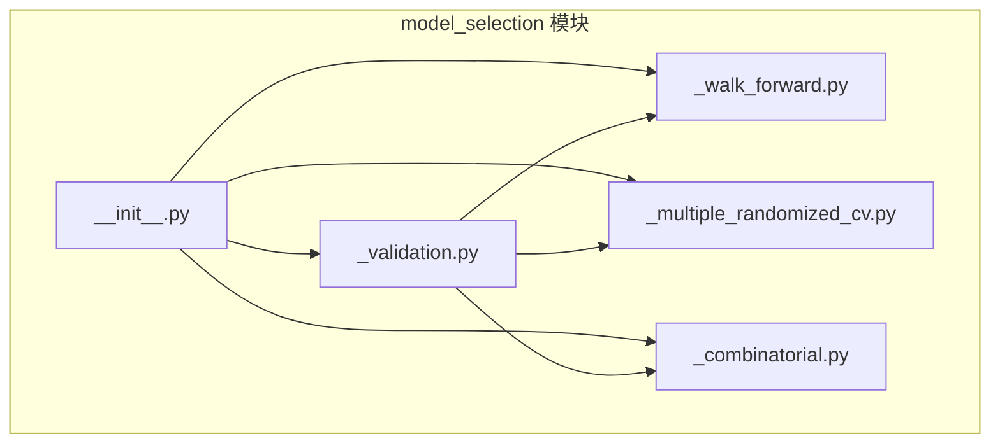
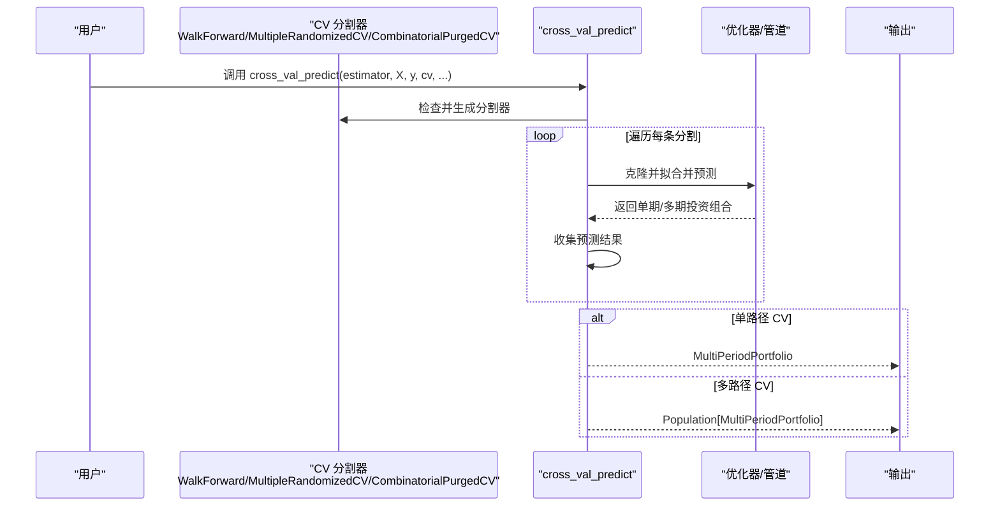
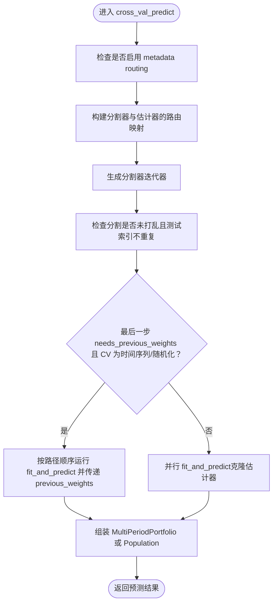
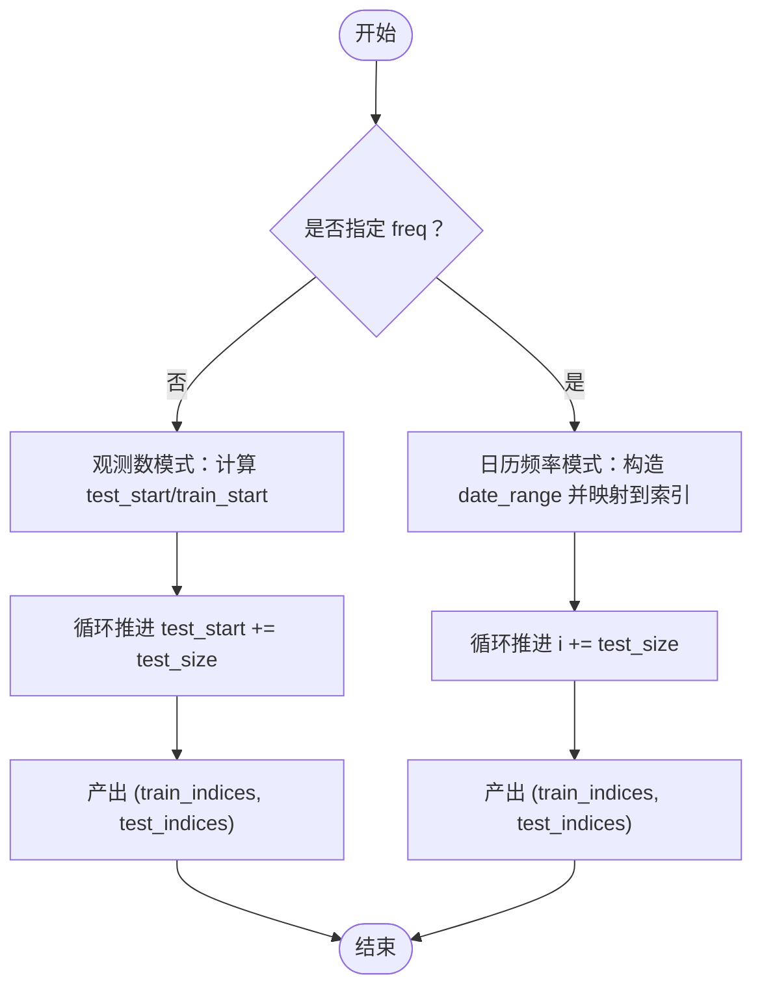
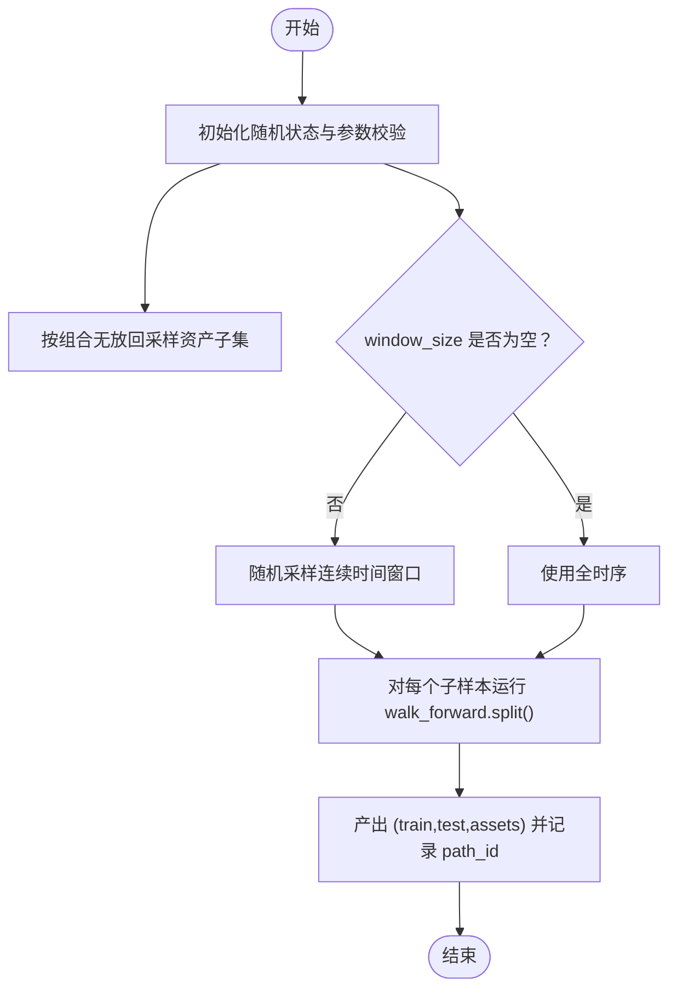
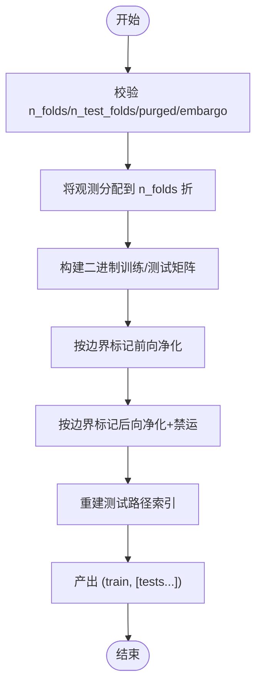
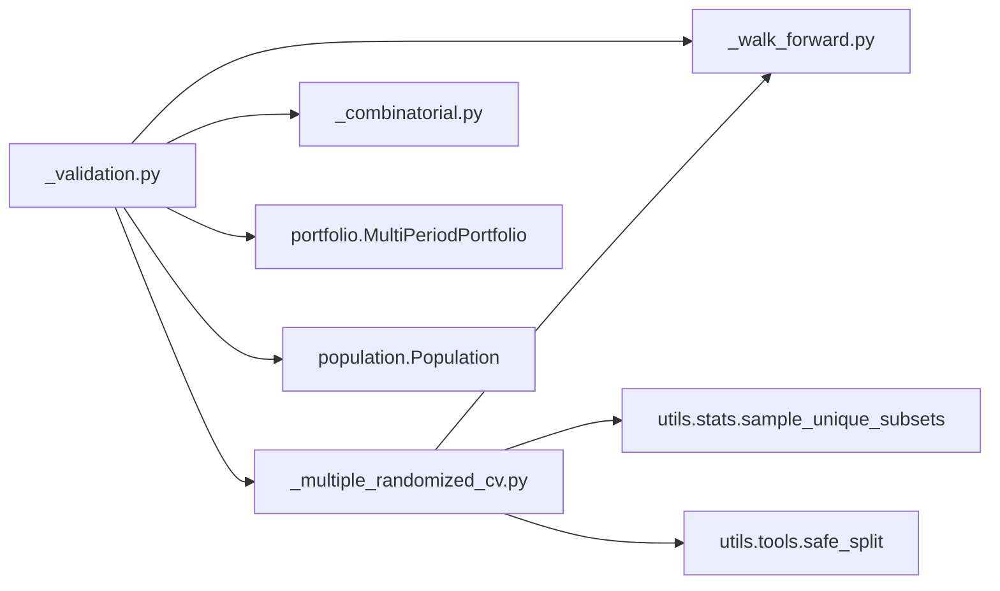

# 模型选择模块API

<cite>
**本文引用的文件**
- [__init__.py](file://src/skfolio/model_selection/__init__.py)
- [_validation.py](file://src/skfolio/model_selection/_validation.py)
- [_walk_forward.py](file://src/skfolio/model_selection/_walk_forward.py)
- [_multiple_randomized_cv.py](file://src/skfolio/model_selection/_multiple_randomized_cv.py)
- [_combinatorial.py](file://src/skfolio/model_selection/_combinatorial.py)
- [model_selection.rst](file://docs/user_guide/model_selection.rst)
- [plot_1_multiple_randomized_cv.py](file://examples/model_selection/plot_1_multiple_randomized_cv.py)
- [test_validation.py](file://tests/test_model_selection/test_validation.py)
- [test_multiple_randomized_cv.py](file://tests/test_model_selection/test_multiple_randomized_cv.py)
</cite>

## 目录
1. [简介](#简介)
2. [项目结构](#项目结构)
3. [核心组件](#核心组件)
4. [架构总览](#架构总览)
5. [详细组件分析](#详细组件分析)
6. [依赖关系分析](#依赖关系分析)
7. [性能考量](#性能考量)
8. [故障排查指南](#故障排查指南)
9. [结论](#结论)
10. [附录](#附录)

## 简介
本文件为 skfolio 的 model_selection 模块提供详尽的 API 参考，重点覆盖以下内容：
- cross_val_predict 函数及其与 scikit-learn API 的兼容性
- 时间序列交叉验证器 WalkForward、MultipleRandomizedCV、CombinatorialPurgedCV 的完整参数说明与使用示例
- optimal_folds_number 辅助函数的用途与使用场景
- 在投资组合优化工作流中使用这些工具进行回测与超参数调优，并在 Pipeline 中集成它们

## 项目结构
model_selection 模块位于 src/skfolio/model_selection/，包含如下文件：
- __init__.py：导出模块公共接口
- _validation.py：实现 cross_val_predict 及其内部支持逻辑
- _walk_forward.py：WalkForward 时间序列交叉验证器
- _multiple_randomized_cv.py：MultipleRandomizedCV 随机化组合式交叉验证器
- _combinatorial.py：CombinatorialPurgedCV 组合净化交叉验证器及 optimal_folds_number

图表来源
- [__init__.py](file://src/skfolio/model_selection/__init__.py#L1-L23)
- [_validation.py](file://src/skfolio/model_selection/_validation.py#L1-L60)
- [_walk_forward.py](file://src/skfolio/model_selection/_walk_forward.py#L1-L40)
- [_multiple_randomized_cv.py](file://src/skfolio/model_selection/_multiple_randomized_cv.py#L1-L40)
- [_combinatorial.py](file://src/skfolio/model_selection/_combinatorial.py#L1-L40)

章节来源
- [__init__.py](file://src/skfolio/model_selection/__init__.py#L1-L23)

## 核心组件
- cross_val_predict：生成跨折预测的投资组合估计，输出单路径或多路径结果，兼容多种 CV 分割器（含时间序列与组合式）。
- WalkForward：基于“前进式”策略的时间序列分割器，支持观测数与日历频率两种模式。
- MultipleRandomizedCV：在资产子集与连续时间窗口上进行随机采样，再对每个子样本执行内层 WalkForward，得到多路径预测。
- CombinatorialPurgedCV：基于组合净化的交叉验证，通过多组训练/测试组合重建多条测试路径，避免数据泄露。
- optimal_folds_number：根据目标训练集大小与目标测试路径数量，寻找最优的总折数与测试折数。

章节来源
- [_validation.py](file://src/skfolio/model_selection/_validation.py#L35-L138)
- [_walk_forward.py](file://src/skfolio/model_selection/_walk_forward.py#L21-L110)
- [_multiple_randomized_cv.py](file://src/skfolio/model_selection/_multiple_randomized_cv.py#L21-L120)
- [_combinatorial.py](file://src/skfolio/model_selection/_combinatorial.py#L46-L120)
- [_combinatorial.py](file://src/skfolio/model_selection/_combinatorial.py#L484-L571)

## 架构总览
下图展示了 cross_val_predict 如何与不同 CV 分割器协作，以及返回值类型与数据流向。

图表来源
- [_validation.py](file://src/skfolio/model_selection/_validation.py#L187-L318)
- [_walk_forward.py](file://src/skfolio/model_selection/_walk_forward.py#L256-L331)
- [_multiple_randomized_cv.py](file://src/skfolio/model_selection/_multiple_randomized_cv.py#L212-L311)
- [_combinatorial.py](file://src/skfolio/model_selection/_combinatorial.py#L249-L323)

## 详细组件分析

### cross_val_predict API 参考
- 功能概述
  - 对给定的估计器或管道，按 cv 提供的分割对数据进行训练与预测，返回投资组合估计序列。
  - 对单路径 CV（如 KFold、WalkForward），返回 MultiPeriodPortfolio；对多路径 CV（CombinatorialPurgedCV、MultipleRandomizedCV），返回 Population[MultiPeriodPortfolio]。
  - 自动处理需要前一期权重的优化器（如带交易成本或滑点的模型），在路径间传递 previous_weights。
  - 支持 metadata routing（启用时自动路由 fit/fit 参数到分割器与估计器）。
- 主要参数
  - estimator：BaseEstimator 或 Pipeline，最后一步应为优化器。
  - X：形状为 (n_observations, n_assets) 的价格收益矩阵。
  - y：形状为 (n_observations, n_targets) 的可选目标数据（例如因子收益）。
  - cv：int、交叉验证生成器或分割器；可为 sklearn 的 KFold、TimeSeriesSplit，或本模块的 WalkForward、CombinatorialPurgedCV、MultipleRandomizedCV。
  - n_jobs：并行作业数，默认 None 表示 1，-1 使用全部处理器。
  - method：调用估计器的方法名（默认 predict）。
  - verbose：详细程度。
  - params：传入估计器 fit 与分割器 split 的参数字典（metadata routing 启用时会路由）。
  - pre_dispatch：并行调度策略字符串或整数。
  - column_indices：仅对 X 的部分列进行交叉验证（资产子集）。
  - portfolio_params：传入 MultiPeriodPortfolio 的额外参数（如 name、tag 等）。
- 返回值
  - 单路径 CV：MultiPeriodPortfolio（每个 Portfolio 对应一次测试集预测）。
  - 多路径 CV：Population（包含多个 MultiPeriodPortfolio，每个对应一条测试路径）。
- 兼容性与注意事项
  - 仅支持未打乱的分割（shuffle=False），否则抛出错误。
  - 测试索引不可重复，否则抛出错误。
  - 当估计器最后一步声明 needs_previous_weights=True 且 cv 为 WalkForward、MultipleRandomizedCV 或 sklearn 的 TimeSeriesSplit 时，将顺序传播 previous_weights，禁用并行以保证时序一致性。
  - 支持 Pipeline，最终步骤为优化器时自动提取并设置 previous_weights。
- 使用示例（来自用户指南与示例）
  - 基于 KFold 的单路径预测
  - 基于 WalkForward 的单路径预测
  - 基于 CombinatorialPurgedCV 的多路径预测
  - 基于 MultipleRandomizedCV 的多路径预测
- 关键实现要点
  - metadata routing：当启用时，为分割器与估计器分别构建 MetadataRouter 并处理 fit/fit 参数路由。
  - 分割器检查：确保 cv 不打乱、测试索引不重复。
  - 顺序路径处理：当需要 previous_weights 时，按路径顺序运行 fit_and_predict，并将上一折权重传递给下一折。
  - 输出组装：单路径 CV 按测试起始索引排序后组装 MultiPeriodPortfolio；多路径 CV 将每条路径收集为 Population。

章节来源
- [_validation.py](file://src/skfolio/model_selection/_validation.py#L35-L138)
- [_validation.py](file://src/skfolio/model_selection/_validation.py#L187-L318)
- [model_selection.rst](file://docs/user_guide/model_selection.rst#L14-L95)
- [plot_1_multiple_randomized_cv.py](file://examples/model_selection/plot_1_multiple_randomized_cv.py#L120-L170)

#### cross_val_predict 内部流程图

图表来源
- [_validation.py](file://src/skfolio/model_selection/_validation.py#L144-L318)

### WalkForward（前进式交叉验证器）
- 作用
  - 基于“前进式”策略划分时间序列数据，每次测试集索引严格大于前一次，避免未来信息泄露。
  - 支持两种模式：
    - 观测数模式：直接指定 test_size、train_size（整数）。
    - 日历频率模式：使用 pandas 频率与偏移，要求 X 为 DatetimeIndex 的 DataFrame。
- 关键参数
  - test_size：每次测试集长度（整数或频率定义）。
  - train_size：每次训练集长度（整数或 DateOffset/timedelta）。
  - freq：频率字符串或 DateOffset，用于日历对齐。
  - freq_offset：频率偏移量。
  - previous：当周期起点/终点不在索引中时，选择前一个或下一个最近观测。
  - expend_train：后续训练集是否扩展为所有历史观测。
  - reduce_test：允许最后一组测试集不足。
  - purged_size：训练集与测试集之间的时间净化窗口大小。
- 返回值
  - split 迭代器：每次产生 (train_indices, test_indices)。
  - get_n_splits：返回总分割次数。
- 使用示例
  - 观测数模式：固定训练/测试长度，逐步前进。
  - 日历频率模式：按 WOM-3FRI 等规则对齐重平衡日期，训练期长度由 DateOffset 指定。
- 注意事项
  - 若 freq 为 None，train_size 必须为整数；若 freq 非空，X 必须为 DatetimeIndex DataFrame。
  - purged_size 控制训练集边界，避免“看涨/看跌”信息泄露。

章节来源
- [_walk_forward.py](file://src/skfolio/model_selection/_walk_forward.py#L21-L110)
- [_walk_forward.py](file://src/skfolio/model_selection/_walk_forward.py#L256-L331)
- [_walk_forward.py](file://src/skfolio/model_selection/_walk_forward.py#L395-L537)

#### WalkForward 分割算法流程图

图表来源
- [_walk_forward.py](file://src/skfolio/model_selection/_walk_forward.py#L395-L537)

### MultipleRandomizedCV（多随机化交叉验证）
- 作用
  - 基于 Palomar 的“多重随机化回测”方法，在每轮抽样中：
    1) 随机抽取连续时间窗口；
    2) 随机抽取不重复的资产子集；
    3) 对该子样本应用内层 WalkForward，得到多条测试路径。
  - 通过组合无放回抽样与有限总体校正，降低样本均值方差。
- 关键参数
  - walk_forward：内层 WalkForward 实例。
  - n_subsamples：独立子样本数量。
  - asset_subset_size：每轮资产子集大小。
  - window_size：连续时间窗口长度；None 表示全时序。
  - random_state：随机种子。
- 返回值
  - split 迭代器：每次产出 (train_indices, test_indices, asset_indices)。
  - get_path_ids：返回每条测试集对应的路径编号（与 subsample 编号一致）。
- 使用示例
  - 固定时长窗口 + 固定资产子集大小，对每个子样本运行 WalkForward。
  - 日历频率下的 WalkForward（如 WOM-3FRI），结合 window_size 进行时间对齐。
- 注意事项
  - n_subsamples 必须满足组合约束（不超过 C(n_assets, asset_subset_size)）。
  - 当 window_size 非空时，需满足 2 <= window_size <= n_observations。

章节来源
- [_multiple_randomized_cv.py](file://src/skfolio/model_selection/_multiple_randomized_cv.py#L21-L120)
- [_multiple_randomized_cv.py](file://src/skfolio/model_selection/_multiple_randomized_cv.py#L212-L311)
- [test_multiple_randomized_cv.py](file://tests/test_model_selection/test_multiple_randomized_cv.py#L1-L120)

#### MultipleRandomizedCV 分割流程图

图表来源
- [_multiple_randomized_cv.py](file://src/skfolio/model_selection/_multiple_randomized_cv.py#L236-L311)

### CombinatorialPurgedCV（组合净化交叉验证）
- 作用
  - 基于组合的训练/测试划分，从 n_folds 中选择 n_test_folds 作为测试集合，其余为训练集合。
  - 通过 purged_size 与 embargo_size 清理训练集边界，避免标签重叠与序列相关导致的数据泄露。
- 关键参数
  - n_folds：总折数（必须 >= 3）。
  - n_test_folds：测试折数（必须 >= 2 且 < n_folds）。
  - purged_size：训练集边界清理长度（前后各清除若干观测）。
  - embargo_size：测试后紧邻观测的清理长度。
- 返回值
  - split 迭代器：每次产出 (train_indices, list[test_indices])，其中每个测试集合来自不同的折。
  - get_path_ids：返回每条测试集对应的路径编号（可重建多条测试路径）。
- 使用示例
  - 通过 summary 与 plot 方法可视化训练/测试折叠分布与净化/禁运区域。
- 注意事项
  - purged_size + embargo_size 必须小于最小折大小，否则抛出错误。

章节来源
- [_combinatorial.py](file://src/skfolio/model_selection/_combinatorial.py#L46-L120)
- [_combinatorial.py](file://src/skfolio/model_selection/_combinatorial.py#L249-L323)
- [_combinatorial.py](file://src/skfolio/model_selection/_combinatorial.py#L324-L419)

#### CombinatorialPurgedCV 分割流程图

图表来源
- [_combinatorial.py](file://src/skfolio/model_selection/_combinatorial.py#L249-L323)

### optimal_folds_number（最优折数搜索）
- 作用
  - 在给定观测数、目标训练集大小与目标测试路径数量的前提下，寻找最优的 n_folds 与 n_test_folds，使平均训练集大小与测试路径数量尽可能接近目标。
- 关键参数
  - n_observations：观测总数。
  - target_train_size：目标平均训练集大小。
  - target_n_test_paths：目标测试路径数量。
  - weight_train_size、weight_n_test_paths：目标偏差的权重。
- 返回值
  - (n_folds, n_test_folds)：最优折数组合。
- 使用示例
  - 在用户指南中演示了如何先求解最优折数，再实例化 CombinatorialPurgedCV 并打印摘要。

章节来源
- [_combinatorial.py](file://src/skfolio/model_selection/_combinatorial.py#L484-L571)
- [model_selection.rst](file://docs/user_guide/model_selection.rst#L146-L162)

## 依赖关系分析
- cross_val_predict 依赖
  - sklearn.model_selection.check_cv：统一 cv 输入（int、分割器、迭代器）。
  - joblib.Parallel/delayed：并行拟合并预测。
  - skfolio.utils.tools.fit_and_predict：封装克隆估计器、安全切片与预测。
  - skfolio.portfolio.MultiPeriodPortfolio、skfolio.population.Population：组装输出。
- WalkForward 依赖
  - pandas.DatetimeIndex：日历频率模式依赖。
  - numpy：索引与数组操作。
- MultipleRandomizedCV 依赖
  - skfolio.model_selection.WalkForward：内层时间序列分割。
  - skfolio.utils.stats.sample_unique_subsets：组合无放回采样。
  - skfolio.utils.tools.safe_split：按时间窗口切片。
- CombinatorialPurgedCV 依赖
  - itertools：组合生成。
  - math.comb：组合数计算。
  - numpy/pandas：索引与可视化。

图表来源
- [_validation.py](file://src/skfolio/model_selection/_validation.py#L1-L40)
- [_multiple_randomized_cv.py](file://src/skfolio/model_selection/_multiple_randomized_cv.py#L1-L20)
- [_combinatorial.py](file://src/skfolio/model_selection/_combinatorial.py#L1-L20)

章节来源
- [_validation.py](file://src/skfolio/model_selection/_validation.py#L1-L40)
- [_multiple_randomized_cv.py](file://src/skfolio/model_selection/_multiple_randomized_cv.py#L1-L20)
- [_combinatorial.py](file://src/skfolio/model_selection/_combinatorial.py#L1-L20)

## 性能考量
- 并行策略
  - n_jobs 控制并行度；当估计器声明 needs_previous_weights 且 CV 为 WalkForward/MultipleRandomizedCV/TimeSeriesSplit 时，将禁用并行以保证时序一致性。
  - pre_dispatch 控制并行调度数量，减少内存峰值。
- 计算复杂度
  - MultipleRandomizedCV：随 n_subsamples 与内层 WalkForward 分割数线性增长；资产子集采样在小组合空间下采用组合无放回算法，避免存储所有组合。
  - CombinatorialPurgedCV：随 n_folds 与 n_test_folds 的组合数增长，但通过组合对称性与阈值剪枝减少无效搜索。
- I/O 与内存
  - safe_split 与 fit_and_predict 有助于在大矩阵上按需切片，降低内存占用。
  - 多路径输出 Population 会累积多个 MultiPeriodPortfolio，注意内存与绘图开销。

[本节为通用指导，无需特定文件来源]

## 故障排查指南
- 数据泄露风险
  - 使用 sklearn 的 KFold/TimeSeriesSplit 时，必须确保 shuffle=False，否则会引发错误。
  - 使用 WalkForward 时，确保 purged_size 与 embargo_size 不超过最小折大小。
- previous_weights 传递问题
  - 当估计器最后一步声明 needs_previous_weights=True 时，必须使用 WalkForward、MultipleRandomizedCV 或 TimeSeriesSplit，否则无法正确传递权重。
  - 若 n_jobs 非 None 且需要 previous_weights，将发出警告并禁用并行。
- 输出类型判断
  - 单路径 CV 返回 MultiPeriodPortfolio；多路径 CV 返回 Population。若类型不符，检查 cv 类型与分割器实现。
- 路由参数错误
  - 启用 metadata routing 时，未请求的元数据参数会被拒绝，需显式 set_fit_request(...) 或在 params 中移除。

章节来源
- [_validation.py](file://src/skfolio/model_selection/_validation.py#L192-L208)
- [_validation.py](file://src/skfolio/model_selection/_validation.py#L238-L256)
- [_validation.py](file://src/skfolio/model_selection/_validation.py#L318-L341)
- [test_validation.py](file://tests/test_model_selection/test_validation.py#L1-L120)

## 结论
skfolio 的 model_selection 模块围绕投资组合优化的时序特性，提供了与 scikit-learn 兼容的 cross_val_predict，以及 WalkForward、MultipleRandomizedCV、CombinatorialPurgedCV 等专用交叉验证器。通过 optimal_folds_number，用户可以系统地设定组合净化 CV 的折数配置。配合 Pipeline，可在预处理、特征工程与优化器之间无缝集成，完成稳健的回测与超参数调优。

[本节为总结，无需特定文件来源]

## 附录

### 使用示例与最佳实践
- 在 Pipeline 中集成
  - 将预选择（如 SelectKExtremes）与优化器（如 MeanRisk/HierarchicalEqualRiskContribution）组合为 Pipeline，然后使用 cross_val_predict 在测试集上评估。
  - 示例参考：示例脚本与用户指南中的 WalkForward 与 MultipleRandomizedCV 使用。
- 超参数调优
  - 使用 RandomizedSearchCV/GridSearchCV 在训练集上对 Pipeline 的参数进行搜索，随后用 cross_val_predict 在测试集上进行稳健评估。
- 多路径评估
  - 使用 MultipleRandomizedCV 或 CombinatorialPurgedCV 获取多条测试路径，结合 Population 的统计汇总与可视化功能，评估性能分布与不确定性。

章节来源
- [model_selection.rst](file://docs/user_guide/model_selection.rst#L1-L95)
- [plot_1_multiple_randomized_cv.py](file://examples/model_selection/plot_1_multiple_randomized_cv.py#L1-L120)
- [test_validation.py](file://tests/test_model_selection/test_validation.py#L120-L200)
- [test_multiple_randomized_cv.py](file://tests/test_model_selection/test_multiple_randomized_cv.py#L120-L200)