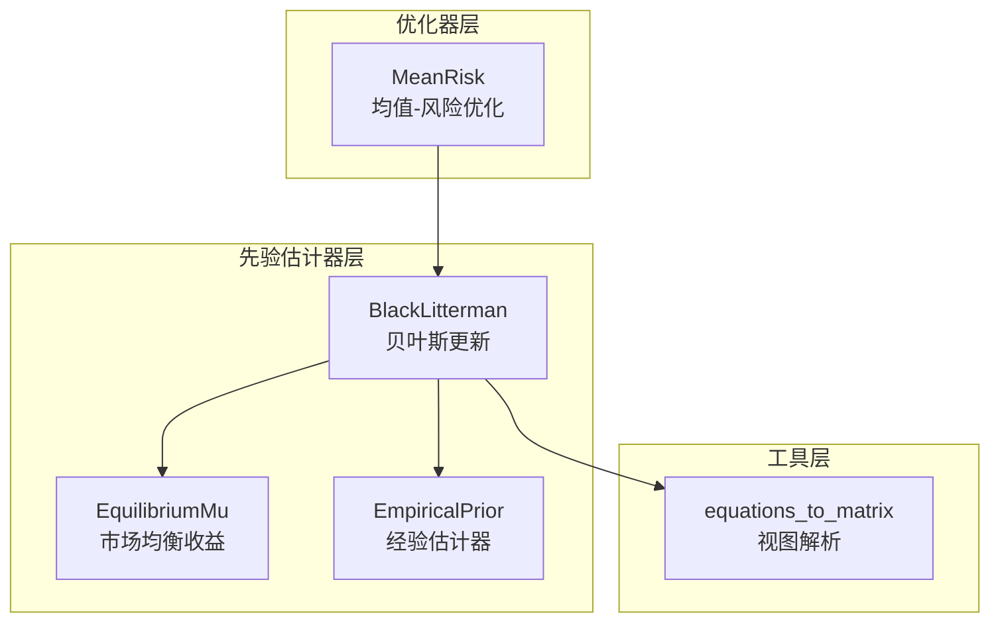
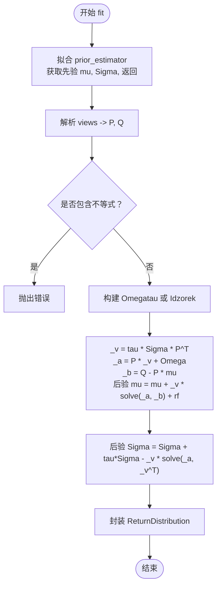
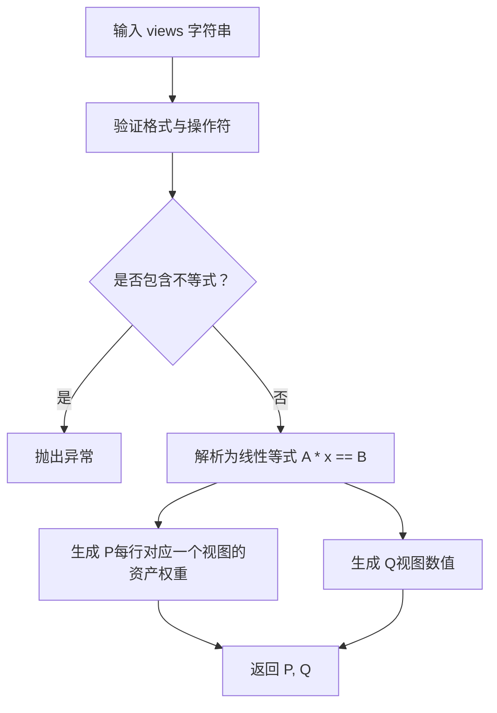
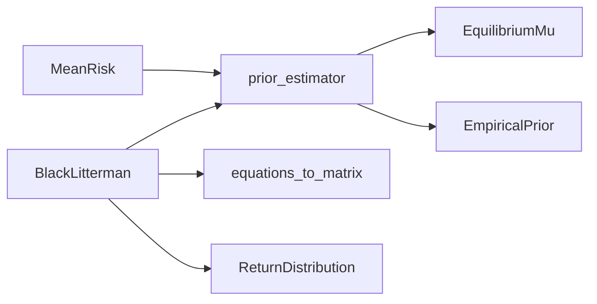

# Black-Litterman模型

<cite>
**本文引用的文件**
- [src/skfolio/prior/_black_litterman.py](file://src/skfolio/prior/_black_litterman.py)
- [src/skfolio/utils/equations.py](file://src/skfolio/utils/equations.py)
- [src/skfolio/prior/_base.py](file://src/skfolio/prior/_base.py)
- [src/skfolio/moments/expected_returns/_equilibrium_mu.py](file://src/skfolio/moments/expected_returns/_equilibrium_mu.py)
- [src/skfolio/prior/_empirical.py](file://src/skfolio/prior/_empirical.py)
- [examples/mean_risk/plot_12_black_and_litterman.py](file://examples/mean_risk/plot_12_black_and_litterman.py)
- [tests/test_prior/test_black_litterman.py](file://tests/test_prior/test_black_litterman.py)
- [tests/test_optimization/test_convex/test_mean_risk.py](file://tests/test_optimization/test_convex/test_mean_risk.py)
- [docs/user_guide/prior.rst](file://docs/user_guide/prior.rst)
</cite>

## 目录
1. [简介](#简介)
2. [项目结构](#项目结构)
3. [核心组件](#核心组件)
4. [架构总览](#架构总览)
5. [详细组件分析](#详细组件分析)
6. [依赖关系分析](#依赖关系分析)
7. [性能考量](#性能考量)
8. [故障排查指南](#故障排查指南)
9. [结论](#结论)
10. [附录：使用示例与最佳实践](#附录使用示例与最佳实践)

## 简介
本文件系统性解析 Black-Litterman 先验估计器在 skfolio 中的实现与使用方法。Black-Litterman 模型以贝叶斯框架为核心，将“市场均衡收益”（逆优化得出）作为先验，结合分析师的主观观点，生成后验的预期收益与协方差，从而为后续 MeanRisk 等优化器提供更稳健的输入。本文将重点阐述：
- 观点矩阵 P、观点预期值 Q、观点不确定性 Omega 的构建方式与影响；
- 参数 tau 与可选的 Idzorek 置信度向量对结果的影响；
- 如何定义资产或分组观点、调用 BlackLitterman 并将其返回的 ReturnDistribution 传入 MeanRisk；
- 经济含义与在实际投资中的应用价值。

## 项目结构
围绕 Black-Litterman 的实现，涉及以下模块：
- prior/_black_litterman.py：BlackLitterman 核心实现，负责贝叶斯更新与 ReturnDistribution 产出；
- utils/equations.py：将自然语言形式的“视图”转换为线性等式/不等式矩阵，支持分组汇总；
- prior/_base.py：ReturnDistribution 数据结构与 BasePrior 抽象接口；
- moments/expected_returns/_equilibrium_mu.py：EquilibriumMu 提供市场均衡收益（默认先验）；
- prior/_empirical.py：EmpiricalPrior 提供经验估计器（可作为 prior_estimator 的默认实现）；
- examples/mean_risk/plot_12_black_and_litterman.py：Black-Litterman 与 MeanRisk 的完整使用示例；
- tests/test_prior/test_black_litterman.py：覆盖 BlackLitterman 的行为与一致性校验；
- tests/test_optimization/test_convex/test_mean_risk.py：与 MeanRisk 集成的端到端测试；
- docs/user_guide/prior.rst：用户指南中对 Black-Litterman 的介绍与示例。



图表来源
- [src/skfolio/prior/_black_litterman.py](file://src/skfolio/prior/_black_litterman.py#L151-L269)
- [src/skfolio/utils/equations.py](file://src/skfolio/utils/equations.py#L32-L141)
- [src/skfolio/moments/expected_returns/_equilibrium_mu.py](file://src/skfolio/moments/expected_returns/_equilibrium_mu.py#L82-L126)
- [src/skfolio/prior/_empirical.py](file://src/skfolio/prior/_empirical.py#L109-L205)
- [src/skfolio/optimization/convex/_mean_risk.py](file://src/skfolio/optimization/convex/_mean_risk.py#L144-L150)

章节来源
- [src/skfolio/prior/_black_litterman.py](file://src/skfolio/prior/_black_litterman.py#L1-L269)
- [src/skfolio/utils/equations.py](file://src/skfolio/utils/equations.py#L1-L506)
- [src/skfolio/prior/_base.py](file://src/skfolio/prior/_base.py#L1-L70)
- [src/skfolio/moments/expected_returns/_equilibrium_mu.py](file://src/skfolio/moments/expected_returns/_equilibrium_mu.py#L1-L126)
- [src/skfolio/prior/_empirical.py](file://src/skfolio/prior/_empirical.py#L1-L205)
- [examples/mean_risk/plot_12_black_and_litterman.py](file://examples/mean_risk/plot_12_black_and_litterman.py#L1-L130)
- [tests/test_prior/test_black_litterman.py](file://tests/test_prior/test_black_litterman.py#L92-L611)
- [tests/test_optimization/test_convex/test_mean_risk.py](file://tests/test_optimization/test_convex/test_mean_risk.py#L944-L1061)
- [docs/user_guide/prior.rst](file://docs/user_guide/prior.rst#L81-L114)

## 核心组件
- BlackLitterman：贝叶斯先验估计器，接收 analyst views，解析为 P、Q；结合先验 mu 与 Sigma，计算后验 mu 与 Sigma，并封装为 ReturnDistribution。
- ReturnDistribution：包含 mu、covariance、returns 等字段的数据容器，供优化器直接消费。
- EquilibriumMu：默认先验的市场均衡收益估计器，基于风险厌恶系数与协方差矩阵计算均衡收益。
- EmpiricalPrior：经验估计器，可作为 prior_estimator 的默认实现，分别拟合 mu 与协方差。
- equations_to_matrix：将自然语言视图字符串解析为线性等式/不等式矩阵，支持按分组汇总并归一化。

章节来源
- [src/skfolio/prior/_black_litterman.py](file://src/skfolio/prior/_black_litterman.py#L127-L269)
- [src/skfolio/prior/_base.py](file://src/skfolio/prior/_base.py#L15-L70)
- [src/skfolio/moments/expected_returns/_equilibrium_mu.py](file://src/skfolio/moments/expected_returns/_equilibrium_mu.py#L20-L126)
- [src/skfolio/prior/_empirical.py](file://src/skfolio/prior/_empirical.py#L17-L205)
- [src/skfolio/utils/equations.py](file://src/skfolio/utils/equations.py#L32-L141)

## 架构总览
Black-Litterman 的工作流如下：
- 输入：资产日/分钟/小时等价格或收益率数据 X；
- 先验：由 prior_estimator（默认 EmpiricalPrior + EquilibriumMu）给出先验 mu 与 Sigma；
- 视图：分析师提供的自然语言视图（绝对/相对），经 equations_to_matrix 转换为 P、Q；
- 不确定性：Omega 可由 tau 与先验协方差推导，或使用 Idzorek 方法由 view_confidences 推导；
- 后验：通过线性系统求解得到后验 mu 与 Sigma，并封装为 ReturnDistribution；
- 输出：供 MeanRisk 等优化器使用。

```mermaid
sequenceDiagram
participant User as "用户"
participant BL as "BlackLitterman"
participant PRIOR as "prior_estimator"
participant EQMU as "EquilibriumMu"
participant EMPI as "EmpiricalPrior"
participant UTIL as "equations_to_matrix"
participant OPT as "MeanRisk"
User->>BL : "构造 BlackLitterman(views, groups, prior_estimator, tau, ...)"
User->>BL : "fit(X)"
BL->>PRIOR : "fit(X)"
alt 默认 prior_estimator
PRIOR->>EMPI : "fit(X)"
EMPI->>EQMU : "fit(X)可选"
EQMU-->>EMPI : "mu_"
EMPI-->>BL : "返回先验 mu, Sigma"
else 自定义 prior_estimator
PRIOR-->>BL : "返回先验 mu, Sigma"
end
BL->>UTIL : "解析 views -> P, Q"
BL->>BL : "计算 Omegatau 或 Idzorek"
BL->>BL : "求解线性系统得到后验 mu, Sigma"
BL-->>User : "return_distribution_"
User->>OPT : "MeanRisk(..., prior_estimator=BL)"
OPT-->>User : "weights_"
```

图表来源
- [src/skfolio/prior/_black_litterman.py](file://src/skfolio/prior/_black_litterman.py#L151-L269)
- [src/skfolio/utils/equations.py](file://src/skfolio/utils/equations.py#L32-L141)
- [src/skfolio/moments/expected_returns/_equilibrium_mu.py](file://src/skfolio/moments/expected_returns/_equilibrium_mu.py#L82-L126)
- [src/skfolio/prior/_empirical.py](file://src/skfolio/prior/_empirical.py#L109-L205)
- [src/skfolio/optimization/convex/_mean_risk.py](file://src/skfolio/optimization/convex/_mean_risk.py#L144-L150)

## 详细组件分析

### BlackLitterman 类与贝叶斯更新流程
- 关键参数
  - views：分析师视图数组，支持绝对视图与相对视图，如 "AAPL == 0.00098"、"AAPL - GE == 0.00086"；
  - groups：资产分组映射，用于将视图中的分组名映射到具体资产；
  - prior_estimator：先验估计器，默认 EmpiricalPrior + EquilibriumMu；
  - tau：先验不确定性权重，越小越偏向视图；
  - view_confidences：可选的 Idzorek 置信度向量，范围 [0,1]；
  - risk_free_rate：无风险利率偏移项。
- 核心流程
  - 拟合 prior_estimator 获取先验 mu 与 Sigma；
  - 解析 views 为 P、Q，同时确保不包含不等式；
  - 计算 Omega（默认基于 tau 与先验协方差的对角近似，或使用 Idzorek 方法）；
  - 通过线性系统求解得到后验 mu 与 Sigma，并封装为 ReturnDistribution。



图表来源
- [src/skfolio/prior/_black_litterman.py](file://src/skfolio/prior/_black_litterman.py#L151-L269)

章节来源
- [src/skfolio/prior/_black_litterman.py](file://src/skfolio/prior/_black_litterman.py#L127-L269)

### 视图解析与矩阵构建（P、Q）
- 支持的视图模式
  - 绝对视图："asset_i == v"；
  - 相对视图："asset_i - asset_j == v"；
  - 分组视图："GroupA - GroupB == v" 或 "GroupA == v"；
  - 支持分组汇总时的 sum_to_one 归一化。
- 解析逻辑
  - 使用 equations_to_matrix 将字符串视图转换为线性等式矩阵 A、B；
  - P 为每个视图对应的资产权重向量（由分组映射与 sum_to_one 归一化得到）；
  - Q 即为视图数值向量；
  - 不支持不等式视图，若出现则报错。



图表来源
- [src/skfolio/utils/equations.py](file://src/skfolio/utils/equations.py#L32-L141)
- [src/skfolio/prior/_black_litterman.py](file://src/skfolio/prior/_black_litterman.py#L216-L226)

章节来源
- [src/skfolio/utils/equations.py](file://src/skfolio/utils/equations.py#L32-L141)
- [src/skfolio/prior/_black_litterman.py](file://src/skfolio/prior/_black_litterman.py#L192-L226)

### Omega 与不确定性建模
- 默认 Omega
  - 对角近似：diag(diag(tau * P * Sigma * P^T))；
  - 体现“视图误差”的不确定性，与先验协方差和 tau 成正比。
- Idzorek 方法
  - 使用 view_confidences ∈ (0,1]，将置信度转换为 alphas；
  - Omega 的对角元素按 alphas 缩放，从而允许不同视图赋予不同置信度；
  - 当置信度接近 0 时，内部以极小正值处理，避免除零。
- 影响
  - Omega 越大，视图对后验的影响越小；
  - Idzorek 可让强置信度视图主导后验，弱置信度视图退化为先验。

章节来源
- [src/skfolio/prior/_black_litterman.py](file://src/skfolio/prior/_black_litterman.py#L227-L254)

### 先验估计器与默认策略
- 默认 prior_estimator
  - EmpiricalPrior（mu_estimator=EquilibriumMu()）；
  - EquilibriumMu 基于风险厌恶系数与协方差矩阵计算均衡收益；
  - 若提供自定义 prior_estimator，则直接使用其 return_distribution_。
- 作用
  - 为 BlackLitterman 提供稳定的先验 mu 与 Sigma，避免直接使用样本均值导致的不稳定。

章节来源
- [src/skfolio/prior/_black_litterman.py](file://src/skfolio/prior/_black_litterman.py#L176-L182)
- [src/skfolio/moments/expected_returns/_equilibrium_mu.py](file://src/skfolio/moments/expected_returns/_equilibrium_mu.py#L20-L126)
- [src/skfolio/prior/_empirical.py](file://src/skfolio/prior/_empirical.py#L17-L205)

### 与 MeanRisk 的集成
- MeanRisk 接收 prior_estimator，内部从 prior_estimator.return_distribution_ 读取 mu 与 Sigma；
- 在示例中，BlackLitterman 作为 prior_estimator，直接传入 MeanRisk；
- 示例展示了最大化夏普比率的组合构建与回测对比。

章节来源
- [src/skfolio/optimization/convex/_mean_risk.py](file://src/skfolio/optimization/convex/_mean_risk.py#L144-L150)
- [examples/mean_risk/plot_12_black_and_litterman.py](file://examples/mean_risk/plot_12_black_and_litterman.py#L66-L129)
- [tests/test_optimization/test_convex/test_mean_risk.py](file://tests/test_optimization/test_convex/test_mean_risk.py#L944-L987)

## 依赖关系分析
- BlackLitterman 依赖
  - prior_estimator（默认 EmpiricalPrior + EquilibriumMu）；
  - utils.equations.equations_to_matrix：视图解析；
  - prior._base.ReturnDistribution：封装后验分布；
  - sklearn 元数据路由：支持嵌套 prior_estimator 的 fit 参数传递。
- MeanRisk 依赖
  - prior_estimator：提供 mu 与 Sigma；
  - RiskMeasure 与 ObjectiveFunction：定义优化目标。



图表来源
- [src/skfolio/prior/_black_litterman.py](file://src/skfolio/prior/_black_litterman.py#L151-L269)
- [src/skfolio/utils/equations.py](file://src/skfolio/utils/equations.py#L32-L141)
- [src/skfolio/prior/_base.py](file://src/skfolio/prior/_base.py#L15-L70)
- [src/skfolio/moments/expected_returns/_equilibrium_mu.py](file://src/skfolio/moments/expected_returns/_equilibrium_mu.py#L82-L126)
- [src/skfolio/prior/_empirical.py](file://src/skfolio/prior/_empirical.py#L109-L205)
- [src/skfolio/optimization/convex/_mean_risk.py](file://src/skfolio/optimization/convex/_mean_risk.py#L144-L150)

章节来源
- [src/skfolio/prior/_black_litterman.py](file://src/skfolio/prior/_black_litterman.py#L151-L269)
- [src/skfolio/utils/equations.py](file://src/skfolio/utils/equations.py#L32-L141)
- [src/skfolio/prior/_base.py](file://src/skfolio/prior/_base.py#L15-L70)
- [src/skfolio/moments/expected_returns/_equilibrium_mu.py](file://src/skfolio/moments/expected_returns/_equilibrium_mu.py#L82-L126)
- [src/skfolio/prior/_empirical.py](file://src/skfolio/prior/_empirical.py#L109-L205)
- [src/skfolio/optimization/convex/_mean_risk.py](file://src/skfolio/optimization/convex/_mean_risk.py#L144-L150)

## 性能考量
- 线性系统求解
  - 采用求解线性系统而非显式矩阵求逆，提升数值稳定性与效率；
  - Omega 的对角近似（默认）降低计算复杂度。
- Omega 的 Idzorek 方法
  - 需要对 alphas 进行缩放，但整体仍保持对角近似，避免大规模矩阵运算；
  - 当视图数量较多时，Omega 的规模与 P 的行数一致，注意内存与求解时间。
- 先验估计器
  - EmpiricalPrior + EquilibriumMu 的组合在大多数情况下足够稳定；
  - 若协方差估计噪声较大，可考虑使用 DenoiseCovariance 等降噪方法。

[本节为通用指导，无需列出章节来源]

## 故障排查指南
- 视图包含不等式
  - 现象：解析时报错；
  - 处理：仅使用等式视图（"=="），避免">="或"<="。
- 视图语法错误
  - 现象：解析失败或找不到分组；
  - 处理：检查操作符、空格与分组名称是否匹配；确认 groups 映射正确。
- 置信度越界
  - 现象：Idzorek 方法要求置信度在 (0,1]；
  - 处理：将 0 替换为极小正值；确保所有置信度合法。
- 先验估计器未提供列名
  - 现象：当 X 为数组且未提供 groups 时，无法解析资产名；
  - 处理：提供 groups 或使用 DataFrame 列名为资产名。
- 回测表现不佳
  - 现象：Black-Litterman 未显著优于经验估计；
  - 处理：检查视图质量与置信度设置；适当调整 tau；或尝试分组视图。

章节来源
- [src/skfolio/prior/_black_litterman.py](file://src/skfolio/prior/_black_litterman.py#L227-L254)
- [src/skfolio/utils/equations.py](file://src/skfolio/utils/equations.py#L32-L141)
- [tests/test_prior/test_black_litterman.py](file://tests/test_prior/test_black_litterman.py#L92-L133)

## 结论
Black-Litterman 在 skfolio 中通过贝叶斯框架将市场均衡收益与分析师主观视图有机结合，形成稳健的后验预期收益与协方差。其关键在于：
- 视图解析（P、Q）与 Omega（不确定性）的合理设定；
- 默认先验（EquilibriumMu + EmpiricalPrior）提供了稳健起点；
- 与 MeanRisk 的无缝集成使得后验输入可直接驱动优化。

在实践中，建议：
- 使用清晰、可验证的视图表达；
- 适度设置 tau 与置信度，避免过度拟合；
- 优先使用分组视图以提高可解释性与鲁棒性。

[本节为总结性内容，无需列出章节来源]

## 附录：使用示例与最佳实践

### 完整使用示例（Black-Litterman + MeanRisk）
- 步骤
  - 准备数据：加载价格并转换为日度收益率；
  - 定义视图：绝对/相对视图，必要时使用分组；
  - 构造 BlackLitterman 并 fit；
  - 传入 MeanRisk（如最大化夏普比率）进行优化；
  - 在测试集上预测并比较结果。
- 参考路径
  - [examples/mean_risk/plot_12_black_and_litterman.py](file://examples/mean_risk/plot_12_black_and_litterman.py#L66-L129)

章节来源
- [examples/mean_risk/plot_12_black_and_litterman.py](file://examples/mean_risk/plot_12_black_and_litterman.py#L66-L129)

### 视图构建最佳实践
- 绝对视图适用于对单个资产收益的判断；
- 相对视图适用于比较两个资产的收益差异；
- 分组视图适用于宏观或因子层面的判断；
- 视图置信度建议基于历史波动率、专家权威度或回测稳定性设定。

章节来源
- [src/skfolio/prior/_black_litterman.py](file://src/skfolio/prior/_black_litterman.py#L227-L254)
- [src/skfolio/utils/equations.py](file://src/skfolio/utils/equations.py#L32-L141)

### 参数选择建议
- tau
  - 较小值（如 1/n_obs）：更信任视图，后验更偏向视图；
  - 较大值：更信任先验，后验更接近市场均衡收益。
- risk_free_rate
  - 仅在需要将收益平移时使用，通常设为 0。

章节来源
- [src/skfolio/prior/_black_litterman.py](file://src/skfolio/prior/_black_litterman.py#L127-L141)

### 经济含义与应用价值
- 经济含义
  - 先验 mu 代表“市场均衡”下的理性预期；
  - 视图代表“分析师观点”，Omega 表征不确定性；
  - 后验 mu 是先验与视图的加权融合，Sigma 反映后验不确定性。
- 实战价值
  - 降低样本估计误差对优化权重的扰动；
  - 将专家知识融入量化模型，提升组合稳定性；
  - 便于压力测试与情景分析（结合 MeanRisk 的风险度量）。

章节来源
- [docs/user_guide/prior.rst](file://docs/user_guide/prior.rst#L81-L114)
- [src/skfolio/optimization/convex/_mean_risk.py](file://src/skfolio/optimization/convex/_mean_risk.py#L101-L103)