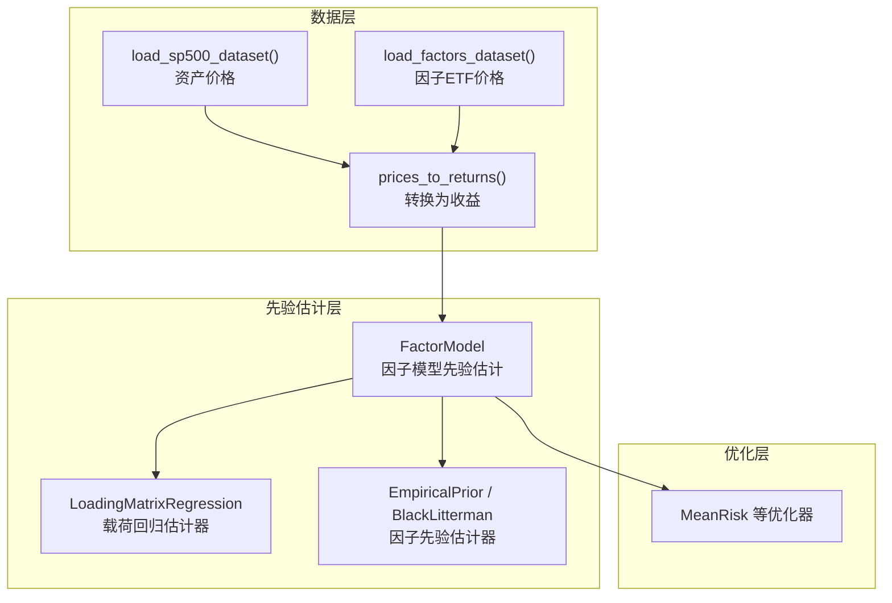
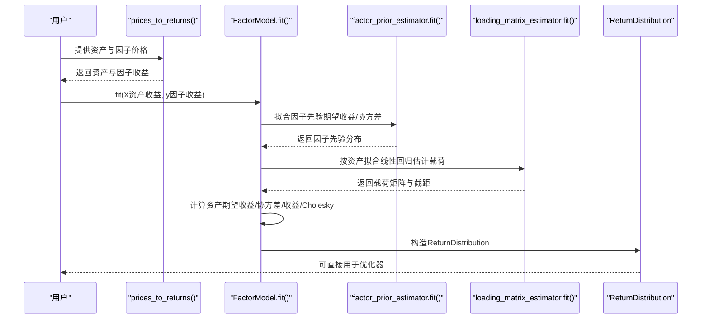
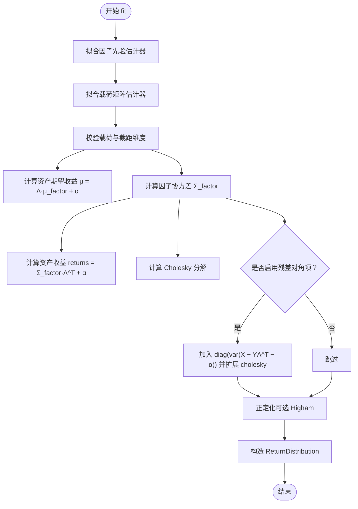
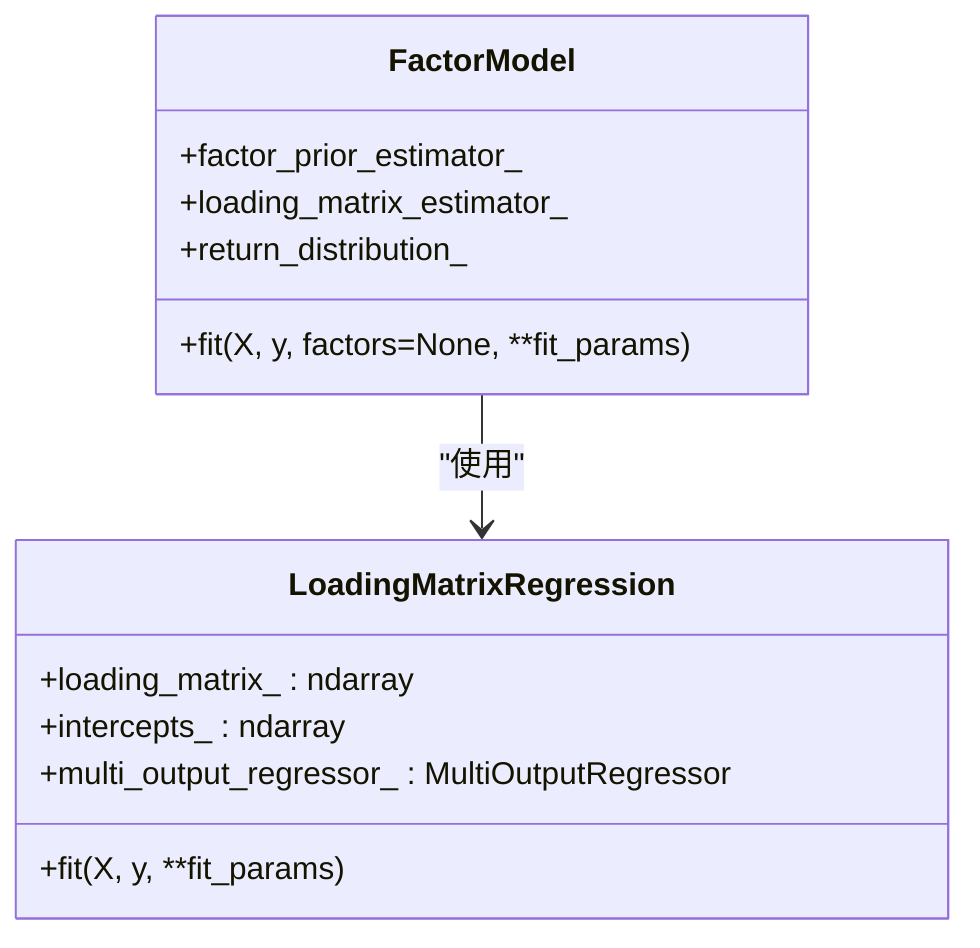
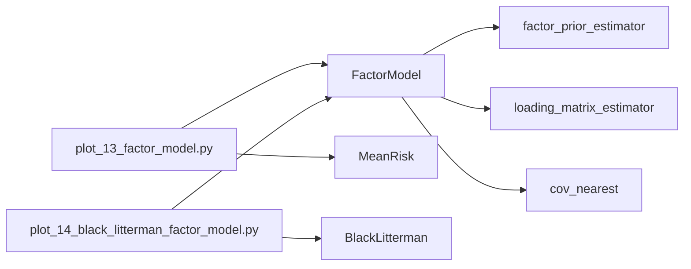

# 因子模型

<cite>
**本文引用的文件**
- [src/skfolio/prior/_factor_model.py](file://src/skfolio/prior/_factor_model.py)
- [examples/mean_risk/plot_13_factor_model.py](file://examples/mean_risk/plot_13_factor_model.py)
- [examples/mean_risk/plot_14_black_litterman_factor_model.py](file://examples/mean_risk/plot_14_black_litterman_factor_model.py)
- [src/skfolio/datasets/_base.py](file://src/skfolio/datasets/_base.py)
- [src/skfolio/preprocessing/_returns.py](file://src/skfolio/preprocessing/_returns.py)
- [docs/user_guide/prior.rst](file://docs/user_guide/prior.rst)
- [tests/test_prior/test_factor_model.py](file://tests/test_prior/test_factor_model.py)
</cite>

## 目录
1. [引言](#引言)
2. [项目结构](#项目结构)
3. [核心组件](#核心组件)
4. [架构总览](#架构总览)
5. [详细组件分析](#详细组件分析)
6. [依赖关系分析](#依赖关系分析)
7. [性能与数值稳定性](#性能与数值稳定性)
8. [故障排查指南](#故障排查指南)
9. [结论](#结论)
10. [附录：使用流程与最佳实践](#附录使用流程与最佳实践)

## 引言
本文件系统性记录因子模型（FactorModel）在先验估计中的应用，重点阐述其如何通过因子载荷、因子协方差与残差方差（特异性风险）构建更稳定、低噪声的协方差矩阵估计；说明支持的因子类型（宏观、风格、行业因子）及其数据输入格式；给出从因子数据准备到协方差矩阵估计的完整流程；并讨论模型假设、参数选择（如对角化特异性协方差）、以及在不同市场环境下的表现与适用场景。

## 项目结构
围绕因子模型的相关模块与示例分布如下：
- 核心实现：src/skfolio/prior/_factor_model.py
- 数据集加载：src/skfolio/datasets/_base.py（提供宏观风格因子ETF价格）
- 数据预处理：src/skfolio/preprocessing/_returns.py（价格转收益）
- 使用示例：examples/mean_risk/plot_13_factor_model.py、plot_14_black_litterman_factor_model.py
- 用户指南：docs/user_guide/prior.rst
- 单元测试：tests/test_prior/test_factor_model.py

图表来源
- [src/skfolio/datasets/_base.py](file://src/skfolio/datasets/_base.py#L247-L293)
- [src/skfolio/preprocessing/_returns.py](file://src/skfolio/preprocessing/_returns.py#L13-L133)
- [src/skfolio/prior/_factor_model.py](file://src/skfolio/prior/_factor_model.py#L148-L347)
- [examples/mean_risk/plot_13_factor_model.py](file://examples/mean_risk/plot_13_factor_model.py#L60-L120)

章节来源
- [src/skfolio/datasets/_base.py](file://src/skfolio/datasets/_base.py#L247-L293)
- [src/skfolio/preprocessing/_returns.py](file://src/skfolio/preprocessing/_returns.py#L13-L133)
- [src/skfolio/prior/_factor_model.py](file://src/skfolio/prior/_factor_model.py#L148-L347)
- [examples/mean_risk/plot_13_factor_model.py](file://examples/mean_risk/plot_13_factor_model.py#L60-L120)

## 核心组件
- FactorModel：基于因子结构的先验估计器，输出资产预期收益与协方差矩阵，并可生成Cholesky分解与样本权重。
- LoadingMatrixRegression：按资产逐个拟合线性回归以估计因子载荷矩阵（贝塔），默认使用LassoCV进行稀疏估计。
- 因子先验估计器（factor_prior_estimator）：默认EmpiricalPrior，也可替换为BlackLitterman等，用于估计因子的期望收益与协方差。
- ReturnDistribution：封装返回向量、样本权重、协方差矩阵、期望收益与Cholesky分解，供优化器直接使用。

章节来源
- [src/skfolio/prior/_factor_model.py](file://src/skfolio/prior/_factor_model.py#L148-L347)
- [docs/user_guide/prior.rst](file://docs/user_guide/prior.rst#L115-L180)

## 架构总览
因子模型的先验估计流程由“因子先验估计 + 载荷估计 + 协方差投影”三步构成：
1) 因子先验估计：对因子收益拟合先验分布（期望收益与协方差）。
2) 载荷估计：对每个资产分别拟合线性回归，得到因子载荷矩阵与截距。
3) 协方差估计：通过线性变换将因子协方差投影到资产空间，并可选加入残差对角项（特异性风险）。

图表来源
- [src/skfolio/preprocessing/_returns.py](file://src/skfolio/preprocessing/_returns.py#L13-L133)
- [src/skfolio/prior/_factor_model.py](file://src/skfolio/prior/_factor_model.py#L242-L347)
- [examples/mean_risk/plot_13_factor_model.py](file://examples/mean_risk/plot_13_factor_model.py#L60-L120)

## 详细组件分析

### 组件一：因子模型（FactorModel）
- 输入输出
  - 输入：X（资产收益，形状 n×p）、y（因子收益，形状 n×k）
  - 输出：ReturnDistribution（包含μ、Σ、returns、cholesky、sample_weight）
- 关键步骤
  - 先验估计：调用factor_prior_estimator.fit(y)，得到因子期望收益与协方差。
  - 载荷估计：调用loading_matrix_estimator.fit(X, y)，得到载荷矩阵Λ与截距向量α。
  - 投影计算：μ = Λ·μ_factor + α；Σ = Λ·Σ_factor·Λ^T；returns = Σ_factor·Λ^T + α；cholesky = Λ·chol(Σ_factor)。
  - 特异性风险：若启用residual_variance，则加入残差对角项diag(var(X − YΛ^T − α))，并扩展cholesky。
  - 正定化：通过cov_nearest（可选Higham算法）保证协方差正定。
- 参数要点
  - residual_variance：是否加入残差对角项（特异性风险）。
  - higham/max_iteration：是否使用Higham算法进行最近半正定修正。
  - factor_prior_estimator：默认EmpiricalPrior，可替换为BlackLitterman等。
  - loading_matrix_estimator：默认LoadingMatrixRegression，可自定义线性回归器与并行度。

图表来源
- [src/skfolio/prior/_factor_model.py](file://src/skfolio/prior/_factor_model.py#L242-L347)

章节来源
- [src/skfolio/prior/_factor_model.py](file://src/skfolio/prior/_factor_model.py#L148-L347)

### 组件二：载荷估计器（LoadingMatrixRegression）
- 默认策略：对每个资产独立拟合线性回归（y → X），即对每个资产i拟合 y·β_i + α_i，得到载荷矩阵Λ与截距向量α。
- 默认回归器：LassoCV（无截距），可替换为其他线性回归器（如RidgeCV）并支持并行。
- 多输出并行：使用MultiOutputRegressor并行拟合所有资产。

图表来源
- [src/skfolio/prior/_factor_model.py](file://src/skfolio/prior/_factor_model.py#L47-L147)
- [src/skfolio/prior/_factor_model.py](file://src/skfolio/prior/_factor_model.py#L242-L347)

章节来源
- [src/skfolio/prior/_factor_model.py](file://src/skfolio/prior/_factor_model.py#L47-L147)

### 组件三：因子先验估计器（factor_prior_estimator）
- 默认：EmpiricalPrior（可配置mu_estimator与covariance_estimator，如ShrunkMu、GerberCovariance等）。
- 可替换：BlackLitterman（可对因子施加观点，形成“黑-卢布森因子模型”）。
- 作用：为因子收益提供期望收益与协方差，作为资产协方差投影的基础。

章节来源
- [src/skfolio/prior/_factor_model.py](file://src/skfolio/prior/_factor_model.py#L276-L300)
- [examples/mean_risk/plot_14_black_litterman_factor_model.py](file://examples/mean_risk/plot_14_black_litterman_factor_model.py#L33-L71)

### 组件四：数据准备与输入格式
- 数据集
  - load_sp500_dataset()：20只股票日频价格。
  - load_factors_dataset()：5只因子ETF日频价格（Momentum、Quality、Size、Value、Low Volatility）。
- 收益转换
  - prices_to_returns()：将价格转换为线性或对数收益，自动对齐时间、填充缺失、丢弃不合规观测。
- 输入格式
  - X：资产收益（n×p）
  - y：因子收益（n×k）

章节来源
- [src/skfolio/datasets/_base.py](file://src/skfolio/datasets/_base.py#L247-L293)
- [src/skfolio/preprocessing/_returns.py](file://src/skfolio/preprocessing/_returns.py#L13-L133)
- [examples/mean_risk/plot_13_factor_model.py](file://examples/mean_risk/plot_13_factor_model.py#L60-L120)

## 依赖关系分析
- FactorModel依赖
  - 因子先验估计器：提供因子期望收益与协方差。
  - 载荷估计器：提供因子载荷矩阵与截距。
  - 数值工具：cov_nearest（正定化）。
- 示例依赖
  - MeanRisk优化器：接收ReturnDistribution作为先验输入。
  - EmpiricalPrior/ShrunkMu/GerberCovariance：用于因子先验估计器的组合。

图表来源
- [src/skfolio/prior/_factor_model.py](file://src/skfolio/prior/_factor_model.py#L242-L347)
- [examples/mean_risk/plot_13_factor_model.py](file://examples/mean_risk/plot_13_factor_model.py#L60-L120)
- [examples/mean_risk/plot_14_black_litterman_factor_model.py](file://examples/mean_risk/plot_14_black_litterman_factor_model.py#L33-L71)

章节来源
- [src/skfolio/prior/_factor_model.py](file://src/skfolio/prior/_factor_model.py#L242-L347)
- [examples/mean_risk/plot_13_factor_model.py](file://examples/mean_risk/plot_13_factor_model.py#L60-L120)
- [examples/mean_risk/plot_14_black_litterman_factor_model.py](file://examples/mean_risk/plot_14_black_litterman_factor_model.py#L33-L71)

## 性能与数值稳定性
- 维度降低与估计质量
  - 通过因子结构将p维协方差压缩至k维（k远小于p），显著减少参数数量，降低估计噪声，提升稳定性。
  - 载荷估计采用稀疏回归（默认LassoCV）可进一步抑制噪声与过拟合。
- 特异性风险对角化
  - 启用residual_variance时，加入残差对角项，使协方差更贴近实际观测波动，但可能引入额外噪声；需结合数据长度与噪声水平权衡。
- 正定化
  - 默认使用快速裁剪方法；在对正定性要求较高时可启用Higham算法（更准确但较慢），通过max_iteration控制迭代上限。
- 并行与可扩展性
  - 载荷估计支持多输出并行（n_jobs），在资产较多时可加速训练。

章节来源
- [src/skfolio/prior/_factor_model.py](file://src/skfolio/prior/_factor_model.py#L148-L210)
- [src/skfolio/prior/_factor_model.py](file://src/skfolio/prior/_factor_model.py#L242-L347)

## 故障排查指南
- 常见错误与定位
  - 载荷矩阵形状不匹配：当loading_matrix_estimator返回的形状与资产数不一致时会抛出异常。检查X与y的列数与线性回归器设置。
  - 截距形状不匹配：intercepts_必须为(资产数,)，否则报错。
  - 因子先验估计器参数传递：启用metadata路由时，确保传入的fit参数与先验估计器兼容（如ImpliedCovariance需要implied_vol）。
- 测试参考
  - 单元测试覆盖了基本功能、Cholesky重构一致性、Black-Litterman因子模型、metadata路由错误与正确路径等。

章节来源
- [src/skfolio/prior/_factor_model.py](file://src/skfolio/prior/_factor_model.py#L309-L347)
- [tests/test_prior/test_factor_model.py](file://tests/test_prior/test_factor_model.py#L14-L38)
- [tests/test_prior/test_factor_model.py](file://tests/test_prior/test_factor_model.py#L40-L120)
- [tests/test_prior/test_factor_model.py](file://tests/test_prior/test_factor_model.py#L531-L564)

## 结论
因子模型通过“因子先验 + 载荷估计 + 协方差投影”的框架，在先验估计中有效降低协方差估计维度、抑制噪声、提升稳定性。默认配置（LassoCV载荷估计 + EmpiricalPrior因子先验 + 残差对角项）在多数场景下表现稳健；在对正定性有更高要求时可启用Higham算法。结合BlackLitterman等观点模型，可在因子层面施加专家判断，进一步提升估计质量与策略适应性。

## 附录：使用流程与最佳实践

### 1) 数据准备与输入格式
- 加载资产与因子价格，转换为收益，确保时间对齐与缺失处理。
- 输入格式：X（资产收益，n×p）、y（因子收益，n×k）。

章节来源
- [src/skfolio/datasets/_base.py](file://src/skfolio/datasets/_base.py#L247-L293)
- [src/skfolio/preprocessing/_returns.py](file://src/skfolio/preprocessing/_returns.py#L13-L133)

### 2) 基础流程（示例）
- 使用默认因子模型估计先验并进行均值-方差优化。
- 自定义载荷估计器（如RidgeCV）与并行度。
- 使用BlackLitterman对因子施加观点，构建“黑-卢布森因子模型”。

章节来源
- [examples/mean_risk/plot_13_factor_model.py](file://examples/mean_risk/plot_13_factor_model.py#L60-L120)
- [examples/mean_risk/plot_14_black_litterman_factor_model.py](file://examples/mean_risk/plot_14_black_litterman_factor_model.py#L33-L71)

### 3) 参数选择建议
- 载荷估计：默认LassoCV已具备稀疏性；若数据噪声较大且样本较少，可尝试RidgeCV或增加正则强度；必要时提高并行度（n_jobs）。
- 残差对角项：样本量充足时可开启以捕捉特异性波动；样本量较小或噪声显著时可关闭。
- 正定化：默认足够；若出现非正定警告或优化不稳定，启用Higham算法并适当增加迭代次数。

章节来源
- [src/skfolio/prior/_factor_model.py](file://src/skfolio/prior/_factor_model.py#L148-L210)
- [src/skfolio/prior/_factor_model.py](file://src/skfolio/prior/_factor_model.py#L242-L347)

### 4) 不同市场环境下的表现
- 高波动/低样本：优先启用稀疏载荷估计（LassoCV）、谨慎开启残差对角项；必要时启用Higham正定化。
- 稳定/长序列：可考虑更强的稀疏约束或更复杂的因子先验估计器（如ShrunkMu、GerberCovariance）。
- 观点驱动：在因子层面施加BlackLitterman观点，适合主动管理与风格轮动场景。

章节来源
- [examples/mean_risk/plot_14_black_litterman_factor_model.py](file://examples/mean_risk/plot_14_black_litterman_factor_model.py#L33-L71)
- [docs/user_guide/prior.rst](file://docs/user_guide/prior.rst#L115-L180)