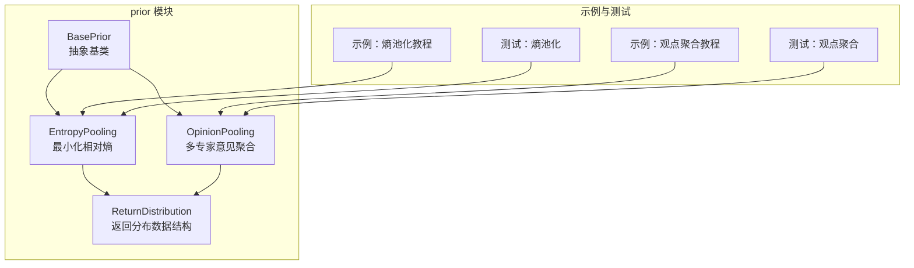
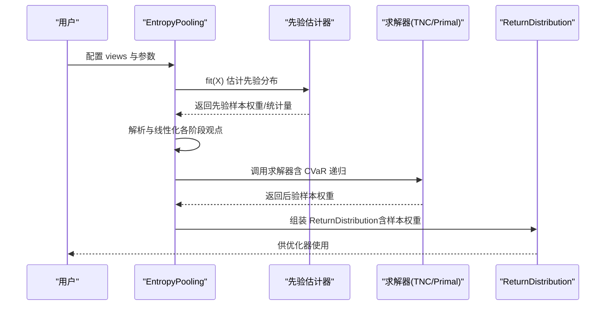
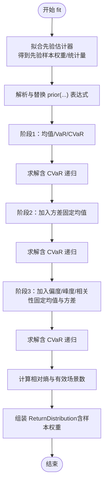
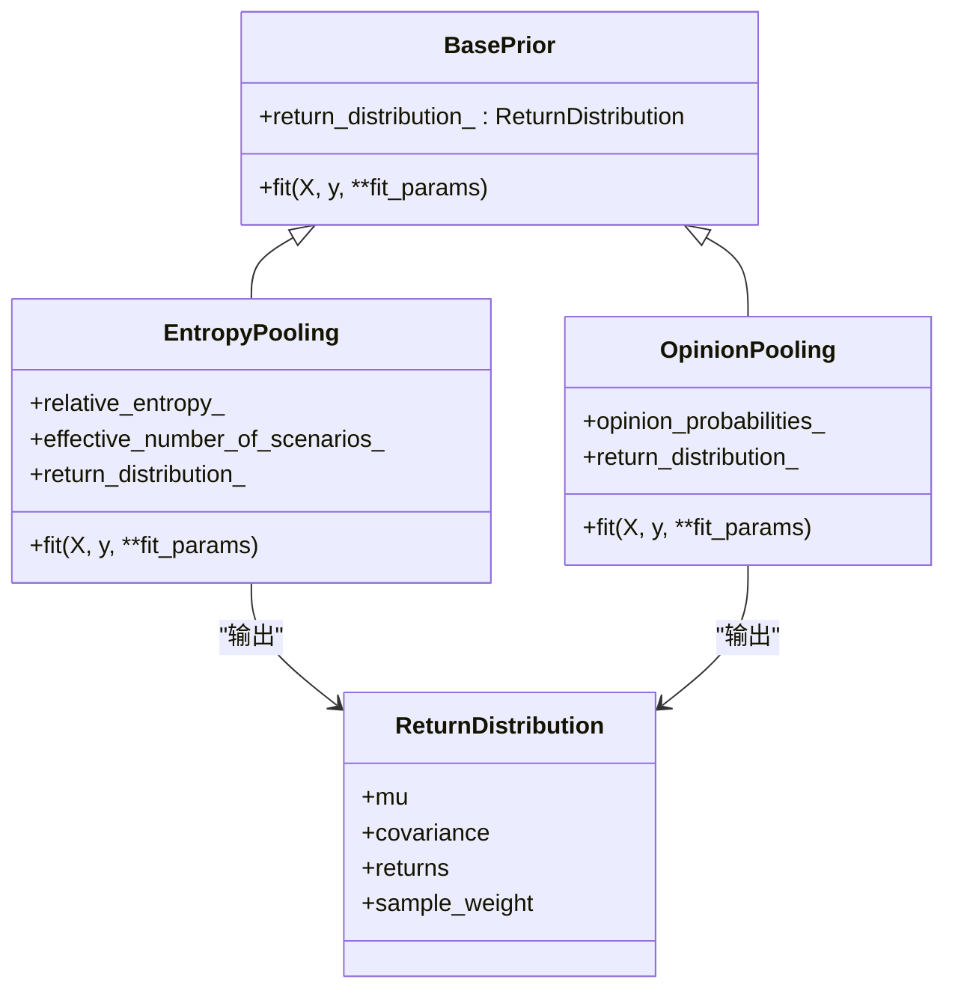
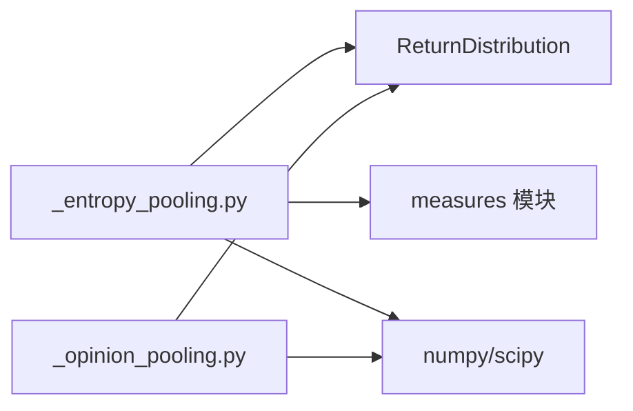

# 熵池化

<cite>
**本文引用的文件**
- [src/skfolio/prior/_entropy_pooling.py](file://src/skfolio/prior/_entropy_pooling.py)
- [src/skfolio/prior/_opinion_pooling.py](file://src/skfolio/prior/_opinion_pooling.py)
- [src/skfolio/prior/_base.py](file://src/skfolio/prior/_base.py)
- [examples/entropy_pooling/plot_1_entropy_pooling.py](file://examples/entropy_pooling/plot_1_entropy_pooling.py)
- [examples/entropy_pooling/plot_2_opinion_pooling.py](file://examples/entropy_pooling/plot_2_opinion_pooling.py)
- [tests/test_prior/test_entropy_pooling.py](file://tests/test_prior/test_entropy_pooling.py)
- [tests/test_prior/test_opinion_pooling.py](file://tests/test_prior/test_opinion_pooling.py)
</cite>

## 目录
1. [引言](#引言)
2. [项目结构](#项目结构)
3. [核心组件](#核心组件)
4. [架构总览](#架构总览)
5. [详细组件分析](#详细组件分析)
6. [依赖关系分析](#依赖关系分析)
7. [性能考量](#性能考量)
8. [故障排查指南](#故障排查指南)
9. [结论](#结论)
10. [附录：端到端示例与权重影响分析](#附录端到端示例与权重影响分析)

## 引言
本篇文档系统阐述熵池化（EntropyPooling）方法的理论基础与实现要点，重点解释其如何通过最小化与先验分布的相对熵（Kullback–Leibler 散度）来融合投资者的主观观点，从而生成后验分布。文档还说明该方法在处理不完整、非线性或概率性观点时的灵活性，并结合 _opinion_pooling.py 中的工具函数，展示如何构建观点约束并调用 _entropy_pooling.py 进行求解。最后给出使用熵池化生成调整后预期收益并用于投资组合优化的端到端示例，分析其对投资组合权重的影响。

## 项目结构
围绕熵池化与观点聚合的相关代码位于 prior 子模块中：
- 熵池化主类：EntropyPooling（最小化相对熵以满足用户观点）
- 观点聚合器：OpinionPooling（将多个专家意见合并为共识分布）
- 基类与返回分布数据结构：BasePrior、ReturnDistribution

图表来源
- [src/skfolio/prior/_entropy_pooling.py](file://src/skfolio/prior/_entropy_pooling.py#L1-L120)
- [src/skfolio/prior/_opinion_pooling.py](file://src/skfolio/prior/_opinion_pooling.py#L1-L120)
- [src/skfolio/prior/_base.py](file://src/skfolio/prior/_base.py#L1-L70)
- [examples/entropy_pooling/plot_1_entropy_pooling.py](file://examples/entropy_pooling/plot_1_entropy_pooling.py#L1-L120)
- [examples/entropy_pooling/plot_2_opinion_pooling.py](file://examples/entropy_pooling/plot_2_opinion_pooling.py#L1-L120)

章节来源
- [src/skfolio/prior/_entropy_pooling.py](file://src/skfolio/prior/_entropy_pooling.py#L1-L120)
- [src/skfolio/prior/_opinion_pooling.py](file://src/skfolio/prior/_opinion_pooling.py#L1-L120)
- [src/skfolio/prior/_base.py](file://src/skfolio/prior/_base.py#L1-L70)

## 核心组件
- EntropyPooling：基于信息论的非参数方法，通过最小化 KL 散度使后验分布尽可能接近先验分布，同时满足用户定义的观点约束（均值、方差、偏度、峰度、相关系数、VaR、CVaR 等）。支持等式、不等式、排序、线性组合、分组视图；通过嵌套投影处理非线性与多阶段约束；支持双通道求解（TNC 双重法与 CVXPY 原始法）。
- OpinionPooling：将多个专家意见（每个由 EntropyPooling 生成的样本权重）按线性或对数（几何）方式聚合，并可选地引入 KL 惩罚以降低极端或相左观点的影响。
- ReturnDistribution：优化器使用的统一数据结构，包含期望收益、协方差、回报矩阵与样本权重等。

章节来源
- [src/skfolio/prior/_entropy_pooling.py](file://src/skfolio/prior/_entropy_pooling.py#L38-L120)
- [src/skfolio/prior/_opinion_pooling.py](file://src/skfolio/prior/_opinion_pooling.py#L25-L120)
- [src/skfolio/prior/_base.py](file://src/skfolio/prior/_base.py#L15-L70)

## 架构总览
熵池化的整体流程包括：先验估计 → 解析与线性化观点 → 求解（含 CVaR 的递归处理）→ 计算后验统计量与样本权重 → 输出 ReturnDistribution 供优化器使用。

图表来源
- [src/skfolio/prior/_entropy_pooling.py](file://src/skfolio/prior/_entropy_pooling.py#L470-L588)
- [src/skfolio/prior/_entropy_pooling.py](file://src/skfolio/prior/_entropy_pooling.py#L842-L991)
- [src/skfolio/prior/_entropy_pooling.py](file://src/skfolio/prior/_entropy_pooling.py#L993-L1187)
- [src/skfolio/prior/_base.py](file://src/skfolio/prior/_base.py#L15-L70)

## 详细组件分析

### EntropyPooling 类与算法流程
- 数学目标：最小化 KL 散度 D(q||p)，在规范化与视图约束下求解后验概率向量 q。
- 视图类型与线性化：
  - 均值/方差/偏度/峰度/相关性：通过线性化表达为约束矩阵（等式/不等式），必要时固定先前阶段的均值/方差以保持嵌套投影一致性。
  - VaR：对单资产每视图构造基于“落入尾部区间”的指示约束，要求正的 VaR 视图与合理的置信水平。
  - CVaR：由于非线性，采用“以 eta（VaR 水平）为参数”的递归凸程序逼近，单维用 Brent 根求解，多维用 Powell 下降。
- 求解策略：
  - 双重法（TNC）：在约束维度空间内求解平滑对偶问题，速度更快；适合大规模场景。
  - 原始法（CVXPY）：直接在概率空间上求解 KL 投影，精度更高但较慢；可配置求解器参数。
- 嵌套投影与松弛：
  - 对于非线性约束，按“均值/VaR/CVaR → 方差 → 偏度/峰度/相关性”的顺序逐步添加约束，并在每步固定已固定的矩，避免回退。
  - 对“固定矩”引入 L1 松弛项，缓解过紧约束导致的不可行。
- 属性输出：
  - relative_entropy_：KL 散度（与先验相比的偏离程度）
  - effective_number_of_scenarios_：后验分布的“有效场景数”（熵的指数，衡量多样性）
  - return_distribution_：包含后验样本权重，供优化器使用

图表来源
- [src/skfolio/prior/_entropy_pooling.py](file://src/skfolio/prior/_entropy_pooling.py#L539-L588)
- [src/skfolio/prior/_entropy_pooling.py](file://src/skfolio/prior/_entropy_pooling.py#L842-L991)
- [src/skfolio/prior/_entropy_pooling.py](file://src/skfolio/prior/_entropy_pooling.py#L993-L1187)

章节来源
- [src/skfolio/prior/_entropy_pooling.py](file://src/skfolio/prior/_entropy_pooling.py#L38-L120)
- [src/skfolio/prior/_entropy_pooling.py](file://src/skfolio/prior/_entropy_pooling.py#L470-L588)
- [src/skfolio/prior/_entropy_pooling.py](file://src/skfolio/prior/_entropy_pooling.py#L842-L991)
- [src/skfolio/prior/_entropy_pooling.py](file://src/skfolio/prior/_entropy_pooling.py#L993-L1187)

### 视图解析与约束构建
- 视图字符串解析：支持等式、不等式、排序、线性组合、分组视图；支持 prior(资产) 替换为先验值；相关性视图支持 prior(资产对) 的倍数与常数加法形式。
- 约束矩阵生成：将解析后的视图转换为等式/不等式矩阵（a_eq, b_eq, a_ineq, b_ineq），并对不同规模进行归一化以提升数值稳定性。
- 特殊约束：
  - VaR：禁止混合多资产；视图必须严格为正；若极端则报错提示扩大先验或降低视图。
  - CVaR：仅支持等式；多资产视图需每资产单独指定；对 eta 的范围进行校验；递归求解保证有效 CVaR 满足度。

章节来源
- [src/skfolio/prior/_entropy_pooling.py](file://src/skfolio/prior/_entropy_pooling.py#L1188-L1243)
- [src/skfolio/prior/_entropy_pooling.py](file://src/skfolio/prior/_entropy_pooling.py#L741-L781)
- [src/skfolio/prior/_entropy_pooling.py](file://src/skfolio/prior/_entropy_pooling.py#L842-L991)

### 求解器与数值稳定性
- 双重法（TNC）：利用平滑 Fenchel 对偶与闭式梯度，直接在约束维度空间求解，速度快且鲁棒；失败时抛出 SolverError 并给出改进建议。
- 原始法（CVXPY）：以 KL 散度为目标，显式构造概率非负与和为一的约束；对固定矩引入 L1 松弛；失败时抛出 SolverError 并建议更换求解器或参数。
- 数值稳定：clip 与归一化处理；对极小/极大值进行裁剪；对约束进行尺度归一化。

章节来源
- [src/skfolio/prior/_entropy_pooling.py](file://src/skfolio/prior/_entropy_pooling.py#L1011-L1187)

### OpinionPooling 类与稳健聚合
- 线性聚合（算术平均）：保留所有非零支持，均匀分布在专家之间。
- 对数聚合（几何平均）：零保留、信息最优、对极端观点更稳健。
- 可选 KL 惩罚：根据专家分布与共识之间的 KL 散度对专家权重进行指数衰减，提高稳健性。
- 统一先验：可选提供统一先验估计器，确保各专家在同一场景空间上拟合。

图表来源
- [src/skfolio/prior/_base.py](file://src/skfolio/prior/_base.py#L15-L70)
- [src/skfolio/prior/_entropy_pooling.py](file://src/skfolio/prior/_entropy_pooling.py#L38-L120)
- [src/skfolio/prior/_opinion_pooling.py](file://src/skfolio/prior/_opinion_pooling.py#L25-L120)

章节来源
- [src/skfolio/prior/_opinion_pooling.py](file://src/skfolio/prior/_opinion_pooling.py#L25-L120)
- [src/skfolio/prior/_opinion_pooling.py](file://src/skfolio/prior/_opinion_pooling.py#L334-L434)
- [src/skfolio/prior/_opinion_pooling.py](file://src/skfolio/prior/_opinion_pooling.py#L461-L476)

## 依赖关系分析
- 内部依赖：
  - EntropyPooling 依赖 ReturnDistribution 作为输出载体；依赖 measures 模块计算均值、方差、偏度、峰度、相关性、VaR、CVaR 等统计量；依赖工具函数进行视图解析与矩阵转换。
  - OpinionPooling 依赖 ReturnDistribution 与各专家的 sample_weight，支持线性/对数聚合与 KL 惩罚。
- 外部依赖：
  - 求解器：SciPy（TNC）、CVXPY（原语求解器）
  - 数值库：numpy、scipy（special、optimize、stats、sparse.linalg）

图表来源
- [src/skfolio/prior/_entropy_pooling.py](file://src/skfolio/prior/_entropy_pooling.py#L1-L60)
- [src/skfolio/prior/_opinion_pooling.py](file://src/skfolio/prior/_opinion_pooling.py#L1-L40)

章节来源
- [src/skfolio/prior/_entropy_pooling.py](file://src/skfolio/prior/_entropy_pooling.py#L1-L60)
- [src/skfolio/prior/_opinion_pooling.py](file://src/skfolio/prior/_opinion_pooling.py#L1-L40)

## 性能考量
- 求解器选择：
  - TNC（双重法）：在约束维度空间求解，通常比原语 CVXPY 内点法快一个数量级，适合大规模场景与高维约束。
  - CVXPY（原始法）：更严格的可行性与对偶间隙控制，适合需要更高精度的场景；可通过 solver_params 调整。
- 视图规模与条件数：
  - 视图尺度差异大时，解析阶段会进行归一化以改善条件数与收敛性。
  - 固定矩引入 L1 松弛，缓解过紧约束导致的不可行。
- CVaR 递归：
  - 单维用 Brent 根求解，多维用 Powell 下降；对 eta 范围进行严格检查，避免无效视图。
- 有效场景数：
  - 通过后验样本权重的熵指数评估分布多样性，有助于理解视图对场景集的压缩程度。

章节来源
- [src/skfolio/prior/_entropy_pooling.py](file://src/skfolio/prior/_entropy_pooling.py#L1011-L1187)
- [src/skfolio/prior/_entropy_pooling.py](file://src/skfolio/prior/_entropy_pooling.py#L842-L991)

## 故障排查指南
- 视图冲突或过于极端：
  - TNC 失败：检查视图是否相互矛盾或超出先验支持范围；考虑使用合成数据扩展尾部；调整 solver_params 或切换求解器。
  - CVXPY 失败：检查视图是否过紧；尝试放松约束或使用 TNC；增大 L1 松弛系数。
- VaR/CVaR 视图错误：
  - VaR：禁止混合多资产；视图必须为正；若极端则提示扩大先验或降低视图。
  - CVaR：仅支持等式；多资产视图需逐资产指定；eta 必须在 (0, 视图) 区间内；视图不得大于最坏实现。
- 观点聚合异常：
  - 专家未提供 sample_weight：OpinionPooling 将报错，需确保每个专家估计器产出样本权重。
  - prior_estimator 在专家内部设置：禁止在个体专家中设置 prior_estimator，应统一通过 OpinionPooling 的 prior_estimator 参数。

章节来源
- [src/skfolio/prior/_entropy_pooling.py](file://src/skfolio/prior/_entropy_pooling.py#L741-L781)
- [src/skfolio/prior/_entropy_pooling.py](file://src/skfolio/prior/_entropy_pooling.py#L842-L991)
- [src/skfolio/prior/_entropy_pooling.py](file://src/skfolio/prior/_entropy_pooling.py#L1011-L1187)
- [src/skfolio/prior/_opinion_pooling.py](file://src/skfolio/prior/_opinion_pooling.py#L334-L434)

## 结论
熵池化通过最小化相对熵将投资者的主观观点系统性地融入先验分布，形成后验分布（以样本权重体现），并支持从线性到非线性的广泛视图类型。其嵌套投影与 CVaR 递归机制使其在处理不完整或极端视图时具备灵活性与稳健性。结合 OpinionPooling，可进一步聚合多专家意见并引入 KL 惩罚以增强稳健性。最终，熵池化生成的 ReturnDistribution 可直接用于各类投资组合优化器，从而影响投资组合权重与风险贡献。

## 附录：端到端示例与权重影响分析
以下示例基于官方教程脚本，展示如何使用熵池化生成调整后预期收益并用于投资组合优化，以及如何通过压力测试观察权重变化。

- 示例一：熵池化教程（含均值、方差、相关性、偏度、CVaR 等视图，以及因子与合成数据增强）
  - 步骤概览：
    1) 加载数据与因子，转换为日度收益；
    2) 定义多类视图（均值、方差、相关性、偏度、CVaR）；
    3) 构建 EntropyPooling 并 fit；
    4) 使用优化器（如风险预算/HRP）在 EP 后验分布上优化；
    5) 可选：因子模型与合成数据增强；
    6) 可选：压力测试（对特定资产施加 CVaR 视图，重新预测组合权重）。
  - 关键输出：后验样本权重、相对熵、有效场景数、优化后权重。
  - 权重影响：当某资产 CVaR 视图收紧时，其尾部风险被放大，优化器倾向于降低该资产权重以降低组合 CVaR。

- 示例二：观点聚合教程（多专家意见聚合）
  - 步骤概览：
    1) 由 EntropyPooling 生成多个专家意见（各自带视图）；
    2) 使用 OpinionPooling 进行线性/对数聚合，并可选 KL 惩罚；
    3) 在聚合后的分布上进行投资组合优化；
    4) 可选：因子视角与合成数据增强；
    5) 可选：压力测试（对特定资产施加 CVaR 视图，比较前后权重变化）。
  - 关键输出：专家权重、聚合后的样本权重、优化后权重。
  - 权重影响：KL 惩罚会降低极端或相左专家的影响力，从而改变组合权重分布。

章节来源
- [examples/entropy_pooling/plot_1_entropy_pooling.py](file://examples/entropy_pooling/plot_1_entropy_pooling.py#L1-L120)
- [examples/entropy_pooling/plot_1_entropy_pooling.py](file://examples/entropy_pooling/plot_1_entropy_pooling.py#L194-L217)
- [examples/entropy_pooling/plot_1_entropy_pooling.py](file://examples/entropy_pooling/plot_1_entropy_pooling.py#L260-L315)
- [examples/entropy_pooling/plot_1_entropy_pooling.py](file://examples/entropy_pooling/plot_1_entropy_pooling.py#L368-L410)
- [examples/entropy_pooling/plot_2_opinion_pooling.py](file://examples/entropy_pooling/plot_2_opinion_pooling.py#L1-L120)
- [examples/entropy_pooling/plot_2_opinion_pooling.py](file://examples/entropy_pooling/plot_2_opinion_pooling.py#L120-L160)
- [examples/entropy_pooling/plot_2_opinion_pooling.py](file://examples/entropy_pooling/plot_2_opinion_pooling.py#L229-L321)