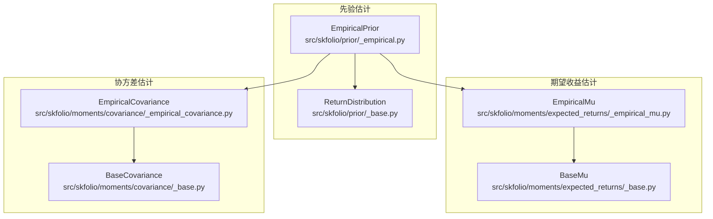
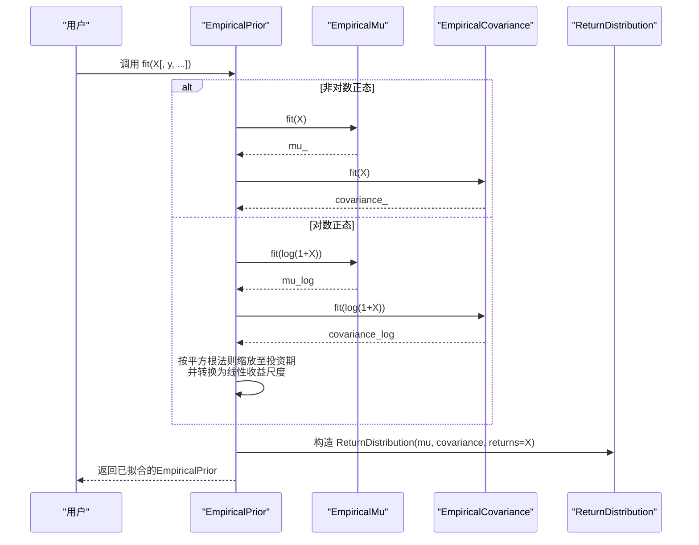
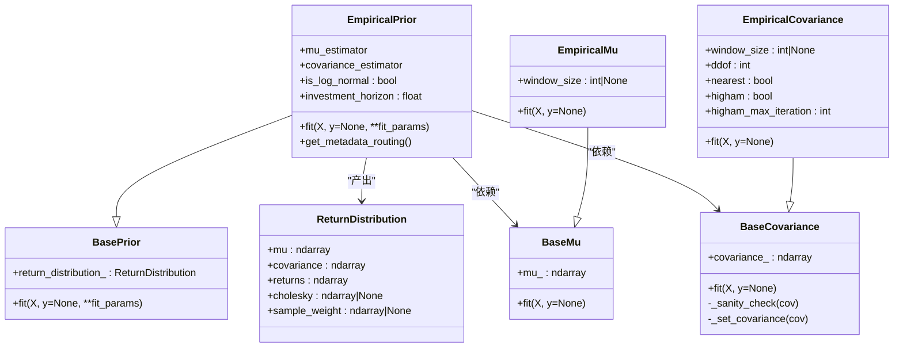
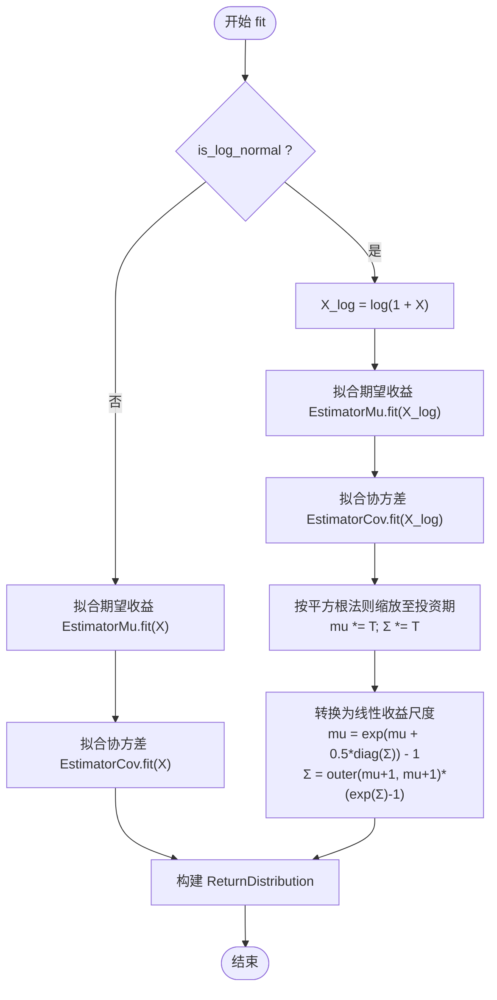
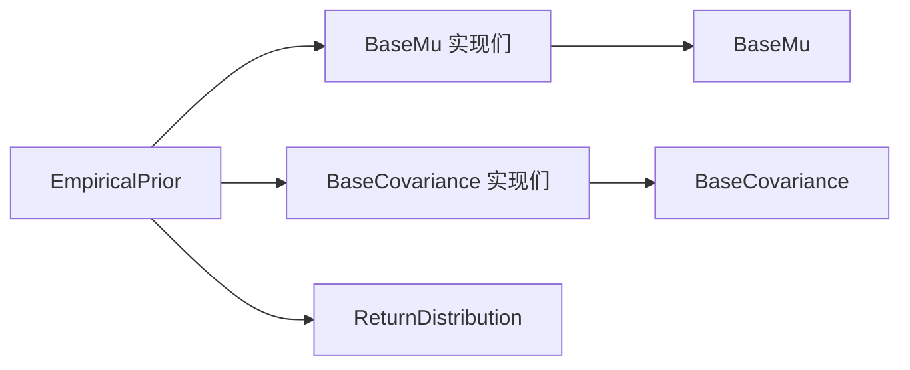

# 经验先验

<cite>
**本文引用的文件**
- [src/skfolio/prior/_empirical.py](file://src/skfolio/prior/_empirical.py)
- [src/skfolio/prior/_base.py](file://src/skfolio/prior/_base.py)
- [src/skfolio/moments/expected_returns/_empirical_mu.py](file://src/skfolio/moments/expected_returns/_empirical_mu.py)
- [src/skfolio/moments/covariance/_empirical_covariance.py](file://src/skfolio/moments/covariance/_empirical_covariance.py)
- [src/skfolio/moments/expected_returns/_base.py](file://src/skfolio/moments/expected_returns/_base.py)
- [src/skfolio/moments/covariance/_base.py](file://src/skfolio/moments/covariance/_base.py)
- [examples/mean_risk/plot_11_empirical_prior.py](file://examples/mean_risk/plot_11_empirical_prior.py)
- [tests/test_prior/test_empirical.py](file://tests/test_prior/test_empirical.py)
- [docs/user_guide/prior.rst](file://docs/user_guide/prior.rst)
- [docs/user_guide/expected_returns.rst](file://docs/user_guide/expected_returns.rst)
- [docs/user_guide/covariance.rst](file://docs/user_guide/covariance.rst)
</cite>

## 目录
1. [引言](#引言)
2. [项目结构](#项目结构)
3. [核心组件](#核心组件)
4. [架构总览](#架构总览)
5. [详细组件分析](#详细组件分析)
6. [依赖关系分析](#依赖关系分析)
7. [性能与数值稳定性考量](#性能与数值稳定性考量)
8. [故障排查指南](#故障排查指南)
9. [结论](#结论)
10. [附录：使用示例与最佳实践](#附录使用示例与最佳实践)

## 引言
本篇文档系统化阐述经验先验（EmpiricalPrior）在skfolio中的实现机制与使用方式。经验先验是最基础的先验估计方法，它通过历史收益率数据直接估计资产的预期收益向量与协方差矩阵，作为投资组合优化前的“先验输入”。本文将从数学原理、适用场景、局限性、与优化器的交互影响、与其他先验方法的对比等维度进行深入解析，并提供可直接参考的配置与使用路径。

## 项目结构
经验先验位于prior子模块，其核心由以下文件构成：
- prior/_empirical.py：实现EmpiricalPrior，负责拟合并产出ReturnDistribution
- prior/_base.py：定义BasePrior与ReturnDistribution数据结构
- moments/expected_returns/_empirical_mu.py：历史均值法估计期望收益
- moments/covariance/_empirical_covariance.py：历史协方差估计（含正定化处理）
- 对应的基类moments/expected_returns/_base.py与moments/covariance/_base.py
- 用户指南与示例：docs/user_guide/*与examples/mean_risk/plot_11_empirical_prior.py
- 单元测试：tests/test_prior/test_empirical.py

图表来源
- [src/skfolio/prior/_empirical.py](file://src/skfolio/prior/_empirical.py#L1-L205)
- [src/skfolio/prior/_base.py](file://src/skfolio/prior/_base.py#L1-L70)
- [src/skfolio/moments/expected_returns/_empirical_mu.py](file://src/skfolio/moments/expected_returns/_empirical_mu.py#L1-L65)
- [src/skfolio/moments/covariance/_empirical_covariance.py](file://src/skfolio/moments/covariance/_empirical_covariance.py#L1-L106)
- [src/skfolio/moments/expected_returns/_base.py](file://src/skfolio/moments/expected_returns/_base.py#L1-L36)
- [src/skfolio/moments/covariance/_base.py](file://src/skfolio/moments/covariance/_base.py#L1-L110)

章节来源
- [src/skfolio/prior/_empirical.py](file://src/skfolio/prior/_empirical.py#L1-L205)
- [src/skfolio/prior/_base.py](file://src/skfolio/prior/_base.py#L1-L70)
- [src/skfolio/moments/expected_returns/_empirical_mu.py](file://src/skfolio/moments/expected_returns/_empirical_mu.py#L1-L65)
- [src/skfolio/moments/covariance/_empirical_covariance.py](file://src/skfolio/moments/covariance/_empirical_covariance.py#L1-L106)
- [src/skfolio/moments/expected_returns/_base.py](file://src/skfolio/moments/expected_returns/_base.py#L1-L36)
- [src/skfolio/moments/covariance/_base.py](file://src/skfolio/moments/covariance/_base.py#L1-L110)

## 核心组件
- EmpiricalPrior：独立拟合mu_estimator与covariance_estimator，产出ReturnDistribution（包含mu、协方差、历史收益等），供优化器使用。
- ReturnDistribution：统一承载先验分布的容器，包含mu、协方差、returns、可选cholesky与sample_weight。
- EmpiricalMu：历史均值估计，支持滑动窗口与全样本。
- EmpiricalCovariance：历史协方差估计，支持ddof、滑动窗口与正定化（nearest/Higham）。

章节来源
- [src/skfolio/prior/_empirical.py](file://src/skfolio/prior/_empirical.py#L1-L205)
- [src/skfolio/prior/_base.py](file://src/skfolio/prior/_base.py#L1-L70)
- [src/skfolio/moments/expected_returns/_empirical_mu.py](file://src/skfolio/moments/expected_returns/_empirical_mu.py#L1-L65)
- [src/skfolio/moments/covariance/_empirical_covariance.py](file://src/skfolio/moments/covariance/_empirical_covariance.py#L1-L106)

## 架构总览
经验先验的运行流程如下：
- 输入为资产日度/周期性价格收益矩阵X（n_obs × n_assets）
- 可选地将线性收益转换为对数收益以进行估计（is_log_normal=True）
- 分别调用mu_estimator与covariance_estimator对X（或log(X)）进行拟合
- 若is_log_normal=True且提供了investment_horizon，则按时间聚合规则将对数尺度的估计映射到线性收益的持有期尺度
- 将估计得到的mu、协方差与原始X封装为ReturnDistribution，供后续优化器消费

图表来源
- [src/skfolio/prior/_empirical.py](file://src/skfolio/prior/_empirical.py#L109-L205)
- [src/skfolio/moments/expected_returns/_empirical_mu.py](file://src/skfolio/moments/expected_returns/_empirical_mu.py#L41-L65)
- [src/skfolio/moments/covariance/_empirical_covariance.py](file://src/skfolio/moments/covariance/_empirical_covariance.py#L80-L106)

## 详细组件分析

### 数学原理与实现要点
- 历史均值估计（期望收益）：对每条资产的历史收益取均值，得到μ̂。可选滑动窗口以降低过拟合风险。
- 历史协方差估计：对收益矩阵计算协方差，支持ddof以获得无偏估计；同时提供正定化选项（nearest/Higham）确保协方差矩阵半正定，便于后续优化求解。
- 对数正态转换与时间聚合：当is_log_normal=True时，先将线性收益转换为对数收益，分别估计μ_log与Σ_log，再按时间尺度（investment_horizon）进行平方根法则缩放，并将对数尺度的估计转换回线性收益尺度的μ与Σ，最后将μ减去1以还原为线性尺度的期望回报。

章节来源
- [src/skfolio/moments/expected_returns/_empirical_mu.py](file://src/skfolio/moments/expected_returns/_empirical_mu.py#L41-L65)
- [src/skfolio/moments/covariance/_empirical_covariance.py](file://src/skfolio/moments/covariance/_empirical_covariance.py#L80-L106)
- [src/skfolio/prior/_empirical.py](file://src/skfolio/prior/_empirical.py#L145-L205)

### 类关系与职责

图表来源
- [src/skfolio/prior/_base.py](file://src/skfolio/prior/_base.py#L1-L70)
- [src/skfolio/prior/_empirical.py](file://src/skfolio/prior/_empirical.py#L1-L205)
- [src/skfolio/moments/expected_returns/_base.py](file://src/skfolio/moments/expected_returns/_base.py#L1-L36)
- [src/skfolio/moments/expected_returns/_empirical_mu.py](file://src/skfolio/moments/expected_returns/_empirical_mu.py#L1-L65)
- [src/skfolio/moments/covariance/_base.py](file://src/skfolio/moments/covariance/_base.py#L1-L110)
- [src/skfolio/moments/covariance/_empirical_covariance.py](file://src/skfolio/moments/covariance/_empirical_covariance.py#L1-L106)

### 关键流程图：对数正态与时间聚合

图表来源
- [src/skfolio/prior/_empirical.py](file://src/skfolio/prior/_empirical.py#L145-L205)

### 在优化流程中的作用与影响
- 先验输入：EmpiricalPrior产出的ReturnDistribution作为优化器的输入，决定μ与Σ的估计质量，直接影响权重优化结果（如最大夏普比率、最小方差等）。
- 稳健性：若直接使用EmpiricalMu/EmpiricalCovariance，可能因样本量小、高维、多重共线性导致协方差非正定或估计不稳定；可通过在EmpiricalPrior中注入更稳健的mu_estimator与covariance_estimator（如收缩、去噪、正定化）来提升优化稳定性。
- 时间尺度：对数正态模式下，investment_horizon用于将估计从日度（或更短）映射到目标持有期，影响μ与Σ的规模，进而改变优化目标的数值范围。

章节来源
- [src/skfolio/prior/_empirical.py](file://src/skfolio/prior/_empirical.py#L145-L205)
- [src/skfolio/moments/covariance/_base.py](file://src/skfolio/moments/covariance/_base.py#L74-L110)

## 依赖关系分析
- EmpiricalPrior依赖于两个子估计器：BaseMu与BaseCovariance，分别负责μ与Σ的估计。
- EmpiricalMu/EW/Mu等期望收益估计器共享BaseMu接口；EmpiricalCovariance/ShrunkCovariance/DenoiseCovariance等协方差估计器共享BaseCovariance接口。
- ReturnDistribution作为统一的数据载体，被优化器读取并缓存（例如在某些优化模型中使用哈希缓存）。

图表来源
- [src/skfolio/prior/_empirical.py](file://src/skfolio/prior/_empirical.py#L1-L205)
- [src/skfolio/prior/_base.py](file://src/skfolio/prior/_base.py#L1-L70)
- [src/skfolio/moments/expected_returns/_base.py](file://src/skfolio/moments/expected_returns/_base.py#L1-L36)
- [src/skfolio/moments/covariance/_base.py](file://src/skfolio/moments/covariance/_base.py#L1-L110)

章节来源
- [src/skfolio/prior/_empirical.py](file://src/skfolio/prior/_empirical.py#L1-L205)
- [src/skfolio/prior/_base.py](file://src/skfolio/prior/_base.py#L1-L70)
- [src/skfolio/moments/expected_returns/_base.py](file://src/skfolio/moments/expected_returns/_base.py#L1-L36)
- [src/skfolio/moments/covariance/_base.py](file://src/skfolio/moments/covariance/_base.py#L1-L110)

## 性能与数值稳定性考量
- 计算复杂度
  - 历史均值：O(n_obs × n_assets)，可配合滑动窗口降低计算量与过拟合风险。
  - 协方差估计：O(n_assets^2 × n_obs)或更高（取决于具体实现），在高维时需注意正定化与条件数问题。
- 正定性与收敛性
  - 当n_obs接近或小于n_assets时，协方差矩阵易非正定；EmpiricalCovariance提供nearest与Higham两种策略，建议默认开启nearest以保证可分解性。
- 对数正态与时间聚合
  - 对数正态估计在长序列上更稳健，但需正确设置investment_horizon；错误的时间尺度会导致μ与Σ数量级偏差，从而显著影响优化器的收敛与结果。
- 缓存与哈希
  - ReturnDistribution使用frozen dataclass，具备可哈希属性，有利于优化模型缓存，减少重复求解成本。

章节来源
- [src/skfolio/moments/covariance/_empirical_covariance.py](file://src/skfolio/moments/covariance/_empirical_covariance.py#L1-L106)
- [src/skfolio/moments/covariance/_base.py](file://src/skfolio/moments/covariance/_base.py#L74-L110)
- [src/skfolio/prior/_base.py](file://src/skfolio/prior/_base.py#L1-L70)

## 故障排查指南
- 报错“investment_horizon必须为None（当is_log_normal=False）”
  - 症状：在is_log_normal=False时设置了investment_horizon。
  - 处理：移除investment_horizon参数，或改为is_log_normal=True并在该模式下设置投资期。
- 报错“investment_horizon必须提供（当is_log_normal=True）”
  - 症状：is_log_normal=True但未提供investment_horizon。
  - 处理：设置合理的投资期（如年化252个交易日）。
- 协方差非正定或无法分解
  - 症状：优化器报错或求解失败。
  - 处理：启用EmpiricalCovariance的nearest=True（默认），必要时尝试higham=True但注意计算开销。
- 数据质量
  - 症状：出现零方差或极低方差资产导致优化异常。
  - 处理：检查数据预处理，剔除无效资产或使用正定化策略。

章节来源
- [src/skfolio/prior/_empirical.py](file://src/skfolio/prior/_empirical.py#L145-L195)
- [src/skfolio/moments/covariance/_base.py](file://src/skfolio/moments/covariance/_base.py#L74-L110)

## 结论
经验先验（EmpiricalPrior）以“历史收益率直接估计”的方式提供最基础的先验输入，是各类优化器的通用起点。其优势在于简单直观、可解释性强；劣势在于对样本量与噪声敏感，在高维或样本不足时估计不稳定。通过在EmpiricalPrior中组合更稳健的mu_estimator与covariance_estimator（如收缩、去噪、正定化），可在保持简洁的同时显著提升优化鲁棒性。作为基准模型，它为评估更复杂先验方法（如Black-Litterman、因子模型、合成数据）提供了可靠的对照。

## 附录：使用示例与最佳实践

### 在MeanRisk优化中配置EmpiricalPrior
- 基础用法：直接使用EmpiricalPrior，默认内部使用EmpiricalMu与EmpiricalCovariance。
- 增强用法：结合收缩与去噪，提升估计稳健性。
- 示例路径：参见示例脚本与用户指南中的对应章节。

章节来源
- [examples/mean_risk/plot_11_empirical_prior.py](file://examples/mean_risk/plot_11_empirical_prior.py#L1-L111)
- [docs/user_guide/prior.rst](file://docs/user_guide/prior.rst#L53-L80)
- [docs/user_guide/expected_returns.rst](file://docs/user_guide/expected_returns.rst#L1-L36)
- [docs/user_guide/covariance.rst](file://docs/user_guide/covariance.rst#L1-L44)

### 与其他先验方法的对比与基准作用
- EmpiricalPrior：最基础的频率学派先验，适合快速基准与简单场景。
- BlackLitterman：引入贝叶斯视角与专家观点，适合有明确市场观点或结构化信息的情形。
- 因子模型：通过公共因子结构降低维度，适合高维与稀疏数据。
- 合成数据：通过场景生成扩展尾部依赖，适合压力测试与极端情景优化。
- 基准建议：先以EmpiricalPrior跑通流程与指标，再逐步引入更复杂先验以观察改进幅度与稳定性变化。

章节来源
- [docs/user_guide/prior.rst](file://docs/user_guide/prior.rst#L1-L120)
- [tests/test_prior/test_empirical.py](file://tests/test_prior/test_empirical.py#L1-L124)