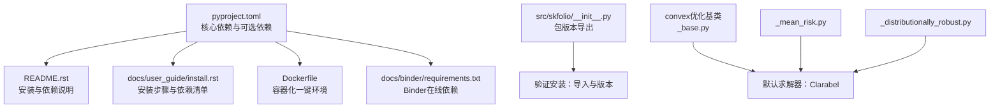
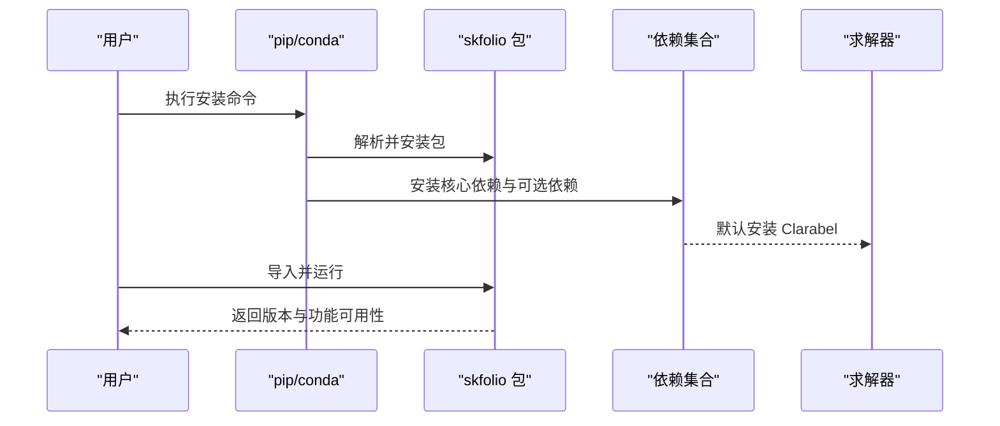
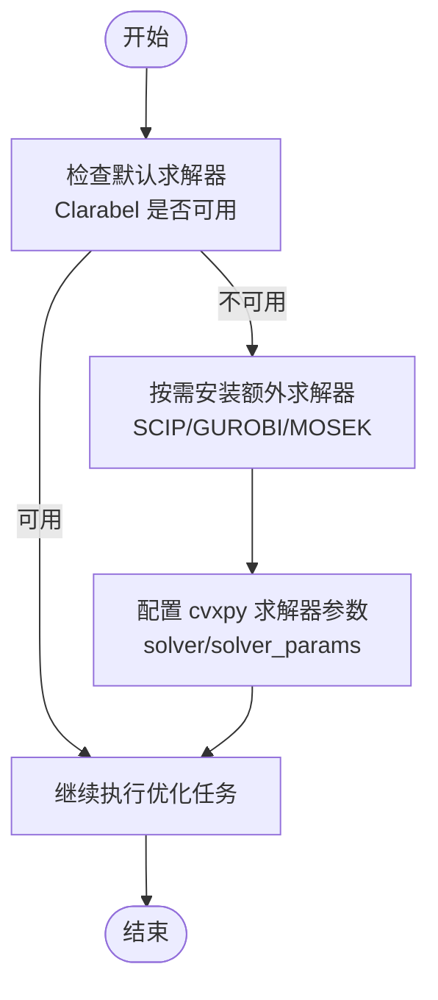
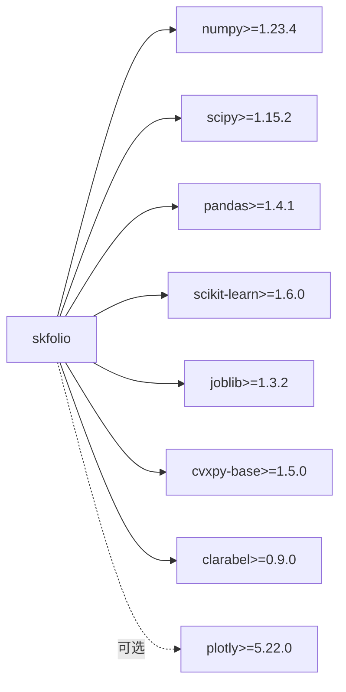

# 安装与环境设置

<cite>
**本文引用的文件**
- [pyproject.toml](file://pyproject.toml)
- [README.rst](file://README.rst)
- [docs/user_guide/install.rst](file://docs/user_guide/install.rst)
- [Dockerfile](file://Dockerfile)
- [docs/binder/requirements.txt](file://docs/binder/requirements.txt)
- [src/skfolio/__init__.py](file://src/skfolio/__init__.py)
- [src/skfolio/optimization/convex/_base.py](file://src/skfolio/optimization/convex/_base.py)
- [src/skfolio/optimization/convex/_mean_risk.py](file://src/skfolio/optimization/convex/_mean_risk.py)
- [src/skfolio/optimization/convex/_distributionally_robust.py](file://src/skfolio/optimization/convex/_distributionally_robust.py)
</cite>

## 目录
1. [简介](#简介)
2. [项目结构](#项目结构)
3. [核心组件](#核心组件)
4. [架构总览](#架构总览)
5. [详细组件分析](#详细组件分析)
6. [依赖关系分析](#依赖关系分析)
7. [性能考虑](#性能考虑)
8. [故障排除指南](#故障排除指南)
9. [结论](#结论)
10. [附录](#附录)

## 简介
本指南面向首次安装与配置 skfolio 的用户，覆盖通过 pip 与 conda 的安装步骤、不同运行环境（Python 虚拟环境、conda 环境、容器镜像）的实践建议，并解释 pyproject.toml 中定义的核心依赖与可选依赖的作用。同时提供验证安装成功的方法与常见问题的排查思路，帮助新手快速上手，也为系统管理员提供定制化安装的参考。

## 项目结构
围绕“安装与配置”的关键文件与位置如下：
- 核心安装入口与依赖声明：pyproject.toml
- 用户指南安装章节：docs/user_guide/install.rst
- 项目自述与安装说明：README.rst
- 容器化一键环境：Dockerfile
- Binder 在线演示环境依赖：docs/binder/requirements.txt
- 包初始化与版本导出：src/skfolio/__init__.py
- 求解器参数与默认选择：src/skfolio/optimization/convex/_base.py、src/skfolio/optimization/convex/_mean_risk.py、src/skfolio/optimization/convex/_distributionally_robust.py

图表来源
- [pyproject.toml](file://pyproject.toml#L52-L62)
- [README.rst](file://README.rst#L86-L108)
- [docs/user_guide/install.rst](file://docs/user_guide/install.rst#L5-L41)
- [Dockerfile](file://Dockerfile#L1-L49)
- [docs/binder/requirements.txt](file://docs/binder/requirements.txt#L1-L5)
- [src/skfolio/__init__.py](file://src/skfolio/__init__.py#L1-L36)
- [src/skfolio/optimization/convex/_base.py](file://src/skfolio/optimization/convex/_base.py#L408-L431)
- [src/skfolio/optimization/convex/_mean_risk.py](file://src/skfolio/optimization/convex/_mean_risk.py#L541-L564)
- [src/skfolio/optimization/convex/_distributionally_robust.py](file://src/skfolio/optimization/convex/_distributionally_robust.py#L175-L197)

章节来源
- [pyproject.toml](file://pyproject.toml#L52-L62)
- [README.rst](file://README.rst#L86-L108)
- [docs/user_guide/install.rst](file://docs/user_guide/install.rst#L5-L41)
- [Dockerfile](file://Dockerfile#L1-L49)
- [docs/binder/requirements.txt](file://docs/binder/requirements.txt#L1-L5)
- [src/skfolio/__init__.py](file://src/skfolio/__init__.py#L1-L36)

## 核心组件
- Python 版本要求：>= 3.10
- 核心依赖（均在 pyproject.toml 中声明）：
  - numpy、scipy、pandas、scikit-learn、joblib
  - cvxpy-base（凸优化建模框架）
  - clarabel（默认求解器，提升数值稳定性与性能）
  - plotly（可选，用于可视化）
- 可选依赖（开发与文档构建等场景使用）：
  - dev：PySCIPOpt、pytest、pytest-cov、ruff、pre-commit
  - docs：Sphinx 生态链、matplotlib、kaleido、jupyterlite 等

章节来源
- [pyproject.toml](file://pyproject.toml#L52-L62)
- [pyproject.toml](file://pyproject.toml#L70-L94)
- [README.rst](file://README.rst#L86-L108)
- [docs/user_guide/install.rst](file://docs/user_guide/install.rst#L28-L41)

## 架构总览
下图展示从安装到运行的基本流程：用户通过 pip/conda 获取包与依赖；在默认情况下，Clarabel 求解器已随 cvxpy-base 一并安装；若需要额外求解器（如 SCIP、GUROBI、MOSEK），可参考 cvxpy 文档进行安装与配置。

图表来源
- [docs/user_guide/install.rst](file://docs/user_guide/install.rst#L5-L26)
- [pyproject.toml](file://pyproject.toml#L52-L62)
- [src/skfolio/optimization/convex/_base.py](file://src/skfolio/optimization/convex/_base.py#L408-L431)

## 详细组件分析

### 组件A：安装方式与环境准备
- 通过 pip 安装（推荐）：直接安装包，pip 将自动解析并安装核心依赖与默认求解器。
- 通过 conda 安装：可使用 conda-forge 渠道安装，适合已有 conda 生态的团队。
- 容器化一键环境：使用 Dockerfile 提供预置依赖的 JupyterLab 环境，便于复现与演示。
- Binder 在线演示：docs/binder/requirements.txt 列出了最小化依赖，适合在线试用。

章节来源
- [docs/user_guide/install.rst](file://docs/user_guide/install.rst#L5-L26)
- [Dockerfile](file://Dockerfile#L1-L49)
- [docs/binder/requirements.txt](file://docs/binder/requirements.txt#L1-L5)

### 组件B：依赖项与作用说明
- numpy、scipy、pandas、joblib：基础科学计算与并行工具。
- scikit-learn：机器学习接口与流水线能力。
- cvxpy-base：凸优化建模与求解器桥接。
- clarabel：默认求解器，具备更好的数值稳定性和性能。
- plotly：可选可视化库，用于绘制报告与图表。
- 开发与文档依赖（dev/docs）：用于本地开发、测试与文档构建。

章节来源
- [pyproject.toml](file://pyproject.toml#L52-L62)
- [pyproject.toml](file://pyproject.toml#L70-L94)
- [README.rst](file://README.rst#L86-L108)
- [docs/user_guide/install.rst](file://docs/user_guide/install.rst#L28-L41)

### 组件C：求解器与 cvxpy 集成
- 默认求解器：Clarabel（在凸优化基类中明确说明），具备更优数值稳定性与性能。
- 其他求解器：可通过 cvxpy 官方文档安装与配置（如 SCIP、GUROBI、MOSEK）。
- 参数与缩放：支持设置求解器参数与目标/约束缩放，以提升精度与收敛表现。

图表来源
- [src/skfolio/optimization/convex/_base.py](file://src/skfolio/optimization/convex/_base.py#L408-L431)
- [src/skfolio/optimization/convex/_mean_risk.py](file://src/skfolio/optimization/convex/_mean_risk.py#L541-L564)
- [src/skfolio/optimization/convex/_distributionally_robust.py](file://src/skfolio/optimization/convex/_distributionally_robust.py#L175-L197)
- [docs/user_guide/install.rst](file://docs/user_guide/install.rst#L20-L26)

### 组件D：验证安装是否成功
- 导入包并读取版本：通过包初始化模块导出的版本号确认安装成功。
- 基本功能验证：尝试导入常用子模块或运行一个最小化的优化示例（例如创建一个简单模型并拟合数据）。

章节来源
- [src/skfolio/__init__.py](file://src/skfolio/__init__.py#L1-L36)
- [README.rst](file://README.rst#L286-L375)

## 依赖关系分析
- 核心依赖与版本范围由 pyproject.toml 明确给出，安装器会根据这些约束解析兼容版本。
- plotly 属于可选依赖，仅在需要可视化时安装。
- 开发与文档依赖独立分组，避免生产环境引入不必要的工具链。

图表来源
- [pyproject.toml](file://pyproject.toml#L52-L62)

章节来源
- [pyproject.toml](file://pyproject.toml#L52-L62)

## 性能考虑
- 使用默认求解器 Clarabel 可获得更佳的数值稳定性与性能。
- 对于大规模或高精度需求，可调整 solver_params 与目标/约束缩放参数。
- 在容器环境中，建议使用 uv 同步锁定依赖，以减少重复安装与加速构建。

章节来源
- [src/skfolio/optimization/convex/_base.py](file://src/skfolio/optimization/convex/_base.py#L408-L431)
- [Dockerfile](file://Dockerfile#L1-L49)

## 故障排除指南
- 依赖冲突
  - 现象：安装过程中出现版本不兼容或冲突。
  - 处理：优先使用 pip/conda 的升级与锁定策略；在容器环境中使用 uv 同步锁定文件，避免本地环境差异。
  - 参考：pyproject.toml 中的版本范围与依赖声明。
- cvxpy 求解器缺失
  - 现象：默认求解器不可用或性能不佳。
  - 处理：按 cvxpy 官方文档安装额外求解器（SCIP、GUROBI、MOSEK），并在模型中指定 solver 与 solver_params。
  - 参考：安装文档与凸优化基类中的求解器说明。
- 可视化功能不可用
  - 现象：plotly 未安装导致绘图失败。
  - 处理：单独安装 plotly 或使用包含可选依赖的安装方式。
- 容器环境无法启动
  - 现象：JupyterLab 未找到或端口不可用。
  - 处理：检查 Dockerfile 中的路径与暴露端口配置，确认镜像构建与运行命令正确。

章节来源
- [docs/user_guide/install.rst](file://docs/user_guide/install.rst#L20-L26)
- [pyproject.toml](file://pyproject.toml#L52-L62)
- [Dockerfile](file://Dockerfile#L1-L49)

## 结论
通过 pip/conda 快速安装即可获得完整的 skfolio 功能；默认求解器 Clarabel 已满足大多数优化场景。若需更高性能或特定商业求解器，可按 cvxpy 文档扩展安装。容器与 Binder 提供了开箱即用的一致化环境，便于团队协作与演示。建议在生产环境锁定版本并定期更新依赖，以平衡稳定性与新特性。

## 附录
- 安装命令示例（路径参考）
  - pip 安装：参见 [docs/user_guide/install.rst](file://docs/user_guide/install.rst#L5-L12)
  - conda 安装：参见 [docs/user_guide/install.rst](file://docs/user_guide/install.rst#L13-L19)
- 依赖清单（路径参考）
  - 核心依赖：参见 [README.rst](file://README.rst#L86-L108)、[docs/user_guide/install.rst](file://docs/user_guide/install.rst#L28-L41)、[pyproject.toml](file://pyproject.toml#L52-L62)
- 求解器与参数（路径参考）
  - 默认求解器说明：参见 [src/skfolio/optimization/convex/_base.py](file://src/skfolio/optimization/convex/_base.py#L408-L431)
  - 模型参数与求解器选项：参见 [src/skfolio/optimization/convex/_mean_risk.py](file://src/skfolio/optimization/convex/_mean_risk.py#L541-L564)、[src/skfolio/optimization/convex/_distributionally_robust.py](file://src/skfolio/optimization/convex/_distributionally_robust.py#L175-L197)
- 验证安装（路径参考）
  - 导入与版本：参见 [src/skfolio/__init__.py](file://src/skfolio/__init__.py#L1-L36)
  - 最小化示例：参见 [README.rst](file://README.rst#L286-L375)