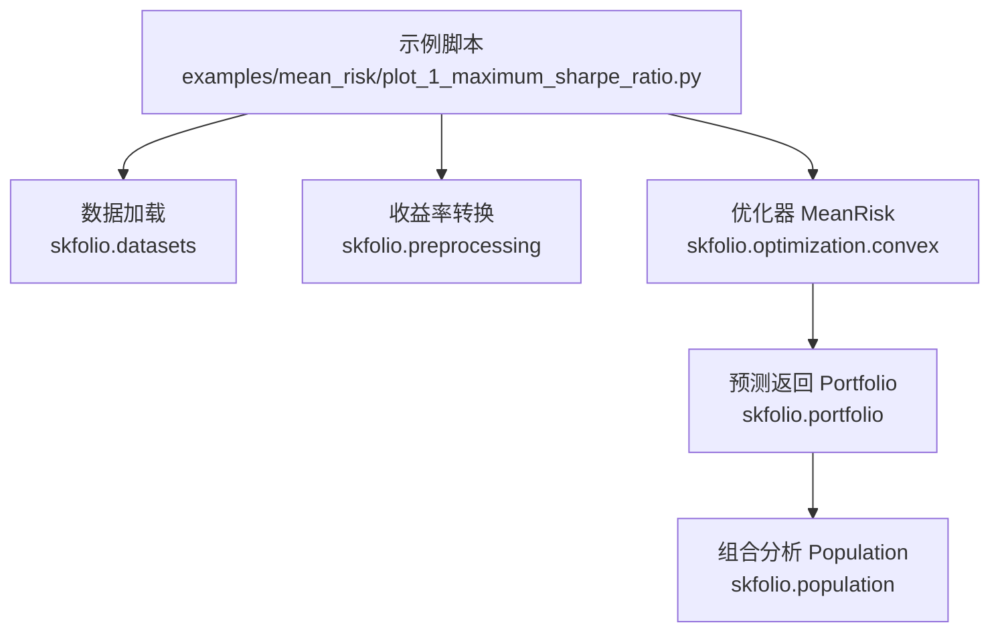
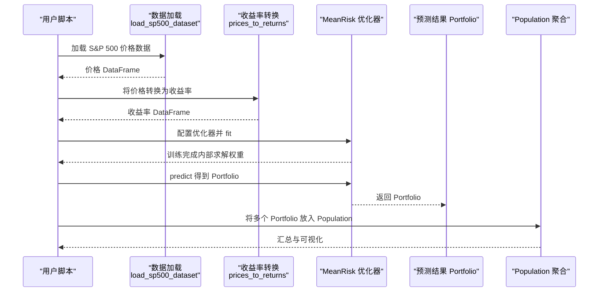
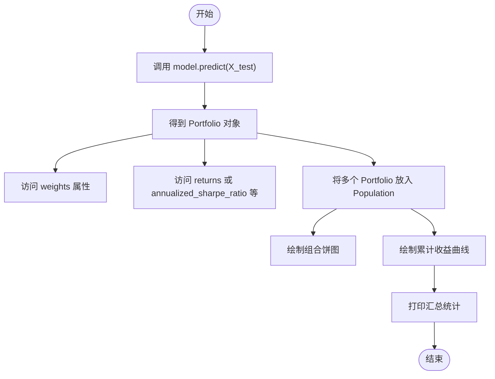
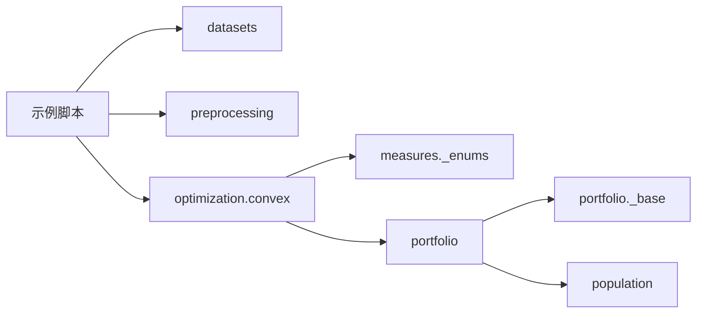

# 快速入门

<cite>
**本文引用的文件**
- [plot_1_maximum_sharpe_ratio.py](file://examples/mean_risk/plot_1_maximum_sharpe_ratio.py)
- [preprocessing/_returns.py](file://src/skfolio/preprocessing/_returns.py)
- [optimization/__init__.py](file://src/skfolio/optimization/__init__.py)
- [optimization/convex/_mean_risk.py](file://src/skfolio/optimization/convex/_mean_risk.py)
- [portfolio/_portfolio.py](file://src/skfolio/portfolio/_portfolio.py)
- [portfolio/_base.py](file://src/skfolio/portfolio/_base.py)
- [population/_population.py](file://src/skfolio/population/_population.py)
- [datasets/__init__.py](file://src/skfolio/datasets/__init__.py)
- [measures/_enums.py](file://src/skfolio/measures/_enums.py)
</cite>

## 目录
1. [简介](#简介)
2. [项目结构](#项目结构)
3. [核心组件](#核心组件)
4. [架构总览](#架构总览)
5. [详细组件解析](#详细组件解析)
6. [依赖关系分析](#依赖关系分析)
7. [性能与实践建议](#性能与实践建议)
8. [故障排查指南](#故障排查指南)
9. [结论](#结论)
10. [附录](#附录)

## 简介
本快速入门以“使用 MeanRisk 优化器最大化夏普比率”为主线，带你用不到 10 分钟跑通一个完整的 scikit-learn 风格工作流：加载示例数据 → 将价格转换为收益率 → 配置优化器 → 训练与预测 → 解读 Portfolio 结果（权重、收益、风险）。文中所有步骤均来自仓库中的真实示例与源码，配合逐步讲解，帮助你快速上手。

## 项目结构
- 示例位于 examples/mean_risk/plot_1_maximum_sharpe_ratio.py，是本次教程的完整脚本。
- 数据加载来自 skfolio.datasets 模块。
- 收益率转换来自 skfolio.preprocessing。
- 优化器 MeanRisk 位于 skfolio.optimization.convex。
- 预测结果 Portfolio 与 Population 位于 skfolio.portfolio 与 skfolio.population。
- 风险度量枚举 RiskMeasure 位于 skfolio.measures。

图表来源
- [plot_1_maximum_sharpe_ratio.py](file://examples/mean_risk/plot_1_maximum_sharpe_ratio.py#L1-L127)
- [preprocessing/_returns.py](file://src/skfolio/preprocessing/_returns.py#L1-L83)
- [optimization/convex/_mean_risk.py](file://src/skfolio/optimization/convex/_mean_risk.py#L1-L200)
- [portfolio/_portfolio.py](file://src/skfolio/portfolio/_portfolio.py#L1-L200)
- [population/_population.py](file://src/skfolio/population/_population.py#L613-L838)
- [datasets/__init__.py](file://src/skfolio/datasets/__init__.py#L1-L23)

章节来源
- [plot_1_maximum_sharpe_ratio.py](file://examples/mean_risk/plot_1_maximum_sharpe_ratio.py#L1-L127)

## 核心组件
- 数据集加载：使用 load_sp500_dataset 提供的 S&P 500 日频价格数据。
- 收益率转换：prices_to_returns 将价格转换为线性或对数收益率。
- 优化器：MeanRisk 支持最小化风险、最大化收益、最大化效用、最大化比率等目标函数；可指定风险度量（如标准差）。
- 预测输出：predict 返回 Portfolio 对象，包含权重、收益、风险、组合等丰富属性。
- 组合分析：Population 可聚合多个 Portfolio，提供汇总统计与可视化。

章节来源
- [datasets/__init__.py](file://src/skfolio/datasets/__init__.py#L1-L23)
- [preprocessing/_returns.py](file://src/skfolio/preprocessing/_returns.py#L1-L83)
- [optimization/convex/_mean_risk.py](file://src/skfolio/optimization/convex/_mean_risk.py#L1-L200)
- [portfolio/_portfolio.py](file://src/skfolio/portfolio/_portfolio.py#L1-L200)
- [population/_population.py](file://src/skfolio/population/_population.py#L613-L838)

## 架构总览
下面的时序图展示了从数据到结果的完整流程，映射到真实代码路径。

图表来源
- [plot_1_maximum_sharpe_ratio.py](file://examples/mean_risk/plot_1_maximum_sharpe_ratio.py#L1-L127)
- [preprocessing/_returns.py](file://src/skfolio/preprocessing/_returns.py#L1-L83)
- [optimization/convex/_mean_risk.py](file://src/skfolio/optimization/convex/_mean_risk.py#L1-L200)
- [portfolio/_portfolio.py](file://src/skfolio/portfolio/_portfolio.py#L1-L200)
- [population/_population.py](file://src/skfolio/population/_population.py#L613-L838)

## 详细组件解析

### 步骤一：加载示例数据集
- 使用 load_sp500_dataset 获取 S&P 500 日频价格数据。
- 该数据用于后续构建训练集与测试集。

章节来源
- [plot_1_maximum_sharpe_ratio.py](file://examples/mean_risk/plot_1_maximum_sharpe_ratio.py#L28-L34)
- [datasets/__init__.py](file://src/skfolio/datasets/__init__.py#L1-L23)

### 步骤二：将价格转换为收益率
- 使用 prices_to_returns 将价格转换为线性或对数收益率。
- 支持缺失值处理、观测丢弃策略、多资产对齐等参数。
- 注意：线性收益率更适合组合优化，对数收益率适合时间序列叠加。

章节来源
- [plot_1_maximum_sharpe_ratio.py](file://examples/mean_risk/plot_1_maximum_sharpe_ratio.py#L30-L31)
- [preprocessing/_returns.py](file://src/skfolio/preprocessing/_returns.py#L1-L83)

### 步骤三：划分训练集与测试集
- 使用 sklearn 的 train_test_split 划分数据，不打乱顺序避免数据泄露。
- 训练集用于拟合优化器，测试集用于评估预测表现。

章节来源
- [plot_1_maximum_sharpe_ratio.py](file://examples/mean_risk/plot_1_maximum_sharpe_ratio.py#L30-L31)

### 步骤四：配置并训练 MeanRisk 优化器
- 创建 MeanRisk，设置：
  - risk_measure：选择风险度量（示例中使用标准差）
  - objective_function：选择最大化比率（即最大化夏普比率）
  - portfolio_params：给组合命名（便于区分）
- 调用 fit 在训练集上求解最优权重。

章节来源
- [plot_1_maximum_sharpe_ratio.py](file://examples/mean_risk/plot_1_maximum_sharpe_ratio.py#L42-L47)
- [optimization/convex/_mean_risk.py](file://src/skfolio/optimization/convex/_mean_risk.py#L1-L200)
- [measures/_enums.py](file://src/skfolio/measures/_enums.py#L161-L358)

### 步骤五：基准对比（可选）
- 使用 InverseVolatility 作为基准，同样 fit 并查看其权重，便于后续对比。

章节来源
- [plot_1_maximum_sharpe_ratio.py](file://examples/mean_risk/plot_1_maximum_sharpe_ratio.py#L52-L55)

### 步骤六：预测与解读 Portfolio 结果
- 在测试集上调用 predict，得到 Portfolio 对象。
- Portfolio 是数组容器，可直接转为数组获取组合收益；也可通过属性访问权重、年化夏普比率等指标。
- 可使用 Population 聚合多个 Portfolio，进行汇总与可视化。

图表来源
- [plot_1_maximum_sharpe_ratio.py](file://examples/mean_risk/plot_1_maximum_sharpe_ratio.py#L61-L114)
- [portfolio/_portfolio.py](file://src/skfolio/portfolio/_portfolio.py#L421-L750)
- [portfolio/_base.py](file://src/skfolio/portfolio/_base.py#L697-L735)
- [population/_population.py](file://src/skfolio/population/_population.py#L613-L838)

章节来源
- [plot_1_maximum_sharpe_ratio.py](file://examples/mean_risk/plot_1_maximum_sharpe_ratio.py#L61-L114)
- [portfolio/_portfolio.py](file://src/skfolio/portfolio/_portfolio.py#L421-L750)
- [portfolio/_base.py](file://src/skfolio/portfolio/_base.py#L697-L735)
- [population/_population.py](file://src/skfolio/population/_population.py#L613-L838)

## 依赖关系分析
- 示例脚本依赖数据加载、预处理、优化器、预测输出与组合分析模块。
- MeanRisk 依赖风险度量枚举、先验估计器、不确定性集等组件。
- Portfolio 依赖度量体系与工具函数，支持丰富的属性与可视化。

图表来源
- [plot_1_maximum_sharpe_ratio.py](file://examples/mean_risk/plot_1_maximum_sharpe_ratio.py#L1-L127)
- [optimization/convex/_mean_risk.py](file://src/skfolio/optimization/convex/_mean_risk.py#L1-L200)
- [measures/_enums.py](file://src/skfolio/measures/_enums.py#L161-L358)
- [portfolio/_portfolio.py](file://src/skfolio/portfolio/_portfolio.py#L1-L200)
- [portfolio/_base.py](file://src/skfolio/portfolio/_base.py#L697-L735)
- [population/_population.py](file://src/skfolio/population/_population.py#L613-L838)

章节来源
- [optimization/__init__.py](file://src/skfolio/optimization/__init__.py#L1-L43)

## 性能与实践建议
- 收益率转换：默认保留全部观测，若存在大量缺失可考虑调整 nan_threshold 以减少样本噪声。
- 优化器参数：根据目标选择 objective_function 与 risk_measure；如需最大化夏普比率，选择标准差作为风险度量并设置最大化比率目标。
- 预测后分析：使用 Population 聚合多个策略，统一比较收益、风险与比率指标，便于快速决策。
- 可视化：Portfolio 与 Population 均提供绘图接口，结合 plotly 渲染器展示组合构成与累计收益。

[本节为通用建议，无需特定文件来源]

## 故障排查指南
- 数据泄露：划分训练/测试集时不要打乱顺序，避免未来信息泄漏到训练阶段。
- 收益率缺失：若部分资产起始日期不同，可启用 drop_inceptions_nan 或填充策略，确保对齐。
- 夏普比率异常：确认 risk_free_rate 设置与 annualized_factor 合理；若收益与波动极小，比率可能不稳定。
- 组合可视化：若绘图无显示，请检查 plotly 渲染器设置或显式调用 show()。

章节来源
- [plot_1_maximum_sharpe_ratio.py](file://examples/mean_risk/plot_1_maximum_sharpe_ratio.py#L100-L107)
- [preprocessing/_returns.py](file://src/skfolio/preprocessing/_returns.py#L1-L83)

## 结论
通过本教程，你已掌握使用 skfolio 在 10 分钟内完成“最大化夏普比率”的完整流程：加载数据、转换收益率、配置 MeanRisk 优化器、训练与预测、解读 Portfolio 结果并进行组合分析。该工作流与 scikit-learn 保持一致的 fit/predict 模式，便于快速迁移与扩展。

[本节为总结，无需特定文件来源]

## 附录
- 关键 API 路径参考（不含代码内容）：
  - 数据加载：[datasets/__init__.py](file://src/skfolio/datasets/__init__.py#L1-L23)
  - 收益率转换：[preprocessing/_returns.py](file://src/skfolio/preprocessing/_returns.py#L1-L83)
  - 优化器配置与目标函数：[optimization/convex/_mean_risk.py](file://src/skfolio/optimization/convex/_mean_risk.py#L1-L200)
  - 风险度量枚举：[measures/_enums.py](file://src/skfolio/measures/_enums.py#L161-L358)
  - 预测输出 Portfolio：[portfolio/_portfolio.py](file://src/skfolio/portfolio/_portfolio.py#L1-L200)
  - 组合分析 Population：[population/_population.py](file://src/skfolio/population/_population.py#L613-L838)
  - 完整示例脚本：[examples/mean_risk/plot_1_maximum_sharpe_ratio.py](file://examples/mean_risk/plot_1_maximum_sharpe_ratio.py#L1-L127)

[本节为索引，无需特定文件来源]