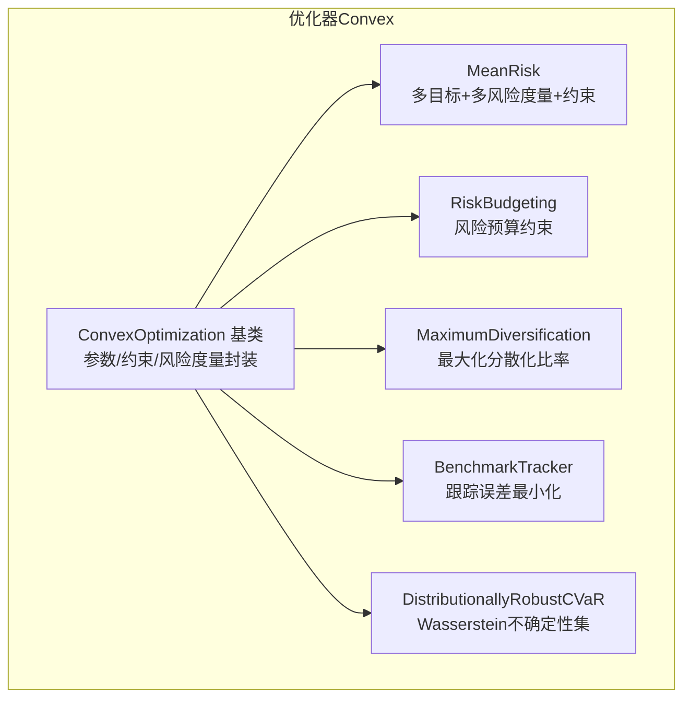
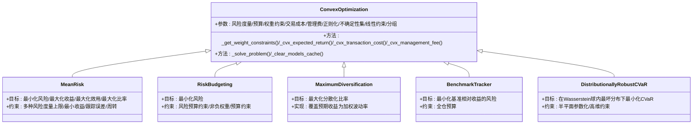
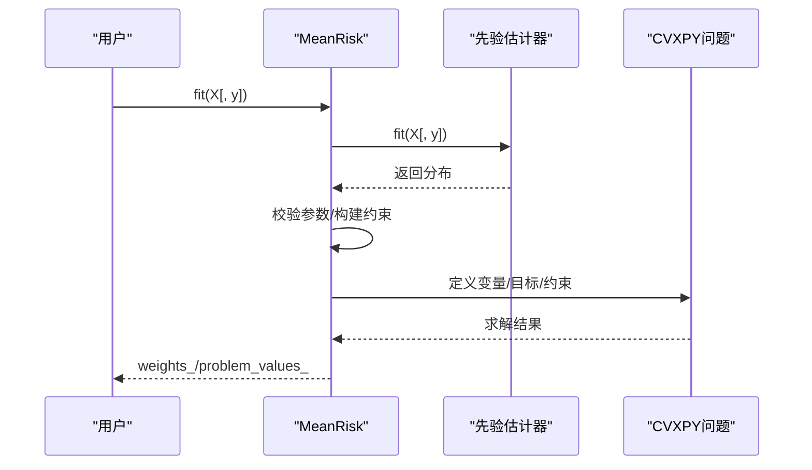
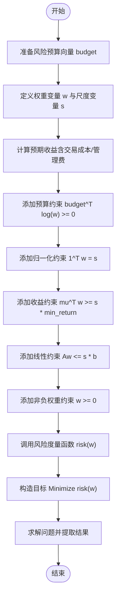
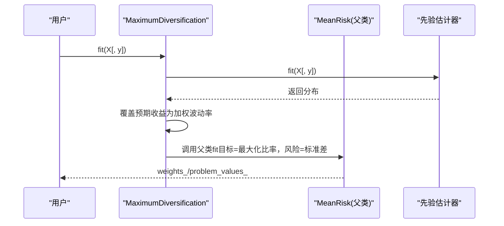
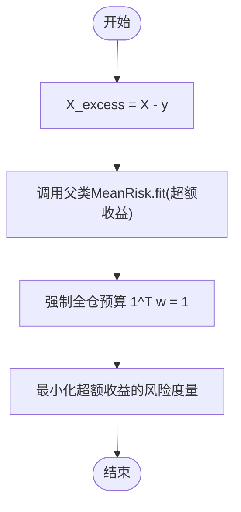
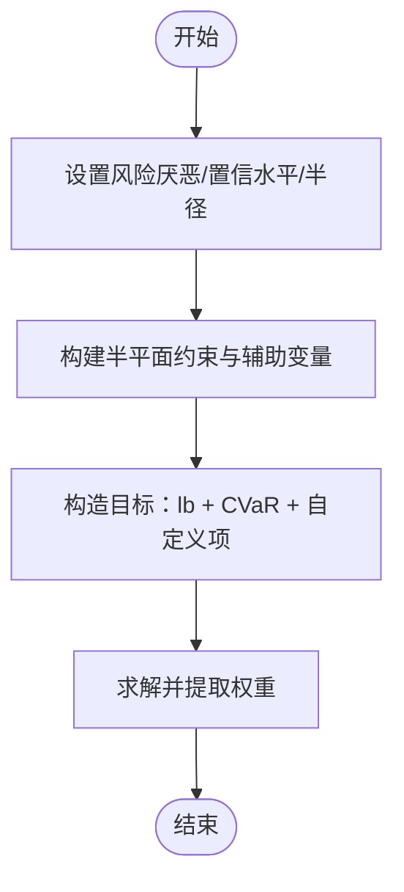
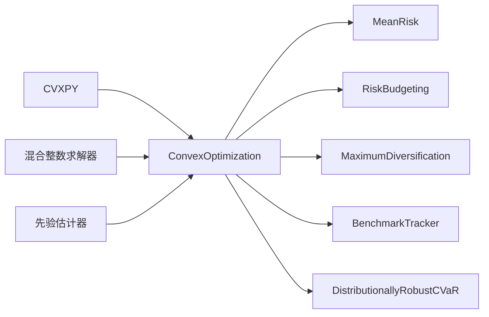

# 凸优化

<cite>
**本文引用的文件**
- [src/skfolio/optimization/convex/_mean_risk.py](file://src/skfolio/optimization/convex/_mean_risk.py)
- [src/skfolio/optimization/convex/_risk_budgeting.py](file://src/skfolio/optimization/convex/_risk_budgeting.py)
- [src/skfolio/optimization/convex/_maximum_diversification.py](file://src/skfolio/optimization/convex/_maximum_diversification.py)
- [src/skfolio/optimization/convex/_benchmark_tracker.py](file://src/skfolio/optimization/convex/_benchmark_tracker.py)
- [src/skfolio/optimization/convex/_distributionally_robust.py](file://src/skfolio/optimization/convex/_distributionally_robust.py)
- [src/skfolio/optimization/convex/_base.py](file://src/skfolio/optimization/convex/_base.py)
- [examples/mean_risk/plot_1_maximum_sharpe_ratio.py](file://examples/mean_risk/plot_1_maximum_sharpe_ratio.py)
- [examples/risk_budgeting/plot_2_risk_budgeting_CVaR.py](file://examples/risk_budgeting/plot_2_risk_budgeting_CVaR.py)
- [examples/maximum_diversification/plot_1_maximum_diversification.py](file://examples/maximum_diversification/plot_1_maximum_diversification.py)
- [examples/distributionally_robust_cvar/plot_1_distributionally_robust_cvar.py](file://examples/distributionally_robust_cvar/plot_1_distributionally_robust_cvar.py)
</cite>

## 目录
1. [引言](#引言)
2. [项目结构](#项目结构)
3. [核心组件](#核心组件)
4. [架构总览](#架构总览)
5. [详细组件分析](#详细组件分析)
6. [依赖关系分析](#依赖关系分析)
7. [性能考虑](#性能考虑)
8. [故障排查指南](#故障排查指南)
9. [结论](#结论)
10. [附录](#附录)

## 引言
本文件系统性梳理基于凸优化的投资组合优化器，覆盖以下五类优化器：
- MeanRisk：最小化风险、最大化夏普比率、最大化效用、最小化/最大化比率等目标函数，支持多种风险度量与约束（权重上下限、交易成本、管理费、正则化、不确定性集等）
- RiskBudgeting：通过风险预算约束进行风险分配，支持CVaR与方差等风险度量
- MaximumDiversification：最大化分散化比率，依赖协方差矩阵
- BenchmarkTracker：最小化跟踪误差（基准相对收益的风险），支持任意风险度量
- DistributionallyRobust：在Wasserstein不确定性集中进行分布鲁棒优化（仅支持CVaR）

同时给出求解器选择、数值稳定性、收敛性诊断与性能优化建议，并结合examples目录中的脚本路径提供可运行示例。

## 项目结构
凸优化相关代码集中在优化模块的convex子包中，基类提供统一的参数体系、约束构建、风险度量封装与求解流程；各具体优化器在基类之上叠加目标函数与约束。

图表来源
- [src/skfolio/optimization/convex/_base.py](file://src/skfolio/optimization/convex/_base.py#L64-L120)
- [src/skfolio/optimization/convex/_mean_risk.py](file://src/skfolio/optimization/convex/_mean_risk.py#L31-L120)
- [src/skfolio/optimization/convex/_risk_budgeting.py](file://src/skfolio/optimization/convex/_risk_budgeting.py#L25-L70)
- [src/skfolio/optimization/convex/_maximum_diversification.py](file://src/skfolio/optimization/convex/_maximum_diversification.py#L20-L60)
- [src/skfolio/optimization/convex/_benchmark_tracker.py](file://src/skfolio/optimization/convex/_benchmark_tracker.py#L16-L55)
- [src/skfolio/optimization/convex/_distributionally_robust.py](file://src/skfolio/optimization/convex/_distributionally_robust.py#L22-L60)

章节来源
- [src/skfolio/optimization/convex/_base.py](file://src/skfolio/optimization/convex/_base.py#L64-L120)
- [src/skfolio/optimization/convex/_mean_risk.py](file://src/skfolio/optimization/convex/_mean_risk.py#L31-L120)
- [src/skfolio/optimization/convex/_risk_budgeting.py](file://src/skfolio/optimization/convex/_risk_budgeting.py#L25-L70)
- [src/skfolio/optimization/convex/_maximum_diversification.py](file://src/skfolio/optimization/convex/_maximum_diversification.py#L20-L60)
- [src/skfolio/optimization/convex/_benchmark_tracker.py](file://src/skfolio/optimization/convex/_benchmark_tracker.py#L16-L55)
- [src/skfolio/optimization/convex/_distributionally_robust.py](file://src/skfolio/optimization/convex/_distributionally_robust.py#L22-L60)

## 核心组件
- ConvexOptimization基类：定义统一参数体系（权重约束、预算、交易成本、管理费、正则化、不确定性集、线性约束、分组等）、风险度量动态查找、求解流程与缓存机制
- MeanRisk：支持四类目标函数（最小化风险、最大化收益、最大化效用、最大化比率），支持多风险度量与各类约束
- RiskBudgeting：以风险预算约束为核心，支持多种风险度量（含CVaR）
- MaximumDiversification：最大化分散化比率，内部复用MeanRisk并通过覆盖预期收益表达式实现
- BenchmarkTracker：在超额收益空间最小化任意风险度量，强制全仓约束
- DistributionallyRobustCVaR：在Wasserstein球内最坏分布下最小化CVaR，支持半平面参数化与高维约束

章节来源
- [src/skfolio/optimization/convex/_base.py](file://src/skfolio/optimization/convex/_base.py#L64-L120)
- [src/skfolio/optimization/convex/_mean_risk.py](file://src/skfolio/optimization/convex/_mean_risk.py#L31-L120)
- [src/skfolio/optimization/convex/_risk_budgeting.py](file://src/skfolio/optimization/convex/_risk_budgeting.py#L25-L70)
- [src/skfolio/optimization/convex/_maximum_diversification.py](file://src/skfolio/optimization/convex/_maximum_diversification.py#L20-L60)
- [src/skfolio/optimization/convex/_benchmark_tracker.py](file://src/skfolio/optimization/convex/_benchmark_tracker.py#L16-L55)
- [src/skfolio/optimization/convex/_distributionally_robust.py](file://src/skfolio/optimization/convex/_distributionally_robust.py#L22-L60)

## 架构总览
凸优化器采用“基类+派生类”的层次化设计，基类负责：
- 参数标准化与校验
- 风险度量的动态方法查找
- 权重约束、预算、交易成本、管理费、正则化、线性约束、分组等通用构建
- 求解流程封装与结果缓存

图表来源
- [src/skfolio/optimization/convex/_base.py](file://src/skfolio/optimization/convex/_base.py#L64-L120)
- [src/skfolio/optimization/convex/_mean_risk.py](file://src/skfolio/optimization/convex/_mean_risk.py#L31-L120)
- [src/skfolio/optimization/convex/_risk_budgeting.py](file://src/skfolio/optimization/convex/_risk_budgeting.py#L25-L70)
- [src/skfolio/optimization/convex/_maximum_diversification.py](file://src/skfolio/optimization/convex/_maximum_diversification.py#L20-L60)
- [src/skfolio/optimization/convex/_benchmark_tracker.py](file://src/skfolio/optimization/convex/_benchmark_tracker.py#L16-L55)
- [src/skfolio/optimization/convex/_distributionally_robust.py](file://src/skfolio/optimization/convex/_distributionally_robust.py#L22-L60)

## 详细组件分析

### MeanRisk 优化器
- 数学目标函数
  - 最小化风险：min risk(w)，可附加收益下限、各类风险度量上限、跟踪误差上限、周转上限等
  - 最大化期望收益：max μᵀw，受风险度量上限与收益下限约束
  - 最大化效用：max μᵀw − λ·risk(w)，可同时限制收益下限与风险度量上限
  - 最大化比率：max (μᵀw − rf)/risk(w)，可同时限制收益下限与风险度量上限
- 支持的风险度量（部分列举）：均值绝对偏差、第一下偏矩、方差、半方差、CVaR、EVaR、最坏实现、CDaR、最大回撤、平均回撤、EDaR、溃疡指数、Gini均差等
- 约束条件
  - 权重上下限、预算约束（全仓/中性/无预算）
  - 最大多头/空头规模
  - 卡迪诺约束（混合整数）、分组卡迪诺、阈值长/短约束
  - 线性约束（资产或分组层面）
  - 交易成本与管理费（线性项）
  - 正则化（L1/L2）
  - 不确定性集（μ与Σ的椭球不确定性集）
  - 目标偏离（target_weights）与跟踪误差上限
  - 各类风险度量上限（如max_cvar等）
- 实际代码示例（参考）
  - 最大夏普比率：[examples/mean_risk/plot_1_maximum_sharpe_ratio.py](file://examples/mean_risk/plot_1_maximum_sharpe_ratio.py#L40-L50)
  - 交易成本：[examples/mean_risk/plot_6_transaction_costs.py](file://examples/mean_risk/plot_6_transaction_costs.py)
  - 管理费：[examples/mean_risk/plot_7_management_fees.py](file://examples/mean_risk/plot_7_management_fees.py)
  - 正则化：[examples/mean_risk/plot_8_regularization.py](file://examples/mean_risk/plot_8_regularization.py)
  - 不确定性集：[examples/mean_risk/plot_9_uncertainty_set.py](file://examples/mean_risk/plot_9_uncertainty_set.py)
  - 权重约束：[examples/mean_risk/plot_5_weight_constraints.py](file://examples/mean_risk/plot_5_weight_constraints.py)
  - 跟踪误差：[examples/mean_risk/plot_10_tracking_error.py](file://examples/mean_risk/plot_10_tracking_error.py)

图表来源
- [src/skfolio/optimization/convex/_mean_risk.py](file://src/skfolio/optimization/convex/_mean_risk.py#L783-L800)
- [src/skfolio/optimization/convex/_base.py](file://src/skfolio/optimization/convex/_base.py#L616-L660)

章节来源
- [src/skfolio/optimization/convex/_mean_risk.py](file://src/skfolio/optimization/convex/_mean_risk.py#L31-L120)
- [src/skfolio/optimization/convex/_mean_risk.py](file://src/skfolio/optimization/convex/_mean_risk.py#L783-L800)
- [src/skfolio/optimization/convex/_base.py](file://src/skfolio/optimization/convex/_base.py#L616-L660)
- [examples/mean_risk/plot_1_maximum_sharpe_ratio.py](file://examples/mean_risk/plot_1_maximum_sharpe_ratio.py#L40-L50)

### RiskBudgeting 优化器
- 数学目标与约束
  - 目标：最小化风险度量
  - 风险预算约束：budgetᵀlog(w) ≥ 0（预算向量与权重对数的内积）
  - 归一化约束：1ᵀw = s（s为尺度因子）
  - 收益约束：μᵀw ≥ s·min_return
  - 线性约束：Aw ≤ s·b
  - 非负权重：w ≥ 0
- 支持的风险度量：均值绝对偏差、第一下偏矩、方差、半方差、CVaR、EVaR、最坏实现、CDaR、最大回撤、平均回撤、EDaR、溃疡指数、Gini均差等
- 适用场景：按资产分配风险预算，支持CVaR与方差两种风险度量
- 实际代码示例（参考）
  - CVaR风险预算：[examples/risk_budgeting/plot_2_risk_budgeting_CVaR.py](file://examples/risk_budgeting/plot_2_risk_budgeting_CVaR.py#L40-L50)

图表来源
- [src/skfolio/optimization/convex/_risk_budgeting.py](file://src/skfolio/optimization/convex/_risk_budgeting.py#L25-L70)
- [src/skfolio/optimization/convex/_risk_budgeting.py](file://src/skfolio/optimization/convex/_risk_budgeting.py#L481-L616)

章节来源
- [src/skfolio/optimization/convex/_risk_budgeting.py](file://src/skfolio/optimization/convex/_risk_budgeting.py#L25-L70)
- [src/skfolio/optimization/convex/_risk_budgeting.py](file://src/skfolio/optimization/convex/_risk_budgeting.py#L481-L616)
- [examples/risk_budgeting/plot_2_risk_budgeting_CVaR.py](file://examples/risk_budgeting/plot_2_risk_budgeting_CVaR.py#L40-L50)

### MaximumDiversification 优化器
- 目标函数：最大化分散化比率 = (Σ_i w_i σ_i) / σ_total，其中σ_i为资产波动率，σ_total为组合波动率
- 实现方式：继承MeanRisk，将预期收益替换为加权波动率（Σ_i w_i σ_i），风险度量固定为标准差
- 依赖：协方差矩阵（用于计算各资产波动率与组合波动率）
- 实际代码示例（参考）
  - 分散化比率最大化：[examples/maximum_diversification/plot_1_maximum_diversification.py](file://examples/maximum_diversification/plot_1_maximum_diversification.py#L30-L36)

图表来源
- [src/skfolio/optimization/convex/_maximum_diversification.py](file://src/skfolio/optimization/convex/_maximum_diversification.py#L477-L514)
- [src/skfolio/optimization/convex/_mean_risk.py](file://src/skfolio/optimization/convex/_mean_risk.py#L31-L120)

章节来源
- [src/skfolio/optimization/convex/_maximum_diversification.py](file://src/skfolio/optimization/convex/_maximum_diversification.py#L20-L60)
- [src/skfolio/optimization/convex/_maximum_diversification.py](file://src/skfolio/optimization/convex/_maximum_diversification.py#L477-L514)
- [examples/maximum_diversification/plot_1_maximum_diversification.py](file://examples/maximum_diversification/plot_1_maximum_diversification.py#L30-L36)

### BenchmarkTracker 优化器
- 目标：最小化基准相对收益（超额收益）的风险
- 方法：将输入X转换为超额收益（X − y），然后在超额收益空间最小化任意风险度量，强制全仓预算（Σ_i w_i = 1）
- 适用场景：跟踪误差最小化、基准相对风险管理
- 实际代码示例（参考）
  - 基准跟踪（标准差）：[examples/mean_risk/plot_10_tracking_error.py](file://examples/mean_risk/plot_10_tracking_error.py)

图表来源
- [src/skfolio/optimization/convex/_benchmark_tracker.py](file://src/skfolio/optimization/convex/_benchmark_tracker.py#L282-L320)
- [src/skfolio/optimization/convex/_mean_risk.py](file://src/skfolio/optimization/convex/_mean_risk.py#L31-L120)

章节来源
- [src/skfolio/optimization/convex/_benchmark_tracker.py](file://src/skfolio/optimization/convex/_benchmark_tracker.py#L16-L55)
- [src/skfolio/optimization/convex/_benchmark_tracker.py](file://src/skfolio/optimization/convex/_benchmark_tracker.py#L282-L320)
- [examples/mean_risk/plot_10_tracking_error.py](file://examples/mean_risk/plot_10_tracking_error.py)

### DistributionallyRobustCVaR 优化器
- 数学思想：在Wasserstein球内最坏分布下最小化CVaR，利用半平面参数化将分布鲁棒问题转化为有限凸规划
- 约束：半平面形式的Wasserstein球约束，包含大量辅助变量与约束，适合使用能处理高约束数的求解器（如Mosek）
- 参数：风险厌恶系数、CVaR置信水平、Wasserstein球半径
- 实际代码示例（参考）
  - 分布鲁棒CVaR：[examples/distributionally_robust_cvar/plot_1_distributionally_robust_cvar.py](file://examples/distributionally_robust_cvar/plot_1_distributionally_robust_cvar.py#L50-L75)

图表来源
- [src/skfolio/optimization/convex/_distributionally_robust.py](file://src/skfolio/optimization/convex/_distributionally_robust.py#L352-L476)

章节来源
- [src/skfolio/optimization/convex/_distributionally_robust.py](file://src/skfolio/optimization/convex/_distributionally_robust.py#L22-L60)
- [src/skfolio/optimization/convex/_distributionally_robust.py](file://src/skfolio/optimization/convex/_distributionally_robust.py#L352-L476)
- [examples/distributionally_robust_cvar/plot_1_distributionally_robust_cvar.py](file://examples/distributionally_robust_cvar/plot_1_distributionally_robust_cvar.py#L50-L75)

## 依赖关系分析
- 组件耦合
  - 所有优化器均依赖ConvexOptimization基类提供的统一参数体系与求解框架
  - MeanRisk作为多目标多约束的核心，被MaximumDiversification与BenchmarkTracker复用
  - RiskBudgeting与DistributionallyRobustCVaR各自独立，但共享基类的约束与求解基础设施
- 外部依赖
  - CVXPY用于建模与求解
  - 可选混合整数求解器（SCIP/MOSEK/GUROBI/CPLEX）用于卡迪诺/阈值等MIP约束
  - 先验估计器（EmpiricalPrior等）提供收益分布（均值、协方差、样本权重等）

图表来源
- [src/skfolio/optimization/convex/_base.py](file://src/skfolio/optimization/convex/_base.py#L64-L120)
- [src/skfolio/optimization/convex/_mean_risk.py](file://src/skfolio/optimization/convex/_mean_risk.py#L31-L120)
- [src/skfolio/optimization/convex/_risk_budgeting.py](file://src/skfolio/optimization/convex/_risk_budgeting.py#L25-L70)
- [src/skfolio/optimization/convex/_maximum_diversification.py](file://src/skfolio/optimization/convex/_maximum_diversification.py#L20-L60)
- [src/skfolio/optimization/convex/_benchmark_tracker.py](file://src/skfolio/optimization/convex/_benchmark_tracker.py#L16-L55)
- [src/skfolio/optimization/convex/_distributionally_robust.py](file://src/skfolio/optimization/convex/_distributionally_robust.py#L22-L60)

章节来源
- [src/skfolio/optimization/convex/_base.py](file://src/skfolio/optimization/convex/_base.py#L64-L120)
- [src/skfolio/optimization/convex/_mean_risk.py](file://src/skfolio/optimization/convex/_mean_risk.py#L31-L120)
- [src/skfolio/optimization/convex/_risk_budgeting.py](file://src/skfolio/optimization/convex/_risk_budgeting.py#L25-L70)
- [src/skfolio/optimization/convex/_maximum_diversification.py](file://src/skfolio/optimization/convex/_maximum_diversification.py#L20-L60)
- [src/skfolio/optimization/convex/_benchmark_tracker.py](file://src/skfolio/optimization/convex/_benchmark_tracker.py#L16-L55)
- [src/skfolio/optimization/convex/_distributionally_robust.py](file://src/skfolio/optimization/convex/_distributionally_robust.py#L22-L60)

## 性能考虑
- 求解器选择
  - 默认求解器：CLARABEL（数值稳定性与性能更优）
  - 需要处理大量约束（如分布鲁棒CVaR）时，优先选择支持高约束数的商业求解器（如MOSEK）
  - 卡迪诺/阈值等MIP约束需使用支持混合整数的求解器（SCIP/MOSEK/GUROBI/CPLEX）
- 数值稳定性
  - 使用基类的缩放机制（scale_objective/scale_constraints）提升数值精度
  - 对于高维问题，合理设置solver_params（如容差）
- 收敛性诊断
  - 通过保存问题（save_problem）与查看problem_values_辅助定位问题
  - fallback机制在失败时自动回退到previous_weights或其他备选策略
- 性能优化建议
  - 合理设置风险度量上限与预算约束，避免过度松弛导致求解困难
  - 对协方差矩阵进行稳健估计（如经验/收缩/Ledoit-Wolf等）以提升优化稳定性
  - 控制样本长度与特征数量，避免病态协方差矩阵

[本节为通用指导，不直接分析具体文件]

## 故障排查指南
- 常见错误与处理
  - MIP约束与求解器不匹配：当使用cardinality/group_cardinalities/threshold_long/threshold_short时，若solver不支持MIP会报错；需切换至SCIP或商业求解器
  - 预算与目标冲突：BenchmarkTracker强制全仓预算，若外部传入非1.0预算会触发异常
  - 参数类型与范围：确保min/max_weights、max_long/max_short等参数满足约束要求
- 回退策略
  - 通过fallback参数指定备选优化器或previous_weights，失败后自动回退并记录链路
- 结果验证
  - 通过problem_values_与weights_检查目标值与权重是否合理
  - 使用Portfolio对象的summary/plot方法进行可视化分析

章节来源
- [src/skfolio/optimization/convex/_base.py](file://src/skfolio/optimization/convex/_base.py#L748-L763)
- [src/skfolio/optimization/convex/_benchmark_tracker.py](file://src/skfolio/optimization/convex/_benchmark_tracker.py#L305-L312)
- [src/skfolio/optimization/convex/_mean_risk.py](file://src/skfolio/optimization/convex/_mean_risk.py#L783-L800)

## 结论
本项目以ConvexOptimization基类为核心，提供了统一而强大的凸优化框架，覆盖从经典均值-风险到风险预算、分散化、跟踪误差与分布鲁棒等多样化投资组合优化需求。通过灵活的参数体系、丰富的风险度量与约束选项，以及完善的求解与回退机制，能够满足研究与工程实践中的多种场景。建议在实际应用中根据问题规模与稳定性需求选择合适的求解器与正则化策略，并结合先验估计器与数据预处理以提升优化效果。

[本节为总结性内容，不直接分析具体文件]

## 附录
- 示例脚本路径（参考）
  - 最大夏普比率：[examples/mean_risk/plot_1_maximum_sharpe_ratio.py](file://examples/mean_risk/plot_1_maximum_sharpe_ratio.py#L40-L50)
  - 风险预算-CVaR：[examples/risk_budgeting/plot_2_risk_budgeting_CVaR.py](file://examples/risk_budgeting/plot_2_risk_budgeting_CVaR.py#L40-L50)
  - 分散化比率最大化：[examples/maximum_diversification/plot_1_maximum_diversification.py](file://examples/maximum_diversification/plot_1_maximum_diversification.py#L30-L36)
  - 分布鲁棒CVaR：[examples/distributionally_robust_cvar/plot_1_distributionally_robust_cvar.py](file://examples/distributionally_robust_cvar/plot_1_distributionally_robust_cvar.py#L50-L75)

[本节为索引性内容，不直接分析具体文件]