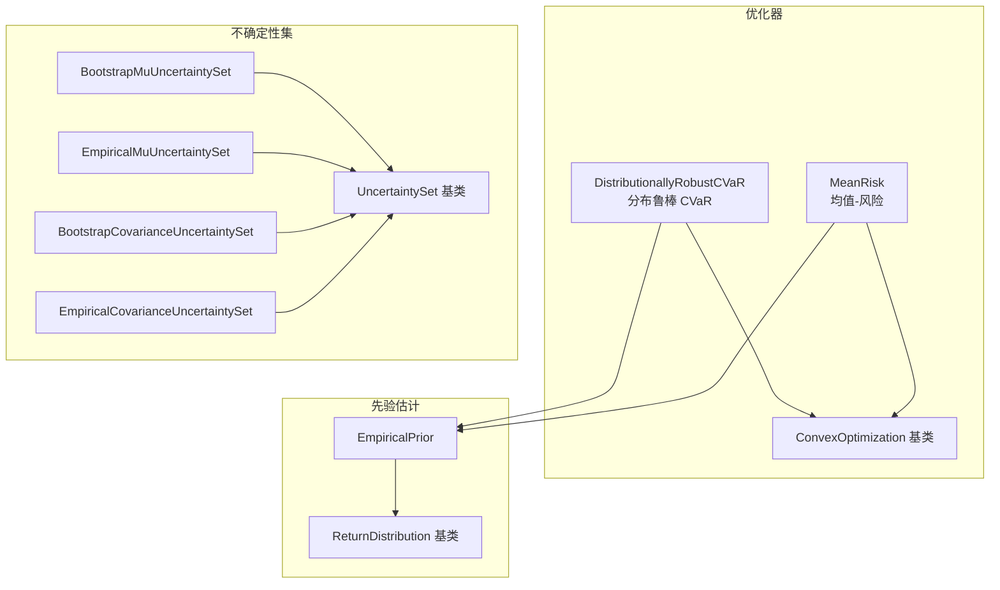
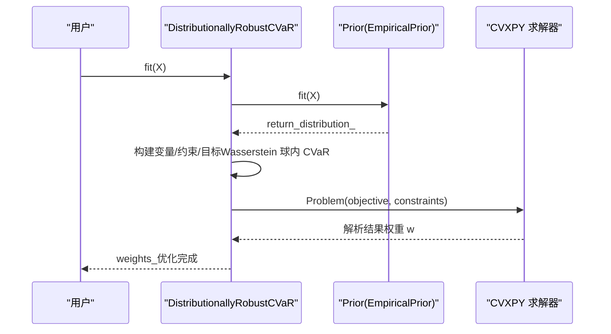
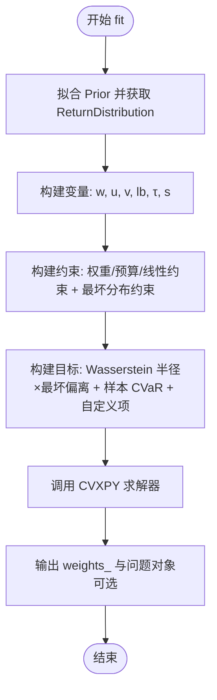
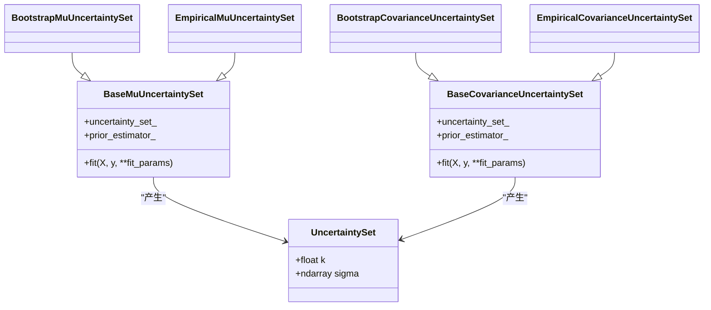
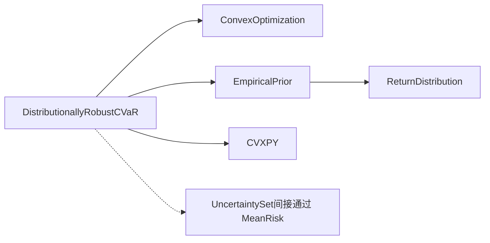

# 分布鲁棒优化

<cite>
**本文引用的文件**
- [src/skfolio/optimization/convex/_distributionally_robust.py](file://src/skfolio/optimization/convex/_distributionally_robust.py)
- [src/skfolio/optimization/convex/_base.py](file://src/skfolio/optimization/convex/_base.py)
- [src/skfolio/optimization/convex/_mean_risk.py](file://src/skfolio/optimization/convex/_mean_risk.py)
- [src/skfolio/uncertainty_set/_base.py](file://src/skfolio/uncertainty_set/_base.py)
- [src/skfolio/uncertainty_set/_bootstrap.py](file://src/skfolio/uncertainty_set/_bootstrap.py)
- [src/skfolio/uncertainty_set/_empirical.py](file://src/skfolio/uncertainty_set/_empirical.py)
- [src/skfolio/prior/_base.py](file://src/skfolio/prior/_base.py)
- [src/skfolio/prior/_empirical.py](file://src/skfolio/prior/_empirical.py)
- [examples/distributionally_robust_cvar/plot_1_distributionally_robust_cvar.py](file://examples/distributionally_robust_cvar/plot_1_distributionally_robust_cvar.py)
- [examples/mean_risk/plot_9_uncertainty_set.py](file://examples/mean_risk/plot_9_uncertainty_set.py)
- [docs/user_guide/uncertainty_set.rst](file://docs/user_guide/uncertainty_set.rst)
</cite>

## 目录
1. [引言](#引言)
2. [项目结构](#项目结构)
3. [核心组件](#核心组件)
4. [架构总览](#架构总览)
5. [详细组件分析](#详细组件分析)
6. [依赖关系分析](#依赖关系分析)
7. [性能考虑](#性能考虑)
8. [故障排查指南](#故障排查指南)
9. [结论](#结论)
10. [附录](#附录)

## 引言
本文件系统性记录 DistributionallyRobust 优化器的技术细节，聚焦于其在不确定性集（Uncertainty Set）框架下的鲁棒优化思想。该优化器通过在 Wasserstein 距离度量下构造多变量非离散概率分布的“最坏分布”集合，在此集合中最小化 CVaR（条件风险价值），从而在预期收益或协方差矩阵存在估计误差时，寻找对最坏情况具有鲁棒性的投资组合。文档同时阐述其与 uncertainty_set 模块（如 Bootstrap、Empirical 等）的集成方式，两阶段优化过程（内层寻找最坏分布，外层优化组合权重），并通过示例展示其在压力测试与抗过拟合方面的优势，并给出配置方法、复杂度分析、性能优化建议及与传统均值-方差优化的对比场景。

## 项目结构
围绕 DistributionallyRobust 的关键代码分布在以下模块：
- 优化器实现：src/skfolio/optimization/convex/_distributionally_robust.py
- 基类与通用优化能力：src/skfolio/optimization/convex/_base.py
- 不确定性集基础与实现：src/skfolio/uncertainty_set/_base.py、_bootstrap.py、_empirical.py
- 先验估计器（返回分布）：src/skfolio/prior/_base.py、_empirical.py
- 示例与用户指南：examples/*、docs/user_guide/*

图表来源
- [src/skfolio/optimization/convex/_distributionally_robust.py](file://src/skfolio/optimization/convex/_distributionally_robust.py#L1-L120)
- [src/skfolio/optimization/convex/_base.py](file://src/skfolio/optimization/convex/_base.py#L1-L120)
- [src/skfolio/optimization/convex/_mean_risk.py](file://src/skfolio/optimization/convex/_mean_risk.py#L1-L120)
- [src/skfolio/uncertainty_set/_base.py](file://src/skfolio/uncertainty_set/_base.py#L1-L60)
- [src/skfolio/uncertainty_set/_bootstrap.py](file://src/skfolio/uncertainty_set/_bootstrap.py#L1-L60)
- [src/skfolio/uncertainty_set/_empirical.py](file://src/skfolio/uncertainty_set/_empirical.py#L1-L60)
- [src/skfolio/prior/_base.py](file://src/skfolio/prior/_base.py#L1-L50)
- [src/skfolio/prior/_empirical.py](file://src/skfolio/prior/_empirical.py#L1-L60)

章节来源
- [src/skfolio/optimization/convex/_distributionally_robust.py](file://src/skfolio/optimization/convex/_distributionally_robust.py#L1-L120)
- [src/skfolio/optimization/convex/_base.py](file://src/skfolio/optimization/convex/_base.py#L1-L120)
- [src/skfolio/uncertainty_set/_base.py](file://src/skfolio/uncertainty_set/_base.py#L1-L60)
- [src/skfolio/prior/_base.py](file://src/skfolio/prior/_base.py#L1-L50)

## 核心组件
- DistributionallyRobustCVaR：基于 Wasserstein 距离的分布鲁棒 CVaR 优化器，通过有限凸规划形式求解最坏分布下的 CVaR 最小化问题。支持权重上下界、预算约束、线性约束、自定义目标与约束、回退策略等。
- MeanRisk：通用均值-风险优化器，支持多种风险度量与不确定性集（包括期望收益与协方差的椭球不确定性集），可直接集成 uncertainty_set 模块进行最坏情况优化。
- UncertaintySet 及其实现：提供椭球不确定性集的大小 κ 与形状 S 的估计，支持 Bootstrap 与 Empirical 两类方法；分别用于期望收益与协方差矩阵。
- Prior（先验估计）：提供 ReturnDistribution 数据结构，封装估计的期望收益、协方差、观测收益等，供优化器使用。

章节来源
- [src/skfolio/optimization/convex/_distributionally_robust.py](file://src/skfolio/optimization/convex/_distributionally_robust.py#L1-L120)
- [src/skfolio/optimization/convex/_mean_risk.py](file://src/skfolio/optimization/convex/_mean_risk.py#L1-L120)
- [src/skfolio/uncertainty_set/_base.py](file://src/skfolio/uncertainty_set/_base.py#L1-L60)
- [src/skfolio/uncertainty_set/_bootstrap.py](file://src/skfolio/uncertainty_set/_bootstrap.py#L1-L60)
- [src/skfolio/uncertainty_set/_empirical.py](file://src/skfolio/uncertainty_set/_empirical.py#L1-L60)
- [src/skfolio/prior/_base.py](file://src/skfolio/prior/_base.py#L1-L50)
- [src/skfolio/prior/_empirical.py](file://src/skfolio/prior/_empirical.py#L1-L60)

## 架构总览
DistributionallyRobustCVaR 的整体流程如下：
- 输入为资产日度/周期收益矩阵 X；
- 使用 EmpiricalPrior 或自定义 Prior 估计 ReturnDistribution（包含 mu、Σ、returns 等）；
- 在 Wasserstein 球内构造最坏分布集合，将 CVaR 最小化问题转化为有限凸规划；
- 通过 CVXPY 求解器（默认 CLARABEL）求解权重 w；
- 支持保存问题、自定义目标/约束、回退策略等。

图表来源
- [src/skfolio/optimization/convex/_distributionally_robust.py](file://src/skfolio/optimization/convex/_distributionally_robust.py#L352-L476)
- [src/skfolio/prior/_empirical.py](file://src/skfolio/prior/_empirical.py#L109-L200)

章节来源
- [src/skfolio/optimization/convex/_distributionally_robust.py](file://src/skfolio/optimization/convex/_distributionally_robust.py#L352-L476)
- [src/skfolio/prior/_empirical.py](file://src/skfolio/prior/_empirical.py#L109-L200)

## 详细组件分析

### DistributionallyRobustCVaR 组件分析
- 鲁棒思想与数学形式：在均匀分布的训练样本上以 Wasserstein 距离为中心构造球形不确定性集，内层搜索最坏分布，外层优化权重，使 CVaR 对最坏分布最小化。
- 关键参数：
  - cvar_beta：CVaR 置信水平；
  - risk_aversion：效用函数的风险厌恶系数；
  - wasserstein_ball_radius：Wasserstein 球半径；
  - prior_estimator：先验估计器，默认 EmpiricalPrior；
  - 权重与预算约束、线性约束、自定义目标/约束、回退策略等。
- 内部变量与约束：
  - 引入辅助变量 u、v、lb、τ、s，将 CVaR 的分段线性形式与最坏分布约束嵌入；
  - 对每个样本构造无穷范数约束，形成高维线性约束集合；
  - 目标函数由“Wasserstein 球半径 × 最坏偏离 + 样本平均 CVaR + 自定义项”组成。
- 求解流程：
  - fit 中完成 Prior 拟合并提取 return_distribution；
  - 设置求解器参数与缩放；
  - 构建变量、约束与目标；
  - 调用 _solve_problem 完成求解并输出 weights_。

图表来源
- [src/skfolio/optimization/convex/_distributionally_robust.py](file://src/skfolio/optimization/convex/_distributionally_robust.py#L352-L476)

章节来源
- [src/skfolio/optimization/convex/_distributionally_robust.py](file://src/skfolio/optimization/convex/_distributionally_robust.py#L1-L220)
- [src/skfolio/optimization/convex/_distributionally_robust.py](file://src/skfolio/optimization/convex/_distributionally_robust.py#L352-L476)

### 不确定性集模块（UncertaintySet）与 MeanRisk 集成
- UncertaintySet 基类：定义椭球不确定性集的大小 κ 与形状 S，支持期望收益与协方差两种情形。
- Bootstrap 与 Empirical 实现：
  - BootstrapMuUncertaintySet：基于循环 Bootstrap 计算 μ 的椭球不确定性集，支持置信水平、是否对角化、Bootstrap 样本数与块长等；
  - BootstrapCovarianceUncertaintySet：基于循环 Bootstrap 计算 Σ 的椭球不确定性集；
  - EmpiricalMuUncertaintySet：基于样本均值的正态假设与有效样本数 n_eff 计算 μ 的椭球不确定性集；
  - EmpiricalCovarianceUncertaintySet：基于 Wishart 分布推导 Σ 的椭球不确定性集的形状矩阵。
- MeanRisk 集成：MeanRisk 支持传入 mu_uncertainty_set_estimator 与 covariance_uncertainty_set_estimator，从而在最坏情况下优化目标（例如最大化回报率或最小化 CVaR）。

图表来源
- [src/skfolio/uncertainty_set/_base.py](file://src/skfolio/uncertainty_set/_base.py#L1-L133)
- [src/skfolio/uncertainty_set/_bootstrap.py](file://src/skfolio/uncertainty_set/_bootstrap.py#L1-L120)
- [src/skfolio/uncertainty_set/_empirical.py](file://src/skfolio/uncertainty_set/_empirical.py#L1-L120)

章节来源
- [src/skfolio/uncertainty_set/_base.py](file://src/skfolio/uncertainty_set/_base.py#L1-L133)
- [src/skfolio/uncertainty_set/_bootstrap.py](file://src/skfolio/uncertainty_set/_bootstrap.py#L1-L120)
- [src/skfolio/uncertainty_set/_empirical.py](file://src/skfolio/uncertainty_set/_empirical.py#L1-L120)
- [src/skfolio/optimization/convex/_mean_risk.py](file://src/skfolio/optimization/convex/_mean_risk.py#L360-L420)

### 两阶段优化过程（内层最坏分布，外层权重优化）
- 内层：在 Wasserstein 球内搜索最坏分布，将 CVaR 的分段线性形式与无穷范数约束结合，形成高维线性约束；
- 外层：在这些约束下最小化样本平均 CVaR 与自定义项，得到最优权重；
- 该流程确保在估计误差存在时，组合对最坏分布保持稳健。

章节来源
- [src/skfolio/optimization/convex/_distributionally_robust.py](file://src/skfolio/optimization/convex/_distributionally_robust.py#L400-L470)

### 与 MeanRisk 的对比与互补
- MeanRisk 支持多种风险度量与不确定性集，适合在期望收益与协方差层面引入椭球不确定性集，进行最坏情况优化；
- DistributionallyRobustCVaR 则在分布层面引入 Wasserstein 球，直接在最坏分布下最小化 CVaR，更强调分布级的鲁棒性；
- 两者均可通过 prior_estimator 与自定义目标/约束扩展，满足不同场景需求。

章节来源
- [src/skfolio/optimization/convex/_mean_risk.py](file://src/skfolio/optimization/convex/_mean_risk.py#L1-L120)
- [src/skfolio/optimization/convex/_distributionally_robust.py](file://src/skfolio/optimization/convex/_distributionally_robust.py#L1-L120)

## 依赖关系分析
- DistributionallyRobustCVaR 依赖 ConvexOptimization 基类（提供权重约束、预算约束、线性约束、自定义目标/约束、求解器设置等通用能力）；
- 依赖 Prior（默认 EmpiricalPrior）提供 ReturnDistribution；
- 与 CVXPY 紧密耦合，通过 Problem/Variable/Constraint 构建与求解；
- 与 uncertainty_set 模块无直接耦合，但可通过 MeanRisk 间接集成。

图表来源
- [src/skfolio/optimization/convex/_distributionally_robust.py](file://src/skfolio/optimization/convex/_distributionally_robust.py#L1-L120)
- [src/skfolio/optimization/convex/_base.py](file://src/skfolio/optimization/convex/_base.py#L1-L120)
- [src/skfolio/prior/_empirical.py](file://src/skfolio/prior/_empirical.py#L109-L200)
- [src/skfolio/prior/_base.py](file://src/skfolio/prior/_base.py#L1-L50)

章节来源
- [src/skfolio/optimization/convex/_distributionally_robust.py](file://src/skfolio/optimization/convex/_distributionally_robust.py#L1-L120)
- [src/skfolio/optimization/convex/_base.py](file://src/skfolio/optimization/convex/_base.py#L1-L120)
- [src/skfolio/prior/_empirical.py](file://src/skfolio/prior/_empirical.py#L109-L200)
- [src/skfolio/prior/_base.py](file://src/skfolio/prior/_base.py#L1-L50)

## 性能考虑
- 求解器选择：推荐使用能处理大量约束的商业求解器（如 Mosek），若使用开源求解器（如 CLARABEL），建议适当降低数据规模或提升缩放参数以改善收敛稳定性。
- 缩放与数值稳定：通过 scale_objective 与 scale_constraints 提升数值稳定性，有助于在高维约束下获得更稳定的解。
- 数据规模：Wasserstein 球内的约束数量与样本数线性相关，样本过多会导致约束爆炸，需控制样本长度或采用降维/稀疏化策略。
- 回退机制：当求解失败时，可启用 fallback 机制（如 previous_weights），保证系统可用性。

章节来源
- [src/skfolio/optimization/convex/_distributionally_robust.py](file://src/skfolio/optimization/convex/_distributionally_robust.py#L180-L220)
- [src/skfolio/optimization/convex/_distributionally_robust.py](file://src/skfolio/optimization/convex/_distributionally_robust.py#L400-L470)
- [src/skfolio/optimization/convex/_base.py](file://src/skfolio/optimization/convex/_base.py#L1-L120)

## 故障排查指南
- 求解失败：检查 solver 是否合适、是否启用 fallback、是否设置合理的 scale_objective/scale_constraints；
- 数据问题：确认 X 的形状与列名一致性，确保 Prior 能正确拟合；
- 参数设置：核对 cvar_beta、wasserstein_ball_radius、prior_estimator 等关键参数；
- 结果不可信：尝试增大 wasserstein_ball_radius 或切换到更稳健的求解器。

章节来源
- [src/skfolio/optimization/convex/_distributionally_robust.py](file://src/skfolio/optimization/convex/_distributionally_robust.py#L214-L235)
- [src/skfolio/optimization/convex/_base.py](file://src/skfolio/optimization/convex/_base.py#L1-L120)

## 结论
DistributionallyRobustCVaR 将分布级鲁棒优化思想与 CVaR 度量有机结合，通过 Wasserstein 球内的最坏分布搜索，显著提升了在估计误差下的组合稳健性。配合 uncertainty_set 模块（尤其是 MeanRisk 的集成），可在期望收益与协方差层面引入椭球不确定性集，进一步增强对抗估计偏差的能力。对于大规模约束与高维问题，应重视求解器选择、缩放与回退策略，以平衡性能与稳定性。

## 附录

### 不确定性集配置方法
- 期望收益不确定性集：
  - EmpiricalMuUncertaintySet：基于样本均值的正态假设与有效样本数 n_eff；
  - BootstrapMuUncertaintySet：基于循环 Bootstrap，支持置信水平、是否对角化、Bootstrap 样本数与块长。
- 协方差不确定性集：
  - EmpiricalCovarianceUncertaintySet：基于 Wishart 分布推导；
  - BootstrapCovarianceUncertaintySet：基于循环 Bootstrap。
- 在 MeanRisk 中通过参数 mu_uncertainty_set_estimator 与 covariance_uncertainty_set_estimator 进行集成。

章节来源
- [src/skfolio/uncertainty_set/_empirical.py](file://src/skfolio/uncertainty_set/_empirical.py#L1-L120)
- [src/skfolio/uncertainty_set/_bootstrap.py](file://src/skfolio/uncertainty_set/_bootstrap.py#L1-L120)
- [src/skfolio/optimization/convex/_mean_risk.py](file://src/skfolio/optimization/convex/_mean_risk.py#L360-L420)
- [docs/user_guide/uncertainty_set.rst](file://docs/user_guide/uncertainty_set.rst#L1-L87)

### 求解复杂度分析
- 约束数量：与样本数 n_observations 成线性关系，每个样本引入若干无穷范数约束；
- 变量数量：与资产数 n_assets 与样本数 n_observations 相关；
- 求解时间：受样本规模、约束密度与求解器性能影响，通常随 n_observations 与 n_assets 增长而增加；
- 数值稳定性：可通过 scale_objective/scale_constraints 与合适的求解器提升稳定性。

章节来源
- [src/skfolio/optimization/convex/_distributionally_robust.py](file://src/skfolio/optimization/convex/_distributionally_robust.py#L400-L470)

### 计算性能优化建议
- 优先使用商业求解器（如 Mosek）以处理大规模约束；
- 控制样本长度，必要时采用滚动窗口；
- 合理设置 scale_objective/scale_constraints；
- 在 MeanRisk 中使用不确定性集时，可先进行网格/随机搜索选择置信水平等超参数，再在测试集评估稳定性。

章节来源
- [src/skfolio/optimization/convex/_distributionally_robust.py](file://src/skfolio/optimization/convex/_distributionally_robust.py#L180-L220)
- [examples/mean_risk/plot_9_uncertainty_set.py](file://examples/mean_risk/plot_9_uncertainty_set.py#L1-L120)

### 与传统均值-方差优化的对比场景
- 传统均值-方差：依赖点估计的期望收益与协方差，易受估计误差影响，可能出现过拟合；
- 分布鲁棒 CVaR：在分布层面引入不确定性集，直接最小化最坏情况下的 CVaR，提高外样本稳定性；
- 不确定性集集成：MeanRisk 可在期望收益与协方差层面引入椭球不确定性集，实现“参数级”鲁棒优化，适用于估计误差较大或样本较短的情形。

章节来源
- [src/skfolio/optimization/convex/_mean_risk.py](file://src/skfolio/optimization/convex/_mean_risk.py#L1-L120)
- [examples/mean_risk/plot_9_uncertainty_set.py](file://examples/mean_risk/plot_9_uncertainty_set.py#L1-L120)

### 示例参考
- 分布鲁棒 CVaR 示例：展示随着 Wasserstein 球半径增大，权重趋于均衡（接近等权）的趋势，验证鲁棒性与抗过拟合效果。
- 不确定性集集成示例：展示在 MeanRisk 中使用 EmpiricalMuUncertaintySet 的最坏情况优化，比较有/无不确定性集的模型在测试集上的表现。

章节来源
- [examples/distributionally_robust_cvar/plot_1_distributionally_robust_cvar.py](file://examples/distributionally_robust_cvar/plot_1_distributionally_robust_cvar.py#L1-L111)
- [examples/mean_risk/plot_9_uncertainty_set.py](file://examples/mean_risk/plot_9_uncertainty_set.py#L1-L120)