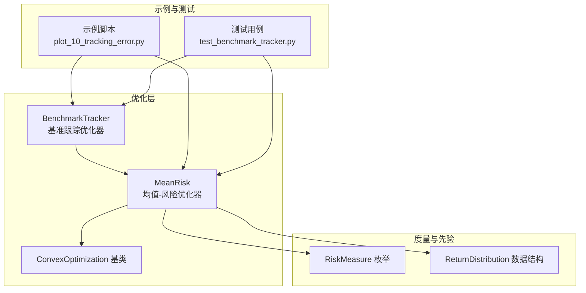
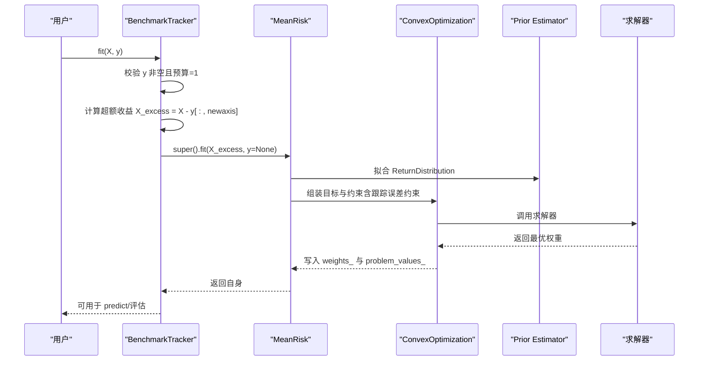
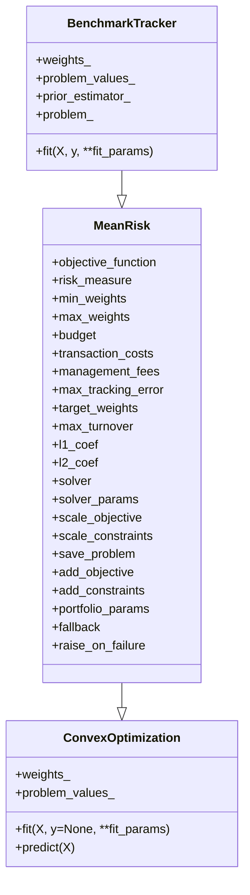
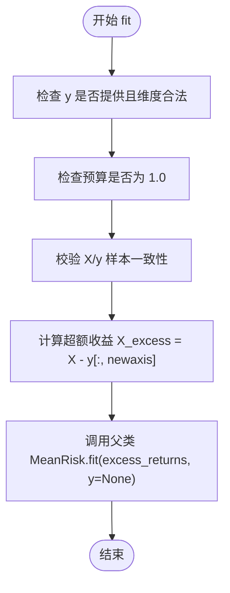
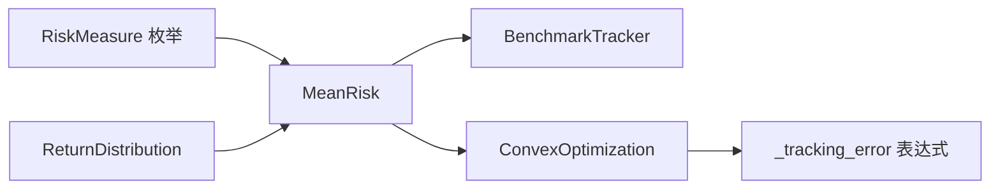

# 基准跟踪优化

<cite>
**本文引用的文件列表**
- [src/skfolio/optimization/convex/_benchmark_tracker.py](file://src/skfolio/optimization/convex/_benchmark_tracker.py)
- [src/skfolio/optimization/convex/_mean_risk.py](file://src/skfolio/optimization/convex/_mean_risk.py)
- [src/skfolio/optimization/convex/_base.py](file://src/skfolio/optimization/convex/_base.py)
- [src/skfolio/measures/_enums.py](file://src/skfolio/measures/_enums.py)
- [src/skfolio/prior/_base.py](file://src/skfolio/prior/_base.py)
- [examples/mean_risk/plot_10_tracking_error.py](file://examples/mean_risk/plot_10_tracking_error.py)
- [tests/test_optimization/test_convex/test_benchmark_tracker.py](file://tests/test_optimization/test_convex/test_benchmark_tracker.py)
- [docs/user_guide/optimization.rst](file://docs/user_guide/optimization.rst)
</cite>

## 目录
1. [引言](#引言)
2. [项目结构](#项目结构)
3. [核心组件](#核心组件)
4. [架构总览](#架构总览)
5. [详细组件分析](#详细组件分析)
6. [依赖关系分析](#依赖关系分析)
7. [性能考虑](#性能考虑)
8. [故障排查指南](#故障排查指南)
9. [结论](#结论)
10. [附录：API参数详解](#附录api参数详解)

## 引言
本文件系统性阐述 BenchmarkTracker 优化器的实现原理与使用方法，聚焦于“最小化跟踪误差”的目标，适用于指数复制或主动管理中控制偏离度的场景。我们将从数学模型、凸优化转化、基准输入方式、约束融合（交易成本、权重限制等）、示例应用到高维资产空间下的性能优化策略进行深入解析。

## 项目结构
围绕基准跟踪优化的相关代码主要分布在以下模块：
- 优化器实现：convex 层的 BenchmarkTracker 与 MeanRisk
- 风险度量枚举：RiskMeasure
- 先验估计器接口：ReturnDistribution
- 示例与测试：示例脚本与单元测试覆盖了跟踪误差约束与基准跟踪两种路径

图表来源
- [src/skfolio/optimization/convex/_benchmark_tracker.py](file://src/skfolio/optimization/convex/_benchmark_tracker.py#L1-L320)
- [src/skfolio/optimization/convex/_mean_risk.py](file://src/skfolio/optimization/convex/_mean_risk.py#L1-L200)
- [src/skfolio/optimization/convex/_base.py](file://src/skfolio/optimization/convex/_base.py#L1-L200)
- [src/skfolio/measures/_enums.py](file://src/skfolio/measures/_enums.py#L105-L187)
- [src/skfolio/prior/_base.py](file://src/skfolio/prior/_base.py#L1-L70)
- [examples/mean_risk/plot_10_tracking_error.py](file://examples/mean_risk/plot_10_tracking_error.py#L1-L128)
- [tests/test_optimization/test_convex/test_benchmark_tracker.py](file://tests/test_optimization/test_convex/test_benchmark_tracker.py#L1-L99)

章节来源
- [src/skfolio/optimization/convex/_benchmark_tracker.py](file://src/skfolio/optimization/convex/_benchmark_tracker.py#L1-L320)
- [src/skfolio/optimization/convex/_mean_risk.py](file://src/skfolio/optimization/convex/_mean_risk.py#L1-L200)
- [src/skfolio/optimization/convex/_base.py](file://src/skfolio/optimization/convex/_base.py#L1-L200)
- [src/skfolio/measures/_enums.py](file://src/skfolio/measures/_enums.py#L105-L187)
- [src/skfolio/prior/_base.py](file://src/skfolio/prior/_base.py#L1-L70)
- [examples/mean_risk/plot_10_tracking_error.py](file://examples/mean_risk/plot_10_tracking_error.py#L1-L128)
- [tests/test_optimization/test_convex/test_benchmark_tracker.py](file://tests/test_optimization/test_convex/test_benchmark_tracker.py#L1-L99)

## 核心组件
- BenchmarkTracker：直接基于“超额收益”（组合收益减去基准收益）进行优化，最小化基准相对风险（跟踪风险）。默认强制全仓（预算=1），并可选择任意风险度量（如标准差、半方差、MAD 等）。
- MeanRisk：通用均值-风险优化器，支持多种目标函数（最小化风险、最大化期望回报、最大化效用、最大化比率），内置权重/预算/交易成本/管理费/正则化/不确定性集/自定义目标与约束等。
- ConvexOptimization：凸优化基类，统一处理 CVXPY 表达式缓存、约束拼装、求解器选择与缩放等。
- RiskMeasure：风险度量枚举，涵盖方差、标准差、半方差、MAD、CVaR、EDaR、最大回撤等。
- ReturnDistribution：先验估计结果的数据结构，包含均值向量、协方差矩阵、样本权重等。

章节来源
- [src/skfolio/optimization/convex/_benchmark_tracker.py](file://src/skfolio/optimization/convex/_benchmark_tracker.py#L16-L205)
- [src/skfolio/optimization/convex/_mean_risk.py](file://src/skfolio/optimization/convex/_mean_risk.py#L31-L136)
- [src/skfolio/optimization/convex/_base.py](file://src/skfolio/optimization/convex/_base.py#L64-L120)
- [src/skfolio/measures/_enums.py](file://src/skfolio/measures/_enums.py#L105-L187)
- [src/skfolio/prior/_base.py](file://src/skfolio/prior/_base.py#L15-L49)

## 架构总览
BenchmarkTracker 的工作流可概括为：输入资产收益 X 与基准收益 y，先计算超额收益 X - y，再调用 MeanRisk 在超额收益上进行优化；同时可叠加交易成本、管理费、权重上下限、预算约束、线性/不等式约束、L1/L2 正则化、目标权重（weight-based target）等。

图表来源
- [src/skfolio/optimization/convex/_benchmark_tracker.py](file://src/skfolio/optimization/convex/_benchmark_tracker.py#L282-L320)
- [src/skfolio/optimization/convex/_mean_risk.py](file://src/skfolio/optimization/convex/_mean_risk.py#L733-L760)
- [src/skfolio/optimization/convex/_base.py](file://src/skfolio/optimization/convex/_base.py#L1484-L1518)

章节来源
- [src/skfolio/optimization/convex/_benchmark_tracker.py](file://src/skfolio/optimization/convex/_benchmark_tracker.py#L282-L320)
- [src/skfolio/optimization/convex/_mean_risk.py](file://src/skfolio/optimization/convex/_mean_risk.py#L733-L760)
- [src/skfolio/optimization/convex/_base.py](file://src/skfolio/optimization/convex/_base.py#L1484-L1518)

## 详细组件分析

### 数学模型与凸优化转化
- 目标：最小化跟踪风险（即超额收益的标准差/半方差/MAD 等风险度量）。
- 转化：将基准跟踪问题转化为对超额收益的凸优化问题。由于风险度量多为凸函数，且权重约束（如预算=1、长/短上限、线性/不等式约束）均为凸约束，整体问题保持凸性。
- 预算约束：BenchmarkTracker 默认强制预算=1，保证超额收益等价于组合收益减去基准收益。

章节来源
- [src/skfolio/optimization/convex/_benchmark_tracker.py](file://src/skfolio/optimization/convex/_benchmark_tracker.py#L34-L51)
- [src/skfolio/optimization/convex/_mean_risk.py](file://src/skfolio/optimization/convex/_mean_risk.py#L194-L206)

### 基准输入方式与数据准备
- 输入形式：X 为资产日度收益矩阵，y 为基准日度收益向量（Series/DataFrame 单列均可，但必须是一维）。
- 数据校验：fit 中会校验 y 非空、样本数一致、维度合法（单列）。
- 超额收益构造：X_excess = X - y[:, newaxis]，随后在超额收益上进行优化。

章节来源
- [src/skfolio/optimization/convex/_benchmark_tracker.py](file://src/skfolio/optimization/convex/_benchmark_tracker.py#L282-L320)
- [tests/test_optimization/test_convex/test_benchmark_tracker.py](file://tests/test_optimization/test_convex/test_benchmark_tracker.py#L45-L70)

### 约束融合：交易成本、权重限制、Turnover、目标权重
- 交易成本与管理费：通过 MeanRisk 的相应参数传入，影响目标函数与最终权重。
- 权重上下限与预算：支持 min_weights/max_weights、max_short/max_long、预算约束等。
- Turnover 约束：通过 max_turnover 参数限制与 previous_weights 的绝对差。
- 目标权重（weight-based target）：通过 target_weights 将优化目标转向“最小化与目标权重的偏离”，常用于增强型策略中控制偏离度。
- 跟踪误差约束（return-based target）：通过 max_tracking_error 对超额收益波动施加上界，常用于最小化 CVaR 同时控制跟踪误差。

章节来源
- [src/skfolio/optimization/convex/_mean_risk.py](file://src/skfolio/optimization/convex/_mean_risk.py#L430-L460)
- [src/skfolio/optimization/convex/_mean_risk.py](file://src/skfolio/optimization/convex/_mean_risk.py#L956-L992)
- [src/skfolio/optimization/convex/_base.py](file://src/skfolio/optimization/convex/_base.py#L1484-L1518)
- [docs/user_guide/optimization.rst](file://docs/user_guide/optimization.rst#L800-L993)

### 三种跟踪误差优化路径对比
- Return-based tracking error constraint（通过 max_tracking_error）：在优化其他目标（如最小化 CVaR）的同时，对超额收益波动施加上界约束。适合“在控制偏离的前提下优化其他指标”的场景。
- Weight-based target（通过 target_weights）：直接最小化与目标权重的偏离（如二次偏差），适合增强型策略中希望贴近某一基准权重的场景。
- Return-based target（通过 BenchmarkTracker）：直接在超额收益上最小化所选风险度量，适合指数复制或基准跟踪场景。

章节来源
- [docs/user_guide/optimization.rst](file://docs/user_guide/optimization.rst#L777-L892)
- [examples/mean_risk/plot_10_tracking_error.py](file://examples/mean_risk/plot_10_tracking_error.py#L1-L128)

### BenchmarkTracker 类图

图表来源
- [src/skfolio/optimization/convex/_benchmark_tracker.py](file://src/skfolio/optimization/convex/_benchmark_tracker.py#L16-L205)
- [src/skfolio/optimization/convex/_mean_risk.py](file://src/skfolio/optimization/convex/_mean_risk.py#L105-L136)
- [src/skfolio/optimization/convex/_base.py](file://src/skfolio/optimization/convex/_base.py#L64-L120)

章节来源
- [src/skfolio/optimization/convex/_benchmark_tracker.py](file://src/skfolio/optimization/convex/_benchmark_tracker.py#L16-L205)
- [src/skfolio/optimization/convex/_mean_risk.py](file://src/skfolio/optimization/convex/_mean_risk.py#L105-L136)
- [src/skfolio/optimization/convex/_base.py](file://src/skfolio/optimization/convex/_base.py#L64-L120)

### BenchmarkTracker 与 MeanRisk 的 fit 流程

图表来源
- [src/skfolio/optimization/convex/_benchmark_tracker.py](file://src/skfolio/optimization/convex/_benchmark_tracker.py#L282-L320)

章节来源
- [src/skfolio/optimization/convex/_benchmark_tracker.py](file://src/skfolio/optimization/convex/_benchmark_tracker.py#L282-L320)

### 示例：ETF/增强型策略中的应用
- 示例脚本展示了在最小化 CVaR 的同时，对跟踪误差施加 0.30% 的约束，并与仅最小化 CVaR 的模型进行对比，验证跟踪误差约束的有效性。
- BenchmarkTracker 的返回权重可用于构建 ETF 或增强型策略，通过超额收益最小化来控制与基准的偏离。

章节来源
- [examples/mean_risk/plot_10_tracking_error.py](file://examples/mean_risk/plot_10_tracking_error.py#L1-L128)
- [docs/user_guide/optimization.rst](file://docs/user_guide/optimization.rst#L800-L892)

## 依赖关系分析
- BenchmarkTracker 继承自 MeanRisk，后者继承自 ConvexOptimization。
- MeanRisk 使用 RiskMeasure 枚举确定风险度量，并依赖 Prior Estimator 提供 ReturnDistribution。
- ConvexOptimization 提供跟踪误差表达式 _tracking_error，用于在目标函数中加入 RMSE 形式的约束。

图表来源
- [src/skfolio/measures/_enums.py](file://src/skfolio/measures/_enums.py#L105-L187)
- [src/skfolio/prior/_base.py](file://src/skfolio/prior/_base.py#L15-L49)
- [src/skfolio/optimization/convex/_mean_risk.py](file://src/skfolio/optimization/convex/_mean_risk.py#L105-L136)
- [src/skfolio/optimization/convex/_benchmark_tracker.py](file://src/skfolio/optimization/convex/_benchmark_tracker.py#L16-L205)
- [src/skfolio/optimization/convex/_base.py](file://src/skfolio/optimization/convex/_base.py#L1484-L1518)

章节来源
- [src/skfolio/measures/_enums.py](file://src/skfolio/measures/_enums.py#L105-L187)
- [src/skfolio/prior/_base.py](file://src/skfolio/prior/_base.py#L15-L49)
- [src/skfolio/optimization/convex/_mean_risk.py](file://src/skfolio/optimization/convex/_mean_risk.py#L105-L136)
- [src/skfolio/optimization/convex/_benchmark_tracker.py](file://src/skfolio/optimization/convex/_benchmark_tracker.py#L16-L205)
- [src/skfolio/optimization/convex/_base.py](file://src/skfolio/optimization/convex/_base.py#L1484-L1518)

## 性能考虑
- 风险度量选择：在高维资产空间下，标准差/半方差等二次型风险通常具有良好的数值稳定性；MAD 等绝对偏差可能引入额外变量，需关注求解器收敛。
- 先验估计：优先使用经验先验（EmpiricalPrior）或带正则化的协方差估计（如 Ledoit-Wolf、OAS 等）以提升协方差估计稳定性，从而改善优化问题的条件数。
- 求解器与缩放：ConvexOptimization 支持 scale_objective/scale_constraints，合理缩放可提升数值稳定性；solver/solver_params 可按需切换求解器。
- 缓存与复用：ConvexOptimization 内置 CVX 表达式缓存机制，避免重复构造表达式，提高大规模问题的求解效率。
- 约束强度：过度严格的权重/Turnover/跟踪误差约束可能导致不可行或病态问题，必要时采用回退策略（fallback）。

章节来源
- [src/skfolio/optimization/convex/_base.py](file://src/skfolio/optimization/convex/_base.py#L1-L120)
- [src/skfolio/optimization/convex/_mean_risk.py](file://src/skfolio/optimization/convex/_mean_risk.py#L1-L120)

## 故障排查指南
- 常见错误
  - y 未提供或维度不合法：fit 会抛出异常，提示必须提供基准收益且应为一维。
  - 预算非 1：BenchmarkTracker 强制预算=1，若手动修改会触发异常。
  - 样本数量不一致：fit 会校验 X 与 y 的样本数一致。
- 回退与失败处理
  - fallback：当主优化失败时，依次尝试回退策略（可为单一或列表），成功后将结果回填至原模型。
  - raise_on_failure：控制失败时是否抛出异常；关闭时返回 FailedPortfolio 并保留诊断信息（error_、fallback_chain_）。
- 单元测试验证
  - 测试覆盖了基准跟踪与手动超额收益等价性、不同 y 输入格式（数组/Series/DataFrame/二维数组）的兼容性、预算约束校验等。

章节来源
- [tests/test_optimization/test_convex/test_benchmark_tracker.py](file://tests/test_optimization/test_convex/test_benchmark_tracker.py#L13-L24)
- [tests/test_optimization/test_convex/test_benchmark_tracker.py](file://tests/test_optimization/test_convex/test_benchmark_tracker.py#L25-L44)
- [tests/test_optimization/test_convex/test_benchmark_tracker.py](file://tests/test_optimization/test_convex/test_benchmark_tracker.py#L45-L70)
- [tests/test_optimization/test_convex/test_benchmark_tracker.py](file://tests/test_optimization/test_convex/test_benchmark_tracker.py#L73-L99)
- [docs/user_guide/optimization.rst](file://docs/user_guide/optimization.rst#L893-L993)

## 结论
BenchmarkTracker 将“基准跟踪”问题转化为对超额收益的风险最小化问题，借助 MeanRisk 的通用框架与 ConvexOptimization 的凸优化能力，能够灵活地融合交易成本、Turnover、权重限制、目标权重与跟踪误差约束等多种约束。在 ETF 复制与增强型策略中，它提供了稳定、可扩展且易于调试的实现路径。配合合理的先验估计、求解器配置与回退策略，可在高维资产空间下获得稳健的数值表现。

## 附录：API参数详解
- BenchmarkTracker 关键参数
  - risk_measure：风险度量，默认标准差（跟踪误差波动率）。
  - prior_estimator：先验估计器，默认经验先验。
  - min_weights/max_weights：权重下/上限；max_short/max_long：最大多头/空头规模。
  - cardinality/group_cardinalities/threshold_long/threshold_short：稀疏性与分组约束。
  - transaction_costs/management_fees：交易成本与管理费。
  - previous_weights：参考权重，用于 Turnover 约束。
  - groups/linear_constraints/left_inequality/right_inequality：分组与线性/不等式约束。
  - l1_coef/l2_coef：L1/L2 正则化系数。
  - risk_free_rate：无风险利率。
  - solver/solver_params：求解器与参数。
  - scale_objective/scale_constraints：目标与约束缩放。
  - save_problem/add_objective/add_constraints：保存问题与自定义目标/约束。
  - portfolio_params/fallback/raise_on_failure：组合参数、回退策略与失败处理。
- MeanRisk 关键参数（BenchmarkTracker 继承）
  - objective_function：目标函数类型（最小化风险/最大化回报/最大化效用/最大化比率）。
  - max_tracking_error：超额收益 RMSE 上界约束。
  - target_weights：目标权重（weight-based target）。
  - max_turnover：换手率上界。
  - 其他与 ConvexOptimization 相同的通用参数。

章节来源
- [src/skfolio/optimization/convex/_benchmark_tracker.py](file://src/skfolio/optimization/convex/_benchmark_tracker.py#L52-L175)
- [src/skfolio/optimization/convex/_mean_risk.py](file://src/skfolio/optimization/convex/_mean_risk.py#L105-L136)
- [src/skfolio/optimization/convex/_mean_risk.py](file://src/skfolio/optimization/convex/_mean_risk.py#L430-L460)
- [src/skfolio/optimization/convex/_mean_risk.py](file://src/skfolio/optimization/convex/_mean_risk.py#L733-L760)
- [src/skfolio/optimization/convex/_base.py](file://src/skfolio/optimization/convex/_base.py#L1484-L1518)