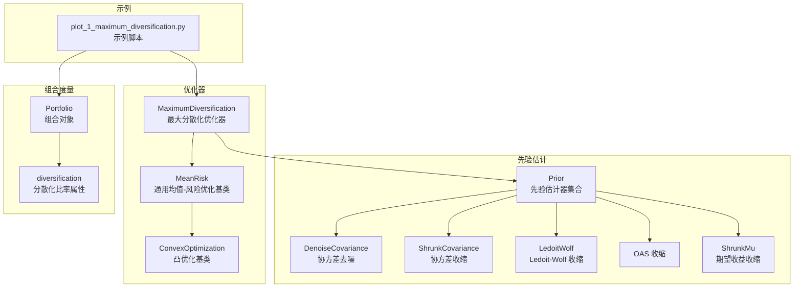
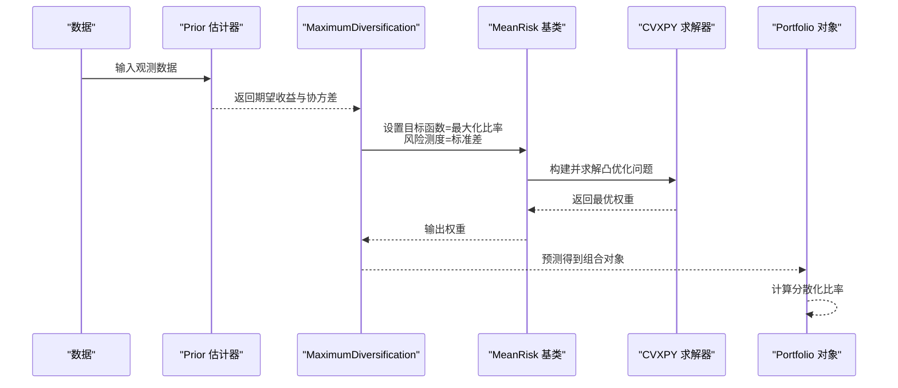
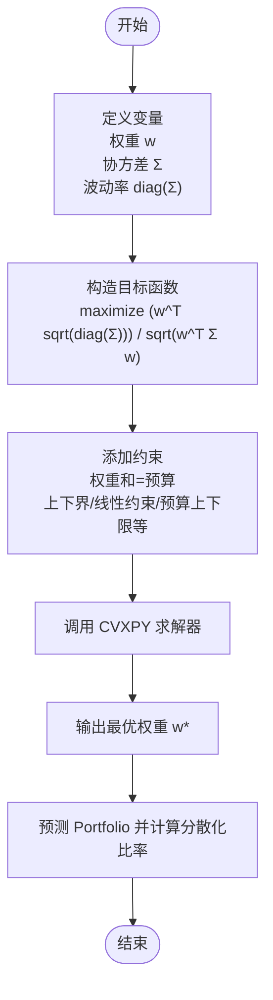
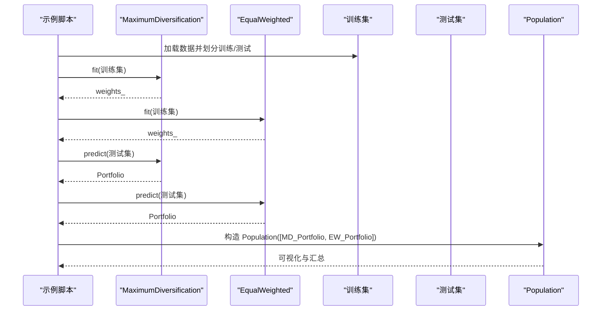
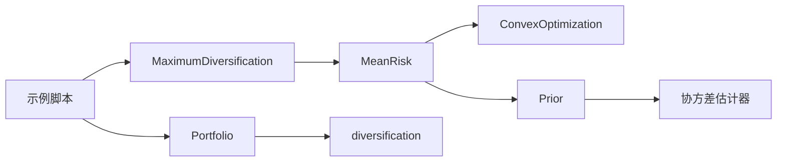

# 最大分散化优化

<cite>
**本文引用的文件**
- [src/skfolio/optimization/convex/_maximum_diversification.py](file://src/skfolio/optimization/convex/_maximum_diversification.py)
- [src/skfolio/optimization/convex/_mean_risk.py](file://src/skfolio/optimization/convex/_mean_risk.py)
- [src/skfolio/optimization/convex/_base.py](file://src/skfolio/optimization/convex/_base.py)
- [src/skfolio/optimization/convex/__init__.py](file://src/skfolio/optimization/convex/__init__.py)
- [src/skfolio/portfolio/_portfolio.py](file://src/skfolio/portfolio/_portfolio.py)
- [src/skfolio/prior/__init__.py](file://src/skfolio/prior/__init__.py)
- [src/skfolio/moments/covariance/_denoise_covariance.py](file://src/skfolio/moments/covariance/_denoise_covariance.py)
- [src/skfolio/moments/covariance/_shrunk_covariance.py](file://src/skfolio/moments/covariance/_shrunk_covariance.py)
- [src/skfolio/moments/covariance/_ledoit_wolf.py](file://src/skfolio/moments/covariance/_ledoit_wolf.py)
- [src/skfolio/moments/covariance/_oas.py](file://src/skfolio/moments/covariance/_oas.py)
- [src/skfolio/moments/expected_returns/_shrunk_mu.py](file://src/skfolio/moments/expected_returns/_shrunk_mu.py)
- [src/skfolio/optimization/naive/_naive.py](file://src/skfolio/optimization/naive/_naive.py)
- [examples/maximum_diversification/plot_1_maximum_diversification.py](file://examples/maximum_diversification/plot_1_maximum_diversification.py)
</cite>

## 目录
1. [简介](#简介)
2. [项目结构](#项目结构)
3. [核心组件](#核心组件)
4. [架构总览](#架构总览)
5. [详细组件分析](#详细组件分析)
6. [依赖关系分析](#依赖关系分析)
7. [性能考量](#性能考量)
8. [故障排查指南](#故障排查指南)
9. [结论](#结论)
10. [附录](#附录)

## 简介
本文件系统性阐述 MaximumDiversification 最大分散化优化器：其目标函数为最大化投资组合的分散化比率（Diversification Ratio），即“加权平均波动率”与“组合整体波动率”的比值。该策略倾向于选择低相关性、高波动但能提升整体分散化的资产，从而在给定风险下获得更高的分散化收益。本文将从数学模型、约束条件、求解流程、API 使用、参数说明、性能调优到实证应用进行全面解析，并结合示例展示其在真实数据上的表现，同时讨论协方差矩阵估计误差的敏感性与稳健估计方法（去噪、收缩）。

## 项目结构
围绕最大分散化优化的相关代码主要分布在以下模块：
- 优化器实现：convex 最大分散化优化器与通用 MeanRisk 基类
- 组合度量：Portfolio 类中的分散化比率计算
- 先验估计：Prior 模块用于估计期望收益与协方差
- 协方差稳健估计：去噪、收缩（Ledoit–Wolf、OAS、Shrunk）等
- 示例：maximum_diversification 示例脚本

图表来源
- [src/skfolio/optimization/convex/_maximum_diversification.py](file://src/skfolio/optimization/convex/_maximum_diversification.py#L1-L514)
- [src/skfolio/optimization/convex/_mean_risk.py](file://src/skfolio/optimization/convex/_mean_risk.py#L1-L200)
- [src/skfolio/optimization/convex/_base.py](file://src/skfolio/optimization/convex/_base.py#L2165-L2180)
- [src/skfolio/prior/__init__.py](file://src/skfolio/prior/__init__.py#L1-L27)
- [src/skfolio/moments/covariance/_denoise_covariance.py](file://src/skfolio/moments/covariance/_denoise_covariance.py#L1-L59)
- [src/skfolio/moments/covariance/_shrunk_covariance.py](file://src/skfolio/moments/covariance/_shrunk_covariance.py#L1-L87)
- [src/skfolio/moments/covariance/_ledoit_wolf.py](file://src/skfolio/moments/covariance/_ledoit_wolf.py#L70-L99)
- [src/skfolio/moments/covariance/_oas.py](file://src/skfolio/moments/covariance/_oas.py#L41-L76)
- [src/skfolio/moments/expected_returns/_shrunk_mu.py](file://src/skfolio/moments/expected_returns/_shrunk_mu.py#L52-L244)
- [src/skfolio/portfolio/_portfolio.py](file://src/skfolio/portfolio/_portfolio.py#L765-L771)
- [examples/maximum_diversification/plot_1_maximum_diversification.py](file://examples/maximum_diversification/plot_1_maximum_diversification.py#L1-L85)

章节来源
- [src/skfolio/optimization/convex/_maximum_diversification.py](file://src/skfolio/optimization/convex/_maximum_diversification.py#L1-L514)
- [src/skfolio/optimization/convex/_mean_risk.py](file://src/skfolio/optimization/convex/_mean_risk.py#L1-L200)
- [src/skfolio/portfolio/_portfolio.py](file://src/skfolio/portfolio/_portfolio.py#L765-L771)
- [examples/maximum_diversification/plot_1_maximum_diversification.py](file://examples/maximum_diversification/plot_1_maximum_diversification.py#L1-L85)

## 核心组件
- MaximumDiversification：继承自 MeanRisk，通过将目标函数设置为“最大化比率”，并将风险测度固定为“标准差”，实现最大化分散化比率的目标。其 fit 过程会重写预期收益项为“加权波动率”，从而将问题转化为一个凸优化问题。
- MeanRisk：通用均值-风险优化器，支持最小化风险、最大化收益、最大化效用、最大化比率四种目标函数；支持多种风险测度与约束；内部通过 CVXPY 构建并求解凸优化问题。
- Portfolio.diversification：提供“加权平均波动率 / 组合波动率”的分散化比率计算，便于评估不同策略的分散化程度。
- Prior 与协方差稳健估计：Prior 负责估计资产的期望收益与协方差矩阵；协方差稳健估计（去噪、收缩）可显著降低估计误差对优化结果的影响。

章节来源
- [src/skfolio/optimization/convex/_maximum_diversification.py](file://src/skfolio/optimization/convex/_maximum_diversification.py#L1-L514)
- [src/skfolio/optimization/convex/_mean_risk.py](file://src/skfolio/optimization/convex/_mean_risk.py#L34-L119)
- [src/skfolio/portfolio/_portfolio.py](file://src/skfolio/portfolio/_portfolio.py#L765-L771)
- [src/skfolio/prior/__init__.py](file://src/skfolio/prior/__init__.py#L1-L27)

## 架构总览
最大分散化优化的整体流程如下：
- 数据准备：输入日度/周期性价格或收益率数据
- 先验估计：由 Prior 估计期望收益与协方差矩阵
- 优化求解：MaximumDiversification 将目标函数设为“最大化比率”，风险测度为“标准差”，通过 MeanRisk 的通用框架构建并求解凸优化问题
- 结果评估：使用 Portfolio.diversification 计算分散化比率，对比等权重或其他基准策略

图表来源
- [src/skfolio/optimization/convex/_maximum_diversification.py](file://src/skfolio/optimization/convex/_maximum_diversification.py#L477-L514)
- [src/skfolio/optimization/convex/_mean_risk.py](file://src/skfolio/optimization/convex/_mean_risk.py#L1096-L1191)
- [src/skfolio/portfolio/_portfolio.py](file://src/skfolio/portfolio/_portfolio.py#L765-L771)

## 详细组件分析

### 数学模型与目标函数
- 分散化比率定义：加权平均波动率 / 组合整体波动率
  - 加权平均波动率：Σ_i w_i σ_i，其中 w_i 为资产权重，σ_i 为资产波动率
  - 组合整体波动率：√(w^T Σ w)，Σ 为资产协方差矩阵
- 目标函数：最大化上述比率
- 风险测度：标准差（RiskMeasure.STANDARD_DEVIATION）
- 目标函数类型：MAXIMIZE_RATIO（在 MeanRisk 中实现）

图表来源
- [src/skfolio/optimization/convex/_maximum_diversification.py](file://src/skfolio/optimization/convex/_maximum_diversification.py#L477-L514)
- [src/skfolio/optimization/convex/_mean_risk.py](file://src/skfolio/optimization/convex/_mean_risk.py#L34-L119)

章节来源
- [src/skfolio/optimization/convex/_maximum_diversification.py](file://src/skfolio/optimization/convex/_maximum_diversification.py#L20-L120)
- [src/skfolio/optimization/convex/_mean_risk.py](file://src/skfolio/optimization/convex/_mean_risk.py#L34-L119)

### 约束条件与求解过程
- 权重和约束：预算（budget）、最小/最大预算（min_budget/max_budget）
- 单资产权重上下界：min_weights/max_weights
- 组合层面限制：max_short（总空头）、max_long（总多头）
- 稀疏性与分组：cardinality、group_cardinalities、threshold_long/short
- 线性约束：linear_constraints 或 left_inequality/right_inequality
- 成本与费用：transaction_costs、management_fees
- 风险自由利率：risk_free_rate
- 跟踪误差与换手：max_tracking_error、max_turnover
- 求解器：默认 CLARABEL，可配置 solver_params、scale_objective/scale_constraints
- 失败回退：fallback 机制，失败时可回退到 previous_weights 或其他估计器

章节来源
- [src/skfolio/optimization/convex/_maximum_diversification.py](file://src/skfolio/optimization/convex/_maximum_diversification.py#L120-L356)
- [src/skfolio/optimization/convex/_mean_risk.py](file://src/skfolio/optimization/convex/_mean_risk.py#L1096-L1191)
- [src/skfolio/optimization/convex/_base.py](file://src/skfolio/optimization/convex/_base.py#L2165-L2180)

### API 使用指南与参数说明
- 初始化参数（来自 MeanRisk/ConvexOptimization）：
  - objective_function：目标函数类型（MAXIMIZE_RATIO）
  - risk_measure：风险测度（STANDARD_DEVIATION）
  - prior_estimator：先验估计器，默认 EmpiricalPrior
  - min_weights/max_weights：单资产权重上下界
  - budget/min_budget/max_budget：组合预算约束
  - max_short/max_long：组合层面多空上限
  - cardinality/group_cardinalities/threshold_long/threshold_short：稀疏性与分组约束
  - linear_constraints/left_inequality/right_inequality：线性约束
  - transaction_costs/management_fees：交易成本与管理费
  - risk_free_rate：无风险利率
  - max_tracking_error/max_turnover：跟踪误差与换手约束
  - solver/solver_params：求解器与参数
  - scale_objective/scale_constraints：目标与约束缩放
  - save_problem/portfolio_params/fallback/raise_on_failure：问题保存与回退策略
- fit(X, y=None)：拟合并返回自身
- predict(X)：基于拟合权重生成 Portfolio 对象
- 属性：weights_、problem_values_、prior_estimator_、problem_（当 save_problem=True）、fallback_、fallback_chain_、error_

章节来源
- [src/skfolio/optimization/convex/_maximum_diversification.py](file://src/skfolio/optimization/convex/_maximum_diversification.py#L399-L514)
- [src/skfolio/optimization/convex/_mean_risk.py](file://src/skfolio/optimization/convex/_mean_risk.py#L1-L200)

### 实证应用与对比分析
- 示例脚本展示了如何使用 MaximumDiversification 在 S&P 500 数据上进行训练与测试，并与 EqualWeighted 等权重策略进行对比
- 通过 Portfolio.diversification 可直接比较两者的分散化比率
- 可将预测结果封装为 Population，进一步可视化组合构成与累计收益

图表来源
- [examples/maximum_diversification/plot_1_maximum_diversification.py](file://examples/maximum_diversification/plot_1_maximum_diversification.py#L1-L85)
- [src/skfolio/optimization/naive/_naive.py](file://src/skfolio/optimization/naive/_naive.py#L161-L200)
- [src/skfolio/portfolio/_portfolio.py](file://src/skfolio/portfolio/_portfolio.py#L765-L771)

章节来源
- [examples/maximum_diversification/plot_1_maximum_diversification.py](file://examples/maximum_diversification/plot_1_maximum_diversification.py#L1-L85)
- [src/skfolio/optimization/naive/_naive.py](file://src/skfolio/optimization/naive/_naive.py#L161-L200)
- [src/skfolio/portfolio/_portfolio.py](file://src/skfolio/portfolio/_portfolio.py#L765-L771)

### 协方差矩阵估计误差敏感性与稳健估计
- 问题背景：协方差矩阵估计误差会导致权重不稳定，进而影响分散化比率与组合表现
- 推荐方法：
  - 去噪（DenoiseCovariance）：分离信号与噪声，保留有效谱，提高稳定性
  - 收缩估计（LedoitWolf、OAS、ShrunkCovariance）：将样本协方差向目标矩阵收缩，改善正定性与数值稳定性
  - 期望收益收缩（ShrunkMu）：对样本均值进行收缩，减少估计偏差
- 在 Prior 中使用稳健协方差估计器，可显著提升 MaximumDiversification 的稳健性与外样本稳定性

章节来源
- [src/skfolio/moments/covariance/_denoise_covariance.py](file://src/skfolio/moments/covariance/_denoise_covariance.py#L1-L59)
- [src/skfolio/moments/covariance/_shrunk_covariance.py](file://src/skfolio/moments/covariance/_shrunk_covariance.py#L1-L87)
- [src/skfolio/moments/covariance/_ledoit_wolf.py](file://src/skfolio/moments/covariance/_ledoit_wolf.py#L70-L99)
- [src/skfolio/moments/covariance/_oas.py](file://src/skfolio/moments/covariance/_oas.py#L41-L76)
- [src/skfolio/moments/expected_returns/_shrunk_mu.py](file://src/skfolio/moments/expected_returns/_shrunk_mu.py#L52-L244)

## 依赖关系分析
- MaximumDiversification 依赖于 MeanRisk（目标函数=比率最大化、风险测度=标准差）
- MeanRisk 依赖于 ConvexOptimization（凸优化框架）与 Prior（估计期望收益与协方差）
- Portfolio.diversification 依赖于资产波动率与组合波动率计算
- Prior 提供多种估计器（EmpiricalPrior、BlackLitterman、EntropyPooling、FactorModel 等），协方差稳健估计器作为其子模块

图表来源
- [src/skfolio/optimization/convex/_maximum_diversification.py](file://src/skfolio/optimization/convex/_maximum_diversification.py#L437-L476)
- [src/skfolio/optimization/convex/_mean_risk.py](file://src/skfolio/optimization/convex/_mean_risk.py#L1-L200)
- [src/skfolio/portfolio/_portfolio.py](file://src/skfolio/portfolio/_portfolio.py#L765-L771)
- [src/skfolio/prior/__init__.py](file://src/skfolio/prior/__init__.py#L1-L27)

章节来源
- [src/skfolio/optimization/convex/_maximum_diversification.py](file://src/skfolio/optimization/convex/_maximum_diversification.py#L437-L476)
- [src/skfolio/optimization/convex/_mean_risk.py](file://src/skfolio/optimization/convex/_mean_risk.py#L1-L200)
- [src/skfolio/portfolio/_portfolio.py](file://src/skfolio/portfolio/_portfolio.py#L765-L771)
- [src/skfolio/prior/__init__.py](file://src/skfolio/prior/__init__.py#L1-L27)

## 性能考量
- 求解器选择：默认 CLARABEL，具备更好的数值稳定性和性能；可根据需要调整 solver_params
- 缩放参数：scale_objective 与 scale_constraints 可在特定问题中提升精度
- 约束数量：过多的线性约束或混合整数约束（cardinality/group_cardinalities/threshold_*）会增加求解难度与时间
- 数据维度：资产数量较多时，协方差矩阵病态风险上升，建议采用稳健估计（去噪/收缩）
- 回退策略：合理配置 fallback，避免因求解失败导致流程中断

章节来源
- [src/skfolio/optimization/convex/_maximum_diversification.py](file://src/skfolio/optimization/convex/_maximum_diversification.py#L303-L356)
- [src/skfolio/optimization/convex/_mean_risk.py](file://src/skfolio/optimization/convex/_mean_risk.py#L1096-L1191)

## 故障排查指南
- 求解失败：启用 raise_on_failure=False，观察 error_ 与 fallback_chain_，必要时回退到 previous_weights
- 收敛性问题：尝试调整 solver_params（如增大容差、开启 verbose）、scale_objective/scale_constraints
- 约束冲突：检查 budget 与 min/max_budget 是否矛盾；min_weights 与 max_weights 是否互相限制过严
- 协方差非正定：优先使用去噪或收缩估计器；必要时启用 nearest/Higham 正定化
- 分散化比率异常：确认 prior_estimator 是否合理，以及是否正确设置了 risk_measure=STANDARD_DEVIATION

章节来源
- [src/skfolio/optimization/convex/_maximum_diversification.py](file://src/skfolio/optimization/convex/_maximum_diversification.py#L337-L356)
- [src/skfolio/optimization/convex/_mean_risk.py](file://src/skfolio/optimization/convex/_mean_risk.py#L1096-L1191)
- [src/skfolio/moments/covariance/_denoise_covariance.py](file://src/skfolio/moments/covariance/_denoise_covariance.py#L1-L59)
- [src/skfolio/moments/covariance/_shrunk_covariance.py](file://src/skfolio/moments/covariance/_shrunk_covariance.py#L1-L87)

## 结论
MaximumDiversification 通过最大化分散化比率，引导策略在低相关性与高波动资产之间取得平衡，从而提升组合的分散化收益。借助 MeanRisk 的通用框架与 Portfolio 的分散化比率度量，该优化器具备良好的可扩展性与可解释性。在实践中，应重视协方差矩阵估计误差带来的影响，优先采用去噪与收缩估计方法，并根据问题规模与约束复杂度选择合适的求解器与参数，以确保优化结果的稳健性与可复现性。

## 附录
- 相关导出：convex 模块导出 MaximumDiversification、MeanRisk、RiskBudgeting 等
- 基础类：ConvexOptimization 提供凸优化问题的统一构建与求解流程
- 先验估计：Prior 提供多种估计器，协方差稳健估计器位于 moments/covariance 子模块

章节来源
- [src/skfolio/optimization/convex/__init__.py](file://src/skfolio/optimization/convex/__init__.py#L1-L21)
- [src/skfolio/optimization/convex/_base.py](file://src/skfolio/optimization/convex/_base.py#L2165-L2180)
- [src/skfolio/prior/__init__.py](file://src/skfolio/prior/__init__.py#L1-L27)