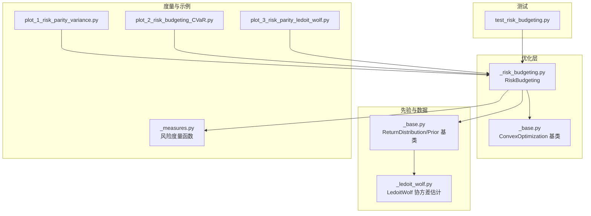
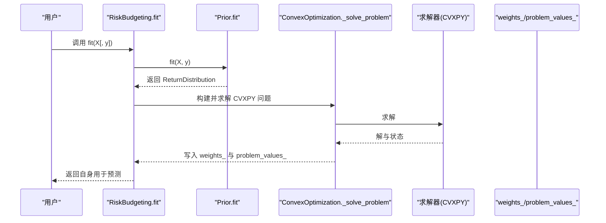
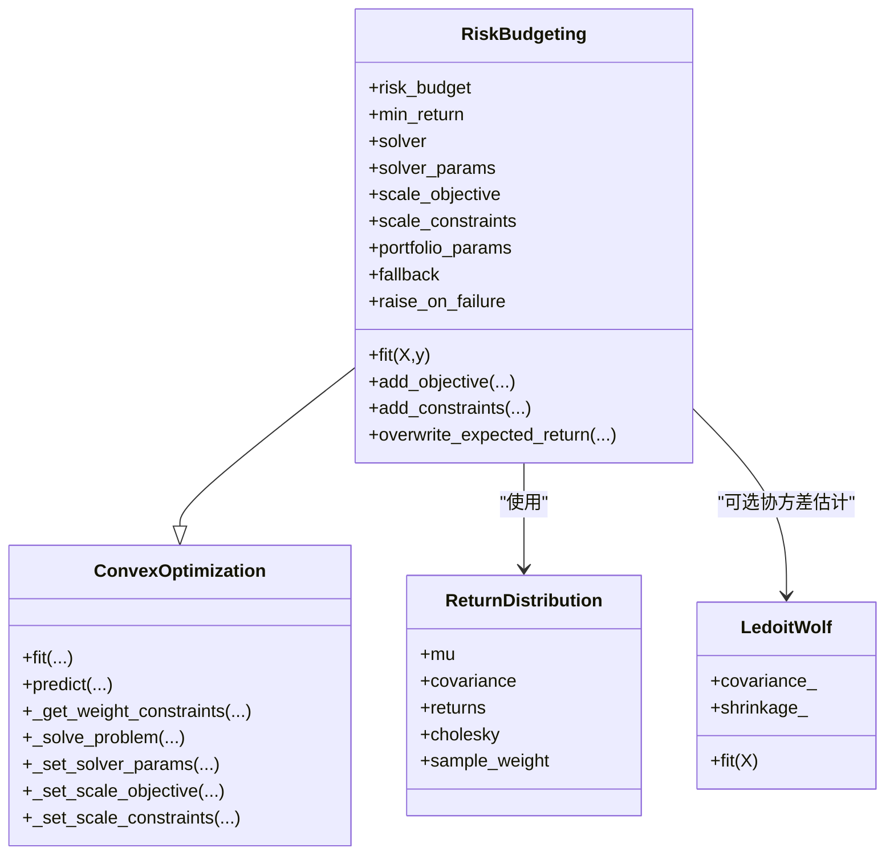
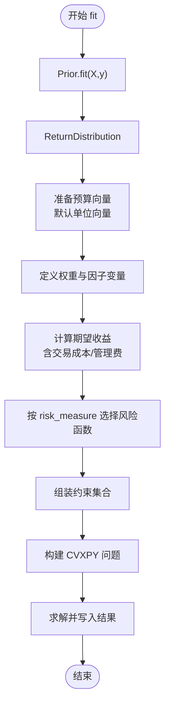
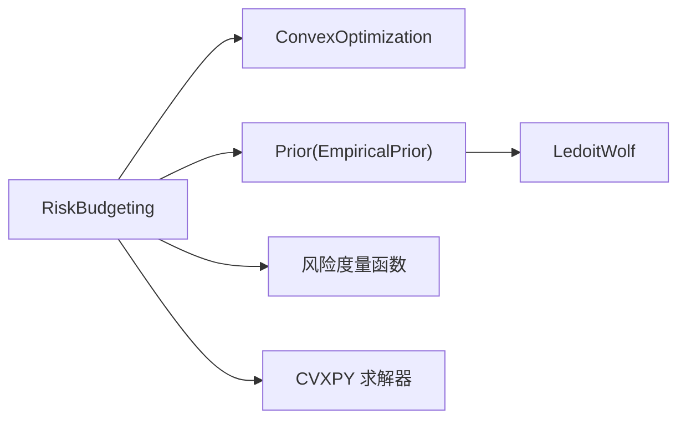

# 风险预算优化

<cite>
**本文引用的文件列表**
- [src/skfolio/optimization/convex/_risk_budgeting.py](file://src/skfolio/optimization/convex/_risk_budgeting.py)
- [src/skfolio/optimization/convex/_base.py](file://src/skfolio/optimization/convex/_base.py)
- [src/skfolio/prior/_base.py](file://src/skfolio/prior/_base.py)
- [src/skfolio/moments/covariance/_ledoit_wolf.py](file://src/skfolio/moments/covariance/_ledoit_wolf.py)
- [src/skfolio/measures/_measures.py](file://src/skfolio/measures/_measures.py)
- [examples/risk_budgeting/plot_1_risk_parity_variance.py](file://examples/risk_budgeting/plot_1_risk_parity_variance.py)
- [examples/risk_budgeting/plot_2_risk_budgeting_CVaR.py](file://examples/risk_budgeting/plot_2_risk_budgeting_CVaR.py)
- [examples/risk_budgeting/plot_3_risk_parity_ledoit_wolf.py](file://examples/risk_budgeting/plot_3_risk_parity_ledoit_wolf.py)
- [tests/test_optimization/test_convex/test_risk_budgeting.py](file://tests/test_optimization/test_convex/test_risk_budgeting.py)
- [docs/user_guide/optimization.rst](file://docs/user_guide/optimization.rst)
</cite>

## 目录
1. [引言](#引言)
2. [项目结构](#项目结构)
3. [核心组件](#核心组件)
4. [架构总览](#架构总览)
5. [详细组件分析](#详细组件分析)
6. [依赖关系分析](#依赖关系分析)
7. [性能考虑](#性能考虑)
8. [故障排查指南](#故障排查指南)
9. [结论](#结论)
10. [附录](#附录)

## 引言
本文件系统化阐述 skfolio 中 RiskBudgeting 风险预算优化器的设计与实现，重点覆盖以下方面：
- 核心思想：通过为每只资产设定“风险预算”（风险贡献目标），实现对组合整体风险的主动分配；当预算向量取单位向量时即退化为“风险平价”（Risk Parity）。
- 支持的风险度量：包括方差、半方差、标准差、半标准差、均值绝对偏差、首下偏矩、CVaR、EVaR、最坏情景、CDaR、最大回撤、平均回撤、EDaR、溃疡指数、Gini 平均差等。
- 优化建模：以凸优化形式构建非线性目标函数与约束集，依赖先验估计（如期望收益、协方差矩阵）；在部分风险度量下引入参数（如 CVaR 置信水平）。
- 输入先验敏感性：协方差估计（如 Ledoit–Wolf 收敛收缩）对权重稳定性与外样本表现的影响；通过示例展示最佳实践。
- 配置与使用：风险预算向量的多种输入方式、求解收敛性诊断、常见失败场景与应对策略、API 参数说明与性能优化建议。

## 项目结构
RiskBudgeting 位于凸优化模块中，作为 ConvexOptimization 的子类，复用统一的优化框架与先验估计接口；示例与测试分别覆盖风险平价与自定义预算、不同风险度量与先验估计。

图表来源
- [src/skfolio/optimization/convex/_risk_budgeting.py](file://src/skfolio/optimization/convex/_risk_budgeting.py#L1-L120)
- [src/skfolio/optimization/convex/_base.py](file://src/skfolio/optimization/convex/_base.py#L1-L120)
- [src/skfolio/prior/_base.py](file://src/skfolio/prior/_base.py#L1-L70)
- [src/skfolio/moments/covariance/_ledoit_wolf.py](file://src/skfolio/moments/covariance/_ledoit_wolf.py#L1-L141)
- [src/skfolio/measures/_measures.py](file://src/skfolio/measures/_measures.py#L1-L120)
- [examples/risk_budgeting/plot_1_risk_parity_variance.py](file://examples/risk_budgeting/plot_1_risk_parity_variance.py#L1-L93)
- [examples/risk_budgeting/plot_2_risk_budgeting_CVaR.py](file://examples/risk_budgeting/plot_2_risk_budgeting_CVaR.py#L1-L104)
- [examples/risk_budgeting/plot_3_risk_parity_ledoit_wolf.py](file://examples/risk_budgeting/plot_3_risk_parity_ledoit_wolf.py#L1-L81)
- [tests/test_optimization/test_convex/test_risk_budgeting.py](file://tests/test_optimization/test_convex/test_risk_budgeting.py#L1-L232)

章节来源
- [src/skfolio/optimization/convex/_risk_budgeting.py](file://src/skfolio/optimization/convex/_risk_budgeting.py#L1-L120)
- [src/skfolio/optimization/convex/_base.py](file://src/skfolio/optimization/convex/_base.py#L1-L120)
- [src/skfolio/prior/_base.py](file://src/skfolio/prior/_base.py#L1-L70)
- [src/skfolio/moments/covariance/_ledoit_wolf.py](file://src/skfolio/moments/covariance/_ledoit_wolf.py#L1-L141)
- [src/skfolio/measures/_measures.py](file://src/skfolio/measures/_measures.py#L1-L120)
- [examples/risk_budgeting/plot_1_risk_parity_variance.py](file://examples/risk_budgeting/plot_1_risk_parity_variance.py#L1-L93)
- [examples/risk_budgeting/plot_2_risk_budgeting_CVaR.py](file://examples/risk_budgeting/plot_2_risk_budgeting_CVaR.py#L1-L104)
- [examples/risk_budgeting/plot_3_risk_parity_ledoit_wolf.py](file://examples/risk_budgeting/plot_3_risk_parity_ledoit_wolf.py#L1-L81)
- [tests/test_optimization/test_convex/test_risk_budgeting.py](file://tests/test_optimization/test_convex/test_risk_budgeting.py#L1-L232)

## 核心组件
- RiskBudgeting：面向“按资产分配风险”的凸优化器，最小化所选风险度量，受预算约束与权重约束，可叠加交易成本、管理费、预期收益下限、线性约束、自定义目标/约束等。
- ConvexOptimization：凸优化基类，统一处理先验估计、权重约束、求解器选择与缩放、表达式缓存、回退机制等。
- ReturnDistribution：先验估计输出的数据结构，包含期望收益、协方差、观测收益与可选 Cholesky 因子。
- LedoitWolf：协方差收缩估计器，提升高维/低样本条件数，改善数值稳定性。
- 风险度量：提供多种风险测度的实现入口，供 RiskBudgeting 在优化中调用。

章节来源
- [src/skfolio/optimization/convex/_risk_budgeting.py](file://src/skfolio/optimization/convex/_risk_budgeting.py#L24-L120)
- [src/skfolio/optimization/convex/_base.py](file://src/skfolio/optimization/convex/_base.py#L64-L120)
- [src/skfolio/prior/_base.py](file://src/skfolio/prior/_base.py#L15-L70)
- [src/skfolio/moments/covariance/_ledoit_wolf.py](file://src/skfolio/moments/covariance/_ledoit_wolf.py#L16-L141)
- [src/skfolio/measures/_measures.py](file://src/skfolio/measures/_measures.py#L596-L740)

## 架构总览
RiskBudgeting 的工作流从“先验估计”开始，生成 ReturnDistribution，随后在 ConvexOptimization 基类中构建 CVXPY 优化问题，最后由指定求解器求解并返回权重与中间表达式值。

图表来源
- [src/skfolio/optimization/convex/_risk_budgeting.py](file://src/skfolio/optimization/convex/_risk_budgeting.py#L481-L616)
- [src/skfolio/optimization/convex/_base.py](file://src/skfolio/optimization/convex/_base.py#L660-L800)
- [src/skfolio/prior/_base.py](file://src/skfolio/prior/_base.py#L51-L70)

章节来源
- [src/skfolio/optimization/convex/_risk_budgeting.py](file://src/skfolio/optimization/convex/_risk_budgeting.py#L481-L616)
- [src/skfolio/optimization/convex/_base.py](file://src/skfolio/optimization/convex/_base.py#L660-L800)
- [src/skfolio/prior/_base.py](file://src/skfolio/prior/_base.py#L51-L70)

## 详细组件分析

### RiskBudgeting 类设计与优化问题
- 优化目标：最小化选定的风险度量（如方差、CVaR、EVaR 等）。
- 预算约束：对数预算约束，确保各资产对总风险的边际贡献与其预算成比例；默认预算为单位向量即风险平价。
- 权重约束：默认长多不卖空；可设置上下界、最大多头/空头规模、组约束、线性约束等。
- 收益约束：可设置最低预期收益下限。
- 成本与费用：可叠加线性交易成本与管理费，影响期望收益项。
- 先验估计：通过 Prior（默认 EmpiricalPrior）估计期望收益、协方差与观测收益；协方差可使用 Ledoit–Wolf 收敛收缩以提升稳定性。
- 求解与回退：内置回退链与错误捕获，支持失败后回退到先前权重或抛出异常。

图表来源
- [src/skfolio/optimization/convex/_risk_budgeting.py](file://src/skfolio/optimization/convex/_risk_budgeting.py#L24-L120)
- [src/skfolio/optimization/convex/_base.py](file://src/skfolio/optimization/convex/_base.py#L64-L120)
- [src/skfolio/prior/_base.py](file://src/skfolio/prior/_base.py#L15-L70)
- [src/skfolio/moments/covariance/_ledoit_wolf.py](file://src/skfolio/moments/covariance/_ledoit_wolf.py#L16-L141)

章节来源
- [src/skfolio/optimization/convex/_risk_budgeting.py](file://src/skfolio/optimization/convex/_risk_budgeting.py#L24-L120)
- [src/skfolio/optimization/convex/_base.py](file://src/skfolio/optimization/convex/_base.py#L64-L120)
- [src/skfolio/prior/_base.py](file://src/skfolio/prior/_base.py#L15-L70)
- [src/skfolio/moments/covariance/_ledoit_wolf.py](file://src/skfolio/moments/covariance/_ledoit_wolf.py#L16-L141)

### 优化问题构建流程（fit）
- 先验估计：调用 Prior.fit 获取 ReturnDistribution，包含期望收益、协方差与观测收益。
- 预算准备：若未显式提供预算，则默认单位向量（风险平价）；对零预算元素进行极小正数替换以避免对数奇点。
- 变量与表达式：定义权重变量与因子变量；计算期望收益（含交易成本与管理费修正）。
- 风险度量：根据 risk_measure 动态选择对应风险函数，传入 ReturnDistribution、权重与必要参数（如 CVaR 置信水平）。
- 约束集合：预算约束、权重上下界、最大多头/空头、线性约束、预期收益下限等。
- 求解：构造 CVXPY 问题并调用基类求解流程，保存结果与表达式值。

图表来源
- [src/skfolio/optimization/convex/_risk_budgeting.py](file://src/skfolio/optimization/convex/_risk_budgeting.py#L527-L616)
- [src/skfolio/optimization/convex/_base.py](file://src/skfolio/optimization/convex/_base.py#L660-L800)

章节来源
- [src/skfolio/optimization/convex/_risk_budgeting.py](file://src/skfolio/optimization/convex/_risk_budgeting.py#L527-L616)
- [src/skfolio/optimization/convex/_base.py](file://src/skfolio/optimization/convex/_base.py#L660-L800)

### 风险预算向量配置方法
- 数组/列表：直接提供长度为资产数的数值序列。
- 字典：键为资产名称，值为该资产的风险预算；要求输入 X 为带列名的 DataFrame。
- 默认行为：未提供时采用单位向量，即风险平价（每个资产对总风险的边际贡献相等）。

章节来源
- [src/skfolio/optimization/convex/_risk_budgeting.py](file://src/skfolio/optimization/convex/_risk_budgeting.py#L92-L100)
- [tests/test_optimization/test_convex/test_risk_budgeting.py](file://tests/test_optimization/test_convex/test_risk_budgeting.py#L183-L215)

### 风险度量与先验估计
- 风险度量：支持方差、半方差、标准差、半标准差、均值绝对偏差、首下偏矩、CVaR、EVaR、最坏情景、CDaR、最大回撤、平均回撤、EDaR、溃疡指数、Gini 平均差等。
- 先验估计：默认 EmpiricalPrior，可替换为包含 Ledoit–Wolf 收敛收缩的协方差估计器，以提升协方差估计稳定性与外样本表现。

章节来源
- [src/skfolio/optimization/convex/_risk_budgeting.py](file://src/skfolio/optimization/convex/_risk_budgeting.py#L44-L90)
- [src/skfolio/moments/covariance/_ledoit_wolf.py](file://src/skfolio/moments/covariance/_ledoit_wolf.py#L16-L141)
- [src/skfolio/measures/_measures.py](file://src/skfolio/measures/_measures.py#L596-L740)

### 示例与最佳实践
- 风险平价（方差）：展示风险平价权重与风险贡献分析，对比逆波动率基准。
- 自定义预算（CVaR）：为特定资产设置更高/更低预算，观察风险贡献差异。
- Ledoit–Wolf 收敛收缩：在风险平价中使用收缩协方差估计，比较基础模型与收缩模型的外样本表现。

章节来源
- [examples/risk_budgeting/plot_1_risk_parity_variance.py](file://examples/risk_budgeting/plot_1_risk_parity_variance.py#L1-L93)
- [examples/risk_budgeting/plot_2_risk_budgeting_CVaR.py](file://examples/risk_budgeting/plot_2_risk_budgeting_CVaR.py#L1-L104)
- [examples/risk_budgeting/plot_3_risk_parity_ledoit_wolf.py](file://examples/risk_budgeting/plot_3_risk_parity_ledoit_wolf.py#L1-L81)

## 依赖关系分析
- 组件耦合：RiskBudgeting 依赖 ConvexOptimization 提供的统一优化框架；依赖 Prior 输出 ReturnDistribution；可选依赖 LedoitWolf 进行协方差估计。
- 外部依赖：CVXPY 用于构建与求解凸优化问题；求解器默认 CLARABEL，具备更好的数值稳定性和性能。
- 风险度量依赖：不同风险度量在 ConvexOptimization 中以命名约定动态查找并调用对应实现。

图表来源
- [src/skfolio/optimization/convex/_risk_budgeting.py](file://src/skfolio/optimization/convex/_risk_budgeting.py#L24-L120)
- [src/skfolio/optimization/convex/_base.py](file://src/skfolio/optimization/convex/_base.py#L64-L120)
- [src/skfolio/prior/_base.py](file://src/skfolio/prior/_base.py#L51-L70)
- [src/skfolio/moments/covariance/_ledoit_wolf.py](file://src/skfolio/moments/covariance/_ledoit_wolf.py#L16-L141)
- [src/skfolio/measures/_measures.py](file://src/skfolio/measures/_measures.py#L596-L740)

章节来源
- [src/skfolio/optimization/convex/_risk_budgeting.py](file://src/skfolio/optimization/convex/_risk_budgeting.py#L24-L120)
- [src/skfolio/optimization/convex/_base.py](file://src/skfolio/optimization/convex/_base.py#L64-L120)
- [src/skfolio/prior/_base.py](file://src/skfolio/prior/_base.py#L51-L70)
- [src/skfolio/moments/covariance/_ledoit_wolf.py](file://src/skfolio/moments/covariance/_ledoit_wolf.py#L16-L141)
- [src/skfolio/measures/_measures.py](file://src/skfolio/measures/_measures.py#L596-L740)

## 性能考虑
- 求解器选择：默认使用 CLARABEL，具备更佳数值稳定性与性能；可通过 solver 与 solver_params 调整。
- 缩放策略：通过 scale_objective 与 scale_constraints 对目标与约束进行缩放，有助于提升数值精度与收敛速度。
- 表达式缓存：ConvexOptimization 使用 _cvx_cache 缓存共享 CVX 表达式，减少重复构建，提高性能与稳定性。
- 协方差估计：在高维/低样本场景下使用 Ledoit–Wolf 收敛收缩，显著改善协方差估计质量与优化稳定性。

章节来源
- [src/skfolio/optimization/convex/_base.py](file://src/skfolio/optimization/convex/_base.py#L408-L431)
- [src/skfolio/optimization/convex/_risk_budgeting.py](file://src/skfolio/optimization/convex/_risk_budgeting.py#L517-L538)
- [src/skfolio/moments/covariance/_ledoit_wolf.py](file://src/skfolio/moments/covariance/_ledoit_wolf.py#L16-L141)

## 故障排查指南
- 非凸约束：当允许负权重时，min_weights 可能为负，导致问题非凸；需确保 min_weights ≥ 0。
- 收敛与数值问题：优先检查协方差估计是否正定；尝试使用 Ledoit–Wolf 收敛收缩；调整 solver 与缩放参数；必要时放宽预算约束或降低风险度量复杂度。
- 回退机制：可通过 fallback 指定备用估计器或使用 previous_weights 回退；失败时可选择 raise_on_failure 控制异常抛出或警告提示。
- 测试验证：通过单元测试验证风险贡献一致性、预算约束满足度、预期收益约束与交易/管理费用影响。

章节来源
- [tests/test_optimization/test_convex/test_risk_budgeting.py](file://tests/test_optimization/test_convex/test_risk_budgeting.py#L218-L232)
- [src/skfolio/optimization/convex/_base.py](file://src/skfolio/optimization/convex/_base.py#L764-L800)
- [src/skfolio/optimization/convex/_risk_budgeting.py](file://src/skfolio/optimization/convex/_risk_budgeting.py#L563-L596)

## 结论
RiskBudgeting 将“按资产分配风险”的理念以凸优化形式落地，通过灵活的预算约束与丰富的风险度量支持，实现了从风险平价到自定义预算的广泛适用场景。结合稳健的先验估计（尤其是 Ledoit–Wolf 收敛收缩）与完善的求解与回退机制，可在实际应用中获得更稳定、可解释且可扩展的权重配置方案。

## 附录

### API 参数说明（节选）
- risk_measure：选定的风险度量，默认方差。
- risk_budget：每只资产的风险预算，未提供时默认单位向量（风险平价）。
- prior_estimator：先验估计器，默认 EmpiricalPrior，可嵌入 Ledoit–Wolf 协方差估计。
- min_weights/max_weights：权重上下界，长多不卖空为默认。
- min_return：最低预期收益约束。
- transaction_costs/management_fees：线性交易成本与管理费，影响期望收益。
- groups/linear_constraints/left_inequality/right_inequality：分组与线性约束。
- cvar_beta/evar_beta/cdar_beta/edar_beta：对应风险度量的置信水平参数。
- solver/solver_params：求解器与参数，默认 CLARABEL。
- scale_objective/scale_constraints：目标与约束缩放。
- add_objective/add_constraints/overwrite_expected_return：自定义目标/约束与期望收益覆盖。
- portfolio_params/fallback/raise_on_failure：预测参数与回退策略。

章节来源
- [src/skfolio/optimization/convex/_risk_budgeting.py](file://src/skfolio/optimization/convex/_risk_budgeting.py#L69-L360)
- [docs/user_guide/optimization.rst](file://docs/user_guide/optimization.rst#L354-L408)