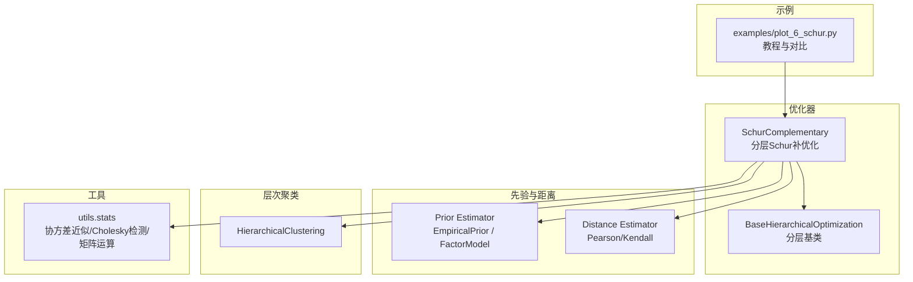
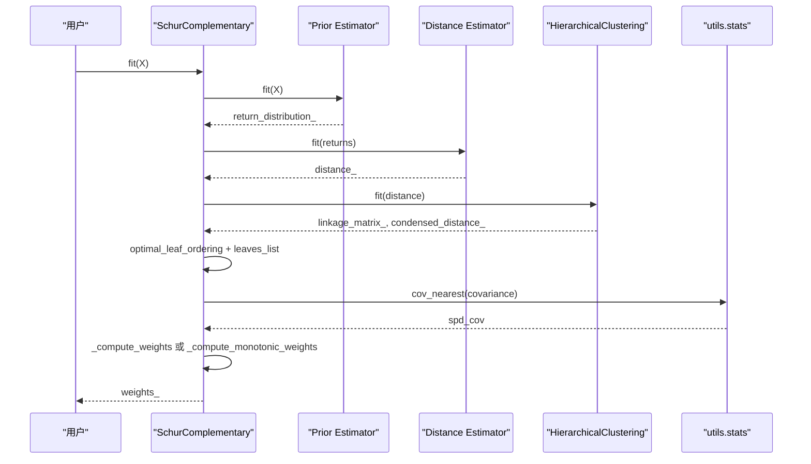
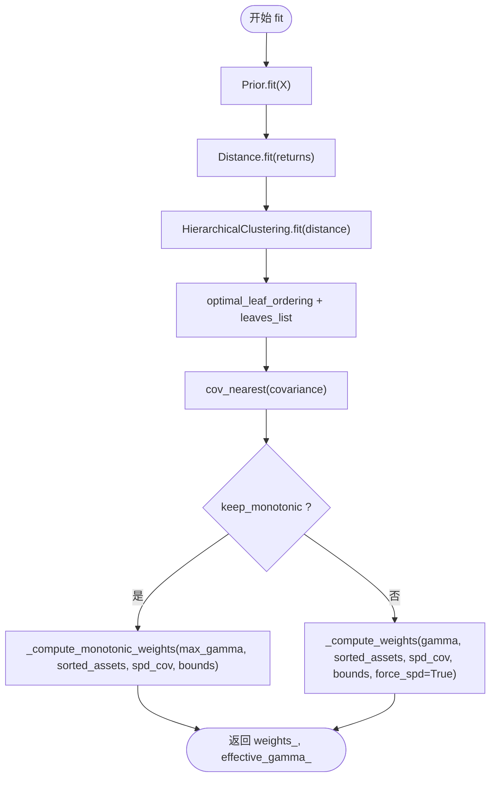
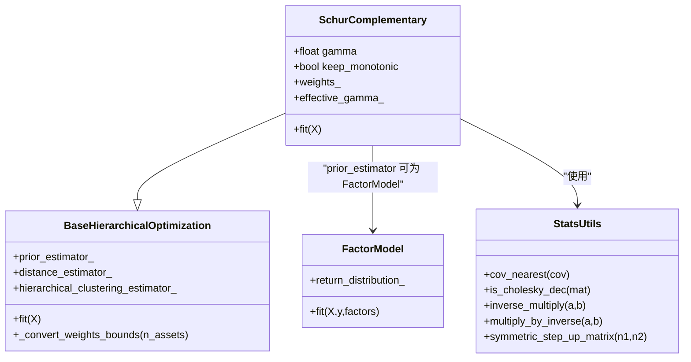
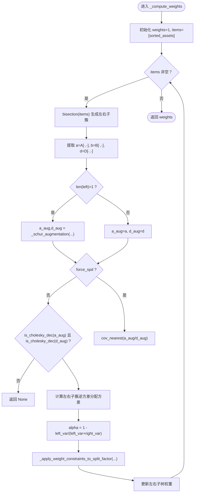
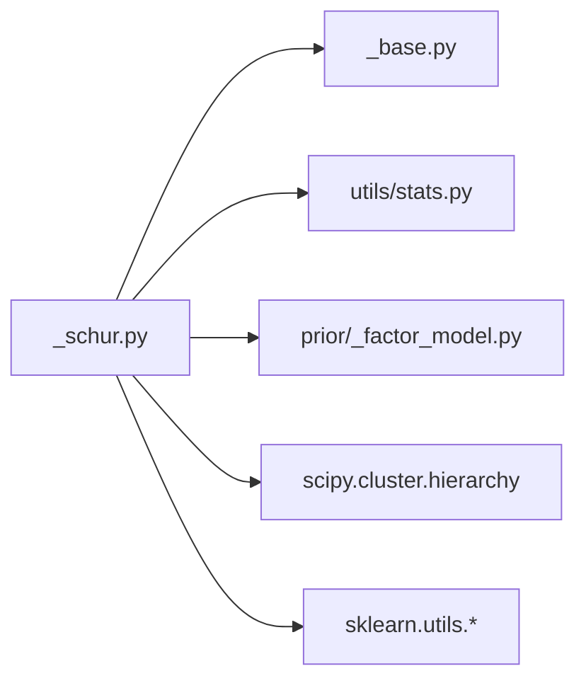

# Schur补优化

<cite>
**本文引用的文件**
- [src/skfolio/optimization/cluster/hierarchical/_schur.py](file://src/skfolio/optimization/cluster/hierarchical/_schur.py)
- [src/skfolio/optimization/cluster/hierarchical/_base.py](file://src/skfolio/optimization/cluster/hierarchical/_base.py)
- [src/skfolio/utils/stats.py](file://src/skfolio/utils/stats.py)
- [src/skfolio/prior/_factor_model.py](file://src/skfolio/prior/_factor_model.py)
- [examples/clustering/plot_6_schur.py](file://examples/clustering/plot_6_schur.py)
- [tests/test_optimization/test_cluster/test_hierarchical/test_schur.py](file://tests/test_optimization/test_cluster/test_hierarchical/test_schur.py)
</cite>

## 目录
1. [引言](#引言)
2. [项目结构](#项目结构)
3. [核心组件](#核心组件)
4. [架构总览](#架构总览)
5. [详细组件分析](#详细组件分析)
6. [依赖分析](#依赖分析)
7. [性能考量](#性能考量)
8. [故障排查指南](#故障排查指南)
9. [结论](#结论)
10. [附录](#附录)

## 引言
本文件系统化梳理了基于Schur补的分层投资组合优化器（SchurComplementary）的数学原理、实现细节与应用实践。该优化器通过“分而治之”的分层树形结构，结合Schur补启发式的子协方差矩阵增强，将高维资产协方差优化问题转化为低维因子空间中的递归分配过程，从而在保持数值稳定的同时显著提升计算效率。文档重点覆盖：
- 数学原理：Schur补增强、分层递归分配、单调性保障与有效伽马（effective gamma）
- 输入要求：先验估计器（Prior）、距离度量（Distance）、层次聚类（HierarchicalClustering）、权重约束等
- 输出结果：资产权重、有效伽马、回退链路与错误信息
- 应用场景：因子模型分解（系统性因子与特异性噪声）下的高效稳健优化
- 示例对比：与全协方差矩阵优化（如最小方差）在计算速度与组合表现上的差异

## 项目结构
SchurComplementary位于分层优化模块中，依赖Prior（先验估计）、Distance（距离度量）、HierarchicalClustering（层次聚类）以及若干统计工具函数。示例脚本展示了如何在多因子模型下进行参数搜索与回测评估。

图示来源
- [src/skfolio/optimization/cluster/hierarchical/_schur.py](file://src/skfolio/optimization/cluster/hierarchical/_schur.py#L47-L120)
- [src/skfolio/optimization/cluster/hierarchical/_base.py](file://src/skfolio/optimization/cluster/hierarchical/_base.py#L29-L120)
- [src/skfolio/utils/stats.py](file://src/skfolio/utils/stats.py#L322-L414)
- [examples/clustering/plot_6_schur.py](file://examples/clustering/plot_6_schur.py#L1-L60)

章节来源
- [src/skfolio/optimization/cluster/hierarchical/_schur.py](file://src/skfolio/optimization/cluster/hierarchical/_schur.py#L47-L120)
- [src/skfolio/optimization/cluster/hierarchical/_base.py](file://src/skfolio/optimization/cluster/hierarchical/_base.py#L29-L120)
- [examples/clustering/plot_6_schur.py](file://examples/clustering/plot_6_schur.py#L1-L60)

## 核心组件
- SchurComplementary：分层Schur补优化器，支持单调性保障（keep_monotonic）、权重约束、回退策略与错误追踪
- BaseHierarchicalOptimization：分层优化基类，统一处理Prior、Distance、HierarchicalClustering的路由与权重边界转换
- utils.stats：提供协方差最近正定矩阵（cov_nearest）、Cholesky分解检测（is_cholesky_dec）、矩阵乘逆（inverse_multiply/multiply_by_inverse）、对称步升矩阵（symmetric_step_up_matrix）等关键算子
- FactorModel：因子模型先验估计器，将资产收益分解为系统性因子与特异性残差，得到低秩协方差结构

章节来源
- [src/skfolio/optimization/cluster/hierarchical/_schur.py](file://src/skfolio/optimization/cluster/hierarchical/_schur.py#L47-L120)
- [src/skfolio/optimization/cluster/hierarchical/_base.py](file://src/skfolio/optimization/cluster/hierarchical/_base.py#L29-L120)
- [src/skfolio/utils/stats.py](file://src/skfolio/utils/stats.py#L322-L414)
- [src/skfolio/prior/_factor_model.py](file://src/skfolio/prior/_factor_model.py#L148-L210)

## 架构总览
SchurComplementary的完整工作流包括：先验估计（返回均值、协方差、样本权重）、距离度量（基于返回序列）、层次聚类（构建树形结构）、最优叶序重排（Seriation）、递归二分分裂（bisection）与Schur补增强（Augmentation），最终得到资产权重向量。

图示来源
- [src/skfolio/optimization/cluster/hierarchical/_schur.py](file://src/skfolio/optimization/cluster/hierarchical/_schur.py#L340-L430)
- [src/skfolio/utils/stats.py](file://src/skfolio/utils/stats.py#L322-L414)

## 详细组件分析

### SchurComplementary 类与流程
- 参数与属性
  - gamma ∈ [0,1]：控制Schur补增强强度；γ=0对应HRP，γ→1趋近MVP
  - keep_monotonic：启用单调性保障，自动确定有效伽马（effective_gamma_），保证方差随γ单调下降且不超过HRP方差
  - prior_estimator/distance_estimator/hierarchical_clustering_estimator：可插拔的先验、距离与聚类组件
  - 权重约束：min_weights/max_weights，交易成本/管理费/上期权重，回退策略与错误追踪
- 核心流程
  - 先验估计返回分布（含协方差与返回序列）
  - 距离估计与层次聚类
  - 最优叶序重排，得到有序资产索引
  - 协方差正定化（cov_nearest）
  - 递归二分分裂与Schur补增强，计算子簇逆方差权重，按比例分配至左右子树
  - 可选单调性搜索，确定有效伽马
- 关键内部函数
  - _compute_weights：递归Schur补增强与权重分配
  - _compute_monotonic_weights：单调性搜索，二分查找方差拐点
  - _binary_search：二分搜索找到使方差不再显著下降的γ
  - _schur_augmentation：Schur补启发式增强子块协方差
  - _naive_portfolio_variance：逆方差分配的子簇方差

图示来源
- [src/skfolio/optimization/cluster/hierarchical/_schur.py](file://src/skfolio/optimization/cluster/hierarchical/_schur.py#L340-L430)
- [src/skfolio/optimization/cluster/hierarchical/_schur.py](file://src/skfolio/optimization/cluster/hierarchical/_schur.py#L434-L636)
- [src/skfolio/optimization/cluster/hierarchical/_schur.py](file://src/skfolio/optimization/cluster/hierarchical/_schur.py#L638-L803)

章节来源
- [src/skfolio/optimization/cluster/hierarchical/_schur.py](file://src/skfolio/optimization/cluster/hierarchical/_schur.py#L47-L120)
- [src/skfolio/optimization/cluster/hierarchical/_schur.py](file://src/skfolio/optimization/cluster/hierarchical/_schur.py#L340-L430)
- [src/skfolio/optimization/cluster/hierarchical/_schur.py](file://src/skfolio/optimization/cluster/hierarchical/_schur.py#L434-L636)
- [src/skfolio/optimization/cluster/hierarchical/_schur.py](file://src/skfolio/optimization/cluster/hierarchical/_schur.py#L638-L803)

### Schur补增强与数学原理
- Schur补增强动机
  - 将子协方差矩阵按块写成 A B; B^T D 的形式，通过引入 γ 项将跨块信息纳入子簇协方差估计，从而在不直接求解全协方差逆的情况下，获得更接近MVP的分配倾向
- 增强公式要点
  - 当 γ>0 且子块维度>1时，对 A 块进行增强：A_aug = A − γ·B·D^{-1}·B^T，并通过中间矩阵与求解器保持数值稳定
  - 对称化处理确保增强后的协方差矩阵对称
- 递归分配
  - 子簇内采用逆方差分配（naive inverse-variance）计算子簇方差，按左右子簇方差比分配权重
  - 通过权重约束函数（_apply_weight_constraints_to_split_factor）确保满足全局权重上下界

图示来源
- [src/skfolio/optimization/cluster/hierarchical/_schur.py](file://src/skfolio/optimization/cluster/hierarchical/_schur.py#L47-L120)
- [src/skfolio/optimization/cluster/hierarchical/_base.py](file://src/skfolio/optimization/cluster/hierarchical/_base.py#L29-L120)
- [src/skfolio/prior/_factor_model.py](file://src/skfolio/prior/_factor_model.py#L148-L210)
- [src/skfolio/utils/stats.py](file://src/skfolio/utils/stats.py#L322-L414)

章节来源
- [src/skfolio/optimization/cluster/hierarchical/_schur.py](file://src/skfolio/optimization/cluster/hierarchical/_schur.py#L638-L803)
- [src/skfolio/utils/stats.py](file://src/skfolio/utils/stats.py#L726-L803)

### 分层递归与Schur补增强算法
- 递归二分分裂
  - 从根节点（全部资产）开始，每次将当前簇分为左右两个子簇
  - 计算左右子簇的增强协方差 A_aug/D_aug，并据此计算子簇逆方差分配的方差
  - 按比例 α 分配权重到左右子树
- 单调性保障
  - 若启用 keep_monotonic，则在 [0, γ] 区间内搜索方差拐点，返回使方差不再显著下降的最大可行 γ（effective_gamma_）
  - 未找到拐点时，返回终端 γ 或抛出异常（当无法找到允许的单调下降区间）

图示来源
- [src/skfolio/optimization/cluster/hierarchical/_schur.py](file://src/skfolio/optimization/cluster/hierarchical/_schur.py#L638-L734)

章节来源
- [src/skfolio/optimization/cluster/hierarchical/_schur.py](file://src/skfolio/optimization/cluster/hierarchical/_schur.py#L638-L734)

### 因子模型下的应用：系统性因子与特异性噪声
- 因子模型先验
  - 将资产收益分解为系统性因子线性组合与残差项，得到低秩协方差结构 Σ = ΛΣ_FΛ^T + Ψ（Ψ为残差对角）
  - 返回序列与协方差经由因子先验估计器（如EmpiricalPrior）与加载矩阵估计器（如LoadingMatrixRegression）共同给出
- Schur补优化的优势
  - 在因子协方差低秩结构下，Schur补增强能更稳健地在子簇间传递系统性信息，减少噪声放大
  - 通过单调性保障与协方差正定化，避免MVP趋近过程中的数值不稳定

章节来源
- [src/skfolio/prior/_factor_model.py](file://src/skfolio/prior/_factor_model.py#L148-L210)
- [src/skfolio/prior/_factor_model.py](file://src/skfolio/prior/_factor_model.py#L242-L347)
- [tests/test_optimization/test_cluster/test_hierarchical/test_schur.py](file://tests/test_optimization/test_cluster/test_hierarchical/test_schur.py#L130-L160)

### 示例：多因子模型下的权重求解与对比
- 示例脚本概览
  - 加载S&P500数据，选择部分资产，训练集与测试集按时间顺序划分
  - 使用Ledoit-Wolf收缩估计器正则化协方差
  - 训练多个不同 γ 的Schur模型，绘制训练/测试均值-标准差前沿与组合构成
  - 使用随机搜索与WalkForward进行超参数（γ 与距离度量）调优，并比较Schur与MVP（最小方差）在回测中的表现
- 计算速度与组合表现
  - Schur补优化通过分层递归与Schur补增强，避免直接求解全协方差逆，显著降低计算复杂度
  - 在因子模型下，Schur补增强能更好地利用系统性因子信息，提高组合的稳健性与外样本泛化能力

章节来源
- [examples/clustering/plot_6_schur.py](file://examples/clustering/plot_6_schur.py#L1-L180)
- [examples/clustering/plot_6_schur.py](file://examples/clustering/plot_6_schur.py#L180-L341)

## 依赖分析
- 组件耦合
  - SchurComplementary 依赖 BaseHierarchicalOptimization 提供统一的Prior/Distance/HierarchicalClustering路由与权重边界转换
  - Schur补增强依赖 utils.stats 中的协方差正定化、Cholesky检测、矩阵乘逆与对称步升矩阵
  - 因子模型先验估计器 FactorModel 为 SchurComplementary 提供低秩协方差结构
- 外部依赖
  - scipy.cluster.hierarchy（optimal_leaf_ordering、leaves_list）
  - sklearn 元数据路由与校验（process_routing、validate_data）
  - numpy/scipy 线性代数（solve/inverse/cholesky）

图示来源
- [src/skfolio/optimization/cluster/hierarchical/_schur.py](file://src/skfolio/optimization/cluster/hierarchical/_schur.py#L28-L67)
- [src/skfolio/optimization/cluster/hierarchical/_base.py](file://src/skfolio/optimization/cluster/hierarchical/_base.py#L452-L470)
- [src/skfolio/utils/stats.py](file://src/skfolio/utils/stats.py#L322-L414)
- [src/skfolio/prior/_factor_model.py](file://src/skfolio/prior/_factor_model.py#L148-L210)

章节来源
- [src/skfolio/optimization/cluster/hierarchical/_schur.py](file://src/skfolio/optimization/cluster/hierarchical/_schur.py#L28-L67)
- [src/skfolio/optimization/cluster/hierarchical/_base.py](file://src/skfolio/optimization/cluster/hierarchical/_base.py#L452-L470)

## 性能考量
- 计算复杂度
  - 分层递归二分分裂的时间复杂度与树深度相关；Schur补增强在每层仅对子块协方差进行局部更新，避免全协方差逆的直接求解
  - 通过 keep_monotonic 与协方差正定化，减少失败重试与数值失败概率
- 数值稳定性
  - 使用 cov_nearest 将非正定协方差投影到最近的正定矩阵，结合 is_cholesky_dec 快速检测
  - 采用 inverse_multiply/multiply_by_inverse 代替显式求逆，提升数值精度
- 收敛与单调性
  - 单调性搜索确保方差随 γ 单调下降，避免 ill-conditioned 协方差导致的MVP趋近失败

[本节为通用性能讨论，无需具体文件来源]

## 故障排查指南
- 常见错误与定位
  - gamma 超界：需确保 0 ≤ γ ≤ 1
  - 协方差非正定：启用 keep_monotonic 或使用 prior_estimator 正则化（如LedoitWolf）
  - Schur补增强失败：检查子块是否为正定；必要时减小 γ 或开启 force_spd
  - 权重约束冲突：检查 min_weights/max_weights 是否满足 sum=1 与上下界一致性
- 回退与追踪
  - 通过 fallback 机制在主优化失败时回退到 previous_weights 或其他备选优化器
  - fallback_chain_ 记录尝试链路，error_ 记录错误信息，便于诊断

章节来源
- [src/skfolio/optimization/cluster/hierarchical/_schur.py](file://src/skfolio/optimization/cluster/hierarchical/_schur.py#L340-L430)
- [src/skfolio/optimization/cluster/hierarchical/_base.py](file://src/skfolio/optimization/cluster/hierarchical/_base.py#L395-L451)

## 结论
SchurComplementary通过Schur补启发式的子协方差增强与分层递归分配，在不直接求解全协方差逆的前提下，实现了对MVP的平滑逼近，并在因子模型下利用系统性因子与特异性噪声的分解结构，显著提升了数值稳定性与计算效率。配合单调性保障与回退策略，该方法在实际回测中展现出良好的外样本泛化能力，适合在高维、非正定协方差与因子驱动的场景中优先考虑。

[本节为总结性内容，无需具体文件来源]

## 附录

### 输入要求与输出结果清单
- 输入要求
  - X：资产日度/周期性收益矩阵（n_obs × n_assets）
  - prior_estimator：返回分布估计器（默认 EmpiricalPrior；亦可为 FactorModel）
  - distance_estimator：距离度量（默认 PearsonDistance；亦可用 KendallDistance）
  - hierarchical_clustering_estimator：层次聚类（默认 HierarchicalClustering）
  - 权重约束：min_weights/max_weights（长多头约束）
  - 其他：transaction_costs、management_fees、previous_weights、fallback、raise_on_failure
- 输出结果
  - weights_：资产权重向量（和为1）
  - effective_gamma_：单调性保障下的有效伽马
  - distance_estimator_ / hierarchical_clustering_estimator_：已拟合组件
  - fallback_ / fallback_chain_ / error_：回退与错误追踪

章节来源
- [src/skfolio/optimization/cluster/hierarchical/_schur.py](file://src/skfolio/optimization/cluster/hierarchical/_schur.py#L86-L243)
- [src/skfolio/optimization/cluster/hierarchical/_base.py](file://src/skfolio/optimization/cluster/hierarchical/_base.py#L81-L175)

### 示例路径参考
- 官方教程示例：examples/clustering/plot_6_schur.py
  - 多 γ 前沿对比、超参数搜索、回测与分布可视化
- 单元测试验证
  - 默认权重一致性、γ=0 等价于 HRP、单调性与因子模型权重

章节来源
- [examples/clustering/plot_6_schur.py](file://examples/clustering/plot_6_schur.py#L1-L180)
- [tests/test_optimization/test_cluster/test_hierarchical/test_schur.py](file://tests/test_optimization/test_cluster/test_hierarchical/test_schur.py#L41-L93)
- [tests/test_optimization/test_cluster/test_hierarchical/test_schur.py](file://tests/test_optimization/test_cluster/test_hierarchical/test_schur.py#L130-L160)