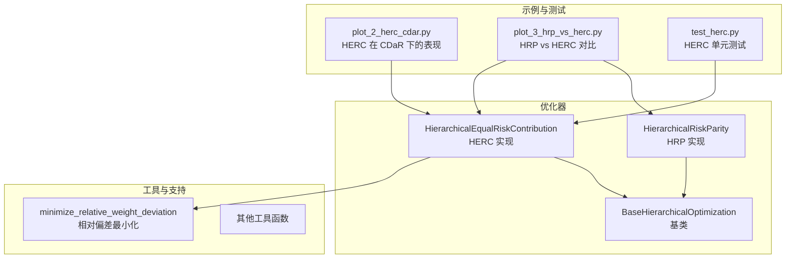
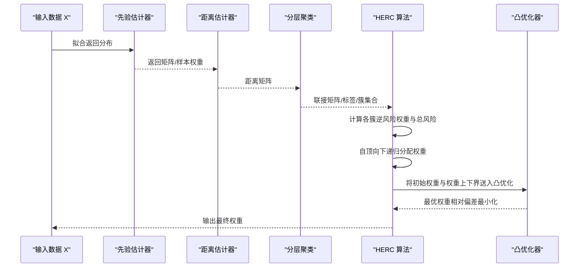
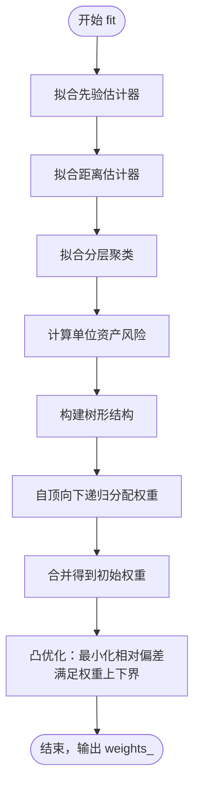
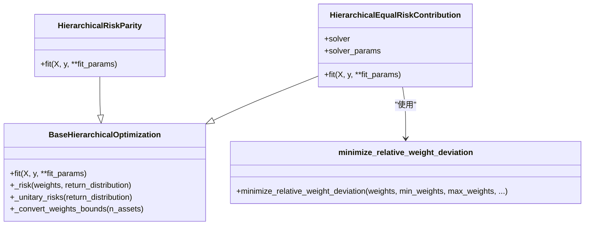

# 分层等风险贡献 (HERC)

<cite>
**本文引用的文件**
- [src/skfolio/optimization/cluster/hierarchical/_herc.py](file://src/skfolio/optimization/cluster/hierarchical/_herc.py)
- [src/skfolio/optimization/cluster/hierarchical/_hrp.py](file://src/skfolio/optimization/cluster/hierarchical/_hrp.py)
- [src/skfolio/optimization/cluster/hierarchical/_base.py](file://src/skfolio/optimization/cluster/hierarchical/_base.py)
- [src/skfolio/utils/stats.py](file://src/skfolio/utils/stats.py)
- [examples/clustering/plot_2_herc_cdar.py](file://examples/clustering/plot_2_herc_cdar.py)
- [examples/clustering/plot_3_hrp_vs_herc.py](file://examples/clustering/plot_3_hrp_vs_herc.py)
- [tests/test_optimization/test_cluster/test_hierarchical/test_herc.py](file://tests/test_optimization/test_cluster/test_hierarchical/test_herc.py)
</cite>

## 目录
1. [引言](#引言)
2. [项目结构](#项目结构)
3. [核心组件](#核心组件)
4. [架构总览](#架构总览)
5. [详细组件分析](#详细组件分析)
6. [依赖关系分析](#依赖关系分析)
7. [性能考量](#性能考量)
8. [故障排查指南](#故障排查指南)
9. [结论](#结论)
10. [附录](#附录)

## 引言
本文件系统化记录分层等风险贡献（Hierarchical Equal Risk Contribution, HERC）优化器的技术细节，重点阐述其在分层风险平价（HRP）基础上引入的关键改进：在递归权重分配阶段引入“风险预算约束”，允许用户为不同资产或资产组设定目标风险贡献比例，从而实现更灵活的风险控制。HERC采用两阶段算法：
- 首先通过分层聚类确定资产结构；
- 然后在每个子集群内求解带风险预算约束的优化子问题。

HERC在保持HRP稳健性的同时，通过最终阶段的凸优化对初始分配施加权重约束，以满足用户的风险预算需求，达到稳健与主动配置之间的平衡。

## 项目结构
HERC位于分层聚类优化模块中，与HRP共享同一基类，但实现细节存在关键差异。示例与测试覆盖了HERC在CDaR风险度量下的表现以及与HRP的对比。

图表来源
- [src/skfolio/optimization/cluster/hierarchical/_herc.py](file://src/skfolio/optimization/cluster/hierarchical/_herc.py#L1-L522)
- [src/skfolio/optimization/cluster/hierarchical/_hrp.py](file://src/skfolio/optimization/cluster/hierarchical/_hrp.py#L1-L490)
- [src/skfolio/optimization/cluster/hierarchical/_base.py](file://src/skfolio/optimization/cluster/hierarchical/_base.py#L1-L474)
- [src/skfolio/utils/stats.py](file://src/skfolio/utils/stats.py#L509-L581)
- [examples/clustering/plot_2_herc_cdar.py](file://examples/clustering/plot_2_herc_cdar.py#L1-L166)
- [examples/clustering/plot_3_hrp_vs_herc.py](file://examples/clustering/plot_3_hrp_vs_herc.py#L1-L227)
- [tests/test_optimization/test_cluster/test_hierarchical/test_herc.py](file://tests/test_optimization/test_cluster/test_hierarchical/test_herc.py#L1-L428)

章节来源
- [src/skfolio/optimization/cluster/hierarchical/_herc.py](file://src/skfolio/optimization/cluster/hierarchical/_herc.py#L1-L522)
- [src/skfolio/optimization/cluster/hierarchical/_hrp.py](file://src/skfolio/optimization/cluster/hierarchical/_hrp.py#L1-L490)
- [src/skfolio/optimization/cluster/hierarchical/_base.py](file://src/skfolio/optimization/cluster/hierarchical/_base.py#L1-L474)

## 核心组件
- HERC 类：实现分层等风险贡献优化，支持多种风险度量（含CDaR），并在递归分配后通过凸优化施加权重约束。
- 基类 BaseHierarchicalOptimization：提供通用的输入清洗、风险度量计算、单位资产风险计算、权重边界转换等能力。
- HRP 类：作为对比基准，展示HERC在递归权重分配阶段引入风险预算约束的差异点。
- 工具函数 minimize_relative_weight_deviation：在HERC中用于将初始逆风险权重调整到满足权重上下界约束的最优解。

章节来源
- [src/skfolio/optimization/cluster/hierarchical/_herc.py](file://src/skfolio/optimization/cluster/hierarchical/_herc.py#L1-L522)
- [src/skfolio/optimization/cluster/hierarchical/_base.py](file://src/skfolio/optimization/cluster/hierarchical/_base.py#L1-L474)
- [src/skfolio/optimization/cluster/hierarchical/_hrp.py](file://src/skfolio/optimization/cluster/hierarchical/_hrp.py#L1-L490)
- [src/skfolio/utils/stats.py](file://src/skfolio/utils/stats.py#L509-L581)

## 架构总览
HERC与HRP共享相同的输入预处理与分层聚类流程，但在递归权重更新阶段存在本质差异：
- HRP：在每次二分切分时，直接将分割因子应用于左右子树权重，并可即时应用权重约束；
- HERC：先按树形拓扑自顶向下递归分配，形成初始逆风险权重组合；随后整体施加权重约束（凸优化）以满足用户设定的风险预算。

图表来源
- [src/skfolio/optimization/cluster/hierarchical/_herc.py](file://src/skfolio/optimization/cluster/hierarchical/_herc.py#L360-L522)
- [src/skfolio/optimization/cluster/hierarchical/_base.py](file://src/skfolio/optimization/cluster/hierarchical/_base.py#L335-L474)
- [src/skfolio/utils/stats.py](file://src/skfolio/utils/stats.py#L509-L581)

## 详细组件分析

### HERC 类：两阶段算法与风险预算约束
- 输入参数与约束
  - 支持多种风险度量（含CDaR），默认使用方差；
  - 权重下界 min_weights 与上界 max_weights 支持标量、字典、数组三种形式，内部统一转换为长度为资产数的一维数组；
  - 交易成本与管理费用可直接纳入预期收益影响；
  - 支持回退策略与错误处理；
  - 可指定求解器与求解器参数。
- 算法流程
  - 拟合先验估计器与距离估计器，生成距离矩阵；
  - 使用分层聚类得到联接矩阵与簇划分；
  - 计算各簇逆风险权重与总风险；
  - 自顶向下递归遍历树节点，按左右子树风险占比分配簇权重；
  - 合并得到初始权重后，调用凸优化将权重调整至满足 min/max 约束（相对偏差最小化）。
- 关键差异点
  - HRP在二分切分时即时应用权重约束；
  - HERC在中间递归阶段不直接施加权重约束，而是在最终阶段通过凸优化进行整体修正，以保证风险贡献比例与初始分配一致。

图表来源
- [src/skfolio/optimization/cluster/hierarchical/_herc.py](file://src/skfolio/optimization/cluster/hierarchical/_herc.py#L360-L522)
- [src/skfolio/utils/stats.py](file://src/skfolio/utils/stats.py#L509-L581)

章节来源
- [src/skfolio/optimization/cluster/hierarchical/_herc.py](file://src/skfolio/optimization/cluster/hierarchical/_herc.py#L1-L522)
- [src/skfolio/utils/stats.py](file://src/skfolio/utils/stats.py#L509-L581)

### 基类 BaseHierarchicalOptimization：通用能力
- 输入清洗与权重边界转换：支持标量、字典、数组三种 min/max_weights 形式，自动填充缺失资产并校验合法性；
- 风险度量计算：根据风险度量类型选择协方差或具体度量；
- 单资产风险计算：用于逆风险权重初始化；
- 元数据路由：支持嵌套估计器的参数传递。

章节来源
- [src/skfolio/optimization/cluster/hierarchical/_base.py](file://src/skfolio/optimization/cluster/hierarchical/_base.py#L1-L474)

### HRP 类：对比参考
- 二分递归：在每次二分时计算左右子树逆风险权重总风险，得到分割因子 alpha，并在该步骤即时应用权重约束；
- SERIATION：对树进行叶子序重排以降低相邻叶子间的距离；
- 与HERC的关键区别：权重约束在中间步骤生效，而非最终阶段。

章节来源
- [src/skfolio/optimization/cluster/hierarchical/_hrp.py](file://src/skfolio/optimization/cluster/hierarchical/_hrp.py#L1-L490)

### 凸优化与权重约束：minimize_relative_weight_deviation
- 目标：在满足权重和上下界约束的前提下，最小化最终权重与初始权重的相对偏差；
- 约束：权重和为1、每个权重在上下界之间；
- 求解：基于CVXPY的二次范数最小化问题；
- 错误处理：当不可行时抛出求解器错误。

章节来源
- [src/skfolio/utils/stats.py](file://src/skfolio/utils/stats.py#L509-L581)

## 依赖关系分析
HERC 与 HRP 共享基类能力，但 HERC 在最终阶段引入凸优化以满足权重约束；HRP 则在二分过程中即时应用权重约束。

图表来源
- [src/skfolio/optimization/cluster/hierarchical/_herc.py](file://src/skfolio/optimization/cluster/hierarchical/_herc.py#L1-L522)
- [src/skfolio/optimization/cluster/hierarchical/_hrp.py](file://src/skfolio/optimization/cluster/hierarchical/_hrp.py#L1-L490)
- [src/skfolio/optimization/cluster/hierarchical/_base.py](file://src/skfolio/optimization/cluster/hierarchical/_base.py#L1-L474)
- [src/skfolio/utils/stats.py](file://src/skfolio/utils/stats.py#L509-L581)

章节来源
- [src/skfolio/optimization/cluster/hierarchical/_herc.py](file://src/skfolio/optimization/cluster/hierarchical/_herc.py#L1-L522)
- [src/skfolio/optimization/cluster/hierarchical/_hrp.py](file://src/skfolio/optimization/cluster/hierarchical/_hrp.py#L1-L490)
- [src/skfolio/optimization/cluster/hierarchical/_base.py](file://src/skfolio/optimization/cluster/hierarchical/_base.py#L1-L474)
- [src/skfolio/utils/stats.py](file://src/skfolio/utils/stats.py#L509-L581)

## 性能考量
- 计算复杂度
  - 分层聚类与距离矩阵：O(N^3) 级别（取决于树构建与链接矩阵）；
  - 逆风险权重与簇风险：O(N^2) 级别；
  - 递归分配：O(N)（按资产数线性）；
  - 凸优化：单次二次规划，规模与资产数相关。
- 求解稳定性
  - 默认求解器具备良好数值稳定性与性能；
  - 当权重上下界过紧导致不可行时，凸优化可能失败，需放宽约束或检查输入。
- 数据准备
  - 使用合适的距离度量与链接方法对HERC结果影响较大（示例中强调Ward优于Single）。

[本节为一般性指导，无需列出具体文件来源]

## 故障排查指南
- 常见错误
  - 风险度量不支持：HERC当前不支持偏度与峰度；
  - 权重上下界非法：下界必须非负且和小于1，上界必须不超过1且和至少为1；
  - 初始权重非法：初始权重必须严格正且和为1；
  - 凸优化不可行：当权重上下界过紧时，可能无可行解。
- 回退机制
  - 支持回退策略与错误处理开关，便于在失败时恢复或记录错误信息。

章节来源
- [src/skfolio/optimization/cluster/hierarchical/_herc.py](file://src/skfolio/optimization/cluster/hierarchical/_herc.py#L380-L420)
- [src/skfolio/optimization/cluster/hierarchical/_base.py](file://src/skfolio/optimization/cluster/hierarchical/_base.py#L395-L451)
- [src/skfolio/utils/stats.py](file://src/skfolio/utils/stats.py#L552-L581)

## 结论
HERC在HRP稳健框架之上，通过在递归分配后引入“风险预算约束”的凸优化，实现了对权重边界的灵活控制，使投资组合在保持稳健性的同时，能够满足用户对不同资产或资产组的目标风险贡献比例。示例与测试表明，HERC在CDaR等风险度量下具有良好的表现，并与HRP相比在平均风险指标上具有一定优势，但稳定性略逊于HRP。

[本节为总结性内容，无需列出具体文件来源]

## 附录

### 参数与约束说明（HERC）
- risk_measure：支持多种风险度量（含CDaR），默认方差；
- prior_estimator：先验估计器，默认经验先验；
- distance_estimator：距离估计器，默认皮尔逊距离；
- hierarchical_clustering_estimator：分层聚类估计器，默认HierarchicalClustering；
- min_weights / max_weights：权重下界/上界，支持标量、字典、数组三种形式，内部统一转换为一维数组；
- transaction_costs / management_fees：线性交易成本与管理费用；
- previous_weights：前一期权重，用于成本计算；
- solver / solver_params：凸优化求解器及其参数；
- portfolio_params：传递给预测结果Portfolio的参数；
- fallback / raise_on_failure：回退策略与错误处理。

章节来源
- [src/skfolio/optimization/cluster/hierarchical/_herc.py](file://src/skfolio/optimization/cluster/hierarchical/_herc.py#L77-L245)
- [src/skfolio/optimization/cluster/hierarchical/_base.py](file://src/skfolio/optimization/cluster/hierarchical/_base.py#L81-L175)

### 示例与对比（CDaR 与 HRP vs HERC）
- CDaR 示例：展示HERC在CDaR风险度量下的权重、风险贡献与树状图结构，并对比不同链接方法与距离度量的影响。
- HRP vs HERC：使用滚动与交叉验证比较两者在CVaR最小化与均值-CVaR比率最大化方面的表现，同时可视化组合构成与分布。

章节来源
- [examples/clustering/plot_2_herc_cdar.py](file://examples/clustering/plot_2_herc_cdar.py#L1-L166)
- [examples/clustering/plot_3_hrp_vs_herc.py](file://examples/clustering/plot_3_hrp_vs_herc.py#L1-L227)
- [tests/test_optimization/test_cluster/test_hierarchical/test_herc.py](file://tests/test_optimization/test_cluster/test_hierarchical/test_herc.py#L1-L428)