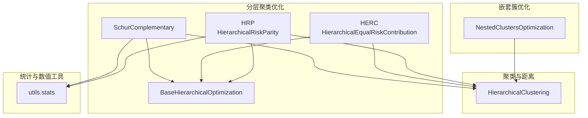
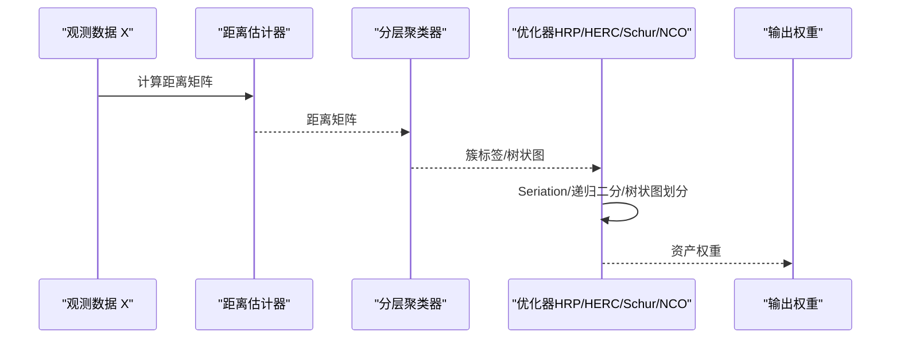
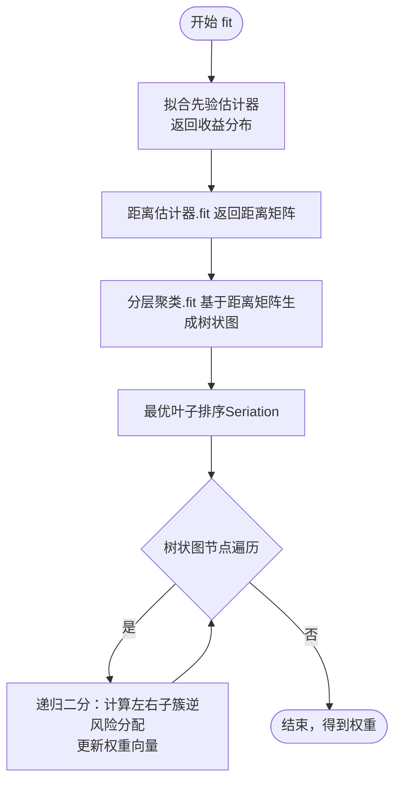
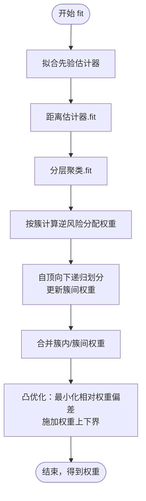
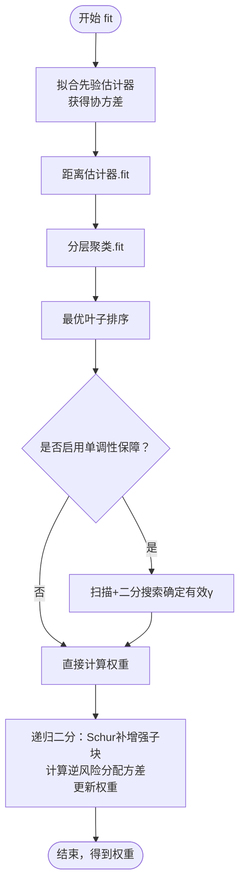
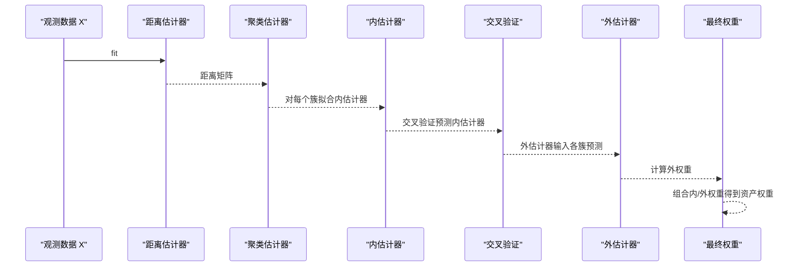
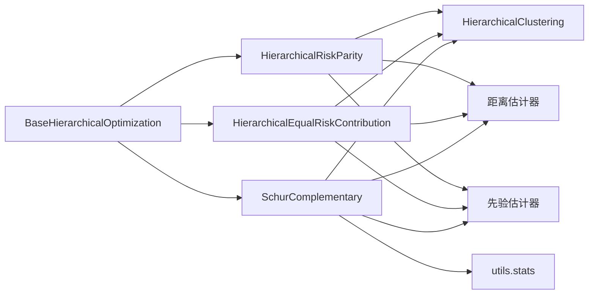

# 分层聚类优化

<cite>
**本文引用的文件列表**
- [src/skfolio/optimization/cluster/hierarchical/_hrp.py](file://src/skfolio/optimization/cluster/hierarchical/_hrp.py)
- [src/skfolio/optimization/cluster/hierarchical/_herc.py](file://src/skfolio/optimization/cluster/hierarchical/_herc.py)
- [src/skfolio/optimization/cluster/hierarchical/_schur.py](file://src/skfolio/optimization/cluster/hierarchical/_schur.py)
- [src/skfolio/optimization/cluster/hierarchical/_base.py](file://src/skfolio/optimization/cluster/hierarchical/_base.py)
- [src/skfolio/optimization/cluster/_nco.py](file://src/skfolio/optimization/cluster/_nco.py)
- [src/skfolio/cluster/_hierarchical.py](file://src/skfolio/cluster/_hierarchical.py)
- [src/skfolio/utils/stats.py](file://src/skfolio/utils/stats.py)
- [examples/clustering/plot_1_hrp_cvar.py](file://examples/clustering/plot_1_hrp_cvar.py)
- [examples/clustering/plot_2_herc_cdar.py](file://examples/clustering/plot_2_herc_cdar.py)
- [examples/clustering/plot_3_hrp_vs_herc.py](file://examples/clustering/plot_3_hrp_vs_herc.py)
- [examples/clustering/plot_4_nco.py](file://examples/clustering/plot_4_nco.py)
- [examples/clustering/plot_5_nco_grid_search.py](file://examples/clustering/plot_5_nco_grid_search.py)
- [examples/clustering/plot_6_schur.py](file://examples/clustering/plot_6_schur.py)
</cite>

## 目录
1. [引言](#引言)
2. [项目结构](#项目结构)
3. [核心组件](#核心组件)
4. [架构总览](#架构总览)
5. [详细组件分析](#详细组件分析)
6. [依赖关系分析](#依赖关系分析)
7. [性能考量](#性能考量)
8. [故障排查指南](#故障排查指南)
9. [结论](#结论)
10. [附录](#附录)

## 引言
本文件系统化梳理并文档化基于分层聚类的投资组合优化方法，覆盖以下主题：
- HRP（分层风险平价）三步流程：距离矩阵计算、树状图构建（凝聚聚类）、递归权重分配；以及在多风险度量下的扩展与权重约束处理。
- HERC（分层等风险贡献）在HRP基础上引入树状图形状驱动的自顶向下划分，并通过二次规划施加权重约束。
- Schur互补优化器在处理因子模型时的数学原理与正则化参数γ的作用机制，以及单调性保障策略。
- NCO（嵌套簇优化）框架如何结合聚类与全局优化以提升稳定性与泛化能力。
- 聚类方法选择、距离度量（如相关性距离）、树状图切割策略对结果的影响，以及在高维数据下的性能表现与建议。

## 项目结构
该模块位于 skfolio.optimization.cluster 下，包含分层聚类优化（HRP、HERC、Schur）与嵌套簇优化（NCO），并配套分层聚类器与统计工具。

图表来源
- [src/skfolio/optimization/cluster/hierarchical/_hrp.py](file://src/skfolio/optimization/cluster/hierarchical/_hrp.py#L1-L490)
- [src/skfolio/optimization/cluster/hierarchical/_herc.py](file://src/skfolio/optimization/cluster/hierarchical/_herc.py#L1-L522)
- [src/skfolio/optimization/cluster/hierarchical/_schur.py](file://src/skfolio/optimization/cluster/hierarchical/_schur.py#L1-L804)
- [src/skfolio/optimization/cluster/hierarchical/_base.py](file://src/skfolio/optimization/cluster/hierarchical/_base.py#L1-L474)
- [src/skfolio/optimization/cluster/_nco.py](file://src/skfolio/optimization/cluster/_nco.py#L1-L447)
- [src/skfolio/cluster/_hierarchical.py](file://src/skfolio/cluster/_hierarchical.py#L1-L390)
- [src/skfolio/utils/stats.py](file://src/skfolio/utils/stats.py#L1-L200)

章节来源
- [src/skfolio/optimization/cluster/hierarchical/_hrp.py](file://src/skfolio/optimization/cluster/hierarchical/_hrp.py#L1-L490)
- [src/skfolio/optimization/cluster/hierarchical/_herc.py](file://src/skfolio/optimization/cluster/hierarchical/_herc.py#L1-L522)
- [src/skfolio/optimization/cluster/hierarchical/_schur.py](file://src/skfolio/optimization/cluster/hierarchical/_schur.py#L1-L804)
- [src/skfolio/optimization/cluster/hierarchical/_base.py](file://src/skfolio/optimization/cluster/hierarchical/_base.py#L1-L474)
- [src/skfolio/optimization/cluster/_nco.py](file://src/skfolio/optimization/cluster/_nco.py#L1-L447)
- [src/skfolio/cluster/_hierarchical.py](file://src/skfolio/cluster/_hierarchical.py#L1-L390)
- [src/skfolio/utils/stats.py](file://src/skfolio/utils/stats.py#L1-L200)

## 核心组件
- 分层聚类优化基类：统一风险度量、先验估计器、距离估计器、分层聚类器、权重上下界转换、风险度量计算与单位资产风险计算。
- HRP：基于距离矩阵与凝聚聚类，Seriation重排叶子节点，递归二分权重分配，支持多风险度量与权重约束。
- HERC：基于树状图形状的自顶向下划分，内部分配采用“逆风险”风险平价，最终通过凸优化施加权重约束。
- Schur互补：以Schur补丁增强子协方差块，插值从HRP（γ=0）到最小方差（γ→1），支持单调性保障与条件数改善。
- NCO：先按簇内估计器拟合得到内权重，再用交叉验证的外估计器在簇间进行权重估计，最终内外权重点积得到资产权重。

章节来源
- [src/skfolio/optimization/cluster/hierarchical/_base.py](file://src/skfolio/optimization/cluster/hierarchical/_base.py#L1-L474)
- [src/skfolio/optimization/cluster/hierarchical/_hrp.py](file://src/skfolio/optimization/cluster/hierarchical/_hrp.py#L1-L490)
- [src/skfolio/optimization/cluster/hierarchical/_herc.py](file://src/skfolio/optimization/cluster/hierarchical/_herc.py#L1-L522)
- [src/skfolio/optimization/cluster/hierarchical/_schur.py](file://src/skfolio/optimization/cluster/hierarchical/_schur.py#L1-L804)
- [src/skfolio/optimization/cluster/_nco.py](file://src/skfolio/optimization/cluster/_nco.py#L1-L447)

## 架构总览
下图展示分层聚类优化与嵌套簇优化的整体交互：先由距离估计器与分层聚类器生成树状图，再由具体优化器执行权重分配；NCO额外引入内/外估计器与交叉验证。

图表来源
- [src/skfolio/optimization/cluster/hierarchical/_hrp.py](file://src/skfolio/optimization/cluster/hierarchical/_hrp.py#L322-L438)
- [src/skfolio/optimization/cluster/hierarchical/_herc.py](file://src/skfolio/optimization/cluster/hierarchical/_herc.py#L360-L521)
- [src/skfolio/optimization/cluster/hierarchical/_schur.py](file://src/skfolio/optimization/cluster/hierarchical/_schur.py#L340-L431)
- [src/skfolio/optimization/cluster/_nco.py](file://src/skfolio/optimization/cluster/_nco.py#L270-L446)

## 详细组件分析

### HRP（分层风险平价）
- 三步流程
  1) 距离矩阵计算：使用距离估计器（默认皮尔逊相关性距离）估计资产共依存度并生成距离矩阵。
  2) 树状图构建：使用分层聚类器（默认Ward法）对距离矩阵进行凝聚聚类，得到树状图与簇标签。
  3) 递归权重分配：对树状图进行最优叶子排序（Seriation），然后自顶向下递归二分，每一步根据两个子簇的“逆风险”分配权重并更新权重向量。
- 风险度量与约束
  - 支持多种风险度量（方差、半方差、CVaR、CDaR、最大回撤等）。
  - 可设置最小/最大权重上下界，并在二分过程中应用权重约束。
- 示例与对比
  - 示例展示了不同链接法（Ward vs Single）与距离度量（Pearson vs Kendall绝对值）对聚类与权重稳定性的影响。

图表来源
- [src/skfolio/optimization/cluster/hierarchical/_hrp.py](file://src/skfolio/optimization/cluster/hierarchical/_hrp.py#L322-L438)

章节来源
- [src/skfolio/optimization/cluster/hierarchical/_hrp.py](file://src/skfolio/optimization/cluster/hierarchical/_hrp.py#L1-L490)
- [examples/clustering/plot_1_hrp_cvar.py](file://examples/clustering/plot_1_hrp_cvar.py#L1-L197)
- [examples/clustering/plot_3_hrp_vs_herc.py](file://examples/clustering/plot_3_hrp_vs_herc.py#L1-L227)

### HERC（分层等风险贡献）
- 核心思想
  - 先为每个簇计算“逆风险”分配下的总簇风险，再自顶向下依据树状图形状进行划分，将簇间权重与簇内权重相乘得到最终权重。
  - 由于利用了树状图结构，对链接法更敏感。
- 权重约束
  - HERC无法在中间步骤直接施加权重约束，因此在完成自顶向下分配后，通过凸优化最小化相对权重偏差，使最终权重在满足线性约束的前提下尽量接近初始分配。
- 示例
  - 展示不同链接法与距离度量对HERC权重集中度与风险贡献的影响。

图表来源
- [src/skfolio/optimization/cluster/hierarchical/_herc.py](file://src/skfolio/optimization/cluster/hierarchical/_herc.py#L360-L521)

章节来源
- [src/skfolio/optimization/cluster/hierarchical/_herc.py](file://src/skfolio/optimization/cluster/hierarchical/_herc.py#L1-L522)
- [examples/clustering/plot_2_herc_cdar.py](file://examples/clustering/plot_2_herc_cdar.py#L1-L166)

### Schur互补优化器
- 数学原理
  - 使用Schur补丁对子协方差块进行增强，插值从HRP（γ=0）到最小方差（γ→1）。
  - 在递归二分中，对左右子簇分别计算“逆风险”分配下的方差作为权重因子，从而更新权重。
- 正则化与单调性
  - 提供单调性保障（keep_monotonic）：通过扫描与二分搜索定位方差停止下降的临界点，确保方差随γ单调下降且不超过HRP方差。
  - 当协方差病态时，可结合先验估计器（如Ledoit-Wolf收缩）或强制SPD（正定）策略提升数值稳定性。
- 示例
  - 展示Schur与HRP、MVO在训练/测试集上的均值-标准差前沿比较，以及超参数γ与距离度量的调优。

图表来源
- [src/skfolio/optimization/cluster/hierarchical/_schur.py](file://src/skfolio/optimization/cluster/hierarchical/_schur.py#L340-L431)
- [src/skfolio/optimization/cluster/hierarchical/_schur.py](file://src/skfolio/optimization/cluster/hierarchical/_schur.py#L434-L636)
- [src/skfolio/optimization/cluster/hierarchical/_schur.py](file://src/skfolio/optimization/cluster/hierarchical/_schur.py#L638-L803)

章节来源
- [src/skfolio/optimization/cluster/hierarchical/_schur.py](file://src/skfolio/optimization/cluster/hierarchical/_schur.py#L1-L804)
- [examples/clustering/plot_6_schur.py](file://examples/clustering/plot_6_schur.py#L1-L341)

### NCO（嵌套簇优化）
- 框架思路
  - 使用距离矩阵与聚类算法（默认分层聚类）形成簇；对每个簇，使用内估计器在整个训练集上拟合得到内权重；随后使用交叉验证得到的内估计器预测作为外估计器的输入，拟合得到外权重；最终资产权重为外权重与内权重的点积。
- 关键点
  - 内估计器：可为任意优化器（如均值-方差、HRP等）。
  - 外估计器：可为任意优化器（如风险预算、等权等）。
  - 交叉验证：避免外估计器的数据泄露，使用“留出样本”的预测作为外估计器输入。
- 示例
  - 展示不同链接法、距离度量与聚类器（HierarchicalClustering/KMeans）对NCO权重与组合稳定性的影响。

图表来源
- [src/skfolio/optimization/cluster/_nco.py](file://src/skfolio/optimization/cluster/_nco.py#L270-L446)

章节来源
- [src/skfolio/optimization/cluster/_nco.py](file://src/skfolio/optimization/cluster/_nco.py#L1-L447)
- [examples/clustering/plot_4_nco.py](file://examples/clustering/plot_4_nco.py#L1-L182)
- [examples/clustering/plot_5_nco_grid_search.py](file://examples/clustering/plot_5_nco_grid_search.py#L1-L195)

## 依赖关系分析
- 分层聚类优化
  - HRP/HERC/Schur均继承自 BaseHierarchicalOptimization，共享风险度量、先验估计器、距离估计器、分层聚类器与权重上下界转换逻辑。
  - HRP与Schur依赖 scipy.cluster.hierarchy 进行最优叶子排序与树状图操作。
  - Schur依赖 utils.stats 中的协方差最近正定、Schur补增强、Cholesky分解判断等工具。
- NCO
  - 依赖 sklearn 的交叉验证与并行工具，对内估计器进行克隆与并行拟合，对外估计器使用交叉验证预测结果作为输入。
  - 聚类器可替换为 sklearn 的 KMeans 等。

图表来源
- [src/skfolio/optimization/cluster/hierarchical/_base.py](file://src/skfolio/optimization/cluster/hierarchical/_base.py#L1-L474)
- [src/skfolio/optimization/cluster/hierarchical/_hrp.py](file://src/skfolio/optimization/cluster/hierarchical/_hrp.py#L1-L490)
- [src/skfolio/optimization/cluster/hierarchical/_herc.py](file://src/skfolio/optimization/cluster/hierarchical/_herc.py#L1-L522)
- [src/skfolio/optimization/cluster/hierarchical/_schur.py](file://src/skfolio/optimization/cluster/hierarchical/_schur.py#L1-L804)
- [src/skfolio/cluster/_hierarchical.py](file://src/skfolio/cluster/_hierarchical.py#L1-L390)
- [src/skfolio/utils/stats.py](file://src/skfolio/utils/stats.py#L1-L200)

章节来源
- [src/skfolio/optimization/cluster/hierarchical/_base.py](file://src/skfolio/optimization/cluster/hierarchical/_base.py#L1-L474)
- [src/skfolio/optimization/cluster/hierarchical/_hrp.py](file://src/skfolio/optimization/cluster/hierarchical/_hrp.py#L1-L490)
- [src/skfolio/optimization/cluster/hierarchical/_herc.py](file://src/skfolio/optimization/cluster/hierarchical/_herc.py#L1-L522)
- [src/skfolio/optimization/cluster/hierarchical/_schur.py](file://src/skfolio/optimization/cluster/hierarchical/_schur.py#L1-L804)
- [src/skfolio/cluster/_hierarchical.py](file://src/skfolio/cluster/_hierarchical.py#L1-L390)
- [src/skfolio/utils/stats.py](file://src/skfolio/utils/stats.py#L1-L200)

## 性能考量
- 聚类与树状图
  - 链接法选择：Ward通常比Single更稳定，减少链式效应；但在HRP中由于仅依赖顺序，权重对链接法不敏感；HERC更依赖树状图结构，对链接法更敏感。
  - 距离度量：Pearson相关性距离与Kendall绝对值距离对聚类形态影响显著，进而影响权重分布与稳定性。
- 高维数据
  - 协方差病态：Schur互补在γ接近1时易受协方差病态影响，建议配合先验估计器（如Ledoit-Wolf收缩）或单调性保障策略。
  - 并行与内存：NCO对内估计器使用并行拟合与交叉验证，注意n_jobs与内存占用；Schur递归二分涉及子块协方差更新，需关注SPD检查与最近正定变换。
- 计算复杂度
  - 距离矩阵与凝聚聚类：O(n^3)级（取决于链接法与距离矩阵大小）。
  - 递归二分/树状图划分：O(n log n)级。
  - Schur互补：每次二分涉及子块Schur补增强与SPD检查，整体近似O(n^3)。

[本节为通用指导，无需列出具体文件来源]

## 故障排查指南
- Schur互补
  - 若出现“无法找到允许的正则化因子γ”，通常意味着协方差严重病态或γ过大。可尝试降低γ、启用单调性保障、或使用先验估计器改善协方差。
  - 若SPD检查失败，可启用force_spd或使用协方差最近正定策略。
- HERC权重约束
  - 若凸优化失败，检查权重上下界是否过紧或存在冲突；必要时放宽约束或调整求解器参数。
- NCO数据泄露
  - 确保外估计器使用的是交叉验证的“留出样本”预测，避免全量数据泄露；若使用CombinatorialCV，注意路径集合的选择与量化指标。
- HRP/HERC链接法
  - Single-linkage可能导致极端集中权重与不稳定分配；优先使用Ward或Complete。

章节来源
- [src/skfolio/optimization/cluster/hierarchical/_schur.py](file://src/skfolio/optimization/cluster/hierarchical/_schur.py#L434-L636)
- [src/skfolio/optimization/cluster/hierarchical/_herc.py](file://src/skfolio/optimization/cluster/hierarchical/_herc.py#L496-L521)
- [src/skfolio/optimization/cluster/_nco.py](file://src/skfolio/optimization/cluster/_nco.py#L379-L446)

## 结论
- HRP、HERC、Schur互补与NCO提供了从“稳健分割”到“树状图结构利用”再到“嵌套估计器融合”的完整分层投资组合优化谱系。
- 实践中应结合数据特性选择合适的距离度量与链接法，并在高维/病态协方差场景下采用先验估计器与单调性保障策略。
- NCO通过内/外估计器分离与交叉验证，有效缓解过拟合并提升稳定性，适合需要结合局部优化与全局权重估计的场景。

[本节为总结性内容，无需列出具体文件来源]

## 附录
- 示例脚本导航
  - HRP（CVaR）：[examples/clustering/plot_1_hrp_cvar.py](file://examples/clustering/plot_1_hrp_cvar.py#L1-L197)
  - HERC（CDaR）：[examples/clustering/plot_2_herc_cdar.py](file://examples/clustering/plot_2_herc_cdar.py#L1-L166)
  - HRP vs HERC：[examples/clustering/plot_3_hrp_vs_herc.py](file://examples/clustering/plot_3_hrp_vs_herc.py#L1-L227)
  - NCO：[examples/clustering/plot_4_nco.py](file://examples/clustering/plot_4_nco.py#L1-L182)
  - NCO网格搜索：[examples/clustering/plot_5_nco_grid_search.py](file://examples/clustering/plot_5_nco_grid_search.py#L1-L195)
  - Schur互补：[examples/clustering/plot_6_schur.py](file://examples/clustering/plot_6_schur.py#L1-L341)

[本节为导航指引，无需列出具体文件来源]