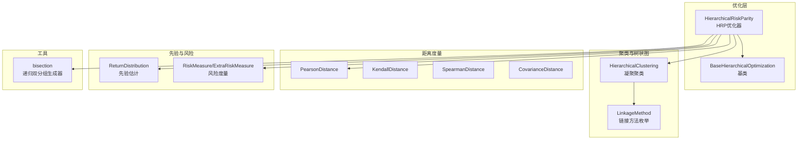
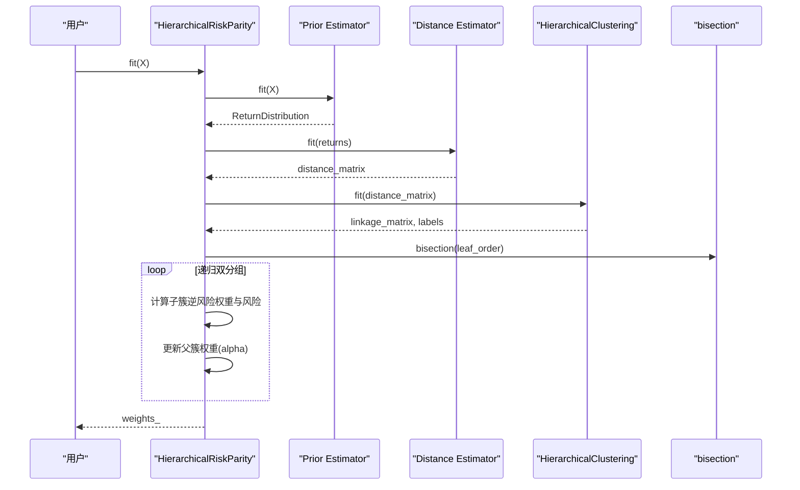
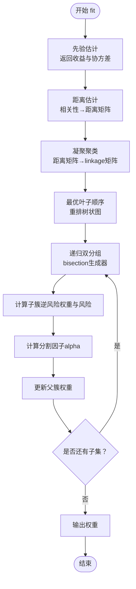
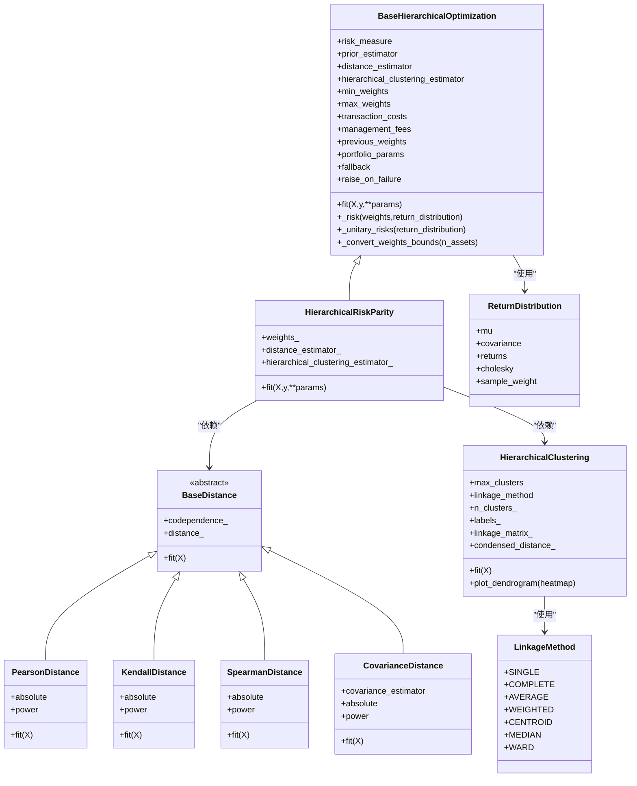
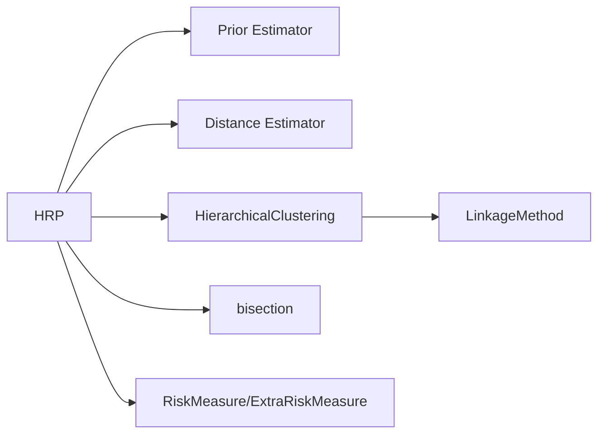

# 分层风险平价 (HRP)

<cite>
**本文引用的文件列表**
- [src/skfolio/optimization/cluster/hierarchical/_hrp.py](file://src/skfolio/optimization/cluster/hierarchical/_hrp.py)
- [src/skfolio/optimization/cluster/hierarchical/_base.py](file://src/skfolio/optimization/cluster/hierarchical/_base.py)
- [src/skfolio/cluster/_hierarchical.py](file://src/skfolio/cluster/_hierarchical.py)
- [src/skfolio/distance/_distance.py](file://src/skfolio/distance/_distance.py)
- [src/skfolio/utils/tools.py](file://src/skfolio/utils/tools.py)
- [examples/clustering/plot_1_hrp_cvar.py](file://examples/clustering/plot_1_hrp_cvar.py)
- [tests/test_optimization/test_cluster/test_hierarchical/test_hrp.py](file://tests/test_optimization/test_cluster/test_hierarchical/test_hrp.py)
- [src/skfolio/prior/_base.py](file://src/skfolio/prior/_base.py)
- [src/skfolio/measures/_measures.py](file://src/skfolio/measures/_measures.py)
</cite>

## 目录
1. [引言](#引言)
2. [项目结构](#项目结构)
3. [核心组件](#核心组件)
4. [架构总览](#架构总览)
5. [详细组件分析](#详细组件分析)
6. [依赖关系分析](#依赖关系分析)
7. [性能考量](#性能考量)
8. [故障排查指南](#故障排查指南)
9. [结论](#结论)
10. [附录](#附录)

## 引言
本文件系统化阐述分层风险平价（Hierarchical Risk Parity, HRP）投资组合优化器的实现原理与使用方法。HRP由Marcos López de Prado提出，其核心思想是：先基于资产收益率的相关性构造距离矩阵，再用凝聚聚类生成树状图（linkage matrix），最后通过递归双分组（recursive bisection）在每个聚类层级上按“逆风险”权重进行再平衡，从而在全局上实现风险均衡。相比传统均值-方差优化，HRP显著降低对输入参数（如期望收益和协方差）的敏感性，尤其适用于高维小样本场景，能提升组合稳定性与外推表现。

本文件还结合示例脚本，演示HRP在条件风险价值（CVaR）风险度量下的应用，并分析输出的投资组合权重分布与风险贡献。

## 项目结构
与HRP相关的关键模块位于以下路径：
- 优化器：src/skfolio/optimization/cluster/hierarchical/_hrp.py
- 基类与通用逻辑：src/skfolio/optimization/cluster/hierarchical/_base.py
- 聚类与树状图：src/skfolio/cluster/_hierarchical.py
- 距离度量：src/skfolio/distance/_distance.py
- 工具函数（递归双分组）：src/skfolio/utils/tools.py
- 示例：examples/clustering/plot_1_hrp_cvar.py
- 测试：tests/test_optimization/test_cluster/test_hierarchical/test_hrp.py
- 先验估计与风险度量：src/skfolio/prior/_base.py、src/skfolio/measures/_measures.py

图表来源
- [src/skfolio/optimization/cluster/hierarchical/_hrp.py](file://src/skfolio/optimization/cluster/hierarchical/_hrp.py#L1-L490)
- [src/skfolio/optimization/cluster/hierarchical/_base.py](file://src/skfolio/optimization/cluster/hierarchical/_base.py#L1-L474)
- [src/skfolio/cluster/_hierarchical.py](file://src/skfolio/cluster/_hierarchical.py#L1-L390)
- [src/skfolio/distance/_distance.py](file://src/skfolio/distance/_distance.py#L1-L587)
- [src/skfolio/utils/tools.py](file://src/skfolio/utils/tools.py#L557-L574)
- [src/skfolio/prior/_base.py](file://src/skfolio/prior/_base.py#L1-L70)
- [src/skfolio/measures/_measures.py](file://src/skfolio/measures/_measures.py#L1-L200)

章节来源
- [src/skfolio/optimization/cluster/hierarchical/_hrp.py](file://src/skfolio/optimization/cluster/hierarchical/_hrp.py#L1-L120)
- [src/skfolio/cluster/_hierarchical.py](file://src/skfolio/cluster/_hierarchical.py#L1-L120)

## 核心组件
- HierarchicalRiskParity：HRP优化器主体，负责三步流程：先估计先验分布，再计算距离矩阵，然后进行凝聚聚类与递归双分组，最终得到权重。
- BaseHierarchicalOptimization：HRP的抽象基类，封装了风险度量、先验估计、距离估计、聚类估计、权重边界处理、元数据路由等通用能力。
- HierarchicalClustering：基于scipy.cluster.hierarchy的凝聚聚类，输出linkage矩阵与标签，支持多种链接方法（如ward、single、complete等）。
- 距离度量：PearsonDistance、KendallDistance、SpearmanDistance、CovarianceDistance等，用于从相关性或协方差构造距离矩阵。
- 工具函数bisection：为递归双分组提供迭代拆分生成器。
- 先验估计ReturnDistribution：封装期望收益、协方差、观测收益等，供风险度量计算使用。
- 风险度量：RiskMeasure/ExtraRiskMeasure覆盖VARIANCE、CVAR、SEMI_VARIANCE、WORST_REALIZATION等多种度量。

章节来源
- [src/skfolio/optimization/cluster/hierarchical/_hrp.py](file://src/skfolio/optimization/cluster/hierarchical/_hrp.py#L29-L120)
- [src/skfolio/optimization/cluster/hierarchical/_base.py](file://src/skfolio/optimization/cluster/hierarchical/_base.py#L29-L120)
- [src/skfolio/cluster/_hierarchical.py](file://src/skfolio/cluster/_hierarchical.py#L22-L108)
- [src/skfolio/distance/_distance.py](file://src/skfolio/distance/_distance.py#L27-L120)
- [src/skfolio/utils/tools.py](file://src/skfolio/utils/tools.py#L557-L574)
- [src/skfolio/prior/_base.py](file://src/skfolio/prior/_base.py#L15-L70)
- [src/skfolio/measures/_measures.py](file://src/skfolio/measures/_measures.py#L133-L200)

## 架构总览
下图展示了HRP从输入到输出的端到端流程：先验估计 → 距离估计 → 凝聚聚类 → 双分组权重分配 → 输出权重。

图表来源
- [src/skfolio/optimization/cluster/hierarchical/_hrp.py](file://src/skfolio/optimization/cluster/hierarchical/_hrp.py#L322-L438)
- [src/skfolio/cluster/_hierarchical.py](file://src/skfolio/cluster/_hierarchical.py#L167-L208)
- [src/skfolio/utils/tools.py](file://src/skfolio/utils/tools.py#L557-L574)

## 详细组件分析

### HRP三步核心流程
- 步骤一：基于资产收益率相关性计算距离矩阵
  - 使用先验估计器（默认经验先验）得到ReturnDistribution，其中包含观测收益。
  - 使用距离估计器（默认Pearson距离）从相关性矩阵构造距离矩阵。
- 步骤二：凝聚聚类构建树状图（linkage matrix）
  - 使用HierarchicalClustering对距离矩阵进行凝聚聚类，支持多种链接方法（如ward、single、complete等）。
  - 通过最优叶子顺序（optimal leaf ordering）对树状图进行重排，使相邻叶节点在时间或相似性上更接近。
- 步骤三：递归双分组（recursive bisection）分配权重
  - 以最优叶子顺序作为初始集合，使用bisection生成器逐层拆分。
  - 对每个子集，计算“逆风险”均匀分配权重，并据此评估左右子簇的风险，得到分割因子alpha，更新父簇权重。
  - 在每一步中应用权重约束（上下界）以保证可行性。

图表来源
- [src/skfolio/optimization/cluster/hierarchical/_hrp.py](file://src/skfolio/optimization/cluster/hierarchical/_hrp.py#L370-L438)
- [src/skfolio/cluster/_hierarchical.py](file://src/skfolio/cluster/_hierarchical.py#L234-L390)
- [src/skfolio/utils/tools.py](file://src/skfolio/utils/tools.py#L557-L574)

章节来源
- [src/skfolio/optimization/cluster/hierarchical/_hrp.py](file://src/skfolio/optimization/cluster/hierarchical/_hrp.py#L322-L438)
- [src/skfolio/cluster/_hierarchical.py](file://src/skfolio/cluster/_hierarchical.py#L167-L208)

### 类关系与职责

图表来源
- [src/skfolio/optimization/cluster/hierarchical/_base.py](file://src/skfolio/optimization/cluster/hierarchical/_base.py#L29-L120)
- [src/skfolio/optimization/cluster/hierarchical/_hrp.py](file://src/skfolio/optimization/cluster/hierarchical/_hrp.py#L29-L120)
- [src/skfolio/cluster/_hierarchical.py](file://src/skfolio/cluster/_hierarchical.py#L22-L108)
- [src/skfolio/distance/_distance.py](file://src/skfolio/distance/_distance.py#L27-L120)
- [src/skfolio/prior/_base.py](file://src/skfolio/prior/_base.py#L15-L70)

章节来源
- [src/skfolio/optimization/cluster/hierarchical/_base.py](file://src/skfolio/optimization/cluster/hierarchical/_base.py#L29-L120)
- [src/skfolio/optimization/cluster/hierarchical/_hrp.py](file://src/skfolio/optimization/cluster/hierarchical/_hrp.py#L29-L120)
- [src/skfolio/cluster/_hierarchical.py](file://src/skfolio/cluster/_hierarchical.py#L22-L108)
- [src/skfolio/distance/_distance.py](file://src/skfolio/distance/_distance.py#L27-L120)
- [src/skfolio/prior/_base.py](file://src/skfolio/prior/_base.py#L15-L70)

### 使用方法与配置要点
- 风险度量选择
  - 支持多种风险度量（如VARIANCE、CVAR、SEMI_VARIANCE、WORST_REALIZATION等）。默认为VARIANCE；示例脚本展示了CVAR的应用。
- 距离度量选择
  - 默认使用PearsonDistance；也可选择KendallDistance、SpearmanDistance或CovarianceDistance，并可设置absolute与power参数以调整相关性到距离的转换。
- 链接方法
  - 默认采用Ward（方差最小化）；示例脚本对比了SINGLE（单链）与Ward的效果，强调前者易受链式效应影响，后者更稳定。
- 权重约束
  - 支持min_weights与max_weights，既可为标量（对所有资产一致），也可为字典或数组（按资产指定）。
- 先验估计器
  - 默认EmpiricalPrior；示例脚本展示了FactorModel的使用。
- 交易成本与管理费
  - 可通过transaction_costs与management_fees参数纳入线性成本，影响预期收益与权重优化。
- 回退机制
  - 支持fallback与raise_on_failure，便于在拟合失败时回退到previous_weights或其他估计器。

章节来源
- [src/skfolio/optimization/cluster/hierarchical/_hrp.py](file://src/skfolio/optimization/cluster/hierarchical/_hrp.py#L53-L212)
- [examples/clustering/plot_1_hrp_cvar.py](file://examples/clustering/plot_1_hrp_cvar.py#L60-L162)
- [src/skfolio/cluster/_hierarchical.py](file://src/skfolio/cluster/_hierarchical.py#L109-L168)

### 实际案例：HRP在CVaR下的应用
示例脚本展示了：
- 数据准备：加载S&P 500与因子数据，计算日度收益。
- 模型创建与拟合：使用CVaR风险度量的HRP模型。
- 风险贡献分析：对训练集预测后绘制CVaR风险贡献图。
- 树状图可视化：展示不同链接方法（Ward vs Single）与不同距离度量（Pearson vs Kendall）对聚类结构的影响。
- 模型比较：与等权基准进行累计收益与组合构成的对比。

章节来源
- [examples/clustering/plot_1_hrp_cvar.py](file://examples/clustering/plot_1_hrp_cvar.py#L1-L197)

## 依赖关系分析
- HRP依赖于先验估计器（返回收益与协方差）、距离估计器（构造距离矩阵）、凝聚聚类（生成linkage矩阵）与工具函数bisection（递归双分组）。
- 风险度量通过Portfolio对象在给定权重与ReturnDistribution下计算，支持多种度量。
- 链接方法通过枚举LinkageMethod控制凝聚聚类行为，Ward通常更稳定。

图表来源
- [src/skfolio/optimization/cluster/hierarchical/_hrp.py](file://src/skfolio/optimization/cluster/hierarchical/_hrp.py#L322-L438)
- [src/skfolio/cluster/_hierarchical.py](file://src/skfolio/cluster/_hierarchical.py#L167-L208)
- [src/skfolio/utils/tools.py](file://src/skfolio/utils/tools.py#L557-L574)

章节来源
- [src/skfolio/optimization/cluster/hierarchical/_hrp.py](file://src/skfolio/optimization/cluster/hierarchical/_hrp.py#L322-L438)
- [src/skfolio/cluster/_hierarchical.py](file://src/skfolio/cluster/_hierarchical.py#L167-L208)

## 性能考量
- 计算复杂度
  - 距离估计：通常为O(n_assets^2)，取决于相关性计算方式。
  - 凝聚聚类：scipy.cluster.hierarchy.linkage的时间复杂度约为O(n^3)（具体取决于实现与数据结构），但实际常数较小且可通过合适的距离矩阵与链接方法优化。
  - 递归双分组：bisection生成器按叶子顺序迭代，每层计算逆风险权重与风险，整体近似O(n_assets^2)。
- 稳定性
  - 使用Ward链接方法通常比Single更稳定，减少链式效应带来的不稳定聚类。
  - 通过最优叶子顺序重排树状图，有助于获得更合理的权重分配。
- 输入参数敏感性
  - HRP通过“逆风险”权重与递归双分组，降低了对协方差估计误差的敏感性，尤其在高维小样本场景下表现更稳健。

[本节为一般性指导，不直接分析具体文件]

## 故障排查指南
- 拟合失败与回退
  - 若fit过程中出现异常，可启用raise_on_failure=False，或配置fallback链路；当fallback成功时，会将权重回填至主估计器，便于追踪。
- 权重边界校验
  - min_weights与max_weights必须满足非负、上限为1、总和约束等要求；若违反，将抛出错误。
- 风险度量限制
  - 不支持某些风险度量（如偏度、峰度），若传入将报错。
- 先验估计器参数传递
  - 通过元数据路由（metadata routing）将参数传递给嵌套估计器（如Prior与Covariance），需确保参数名称与目标估计器一致。

章节来源
- [src/skfolio/optimization/cluster/hierarchical/_hrp.py](file://src/skfolio/optimization/cluster/hierarchical/_hrp.py#L340-L360)
- [src/skfolio/optimization/cluster/hierarchical/_base.py](file://src/skfolio/optimization/cluster/hierarchical/_base.py#L395-L451)
- [tests/test_optimization/test_cluster/test_hierarchical/test_hrp.py](file://tests/test_optimization/test_cluster/test_hierarchical/test_hrp.py#L1-L120)

## 结论
HRP通过“距离矩阵—凝聚聚类—递归双分组”的三步法，在不直接依赖期望收益的情况下，利用资产间的相似性与树状结构实现风险均衡。它有效缓解了传统均值-方差优化对输入参数的敏感性，尤其适合高维小样本场景。示例脚本进一步验证了在CVaR风险度量下的应用效果，并展示了不同距离度量与链接方法对聚类结构与权重稳定性的影响。

[本节为总结性内容，不直接分析具体文件]

## 附录
- 代码示例路径（不含具体代码内容）
  - HRP在CVaR下的完整示例：[examples/clustering/plot_1_hrp_cvar.py](file://examples/clustering/plot_1_hrp_cvar.py#L60-L162)
  - HRP类定义与fit流程：[src/skfolio/optimization/cluster/hierarchical/_hrp.py](file://src/skfolio/optimization/cluster/hierarchical/_hrp.py#L322-L438)
  - 基类通用逻辑（风险度量、权重边界、先验估计）：[src/skfolio/optimization/cluster/hierarchical/_base.py](file://src/skfolio/optimization/cluster/hierarchical/_base.py#L335-L451)
  - 距离度量实现（Pearson/Kendall/Spearman/Covariance）：[src/skfolio/distance/_distance.py](file://src/skfolio/distance/_distance.py#L27-L120)
  - 凝聚聚类与链接方法：[src/skfolio/cluster/_hierarchical.py](file://src/skfolio/cluster/_hierarchical.py#L22-L108)
  - 递归双分组工具函数：[src/skfolio/utils/tools.py](file://src/skfolio/utils/tools.py#L557-L574)
  - 先验估计与ReturnDistribution：[src/skfolio/prior/_base.py](file://src/skfolio/prior/_base.py#L15-L70)
  - 风险度量函数（方差、半方差等）：[src/skfolio/measures/_measures.py](file://src/skfolio/measures/_measures.py#L133-L200)