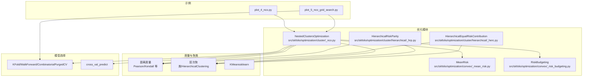
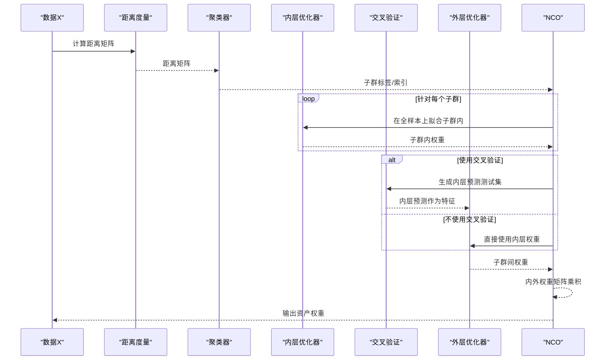
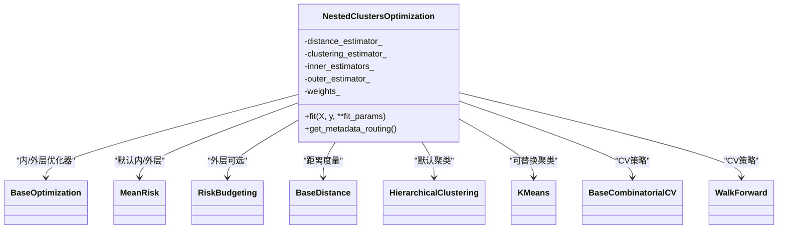
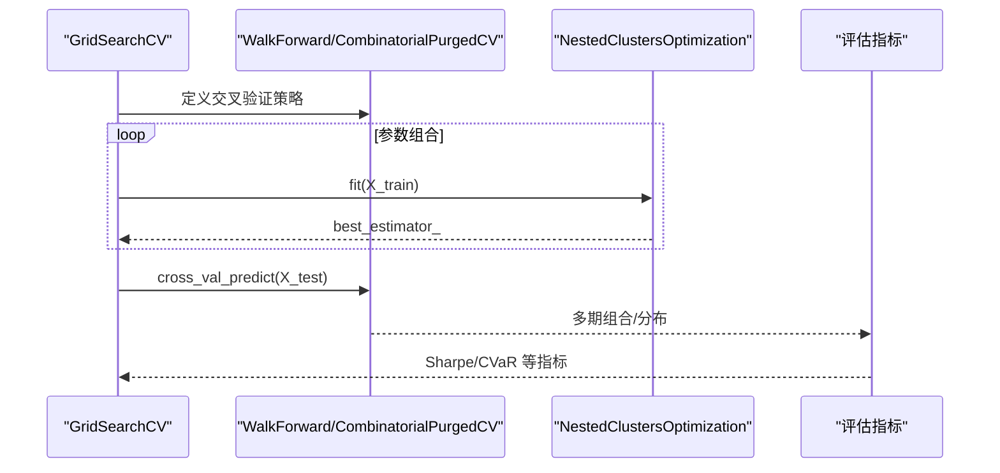
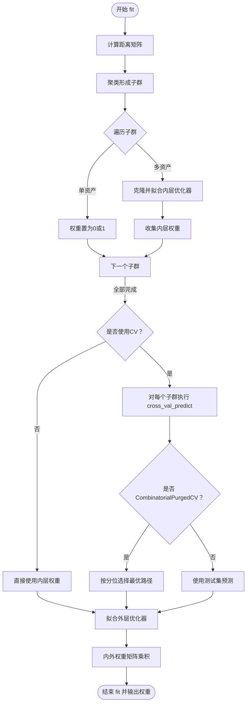
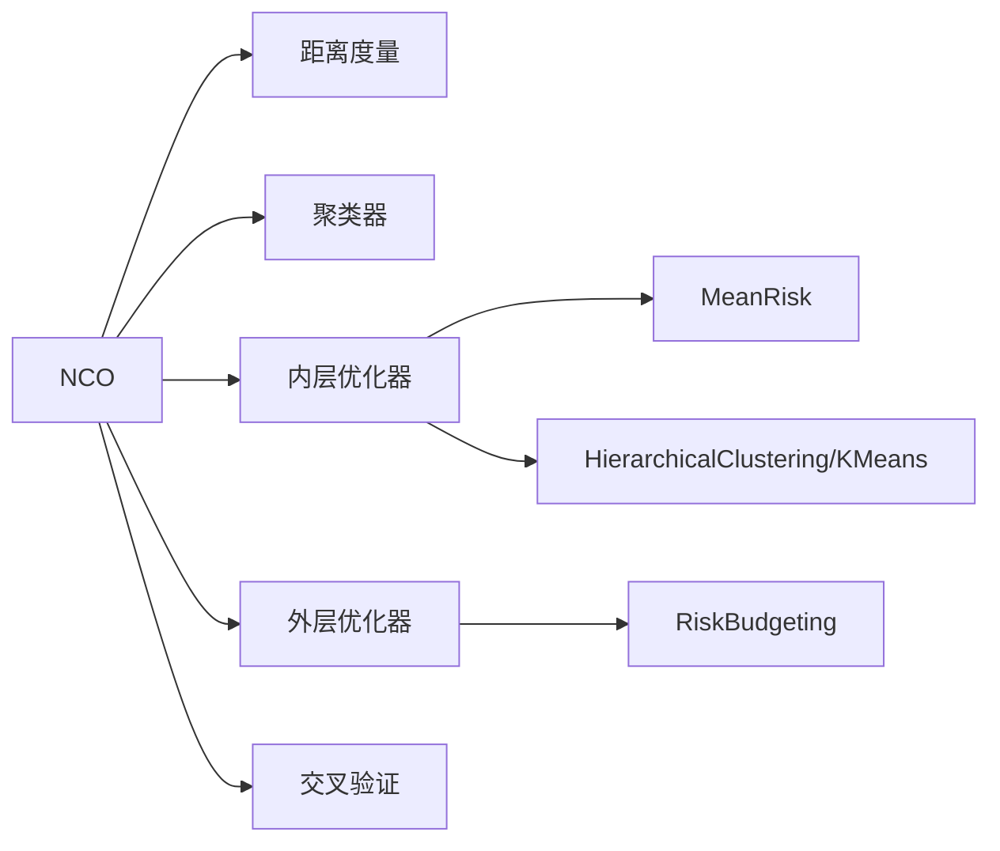

# 嵌套聚类优化 (NCO)

<cite>
**本文引用的文件列表**
- [src/skfolio/optimization/cluster/_nco.py](file://src/skfolio/optimization/cluster/_nco.py)
- [examples/clustering/plot_4_nco.py](file://examples/clustering/plot_4_nco.py)
- [examples/clustering/plot_5_nco_grid_search.py](file://examples/clustering/plot_5_nco_grid_search.py)
- [src/skfolio/optimization/convex/_mean_risk.py](file://src/skfolio/optimization/convex/_mean_risk.py)
- [src/skfolio/optimization/convex/_risk_budgeting.py](file://src/skfolio/optimization/convex/_risk_budgeting.py)
- [src/skfolio/optimization/cluster/hierarchical/_hrp.py](file://src/skfolio/optimization/cluster/hierarchical/_hrp.py)
- [src/skfolio/optimization/cluster/hierarchical/_herc.py](file://src/skfolio/optimization/cluster/hierarchical/_herc.py)
- [src/skfolio/model_selection/_validation.py](file://src/skfolio/model_selection/_validation.py)
- [tests/test_optimization/test_cluster/test_nco.py](file://tests/test_optimization/test_cluster/test_nco.py)
</cite>

## 目录
1. [引言](#引言)
2. [项目结构](#项目结构)
3. [核心组件](#核心组件)
4. [架构总览](#架构总览)
5. [详细组件分析](#详细组件分析)
6. [依赖关系分析](#依赖关系分析)
7. [性能考量](#性能考量)
8. [故障排查指南](#故障排查指南)
9. [结论](#结论)
10. [附录](#附录)

## 引言
本文件系统性阐述 NestedClustersOptimization（NCO）框架的设计理念与实现机制，重点说明其如何通过“聚类-局部优化-全局优化”的三步法缓解传统优化器在噪声数据下的不稳定性：先以距离矩阵驱动资产聚类，再在每个子集群内进行局部优化（内层），随后利用交叉验证得到的内层输出作为特征训练外层全局权重（外层），最终将内外权重相乘得到整体权重。该流程显著降低了协方差矩阵估计误差对最终权重的影响，从而提升投资组合的样本外稳健性。文档还介绍与 HRP/HERC 的集成方式，以及如何使用 GridSearchCV 对超参数（如聚类数量、局部优化目标）进行调优；并结合 examples/clustering/plot_4_nco.py 与 plot_5_nco_grid_search.py 中的示例，演示在最小化 CVaR 目标下的完整流程，分析其在不同市场环境下的表现优势。

## 项目结构
NCO 属于优化模块中的“聚类型优化”，位于 skfolio.optimization.cluster 下，同时依赖距离度量、聚类算法、凸优化器（如 MeanRisk）、风险预算（RiskBudgeting）等组件。示例脚本位于 examples/clustering，分别展示 NCO 的基础用法与网格搜索超参数调优。

图表来源
- [src/skfolio/optimization/cluster/_nco.py](file://src/skfolio/optimization/cluster/_nco.py#L1-L210)
- [src/skfolio/optimization/convex/_mean_risk.py](file://src/skfolio/optimization/convex/_mean_risk.py#L1-L120)
- [src/skfolio/optimization/convex/_risk_budgeting.py](file://src/skfolio/optimization/convex/_risk_budgeting.py#L1-L120)
- [src/skfolio/optimization/cluster/hierarchical/_hrp.py](file://src/skfolio/optimization/cluster/hierarchical/_hrp.py#L1-L120)
- [src/skfolio/optimization/cluster/hierarchical/_herc.py](file://src/skfolio/optimization/cluster/hierarchical/_herc.py#L1-L120)
- [src/skfolio/model_selection/_validation.py](file://src/skfolio/model_selection/_validation.py#L1-L120)
- [examples/clustering/plot_4_nco.py](file://examples/clustering/plot_4_nco.py#L1-L120)
- [examples/clustering/plot_5_nco_grid_search.py](file://examples/clustering/plot_5_nco_grid_search.py#L1-L120)

章节来源
- [src/skfolio/optimization/cluster/_nco.py](file://src/skfolio/optimization/cluster/_nco.py#L1-L210)
- [examples/clustering/plot_4_nco.py](file://examples/clustering/plot_4_nco.py#L1-L120)
- [examples/clustering/plot_5_nco_grid_search.py](file://examples/clustering/plot_5_nco_grid_search.py#L1-L120)

## 核心组件
- NestedClustersOptimization（NCO）
  - 聚类阶段：基于距离矩阵（默认皮尔逊距离）与聚类算法（默认层次聚类，可替换为 KMeans 等）形成资产子群。
  - 内层局部优化：对每个子群独立拟合内层优化器（默认 MeanRisk），得到子群内权重。
  - 外层全局优化：使用交叉验证生成的内层预测作为特征，训练外层优化器（默认 MeanRisk 或 RiskBudgeting），得到跨子群权重。
  - 最终权重：内外权重矩阵乘积，得到整体资产权重。
- 内层/外层优化器
  - 内层常用 MeanRisk（支持多种风险度量，包括 CVaR），外层常用 MeanRisk 或 RiskBudgeting。
- 距离度量与聚类
  - 距离度量：PearsonDistance、KendallDistance 等；聚类：HierarchicalClustering、KMeans 等。
- 模型选择与评估
  - 支持 KFold、WalkForward、CombinatorialPurgedCV 等；通过 cross_val_predict 生成多期组合预测，用于回测与分布分析。

章节来源
- [src/skfolio/optimization/cluster/_nco.py](file://src/skfolio/optimization/cluster/_nco.py#L38-L120)
- [src/skfolio/optimization/convex/_mean_risk.py](file://src/skfolio/optimization/convex/_mean_risk.py#L1-L120)
- [src/skfolio/optimization/convex/_risk_budgeting.py](file://src/skfolio/optimization/convex/_risk_budgeting.py#L1-L120)
- [src/skfolio/model_selection/_validation.py](file://src/skfolio/model_selection/_validation.py#L1-L120)

## 架构总览
NCO 的整体流程如下：输入价格收益 → 计算距离矩阵 → 聚类 → 内层优化（按子群）→ 外层优化（基于内层预测）→ 权重合成。

图表来源
- [src/skfolio/optimization/cluster/_nco.py](file://src/skfolio/optimization/cluster/_nco.py#L270-L447)
- [src/skfolio/model_selection/_validation.py](file://src/skfolio/model_selection/_validation.py#L35-L120)

## 详细组件分析

### NCO 类设计与实现要点
- 参数与职责
  - inner_estimator：子群内优化器，默认 MeanRisk。
  - outer_estimator：子群间优化器，默认 MeanRisk 或 RiskBudgeting。
  - distance_estimator：距离度量，默认 PearsonDistance。
  - clustering_estimator：聚类算法，默认 HierarchicalClustering，也可使用 sklearn 的 KMeans。
  - cv：交叉验证策略，默认 KFold；支持 "ignore"、CombinatorialPurgedCV、WalkForward 等。
  - quantile/quantile_measure：当使用 CombinatorialPurgedCV 时，用于从多路径中选择特定分位的路径。
  - n_jobs/verbose/portfolio_params/fallback/previous_weights/raise_on_failure：并行、日志、回测参数与容错策略。
- 关键流程
  - 距离矩阵计算与聚类：使用距离度量拟合并生成距离矩阵，再由聚类器给出标签，划分子群。
  - 内层权重：对每个包含多只资产的子群，克隆并拟合内层优化器，收集其 weights_；单资产子群直接赋值。
  - 外层权重：若 cv="ignore"，直接使用内层权重；否则对每个子群执行 cross_val_predict，得到测试集上的内层预测，作为外层输入；对于 CombinatorialPurgedCV，按指定分位选择最优路径。
  - 权重合成：外层权重与内层权重矩阵相乘，得到最终资产权重。
- 错误处理与回退
  - 支持 fallback 机制，失败后可回退到 previous_weights 或其他备选优化器，并记录 fallback_chain_ 便于追踪。

图表来源
- [src/skfolio/optimization/cluster/_nco.py](file://src/skfolio/optimization/cluster/_nco.py#L1-L210)
- [src/skfolio/optimization/convex/_mean_risk.py](file://src/skfolio/optimization/convex/_mean_risk.py#L1-L120)
- [src/skfolio/optimization/convex/_risk_budgeting.py](file://src/skfolio/optimization/convex/_risk_budgeting.py#L1-L120)

章节来源
- [src/skfolio/optimization/cluster/_nco.py](file://src/skfolio/optimization/cluster/_nco.py#L251-L447)

### 与 HRP/HERC 的集成方式
- HRP/HERC 本身是基于层次聚类的优化方法，NCO 可以将它们作为内层或外层优化器：
  - 将 HierarchicalRiskParity 或 HierarchicalEqualRiskContribution 作为 inner_estimator，先在子群内做稳健分配，再在外层聚合。
  - 将 RiskBudgeting 作为 outer_estimator，使跨子群权重按风险预算约束进行分配。
- 示例中展示了将 MeanRisk（内层）与 RiskBudgeting（外层）组合，以及使用不同距离度量与聚类方法的对比。

章节来源
- [src/skfolio/optimization/cluster/hierarchical/_hrp.py](file://src/skfolio/optimization/cluster/hierarchical/_hrp.py#L1-L120)
- [src/skfolio/optimization/cluster/hierarchical/_herc.py](file://src/skfolio/optimization/cluster/hierarchical/_herc.py#L1-L120)
- [examples/clustering/plot_4_nco.py](file://examples/clustering/plot_4_nco.py#L60-L120)

### 超参数调优与 GridSearchCV
- 可调超参数
  - 内层风险度量：如 VARIANCE、CVAR 等。
  - 外层优化器：如 EqualWeighted、RiskBudgeting 等。
  - 聚类方法：LinkageMethod（如 SINGLE、WARD）。
  - 距离度量：PearsonDistance、KendallDistance 等。
- 调优策略
  - 使用 GridSearchCV 结合 WalkForward 进行滚动训练/测试，最大化 Sharpe Ratio 等指标。
  - 使用 CombinatorialPurgedCV 进行更稳健的路径采样，配合 cross_val_predict 分析分布。

图表来源
- [examples/clustering/plot_5_nco_grid_search.py](file://examples/clustering/plot_5_nco_grid_search.py#L60-L120)
- [src/skfolio/model_selection/_validation.py](file://src/skfolio/model_selection/_validation.py#L35-L120)

章节来源
- [examples/clustering/plot_5_nco_grid_search.py](file://examples/clustering/plot_5_nco_grid_search.py#L60-L120)

### 在最小化 CVaR 目标下的完整流程
- 示例 plot_4_nco.py 展示了：
  - 数据加载与划分（S&P 500 20 股票）。
  - 内层使用 MeanRisk（最大化比率，风险度量为 VARIANCE），外层使用 RiskBudgeting（风险度量为 CVaR）。
  - 绘制树状图与热力图，分析聚类结构。
  - 使用 EqualWeighted 作为基准，比较不同聚类方法与距离度量的效果。
- 示例 plot_5_nco_grid_search.py 展示了：
  - 使用 WalkForward 与 GridSearchCV 寻找最优参数组合。
  - 使用 CombinatorialPurgedCV 生成多路径测试集，绘制分布与统计摘要。

章节来源
- [examples/clustering/plot_4_nco.py](file://examples/clustering/plot_4_nco.py#L60-L182)
- [examples/clustering/plot_5_nco_grid_search.py](file://examples/clustering/plot_5_nco_grid_search.py#L1-L195)

### 算法流程与决策逻辑

图表来源
- [src/skfolio/optimization/cluster/_nco.py](file://src/skfolio/optimization/cluster/_nco.py#L320-L447)
- [src/skfolio/model_selection/_validation.py](file://src/skfolio/model_selection/_validation.py#L35-L120)

## 依赖关系分析
- 组件耦合
  - NCO 依赖距离度量与聚类器以形成子群；依赖内/外层优化器以分别在子群内与子群间求解；依赖 CV 工具以避免过拟合并减少数据泄漏。
- 外部依赖
  - sklearn 的交叉验证与并行工具（用于并行拟合与预测）。
  - cvxpy（用于凸优化器，如 MeanRisk、RiskBudgeting）。
- 循环依赖
  - 未发现循环导入；NCO 仅单向依赖各组件。

图表来源
- [src/skfolio/optimization/cluster/_nco.py](file://src/skfolio/optimization/cluster/_nco.py#L251-L447)
- [src/skfolio/optimization/convex/_mean_risk.py](file://src/skfolio/optimization/convex/_mean_risk.py#L1-L120)
- [src/skfolio/optimization/convex/_risk_budgeting.py](file://src/skfolio/optimization/convex/_risk_budgeting.py#L1-L120)

章节来源
- [src/skfolio/optimization/cluster/_nco.py](file://src/skfolio/optimization/cluster/_nco.py#L251-L447)

## 性能考量
- 并行化
  - 通过 n_jobs 并行拟合内层优化器与交叉验证预测，显著缩短训练时间。
- 数据泄漏防护
  - 外层优化使用交叉验证生成的“出样”预测，避免使用训练期内部信息，降低过拟合风险。
- 协方差估计稳健性
  - 通过子群内优化与外层聚合，减少协方差矩阵估计误差对整体权重的影响，提升样本外稳定性。
- 聚类与距离度量
  - 不同距离度量与聚类方法对结果影响较大，建议在训练集上进行网格搜索选择最佳组合。

[本节为通用指导，无需列出具体文件来源]

## 故障排查指南
- 常见问题
  - 内层优化失败：启用 fallback 机制，必要时回退到 previous_weights 或其他备选优化器。
  - 聚类不稳定：尝试不同的 LinkageMethod（如 WARD）与距离度量（如 KendallDistance）。
  - CV 设置导致随机性差异：为 CombinatorialPurgedCV 显式设置随机种子，确保可复现。
- 测试覆盖
  - 单元测试覆盖了 NCO 在不同 CV 策略、并行配置与约束条件下的行为一致性。

章节来源
- [tests/test_optimization/test_cluster/test_nco.py](file://tests/test_optimization/test_cluster/test_nco.py#L32-L248)
- [src/skfolio/optimization/cluster/_nco.py](file://src/skfolio/optimization/cluster/_nco.py#L120-L210)

## 结论
NCO 通过“聚类-局部优化-全局优化”的三层结构，有效缓解了噪声数据对优化结果的扰动，提升了样本外稳健性。其与 HRP/HERC 的灵活集成，以及与多种距离度量、聚类方法的兼容，使得在不同市场环境下均可找到稳健的权重配置。借助 GridSearchCV 与多路径 CV（如 CombinatorialPurgedCV），可在训练集上系统地搜索超参数，获得更具鲁棒性的模型，并通过 cross_val_predict 生成多期组合进行回测与分布分析。

[本节为总结性内容，无需列出具体文件来源]

## 附录
- 示例参考
  - plot_4_nco.py：展示 NCO 的基本用法、聚类可视化与不同距离/聚类方法的对比。
  - plot_5_nco_grid_search.py：展示 GridSearchCV 与多路径 CV 的使用，以及分布分析与统计摘要。

章节来源
- [examples/clustering/plot_4_nco.py](file://examples/clustering/plot_4_nco.py#L1-L182)
- [examples/clustering/plot_5_nco_grid_search.py](file://examples/clustering/plot_5_nco_grid_search.py#L1-L195)